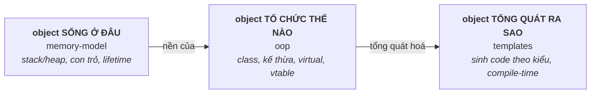

# 01 — C/C++ Fundamentals

Nền tảng ngôn ngữ C/C++ — phần được hỏi nhiều nhất trong phỏng vấn Embedded/System. Hiểu chắc topic này là điều kiện để học tốt Modern C++, OS và Debugging.

## 🗺️ Bức tranh tổng thể

> **Sợi chỉ đỏ:** Hiểu C++ nền tảng = trả lời ba câu hỏi về object: *sống ở đâu, tổ chức thế nào, tổng quát ra sao.*

- **`memory-model` là nền của tất cả:** `vtable`/`vptr` trong `oop` chỉ hiểu được khi đã nắm layout bộ nhớ; lỗi con trỏ/lifetime là gốc của hầu hết bug C++.
- **`oop` → `templates`:** template tổng quát hoá class/hàm theo kiểu; hiểu class trước thì hiểu class template dễ hơn.
- **Liên kết lên tầng trên:** memory model dẫn thẳng tới RAII & smart pointer ([02](../02-modern-cpp/)); vtable giải thích chi phí đa hình và vì sao C++ ABI nhạy cảm ([07](../07-shared-libraries/abi-versioning.md)).
- **Câu hỏi tổng hợp:** *"Khi gọi một hàm virtual qua con trỏ base, điều gì xảy ra ở mức bộ nhớ?"* — buộc nối `memory-model` + `oop`.

## Tài liệu trong topic

| # | File | Nội dung | Trạng thái |
|---|------|----------|-----------|
| 1 | [memory-model.md](memory-model.md) | Bộ nhớ chương trình: stack/heap/data/bss/text, con trỏ vs tham chiếu, lifetime, undefined behavior | ✅ |
| 2 | [oop.md](oop.md) | class/struct, kế thừa, `virtual`, vtable/vptr, abstract class, đa hình | ✅ |
| 3 | [templates.md](templates.md) | function/class template, instantiation, specialization, generic programming | ✅ |

## Thứ tự đọc gợi ý
`memory-model` → `oop` → `templates`. Memory model là nền cho mọi thứ; vtable trong OOP cần hiểu layout bộ nhớ; template hiểu rõ hơn khi đã nắm class.

## Liên kết
- Câu hỏi phỏng vấn: [11-interview-questions/cpp.md](../11-interview-questions/cpp.md)
- Nối tiếp: [02-modern-cpp/](../02-modern-cpp/)
