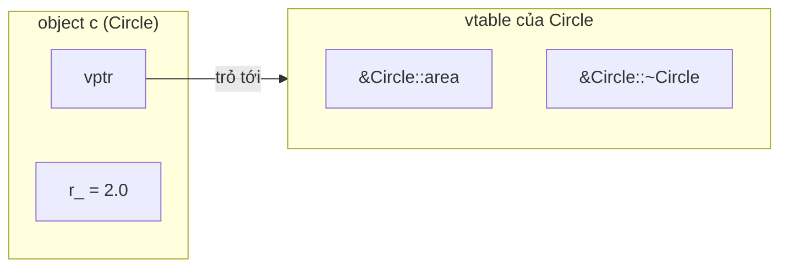
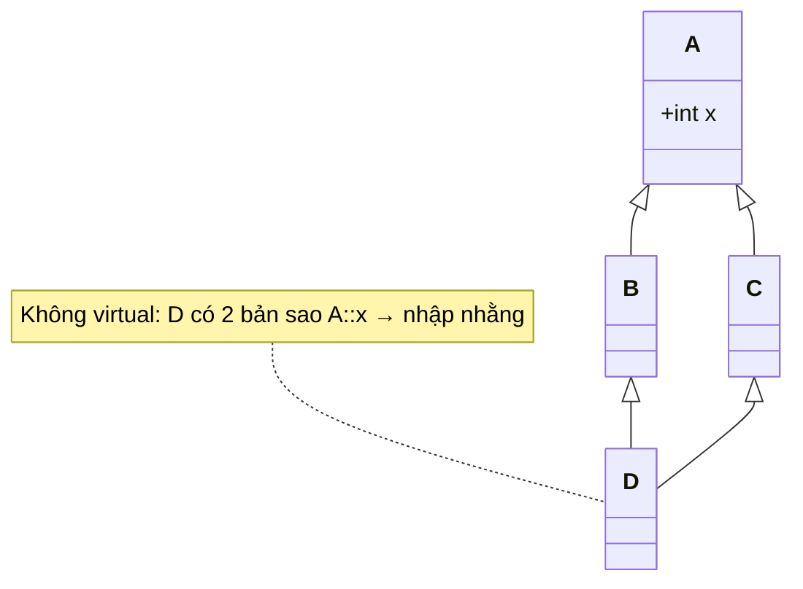

# OOP trong C++ — Class, kế thừa, đa hình, vtable

> **TL;DR**
> - `class` và `struct` giống hệt nhau, chỉ khác mặc định: `struct` là `public`, `class` là `private`.
> - **Đa hình runtime** đạt được qua hàm `virtual` + con trỏ/tham chiếu tới base. Cơ chế: mỗi object có `vptr` trỏ tới **vtable** của class — bảng các con trỏ hàm virtual.
> - **Luôn để destructor của base class là `virtual`** nếu định xóa object con qua con trỏ base. Quên = UB/leak.
> - 4 trụ cột OOP: Encapsulation, Abstraction, Inheritance, Polymorphism — nhưng hiểu *cơ chế* (vtable, slicing) quan trọng hơn thuộc lòng định nghĩa.

---

## 1. class vs struct

```cpp
struct Point { int x, y; };          // x, y mặc định public
class  Widget { int id; };           // id mặc định private
```

Khác biệt duy nhất: **default access** (struct: public, class: private) và default inheritance. Quy ước thực tế: dùng `struct` cho dữ liệu thuần (POD, không invariant), `class` cho kiểu có hành vi/đóng gói.

---

## 2. Encapsulation & Abstraction

- **Encapsulation:** gom dữ liệu + hành vi, ẩn chi tiết bằng `private`/`protected`, lộ interface tối thiểu qua `public`. Mục đích: bảo vệ invariant, giảm coupling.
- **Abstraction:** người dùng class chỉ cần biết *làm được gì* (interface), không cần biết *làm thế nào* (implementation).

```cpp
class Temperature {
public:
    void setCelsius(double c) { if (c >= -273.15) celsius_ = c; }  // bảo vệ invariant
    double fahrenheit() const { return celsius_ * 9.0/5.0 + 32; }
private:
    double celsius_ = 0;   // ẩn chi tiết lưu trữ
};
```

---

## 3. Kế thừa (Inheritance)

```cpp
class Base { /* ... */ };
class Derived : public Base { /* ... */ };   // "is-a": Derived là một Base
```

- `public` inheritance = quan hệ **is-a** (dùng phổ biến nhất).
- `protected`/`private` inheritance hiếm dùng (gần với "implemented-in-terms-of"); thường nên ưu tiên **composition** (has-a) hơn kế thừa.
- **Composition over inheritance:** kế thừa tạo coupling chặt; nếu chỉ cần tái sử dụng code, hãy *chứa* object thay vì kế thừa.

---

## 4. Đa hình (Polymorphism) & `virtual`

Đa hình runtime: gọi đúng hàm của lớp con thông qua con trỏ/tham chiếu kiểu lớp cha.

```cpp
class Shape {
public:
    virtual double area() const { return 0; }   // virtual → có thể override
    virtual ~Shape() = default;                  // ⚠️ virtual destructor — bắt buộc!
};

class Circle : public Shape {
    double r_;
public:
    explicit Circle(double r) : r_(r) {}
    double area() const override { return 3.14159 * r_ * r_; }  // 'override' giúp bắt lỗi
};

void printArea(const Shape& s) {   // nhận base ref
    std::cout << s.area();         // gọi đúng Circle::area() lúc runtime — đa hình
}
```

- Từ khóa **`override`** (C++11): bảo compiler kiểm tra rằng bạn thật sự override một hàm virtual của base. Sai chữ ký → lỗi biên dịch (rất nên dùng).
- **`final`**: cấm override tiếp / cấm kế thừa tiếp.
- Đa hình **chỉ hoạt động qua con trỏ hoặc reference**, không qua object trị giá (→ object slicing, mục 7).

---

## 5. Cơ chế bên trong: vtable & vptr

Khi một class có hàm virtual, compiler tạo một **vtable** (virtual table) cho class đó — mảng các con trỏ tới phiên bản hàm virtual đúng của class. Mỗi **object** chứa thêm một con trỏ ẩn **vptr** trỏ tới vtable của class nó.


*(Mỗi object chứa `vptr` trỏ tới vtable của class nó; gọi hàm virtual = tra vtable qua vptr rồi gọi — dynamic dispatch.)*

Lời gọi `s.area()` qua `Shape&`:
1. Lấy `vptr` từ object.
2. Tra vtable tại slot của `area`.
3. Gọi con trỏ hàm tìm được → ra `Circle::area`.

Đây là **dynamic dispatch**. Hệ quả:
- Có chi phí: thêm 1 con trỏ/object (vptr) + 1 lần gián tiếp khi gọi (thường không inline được). Với embedded/realtime cần cân nhắc.
- Hàm **không virtual** được giải quyết lúc biên dịch (**static dispatch**), nhanh hơn, inline được.

---

## 6. Virtual destructor — lỗi kinh điển

```cpp
class Base { public: ~Base() {} };          // ❌ KHÔNG virtual
class Derived : public Base {
    int* data_ = new int[100];
public:
    ~Derived() { delete[] data_; }
};

Base* p = new Derived();
delete p;   // ❌ chỉ gọi ~Base() → ~Derived() KHÔNG chạy → leak data_ (UB)
```

**Quy tắc:** nếu một class được dùng làm base class đa hình (xóa object con qua con trỏ base), destructor của base **phải** `virtual`. Sửa: `virtual ~Base() = default;`.

---

## 7. Object slicing

```cpp
Circle c(2.0);
Shape s = c;        // ❌ copy theo trị giá kiểu Shape → phần Circle bị "cắt" mất
s.area();           // gọi Shape::area, KHÔNG phải Circle::area
```

Khi gán object lớp con cho **object trị giá** lớp cha, phần dữ liệu riêng của lớp con bị mất và đa hình không còn. Tránh bằng cách luôn dùng con trỏ/reference (`Shape&`, `Shape*`) cho đa hình.

---

## 8. Abstract class & pure virtual

```cpp
class Drawable {
public:
    virtual void draw() const = 0;          // pure virtual → abstract class
    virtual ~Drawable() = default;
};
// Drawable d;          // ❌ không thể tạo instance của abstract class
class Button : public Drawable {
public:
    void draw() const override { /* ... */ }   // phải implement mới instantiate được
};
```

- `= 0` tạo **pure virtual function**; class chứa nó là **abstract** (không tạo object trực tiếp được), đóng vai trò **interface**.
- C++ không có từ khóa `interface`; interface = abstract class chỉ gồm pure virtual + virtual destructor.

---

## 9. Đa kế thừa & vấn đề kim cương (diamond)

```cpp
class A { public: int x; };
class B : public A {};
class C : public A {};
class D : public B, public C {};   // D có 2 bản sao A::x → nhập nhằng

// Giải: virtual inheritance
class B : public virtual A {};
class C : public virtual A {};
class D : public B, public C {};   // chỉ còn 1 bản A
```


*(D kế thừa A qua cả B và C → nhập nhằng `A::x`. `virtual inheritance` (B, C kế thừa `virtual A`) làm D chỉ còn một bản A duy nhất.)*

Đa kế thừa mạnh nhưng dễ phức tạp; thực tế hạn chế dùng, chủ yếu để implement nhiều interface (abstract class).

---

## Câu hỏi phỏng vấn liên quan

<details><summary>1) class và struct trong C++ khác nhau thế nào?</summary>

Chỉ khác mặc định access và inheritance: `struct` mặc định `public`, `class` mặc định `private`. Mọi tính năng khác (method, kế thừa, virtual...) đều dùng được cho cả hai. Quy ước: `struct` cho dữ liệu thuần, `class` cho kiểu có đóng gói/hành vi.
</details>

<details><summary>2) Đa hình runtime hoạt động thế nào ở mức cơ chế?</summary>

Qua `virtual` function + vtable/vptr. Mỗi class có hàm virtual sẽ có một vtable (mảng con trỏ tới phiên bản hàm virtual đúng của class). Mỗi object chứa một vptr ẩn trỏ tới vtable của class nó. Khi gọi hàm virtual qua con trỏ/reference base, runtime lấy vptr → tra vtable → gọi đúng hàm của lớp thực (dynamic dispatch). Chi phí: 1 con trỏ/object và 1 lần gián tiếp khi gọi, thường không inline được.
</details>

<details><summary>3) Vì sao destructor của base class nên là virtual?</summary>

Nếu xóa một object lớp con qua con trỏ kiểu base (`Base* p = new Derived; delete p;`) mà destructor base không virtual, chỉ `~Base()` được gọi, `~Derived()` bị bỏ qua → tài nguyên của lớp con không được giải phóng (leak) và đây là Undefined Behavior. Để base class đa hình thì destructor phải virtual.
</details>

<details><summary>4) Object slicing là gì?</summary>

Khi gán/copy một object lớp con vào một object **trị giá** kiểu lớp cha, phần dữ liệu riêng của lớp con bị "cắt" bỏ, chỉ giữ phần lớp cha; đa hình cũng mất (gọi hàm của base). Xảy ra vì object base có kích thước cố định. Tránh bằng cách dùng con trỏ/reference base thay vì object trị giá.
</details>

<details><summary>5) Pure virtual function và abstract class là gì? C++ có interface không?</summary>

Pure virtual là hàm khai báo `= 0`, buộc lớp con phải override. Class chứa ít nhất một pure virtual là abstract class — không thể tạo instance trực tiếp, dùng làm base/interface. C++ không có từ khóa `interface`; một interface được mô phỏng bằng abstract class chỉ gồm các pure virtual function và một virtual destructor.
</details>

<details><summary>6) Static dispatch và dynamic dispatch khác nhau ra sao? Khi nào dùng virtual?</summary>

Static dispatch: lời gọi được quyết định lúc biên dịch (hàm thường, non-virtual), có thể inline, không chi phí runtime. Dynamic dispatch: quyết định lúc chạy qua vtable (hàm virtual), linh hoạt nhưng tốn 1 lần gián tiếp và thường chặn inline. Dùng `virtual` khi thật sự cần đa hình runtime (xử lý nhiều kiểu con qua interface chung). Không nên làm mọi hàm virtual — với code nhạy hiệu năng/embedded, cân nhắc chi phí.
</details>

<details><summary>7) Diamond problem là gì và giải quyết thế nào?</summary>

Khi D kế thừa từ B và C, mà cả B, C cùng kế thừa từ A, thì D chứa **hai** bản sao của phần A → truy cập thành viên A bị nhập nhằng. Giải bằng **virtual inheritance**: `B : virtual public A`, `C : virtual public A`; khi đó D chỉ có một bản A duy nhất, được chia sẻ.
</details>

---
⬅️ [memory-model.md](memory-model.md) · ➡️ Tiếp theo: [templates.md](templates.md)
