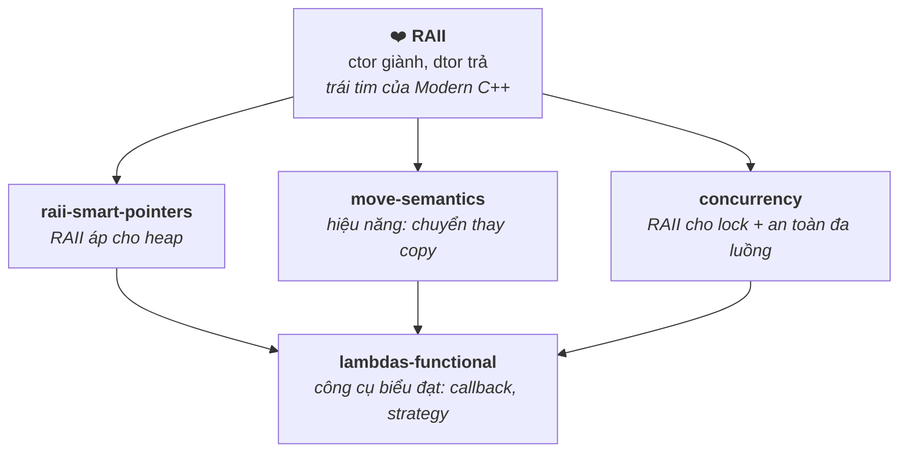

# 02 — Modern C++ (C++11/14/17/20)

Những tính năng "modern" định hình cách viết C++ ngày nay: quản lý tài nguyên an toàn (RAII + smart pointer), move semantics (hiệu năng), concurrency, và lập trình hàm (lambda). Đây là phần phân biệt rõ giữa người viết "C with classes" và kỹ sư C++ thực thụ — rất hay được đào sâu khi phỏng vấn Middle+→Senior.

## 🗺️ Bức tranh tổng thể

> **Sợi chỉ đỏ:** Modern C++ xoay quanh một mục tiêu — **quản lý tài nguyên an toàn mà không hy sinh hiệu năng.** `RAII` là trái tim; mọi thứ khác là hệ quả hoặc công cụ phục vụ nó.

- **`raii-smart-pointers` = RAII áp dụng cho bộ nhớ động:** giải quyết trực tiếp các lỗi của `memory-model` ([01](../01-cpp-fundamentals/memory-model.md)).
- **`move-semantics` phục vụ hiệu năng:** smart pointer move-only cần nó; `noexcept` move quyết định container có dùng move hay copy → hai file gắn chặt.
- **`concurrency` gom tất cả:** `lock_guard` là RAII; truyền dữ liệu giữa thread cần hiểu move; data race là phiên bản đa luồng của lỗi bộ nhớ.
- **Câu hỏi tổng hợp:** *"Vì sao một class có `unique_ptr` member lại lỗi khi cho vào `std::vector`?"* — nối move-semantics + smart pointer + Rule of 5.

## Tài liệu trong topic

| # | File | Nội dung | Trạng thái |
|---|------|----------|-----------|
| 1 | [raii-smart-pointers.md](raii-smart-pointers.md) | RAII, `unique_ptr`/`shared_ptr`/`weak_ptr`, ownership, Rule of 0/3/5 | ✅ |
| 2 | [move-semantics.md](move-semantics.md) | lvalue/rvalue, move ctor, `std::move`, perfect forwarding, copy elision | ✅ |
| 3 | [concurrency.md](concurrency.md) | thread, mutex, atomic, memory order, deadlock, async/future | ✅ |
| 4 | [lambdas-functional.md](lambdas-functional.md) | lambda, capture, `std::function`, `auto`, structured bindings | ✅ |

## Thứ tự đọc gợi ý
`raii-smart-pointers` → `move-semantics` → `lambdas-functional` → `concurrency`.
(Smart pointer cần hiểu move; concurrency là phần khó nhất nên để cuối.)

## Liên kết
- Nền tảng: [01-cpp-fundamentals/](../01-cpp-fundamentals/) (memory model, vtable)
- Câu hỏi phỏng vấn: [11-interview-questions/cpp.md](../11-interview-questions/cpp.md)
