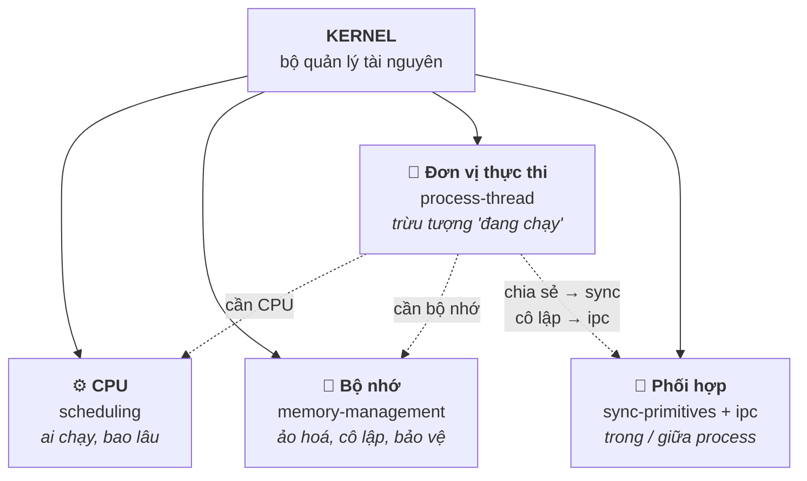

# 03 — Operating System

Bản chất hệ điều hành — nền tảng để hiểu Linux system programming, device driver và debugging. Phỏng vấn System/Embedded gần như **chắc chắn** đào sâu phần này: process vs thread, scheduling, virtual memory, IPC, đồng bộ. Hiểu *cơ chế* (vì sao OS thiết kế vậy) quan trọng hơn thuộc định nghĩa.

## 🗺️ Bức tranh tổng thể

> **Sợi chỉ đỏ:** Kernel là một **bộ quản lý tài nguyên** đứng giữa phần cứng và chương trình. Mỗi topic con là kernel quản lý *một loại tài nguyên*.

- **Các topic nhân-quả lẫn nhau, không rời rạc:** một `thread` cần **CPU** (scheduler) + **bộ nhớ** (MMU/page table). Context switch (`process-thread`) tốn kém *chính vì* phải đổi address space + flush TLB (`memory-management`).
- **Cô lập vs chia sẻ:** thread chia sẻ bộ nhớ → cần `sync-primitives`; process bị cô lập (virtual memory) → cần `ipc`. Đây là hai mặt của một quyết định thiết kế.
- **Liên kết lên tầng trên:** lý thuyết ở đây hiện thực hoá thành API thật ở Linux ([04](../04-linux-system-programming/)) và là nền để hiểu driver/realtime ([05](../05-drivers-device-tree/), [08](../08-embedded-systems/)).
- **Câu hỏi tổng hợp:** *"Vì sao context switch giữa process tốn hơn giữa thread?"* — nối `process-thread` + `memory-management` (TLB/page table).

## Tài liệu trong topic

| # | File | Nội dung | Trạng thái |
|---|------|----------|-----------|
| 1 | [process-thread.md](process-thread.md) | process vs thread, address space, context switch, fork, trạng thái process | ✅ |
| 2 | [scheduling.md](scheduling.md) | scheduler, preemptive vs cooperative, CFS, realtime, priority | ✅ |
| 3 | [memory-management.md](memory-management.md) | virtual memory, paging, MMU, TLB, page fault, swap | ✅ |
| 4 | [ipc.md](ipc.md) | pipe, FIFO, shared memory, message queue, socket, signal | ✅ |
| 5 | [sync-primitives.md](sync-primitives.md) | race condition, mutex, semaphore, spinlock, deadlock, monitor | ✅ |

## Thứ tự đọc gợi ý
`process-thread` → `scheduling` → `memory-management` → `sync-primitives` → `ipc`.

## Liên kết
- Áp dụng thực tế trên Linux: [04-linux-system-programming/](../04-linux-system-programming/)
- Sync ở góc C++: [02-modern-cpp/concurrency.md](../02-modern-cpp/concurrency.md)
- Câu hỏi phỏng vấn: [11-interview-questions/operating-system.md](../11-interview-questions/operating-system.md)
