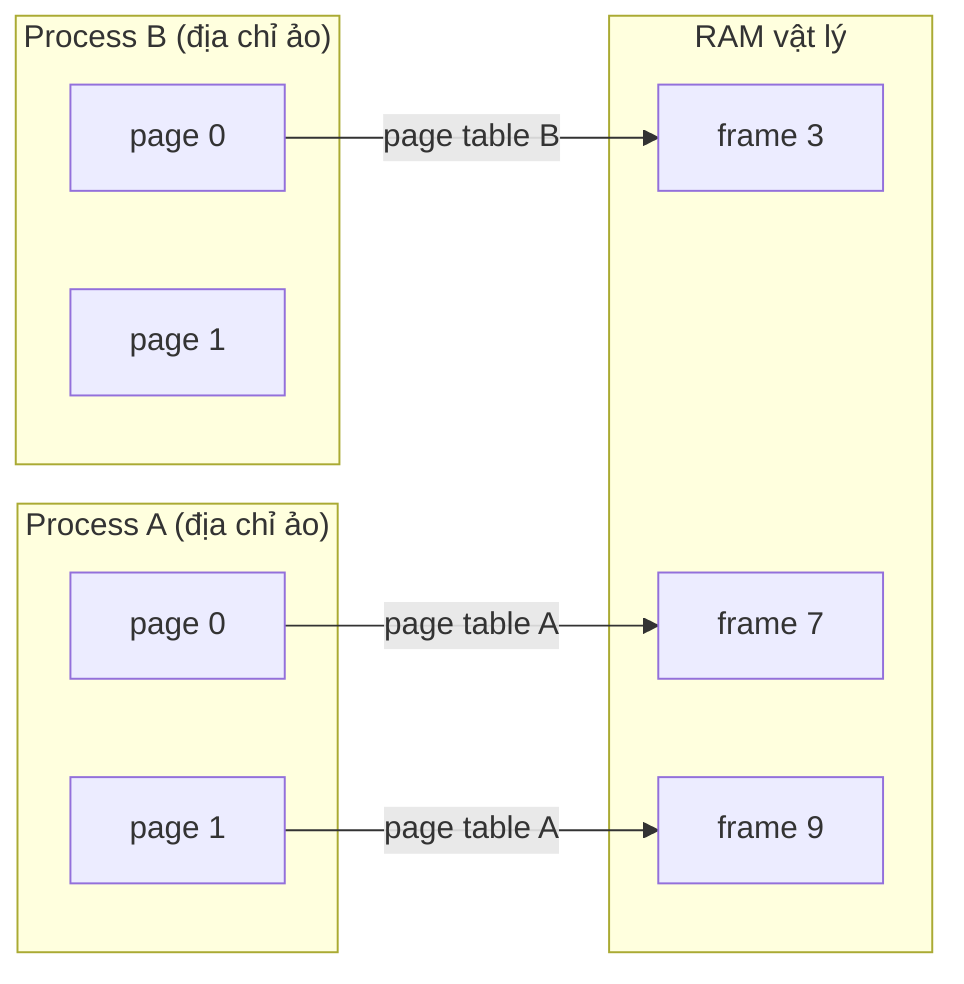

# Memory Management — Virtual Memory, Paging, MMU

> **TL;DR**
> - **Virtual memory**: mỗi process thấy một không gian địa chỉ ảo riêng, liên tục; OS + **MMU** ánh xạ địa chỉ ảo → địa chỉ vật lý. Cho cô lập, bảo vệ, và ảo giác "nhiều RAM hơn thực".
> - **Paging**: chia bộ nhớ thành **page** (thường 4KB) ảo và **frame** vật lý; **page table** lưu ánh xạ. **TLB** là cache của page table để dịch nhanh.
> - **Page fault**: truy cập page chưa có trong RAM → kernel xử lý (nạp từ disk/swap, hoặc cấp page mới, hoặc báo lỗi segfault).
> - **Swap**: đẩy page ít dùng ra disk khi thiếu RAM. Quá nhiều → **thrashing** (dành phần lớn thời gian swap).
> - Embedded: hệ không MMU dùng địa chỉ vật lý trực tiếp (không cô lập); cần hiểu cache, alignment, DMA.

---

## 1. Vì sao cần virtual memory?

Nếu mọi process dùng địa chỉ vật lý trực tiếp sẽ có 3 vấn đề: process này ghi đè bộ nhớ process kia (không **bảo vệ**), khó cấp phát liên tục (**fragmentation**), và bị giới hạn bởi RAM vật lý. Virtual memory giải quyết bằng một lớp gián tiếp:

- **Cô lập & bảo vệ**: mỗi process có address space riêng; không thấy/đụng được bộ nhớ process khác.
- **Đơn giản hóa**: mỗi process thấy không gian liên tục bắt đầu từ 0, không cần biết bố trí vật lý.
- **Overcommit**: tổng bộ nhớ ảo có thể lớn hơn RAM (phần ít dùng nằm ở disk/swap).

*(Mỗi process có không gian ảo riêng; page table (do MMU dùng) ánh xạ page ảo → frame vật lý. Hai process cô lập dù cùng "page 0".)*

---

## 2. Paging & page table

- Không gian ảo chia thành **page** kích thước cố định (thường 4KB; có huge page 2MB/1GB). Bộ nhớ vật lý chia thành **frame** cùng kích thước.
- **Page table** (mỗi process một bảng) ánh xạ số page ảo → số frame vật lý, kèm cờ: present (có trong RAM?), R/W, user/kernel, dirty, accessed...
- Bảng phẳng quá lớn → dùng **multi-level page table** (vd 4 cấp trên x86-64) chỉ cấp phát phần cần, tiết kiệm.

Dịch địa chỉ: địa chỉ ảo = `[page number | offset]`. Page number tra page table ra frame; ghép với offset thành địa chỉ vật lý.

---

## 3. MMU & TLB

- **MMU** (Memory Management Unit): phần cứng dịch địa chỉ ảo → vật lý mỗi lần truy cập bộ nhớ, và kiểm tra quyền (vi phạm → page fault/segfault).
- Tra page table mỗi truy cập sẽ chậm (nhiều lần đọc RAM cho multi-level). **TLB** (Translation Lookaside Buffer) là **cache** trong MMU lưu các ánh xạ gần đây:
  - **TLB hit**: dịch tức thì.
  - **TLB miss**: phải đi bộ qua page table (page table walk), rồi nạp vào TLB.
- Context switch giữa process đổi page table → thường phải **flush TLB** (trừ khi có tag/ASID) → một lý do switch process đắt.

---

## 4. Page fault — không phải lúc nào cũng là lỗi

Khi truy cập một địa chỉ mà page chưa "present" trong RAM, MMU gây **page fault** (trap vào kernel). Kernel phân loại:

| Loại | Tình huống | Xử lý |
|------|-----------|-------|
| **Minor** (soft) | Page đã trong RAM nhưng chưa map vào process (vd shared lib đã nạp, COW) | Chỉ cập nhật page table — nhanh |
| **Major** (hard) | Page nằm trên disk/swap | Đọc từ disk vào RAM — chậm (I/O) |
| **Invalid** | Truy cập địa chỉ không hợp lệ (null, ngoài vùng) | Gửi `SIGSEGV` → **segfault** |

Cơ chế này cho phép **demand paging**: chỉ nạp page khi thực sự cần (vd chương trình lớn không cần nạp hết vào RAM lúc khởi động).

---

## 5. Swap & thrashing

- Khi RAM cạn, kernel chọn page ít dùng (theo xấp xỉ **LRU**) ghi ra **swap** (vùng disk) để giải phóng frame. Khi cần lại → page fault major nạp về.
- **Thrashing**: khi working set của các process lớn hơn RAM, hệ thống dành phần lớn thời gian swap in/out thay vì làm việc thật → hiệu năng sụp đổ. Khắc phục: giảm tải, thêm RAM, hoặc OOM killer chấm dứt process ngốn bộ nhớ.

---

## 6. Page replacement (điểm danh)

Khi cần frame mà RAM đầy, chọn page nào để đẩy ra:
- **FIFO**: cũ nhất ra trước — đơn giản, có thể bỏ nhầm page nóng (Belady's anomaly).
- **LRU** (Least Recently Used): bỏ page lâu không dùng nhất — tốt nhưng đắt để theo dõi chính xác; thực tế dùng xấp xỉ (clock/second-chance dùng bit accessed).
- **Clock / Second-chance**: xấp xỉ LRU rẻ — Linux dùng biến thể (LRU 2 danh sách active/inactive).

---

## 7. Góc nhìn embedded

- **Không MMU** (vd nhiều MCU, một số RTOS): chạy trên địa chỉ vật lý trực tiếp → không cô lập, không bảo vệ; bug con trỏ có thể phá bất kỳ đâu. Cần kỷ luật code cao.
- **Cache coherency & DMA**: DMA ghi thẳng RAM không qua CPU cache → phải flush/invalidate cache để CPU và thiết bị thấy dữ liệu nhất quán.
- **Alignment**: nhiều kiến trúc yêu cầu dữ liệu căn lề; truy cập lệch → fault hoặc chậm.
- **MPU** (Memory Protection Unit): bản đơn giản hơn MMU trên một số MCU — bảo vệ vùng nhớ mà không dịch địa chỉ.

---

## Câu hỏi phỏng vấn liên quan

1) Virtual memory là gì và giải quyết vấn đề gì?

Virtual memory cho mỗi process một không gian địa chỉ ảo riêng, liên tục, được OS và MMU ánh xạ tới bộ nhớ vật lý. Nó giải quyết: (1) **bảo vệ & cô lập** — process không truy cập được bộ nhớ của process khác; (2) **đơn giản hóa** — mỗi process thấy không gian liền mạch từ 0, không cần biết bố trí vật lý, tránh fragmentation bên ngoài; (3) **overcommit** — tổng bộ nhớ ảo có thể vượt RAM nhờ đẩy page ít dùng ra swap, và demand paging chỉ nạp khi cần.

2) Paging hoạt động thế nào? Page table là gì?

Không gian ảo được chia thành các page cố định (thường 4KB), bộ nhớ vật lý chia thành frame cùng kích thước. Page table (mỗi process một bảng) ánh xạ số page ảo → số frame vật lý kèm các cờ (present, read/write, user/kernel, dirty, accessed). Địa chỉ ảo gồm phần page number và offset; page number tra page table ra frame, ghép với offset thành địa chỉ vật lý. Vì page table phẳng quá lớn nên dùng multi-level page table để chỉ cấp phát phần cần.

3) MMU và TLB là gì? Vì sao TLB quan trọng?

MMU (Memory Management Unit) là phần cứng dịch địa chỉ ảo sang vật lý ở mỗi lần truy cập bộ nhớ và kiểm tra quyền. Vì tra multi-level page table tốn nhiều lần đọc RAM, MMU có TLB (Translation Lookaside Buffer) — một cache lưu các ánh xạ page→frame gần đây. TLB hit cho dịch tức thì; TLB miss buộc đi bộ qua page table rồi nạp vào TLB. TLB quyết định lớn tới hiệu năng; switch process thường phải flush TLB (nếu không có ASID), góp phần làm switch process đắt.

4) Page fault là gì? Có phải luôn là lỗi không?

Page fault là trap khi process truy cập một page chưa "present" trong RAM. Không phải luôn là lỗi: **minor fault** (page đã trong RAM nhưng chưa map vào process, hoặc copy-on-write) chỉ cần cập nhật page table — nhanh; **major fault** (page nằm trên disk/swap) phải đọc I/O — chậm; chỉ **invalid fault** (truy cập địa chỉ không hợp lệ như null/ngoài vùng) mới sinh `SIGSEGV` (segfault). Cơ chế này cho phép demand paging — chỉ nạp page khi thực sự cần.

5) Swap là gì? Thrashing xảy ra khi nào?

Swap là vùng trên disk dùng để chứa các page bị đẩy khỏi RAM khi RAM cạn; kernel chọn page ít dùng (xấp xỉ LRU) ghi ra swap để giải phóng frame, và nạp lại qua major page fault khi cần. Thrashing xảy ra khi tổng working set của các process vượt RAM khả dụng, khiến hệ thống liên tục swap in/out và dành phần lớn thời gian cho I/O thay vì tính toán → hiệu năng sụp đổ. Khắc phục: giảm tải, thêm RAM, hoặc để OOM killer kết thúc process ngốn bộ nhớ.

6) Hệ thống không có MMU (embedded) khác gì? Cần lưu ý gì?

Không có MMU nghĩa là không có dịch địa chỉ ảo→vật lý và không có bảo vệ bộ nhớ phần cứng: mọi process/tác vụ chạy trên địa chỉ vật lý chung, một con trỏ sai có thể phá vùng nhớ bất kỳ, không cô lập. Cần kỷ luật lập trình cao, và lưu ý: cache coherency với DMA (phải flush/invalidate cache để CPU và thiết bị thấy dữ liệu nhất quán), yêu cầu alignment của kiến trúc, và có thể dùng MPU (Memory Protection Unit) để bảo vệ vùng nhớ theo region mà không dịch địa chỉ như MMU.

---
⬅️ [scheduling.md](scheduling.md) · ➡️ Tiếp theo: [sync-primitives.md](sync-primitives.md)
