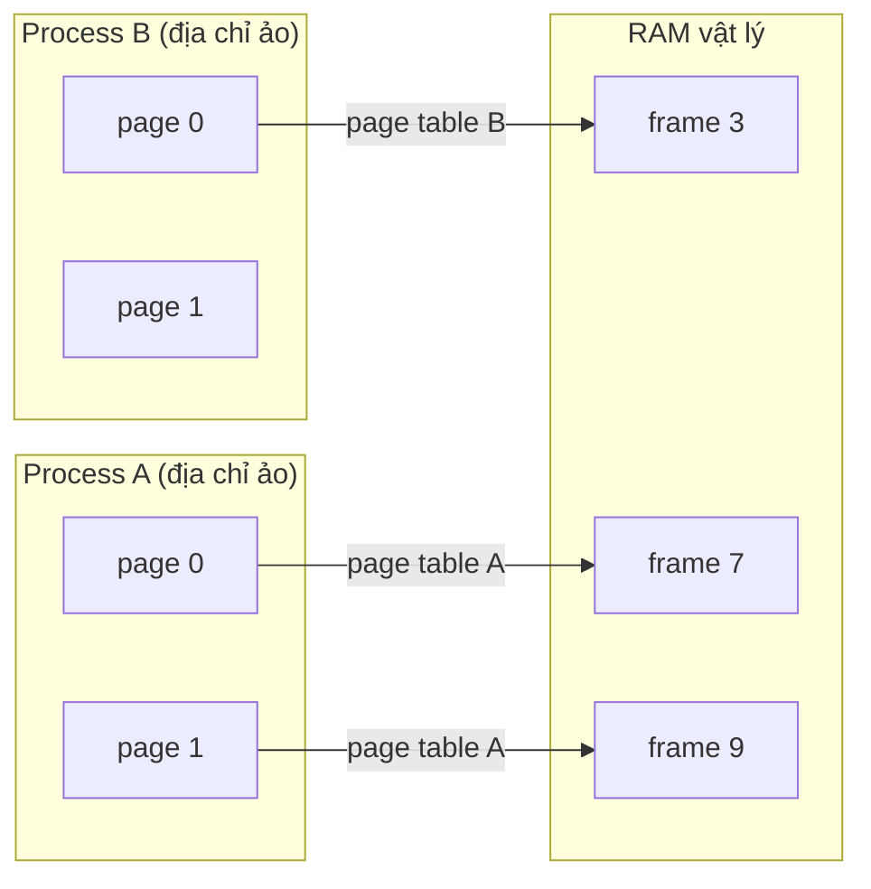

# Memory Management — Virtual Memory, Paging, MMU

> **TL;DR**
> - **Virtual memory**: mỗi process thấy một không gian địa chỉ ảo riêng, liên tục; OS + **MMU** ánh xạ địa chỉ ảo → địa chỉ vật lý. Cho cô lập, bảo vệ, và ảo giác "nhiều RAM hơn thực".
> - **Paging**: chia bộ nhớ thành **page** (thường 4KB) ảo và **frame** vật lý; **page table** lưu ánh xạ. **TLB** là cache của page table để dịch nhanh.
> - **Page fault**: truy cập page chưa có trong RAM → kernel xử lý (nạp từ disk/swap, hoặc cấp page mới, hoặc báo lỗi segfault).
> - **Swap**: đẩy page ít dùng ra disk khi thiếu RAM. Quá nhiều → **thrashing** (dành phần lớn thời gian swap).
> - Embedded: hệ không MMU dùng địa chỉ vật lý trực tiếp (không cô lập); cần hiểu cache, alignment, DMA.

---

## 1. Vì sao cần virtual memory?

Nếu mọi process dùng địa chỉ vật lý trực tiếp sẽ có 3 vấn đề: process này ghi đè bộ nhớ process kia (không **bảo vệ**), khó cấp phát liên tục (**fragmentation**), và bị giới hạn bởi RAM vật lý. Virtual memory giải quyết bằng một lớp gián tiếp:

- **Cô lập & bảo vệ**: mỗi process có address space riêng; không thấy/đụng được bộ nhớ process khác.
- **Đơn giản hóa**: mỗi process thấy không gian liên tục bắt đầu từ 0, không cần biết bố trí vật lý.
- **Overcommit**: tổng bộ nhớ ảo có thể lớn hơn RAM (phần ít dùng nằm ở disk/swap).

```mermaid
flowchart LR
    subgraph A["Process A (địa chỉ ảo)"]
        a0["page 0"]
        a1["page 1"]
    end
    subgraph RAM["RAM vật lý"]
        f7["frame 7"]
        f3["frame 3"]
        f9["frame 9"]
    end
    subgraph B["Process B (địa chỉ ảo)"]
        b0["page 0"]
        b1["page 1"]
    end
    a0 -->|"page table A"| f7
    a1 -->|"page table A"| f9
    b0 -->|"page table B"| f3
```
*(Mỗi process có không gian ảo riêng; page table (do MMU dùng) ánh xạ page ảo → frame vật lý. Hai process cô lập dù cùng "page 0".)*

---

## 2. Paging & page table

- Không gian ảo chia thành **page** kích thước cố định (thường 4KB; có huge page 2MB/1GB). Bộ nhớ vật lý chia thành **frame** cùng kích thước.
- **Page table** (mỗi process một bảng) ánh xạ số page ảo → số frame vật lý, kèm cờ: present (có trong RAM?), R/W, user/kernel, dirty, accessed...
- Bảng phẳng quá lớn → dùng **multi-level page table** (vd 4 cấp trên x86-64) chỉ cấp phát phần cần, tiết kiệm.

Dịch địa chỉ: địa chỉ ảo = `[page number | offset]`. Page number tra page table ra frame; ghép với offset thành địa chỉ vật lý.

---

## 3. MMU & TLB

- **MMU** (Memory Management Unit): phần cứng dịch địa chỉ ảo → vật lý mỗi lần truy cập bộ nhớ, và kiểm tra quyền (vi phạm → page fault/segfault).
- Tra page table mỗi truy cập sẽ chậm (nhiều lần đọc RAM cho multi-level). **TLB** (Translation Lookaside Buffer) là **cache** trong MMU lưu các ánh xạ gần đây:
  - **TLB hit**: dịch tức thì.
  - **TLB miss**: phải đi bộ qua page table (page table walk), rồi nạp vào TLB.
- Context switch giữa process đổi page table → thường phải **flush TLB** (trừ khi có tag/ASID) → một lý do switch process đắt.

---

## 4. Page fault — không phải lúc nào cũng là lỗi

Khi truy cập một địa chỉ mà page chưa "present" trong RAM, MMU gây **page fault** (trap vào kernel). Kernel phân loại:

| Loại | Tình huống | Xử lý |
|------|-----------|-------|
| **Minor** (soft) | Page đã trong RAM nhưng chưa map vào process (vd shared lib đã nạp, COW) | Chỉ cập nhật page table — nhanh |
| **Major** (hard) | Page nằm trên disk/swap | Đọc từ disk vào RAM — chậm (I/O) |
| **Invalid** | Truy cập địa chỉ không hợp lệ (null, ngoài vùng) | Gửi `SIGSEGV` → **segfault** |

Cơ chế này cho phép **demand paging**: chỉ nạp page khi thực sự cần (vd chương trình lớn không cần nạp hết vào RAM lúc khởi động).

---

## 5. Swap & thrashing

- Khi RAM cạn, kernel chọn page ít dùng (theo xấp xỉ **LRU**) ghi ra **swap** (vùng disk) để giải phóng frame. Khi cần lại → page fault major nạp về.
- **Thrashing**: khi working set của các process lớn hơn RAM, hệ thống dành phần lớn thời gian swap in/out thay vì làm việc thật → hiệu năng sụp đổ. Khắc phục: giảm tải, thêm RAM, hoặc OOM killer chấm dứt process ngốn bộ nhớ.

---

## 6. Page replacement (điểm danh)

Khi cần frame mà RAM đầy, chọn page nào để đẩy ra:
- **FIFO**: cũ nhất ra trước — đơn giản, có thể bỏ nhầm page nóng (Belady's anomaly).
- **LRU** (Least Recently Used): bỏ page lâu không dùng nhất — tốt nhưng đắt để theo dõi chính xác; thực tế dùng xấp xỉ (clock/second-chance dùng bit accessed).
- **Clock / Second-chance**: xấp xỉ LRU rẻ — Linux dùng biến thể (LRU 2 danh sách active/inactive).

---

## 7. Góc nhìn embedded

- **Không MMU** (vd nhiều MCU, một số RTOS): chạy trên địa chỉ vật lý trực tiếp → không cô lập, không bảo vệ; bug con trỏ có thể phá bất kỳ đâu. Cần kỷ luật code cao.
- **Cache coherency & DMA**: DMA ghi thẳng RAM không qua CPU cache → phải flush/invalidate cache để CPU và thiết bị thấy dữ liệu nhất quán.
- **Alignment**: nhiều kiến trúc yêu cầu dữ liệu căn lề; truy cập lệch → fault hoặc chậm.
- **MPU** (Memory Protection Unit): bản đơn giản hơn MMU trên một số MCU — bảo vệ vùng nhớ mà không dịch địa chỉ.

---

## 8. 💰 Chi phí thật & ⚠️ bẫy

**Thang thời gian — thứ quyết định mọi lập luận về bộ nhớ:**

| Sự kiện | Bậc thời gian | So với cache L1 |
|---|---|---|
| Cache L1 hit | ~1 ns | 1× |
| RAM (TLB hit, cache miss) | ~100 ns | **100×** |
| **Minor page fault** (trang đã ở RAM, chỉ map lại) | **~1 µs** | 1.000× |
| **Major page fault** (đọc từ eMMC/SSD) | **~0,1–10 ms** | **~1.000.000×** |

⇒ Một **major fault** đắt ngang **hàng triệu** lệnh. Đó là lý do:
- Hệ **realtime** phải `mlockall()` — một lệnh gán bình thường mà dính major fault là **trượt deadline**.
- Thiết bị RAM ít **giật từng cơn** trong khi máy dev mượt: máy dev gần như chỉ có minor fault ([OS-010](../14-prep/mock-interview/bank/os.md)).
- Cần đo thì nhìn **tỉ lệ major/minor**, không nhìn tổng số fault — minor nhiều là bình thường.

**Kích thước cần nhớ:** page **4 KB** · huge page **2 MB** (một mục TLB phủ 2 MB thay vì 4 KB — đáng kể với vùng dữ liệu lớn) · TLB thường **vài trăm–vài nghìn mục**, hit rate thực tế **>99%**.

**⚠️ Bẫy:**

**① `malloc()` thành công KHÔNG có nghĩa là có RAM.** Linux **overcommit**: nó cấp **địa chỉ ảo**, RAM thật chỉ đến ở **lần chạm đầu tiên** (một minor fault). Hệ quả: thời điểm hết bộ nhớ **không phải** lúc `malloc`, mà lúc *ghi* — và khi đó **OOM killer** giết một tiến trình theo `oom_score`, có thể **không phải** tiến trình có lỗi.
⇒ Kiểm `malloc != NULL` là **chưa đủ** để nói "đã có bộ nhớ". Cần chắc chắn ⇒ cấp phát rồi **chạm hết** (hoặc `mlockall`).

**② `free()` không trả bộ nhớ về OS.** glibc giữ lại trong arena để tái sử dụng ⇒ RSS **không giảm** sau khi `free`. Điều này **bình thường**, đừng nhầm với rò rỉ. (Khối lớn cấp qua `mmap` thì có trả lại.) Muốn biết rò thật hay không: xem **xu hướng RSS theo thời gian**, không xem một thời điểm.

**③ "RAM còn trống ít" thường là chuyện tốt.** Linux **cố ý** dùng RAM rảnh làm page cache. Con số cần nhìn là **available**, không phải **free**.

**④ Trên hệ KHÔNG có MMU, mọi lưới an toàn ở trên biến mất.** Con trỏ hỏng **không** SIGSEGV mà **ghi đè im lặng** vào dữ liệu module khác; phân mảnh **không gom lại được**; tràn stack không ai báo. ⇒ Cấp phát tĩnh/pool, dùng **MPU** nếu có ([OS-024](../14-prep/mock-interview/bank/os.md), [08/constraints.md](../08-embedded-systems/constraints.md)).

**⑤ Thrashing là vách đá, không phải dốc thoải** — vòng phản hồi dương, qua điểm gãy thì **không tự hồi**. Dấu hiệu: **CPU idle cao mà máy đứng** ([OS-014](../14-prep/mock-interview/bank/os.md)).

---

## Câu hỏi phỏng vấn liên quan

> Đáp án sống trong [bank/](../14-prep/mock-interview/bank/) — **một đáp án, một chỗ** ([CLAUDE.md §4.7](../CLAUDE.md)). Tự trả lời trước khi mở.

| ID | Câu hỏi |
|----|---------|
| [OS-008](../14-prep/mock-interview/bank/os.md) | Virtual memory là gì và giải quyết vấn đề gì? |
| [OS-023](../14-prep/mock-interview/bank/os.md) | Paging hoạt động thế nào? Page table là gì? |
| [OS-011](../14-prep/mock-interview/bank/os.md) | MMU và TLB là gì? Vì sao TLB quan trọng? |
| [OS-010](../14-prep/mock-interview/bank/os.md) | Page fault là gì? Có phải luôn là lỗi không? |
| [OS-014](../14-prep/mock-interview/bank/os.md) | Swap là gì? Thrashing xảy ra khi nào? |
| [OS-024](../14-prep/mock-interview/bank/os.md) | Hệ thống không có MMU (embedded) khác gì? Cần lưu ý gì? |

---
⬅️ [scheduling.md](scheduling.md) · ➡️ Tiếp theo: [sync-primitives.md](sync-primitives.md)
