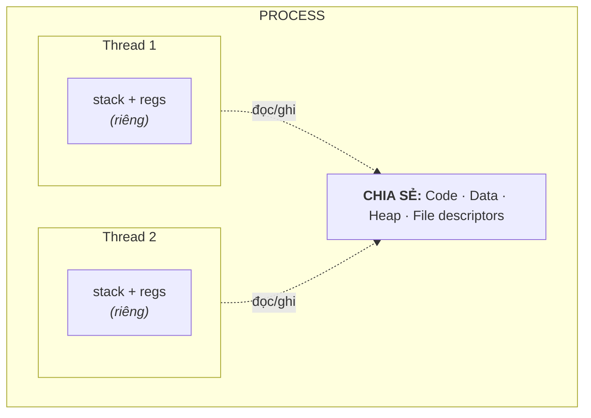
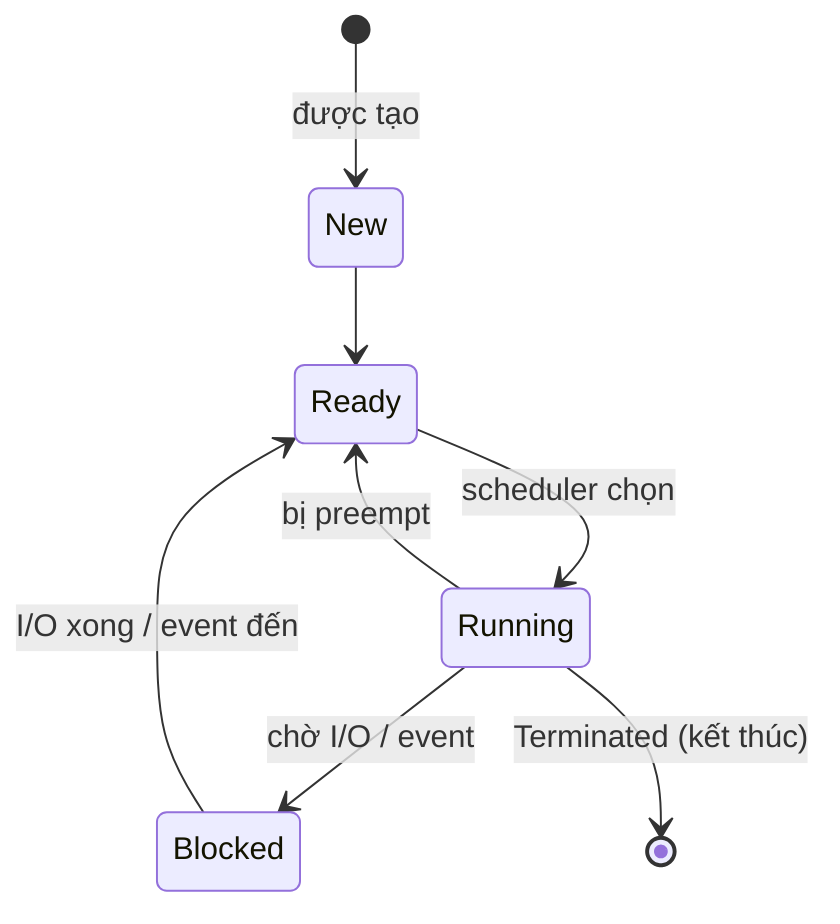

# Process & Thread — Tiến trình và luồng

> **TL;DR**
> - **Process**: một chương trình đang chạy, có **không gian địa chỉ riêng** (cô lập), tài nguyên riêng (fd, bộ nhớ). Cô lập tốt nhưng tạo/giao tiếp đắt.
> - **Thread**: luồng thực thi *bên trong* một process, **chia sẻ không gian địa chỉ** với các thread khác cùng process. Nhẹ, giao tiếp nhanh, nhưng dễ data race.
> - **Context switch**: lưu/khôi phục trạng thái CPU khi đổi process/thread. Đổi giữa process tốn hơn (đổi cả address space, flush TLB).
> - **`fork()`**: tạo process con bằng cách *sao chép* process cha (copy-on-write). **thread** tạo qua `pthread_create`/`std::thread`.
> - Chọn: cần cô lập/ổn định → process; cần chia sẻ dữ liệu nhiều & nhẹ → thread.

---

## 1. Process là gì?

Process = instance của một chương trình đang chạy. OS cấp cho mỗi process:
- **Không gian địa chỉ ảo riêng** (code, data, heap, stack — xem [01/memory-model](../01-cpp-fundamentals/memory-model.md)).
- Bảng **file descriptor** riêng.
- PID, thông tin scheduling, quyền, signal handler...

Cô lập là điểm mạnh: một process crash không kéo sập process khác. Đây là ranh giới bảo vệ của OS (qua MMU).

---

## 2. Thread là gì?

Thread = đơn vị lập lịch (đơn vị mà scheduler cấp CPU). Nhiều thread trong cùng process **chia sẻ**: code, data, heap, file descriptor. **Riêng** mỗi thread: **stack**, thanh ghi (register), program counter, errno, thread-local storage.


*(Thread chia sẻ code/data/heap/fd; chỉ stack & register là riêng → giao tiếp nhanh nhưng dễ data race.)*

Vì chia sẻ heap/data, thread giao tiếp cực nhanh (đọc/ghi chung biến) — nhưng đó cũng là nguồn **data race**, cần đồng bộ ([sync-primitives.md](sync-primitives.md)).

---

## 3. Process vs Thread — so sánh

| Tiêu chí | Process | Thread |
|----------|---------|--------|
| Không gian địa chỉ | Riêng (cô lập) | Chia sẻ trong process |
| Tạo/hủy | Đắt | Rẻ |
| Context switch | Đắt (đổi address space, flush TLB) | Rẻ hơn (cùng address space) |
| Giao tiếp | Qua IPC (pipe, shm, socket...) | Qua bộ nhớ chung (cần đồng bộ) |
| Cô lập lỗi | Cao — crash không lan | Thấp — một thread hỏng có thể sập cả process |
| Bảo mật | Mạnh (ranh giới OS) | Yếu (cùng quyền) |

**Khi nào dùng gì?**
- **Process** khi: cần cô lập/độ tin cậy cao (browser tách tab thành process), thành phần độc lập, khác quyền hạn, fault containment.
- **Thread** khi: cần chia sẻ dữ liệu lớn thường xuyên, tác vụ song song trong cùng ứng dụng, giảm overhead.

---

## 4. Trạng thái của process (process states)



- **Ready**: sẵn sàng chạy, chờ CPU.
- **Running**: đang chiếm CPU.
- **Blocked/Waiting**: chờ sự kiện (I/O, lock, signal) — không tiêu tốn CPU.
- Trên Linux: `R` (running/ready), `S` (interruptible sleep), `D` (uninterruptible sleep — thường chờ I/O), `Z` (zombie), `T` (stopped).

**Zombie**: process con đã kết thúc nhưng cha chưa `wait()` để thu exit status → entry còn trong bảng process. **Orphan**: cha chết trước con → con được `init`/`systemd` (PID 1) nhận nuôi.

---

## 5. `fork()` — tạo process trên Linux

```cpp
pid_t pid = fork();
if (pid == 0) {
    // tiến trình CON: fork() trả về 0
} else if (pid > 0) {
    // tiến trình CHA: fork() trả về PID của con
    waitpid(pid, &status, 0);   // thu hồi con, tránh zombie
} else {
    // lỗi
}
```

- `fork()` tạo bản sao gần như y hệt process cha (address space, fd...). Phân biệt cha/con qua giá trị trả về.
- **Copy-on-write (COW)**: không copy toàn bộ bộ nhớ ngay; cha/con chia sẻ page read-only, chỉ copy page nào *bị ghi*. → fork rất nhanh.
- Thường kết hợp **`exec()`** để thay thế image bằng chương trình khác (mô hình `fork`+`exec` của shell).

(Chi tiết hơn ở [04-linux-system-programming/processes-signals.md](../04-linux-system-programming/processes-signals.md).)

---

## 6. Context switch — bản chất chi phí

Context switch là khi OS chuyển CPU từ một thread/process sang cái khác:
1. Lưu trạng thái (register, PC, stack pointer) của cái đang chạy vào PCB/TCB.
2. (Nếu đổi process) đổi address space → cập nhật page table base, **flush TLB**.
3. Khôi phục trạng thái cái được chọn → tiếp tục chạy.

Chi phí gồm phần trực tiếp (lưu/khôi phục) + gián tiếp (cache/TLB lạnh sau khi đổi). Vì vậy:
- Switch giữa **thread cùng process** rẻ hơn switch giữa **process** (không phải đổi address space).
- Quá nhiều thread/switch → **thrashing** lập lịch, giảm hiệu năng.

---

## 7. Mô hình thread (điểm danh)

- **1:1 (kernel-level thread)**: mỗi thread user ↔ một thread kernel — Linux dùng (NPTL). Kernel lập lịch trực tiếp, tận dụng đa nhân tốt.
- **N:1 (user-level thread)**: nhiều thread user trên 1 kernel thread — switch rất nhanh nhưng một thread block I/O làm block cả nhóm, không dùng được đa nhân thực sự.
- **Coroutine / green thread**: lập lịch ở user space (C++20 coroutines, Go goroutine) — rất nhẹ cho I/O-bound.

---

## Câu hỏi phỏng vấn liên quan

<details><summary>1) Process và thread khác nhau thế nào?</summary>

Process là một chương trình đang chạy với **không gian địa chỉ riêng** và tài nguyên riêng (fd, bộ nhớ), được OS cô lập với nhau. Thread là luồng thực thi bên trong một process, **chia sẻ** code/data/heap/fd với các thread cùng process nhưng có stack và register riêng. Hệ quả: thread tạo và giao tiếp rẻ (qua bộ nhớ chung) nhưng dễ data race và một thread lỗi có thể sập cả process; process cô lập tốt, fault containment cao, nhưng tạo và giao tiếp (IPC) đắt hơn.
</details>

<details><summary>2) Thread chia sẻ gì và có riêng gì?</summary>

Chia sẻ (cùng process): code/text, data/bss, heap, file descriptor, các handler signal, working directory. Riêng mỗi thread: stack, tập thanh ghi (gồm program counter và stack pointer), `errno`, thread-local storage (TLS), trạng thái lập lịch của thread. Chính vì heap/global chia sẻ nên truy cập đồng thời cần đồng bộ.
</details>

<details><summary>3) Context switch là gì? Vì sao switch process tốn hơn switch thread?</summary>

Context switch là quá trình OS lưu trạng thái CPU (register, PC, SP) của tác vụ đang chạy và khôi phục trạng thái của tác vụ kế tiếp. Switch giữa hai process còn phải **đổi không gian địa chỉ** (đổi page table) và thường **flush TLB**, khiến TLB/cache lạnh sau đó → chi phí cao. Switch giữa hai thread cùng process dùng chung address space nên bỏ qua bước này, rẻ hơn nhiều.
</details>

<details><summary>4) fork() làm gì? Copy-on-write là gì?</summary>

`fork()` tạo một process con là bản sao gần như y hệt process cha (address space, file descriptor...). Nó trả về 0 trong con, trả về PID con trong cha (và -1 nếu lỗi). Copy-on-write: thay vì sao chép toàn bộ bộ nhớ ngay, kernel cho cha/con cùng tham chiếu các page ở chế độ read-only; chỉ khi một bên **ghi** vào một page thì page đó mới được nhân bản. Nhờ vậy fork nhanh và tiết kiệm bộ nhớ, đặc biệt khi con gọi `exec()` ngay sau đó.
</details>

<details><summary>5) Zombie process và orphan process là gì?</summary>

Zombie: process con đã kết thúc nhưng process cha chưa gọi `wait()`/`waitpid()` để đọc exit status, nên entry của con vẫn còn trong bảng process (giữ PID + status). Tích nhiều zombie làm cạn bảng process. Orphan: process cha kết thúc trước con; con bị "mồ côi" và được `init`/`systemd` (PID 1) nhận làm cha nuôi, PID 1 sẽ `wait()` thu hồi khi con kết thúc.
</details>

<details><summary>6) Khi nào nên dùng nhiều process thay vì nhiều thread?</summary>

Dùng process khi cần cô lập/độ tin cậy cao (một thành phần crash không kéo sập phần khác — vd browser tách tab thành process riêng), khi các thành phần độc lập hoặc cần quyền hạn/bảo mật khác nhau, hoặc khi muốn fault containment mạnh. Dùng thread khi cần chia sẻ dữ liệu lớn thường xuyên, song song trong cùng ứng dụng, và muốn giảm overhead tạo/giao tiếp. Đánh đổi cốt lõi: cô lập & an toàn (process) so với nhẹ & chia sẻ nhanh (thread).
</details>

---
⬅️ [Về index topic](README.md) · ➡️ Tiếp theo: [scheduling.md](scheduling.md)
