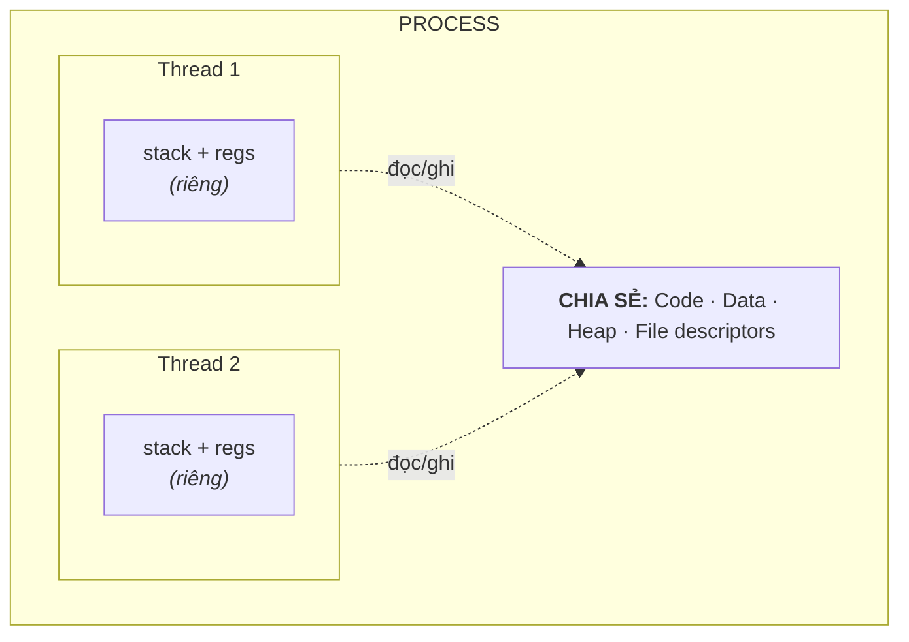
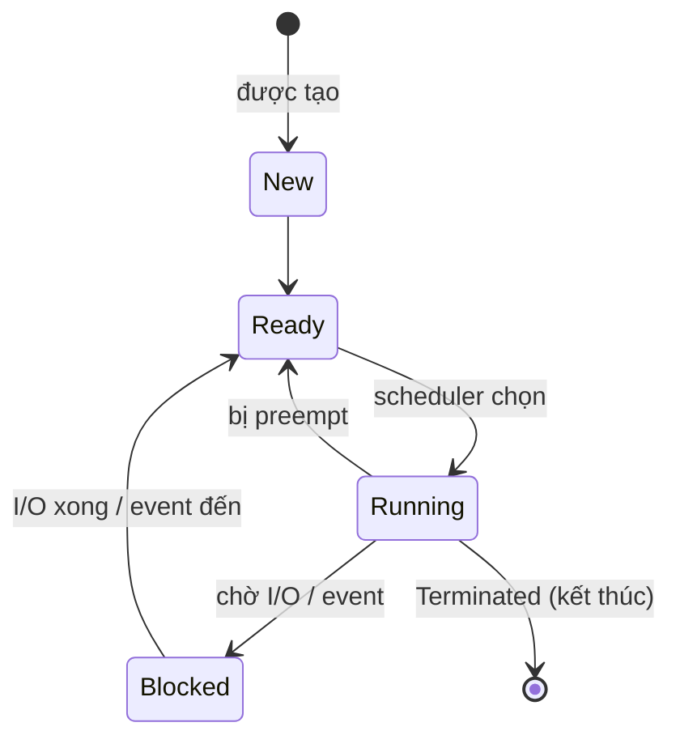

# Process & Thread — Tiến trình và luồng

> **TL;DR**
> - **Process**: một chương trình đang chạy, có **không gian địa chỉ riêng** (cô lập), tài nguyên riêng (fd, bộ nhớ). Cô lập tốt nhưng tạo/giao tiếp đắt.
> - **Thread**: luồng thực thi *bên trong* một process, **chia sẻ không gian địa chỉ** với các thread khác cùng process. Nhẹ, giao tiếp nhanh, nhưng dễ data race.
> - **Context switch**: lưu/khôi phục trạng thái CPU khi đổi process/thread. Đổi giữa process tốn hơn (đổi cả address space, flush TLB).
> - **`fork()`**: tạo process con bằng cách *sao chép* process cha (copy-on-write). **thread** tạo qua `pthread_create`/`std::thread`.
> - Chọn: cần cô lập/ổn định → process; cần chia sẻ dữ liệu nhiều & nhẹ → thread.

---

## 1. Process là gì?

Process = instance của một chương trình đang chạy. OS cấp cho mỗi process:
- **Không gian địa chỉ ảo riêng** (code, data, heap, stack — xem [01/memory-model](../01-cpp-fundamentals/memory-model.md)).
- Bảng **file descriptor** riêng.
- PID, thông tin scheduling, quyền, signal handler...

Cô lập là điểm mạnh: một process crash không kéo sập process khác. Đây là ranh giới bảo vệ của OS (qua MMU).

---

## 2. Thread là gì?

Thread = đơn vị lập lịch (đơn vị mà scheduler cấp CPU). Nhiều thread trong cùng process **chia sẻ**: code, data, heap, file descriptor. **Riêng** mỗi thread: **stack**, thanh ghi (register), program counter, errno, thread-local storage.


```mermaid
flowchart TB
    subgraph P["PROCESS"]
        SH["<b>CHIA SẺ:</b> Code · Data · Heap · File descriptors"]
        subgraph T1["Thread 1"]
            s1["stack + regs<br/><i>(riêng)</i>"]
        end
        subgraph T2["Thread 2"]
            s2["stack + regs<br/><i>(riêng)</i>"]
        end
    end
    T1 -.->|"đọc/ghi"| SH
    T2 -.->|"đọc/ghi"| SH
```
*(Thread chia sẻ code/data/heap/fd; chỉ stack & register là riêng → giao tiếp nhanh nhưng dễ data race.)*

Vì chia sẻ heap/data, thread giao tiếp cực nhanh (đọc/ghi chung biến) — nhưng đó cũng là nguồn **data race**, cần đồng bộ ([sync-primitives.md](sync-primitives.md)).

---

## 3. Process vs Thread — so sánh

| Tiêu chí | Process | Thread |
|----------|---------|--------|
| Không gian địa chỉ | Riêng (cô lập) | Chia sẻ trong process |
| Tạo/hủy | Đắt | Rẻ |
| Context switch | Đắt (đổi address space, flush TLB) | Rẻ hơn (cùng address space) |
| Giao tiếp | Qua IPC (pipe, shm, socket...) | Qua bộ nhớ chung (cần đồng bộ) |
| Cô lập lỗi | Cao — crash không lan | Thấp — một thread hỏng có thể sập cả process |
| Bảo mật | Mạnh (ranh giới OS) | Yếu (cùng quyền) |

**Khi nào dùng gì?**
- **Process** khi: cần cô lập/độ tin cậy cao (browser tách tab thành process), thành phần độc lập, khác quyền hạn, fault containment.
- **Thread** khi: cần chia sẻ dữ liệu lớn thường xuyên, tác vụ song song trong cùng ứng dụng, giảm overhead.

---

## 4. Trạng thái của process (process states)


```mermaid
stateDiagram-v2
    [*] --> New: được tạo
    New --> Ready
    Ready --> Running: scheduler chọn
    Running --> Ready: bị preempt
    Running --> Blocked: chờ I/O / event
    Blocked --> Ready: I/O xong / event đến
    Running --> [*]: Terminated (kết thúc)
```

- **Ready**: sẵn sàng chạy, chờ CPU.
- **Running**: đang chiếm CPU.
- **Blocked/Waiting**: chờ sự kiện (I/O, lock, signal) — không tiêu tốn CPU.
- Trên Linux: `R` (running/ready), `S` (interruptible sleep), `D` (uninterruptible sleep — thường chờ I/O), `Z` (zombie), `T` (stopped).

**Zombie**: process con đã kết thúc nhưng cha chưa `wait()` để thu exit status → entry còn trong bảng process. **Orphan**: cha chết trước con → con được `init`/`systemd` (PID 1) nhận nuôi.

---

## 5. `fork()` — tạo process trên Linux

```cpp
pid_t pid = fork();
if (pid == 0) {
    // tiến trình CON: fork() trả về 0
} else if (pid > 0) {
    // tiến trình CHA: fork() trả về PID của con
    waitpid(pid, &status, 0);   // thu hồi con, tránh zombie
} else {
    // lỗi
}
```

- `fork()` tạo bản sao gần như y hệt process cha (address space, fd...). Phân biệt cha/con qua giá trị trả về.
- **Copy-on-write (COW)**: không copy toàn bộ bộ nhớ ngay; cha/con chia sẻ page read-only, chỉ copy page nào *bị ghi*. → fork rất nhanh.
- Thường kết hợp **`exec()`** để thay thế image bằng chương trình khác (mô hình `fork`+`exec` của shell).

(Chi tiết hơn ở [04-linux-system-programming/processes-signals.md](../04-linux-system-programming/processes-signals.md).)

---

## 6. Context switch — bản chất chi phí

Context switch là khi OS chuyển CPU từ một thread/process sang cái khác:
1. Lưu trạng thái (register, PC, stack pointer) của cái đang chạy vào PCB/TCB.
2. (Nếu đổi process) đổi address space → cập nhật page table base, **flush TLB**.
3. Khôi phục trạng thái cái được chọn → tiếp tục chạy.

Chi phí gồm phần trực tiếp (lưu/khôi phục) + gián tiếp (cache/TLB lạnh sau khi đổi). Vì vậy:
- Switch giữa **thread cùng process** rẻ hơn switch giữa **process** (không phải đổi address space).
- Quá nhiều thread/switch → **thrashing** lập lịch, giảm hiệu năng.

---

## 7. Mô hình thread (điểm danh)

- **1:1 (kernel-level thread)**: mỗi thread user ↔ một thread kernel — Linux dùng (NPTL). Kernel lập lịch trực tiếp, tận dụng đa nhân tốt.
- **N:1 (user-level thread)**: nhiều thread user trên 1 kernel thread — switch rất nhanh nhưng một thread block I/O làm block cả nhóm, không dùng được đa nhân thực sự.
- **Coroutine / green thread**: lập lịch ở user space (C++20 coroutines, Go goroutine) — rất nhẹ cho I/O-bound.

---

## 8. 💰 Chi phí thật & ⚠️ bẫy

**Con số để quyết định** (mốc điển hình Linux x86-64 — nhớ **tỉ lệ**, không nhớ con số tuyệt đối):

| | Thread | Process |
|---|---|---|
| Tạo mới | **~10–30 µs** | **~100–300 µs** (`fork` + COW page table) |
| Context switch | **~1–2 µs** | **~2–5 µs** — đắt hơn vì **đổi bảng trang ⇒ TLB nguội** |
| Bộ nhớ mỗi cái | stack **8 MB *ảo*** (mặc định Linux), thực tế chỉ tốn trang đã chạm | Toàn bộ không gian riêng |
| Chia sẻ dữ liệu | Mặc định (chung không gian địa chỉ) | Phải có IPC |
| Một cái crash | **Kéo cả process chết** | Bên kia sống |

⇒ **Chênh lệch context switch không nằm ở việc lưu thanh ghi** (vài trăm ns, giống nhau) mà ở **TLB và cache bị nguội** sau khi đổi bảng trang. Đó là lý do "thread rẻ hơn process" — và cũng là lý do 10.000 thread vẫn tệ: mỗi lần switch vẫn thổi bay cache.

**⚠️ Bẫy:**

**① `fork()` trong chương trình đa luồng — chỉ an toàn nếu con `exec()` ngay.** Con chỉ thừa hưởng **thread đang gọi `fork`**; các thread khác biến mất *giữa chừng* — kèm theo mọi mutex chúng đang giữ, **kẹt vĩnh viễn** trong bản sao. Con gọi `malloc` (cần khoá heap) là treo. ⇒ Giữa `fork` và `exec` chỉ được gọi hàm **async-signal-safe** ([OS-021](../14-prep/mock-interview/bank/os.md)).

**② Nhiều thread ≠ nhanh hơn.** Quá số core thì chỉ thêm context switch và tranh chấp cache. Với việc **CPU-bound**, mốc hợp lý là ~số core; với **I/O-bound** thì có thể nhiều hơn — nhưng lúc đó nên hỏi ngược: *đã cân nhắc event loop chưa?* ([04/io-multiplexing.md](../04-linux-system-programming/io-multiplexing.md)).

**③ Stack 8 MB là ẢO, không phải RAM thật** — chỉ trang đã chạm mới tốn khung vật lý. Nhưng 10.000 thread vẫn ăn **80 GB không gian địa chỉ** và thật sự tốn ~8 KB kernel stack mỗi cái. Trên **hệ nhúng không MMU** thì đây là RAM **thật** ⇒ phải đặt kích thước stack từng task bằng tay.

**④ Detached thread sống lâu hơn dữ liệu nó dùng.** `t.detach()` rồi hàm tạo ra dữ liệu return ⇒ thread đọc bộ nhớ đã chết. Mặc định nên `join`; muốn detach thì dữ liệu phải sống độc lập (`shared_ptr`, copy vào).

**⑤ Zombie ăn PID chứ không ăn RAM** — `fork()` trả `-1` trong khi `free` vẫn đẹp là chữ ký của việc quên `wait()` ([OS-009](../14-prep/mock-interview/bank/os.md)).

---

## Câu hỏi phỏng vấn liên quan

> Đáp án sống trong [bank/](../14-prep/mock-interview/bank/) — **một đáp án, một chỗ** ([CLAUDE.md §4.7](../CLAUDE.md)). Tự trả lời trước khi mở.

| ID | Câu hỏi |
|----|---------|
| [OS-001](../14-prep/mock-interview/bank/os.md) | Process và thread khác nhau thế nào? |
| [OS-002](../14-prep/mock-interview/bank/os.md) | Thread chia sẻ gì và có riêng gì? |
| [OS-005](../14-prep/mock-interview/bank/os.md) | Context switch là gì? Vì sao switch process tốn hơn switch thread? |
| [OS-013](../14-prep/mock-interview/bank/os.md) | fork() làm gì? Copy-on-write là gì? |
| [OS-009](../14-prep/mock-interview/bank/os.md) | Zombie process và orphan process là gì? |
| [OS-017](../14-prep/mock-interview/bank/os.md) | Khi nào nên dùng nhiều process thay vì nhiều thread? |

---
⬅️ [Về index topic](README.md) · ➡️ Tiếp theo: [scheduling.md](scheduling.md)
