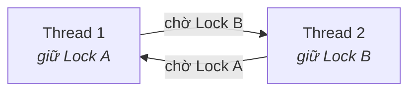

# Synchronization Primitives — Đồng bộ hóa

> **TL;DR**
> - **Race condition**: kết quả phụ thuộc thứ tự thực thi không kiểm soát của nhiều luồng truy cập dữ liệu chung. Vùng code cần độc quyền = **critical section**.
> - **Mutex**: khóa loại trừ, *một* chủ sở hữu, có thể ngủ khi chờ. Dùng cho critical section dài.
> - **Spinlock**: bận xoay (busy-wait) thay vì ngủ — dùng khi giữ lock cực ngắn (trong kernel, đa nhân), không bao giờ ngủ khi giữ.
> - **Semaphore**: bộ đếm tài nguyên; binary semaphore (0/1) ~ tín hiệu, counting semaphore quản N tài nguyên. Có thể signal từ thread khác (≠ mutex).
> - **Condition variable**: chờ tới khi một điều kiện đúng, kết hợp với mutex.
> - **Deadlock / livelock / starvation**: các bệnh của đồng bộ; phá điều kiện Coffman để tránh deadlock.

---

## 1. Race condition & critical section

```cpp
// counter chung, hai thread cùng ++counter
++counter;   // thực chất là 3 bước: đọc → tăng → ghi
```

Nếu hai thread xen kẽ giữa các bước này, một lần tăng bị mất → **race condition**. Đoạn code truy cập dữ liệu chung cần được thực thi "không bị chen" gọi là **critical section**. Mục tiêu đồng bộ: đảm bảo **mutual exclusion** (một lúc chỉ một luồng trong critical section) mà vẫn tiến triển và công bằng.

---

## 2. Mutex (mutual exclusion lock)

- Có **chủ sở hữu**: thread nào lock thì thread đó phải unlock (ownership). 
- Thread chờ lock thường được **đưa vào ngủ** (block), nhường CPU → không phí chu kỳ khi chờ lâu.
- Dùng cho critical section có thể kéo dài.

```cpp
std::mutex m;
{
    std::lock_guard<std::mutex> lock(m);   // RAII
    // critical section
}   // tự unlock
```

- **Recursive mutex**: cho phép cùng thread lock nhiều lần (hiếm cần; thường là dấu hiệu thiết kế chưa tốt).
- **Timed mutex**: `try_lock_for` — thử lock có timeout.

---

## 3. Spinlock

Thay vì ngủ, thread **xoay vòng kiểm tra** (busy-wait) tới khi lock rảnh.

```
while (!try_acquire()) { /* spin, đốt CPU */ }
```

- **Ưu**: không có chi phí context switch / đánh thức → nhanh khi lock được giữ **cực ngắn**.
- **Nhược**: đốt CPU trong lúc chờ → tệ nếu giữ lock lâu hoặc chỉ một core.
- Dùng chủ yếu trong **kernel / SMP** (đa nhân), giữ lock vài lệnh. **Tuyệt đối không ngủ/block khi đang giữ spinlock** (gây deadlock vì thread khác spin mãi).

| | Mutex | Spinlock |
|--|-------|----------|
| Khi chờ | Ngủ (block) | Bận xoay (busy-wait) |
| Chi phí khi chờ lâu | Thấp (nhường CPU) | Cao (đốt CPU) |
| Chi phí khi chờ rất ngắn | Cao (context switch) | Thấp |
| Phù hợp | Critical section dài, user space | Critical section cực ngắn, kernel/SMP |

---

## 4. Semaphore

Một bộ đếm `S` với hai thao tác nguyên tử:
- **wait/P** (`sem_wait`): `S--`; nếu `S < 0` → block.
- **signal/V** (`sem_post`): `S++`; đánh thức một thread đang chờ.

Loại:
- **Binary semaphore** (0/1): gần giống mutex nhưng **không có ownership** — bất kỳ thread nào cũng post được. Hợp để **báo hiệu** giữa thread (vd ISR → task).
- **Counting semaphore**: quản lý **N tài nguyên đồng loại** (vd pool 5 connection → khởi tạo S=5).

**Mutex vs Semaphore — khác biệt cốt lõi:** mutex là *lock* có chủ sở hữu (locking), dùng để bảo vệ critical section; semaphore là *cơ chế báo hiệu/đếm* không chủ sở hữu, dùng để điều phối (ai post cũng được). Dùng sai (vd dùng binary semaphore thay mutex) làm mất priority inheritance và dễ lỗi.

---

## 5. Condition variable

Cho thread **ngủ chờ tới khi một điều kiện trở nên đúng**, tránh busy-wait. Luôn đi kèm một mutex.

```cpp
std::unique_lock<std::mutex> lk(m);
cv.wait(lk, []{ return ready; });   // nhả mutex & ngủ; thức dậy, giành lại mutex khi predicate đúng
```

- `wait` **nhả mutex trong lúc ngủ** và giành lại khi thức → cho phép thread khác thay đổi điều kiện.
- Dùng predicate để chống **spurious wakeup**.
- Pattern kinh điển: **producer–consumer** (consumer chờ hàng đợi không rỗng; producer push rồi `notify`).

---

## 6. Reader–Writer lock

Khi dữ liệu **đọc nhiều, ghi ít**: cho phép *nhiều reader đồng thời* hoặc *một writer độc quyền*.

```cpp
std::shared_mutex sm;
// reader:  std::shared_lock  lock(sm);   // nhiều reader song song
// writer:  std::unique_lock  lock(sm);   // độc quyền
```

Tăng song song cho phần đọc; cần cẩn thận **writer starvation** (reader liên tục làm writer chờ mãi).

---

## 7. Bệnh của đồng bộ

- **Deadlock**: các thread chờ vòng tròn, kẹt vĩnh viễn. 4 điều kiện Coffman: mutual exclusion, hold-and-wait, no preemption, circular wait → phá một cái là tránh được (vd luôn lock theo cùng thứ tự).


*(Circular wait: T1 giữ A chờ B, T2 giữ B chờ A → kẹt. Phá bằng cách luôn lock A trước B ở mọi nơi.)*

- **Livelock**: các thread liên tục đổi trạng thái để né nhau nhưng không tiến triển (như hai người né nhau ở hành lang mãi).
- **Starvation**: một thread không bao giờ được tài nguyên (ưu tiên thấp, writer starvation...). Khắc phục bằng fairness/aging.
- **Priority inversion**: (xem [scheduling.md](scheduling.md)) → priority inheritance.

---

## 8. Lock-free & atomic (điểm danh)

Dùng `std::atomic` + CAS (compare-and-swap) để xây cấu trúc dữ liệu không khóa → tránh deadlock, tốt cho hệ realtime. Rất khó viết đúng (ABA problem, memory order). Chi tiết góc C++ ở [02-modern-cpp/concurrency.md](../02-modern-cpp/concurrency.md).

---

## Câu hỏi phỏng vấn liên quan

<details><summary>1) Race condition là gì? Critical section là gì?</summary>

Race condition là tình huống kết quả của chương trình phụ thuộc vào thứ tự/timing không kiểm soát được giữa nhiều luồng cùng truy cập dữ liệu chung (ít nhất một ghi). Critical section là đoạn code truy cập dữ liệu chung đó và cần được thực thi loại trừ lẫn nhau — một lúc chỉ một luồng được vào. Mục tiêu của đồng bộ là đảm bảo mutual exclusion cho critical section trong khi vẫn đảm bảo tiến triển và công bằng.
</details>

<details><summary>2) Mutex và spinlock khác nhau thế nào? Khi nào dùng spinlock?</summary>

Khi không lấy được lock, mutex đưa thread vào **ngủ** (block, nhường CPU), còn spinlock cho thread **bận xoay** (busy-wait) liên tục kiểm tra. Spinlock tránh chi phí context switch nên nhanh khi lock được giữ **cực ngắn** và có nhiều core; nhưng đốt CPU nếu chờ lâu. Dùng spinlock chủ yếu trong kernel/SMP cho critical section vài lệnh, và tuyệt đối không ngủ/block khi đang giữ spinlock. Mutex phù hợp critical section dài và code user-space.
</details>

<details><summary>3) Mutex và semaphore khác nhau ra sao?</summary>

Mutex là cơ chế khóa có **ownership**: thread nào lock thì chính nó phải unlock, dùng để bảo vệ critical section (loại trừ lẫn nhau). Semaphore là bộ đếm có hai thao tác wait/signal, **không có ownership** — bất kỳ thread nào cũng có thể signal, nên dùng để báo hiệu giữa các luồng hoặc quản lý N tài nguyên (counting). Binary semaphore (0/1) giống mutex về hình thức nhưng khác bản chất; dùng semaphore thay mutex để bảo vệ critical section sẽ mất priority inheritance và dễ lỗi.
</details>

<details><summary>4) Condition variable dùng để làm gì? Vì sao phải đi kèm mutex và predicate?</summary>

Condition variable cho phép thread ngủ chờ tới khi một điều kiện trở nên đúng, thay vì busy-wait. Nó đi kèm mutex vì điều kiện thường dựa trên dữ liệu chung cần bảo vệ: `wait` nhả mutex trong lúc ngủ (để thread khác sửa dữ liệu/điều kiện) rồi giành lại mutex khi thức. Phải dùng predicate (`wait(lock, pred)`) để chống spurious wakeup (thức không do notify) và để kiểm tra điều kiện trước/sau khi chờ, đảm bảo chỉ tiếp tục khi điều kiện thật sự đúng. Ứng dụng kinh điển: producer–consumer.
</details>

<details><summary>5) Deadlock là gì? Bốn điều kiện và cách tránh?</summary>

Deadlock là khi các thread chờ vòng tròn tài nguyên do nhau giữ nên kẹt vĩnh viễn. Bốn điều kiện Coffman phải đồng thời thỏa: mutual exclusion, hold-and-wait, no preemption, circular wait. Tránh deadlock bằng cách phá ít nhất một điều kiện: phổ biến nhất là phá circular wait bằng cách luôn acquire các lock theo **một thứ tự toàn cục cố định**; hoặc dùng lock có timeout, acquire tất cả lock một lần (`scoped_lock`), hoặc tránh hold-and-wait.
</details>

<details><summary>6) Reader-writer lock dùng khi nào? Rủi ro gì?</summary>

Dùng khi dữ liệu được **đọc nhiều, ghi ít**: cho phép nhiều reader truy cập đồng thời (vì đọc không xung đột) nhưng writer phải độc quyền. Điều này tăng song song so với mutex thường. Rủi ro chính là **writer starvation**: nếu reader liên tục đến, writer có thể chờ mãi không được ghi; cần chính sách ưu tiên writer hoặc fairness. Ngoài ra reader-writer lock nặng hơn mutex thường nên chỉ đáng dùng khi tỉ lệ đọc thực sự áp đảo.
</details>

---
⬅️ [memory-management.md](memory-management.md) · ➡️ Tiếp theo: [ipc.md](ipc.md)
