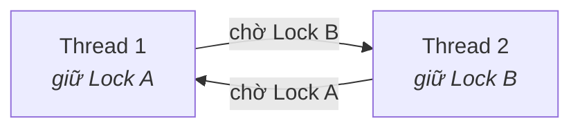

# Synchronization Primitives — Đồng bộ hóa

> **TL;DR**
> - **Race condition**: kết quả phụ thuộc thứ tự thực thi không kiểm soát của nhiều luồng truy cập dữ liệu chung. Vùng code cần độc quyền = **critical section**.
> - **Mutex**: khóa loại trừ, *một* chủ sở hữu, có thể ngủ khi chờ. Dùng cho critical section dài.
> - **Spinlock**: bận xoay (busy-wait) thay vì ngủ — dùng khi giữ lock cực ngắn (trong kernel, đa nhân), không bao giờ ngủ khi giữ.
> - **Semaphore**: bộ đếm tài nguyên; binary semaphore (0/1) ~ tín hiệu, counting semaphore quản N tài nguyên. Có thể signal từ thread khác (≠ mutex).
> - **Condition variable**: chờ tới khi một điều kiện đúng, kết hợp với mutex.
> - **Deadlock / livelock / starvation**: các bệnh của đồng bộ; phá điều kiện Coffman để tránh deadlock.

---

## 1. Race condition & critical section

```cpp
// counter chung, hai thread cùng ++counter
++counter;   // thực chất là 3 bước: đọc → tăng → ghi
```

Nếu hai thread xen kẽ giữa các bước này, một lần tăng bị mất → **race condition**. Đoạn code truy cập dữ liệu chung cần được thực thi "không bị chen" gọi là **critical section**. Mục tiêu đồng bộ: đảm bảo **mutual exclusion** (một lúc chỉ một luồng trong critical section) mà vẫn tiến triển và công bằng.

---

## 2. Mutex (mutual exclusion lock)

- Có **chủ sở hữu**: thread nào lock thì thread đó phải unlock (ownership). 
- Thread chờ lock thường được **đưa vào ngủ** (block), nhường CPU → không phí chu kỳ khi chờ lâu.
- Dùng cho critical section có thể kéo dài.

```cpp
std::mutex m;
{
    std::lock_guard<std::mutex> lock(m);   // RAII
    // critical section
}   // tự unlock
```

- **Recursive mutex**: cho phép cùng thread lock nhiều lần (hiếm cần; thường là dấu hiệu thiết kế chưa tốt).
- **Timed mutex**: `try_lock_for` — thử lock có timeout.

---

## 3. Spinlock

Thay vì ngủ, thread **xoay vòng kiểm tra** (busy-wait) tới khi lock rảnh.

```
while (!try_acquire()) { /* spin, đốt CPU */ }
```

- **Ưu**: không có chi phí context switch / đánh thức → nhanh khi lock được giữ **cực ngắn**.
- **Nhược**: đốt CPU trong lúc chờ → tệ nếu giữ lock lâu hoặc chỉ một core.
- Dùng chủ yếu trong **kernel / SMP** (đa nhân), giữ lock vài lệnh. **Tuyệt đối không ngủ/block khi đang giữ spinlock** (gây deadlock vì thread khác spin mãi).

| | Mutex | Spinlock |
|--|-------|----------|
| Khi chờ | Ngủ (block) | Bận xoay (busy-wait) |
| Chi phí khi chờ lâu | Thấp (nhường CPU) | Cao (đốt CPU) |
| Chi phí khi chờ rất ngắn | Cao (context switch) | Thấp |
| Phù hợp | Critical section dài, user space | Critical section cực ngắn, kernel/SMP |

---

## 4. Semaphore

Một bộ đếm `S` với hai thao tác nguyên tử:
- **wait/P** (`sem_wait`): `S--`; nếu `S < 0` → block.
- **signal/V** (`sem_post`): `S++`; đánh thức một thread đang chờ.

Loại:
- **Binary semaphore** (0/1): gần giống mutex nhưng **không có ownership** — bất kỳ thread nào cũng post được. Hợp để **báo hiệu** giữa thread (vd ISR → task).
- **Counting semaphore**: quản lý **N tài nguyên đồng loại** (vd pool 5 connection → khởi tạo S=5).

**Mutex vs Semaphore — khác biệt cốt lõi:** mutex là *lock* có chủ sở hữu (locking), dùng để bảo vệ critical section; semaphore là *cơ chế báo hiệu/đếm* không chủ sở hữu, dùng để điều phối (ai post cũng được). Dùng sai (vd dùng binary semaphore thay mutex) làm mất priority inheritance và dễ lỗi.

---

## 5. Condition variable

Cho thread **ngủ chờ tới khi một điều kiện trở nên đúng**, tránh busy-wait. Luôn đi kèm một mutex.

```cpp
std::unique_lock<std::mutex> lk(m);
cv.wait(lk, []{ return ready; });   // nhả mutex & ngủ; thức dậy, giành lại mutex khi predicate đúng
```

- `wait` **nhả mutex trong lúc ngủ** và giành lại khi thức → cho phép thread khác thay đổi điều kiện.
- Dùng predicate để chống **spurious wakeup**.
- Pattern kinh điển: **producer–consumer** (consumer chờ hàng đợi không rỗng; producer push rồi `notify`).

---

## 6. Reader–Writer lock

Khi dữ liệu **đọc nhiều, ghi ít**: cho phép *nhiều reader đồng thời* hoặc *một writer độc quyền*.

```cpp
std::shared_mutex sm;
// reader:  std::shared_lock  lock(sm);   // nhiều reader song song
// writer:  std::unique_lock  lock(sm);   // độc quyền
```

Tăng song song cho phần đọc; cần cẩn thận **writer starvation** (reader liên tục làm writer chờ mãi).

---

## 7. Bệnh của đồng bộ

- **Deadlock**: các thread chờ vòng tròn, kẹt vĩnh viễn. 4 điều kiện Coffman: mutual exclusion, hold-and-wait, no preemption, circular wait → phá một cái là tránh được (vd luôn lock theo cùng thứ tự).


```mermaid
flowchart LR
    T1["Thread 1<br/><i>giữ Lock A</i>"]
    T2["Thread 2<br/><i>giữ Lock B</i>"]
    T1 -->|"chờ Lock B"| T2
    T2 -->|"chờ Lock A"| T1
```
*(Circular wait: T1 giữ A chờ B, T2 giữ B chờ A → kẹt. Phá bằng cách luôn lock A trước B ở mọi nơi.)*

- **Livelock**: các thread liên tục đổi trạng thái để né nhau nhưng không tiến triển (như hai người né nhau ở hành lang mãi).
- **Starvation**: một thread không bao giờ được tài nguyên (ưu tiên thấp, writer starvation...). Khắc phục bằng fairness/aging.
- **Priority inversion**: (xem [scheduling.md](scheduling.md)) → priority inheritance.

---

## 8. Lock-free & atomic (điểm danh)

Dùng `std::atomic` + CAS (compare-and-swap) để xây cấu trúc dữ liệu không khóa → tránh deadlock, tốt cho hệ realtime. Rất khó viết đúng (ABA problem, memory order). Chi tiết góc C++ ở [02-modern-cpp/concurrency.md](../02-modern-cpp/concurrency.md).

---

## 9. 💰 Chi phí thật — con số để quyết định

Mọi lựa chọn ở trên đều vô nghĩa nếu không biết **thứ tự độ lớn**. Số dưới đây là mốc điển hình trên x86-64 hiện đại (chênh theo máy, nhưng **tỉ lệ giữa chúng** mới là thứ cần nhớ):

| Thao tác | Bậc thời gian | Ghi chú |
|---|---|---|
| Truy cập biến trong **cache L1** | **~1 ns** | Mốc so sánh |
| `std::atomic` tăng, **không tranh chấp** | **~5–20 ns** | Chỉ một lệnh có khoá bus/cache |
| `mutex.lock()` **không tranh chấp** | **~20 ns** | Trên Linux là **futex** — đường nhanh chạy **hoàn toàn trong user space**, không syscall |
| Cache line **bật giữa 2 core** | **~50–100 ns** | Cái giá thật của việc "chia sẻ" một biến |
| `mutex.lock()` **có tranh chấp** → ngủ + đánh thức | **~1–5 µs** | Phải vào kernel + **context switch** |
| Context switch thread | ~1–2 µs | ([process-thread.md](process-thread.md)) |

**Ba kết luận rút ra — đây mới là phần dùng được:**

1. ⭐ **Mutex không tranh chấp gần như miễn phí.** `lock()` chỉ tốn syscall **khi thực sự phải chờ** (futex). ⇒ Bỏ mutex đi để "tối ưu" khi khoá hiếm khi tranh chấp là **tối ưu nhầm chỗ** — và đánh đổi bằng nguy cơ race.
2. **Cái đắt là TRANH CHẤP, không phải bản thân cái khoá.** Chênh lệch 20 ns → 1–5 µs là **~100×**. ⇒ Muốn nhanh thì **giảm tranh chấp** (chia nhỏ khoá, giảm thời gian giữ khoá, dữ liệu riêng theo thread), chứ không phải đổi loại primitive.
3. **Spinlock chỉ thắng khi thời gian giữ khoá < chi phí một context switch (~1 µs).** Giữ lâu hơn thì spin đốt CPU vô ích. ⇒ Trong **user space hầu như không bao giờ** nên tự viết spinlock; nó là công cụ của kernel.

---

## 10. ⚠️ Bẫy — những chỗ code chạy đúng 99% rồi chết

**① `std::mutex` KHÔNG đệ quy — lock hai lần là tự khoá chính mình.**
```cpp
void publicApi()  { std::lock_guard lk(m_); helper(); }   // giữ m_
void helper()     { std::lock_guard lk(m_); /* ... */ }   // ❌ lock lại m_ → DEADLOCK
```
Xảy ra khi refactor tách hàm, hoặc khi một hàm public gọi một hàm public khác. Cũng chính là cơ chế **self-deadlock** khi signal handler chen vào hàm đang giữ khoá ([OS-020](../14-prep/mock-interview/bank/os.md)).
⚠️ Chữa bằng `recursive_mutex` là **giấu bệnh**: nó cho code chạy tiếp nhưng bất biến của bạn đang bị nhìn thấy ở trạng thái dở dang. Cách đúng: tách **hàm private không khoá** rồi cho cả hai lối vào cùng gọi nó.

**② Lost wakeup — `notify` trước khi bên kia kịp `wait`.**
Condition variable **không nhớ** tín hiệu: `notify_one()` phát ra lúc không ai đang chờ thì **mất luôn**. Đây là lý do **bắt buộc** dùng predicate — nó kiểm tra *trạng thái*, không dựa vào việc bắt được tín hiệu:
```cpp
cv.wait(lk, []{ return ready; });   // ✅ ready đã true từ trước thì không chờ nữa
cv.wait(lk);                        // ❌ ngủ mãi nếu notify đã bay qua
```

**③ `notify_one` khi các consumer chờ điều kiện KHÁC nhau.** Kernel chọn *một* thread bất kỳ; nếu trúng thread mà predicate của nó chưa đúng, nó ngủ lại — và tín hiệu **mất**, thread lẽ ra chạy được thì không được đánh thức. ⇒ Nhiều loại điều kiện trên cùng cv ⇒ dùng **`notify_all`**, hoặc tách thành nhiều cv.

**④ Giữ khoá trong lúc làm I/O.** `lock()` rồi `read()`/`write()`/`printf` ⇒ giữ khoá hàng **ms** thay vì **ns**, biến critical section thành nút thắt. Nguyên tắc: **lấy dữ liệu ra dưới khoá, xử lý ngoài khoá.**

**⑤ Spinlock trên hệ MỘT core = thảm hoạ.** Thread spin **chiếm trọn** CPU, mà thread đang giữ khoá lại **cần chính CPU đó** để chạy tiếp và nhả khoá ⇒ kẹt tới hết time slice. Spinlock chỉ có nghĩa khi **thật sự có core khác đang chạy song song**.

**⑥ Không dùng RAII.** `lock()` … `return` sớm / ném exception ⇒ **không bao giờ `unlock()`**. Luôn `lock_guard`/`scoped_lock`. Cần khoá nhiều mutex cùng lúc: **`std::scoped_lock(a, b)`** — nó chống deadlock bằng thuật toán tránh, an toàn hơn tự lock theo thứ tự.

**⑦ Đo trước khi đổi sang `shared_mutex`.** Reader–writer lock phải **đếm reader**, mà biến đếm là ô nhớ **ghi chung** ⇒ reader tưởng "chỉ đọc" vẫn gây tranh chấp cache. Với critical section ngắn, nó **chậm hơn** mutex thường ([OS-028](../14-prep/mock-interview/bank/os.md)).

---

## Câu hỏi phỏng vấn liên quan

> Đáp án sống trong [bank/](../14-prep/mock-interview/bank/) — **một đáp án, một chỗ** ([CLAUDE.md §4.7](../CLAUDE.md)). Tự trả lời trước khi mở.

| ID | Câu hỏi |
|----|---------|
| [OS-004](../14-prep/mock-interview/bank/os.md) | Race condition là gì? Critical section là gì? |
| [OS-006](../14-prep/mock-interview/bank/os.md) | Mutex và spinlock khác nhau thế nào? Khi nào dùng spinlock? |
| [OS-007](../14-prep/mock-interview/bank/os.md) | Mutex và semaphore khác nhau ra sao? |
| [OS-012](../14-prep/mock-interview/bank/os.md) | Condition variable dùng để làm gì? Vì sao phải đi kèm mutex và predicate? |
| [OS-003](../14-prep/mock-interview/bank/os.md) | Deadlock là gì? Bốn điều kiện và cách tránh? |
| [OS-028](../14-prep/mock-interview/bank/os.md) | Reader-writer lock dùng khi nào? Rủi ro gì? |

---
⬅️ [memory-management.md](memory-management.md) · ➡️ Tiếp theo: [ipc.md](ipc.md)
