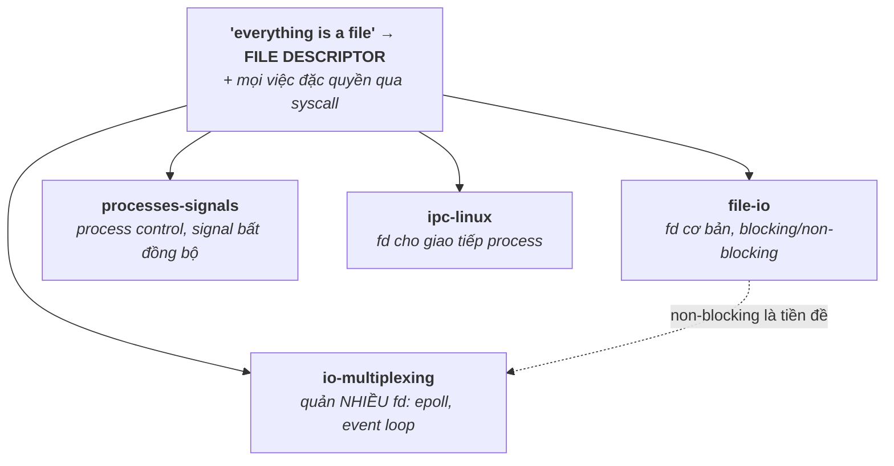

# 04 — Linux System Programming

Áp dụng kiến thức OS vào API thật của Linux: file descriptor, syscall, quản lý process, signal, IPC, và I/O multiplexing (epoll). Đây là phần sát công việc System Software nhất — phỏng vấn hay hỏi "viết server xử lý nhiều kết nối thế nào", "fd là gì", "blocking vs non-blocking".

## 🗺️ Bức tranh tổng thể

> **Sợi chỉ đỏ:** Đây là **hiện thực hoá lý thuyết OS qua hai trừu tượng trung tâm của Linux**: *mọi thứ là **file descriptor (fd)***, và *mọi việc đặc quyền đi qua **syscall***.

- **`fd` là sợi chỉ nối mọi file:** file, pipe, socket, eventfd, signalfd, timerfd... đều là fd → cùng `read`/`write` và gom được vào một `epoll` loop (`io-multiplexing` + `ipc-linux`).
- **`file-io` (blocking vs non-blocking) là tiền đề của `io-multiplexing`:** non-blocking + epoll = event loop phục vụ hàng nghìn kết nối.
- **Nối xuống OS:** `processes-signals` là `fork`/`exec`/`wait` của [03/process-thread](../03-operating-system/process-thread.md); `ipc-linux` là API thật của [03/ipc](../03-operating-system/ipc.md).
- **Câu hỏi tổng hợp:** *"Thiết kế server xử lý 10.000 kết nối"* — nối non-blocking I/O (`file-io`) + epoll (`io-multiplexing`) + tránh thread-per-conn (`process-thread`).

## Tài liệu trong topic

| # | File | Nội dung | Trạng thái |
|---|------|----------|-----------|
| 1 | [file-io.md](file-io.md) | file descriptor, syscall vs libc, open/read/write, blocking vs non-blocking, buffering | ✅ |
| 2 | [processes-signals.md](processes-signals.md) | fork/exec/wait, exit status, daemon, signal & sigaction, async-signal-safe | ✅ |
| 3 | [ipc-linux.md](ipc-linux.md) | API thực tế: pipe, mmap shared memory, POSIX mq, Unix socket, eventfd | ✅ |
| 4 | [io-multiplexing.md](io-multiplexing.md) | select/poll/epoll, level vs edge triggered, event loop, C10K | ✅ |

## Thứ tự đọc gợi ý
`file-io` → `processes-signals` → `io-multiplexing` → `ipc-linux`.

## Liên kết
- Nền tảng lý thuyết: [03-operating-system/](../03-operating-system/)
- Câu hỏi phỏng vấn: [11-interview-questions/linux.md](../11-interview-questions/linux.md)
