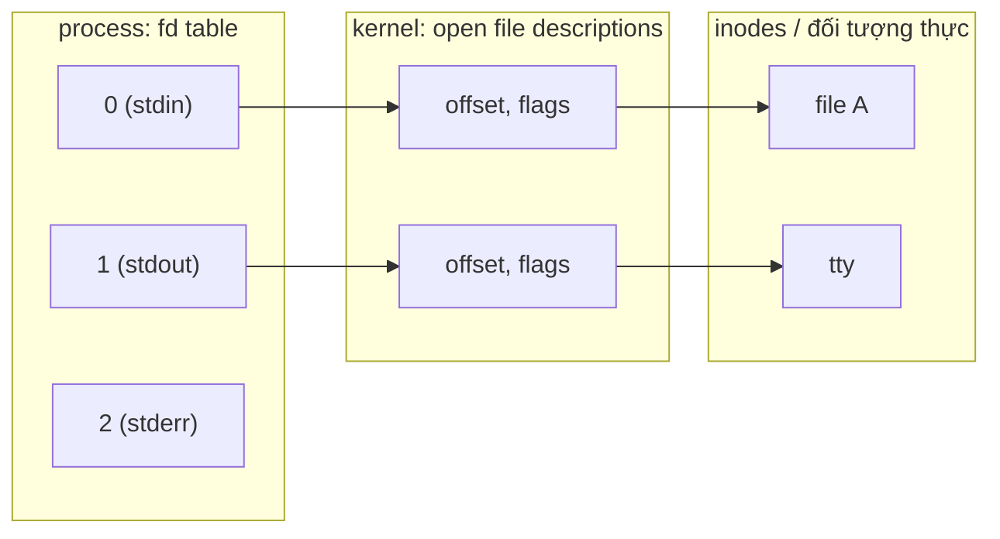

# File I/O — File Descriptor, Syscall, Buffering

> **TL;DR**
> - **"Everything is a file"**: file thường, device, pipe, socket... đều truy cập qua **file descriptor (fd)** — một số nguyên nhỏ là chỉ mục vào bảng fd của process.
> - **Syscall** (`open/read/write/close`) là API thô của kernel; **libc stdio** (`fopen/fread`) bọc thêm **buffering** trong user space → ít syscall hơn, nhanh hơn cho I/O nhỏ.
> - **Blocking** (mặc định): `read` chờ tới khi có dữ liệu. **Non-blocking** (`O_NONBLOCK`): trả về ngay với `EAGAIN` nếu chưa sẵn sàng — nền tảng cho event loop.
> - fd 0/1/2 = stdin/stdout/stderr. `dup2` để redirect. fd được kế thừa qua `fork`, đóng/giữ qua `exec` tùy cờ `CLOEXEC`.
> - Mỗi syscall = một lần chuyển user→kernel (tốn); giảm số syscall là chìa khóa hiệu năng I/O.

---

## 1. "Everything is a file" & file descriptor

Triết lý Unix: hầu hết tài nguyên I/O (file, terminal, pipe, socket, device dưới `/dev`) đều được trừu tượng hóa thành **file**, thao tác qua cùng bộ syscall (`read`, `write`, `close`). Điều này làm API thống nhất và dễ kết hợp.

**File descriptor (fd)** là một số nguyên không âm — chỉ mục vào **bảng file descriptor** riêng của mỗi process. Mỗi entry trỏ tới một **open file description** trong kernel (chứa offset hiện tại, cờ trạng thái, và trỏ tới inode/đối tượng thực).


*(fd là chỉ mục vào bảng fd của process → open file description (offset, cờ) → đối tượng thực.)*

fd mặc định: **0 = stdin, 1 = stdout, 2 = stderr**.

---

## 2. Syscall I/O cơ bản

```c
int fd = open("file.txt", O_RDONLY);     // mở, trả về fd nhỏ nhất chưa dùng
char buf[4096];
ssize_t n = read(fd, buf, sizeof buf);   // đọc tối đa n byte, trả số byte thực đọc
write(STDOUT_FILENO, buf, n);            // ghi
close(fd);                               // trả fd về hệ thống
```

- `open` cờ: `O_RDONLY/O_WRONLY/O_RDWR`, `O_CREAT`, `O_APPEND`, `O_TRUNC`, `O_NONBLOCK`, `O_CLOEXEC`...
- `read`/`write` trả số byte **thực sự** xử lý (có thể **ít hơn** yêu cầu — *short read/write*); phải xử lý vòng lặp.
- Lỗi → trả `-1`, đặt `errno` (kiểm tra `EINTR`, `EAGAIN`...).

---

## 3. Syscall vs libc stdio (buffering)

| | Syscall (`open/read/write`) | stdio (`fopen/fread/fprintf`) |
|--|----------------------------|-------------------------------|
| Tầng | Kernel trực tiếp | Thư viện user space (bọc syscall) |
| Đơn vị | fd (int) | `FILE*` |
| Buffer | Không (mỗi call = 1 syscall) | Có buffer user space |
| Hiệu năng I/O nhỏ | Kém (nhiều syscall) | Tốt (gộp nhiều thao tác thành ít syscall) |
| Kiểm soát | Chính xác, thấp cấp | Tiện, cao cấp |

**Buffering của stdio** gom dữ liệu trong user space rồi mới gọi `write` một lần → giảm số syscall (mỗi syscall tốn vì chuyển ngữ cảnh user↔kernel). 3 chế độ:
- **Fully buffered**: gom đầy buffer mới flush (file thường).
- **Line buffered**: flush khi gặp `\n` (terminal).
- **Unbuffered**: ghi ngay (stderr).

> ⚠️ Trộn lẫn syscall và stdio trên cùng fd dễ gây thứ tự sai vì stdio còn dữ liệu trong buffer chưa flush. Gọi `fflush` khi cần. Lưu ý phân biệt: stdio buffer (user) vs **page cache** của kernel (cache nội dung file trong RAM) — `fsync` để ép kernel ghi xuống disk thật.

---

## 4. Blocking vs Non-blocking I/O

```c
// Blocking (mặc định): read CHỜ tới khi có dữ liệu / EOF
ssize_t n = read(fd, buf, len);

// Non-blocking: trả về NGAY
int flags = fcntl(fd, F_GETFL);
fcntl(fd, F_SETFL, flags | O_NONBLOCK);
ssize_t n = read(fd, buf, len);
if (n == -1 && (errno == EAGAIN || errno == EWOULDBLOCK)) {
    // chưa có dữ liệu — quay lại sau (không block)
}
```

- **Blocking**: đơn giản, thread ngủ chờ — lãng phí khi quản nhiều fd (cần 1 thread/fd).
- **Non-blocking**: trả ngay với `EAGAIN` nếu chưa sẵn sàng → cho phép một thread phục vụ **nhiều fd** bằng cách kết hợp với `epoll` (xem [io-multiplexing.md](io-multiplexing.md)).

---

## 5. `dup`/`dup2` — nhân bản & redirect fd

```c
int newfd = dup(oldfd);       // tạo fd mới trỏ cùng open file description
dup2(fd, STDOUT_FILENO);      // làm stdout (1) trỏ tới fd → redirect output
```

Đây là cơ chế shell dùng cho `command > file.txt` (redirect) và `cmd1 | cmd2` (pipe nối stdout của cmd1 vào stdin của cmd2).

---

## 6. fd qua fork & exec

- **`fork`**: process con **kế thừa bản sao** bảng fd — cha/con chia sẻ cùng open file description (cùng offset!).
- **`exec`**: fd vẫn **giữ nguyên** sau exec, *trừ khi* được đánh dấu **close-on-exec** (`O_CLOEXEC` / `FD_CLOEXEC`). Đặt `CLOEXEC` là thực hành tốt để tránh rò rỉ fd vào chương trình con.

---

## 7. Lưu ý hiệu năng & embedded

- Mỗi syscall tốn (chuyển user↔kernel, có thể context switch) → đọc/ghi theo **block lớn** thay vì từng byte; hoặc dùng stdio buffering.
- `readv`/`writev` (scatter-gather): đọc/ghi nhiều buffer trong **một** syscall.
- `mmap`: map file vào bộ nhớ, truy cập như mảng — tránh copy, tốt cho file lớn/truy cập ngẫu nhiên.
- `O_DIRECT`, `fsync`/`fdatasync`: kiểm soát cache/độ bền dữ liệu (quan trọng cho storage/embedded có nguy cơ mất điện).

---

## Câu hỏi phỏng vấn liên quan

<details><summary>1) File descriptor là gì? "Everything is a file" nghĩa là gì?</summary>

File descriptor là một số nguyên không âm, là chỉ mục vào bảng file descriptor riêng của mỗi process; mỗi entry trỏ tới một open file description trong kernel (giữ offset, cờ) và từ đó tới đối tượng thực (inode, socket...). "Everything is a file" là triết lý Unix: hầu hết tài nguyên I/O — file thường, terminal, pipe, socket, device dưới `/dev` — đều được trừu tượng thành "file" và thao tác qua cùng bộ syscall (`read`/`write`/`close`), giúp API thống nhất và dễ kết hợp. fd 0/1/2 mặc định là stdin/stdout/stderr.
</details>

<details><summary>2) Khác nhau giữa read() syscall và fread() của stdio? Khi nào dùng cái nào?</summary>

`read()` là syscall gọi thẳng kernel — mỗi lần gọi là một lần chuyển user→kernel, không có buffer. `fread()` thuộc stdio (thư viện user space) bọc quanh `read()` và thêm **buffer trong user space**: nó gom nhiều thao tác nhỏ thành ít syscall hơn nên nhanh hơn rõ rệt cho I/O kích thước nhỏ/nhiều lần, và tiện hơn (định dạng, `FILE*`). Dùng stdio cho I/O thông thường, văn bản; dùng syscall trực tiếp khi cần kiểm soát chính xác (non-blocking, socket, fd đặc biệt) hoặc tự quản buffer.
</details>

<details><summary>3) Blocking và non-blocking I/O khác nhau thế nào? Non-blocking giải quyết vấn đề gì?</summary>

Với blocking I/O (mặc định), `read` trên fd chưa có dữ liệu sẽ làm thread ngủ chờ tới khi có dữ liệu hoặc EOF. Với non-blocking (`O_NONBLOCK`), `read` trả về ngay; nếu chưa có dữ liệu nó trả -1 với `errno == EAGAIN/EWOULDBLOCK`. Non-blocking cho phép **một thread phục vụ nhiều fd** mà không bị kẹt ở một fd, là nền tảng cho mô hình event-driven kết hợp `epoll` — thay vì phải dùng một thread cho mỗi kết nối (mô hình blocking tốn tài nguyên khi có hàng nghìn kết nối).
</details>

<details><summary>4) read() trả về ít byte hơn yêu cầu có phải lỗi không? Xử lý ra sao?</summary>

Không phải lỗi — đó là "short read", hoàn toàn hợp lệ: `read`/`write` trả về số byte **thực sự** xử lý, có thể ít hơn yêu cầu (vd pipe/socket mới có một phần dữ liệu, bị tín hiệu ngắt). Phải xử lý bằng vòng lặp: tiếp tục gọi cho phần còn lại tới khi đủ hoặc gặp EOF (0) / lỗi (-1). Cũng cần xử lý `errno == EINTR` (bị signal ngắt) bằng cách thử lại.
</details>

<details><summary>5) Điều gì xảy ra với file descriptor qua fork và exec?</summary>

Qua `fork`, process con kế thừa một bản sao bảng fd, và các fd của cha/con trỏ tới **cùng open file description** trong kernel (do đó chia sẻ chung offset). Qua `exec`, các fd vẫn được **giữ nguyên** sang chương trình mới, trừ khi fd được đánh dấu close-on-exec (`O_CLOEXEC`/`FD_CLOEXEC`) thì sẽ tự đóng. Đặt CLOEXEC là thực hành tốt để tránh rò rỉ fd nhạy cảm vào tiến trình con.
</details>

<details><summary>6) Phân biệt stdio buffer, page cache, và fsync.</summary>

stdio buffer nằm trong **user space** (thuộc thư viện C), gom dữ liệu để giảm số syscall; `fflush` đẩy nó xuống kernel (qua `write`). Page cache nằm trong **kernel**, cache nội dung file trong RAM để tăng tốc đọc/ghi; `write` thành công chỉ đảm bảo dữ liệu tới page cache, chưa chắc đã xuống disk vật lý. `fsync(fd)` (hoặc `fdatasync`) ép kernel ghi page cache của file xuống thiết bị lưu trữ thật — quan trọng cho độ bền dữ liệu (vd trước khi báo "đã lưu", hoặc hệ embedded có nguy cơ mất điện).
</details>

---
⬅️ [Về index topic](README.md) · ➡️ Tiếp theo: [processes-signals.md](processes-signals.md)
