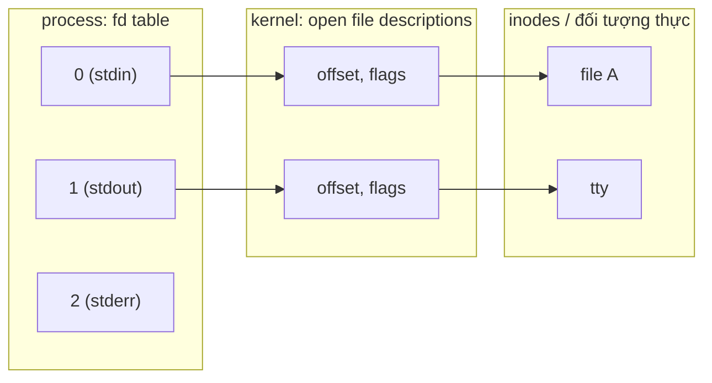

# File I/O — File Descriptor, Syscall, Buffering

> **TL;DR**
> - **"Everything is a file"**: file thường, device, pipe, socket... đều truy cập qua **file descriptor (fd)** — một số nguyên nhỏ là chỉ mục vào bảng fd của process.
> - **Syscall** (`open/read/write/close`) là API thô của kernel; **libc stdio** (`fopen/fread`) bọc thêm **buffering** trong user space → ít syscall hơn, nhanh hơn cho I/O nhỏ.
> - **Blocking** (mặc định): `read` chờ tới khi có dữ liệu. **Non-blocking** (`O_NONBLOCK`): trả về ngay với `EAGAIN` nếu chưa sẵn sàng — nền tảng cho event loop.
> - fd 0/1/2 = stdin/stdout/stderr. `dup2` để redirect. fd được kế thừa qua `fork`, đóng/giữ qua `exec` tùy cờ `CLOEXEC`.
> - **Atomicity**: `O_APPEND` và `O_CREAT|O_EXCL` tồn tại vì `lseek`+`write` / kiểm-tra-rồi-tạo là **hai syscall có khe hở** — race thật.
> - `read`/`write` có thể xử lý **ít hơn** số byte yêu cầu → luôn bọc vòng lặp.
> - Mỗi syscall = một lần chuyển user→kernel (tốn); giảm số syscall là chìa khóa hiệu năng I/O.

---

## 1. "Everything is a file" & file descriptor

Triết lý Unix: hầu hết tài nguyên I/O (file, terminal, pipe, socket, device dưới `/dev`) đều được trừu tượng hóa thành **file**, thao tác qua cùng bộ syscall (`read`, `write`, `close`). Điều này làm API thống nhất và dễ kết hợp.

**File descriptor (fd)** là một số nguyên không âm — chỉ mục vào **bảng file descriptor** riêng của mỗi process. Mỗi entry trỏ tới một **open file description** trong kernel (chứa offset hiện tại, cờ trạng thái, và trỏ tới inode/đối tượng thực).


```mermaid
flowchart LR
    subgraph P["process: fd table"]
        fd0["0 (stdin)"]
        fd1["1 (stdout)"]
        fd2["2 (stderr)"]
    end
    subgraph K["kernel: open file descriptions"]
        o1["offset, flags"]
        o2["offset, flags"]
    end
    subgraph I["inodes / đối tượng thực"]
        fA["file A"]
        tty["tty"]
    end
    fd0 --> o1 --> fA
    fd1 --> o2 --> tty
```
*(fd là chỉ mục vào bảng fd của process → open file description (offset, cờ) → đối tượng thực.)*

fd mặc định: **0 = stdin, 1 = stdout, 2 = stderr**.

**Phần ăn điểm của mô hình này — ai chia sẻ gì với ai:**

| Tình huống | Chia sẻ gì | Hệ quả |
|---|---|---|
| **`dup()`/`dup2()`** | Hai fd → **CÙNG một open file description** | **Chung offset, chung status flags.** Ghi qua fd này thì offset của fd kia cũng nhảy |
| **`fork()`** | fd của con → **cùng file description** với cha | Cha/con **chung offset** |
| **`open()` cùng file hai lần** | **Hai file description khác nhau**, cùng inode | **Offset độc lập** — ghi qua fd này không dịch offset fd kia |

> ⚠️ Còn một tầng nữa hay bị bỏ sót: **`FD_CLOEXEC` là thuộc tính của FD (tầng 1), không phải của file description (tầng 2)**. Nên **`dup()` KHÔNG sao chép cờ này** — bản sao mới luôn *tắt* close-on-exec. Nếu bạn `dup()` một fd đã đặt `O_CLOEXEC` rồi `exec`, fd bản sao vẫn **rò sang chương trình mới**.

---

## 2. Syscall I/O cơ bản

```c
int fd = open("file.txt", O_RDONLY);     // mở, trả về fd nhỏ nhất chưa dùng
char buf[4096];
ssize_t n = read(fd, buf, sizeof buf);   // đọc tối đa n byte, trả số byte thực đọc
write(STDOUT_FILENO, buf, n);            // ghi
close(fd);                               // trả fd về hệ thống
```

- `open` cờ: `O_RDONLY/O_WRONLY/O_RDWR`, `O_CREAT`, `O_APPEND`, `O_TRUNC`, `O_NONBLOCK`, `O_CLOEXEC`...
- `read`/`write` trả số byte **thực sự** xử lý (có thể **ít hơn** yêu cầu — *short read/write*); phải xử lý vòng lặp.
- Lỗi → trả `-1`, đặt `errno` (kiểm tra `EINTR`, `EAGAIN`...).

### 2.1. Partial read/write — không xử lý là bug

`read()` trả về **ít hơn** số byte yêu cầu là chuyện **bình thường**, không phải lỗi — rất hay xảy ra với **pipe, socket, terminal** (dữ liệu tới theo từng phần), và cả với file thường khi gần cuối file. Ba giá trị trả về phải phân biệt:

| Trả về | Nghĩa |
|---|---|
| `> 0` | Số byte đọc được — **có thể ít hơn** `count` |
| `= 0` | **End-of-file** (với socket: peer đã đóng) |
| `= -1` | Lỗi — riêng `EINTR` là *bị signal cắt*, thường phải **gọi lại** |

`write()` đối xứng: **partial write** khi đĩa đầy, vượt `RLIMIT_FSIZE`, hoặc pipe/socket đầy. Vì vậy code đúng phải bọc vòng lặp:

```c
ssize_t writeAll(int fd, const void *buf, size_t count) {
    const char *p = buf;
    size_t left = count;
    while (left > 0) {
        ssize_t n = write(fd, p, left);
        if (n == -1) {
            if (errno == EINTR) continue;    // bị signal cắt → thử lại, KHÔNG phải lỗi
            return -1;                        // lỗi thật
        }
        p += n; left -= n;                    // ghi được bao nhiêu trừ bấy nhiêu
    }
    return count;
}
```

> ⚠️ **`read()` KHÔNG thêm `'\0'`.** Muốn dùng kết quả như chuỗi thì phải **tự đặt** và cấp dư 1 byte:
> ```c
> char buf[MAX + 1];
> ssize_t n = read(fd, buf, MAX);
> if (n == -1) errExit("read");
> buf[n] = '\0';                 // thiếu dòng này là đọc tràn
> ```

### 2.2. Atomicity — vì sao có `O_APPEND` và `O_EXCL`

Nhiều thao tác "hiển nhiên" thực ra là **hai syscall**, và giữa chúng process khác chen vào được.

**Ca 1 — nhiều process cùng nối vào một file:**

```c
/* ❌ SAI: hai lệnh, có KHE HỞ ở giữa */
lseek(fd, 0, SEEK_END);        // ① tìm tới cuối
                               //    ← process khác ghi chen vào ĐÂY
write(fd, buf, len);           // ② ghi vào offset đã CŨ → ĐÈ MẤT dữ liệu bên kia

/* ✅ ĐÚNG: một syscall, kernel đảm bảo nguyên tử */
fd = open(path, O_WRONLY | O_APPEND);
write(fd, buf, len);           // seek-tới-cuối + ghi là MỘT thao tác không chia cắt
```

**Ca 2 — tạo file "chỉ khi chưa tồn tại"** (nền của lock file):

```c
/* ❌ SAI */
fd = open(path, O_WRONLY);
if (fd == -1 && errno == ENOENT)          // ← process khác TẠO file đúng lúc này
    fd = open(path, O_WRONLY | O_CREAT, 0600);   // ta tưởng mình tạo, thật ra đè

/* ✅ ĐÚNG */
fd = open(path, O_WRONLY | O_CREAT | O_EXCL, 0600);
if (fd == -1 && errno == EEXIST) { /* file đã có — biết CHẮC CHẮN */ }
```

**Ca 3 — đọc/ghi tại vị trí chỉ định mà không đụng offset chung:**

```c
pread(fd, buf, len, offset);    // = lseek + read, nguyên tử, KHÔNG dịch offset
pwrite(fd, buf, len, offset);
```
Đặc biệt quan trọng khi **nhiều thread dùng chung một fd** — vì các thread chia sẻ offset, `lseek`+`read` từ hai thread sẽ giẫm lên nhau.

> **Câu chốt mang đi mọi nơi:** *hễ phải làm hai syscall mà giữa chúng không được có ai chen vào, hãy tìm cờ hoặc syscall làm gộp cả hai.* Cùng mẫu này còn xuất hiện ở `O_CLOEXEC` (§6), `accept4()`, `epoll_create1()`, `sigsuspend()`, và `rename()`.

---

## 3. Syscall vs libc stdio (buffering)

| | Syscall (`open/read/write`) | stdio (`fopen/fread/fprintf`) |
|--|----------------------------|-------------------------------|
| Tầng | Kernel trực tiếp | Thư viện user space (bọc syscall) |
| Đơn vị | fd (int) | `FILE*` |
| Buffer | Không (mỗi call = 1 syscall) | Có buffer user space |
| Hiệu năng I/O nhỏ | Kém (nhiều syscall) | Tốt (gộp nhiều thao tác thành ít syscall) |
| Kiểm soát | Chính xác, thấp cấp | Tiện, cao cấp |

**Buffering của stdio** gom dữ liệu trong user space rồi mới gọi `write` một lần → giảm số syscall (mỗi syscall tốn vì chuyển ngữ cảnh user↔kernel). 3 chế độ:
- **Fully buffered**: gom đầy buffer mới flush (file thường).
- **Line buffered**: flush khi gặp `\n` (terminal).
- **Unbuffered**: ghi ngay (stderr).

> ⚠️ Trộn lẫn syscall và stdio trên cùng fd dễ gây thứ tự sai vì stdio còn dữ liệu trong buffer chưa flush. Gọi `fflush` khi cần. Lưu ý phân biệt: stdio buffer (user) vs **page cache** của kernel (cache nội dung file trong RAM) — `fsync` để ép kernel ghi xuống disk thật.

---

## 4. Blocking vs Non-blocking I/O

```c
// Blocking (mặc định): read CHỜ tới khi có dữ liệu / EOF
ssize_t n = read(fd, buf, len);

// Non-blocking: trả về NGAY
int flags = fcntl(fd, F_GETFL);
fcntl(fd, F_SETFL, flags | O_NONBLOCK);
ssize_t n = read(fd, buf, len);
if (n == -1 && (errno == EAGAIN || errno == EWOULDBLOCK)) {
    // chưa có dữ liệu — quay lại sau (không block)
}
```

- **Blocking**: đơn giản, thread ngủ chờ — lãng phí khi quản nhiều fd (cần 1 thread/fd).
- **Non-blocking**: trả ngay với `EAGAIN` nếu chưa sẵn sàng → cho phép một thread phục vụ **nhiều fd** bằng cách kết hợp với `epoll` (xem [io-multiplexing.md](io-multiplexing.md)).

---

## 5. `dup`/`dup2` — nhân bản & redirect fd

```c
int newfd = dup(oldfd);       // tạo fd mới trỏ cùng open file description
dup2(fd, STDOUT_FILENO);      // làm stdout (1) trỏ tới fd → redirect output
```

Đây là cơ chế shell dùng cho `command > file.txt` (redirect) và `cmd1 | cmd2` (pipe nối stdout của cmd1 vào stdin của cmd2).

---

## 6. fd qua fork & exec

- **`fork`**: process con **kế thừa bản sao** bảng fd — cha/con chia sẻ cùng open file description (cùng offset!).
- **`exec`**: fd vẫn **giữ nguyên** sau exec, *trừ khi* được đánh dấu **close-on-exec** (`O_CLOEXEC` / `FD_CLOEXEC`). Đặt `CLOEXEC` là thực hành tốt để tránh rò rỉ fd vào chương trình con.

**Cái gì sống sót qua `exec()` — bảng nên thuộc:**

| Sống sót ✅ | Bị vứt ❌ |
|---|---|
| **PID, PPID**, process group, session | Toàn bộ **text/data/bss/heap/stack** |
| **fd đang mở** (trừ `FD_CLOEXEC`), cùng offset & status flags | **Signal handler** (code handler không còn tồn tại) |
| **Signal mask** và tập signal pending | Vùng nhớ `mmap` |
| Thư mục làm việc, umask, giới hạn tài nguyên | Mọi thread khác |

> ⚠️ **Điểm tinh dễ mất điểm:** signal **handler** bị vứt nhưng signal **mask** thì **KHÔNG** — và signal đang đặt `SIG_IGN` vẫn tiếp tục bị bỏ qua. Nghĩa là chương trình mới **thừa hưởng một signal mask mà nó không hề biết**, nên có thể "điếc" với signal nó tưởng đang nhận. Chương trình đặc quyền nên **reset signal mask** sau `exec`.

**Luôn ưu tiên bản nguyên tử** thay vì `open()` rồi `fcntl(F_SETFD)`:

```c
fd   = open(path, O_RDONLY | O_CLOEXEC);        // thay vì open() rồi fcntl()
cfd  = accept4(sfd, NULL, NULL, SOCK_CLOEXEC);
epfd = epoll_create1(EPOLL_CLOEXEC);
```
Giữa `open()` và `fcntl(F_SETFD)` có **khe hở**: thread khác `fork()`+`exec()` đúng lúc đó là fd **rò sang chương trình mới**. Cùng mẫu race với §2.2.

---

## 7. Lưu ý hiệu năng & embedded

- Mỗi syscall tốn (chuyển user↔kernel, có thể context switch) → đọc/ghi theo **block lớn** thay vì từng byte; hoặc dùng stdio buffering.
- `readv`/`writev` (scatter-gather): đọc/ghi nhiều buffer trong **một** syscall.
- `mmap`: map file vào bộ nhớ, truy cập như mảng — tránh copy, tốt cho file lớn/truy cập ngẫu nhiên.
- `O_DIRECT`, `fsync`/`fdatasync`: kiểm soát cache/độ bền dữ liệu (quan trọng cho storage/embedded có nguy cơ mất điện).

---

## Câu hỏi phỏng vấn liên quan

> Đáp án sống trong [bank/](../14-prep/mock-interview/bank/) — **một đáp án, một chỗ** ([CLAUDE.md §4.7](../CLAUDE.md)). Tự trả lời trước khi mở.

| ID | Câu hỏi |
|----|---------|
| [LNX-001](../14-prep/mock-interview/bank/linux-sysprog.md) | File descriptor là gì? "Everything is a file" nghĩa là gì? |
| [LNX-032](../14-prep/mock-interview/bank/linux-sysprog.md) | Khác nhau giữa read() syscall và fread() của stdio? Khi nào dùng cái nào? |
| [LNX-003](../14-prep/mock-interview/bank/linux-sysprog.md) | Blocking và non-blocking I/O khác nhau thế nào? Non-blocking giải quyết vấn đề gì? |
| [LNX-005](../14-prep/mock-interview/bank/linux-sysprog.md) | read() trả về ít byte hơn yêu cầu có phải lỗi không? Xử lý ra sao? |
| [LNX-028](../14-prep/mock-interview/bank/linux-sysprog.md) | Vì sao cần `O_APPEND`? `lseek()` rồi `write()` sai ở đâu? |
| [LNX-012](../14-prep/mock-interview/bank/linux-sysprog.md) | Điều gì xảy ra với file descriptor qua fork và exec? |
| [LNX-007](../14-prep/mock-interview/bank/linux-sysprog.md) | Phân biệt stdio buffer, page cache, và fsync. |

---
⬅️ [Về index topic](README.md) · ➡️ Tiếp theo: [processes-signals.md](processes-signals.md)
