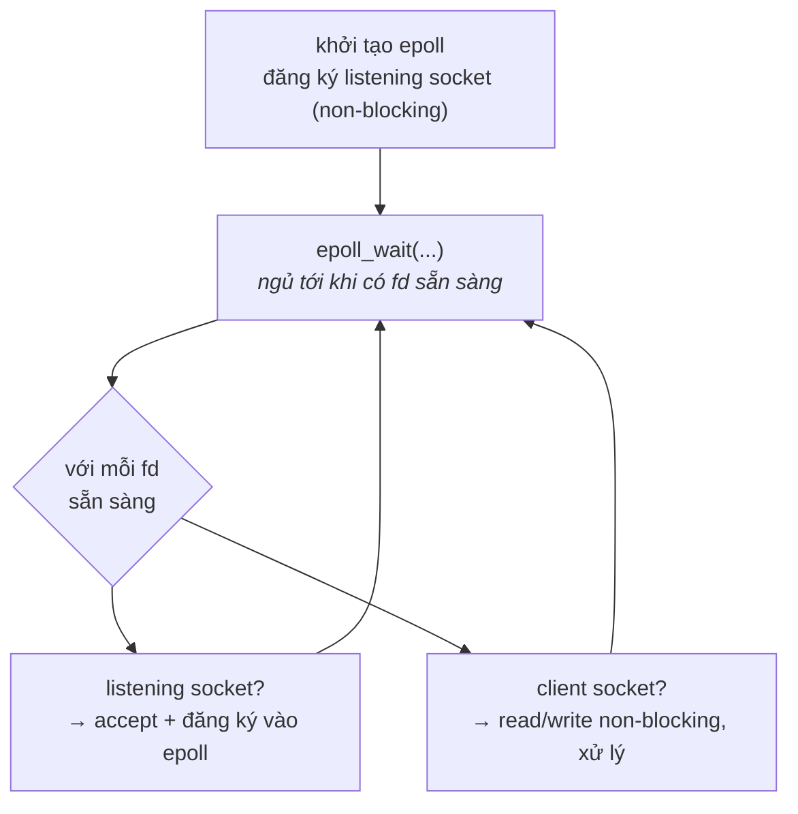

# I/O Multiplexing — select, poll, epoll & Event Loop

> **TL;DR**
> - Vấn đề: một thread cần theo dõi **nhiều fd** cùng lúc, xử lý cái nào sẵn sàng — không thể block trên từng cái. → I/O multiplexing.
> - **`select`**: cũ, giới hạn `FD_SETSIZE` (1024), quét tuyến tính O(n) mỗi lần, phải dựng lại set. **`poll`**: bỏ giới hạn 1024 nhưng vẫn O(n).
> - **`epoll`** (Linux): O(1) theo số fd *sẵn sàng*, không quét toàn bộ, scale tốt tới hàng chục/trăm nghìn kết nối (**C10K**). Là nền tảng của Nginx, Redis, libuv...
> - **Level-triggered** (mặc định, dễ đúng) vs **edge-triggered** (báo một lần khi đổi trạng thái, hiệu năng cao nhưng phải đọc cạn — dùng với non-blocking fd).
> - Mô hình **event loop**: một (vài) thread + non-blocking I/O + epoll → phục vụ rất nhiều kết nối với ít tài nguyên.

---

## 1. Vấn đề C10K — vì sao cần multiplexing

Một server cần phục vụ hàng nghìn kết nối đồng thời. Hai cách ngây thơ đều kém:
- **Một thread blocking/kết nối**: 10.000 kết nối = 10.000 thread → tốn RAM (mỗi stack vài MB), context switch khổng lồ.
- **Busy-poll non-blocking từng fd**: đốt 100% CPU quét vô ích.

**Giải pháp:** dùng non-blocking fd + một syscall hỏi kernel "trong tập fd này, cái nào *đã sẵn sàng* để đọc/ghi?" → chỉ xử lý những fd sẵn sàng. Đó là I/O multiplexing.

---

## 2. `select`

```c
fd_set rfds;
FD_ZERO(&rfds);
FD_SET(fd, &rfds);
struct timeval tv = {5, 0};
int n = select(maxfd + 1, &rfds, NULL, NULL, &tv);  // chờ tới khi có fd sẵn sàng / timeout
if (FD_ISSET(fd, &rfds)) { /* fd đọc được */ }
```

Hạn chế:
- Số fd giới hạn bởi **`FD_SETSIZE`** (thường 1024).
- Mỗi lần gọi phải **dựng lại** `fd_set` (select sửa nó tại chỗ).
- Kernel **quét tuyến tính** toàn bộ fd → **O(n)** dù chỉ vài cái sẵn sàng.

---

## 3. `poll`

```c
struct pollfd fds[N];
fds[0].fd = sock; fds[0].events = POLLIN;
int n = poll(fds, N, timeout_ms);
if (fds[0].revents & POLLIN) { /* ... */ }
```

- Bỏ giới hạn 1024 (dùng mảng `pollfd` tùy ý), API gọn hơn select, tách `events`/`revents` nên không phải dựng lại.
- Nhưng vẫn **O(n)**: kernel và user đều quét toàn bộ mảng mỗi lần gọi.

---

## 4. `epoll` — giải pháp scale của Linux

Ý tưởng then chốt: **đăng ký fd một lần** vào kernel, kernel **duy trì** tập theo dõi và chỉ trả về **các fd đã sẵn sàng** → không quét lại toàn bộ mỗi lần.

```c
int ep = epoll_create1(0);

struct epoll_event ev = { .events = EPOLLIN, .data.fd = sock };
epoll_ctl(ep, EPOLL_CTL_ADD, sock, &ev);     // đăng ký (1 lần)

struct epoll_event events[MAX];
int n = epoll_wait(ep, events, MAX, timeout); // chỉ trả về fd SẴN SÀNG
for (int i = 0; i < n; ++i)
    handle(events[i].data.fd);
```

| | select | poll | epoll |
|--|--------|------|-------|
| Giới hạn fd | ~1024 | Không | Không |
| Độ phức tạp mỗi call | O(n) | O(n) | **O(số fd sẵn sàng)** |
| Đăng ký lại fd mỗi call? | Có | Có | Không (đăng ký 1 lần) |
| Di động | POSIX (rộng) | POSIX | **Chỉ Linux** |

- **O(1)/O(k)**: chi phí tỉ lệ số fd *sẵn sàng* (k), không phải tổng số fd theo dõi (n) → scale tốt khi đa số kết nối idle.
- Tương đương: **kqueue** (BSD/macOS), **IOCP** (Windows). `io_uring` là hướng mới hơn nữa cho I/O bất đồng bộ.

---

## 5. Level-triggered vs Edge-triggered

| | Level-triggered (LT, mặc định) | Edge-triggered (ET) |
|--|-------------------------------|---------------------|
| Khi nào báo | Báo **liên tục** chừng nào fd còn dữ liệu chưa đọc | Báo **một lần** khi trạng thái *chuyển* sang sẵn sàng |
| Đọc cạn? | Không bắt buộc | **Bắt buộc** đọc tới `EAGAIN` (nếu không sẽ "mất" sự kiện) |
| Độ khó | Dễ đúng | Dễ sai hơn |
| Hiệu năng | Tốt | Cao hơn (ít epoll_wait hơn) |

- **LT**: nếu lần này chưa đọc hết, lần `epoll_wait` sau vẫn báo lại → an toàn, dễ lập trình. (`select`/`poll` chỉ có LT.)
- **ET** (`EPOLLET`): chỉ báo khi có *chuyển biến* (vd dữ liệu mới đến). Phải dùng **fd non-blocking** và **đọc/ghi trong vòng lặp tới khi `EAGAIN`**, nếu không dữ liệu còn lại sẽ không được báo lại → treo. Hiệu quả hơn cho hiệu năng cao.

---

## 6. Mô hình Event Loop (reactor)

```
khởi tạo epoll, đăng ký listening socket (non-blocking)
loop:
    n = epoll_wait(...)                 // ngủ tới khi có sự kiện
    for mỗi fd sẵn sàng:
        nếu là listening socket → accept kết nối mới, đăng ký vào epoll
        nếu là client socket    → read/write non-blocking, xử lý
```


*(Một thread quay vòng: ngủ chờ → xử lý fd sẵn sàng → quay lại. Không bao giờ block trong vòng lặp.)*

- Một thread phục vụ rất nhiều kết nối → ít context switch, ít RAM. Đây là kiến trúc của **Nginx, Redis (single-thread event loop), Node.js/libuv**.
- Mở rộng: nhiều event loop trên nhiều thread/core (one loop per thread), hoặc kết hợp thread pool cho tác vụ CPU nặng (tránh block event loop).
- Nguyên tắc: **không bao giờ block** trong event loop (mọi I/O non-blocking; việc tính toán lâu đẩy sang thread khác).

---

## 7. Lựa chọn thực tế

- Ít fd, cần **di động** đa nền tảng → `poll` (hoặc thư viện trừu tượng như libuv/libevent lo giúp).
- Nhiều kết nối, Linux, cần hiệu năng → **`epoll`** (LT trước cho đơn giản, ET khi cần tối ưu).
- Đừng tự viết từ đầu cho production nếu có thể dùng **libuv/libevent/asio** — chúng đã trừu tượng hóa epoll/kqueue/IOCP và xử lý vô số ca biên.

---

## Câu hỏi phỏng vấn liên quan

<details><summary>1) I/O multiplexing giải quyết vấn đề gì?</summary>

Vấn đề là làm sao một (hoặc ít) thread theo dõi và phục vụ **nhiều fd/kết nối** cùng lúc mà không lãng phí. Mô hình một-thread-blocking-mỗi-kết-nối tốn quá nhiều RAM và context switch khi có hàng nghìn kết nối (C10K); còn busy-poll từng fd thì đốt CPU. I/O multiplexing (select/poll/epoll) cho phép hỏi kernel "fd nào trong tập này đã sẵn sàng đọc/ghi" và chỉ xử lý những cái sẵn sàng, kết hợp với non-blocking I/O — phục vụ nhiều kết nối với rất ít thread.
</details>

<details><summary>2) epoll khác select/poll thế nào và vì sao scale tốt hơn?</summary>

`select`/`poll` yêu cầu truyền toàn bộ tập fd vào kernel mỗi lần gọi và kernel quét tuyến tính tất cả để tìm cái sẵn sàng → O(n) theo tổng số fd; `select` còn giới hạn ~1024 fd. `epoll` cho **đăng ký fd một lần** (`epoll_ctl`), kernel tự duy trì tập theo dõi và một danh sách sẵn sàng; `epoll_wait` chỉ trả về các fd **đã sẵn sàng** nên chi phí tỉ lệ số fd sẵn sàng (k) chứ không phải tổng (n). Khi phần lớn trong hàng chục nghìn kết nối đang idle, epoll hiệu quả hơn hẳn — nền tảng cho Nginx/Redis. Đổi lại epoll chỉ có trên Linux.
</details>

<details><summary>3) Level-triggered và edge-triggered khác nhau ra sao? Khi dùng ET cần lưu ý gì?</summary>

Level-triggered (mặc định): epoll báo fd sẵn sàng **liên tục** chừng nào còn dữ liệu chưa đọc — nếu lần này đọc chưa hết, lần `epoll_wait` sau vẫn báo, nên dễ lập trình đúng. Edge-triggered (`EPOLLET`): chỉ báo **một lần khi trạng thái chuyển** sang sẵn sàng (vd dữ liệu mới đến); nếu không xử lý hết sẽ không được báo lại. Vì vậy với ET phải dùng fd **non-blocking** và đọc/ghi trong vòng lặp **tới khi `EAGAIN`** để vét cạn dữ liệu, nếu không sẽ bị "treo" sự kiện. ET giảm số lần gọi epoll_wait nên hiệu năng cao hơn nhưng dễ sai hơn.
</details>

<details><summary>4) Event loop hoạt động thế nào? Vì sao Nginx/Redis dùng nó?</summary>

Event loop kết hợp non-blocking I/O với epoll: vòng lặp gọi `epoll_wait` để ngủ tới khi có fd sẵn sàng, rồi với mỗi fd sẵn sàng thì accept kết nối mới hoặc đọc/ghi non-blocking và xử lý, sau đó quay lại chờ. Một thread phục vụ rất nhiều kết nối nên tốn ít RAM và rất ít context switch so với mô hình thread-mỗi-kết-nối. Nginx/Redis dùng nó vì workload chủ yếu là I/O-bound với nhiều kết nối đồng thời — mô hình này cho thông lượng cao và độ trễ thấp. Nguyên tắc cốt lõi: không bao giờ block trong event loop; tác vụ CPU nặng phải đẩy sang thread riêng.
</details>

<details><summary>5) Tại sao edge-triggered phải dùng với non-blocking fd?</summary>

Vì ET chỉ báo một lần khi có chuyển biến, nên khi nhận sự kiện ta phải đọc (hoặc ghi) lặp lại cho tới khi vét cạn dữ liệu — nhận biết bằng `read`/`write` trả về `EAGAIN/EWOULDBLOCK`. Nếu fd ở chế độ **blocking**, lần đọc cuối khi không còn dữ liệu sẽ **block** thread vô thời hạn (thay vì trả `EAGAIN`), làm treo event loop. Do đó fd phải non-blocking để vòng lặp đọc kết thúc đúng lúc.
</details>

---
⬅️ [processes-signals.md](processes-signals.md) · ➡️ Tiếp theo: [ipc-linux.md](ipc-linux.md)
