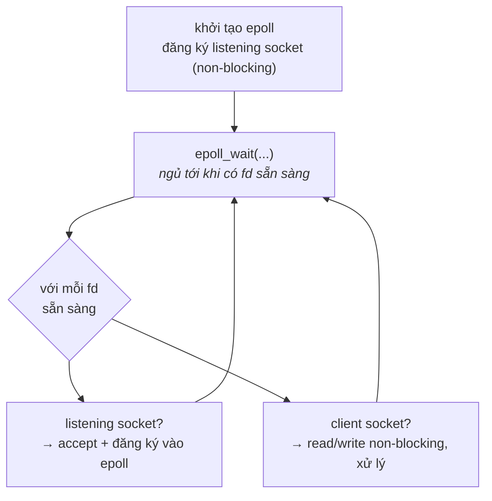

# I/O Multiplexing — select, poll, epoll & Event Loop

> **TL;DR**
> - Vấn đề: một thread cần theo dõi **nhiều fd** cùng lúc, xử lý cái nào sẵn sàng — không thể block trên từng cái. → I/O multiplexing.
> - **`select`**: cũ, giới hạn `FD_SETSIZE` (1024), quét tuyến tính O(n) mỗi lần, phải dựng lại set. **`poll`**: bỏ giới hạn 1024 nhưng vẫn O(n).
> - **`epoll`** (Linux): O(1) theo số fd *sẵn sàng*, không quét toàn bộ, scale tốt tới hàng chục/trăm nghìn kết nối (**C10K**). Là nền tảng của Nginx, Redis, libuv...
> - **Level-triggered** (mặc định, dễ đúng) vs **edge-triggered** (báo một lần khi đổi trạng thái, hiệu năng cao nhưng phải đọc cạn — dùng với non-blocking fd).
> - Mô hình **event loop**: một (vài) thread + non-blocking I/O + epoll → phục vụ rất nhiều kết nối với ít tài nguyên.

---

## 1. Vấn đề C10K — vì sao cần multiplexing

Một server cần phục vụ hàng nghìn kết nối đồng thời. Hai cách ngây thơ đều kém:
- **Một thread blocking/kết nối**: 10.000 kết nối = 10.000 thread → tốn RAM (mỗi stack vài MB), context switch khổng lồ.
- **Busy-poll non-blocking từng fd**: đốt 100% CPU quét vô ích.

**Giải pháp:** dùng non-blocking fd + một syscall hỏi kernel "trong tập fd này, cái nào *đã sẵn sàng* để đọc/ghi?" → chỉ xử lý những fd sẵn sàng. Đó là I/O multiplexing.

---

## 2. `select`

```c
fd_set rfds;
FD_ZERO(&rfds);
FD_SET(fd, &rfds);
struct timeval tv = {5, 0};
int n = select(maxfd + 1, &rfds, NULL, NULL, &tv);  // chờ tới khi có fd sẵn sàng / timeout
if (FD_ISSET(fd, &rfds)) { /* fd đọc được */ }
```

Hạn chế:
- Số fd giới hạn bởi **`FD_SETSIZE`** (thường 1024).
- Mỗi lần gọi phải **dựng lại** `fd_set` (select sửa nó tại chỗ).
- Kernel **quét tuyến tính** toàn bộ fd → **O(n)** dù chỉ vài cái sẵn sàng.

---

## 3. `poll`

```c
struct pollfd fds[N];
fds[0].fd = sock; fds[0].events = POLLIN;
int n = poll(fds, N, timeout_ms);
if (fds[0].revents & POLLIN) { /* ... */ }
```

- Bỏ giới hạn 1024 (dùng mảng `pollfd` tùy ý), API gọn hơn select, tách `events`/`revents` nên không phải dựng lại.
- Nhưng vẫn **O(n)**: kernel và user đều quét toàn bộ mảng mỗi lần gọi.

---

## 4. `epoll` — giải pháp scale của Linux

Ý tưởng then chốt: **đăng ký fd một lần** vào kernel, kernel **duy trì** tập theo dõi và chỉ trả về **các fd đã sẵn sàng** → không quét lại toàn bộ mỗi lần.

```c
int ep = epoll_create1(0);

struct epoll_event ev = { .events = EPOLLIN, .data.fd = sock };
epoll_ctl(ep, EPOLL_CTL_ADD, sock, &ev);     // đăng ký (1 lần)

struct epoll_event events[MAX];
int n = epoll_wait(ep, events, MAX, timeout); // chỉ trả về fd SẴN SÀNG
for (int i = 0; i < n; ++i)
    handle(events[i].data.fd);
```

| | select | poll | epoll |
|--|--------|------|-------|
| Giới hạn fd | ~1024 | Không | Không |
| Độ phức tạp mỗi call | O(n) | O(n) | **O(số fd sẵn sàng)** |
| Đăng ký lại fd mỗi call? | Có | Có | Không (đăng ký 1 lần) |
| Di động | POSIX (rộng) | POSIX | **Chỉ Linux** |

- **O(1)/O(k)**: chi phí tỉ lệ số fd *sẵn sàng* (k), không phải tổng số fd theo dõi (n) → scale tốt khi đa số kết nối idle.
- Tương đương: **kqueue** (BSD/macOS), **IOCP** (Windows). `io_uring` là hướng mới hơn nữa cho I/O bất đồng bộ.

---

## 5. Level-triggered vs Edge-triggered

| | Level-triggered (LT, mặc định) | Edge-triggered (ET) |
|--|-------------------------------|---------------------|
| Khi nào báo | Báo **liên tục** chừng nào fd còn dữ liệu chưa đọc | Báo **một lần** khi trạng thái *chuyển* sang sẵn sàng |
| Đọc cạn? | Không bắt buộc | **Bắt buộc** đọc tới `EAGAIN` (nếu không sẽ "mất" sự kiện) |
| Độ khó | Dễ đúng | Dễ sai hơn |
| Hiệu năng | Tốt | Cao hơn (ít epoll_wait hơn) |

- **LT**: nếu lần này chưa đọc hết, lần `epoll_wait` sau vẫn báo lại → an toàn, dễ lập trình. (`select`/`poll` chỉ có LT.)
- **ET** (`EPOLLET`): chỉ báo khi có *chuyển biến* (vd dữ liệu mới đến). Phải dùng **fd non-blocking** và **đọc/ghi trong vòng lặp tới khi `EAGAIN`**, nếu không dữ liệu còn lại sẽ không được báo lại → treo. Hiệu quả hơn cho hiệu năng cao.

---

## 6. Mô hình Event Loop (reactor)

```
khởi tạo epoll, đăng ký listening socket (non-blocking)
loop:
    n = epoll_wait(...)                 // ngủ tới khi có sự kiện
    nếu n == -1 và errno == EINTR → gọi lại (KHÔNG phải lỗi)
    for mỗi fd sẵn sàng:
        nếu là listening socket → accept kết nối mới, đăng ký vào epoll
        nếu là client socket    → read/write non-blocking, xử lý
```

```c
for (;;) {
    int n;
    do {
        n = epoll_wait(epfd, evlist, MAX_EVENTS, -1);
    } while (n == -1 && errno == EINTR);   // ⚠️ BẮT BUỘC — xem ghi chú dưới
    if (n == -1) errExit("epoll_wait");

    for (int i = 0; i < n; i++) { /* xử lý evlist[i] */ }
}
```

> ⚠️ **Vòng `EINTR` này không bỏ được.** `epoll_wait` nằm trong nhóm syscall **không bao giờ** được kernel tự khởi động lại, **kể cả khi handler cài với `SA_RESTART`** (cùng nhóm: `select`, `poll`, `sleep`, `pause`). Thiếu vòng lặp → server thoát/lỗi ngẫu nhiên mỗi khi có signal tới đúng lúc — bug rất khó tái hiện. Bảng đầy đủ: [processes-signals.md §5](processes-signals.md).
>
> Cần chờ fd **và** signal cùng lúc mà không có race → dùng `epoll_pwait()` (đặt signal mask nguyên tử với việc đi ngủ), hoặc kéo signal vào chính event loop bằng **`signalfd`** (§7 dưới, và [ipc-linux.md](ipc-linux.md)).


```mermaid
flowchart TD
    INIT["khởi tạo epoll<br/>đăng ký listening socket (non-blocking)"]
    WAIT["epoll_wait(...)<br/><i>ngủ tới khi có fd sẵn sàng</i>"]
    LOOP{"với mỗi fd<br/>sẵn sàng"}
    ACC["listening socket?<br/>→ accept + đăng ký vào epoll"]
    CLI["client socket?<br/>→ read/write non-blocking, xử lý"]
    INIT --> WAIT --> LOOP
    LOOP --> ACC --> WAIT
    LOOP --> CLI --> WAIT
```
*(Một thread quay vòng: ngủ chờ → xử lý fd sẵn sàng → quay lại. Không bao giờ block trong vòng lặp.)*

- Một thread phục vụ rất nhiều kết nối → ít context switch, ít RAM. Đây là kiến trúc của **Nginx, Redis (single-thread event loop), Node.js/libuv**.
- Mở rộng: nhiều event loop trên nhiều thread/core (one loop per thread), hoặc kết hợp thread pool cho tác vụ CPU nặng (tránh block event loop).
- Nguyên tắc: **không bao giờ block** trong event loop (mọi I/O non-blocking; việc tính toán lâu đẩy sang thread khác).

---

## 7. Lựa chọn thực tế

- Ít fd, cần **di động** đa nền tảng → `poll` (hoặc thư viện trừu tượng như libuv/libevent lo giúp).
- Nhiều kết nối, Linux, cần hiệu năng → **`epoll`** (LT trước cho đơn giản, ET khi cần tối ưu).
- Đừng tự viết từ đầu cho production nếu có thể dùng **libuv/libevent/asio** — chúng đã trừu tượng hóa epoll/kqueue/IOCP và xử lý vô số ca biên.

### ⚠️ Khi nào KHÔNG dùng epoll

| Tình huống | Vì sao | Dùng gì thay |
|---|---|---|
| **Ít fd** (vài chục) | Ưu thế của epoll đến từ *"đa số fd idle"*. Với n nhỏ, `epoll_ctl` + cấu trúc kernel **đắt hơn** một vòng quét | `poll` — đơn giản hơn, di động hơn |
| Cần chạy trên **BSD/macOS** | epoll **chỉ có trên Linux** | `kqueue`, hoặc libuv/libevent |
| Tải **CPU-bound** | Nút thắt là tính toán, không phải chờ I/O. Event loop không giúp gì | Thread pool |
| **File thường trên đĩa** | ⭐ File thường **LUÔN** báo "sẵn sàng" với epoll — kể cả khi đọc nó sẽ chặn hàng ms. epoll **vô dụng** với file | Thread pool, hoặc `io_uring` |

⚠️ Ô cuối là bẫy thật: người ta cắm fd của file vào epoll rồi tưởng đã có I/O bất đồng bộ — thực ra vòng lặp **vẫn bị chặn** ở `read()`, chỉ là chặn ở chỗ khác.

---

## 8. ⚠️ Bẫy thực chiến

**① `close(fd)` tự động gỡ fd khỏi epoll set — nhưng CHỈ khi đó là tham chiếu cuối cùng.**
Đây là bug kinh điển và rất khó lần. Nếu fd đã được `dup()` (hoặc thừa hưởng qua `fork`), thì `close()` **không** gỡ nó khỏi epoll — **open file description vẫn sống** ⇒ `epoll_wait` tiếp tục trả về sự kiện cho một fd bạn tưởng đã đóng, và số fd đó có thể đã được cấp lại cho một kết nối **khác**.
⇒ **Luôn `epoll_ctl(EPOLL_CTL_DEL)` một cách tường minh TRƯỚC khi `close()`.** Đừng dựa vào hành vi tự động.

**② Thundering herd — nhiều thread/process cùng chờ một listening socket.**
Kết nối tới ⇒ kernel **đánh thức tất cả**, chỉ một cái `accept` được, số còn lại thức dậy vô ích rồi ngủ lại. Lãng phí tăng theo số worker. Xảy ra khi epoll instance được kế thừa qua `fork` (mẫu pre-fork của Nginx).
⇒ Chữa bằng cờ **`EPOLLEXCLUSIVE`** khi đăng ký listening socket (kernel chỉ đánh thức một), hoặc dùng **`SO_REUSEPORT`** để mỗi worker có hàng đợi accept riêng.

**③ Một fd, hai thread cùng xử lý — dùng `EPOLLONESHOT`.**
Với nhiều thread cùng gọi `epoll_wait` trên một epoll set, **hai thread có thể cùng nhận sự kiện của một fd** ⇒ cùng đọc một kết nối, dữ liệu xen kẽ, trạng thái hỏng.
⇒ `EPOLLONESHOT`: sau khi báo một lần, kernel **tắt** fd đó cho tới khi bạn `EPOLL_CTL_MOD` bật lại ⇒ đảm bảo mỗi lúc chỉ một thread sở hữu fd. Nhớ **bật lại sau khi xử lý xong**, quên là kết nối im lặng vĩnh viễn.

**④ Chỉ vét cạn phía đọc mà quên phía ghi.** Với `EPOLLET`, `EPOLLOUT` cũng là edge: ghi tới khi `EAGAIN` mới thôi. Quên ⇒ dữ liệu tồn trong buffer ứng dụng mà không bao giờ được bơm tiếp.

**⑤ Backpressure — bug "OOM ở nhà khách".**
Consumer chậm hơn producer thì dữ liệu chưa gửi được **dồn vào buffer ứng dụng**. Không giới hạn ⇒ buffer phình tới khi hết RAM. Với 10.000 kết nối thì chỉ cần mỗi cái vài trăm KB là đủ chết.
⇒ Đặt **trần cho buffer gửi mỗi kết nối**; vượt trần thì **ngừng đọc** từ nguồn (bỏ `EPOLLIN` khỏi fd nguồn) để đẩy áp lực ngược về phía gửi — hoặc ngắt kết nối. **Không bao giờ để buffer lớn vô hạn.**

**⑥ Một handler chậm làm chết TOÀN BỘ kết nối.** Nguyên tắc *"không bao giờ block trong event loop"* bao gồm cả: gọi hàm tính toán nặng, `malloc` khối lớn, tra DNS đồng bộ, ghi log đồng bộ xuống flash chậm, và **mọi mutex có thể bị giữ lâu**. Một chỗ chặn 100 ms là 10.000 kết nối cùng trễ 100 ms.

**⑦ `EINTR`.** `epoll_wait` **không bao giờ** tự restart, kể cả với `SA_RESTART` — vòng lặp `EINTR` là bắt buộc (§6).

---

## Câu hỏi phỏng vấn liên quan

> Đáp án sống trong [bank/](../14-prep/mock-interview/bank/) — **một đáp án, một chỗ** ([CLAUDE.md §4.7](../CLAUDE.md)). Tự trả lời trước khi mở.

| ID | Câu hỏi |
|----|---------|
| [LNX-033](../14-prep/mock-interview/bank/linux-sysprog.md) | I/O multiplexing giải quyết vấn đề gì? |
| [LNX-009](../14-prep/mock-interview/bank/linux-sysprog.md) | epoll khác select/poll thế nào và vì sao scale tốt hơn? |
| [LNX-010](../14-prep/mock-interview/bank/linux-sysprog.md) | Level-triggered và edge-triggered khác nhau ra sao? Khi dùng ET cần lưu ý gì? |
| [LNX-013](../14-prep/mock-interview/bank/linux-sysprog.md) | Event loop hoạt động thế nào? Vì sao Nginx/Redis dùng nó? |
| [LNX-010](../14-prep/mock-interview/bank/linux-sysprog.md) | Tại sao edge-triggered phải dùng với non-blocking fd? |

---
⬅️ [processes-signals.md](processes-signals.md) · ➡️ Tiếp theo: [ipc-linux.md](ipc-linux.md)
