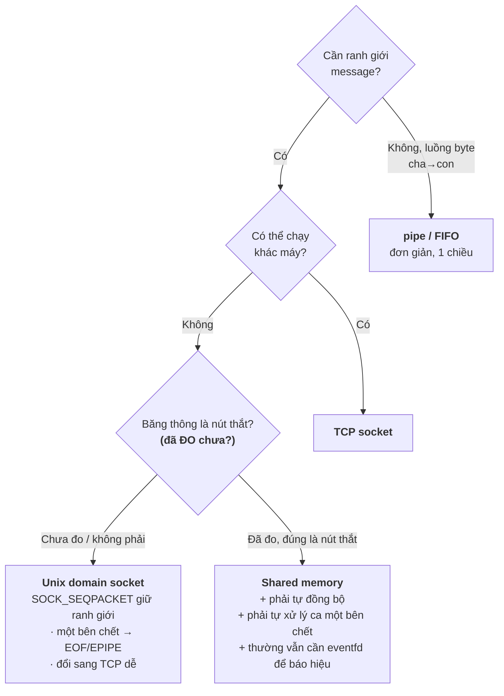

# IPC trên Linux — chọn cơ chế và trả giá

> **TL;DR**
> - Đây là góc *thực hành* của [03-operating-system/ipc.md](../03-operating-system/ipc.md). Nhưng **câu hỏi phỏng vấn không bao giờ là "API nào"** — nó luôn là *"chọn cái nào, vì sao, và hỏng thế nào"*.
> - **Bản chất:** mọi IPC đều là *"đưa byte từ không gian địa chỉ này sang không gian địa chỉ kia"*. Chỉ có **hai cách**: **kernel copy hộ** (pipe, socket, mq) hoặc **map chung một vùng nhớ vật lý** (shared memory). Mọi khác biệt còn lại đẻ ra từ đây.
> - **Bốn trục quyết định** (§2): ranh giới message · **chuyện gì xảy ra khi một bên CHẾT** · băng thông · cùng máy hay không. Trục thứ hai là trục bị bỏ quên nhiều nhất, và là trục hay bị hỏi nhất.
> - **Mặc định nên chọn:** Unix domain socket. Chỉ đổi sang shared memory khi **đã đo** thấy chi phí copy là nút thắt — vì shm đánh đổi bằng việc **tự lo đồng bộ và tự lo ca một bên chết**.
> - Linux biến mọi thứ thành **fd** (`eventfd`, `signalfd`, `timerfd`, `memfd`) để gộp chung một `epoll` loop.

---

## 1. Bản chất — chỉ có hai cách chuyển byte

Hai process có **hai bảng trang riêng**; con trỏ của process A vô nghĩa với process B. Nên IPC chỉ có thể làm một trong hai:

```
① KERNEL COPY HỘ  (pipe · FIFO · socket · message queue)

   A: write(fd, buf, n)          B: read(fd, buf, n)
      user buffer                    user buffer
          │ copy 1                        ▲ copy 2
          ▼                               │
      ┌───────────── buffer trong KERNEL ─────────┐
      └───────────────────────────────────────────┘
   ⇒ 2 lần copy + 2 syscall cho mỗi lần truyền
   ⇒ nhưng KERNEL QUẢN LÝ VÒNG ĐỜI: một bên chết, bên kia được báo


② MAP CHUNG BỘ NHỚ VẬT LÝ  (shared memory)

   bảng trang A ─┐                        ┌─ bảng trang B
                 ├──► CÙNG khung trang ◄──┤
                 │      (RAM vật lý)      │
   ⇒ 0 lần copy, 0 syscall khi truyền  → nhanh nhất
   ⇒ nhưng KERNEL KHÔNG BIẾT GÌ: không đồng bộ hộ, không báo khi một bên chết
```

**Toàn bộ đánh đổi của IPC nằm ở dòng cuối mỗi khối.** Cách ① chậm hơn nhưng **kernel làm hộ bạn phần khó**: đồng bộ, đệm, và dọn dẹp khi một bên biến mất. Cách ② nhanh hơn nhưng bạn **nhận lại toàn bộ phần khó đó**.

> ⚠️ **"Shared memory nhanh nhất" là câu trả lời chưa xong.** Nhanh hơn *bao nhiêu* và *khi nào điều đó có nghĩa* mới là phần được chấm — xem §9.

---

## 2. Bốn trục quyết định

Đừng học thuộc bảng "nhu cầu → cơ chế". Hỏi bốn câu này theo thứ tự:

| # | Câu hỏi | Nếu… thì loại ngay |
|---|---|---|
| **1** | **Dữ liệu có ranh giới message không?** (lệnh, sự kiện) hay là luồng byte? | Cần ranh giới ⇒ **loại pipe/FIFO/SOCK_STREAM** (chúng là byte stream, phải tự framing) |
| **2** | ⭐ **Một bên chết đột ngột thì bên kia ra sao?** | Cần bên kia **tự phát hiện và sống tiếp** ⇒ **loại shared memory trần** (xem §4.3) |
| **3** | **Băng thông có thật sự là nút thắt không?** (đã đo chưa?) | Chưa đo ⇒ **đừng chọn shared memory** |
| **4** | **Có bao giờ cần chạy khác máy không?** | Có ⇒ chọn **socket** ngay từ đầu (đổi `AF_UNIX` → `AF_INET` gần như không đụng code) |

**Vì sao trục 2 quan trọng nhất mà lại hay bị quên:** vì nó không xuất hiện lúc code chạy đúng. Nó chỉ xuất hiện lúc 3 giờ sáng ở nhà khách.



> 💡 **Mặc định đúng cho hầu hết ca: Unix domain socket.** Nó giữ được ranh giới (`SOCK_SEQPACKET`), kernel dọn dẹp hộ khi một bên chết, truyền được cả fd, và đổi sang mạng gần như miễn phí. Shared memory là **tối ưu hoá**, và như mọi tối ưu hoá — chỉ làm sau khi đo.

---

## 3. Pipe & FIFO

```c
// Pipe (ẩn danh) — chỉ giữa process CÓ HỌ HÀNG (chia sẻ fd qua fork)
int fd[2];
pipe(fd);                 // fd[0] đọc, fd[1] ghi

// FIFO (có tên) — hai process BẤT KỲ
mkfifo("/tmp/myfifo", 0666);
int wfd = open("/tmp/myfifo", O_WRONLY);   // ⚠️ CHẶN tới khi có bên đọc mở
```

### 3.1. EOF xảy ra khi nào — luật hay bị hiểu sai nhất

> **`read()` trên pipe trả về `0` (EOF) chỉ khi MỌI fd trỏ tới đầu GHI đã đóng.**

Không phải "khi process con thoát". Nếu process cha `fork` xong mà **quên đóng đầu ghi của chính nó**, thì vẫn còn một fd mở ⇒ **`read` chặn vĩnh viễn**, dù con đã chết từ lâu:

```c
int p[2]; pipe(p);
if (fork() == 0) {
    dup2(p[1], STDOUT_FILENO);
    close(p[0]);                 // ✅ con đóng đầu ĐỌC không dùng
    execlp("tool", "tool", NULL);
}
close(p[1]);                     // ✅✅ BẮT BUỘC — thiếu dòng này là treo vĩnh viễn
while ((n = read(p[0], buf, sizeof buf)) > 0) { /* ... */ }
```

**Quy tắc thuộc lòng:** sau `fork`, **mỗi bên đóng ngay đầu pipe mình không dùng**. Đây là bug pipe phổ biến số một.

### 3.2. Ghi khi không còn bên đọc — **mặc định là CHẾT**

Kernel gửi **`SIGPIPE`**, mà hành vi mặc định của `SIGPIPE` là **giết process** — im lặng, không log, không core dump. Đây là lý do daemon "tự nhiên biến mất" khi client ngắt kết nối giữa chừng.

```c
signal(SIGPIPE, SIG_IGN);      // ✅ gần như BẮT BUỘC cho mọi daemon/server
...
if (write(fd, buf, n) < 0 && errno == EPIPE) { /* peer đã đóng — dọn dẹp */ }
```
Chỉ sau khi chặn/bỏ qua `SIGPIPE` thì `write` mới trả `-1` với `EPIPE` để bạn xử lý được.

### 3.3. Sức chứa & tính nguyên tử

| Thuộc tính | Giá trị | Hệ quả |
|---|---|---|
| Sức chứa pipe | **64 KB** (mặc định Linux) | Ghi đầy thì **chặn** (hoặc `EAGAIN` nếu non-blocking) — đây là **backpressure miễn phí** |
| Ghi nguyên tử | **≤ `PIPE_BUF` = 4096 byte** | Ghi ≤ 4 KB không bị xen kẽ với writer khác. **Trên 4 KB thì bị xé** — nhiều nguồn ghi chung sẽ trộn vào nhau |

⚠️ **Bẫy deadlock hai chiều:** cha ghi vào pipe A cho con, đồng thời con ghi vào pipe B cho cha, mà **không ai đọc**. Cả hai pipe đầy 64 KB ⇒ cả hai cùng chặn khi ghi ⇒ **deadlock**. Cách chữa: dùng `poll`/`epoll` trên cả hai đầu thay vì ghi/đọc tuần tự.

⚠️ Bẫy liên quan hay gặp: đọc `stdout` của process con bằng vòng `read`, nhưng con ghi rất nhiều ra `stderr` mà **không ai đọc** ⇒ pipe stderr đầy ⇒ con chặn ⇒ cha chờ mãi.

**Khi nào KHÔNG dùng pipe:** cần hai chiều · cần ranh giới message · nhiều client · cần biết bên kia là ai.

---

## 4. Shared memory (POSIX)

```c
int fd = shm_open("/myshm", O_CREAT | O_RDWR, 0666);
ftruncate(fd, SIZE);                                   // ⚠️ BẮT BUỘC — xem 4.1
void* p = mmap(NULL, SIZE, PROT_READ | PROT_WRITE, MAP_SHARED, fd, 0);
close(fd);                       // ✅ map xong là đóng được fd, mapping vẫn sống
// ... đọc/ghi *p ...
munmap(p, SIZE);
shm_unlink("/myshm");            // ⚠️ xoá TÊN — xem 4.2
```

### 4.1. Vì sao phải `ftruncate` — thiếu nó là `SIGBUS`

Đối tượng shm mới tạo có **kích thước 0**. `mmap` vẫn *thành công* (nó chỉ dựng ánh xạ), nhưng khi **chạm** vào vùng vượt quá kích thước thật của đối tượng, tiến trình nhận **`SIGBUS`** — chết ngay, và stack trace chỉ vào một lệnh gán vô tội. Cùng cái bẫy đó xảy ra nếu ai đó `ftruncate` **thu nhỏ** đối tượng khi bên kia đang map.

Chạy thật (`gcc -Wall -Wextra -lrt -lpthread`):
```
QUEN ftruncate    mmap THANH CONG | cham vao -> CHET boi signal 7 (Bus error)
CO ftruncate      mmap THANH CONG | cham vao -> OK, ghi duoc
```
⚠️ Chú ý dòng đầu: **`mmap` báo thành công** rồi mới chết lúc chạm — nên kiểm tra giá trị trả về của `mmap` **không** bắt được lỗi này.

### 4.2. Vòng đời — shm **sống lâu hơn process**

`/dev/shm/myshm` là một **đối tượng có tên trong kernel**, tồn tại tới khi có ai đó `shm_unlink` hoặc máy khởi động lại. Process chết **không** dọn nó.

⇒ Hệ quả thực tế: daemon crash rồi khởi động lại thì gặp lại **vùng shm cũ với dữ liệu cũ, khoá cũ đang bị giữ**. Phải quyết định ngay từ thiết kế: khởi động thì **dùng lại** hay **xoá làm mới**? Đặt một **magic number + version + PID chủ sở hữu** ở đầu vùng để nhận biết.

### 4.3. ⭐ Ca quan trọng nhất: **một bên chết khi đang giữ khoá**

Đây là chỗ shared memory khác về **bản chất** với pipe/socket, và là chỗ hay bị hỏi nhất:

| | pipe / socket | shared memory + mutex |
|---|---|---|
| B chết đột ngột | Kernel đóng fd hộ ⇒ A nhận **EOF** hoặc **EPIPE** ⇒ A **biết** và xử lý được | Mutex nằm **trong vùng nhớ**, kernel không biết nó là gì ⇒ khoá **kẹt vĩnh viễn** ⇒ A gọi `lock()` và **treo mãi mãi** |
| Ai dọn dẹp | **Kernel** | **Bạn** |

⇒ **Nghịch lý phải nói ra được:** tách hai process để crash của bên này không giết bên kia — rồi đặt một mutex chung vào giữa, **nối chúng lại đúng thứ vừa tách**.

Ba cách xử lý, theo thứ tự đáng dùng:

| Cách | Cơ chế | Đánh đổi |
|---|---|---|
| **Robust mutex** | `pthread_mutexattr_setrobust(&attr, PTHREAD_MUTEX_ROBUST)` ⇒ chủ khoá chết thì `lock()` trả **`EOWNERDEAD`** thay vì treo; bên sống gọi `pthread_mutex_consistent()` để nhận lại | Phải viết code khôi phục — **dữ liệu có thể đang dở dang** |
| **Bỏ hẳn khoá ở đường nóng** ⭐ | Ring buffer với **chỉ số đọc/ghi riêng** mỗi bên; consumer chết thì producer vẫn chạy, chỉ đè lên ô cũ | Thiết kế khó hơn; **hợp nhất khi mất dữ liệu cũ là chấp nhận được** (ảnh, mẫu cảm biến) |
| **Watchdog** | Tiến trình giám sát phát hiện chết ⇒ reset vùng shm + khởi động lại | Đơn giản nhất, có khoảng gián đoạn |

```c
// ✅ Mutex process-shared ĐÚNG cách — đặt trong chính vùng shm
pthread_mutexattr_t attr;
pthread_mutexattr_init(&attr);
pthread_mutexattr_setpshared(&attr, PTHREAD_PROCESS_SHARED);   // ① dùng được liên process
pthread_mutexattr_setrobust(&attr, PTHREAD_MUTEX_ROBUST);      // ② sống sót khi chủ chết
pthread_mutex_init(&hdr->lock, &attr);

// Bên dùng:
int rc = pthread_mutex_lock(&hdr->lock);
if (rc == EOWNERDEAD) {                    // chủ cũ chết khi đang giữ khoá
    repair_shared_state(hdr);              // dữ liệu có thể dở dang — phải kiểm/sửa
    pthread_mutex_consistent(&hdr->lock);  // tuyên bố đã nhất quán trở lại
}
```

⚠️ Thiếu ① thì mutex chỉ đúng trong **một** process — hai process vẫn chạy song song vào vùng dữ liệu mà **không hề báo lỗi**. Đây là bug im lặng, rất khó lần.

Chạy thật — cho process con `lock()` rồi **chết ngay khi đang giữ khoá**, sau đó cha thử lấy khoá:
```
mutex thuong    lock() -> ETIMEDOUT    <-- dung lock() thuong la TREO VINH VIEN
ROBUST          lock() -> EOWNERDEAD   <-- cuu duoc, goi mutex_consistent()
                -> da khoi phuc, data = 42
```
*(Đo bằng `pthread_mutex_timedlock` để thí nghiệm không treo thật; trong code thật `pthread_mutex_lock` sẽ không bao giờ trả về.)* Lưu ý dòng cuối: dữ liệu **vẫn còn đó** — nhưng bạn **không biết nó đã hoàn chỉnh hay đang dở dang**, nên `repair_shared_state()` không phải thủ tục cho có.

### 4.4. Shared memory **không có cơ chế báo hiệu**

`mmap` không cho bạn biết *"khi nào có dữ liệu mới"* — bạn chỉ có bộ nhớ. Ba lựa chọn: **busy-poll** (đốt CPU, chỉ hợp latency cực thấp), **semaphore/condvar process-shared** (không cắm được vào `epoll`), hoặc ⭐ **`eventfd` đi kèm** — bên ghi `write` 1 byte để đánh thức, cắm thẳng vào event loop.

⇒ Nghĩa là trong thực tế **shared memory hiếm khi đi một mình**: nó thường là *shm cho dữ liệu + eventfd/socket cho tín hiệu*. Nhớ điều này để không trả lời cụt lủn khi được hỏi *"rồi bên kia biết lúc nào mà đọc?"*.

**Khi nào KHÔNG dùng shared memory:** chưa đo thấy copy là nút thắt · message nhỏ và thưa (chi phí syscall át chi phí copy) · hai bên có vòng đời độc lập/hay crash · cần chạy khác máy.

---

## 5. Message queue (POSIX)

```c
struct mq_attr attr = { .mq_maxmsg = 10, .mq_msgsize = 256 };
mqd_t mq = mq_open("/myq", O_CREAT | O_RDWR, 0644, &attr);
mq_send(mq, msg, len, /*priority*/ 0);
mq_receive(mq, buf, sizeof buf, &prio);       // ⚠️ buf phải ≥ mq_msgsize
```

- **Giữ ranh giới message** + có **ưu tiên** (nhận message priority cao trước) + kernel đệm ⇒ hai bên không cần chạy đồng thời.
- `mqd_t` trên Linux **là fd** ⇒ cắm được vào `epoll`.

**⚠️ Giới hạn mặc định rất thấp:** `msg_max = 10`, và nâng lên cần quyền root (`/proc/sys/fs/mqueue/`). Code chạy tốt lúc thử rồi chết ở máy khách vì hàng đầy sớm hơn tưởng.

**Hàng đầy thì làm gì — đây là câu hỏi NGHIỆP VỤ, không phải kỹ thuật:**

| Loại dữ liệu | Chính sách đúng | Vì sao |
|---|---|---|
| **Trạng thái** (nhiệt độ, độ sáng, vị trí) | **Đè cái cũ** (latest-value-wins) + **đếm số bỏ** | Mẫu cũ đã **sai** so với hiện tại — giữ lại là giữ rác |
| **Sự kiện / lệnh** (job in, phím bấm, giao dịch) | **Chặn / backpressure / lưu bền** | Mỗi phần tử là một việc phải làm; mất là sai nghiệp vụ |

⚠️ Mất dữ liệu thì được, nhưng **không biết mình mất** thì không — luôn có biến đếm `dropped`.

**Khi nào KHÔNG dùng mq:** dữ liệu lớn/tần suất cao (mỗi message vẫn 2 lần copy) · cần chạy khác máy · cần truyền fd.

---

## 6. Unix domain socket — mặc định nên chọn

```c
int s = socket(AF_UNIX, SOCK_STREAM, 0);
struct sockaddr_un addr = { .sun_family = AF_UNIX };
strncpy(addr.sun_path, "/tmp/my.sock", sizeof(addr.sun_path) - 1);
bind(s, (struct sockaddr*)&addr, sizeof addr);
listen(s, 5);
```

**Ba thứ làm nó mạnh hơn mọi cơ chế trên:**

1. **`SOCK_SEQPACKET`** — ít người biết: **giữ nguyên ranh giới message** *và* vẫn tin cậy, đúng thứ tự. Nó là điểm giữa của `SOCK_STREAM` (byte stream, phải tự framing) và `SOCK_DGRAM`. Cần ranh giới mà không muốn tự framing ⇒ dùng cái này.
2. **Truyền được file descriptor** qua `SCM_RIGHTS` — process A `accept` một kết nối rồi **chuyển hẳn fd đó** cho worker B. Không cơ chế IPC nào khác làm được. Đây cũng là nền của systemd socket activation và của việc truyền vùng `memfd` để làm zero-copy.
3. **Cùng API với socket mạng** ⇒ đổi sang TCP là đổi `AF_UNIX` → `AF_INET`, không viết lại logic.

Nhanh hơn TCP loopback vì **không đi qua stack TCP/IP** (không checksum, không định tuyến, không cửa sổ tắc nghẽn).

⚠️ **Bẫy:** `sun_path` chỉ **108 byte** — đường dẫn dài bị cắt âm thầm. · File socket **ở lại trên đĩa** sau khi process chết ⇒ lần khởi động sau `bind` lỗi `EADDRINUSE`, phải `unlink` trước khi `bind`. · Tránh được cả hai bằng **abstract namespace** (`sun_path[0] = '\0'`, Linux-only): không đụng filesystem, tự biến mất khi process cuối đóng.

---

## 7. fd-based primitives — biến mọi thứ thành fd

Ý tưởng lớn của Linux: cái gì cũng thành **fd** để một `epoll` loop xử lý đồng nhất, thay vì mỗi nguồn sự kiện một kiểu đặc biệt.

| Primitive | Thay cho | Giải quyết vấn đề gì |
|---|---|---|
| **`eventfd`** | pipe dùng để notify | Bộ đếm 64-bit, nhẹ hơn pipe (1 fd thay vì 2, không đệm dữ liệu). Đánh thức event loop khi có việc |
| **`signalfd`** | signal handler | Đọc signal bằng `read()` ⇒ **không còn cần handler async-signal-safe**, không còn `EINTR`, không còn cờ `volatile sig_atomic_t` |
| **`timerfd`** | `alarm`/`setitimer` | Timeout thành sự kiện trong cùng loop |
| **`memfd_create`** | file tạm | Vùng nhớ ẩn danh **có fd** ⇒ truyền qua socket bằng `SCM_RIGHTS` để chia sẻ zero-copy mà không cần tên trên filesystem |

> 🔗 Vì sao `signalfd` quan trọng: nó xoá sổ **cả một lớp bug** — xem [processes-signals.md §6](processes-signals.md) và bank `LNX-030`.

---

## 8. POSIX vs System V

| | POSIX (**nên dùng**) | System V (legacy) |
|--|------------------|-------------------|
| Shared memory | `shm_open` + `mmap` | `shmget`/`shmat` |
| Message queue | `mq_open` | `msgget`/`msgsnd` |
| Semaphore | `sem_open`/`sem_init` | `semget`/`semop` |
| Định danh | Tên dạng `/name` | key (`ftok`) + ID số |
| Dùng được với `epoll`? | **Có** (phần lớn là fd) | **Không** (ID riêng, không phải fd) |
| Dọn dẹp | `*_unlink` | `ipcrm` — **dễ rò**, `ftok` còn có thể đụng key |

→ Code mới dùng **POSIX**. Biết System V chỉ để đọc code cũ.

---

## 9. Chi phí thật — con số để ra quyết định

| Cơ chế | Số lần copy / message | Syscall / message | Ranh giới message | Một bên chết → bên kia |
|---|---|---|---|---|
| pipe / FIFO | 2 | 2 | ❌ | ✅ EOF / EPIPE |
| Unix socket (STREAM) | 2 | 2 | ❌ | ✅ EOF / EPIPE |
| Unix socket (SEQPACKET) | 2 | 2 | ✅ | ✅ |
| Message queue | 2 | 2 | ✅ | ✅ (mq vẫn còn, đọc được) |
| **Shared memory** | **0** | **0** | ❌ (tự định nghĩa) | ❌ **treo / dữ liệu dở dang** |
| TCP loopback | 2 | 2 | ❌ | ✅ |

**Đọc bảng này thế nào — chỗ hay trả lời hụt:**
- Cột "copy" chỉ có nghĩa khi **message lớn và dày**. Với message **nhỏ** (vài trăm byte), chi phí bị **syscall** chi phối, và shm gần như **không nhanh hơn** — trong khi vẫn phải trả toàn bộ giá ở cột cuối.
- Ví dụ đáng để nói ra: ảnh **1920×1080 8-bit ở 30 fps ≈ 60 MB/s**. Qua socket là **120 MB/s memcpy** liên tục cộng syscall — lúc này shm thắng rõ. Cùng hệ thống đó truyền **lệnh điều khiển vài chục byte** thì dùng socket, đừng đụng shm.
- ⇒ **Kiến trúc thường gặp và là câu trả lời "chín": shm cho khối dữ liệu lớn + socket/eventfd cho tín hiệu và lệnh.** Lấy tốc độ ở chỗ cần, giữ an toàn ở chỗ còn lại.

---

## 10. Sai lầm hay gặp (tổng hợp)

1. **Chọn shared memory vì "nhanh nhất"** mà chưa đo, rồi trả giá bằng stale lock và dữ liệu dở dang.
2. **Quên đóng đầu pipe không dùng sau `fork`** ⇒ `read` không bao giờ thấy EOF (§3.1).
3. **Không chặn `SIGPIPE`** ⇒ daemon chết im lặng khi peer ngắt (§3.2).
4. **Quên `ftruncate`** ⇒ `SIGBUS` lúc chạm bộ nhớ (§4.1).
5. **Quên `shm_unlink`** ⇒ rò `/dev/shm`, lần khởi động sau gặp trạng thái cũ (§4.2).
6. **Mutex trong shm mà quên `PTHREAD_PROCESS_SHARED`** ⇒ hỏng im lặng, không báo lỗi (§4.3).
7. **Tưởng shared memory tự báo có dữ liệu mới** ⇒ quên mất phần báo hiệu (§4.4).
8. **Dùng byte stream cho dữ liệu có ranh giới** mà không framing ⇒ lớp bug *"đúng ở lab, sai ở khách"* ([tcp-ip.md §6](../13-networking/tcp-ip.md)).

---

## Câu hỏi phỏng vấn liên quan

> Đáp án sống trong [bank/](../14-prep/mock-interview/bank/) — **một đáp án, một chỗ** ([CLAUDE.md §4.7](../CLAUDE.md)). Tự trả lời trước khi mở.

| ID | Câu hỏi |
|----|---------|
| [LNX-034](../14-prep/mock-interview/bank/linux-sysprog.md) | Hai process cần trao đổi ảnh 60 MB/s, decoder hay crash. Chọn IPC nào? |
| [LNX-020](../14-prep/mock-interview/bank/linux-sysprog.md) | Vì sao `read()` trên pipe không trả về EOF dù process con đã thoát? |
| [LNX-015](../14-prep/mock-interview/bank/linux-sysprog.md) | Triển khai shared memory POSIX và đồng bộ — kể cả ca một bên chết. |
| [LNX-035](../14-prep/mock-interview/bank/linux-sysprog.md) | Unix domain socket hơn TCP loopback và pipe ở chỗ nào? |
| [LNX-017](../14-prep/mock-interview/bank/linux-sysprog.md) | Khi nào chọn message queue thay vì shared memory? Hàng đầy thì xử lý sao? |
| [LNX-036](../14-prep/mock-interview/bank/linux-sysprog.md) | POSIX IPC và System V IPC khác nhau? Nên dùng cái nào? |

---
⬅️ [io-multiplexing.md](io-multiplexing.md) · ➡️ Tiếp theo: [05-drivers-device-tree/](../05-drivers-device-tree/)
