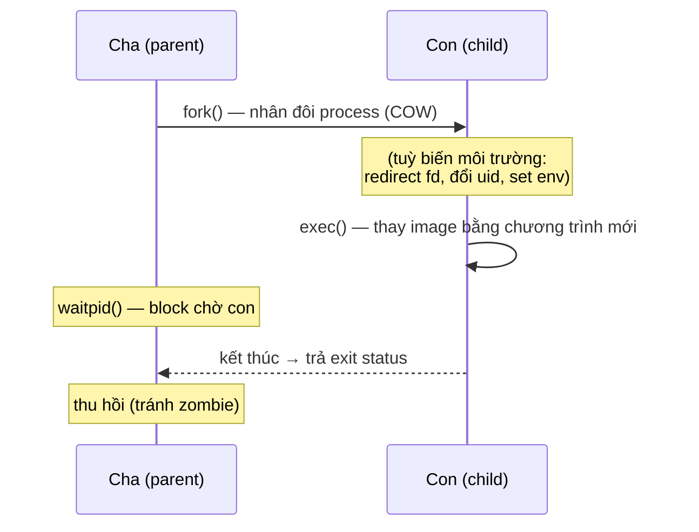

# Processes & Signals — fork/exec/wait và Signal

> **TL;DR**
> - **`fork`** tạo process con (bản sao COW). **`exec*`** thay thế image hiện tại bằng chương trình khác (không tạo process mới). Kết hợp **fork+exec** = chạy chương trình mới (mô hình của shell).
> - **`wait`/`waitpid`**: cha thu hồi con đã kết thúc (đọc exit status), tránh **zombie**.
> - **Signal**: thông báo bất đồng bộ (SIGINT, SIGTERM, SIGSEGV, SIGCHLD...). Dùng **`sigaction`** (không phải `signal`) để cài handler tin cậy.
> - Trong signal handler chỉ được gọi hàm **async-signal-safe**; pattern an toàn: set `volatile sig_atomic_t` flag, xử lý ở main loop. `SIGKILL`/`SIGSTOP` không bắt/chặn được.
> - **Daemon**: process chạy nền (fork, setsid, tách terminal); thực tế nay thường để **systemd** quản lý.

---

## 1. fork — exec — wait: bộ ba quản lý process

```c
pid_t pid = fork();
if (pid == 0) {
    // CON: thay mình bằng chương trình khác
    execlp("ls", "ls", "-l", (char*)NULL);
    _exit(127);                 // chỉ tới đây nếu exec thất bại
} else if (pid > 0) {
    int status;
    waitpid(pid, &status, 0);   // CHA chờ con, thu exit status
    if (WIFEXITED(status))
        printf("con thoát với mã %d\n", WEXITSTATUS(status));
}
```

- **`fork`**: nhân đôi process (COW). Trả 0 cho con, PID con cho cha, -1 nếu lỗi.
- **`exec*`** (execl, execlp, execv, execvp...): **thay thế** toàn bộ address space của process hiện tại bằng chương trình mới — PID giữ nguyên, code/data/heap/stack bị thay. Không trả về nếu thành công.
- **`wait`/`waitpid`**: cha block (hoặc dùng `WNOHANG` để không block) tới khi con kết thúc, lấy exit status. Không wait → con thành **zombie**.



> Vì sao tách fork và exec? → giữa hai bước, con có thể **tùy biến môi trường** (redirect fd, đổi uid, set env) trước khi chạy chương trình mới. Đây là lý do shell làm được `cmd > out.txt`.

---

## 2. Exit status & các macro

```c
int status;
waitpid(pid, &status, 0);
WIFEXITED(status)    // con thoát bình thường (exit/return)?
WEXITSTATUS(status)  // mã thoát (0–255)
WIFSIGNALED(status)  // con bị giết bởi signal?
WTERMSIG(status)     // signal nào giết con
```

- `exit()` chạy cleanup (atexit, flush stdio); `_exit()`/`_Exit()` thoát ngay không cleanup — dùng trong con sau fork khi exec lỗi để tránh flush buffer trùng của cha.
- Quy ước: exit code `0` = thành công, ≠0 = lỗi.

---

## 3. SIGCHLD & thu hồi zombie

Khi con kết thúc, kernel gửi **`SIGCHLD`** cho cha. Cách xử lý zombie:
- Gọi `wait`/`waitpid` (đồng bộ) khi muốn chờ con.
- Hoặc cài handler `SIGCHLD` gọi `waitpid(-1, ..., WNOHANG)` trong vòng lặp để thu mọi con đã chết (bất đồng bộ, server lâu dài).
- Hoặc đặt xử lý `SIGCHLD` thành `SIG_IGN` (kernel tự thu hồi) — tùy hệ.

---

## 4. Signal — cơ bản

Signal là thông báo **bất đồng bộ** gửi tới process. Một số thường gặp:

| Signal | Ý nghĩa | Mặc định | Bắt được? |
|--------|---------|----------|-----------|
| `SIGINT` | Ctrl+C | Terminate | Có |
| `SIGTERM` | Yêu cầu dừng lịch sự | Terminate | Có |
| `SIGKILL` | Giết ngay lập tức | Terminate | **Không** |
| `SIGSTOP` | Tạm dừng | Stop | **Không** |
| `SIGSEGV` | Truy cập bộ nhớ sai | Core dump | Có (hiếm nên) |
| `SIGCHLD` | Con kết thúc/đổi trạng thái | Ignore | Có |
| `SIGPIPE` | Ghi vào pipe/socket không còn đầu đọc | Terminate | Có (hay cần ignore) |
| `SIGUSR1/2` | Tự định nghĩa | Terminate | Có |

`SIGKILL` và `SIGSTOP` **không thể** bắt, chặn, hay ignore (để OS luôn kiểm soát được process).

---

## 5. Cài handler đúng cách: `sigaction` (không dùng `signal`)

```c
void handler(int sig) {
    // chỉ làm việc async-signal-safe!
    g_stop = 1;               // volatile sig_atomic_t
}

struct sigaction sa = {0};
sa.sa_handler = handler;
sigemptyset(&sa.sa_mask);
sa.sa_flags = SA_RESTART;     // tự restart syscall bị ngắt (tránh EINTR)
sigaction(SIGTERM, &sa, NULL);
```

- **`sigaction` thay vì `signal`**: `signal()` có hành vi không thống nhất giữa các hệ (có hệ reset handler về mặc định sau lần đầu). `sigaction` rõ ràng, di động, kiểm soát mask/flags.
- `SA_RESTART`: syscall blocking bị signal ngắt sẽ tự thử lại thay vì trả `EINTR`.

---

## 6. Async-signal-safe — quy tắc vàng trong handler

Handler có thể chen vào **bất kỳ thời điểm nào**, kể cả khi chương trình đang ở giữa `malloc`/`printf`. Nếu handler gọi lại hàm không reentrant → deadlock/corruption (UB).

→ Trong handler **chỉ gọi hàm async-signal-safe** (danh sách POSIX: `write`, `_exit`, `sigaction`...). **Không** `printf`, `malloc`, `free`...

**Pattern an toàn nhất:**
```c
volatile sig_atomic_t g_stop = 0;
void handler(int) { g_stop = 1; }       // chỉ set cờ
// main loop: while (!g_stop) { ... }    // xử lý thật ở đây
```
Hoặc dùng **`signalfd`** (Linux) để nhận signal như một fd → xử lý trong event loop bình thường, tránh hoàn toàn vấn đề handler.

---

## 7. Daemon process

Process chạy nền không gắn terminal. Quy trình cổ điển: `fork` (cha thoát) → `setsid` (tạo session mới, tách controlling terminal) → `fork` lần 2 (không thể giành lại terminal) → đổi working dir về `/`, reset umask, đóng/redirect stdin/out/err về `/dev/null`.

> Thực tế hiện đại: viết chương trình chạy foreground bình thường và để **systemd** quản lý daemonization, log, restart — đơn giản và đáng tin hơn tự daemonize.

---

## Câu hỏi phỏng vấn liên quan

<details><summary>1) fork và exec khác nhau thế nào? Vì sao thường dùng chung?</summary>

`fork` tạo một process con là bản sao (copy-on-write) của process cha — sau đó có hai process. `exec*` **không** tạo process mới: nó thay thế toàn bộ image (code/data/heap/stack) của process hiện tại bằng một chương trình khác, giữ nguyên PID, và không trả về nếu thành công. Dùng chung (fork rồi con gọi exec) để chạy một chương trình mới mà vẫn giữ process cha; khoảng giữa hai bước cho phép con tùy biến môi trường (redirect fd, đổi uid, set env) trước khi exec — chính là cách shell thực hiện `ls`, `cmd > file`, pipe.
</details>

<details><summary>2) wait/waitpid để làm gì? Không gọi thì sao?</summary>

`wait`/`waitpid` cho process cha thu hồi process con đã kết thúc và đọc exit status của nó (qua các macro `WIFEXITED`, `WEXITSTATUS`...). Nếu cha không wait, entry của con đã chết vẫn nằm trong bảng process dưới dạng **zombie** (giữ PID và status); tích lũy nhiều zombie sẽ cạn bảng process. Có thể thu hồi bất đồng bộ bằng cách xử lý `SIGCHLD` và gọi `waitpid(-1, ..., WNOHANG)` trong vòng lặp.
</details>

<details><summary>3) Vì sao nên dùng sigaction thay vì signal?</summary>

`signal()` có ngữ nghĩa không thống nhất giữa các nền tảng — một số hệ reset handler về mặc định ngay sau lần kích hoạt đầu (System V), một số tự cài lại (BSD), và không kiểm soát rõ signal mask hay restart syscall. `sigaction` có hành vi xác định, di động: cho phép chỉ định mask (chặn signal nào trong lúc handler chạy), cờ như `SA_RESTART` (tự thử lại syscall bị ngắt) và `SA_SIGINFO` (nhận thêm thông tin). Nên luôn dùng `sigaction`.
</details>

<details><summary>4) Vì sao trong signal handler chỉ được gọi hàm async-signal-safe?</summary>

Vì signal handler chạy bất đồng bộ, có thể chen vào giữa bất kỳ chỗ nào của chương trình — kể cả khi đang ở giữa một hàm không reentrant như `malloc`/`printf` (đang giữ khóa nội bộ hoặc trạng thái dở dang). Nếu handler gọi lại chính hàm đó, có thể gây deadlock hoặc hỏng dữ liệu (UB). Vì vậy chỉ được gọi các hàm async-signal-safe (như `write`, `_exit`). Pattern an toàn: handler chỉ set một cờ `volatile sig_atomic_t`, còn xử lý thật để ở main loop; hoặc dùng `signalfd` để nhận signal qua fd.
</details>

<details><summary>5) Signal nào không thể bắt hoặc chặn? Vì sao?</summary>

`SIGKILL` (giết ngay) và `SIGSTOP` (tạm dừng) không thể bắt, chặn, hay ignore. Lý do: để hệ điều hành/quản trị viên luôn có cách dứt khoát kết thúc hoặc dừng một process bất kể nó được lập trình thế nào — nếu process có thể chặn mọi signal thì sẽ không thể kiểm soát được process treo/lỗi.
</details>

<details><summary>6) volatile sig_atomic_t là gì và vì sao cờ trong handler dùng kiểu này?</summary>

`sig_atomic_t` là kiểu được đảm bảo đọc/ghi bằng một thao tác không thể chia cắt (atomic) đối với signal — handler có thể chen vào nên cập nhật cờ không được "nửa chừng". `volatile` báo compiler rằng biến có thể thay đổi ngoài luồng thực thi bình thường (bởi handler), nên không được cache vào thanh ghi hay tối ưu bỏ việc đọc lại — main loop phải đọc giá trị mới nhất mỗi lần. Kết hợp lại cho phép truyền tín hiệu "đã nhận signal" từ handler ra main loop một cách an toàn.
</details>

---
⬅️ [file-io.md](file-io.md) · ➡️ Tiếp theo: [io-multiplexing.md](io-multiplexing.md)
