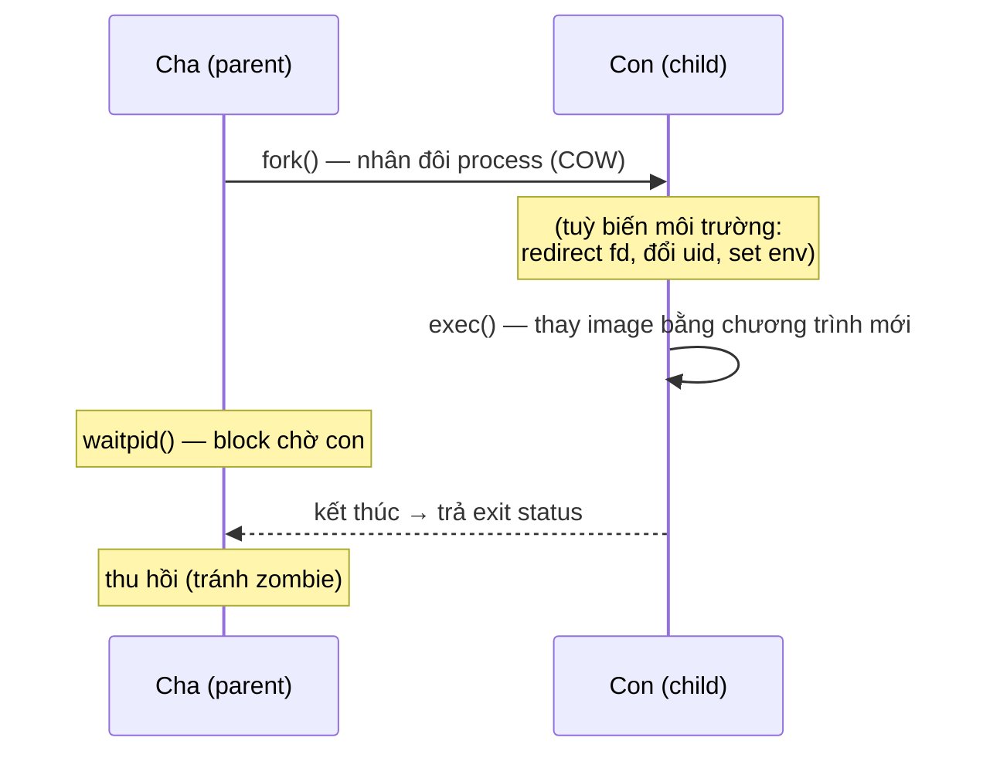

# Processes & Signals — fork/exec/wait và Signal

> **TL;DR**
> - **`fork`** tạo process con (bản sao COW). **`exec*`** thay thế image hiện tại bằng chương trình khác (không tạo process mới). Kết hợp **fork+exec** = chạy chương trình mới (mô hình của shell).
> - **`wait`/`waitpid`**: cha thu hồi con đã kết thúc (đọc exit status), tránh **zombie**.
> - **Signal**: thông báo bất đồng bộ (SIGINT, SIGTERM, SIGSEGV, SIGCHLD...). Dùng **`sigaction`** (không phải `signal`) để cài handler tin cậy.
> - Trong signal handler chỉ được gọi hàm **async-signal-safe**; pattern an toàn: set `volatile sig_atomic_t` flag, xử lý ở main loop. `SIGKILL`/`SIGSTOP` không bắt/chặn được.
> - **Daemon**: process chạy nền (fork, setsid, tách terminal); thực tế nay thường để **systemd** quản lý.

---

## 1. fork — exec — wait: bộ ba quản lý process

```c
pid_t pid = fork();
if (pid == 0) {
    // CON: thay mình bằng chương trình khác
    execlp("ls", "ls", "-l", (char*)NULL);
    _exit(127);                 // chỉ tới đây nếu exec thất bại
} else if (pid > 0) {
    int status;
    waitpid(pid, &status, 0);   // CHA chờ con, thu exit status
    if (WIFEXITED(status))
        printf("con thoát với mã %d\n", WEXITSTATUS(status));
}
```

- **`fork`**: nhân đôi process (COW). Trả 0 cho con, PID con cho cha, -1 nếu lỗi.
- **`exec*`** (execl, execlp, execv, execvp...): **thay thế** toàn bộ address space của process hiện tại bằng chương trình mới — PID giữ nguyên, code/data/heap/stack bị thay. Không trả về nếu thành công.
- **`wait`/`waitpid`**: cha block (hoặc dùng `WNOHANG` để không block) tới khi con kết thúc, lấy exit status. Không wait → con thành **zombie**.


```mermaid
sequenceDiagram
    participant P as Cha (parent)
    participant C as Con (child)
    P->>C: fork() — nhân đôi process (COW)
    Note over C: (tuỳ biến môi trường:<br/>redirect fd, đổi uid, set env)
    C->>C: exec() — thay image bằng chương trình mới
    Note over P: waitpid() — block chờ con
    C-->>P: kết thúc → trả exit status
    Note over P: thu hồi (tránh zombie)
```

> Vì sao tách fork và exec? → giữa hai bước, con có thể **tùy biến môi trường** (redirect fd, đổi uid, set env) trước khi chạy chương trình mới. Đây là lý do shell làm được `cmd > out.txt`.

---

## 2. Exit status & các macro

```c
int status;
waitpid(pid, &status, 0);
WIFEXITED(status)    // con thoát bình thường (exit/return)?
WEXITSTATUS(status)  // mã thoát (0–255)
WIFSIGNALED(status)  // con bị giết bởi signal?
WTERMSIG(status)     // signal nào giết con
```

- `exit()` chạy cleanup (atexit, flush stdio); `_exit()`/`_Exit()` thoát ngay không cleanup — dùng trong con sau fork khi exec lỗi để tránh flush buffer trùng của cha.
- Quy ước: exit code `0` = thành công, ≠0 = lỗi.

---

## 3. SIGCHLD & thu hồi zombie

Khi con kết thúc, kernel gửi **`SIGCHLD`** cho cha. Cách xử lý zombie:
- Gọi `wait`/`waitpid` (đồng bộ) khi muốn chờ con.
- Hoặc cài handler `SIGCHLD` gọi `waitpid(-1, ..., WNOHANG)` trong vòng lặp để thu mọi con đã chết (bất đồng bộ, server lâu dài).
- Hoặc đặt xử lý `SIGCHLD` thành `SIG_IGN` (kernel tự thu hồi) — tùy hệ.

---

## 4. Signal — cơ bản

Signal là thông báo **bất đồng bộ** gửi tới process. Một số thường gặp:

| Signal | Ý nghĩa | Mặc định | Bắt được? |
|--------|---------|----------|-----------|
| `SIGINT` | Ctrl+C | Terminate | Có |
| `SIGTERM` | Yêu cầu dừng lịch sự | Terminate | Có |
| `SIGKILL` | Giết ngay lập tức | Terminate | **Không** |
| `SIGSTOP` | Tạm dừng | Stop | **Không** |
| `SIGSEGV` | Truy cập bộ nhớ sai | Core dump | Có (hiếm nên) |
| `SIGCHLD` | Con kết thúc/đổi trạng thái | Ignore | Có |
| `SIGPIPE` | Ghi vào pipe/socket không còn đầu đọc | Terminate | Có (hay cần ignore) |
| `SIGUSR1/2` | Tự định nghĩa | Terminate | Có |

`SIGKILL` và `SIGSTOP` **không thể** bắt, chặn, hay ignore (để OS luôn kiểm soát được process).

---

## 5. Cài handler đúng cách: `sigaction` (không dùng `signal`)

```c
void handler(int sig) {
    // chỉ làm việc async-signal-safe!
    g_stop = 1;               // volatile sig_atomic_t
}

struct sigaction sa = {0};
sa.sa_handler = handler;
sigemptyset(&sa.sa_mask);
sa.sa_flags = SA_RESTART;     // tự restart syscall bị ngắt (tránh EINTR)
sigaction(SIGTERM, &sa, NULL);
```

- **`sigaction` thay vì `signal`**: `signal()` có hành vi không thống nhất giữa các hệ (có hệ reset handler về mặc định sau lần đầu). `sigaction` rõ ràng, di động, kiểm soát mask/flags.
- `SA_RESTART`: syscall blocking bị signal ngắt sẽ **tự thử lại** thay vì trả `EINTR` — nhưng **chỉ với một số syscall**, xem cảnh báo ngay dưới.

### ⚠️ `SA_RESTART` KHÔNG cứu được mọi syscall

Đây là chỗ rất hay hiểu nhầm: đặt `SA_RESTART` rồi tưởng hết chuyện `EINTR`.

| Có restart với `SA_RESTART` | **KHÔNG BAO GIỜ** restart (dù đặt cờ) |
|---|---|
| `wait()`, `waitpid()` | **`select()`, `pselect()`, `poll()`, `ppoll()`** |
| `read()`, `write()`, `ioctl()` — **chỉ trên thiết bị "chậm"** (terminal, pipe, FIFO, socket) | **`epoll_wait()`, `epoll_pwait()`** |
| `open()` khi nó có thể chặn (vd mở FIFO) | **`sleep()`, `nanosleep()`, `clock_nanosleep()`** |
| `accept()`, `connect()`, `send()`, `recv()` | **`pause()`, `sigsuspend()`, `sigwaitinfo()`** |
| `flock()`, `fcntl()` (đặt khoá), `sem_wait()` | `semop()`, `msgrcv()`, `msgsnd()`; `read()` từ fd inotify |

⇒ **Vòng lặp `EINTR` quanh `epoll_wait`/`select`/`poll` là BẮT BUỘC**, không có cờ nào thay được:

```c
int n;
do {
    n = epoll_wait(epfd, evlist, MAX_EVENTS, -1);
} while (n == -1 && errno == EINTR);      // signal cắt ngang → gọi lại, KHÔNG phải lỗi
if (n == -1) errExit("epoll_wait");
```

Hai chi tiết đi kèm:
- **`read()`/`write()` chỉ restart trên "thiết bị chậm"** — file trên đĩa **không** thuộc nhóm này (I/O đĩa luôn thoả mãn được qua page cache). Đó là lý do bug `EINTR` **không lộ khi test với file**, chỉ lộ khi chạy với socket/pipe thật.
- Nếu `read()`/`write()` **đã chuyển được một phần** dữ liệu rồi mới bị cắt, nó **không** restart mà **trả về thành công với số byte đã chuyển** — thêm một nguyên nhân của partial read/write (§ file-io).

> Cần chờ fd **và** signal cùng lúc mà không có race → `pselect()`/`ppoll()`/`epoll_pwait()`: chúng đặt signal mask **nguyên tử** với việc đi ngủ.

---

## 6. Async-signal-safe — quy tắc vàng trong handler

Handler có thể chen vào **bất kỳ thời điểm nào**, kể cả khi chương trình đang ở giữa `malloc`/`printf`. Nếu handler gọi lại hàm không reentrant → deadlock/corruption (UB).

→ Trong handler **chỉ gọi hàm async-signal-safe** (danh sách POSIX: `write`, `_exit`, `sigaction`...). **Không** `printf`, `malloc`, `free`...

**Pattern an toàn nhất:**
```c
volatile sig_atomic_t g_stop = 0;
void handler(int) { g_stop = 1; }       // chỉ set cờ
// main loop: while (!g_stop) { ... }    // xử lý thật ở đây
```
Hoặc dùng **`signalfd`** (Linux) để nhận signal như một fd → xử lý trong event loop bình thường, tránh hoàn toàn vấn đề handler.

---

## 7. Daemon process

Process chạy nền không gắn terminal. Quy trình cổ điển: `fork` (cha thoát) → `setsid` (tạo session mới, tách controlling terminal) → `fork` lần 2 (không thể giành lại terminal) → đổi working dir về `/`, reset umask, đóng/redirect stdin/out/err về `/dev/null`.

> Thực tế hiện đại: viết chương trình chạy foreground bình thường và để **systemd** quản lý daemonization, log, restart — đơn giản và đáng tin hơn tự daemonize.

---

## Câu hỏi phỏng vấn liên quan

> Đáp án sống trong [bank/](../14-prep/mock-interview/bank/) — **một đáp án, một chỗ** ([CLAUDE.md §4.7](../CLAUDE.md)). Tự trả lời trước khi mở.

| ID | Câu hỏi |
|----|---------|
| [LNX-004](../14-prep/mock-interview/bank/linux-sysprog.md) | fork và exec khác nhau thế nào? Vì sao thường dùng chung? |
| [OS-009](../14-prep/mock-interview/bank/os.md) | wait/waitpid để làm gì? Không gọi thì sao? |
| [LNX-006](../14-prep/mock-interview/bank/linux-sysprog.md) | Vì sao nên dùng sigaction thay vì signal? |
| [LNX-011](../14-prep/mock-interview/bank/linux-sysprog.md) | Vì sao trong signal handler chỉ được gọi hàm async-signal-safe? |
| [LNX-027](../14-prep/mock-interview/bank/linux-sysprog.md) | `EINTR` là gì? Đặt `SA_RESTART` có giải quyết hết không? |
| [LNX-037](../14-prep/mock-interview/bank/linux-sysprog.md) | Signal nào không thể bắt hoặc chặn? Vì sao? |
| [LNX-038](../14-prep/mock-interview/bank/linux-sysprog.md) | volatile sig_atomic_t là gì và vì sao cờ trong handler dùng kiểu này? |

---
⬅️ [file-io.md](file-io.md) · ➡️ Tiếp theo: [io-multiplexing.md](io-multiplexing.md)
