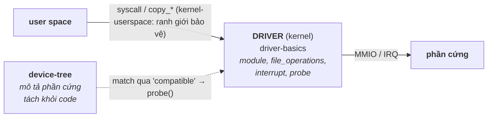

# 05 — Device Drivers & Device Tree

Cách kernel Linux nói chuyện với phần cứng: phân loại driver, ranh giới kernel/user space, các cơ chế phơi bày thiết bị (device node, ioctl, sysfs), và device tree để mô tả phần cứng. Đây là mảng **kernel driver** sát công việc của bạn — phỏng vấn embedded thường đào: "char driver hoạt động thế nào", "user space gọi xuống driver ra sao", "device tree để làm gì".

## 🗺️ Bức tranh tổng thể

> **Sợi chỉ đỏ:** Driver là **cầu nối kernel ↔ phần cứng**, hoạt động trong một ranh giới đặc quyền được bảo vệ nghiêm ngặt, và được ghép với phần cứng nhờ một bản mô tả tách rời.

- **`driver-basics` là lõi:** char driver + `file_operations` + interrupt; `probe()` được gọi khi `device-tree` mô tả một thiết bị khớp với driver.
- **`kernel-userspace` là ranh giới sống còn:** vì driver chạy đặc quyền, `copy_to/from_user` và các kênh (ioctl/sysfs) quyết định an toàn — bug ở đây = sập cả hệ thống.
- **`device-tree` là "danh sách phần cứng":** tách mô tả khỏi code để một kernel chạy nhiều board → giải thích vì sao có cơ chế match/probe.
- **Nối các topic:** dựa trên ranh giới kernel/user của [04](../04-linux-system-programming/) + khái niệm interrupt/MMIO của [08](../08-embedded-systems/architecture.md).
- **Câu hỏi tổng hợp:** *"Từ lúc user gọi `read('/dev/x')` tới khi chạm thanh ghi phần cứng, điều gì diễn ra?"* — nối cả ba file.

## Tài liệu trong topic

| # | File | Nội dung | Trạng thái |
|---|------|----------|-----------|
| 1 | [driver-basics.md](driver-basics.md) | char/block/net driver, module, file_operations, đăng ký, interrupt vs polling | ✅ |
| 2 | [kernel-userspace.md](kernel-userspace.md) | ranh giới user/kernel, syscall, ioctl, sysfs/procfs, copy_to/from_user, mmap | ✅ |
| 3 | [device-tree.md](device-tree.md) | vì sao có device tree, cú pháp DTS, node/property, binding, so với ACPI | ✅ |

## Thứ tự đọc gợi ý
`driver-basics` → `kernel-userspace` → `device-tree`.

## Liên kết
- Nền tảng: [03-operating-system/](../03-operating-system/), [04-linux-system-programming/](../04-linux-system-programming/)
- Câu hỏi phỏng vấn: [11-interview-questions/drivers.md](../11-interview-questions/drivers.md)
