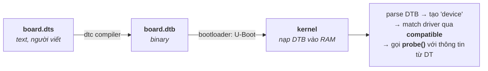

# Device Tree — Mô tả phần cứng cho kernel

> **TL;DR**
> - **Device tree (DT)** là một cấu trúc dữ liệu mô tả phần cứng (CPU, bus, thiết bị, IRQ, địa chỉ thanh ghi...) **tách rời khỏi code kernel**. Bootloader nạp nó cho kernel lúc boot.
> - Vấn đề nó giải quyết: trên ARM/embedded không có cơ chế tự dò phần cứng như PCI; trước đây mỗi board phải hard-code trong kernel ("board file") → bùng nổ code. DT mô tả phần cứng bằng dữ liệu → **một kernel chạy nhiều board**.
> - Viết bằng **DTS** (text) → biên dịch thành **DTB** (binary, `.dtb`) bằng `dtc`. Cấu trúc cây gồm **node** (thiết bị) và **property** (thuộc tính).
> - **`compatible`** là property then chốt: kernel dùng nó để **match** node với driver (`of_match_table`).
> - DT mô tả *phần cứng có gì và ở đâu*, **không** phải driver — driver vẫn nằm trong kernel; DT chỉ cấu hình/kết nối.

---

## 1. Vì sao có device tree?

Trên x86, phần cứng phần lớn **tự khai báo** (PCI/ACPI enumeration) → kernel dò ra được. Trên **ARM/embedded** thì không: thiết bị gắn cứng vào SoC (I2C, SPI, memory-mapped) không tự báo địa chỉ/IRQ của mình.

Trước DT, thông tin này được **hard-code trong kernel** dưới dạng "board file" C cho từng board → mỗi biến thể phần cứng cần sửa/biên dịch kernel, sinh ra hàng nghìn board file (Linus Torvalds từng phàn nàn về "ARM churn"). 

**Device tree** tách mô tả phần cứng ra thành **dữ liệu**: cùng một kernel image đọc DTB khác nhau để chạy trên các board khác nhau → dễ bảo trì, dễ port board mới (chỉ viết DTS, không đụng code kernel).

---

## 2. Luồng từ DTS tới kernel



- **DTS** (.dts/.dtsi): source dạng text. `.dtsi` là file include dùng chung (vd mô tả SoC), `.dts` cho từng board include `.dtsi` rồi thêm/sửa.
- **DTB** (.dtb, "device tree blob"): binary compact, bootloader nạp và truyền cho kernel.
- **dtc**: device tree compiler (DTS ↔ DTB).

---

## 3. Cú pháp cơ bản: node & property

```dts
/ {                                  // root node
    #address-cells = <1>;
    #size-cells = <1>;

    cpus { /* ... */ };

    soc {
        i2c0: i2c@40005400 {          // node: tên@địa-chỉ; "i2c0" là label
            compatible = "vendor,my-i2c";   // ← dùng để match driver
            reg = <0x40005400 0x400>;       // địa chỉ thanh ghi & kích thước
            interrupts = <0 31 4>;          // mô tả IRQ
            clocks = <&clk_i2c>;            // tham chiếu node khác qua &label (phandle)
            status = "okay";                // "okay" bật, "disabled" tắt

            sensor@48 {                     // thiết bị con trên bus i2c
                compatible = "bosch,bme280";
                reg = <0x48>;               // địa chỉ trên bus I2C
            };
        };
    };
};
```

- **Node** = một thiết bị/bus, có thể lồng nhau phản ánh **topology phần cứng** (thiết bị nằm trên bus nào).
- **Property** = thuộc tính `tên = giá trị;`. Một số chuẩn hóa:
  - `compatible`: chuỗi `"vendor,model"` — khóa match driver (driver liệt kê các chuỗi nó hỗ trợ).
  - `reg`: địa chỉ + kích thước (ý nghĩa tùy bus — memory-mapped là địa chỉ thanh ghi, I2C là địa chỉ slave).
  - `interrupts`: mô tả ngắt.
  - `status`: `"okay"`/`"disabled"` để bật/tắt thiết bị mà không xóa node.
- **phandle** (`&label`): tham chiếu node khác (vd thiết bị tham chiếu clock/gpio/interrupt-controller của nó) → mô tả quan hệ giữa các khối.
- `#address-cells`/`#size-cells`: quy định số ô (cell 32-bit) dùng cho địa chỉ/kích thước của node con.

---

## 4. Driver đọc device tree thế nào

Driver khai báo bảng match; kernel so `compatible` của node với bảng này, khớp thì gọi `probe()`:

```c
static const struct of_device_id my_of_match[] = {
    { .compatible = "vendor,my-i2c" },
    { }
};
MODULE_DEVICE_TABLE(of, my_of_match);

static int my_probe(struct platform_device *pdev) {
    struct resource *r = platform_get_resource(pdev, IORESOURCE_MEM, 0);  // từ `reg`
    void __iomem *base = devm_ioremap_resource(&pdev->dev, r);            // map thanh ghi
    int irq = platform_get_irq(pdev, 0);                                  // từ `interrupts`
    u32 val;
    of_property_read_u32(pdev->dev.of_node, "clock-frequency", &val);     // đọc property
    // ... khởi tạo thiết bị ...
}
```

→ DT cung cấp **địa chỉ thanh ghi, IRQ, tham số cấu hình**; driver dùng các API `of_*`/`platform_*` để lấy ra. Cùng driver chạy cho nhiều board chỉ khác DT.

---

## 5. Device tree binding

**Binding** là tài liệu (nay viết bằng **YAML schema** trong kernel, kiểm tra tự động) quy định: với một `compatible` nhất định, node hợp lệ phải có những property nào, kiểu gì, bắt buộc/tùy chọn. Đây là "hợp đồng" giữa người viết DTS và người viết driver — đảm bảo cả hai hiểu giống nhau.

---

## 6. Device tree vs ACPI vs board file

| | Board file (cũ) | Device Tree | ACPI |
|--|-----------------|-------------|------|
| Dạng | Code C trong kernel | Dữ liệu (DTB) | Bảng firmware |
| Nền tảng chính | ARM cũ | ARM/embedded, RISC-V, PowerPC | x86/server, một số ARM |
| Đổi phần cứng | Sửa & build kernel | Sửa DTS, không đụng kernel | Firmware cung cấp |
| Ai cấp | Lập trình viên kernel | Người làm board | Nhà sản xuất firmware/BIOS |

DT là chuẩn de-facto cho embedded Linux; ACPI phổ biến ở x86/server (firmware mô tả, OS-agnostic hơn).

---

## 7. Lưu ý thực tế

- DT mô tả **phần cứng tĩnh không tự dò được**. Bus tự liệt kê (USB, PCI) thì *không* cần khai trong DT — kernel enumerate runtime.
- Sai DT (địa chỉ/IRQ/clock sai) → thiết bị không probe hoặc treo; debug DT là kỹ năng cần thiết (`/proc/device-tree`, `/sys/firmware/devicetree`, log probe).
- **Overlay**: DT overlay cho phép sửa/thêm node lúc runtime (vd cắm cape/HAT trên BeagleBone/Raspberry Pi).
- Phân biệt rõ: DT **không chứa driver/logic**, chỉ là mô tả + tham số cấu hình.

---

## Câu hỏi phỏng vấn liên quan

<details><summary>1) Device tree là gì và giải quyết vấn đề gì?</summary>

Device tree là một cấu trúc dữ liệu dạng cây mô tả phần cứng của hệ thống — CPU, bus, thiết bị, địa chỉ thanh ghi, IRQ, clock... — tách rời khỏi mã kernel, được bootloader nạp và truyền cho kernel lúc boot. Nó giải quyết vấn đề của ARM/embedded: phần cứng gắn cứng không tự khai báo như PCI/ACPI, nên trước đây phải hard-code mô tả trong "board file" C cho từng board, gây bùng nổ code và phải build lại kernel cho mỗi biến thể. Với device tree, cùng một kernel image chạy được trên nhiều board chỉ bằng cách nạp DTB khác nhau — dễ bảo trì và port board mới.
</details>

<details><summary>2) DTS, DTB, dtc là gì?</summary>

DTS (.dts/.dtsi) là source device tree dạng text do người viết; `.dtsi` là file include dùng chung (vd mô tả SoC) còn `.dts` mô tả từng board. DTB (.dtb, device tree blob) là dạng binary compact biên dịch từ DTS, được bootloader nạp vào RAM và truyền cho kernel. dtc là device tree compiler chuyển đổi giữa DTS và DTB.
</details>

<details><summary>3) Property compatible dùng để làm gì?</summary>

`compatible` là chuỗi (thường dạng `"vendor,model"`) trong mỗi node thiết bị, là khóa để kernel **match node với driver**: mỗi driver khai báo một bảng `of_match_table` liệt kê các chuỗi compatible nó hỗ trợ, kernel so chuỗi compatible của node với các bảng này, khi khớp thì tạo device tương ứng và gọi `probe()` của driver đó. Thường khai nhiều giá trị từ cụ thể đến tổng quát để driver tổng quát vẫn nhận được nếu không có driver chuyên biệt.
</details>

<details><summary>4) Driver lấy thông tin từ device tree như thế nào?</summary>

Sau khi match qua `compatible`, kernel gọi `probe()` với một `platform_device` (hoặc thiết bị bus tương ứng) chứa thông tin trích từ node DT. Driver dùng các API `of_*`/`platform_*` để đọc: `platform_get_resource`/`devm_ioremap_resource` lấy và map vùng thanh ghi từ property `reg`; `platform_get_irq` lấy IRQ từ `interrupts`; `of_property_read_u32`/`_string`/`_bool` đọc các property cấu hình (clock-frequency, gpios...). Nhờ vậy cùng một driver chạy cho nhiều board chỉ khác nhau ở dữ liệu DT.
</details>

<details><summary>5) Device tree có chứa driver không? Nó khác gì với driver?</summary>

Không. Device tree chỉ **mô tả phần cứng tồn tại và tham số của nó** (địa chỉ, IRQ, clock, cấu hình) — nó là dữ liệu, không phải code và không chứa logic điều khiển. Driver (code điều khiển thiết bị) vẫn nằm trong kernel/module. Device tree đóng vai trò "danh sách thiết bị + cấu hình" để kernel biết phần cứng nào có mặt và ghép với driver phù hợp; driver mới là phần thực sự vận hành thiết bị. Tách biệt này cho phép tái dùng driver across boards và thay đổi cấu hình phần cứng mà không sửa code.
</details>

<details><summary>6) Device tree khác ACPI thế nào? Khi nào dùng cái nào?</summary>

Cả hai đều mô tả phần cứng cho OS thay vì hard-code. Device tree là dữ liệu do người làm board cung cấp (DTS→DTB), phổ biến trên ARM/embedded, RISC-V — kernel parse trực tiếp. ACPI là các bảng do firmware/BIOS cung cấp với cả mô tả lẫn phương thức (AML), phổ biến trên x86/server và mang tính OS-agnostic, cho phép firmware trừu tượng hóa phần cứng và quản lý nguồn. Embedded/ARM thường dùng device tree vì gọn và do nhà phát triển board kiểm soát; hệ x86/server và một số ARM server dùng ACPI vì hạ tầng firmware đã có sẵn và cần tính tương thích rộng.
</details>

---
⬅️ [kernel-userspace.md](kernel-userspace.md) · ➡️ Tiếp theo: [06-build-systems/](../06-build-systems/)
