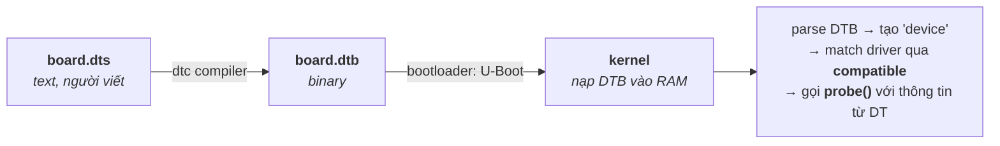

# Device Tree — Mô tả phần cứng cho kernel

> **TL;DR**
> - **Device tree (DT)** là một cấu trúc dữ liệu mô tả phần cứng (CPU, bus, thiết bị, IRQ, địa chỉ thanh ghi...) **tách rời khỏi code kernel**. Bootloader nạp nó cho kernel lúc boot.
> - Vấn đề nó giải quyết: trên ARM/embedded không có cơ chế tự dò phần cứng như PCI; trước đây mỗi board phải hard-code trong kernel ("board file") → bùng nổ code. DT mô tả phần cứng bằng dữ liệu → **một kernel chạy nhiều board**.
> - Viết bằng **DTS** (text) → biên dịch thành **DTB** (binary, `.dtb`) bằng `dtc`. Cấu trúc cây gồm **node** (thiết bị) và **property** (thuộc tính).
> - **`compatible`** là property then chốt: kernel dùng nó để **match** node với driver (`of_match_table`).
> - DT mô tả *phần cứng có gì và ở đâu*, **không** phải driver — driver vẫn nằm trong kernel; DT chỉ cấu hình/kết nối.

---

## 1. Vì sao có device tree?

Trên x86, phần cứng phần lớn **tự khai báo** (PCI/ACPI enumeration) → kernel dò ra được. Trên **ARM/embedded** thì không: thiết bị gắn cứng vào SoC (I2C, SPI, memory-mapped) không tự báo địa chỉ/IRQ của mình.

Trước DT, thông tin này được **hard-code trong kernel** dưới dạng "board file" C cho từng board → mỗi biến thể phần cứng cần sửa/biên dịch kernel, sinh ra hàng nghìn board file (Linus Torvalds từng phàn nàn về "ARM churn"). 

**Device tree** tách mô tả phần cứng ra thành **dữ liệu**: cùng một kernel image đọc DTB khác nhau để chạy trên các board khác nhau → dễ bảo trì, dễ port board mới (chỉ viết DTS, không đụng code kernel).

---

## 2. Luồng từ DTS tới kernel


```mermaid
flowchart LR
    DTS["<b>board.dts</b><br/><i>text, người viết</i>"]
    DTB["<b>board.dtb</b><br/><i>binary</i>"]
    K["<b>kernel</b><br/><i>nạp DTB vào RAM</i>"]
    M["parse DTB → tạo 'device'<br/>→ match driver qua <b>compatible</b><br/>→ gọi <b>probe()</b> với thông tin từ DT"]
    DTS -->|"dtc compiler"| DTB -->|"bootloader: U-Boot"| K --> M
```

- **DTS** (.dts/.dtsi): source dạng text. `.dtsi` là file include dùng chung (vd mô tả SoC), `.dts` cho từng board include `.dtsi` rồi thêm/sửa.
- **DTB** (.dtb, "device tree blob"): binary compact, bootloader nạp và truyền cho kernel.
- **dtc**: device tree compiler (DTS ↔ DTB).

---

## 3. Cú pháp cơ bản: node & property

```dts
/ {                                  // root node
    #address-cells = <1>;
    #size-cells = <1>;

    cpus { /* ... */ };

    soc {
        i2c0: i2c@40005400 {          // node: tên@địa-chỉ; "i2c0" là label
            compatible = "vendor,my-i2c";   // ← dùng để match driver
            reg = <0x40005400 0x400>;       // địa chỉ thanh ghi & kích thước
            interrupts = <0 31 4>;          // mô tả IRQ
            clocks = <&clk_i2c>;            // tham chiếu node khác qua &label (phandle)
            status = "okay";                // "okay" bật, "disabled" tắt

            sensor@48 {                     // thiết bị con trên bus i2c
                compatible = "bosch,bme280";
                reg = <0x48>;               // địa chỉ trên bus I2C
            };
        };
    };
};
```

- **Node** = một thiết bị/bus, có thể lồng nhau phản ánh **topology phần cứng** (thiết bị nằm trên bus nào).
- **Property** = thuộc tính `tên = giá trị;`. Một số chuẩn hóa:
  - `compatible`: chuỗi `"vendor,model"` — khóa match driver (driver liệt kê các chuỗi nó hỗ trợ).
  - `reg`: địa chỉ + kích thước (ý nghĩa tùy bus — memory-mapped là địa chỉ thanh ghi, I2C là địa chỉ slave).
  - `interrupts`: mô tả ngắt.
  - `status`: `"okay"`/`"disabled"` để bật/tắt thiết bị mà không xóa node.
- **phandle** (`&label`): tham chiếu node khác (vd thiết bị tham chiếu clock/gpio/interrupt-controller của nó) → mô tả quan hệ giữa các khối.
- `#address-cells`/`#size-cells`: quy định số ô (cell 32-bit) dùng cho địa chỉ/kích thước của node con.

---

## 4. Driver đọc device tree thế nào

Driver khai báo bảng match; kernel so `compatible` của node với bảng này, khớp thì gọi `probe()`:

```c
static const struct of_device_id my_of_match[] = {
    { .compatible = "vendor,my-i2c" },
    { }
};
MODULE_DEVICE_TABLE(of, my_of_match);

static int my_probe(struct platform_device *pdev) {
    struct resource *r = platform_get_resource(pdev, IORESOURCE_MEM, 0);  // từ `reg`
    void __iomem *base = devm_ioremap_resource(&pdev->dev, r);            // map thanh ghi
    int irq = platform_get_irq(pdev, 0);                                  // từ `interrupts`
    u32 val;
    of_property_read_u32(pdev->dev.of_node, "clock-frequency", &val);     // đọc property
    // ... khởi tạo thiết bị ...
}
```

→ DT cung cấp **địa chỉ thanh ghi, IRQ, tham số cấu hình**; driver dùng các API `of_*`/`platform_*` để lấy ra. Cùng driver chạy cho nhiều board chỉ khác DT.

---

## 5. Device tree binding

**Binding** là tài liệu (nay viết bằng **YAML schema** trong kernel, kiểm tra tự động) quy định: với một `compatible` nhất định, node hợp lệ phải có những property nào, kiểu gì, bắt buộc/tùy chọn. Đây là "hợp đồng" giữa người viết DTS và người viết driver — đảm bảo cả hai hiểu giống nhau.

---

## 6. Device tree vs ACPI vs board file

| | Board file (cũ) | Device Tree | ACPI |
|--|-----------------|-------------|------|
| Dạng | Code C trong kernel | Dữ liệu (DTB) | Bảng firmware |
| Nền tảng chính | ARM cũ | ARM/embedded, RISC-V, PowerPC | x86/server, một số ARM |
| Đổi phần cứng | Sửa & build kernel | Sửa DTS, không đụng kernel | Firmware cung cấp |
| Ai cấp | Lập trình viên kernel | Người làm board | Nhà sản xuất firmware/BIOS |

DT là chuẩn de-facto cho embedded Linux; ACPI phổ biến ở x86/server (firmware mô tả, OS-agnostic hơn).

---

## 7. ⚠️ `status = "okay"` KHÔNG đủ để thiết bị chạy

Đây là hiểu lầm tốn thời gian nhất với người mới viết DTS. Node có `status = "okay"`, `compatible` đúng, driver đã build — mà `probe()` **không bao giờ được gọi**, hoặc gọi rồi thiết bị vẫn câm.

Vì một node DT thường phải khai **đủ bốn nhóm tài nguyên**, thiếu nhóm nào là hỏng theo kiểu khác nhau:

| Nhóm | Property | Thiếu thì sao |
|---|---|---|
| **Địa chỉ** | `reg` | `platform_get_resource` trả `NULL` ⇒ probe fail sớm, **có log rõ** |
| **Ngắt** | `interrupts`, `interrupt-parent` | Thiết bị chạy nhưng **không bao giờ báo** — treo ở `read()` |
| ⭐ **Clock** | `clocks`, `clock-names` | 🔴 **Không có xung ⇒ đọc thanh ghi ra `0x0` hoặc `0xFFFFFFFF`** — trông y hệt *"chip hỏng"* |
| ⭐ **Nguồn / chân** | `vdd-supply` (regulator), `pinctrl-0`/`pinctrl-names` | Chip chưa được cấp điện, hoặc chân SoC vẫn đang làm chức năng khác (GPIO thay vì I2C) |

```dts
sensor@48 {
    compatible   = "bosch,bme280";
    reg          = <0x48>;
    interrupt-parent = <&gpio1>;
    interrupts   = <7 IRQ_TYPE_EDGE_FALLING>;
    clocks       = <&clk_i2c>;          // khong co -> doc thanh ghi ra rac
    vdd-supply   = <&reg_3v3>;          // khong co -> chip chua duoc cap dien
    pinctrl-names = "default";
    pinctrl-0    = <&i2c0_pins>;        // khong co -> chan van la GPIO
    status       = "okay";
};
```

> 📌 **Câu chốt:** *"`status = okay` chỉ nói **'hãy tạo device cho node này'**. Nó không cấp điện, không bật clock, không cấu hình chân. Ba thứ đó là ba property riêng."*

---

## 8. ⭐ `-EPROBE_DEFER` — vì sao driver probe **muộn** chứ không hỏng

Thiết bị của bạn cần một clock/regulator/GPIO do **driver khác** cung cấp. Nếu driver kia chưa nạp xong, `devm_clk_get()` trả **`-EPROBE_DEFER`**.

**Cơ chế:** kernel **không coi đó là lỗi**. Nó đưa device vào **hàng đợi deferred** và **thử probe lại** mỗi khi có driver mới đăng ký. Đây là cách kernel giải bài toán *"thứ tự nạp driver không xác định"* mà không cần ai sắp xếp thứ tự.

```c
static int my_probe(struct platform_device *pdev) {
    struct clk *c = devm_clk_get(&pdev->dev, "core");
    if (IS_ERR(c))
        return dev_err_probe(&pdev->dev, PTR_ERR(c), "khong lay duoc clock\n");
        // ✅ dev_err_probe: im lang neu la -EPROBE_DEFER, chi log khi la loi THAT
    ...
}
```

**⚠️ Bẫy quan trọng:** driver **nuốt** `-EPROBE_DEFER` (trả 0, hoặc log `dev_err` rồi trả lỗi khác) ⇒ device **không bao giờ được thử lại**, và bạn thấy một thiết bị chết câm **không có lỗi rõ ràng**. Luôn **trả nguyên mã lỗi ra ngoài**.

**Chẩn đoán:** thiết bị treo ở deferred ⇒
```bash
ls /sys/kernel/debug/devices_deferred     # ai dang doi, va doi CAI GI
```

---

## 9. DT overlay — sửa cây lúc chạy

Overlay (`.dtbo`) là một mảnh DT **áp chồng** lên cây đang chạy: thêm node, đổi property, bật/tắt `status`. Dùng khi phần cứng **cắm thêm được**: cape trên BeagleBone, HAT trên Raspberry Pi, hoặc bật/tắt một ngoại vi theo cấu hình sản phẩm.

```dts
/dts-v1/;  /plugin/;
&{/soc/i2c@40005400} {          // tro toi node co san trong cay
    status = "okay";
    mysensor@48 {
        compatible = "vendor,mysensor";
        reg = <0x48>;
    };
};
```

Áp overlay: qua **U-Boot** (`fdt apply`) lúc boot, hoặc qua **configfs** lúc chạy (`/sys/kernel/config/device-tree/overlays/`).

⚠️ Overlay **không** phải cơ chế phổ quát: nhiều SoC/driver không xử lý được việc thiết bị xuất hiện giữa chừng. Trên sản phẩm, cách phổ biến hơn là **build nhiều DTB** rồi để bootloader chọn theo board ID.

---

## 10. 🔧 Debug device tree — quy trình, không phải danh sách lệnh

Thứ tự này đi từ *"kernel có nhận DT của tôi không"* xuống *"driver có bind không"* — **đừng nhảy cóc**.

```bash
# 1. Kernel dang chay DT nao? Doc lai chinh cay dang chay (khong phai file .dts cua ban)
ls /proc/device-tree/                       # cay dang chay, moi property la mot file
cat /proc/device-tree/soc/i2c@40005400/status
dtc -I fs -O dts /proc/device-tree > running.dts   # ⭐ xuat NGUOC ra DTS de doc

# 2. Node cua toi co duoc tao thanh device khong?
ls /sys/firmware/devicetree/base/           # tuong duong /proc/device-tree
ls /sys/bus/platform/devices/ | grep 40005400

# 3. Device co bind duoc driver khong?
ls -l /sys/bus/platform/devices/40005400.i2c/driver   # co symlink = da bind
ls /sys/kernel/debug/devices_deferred                 # dang doi tai nguyen gi

# 4. Log noi gi
dmesg | grep -i "40005400\|probe\|of_"

# 5. Doi chieu DTB da build voi DTS nguon
dtc -I dtb -O dts board.dtb | less
```

**Bảng chẩn đoán theo triệu chứng:**

| Triệu chứng | Nghi gì trước tiên |
|---|---|
| Node **không có** trong `/proc/device-tree` | Bootloader nạp **DTB khác** · `.dts` chưa build lại · node nằm trong `.dtsi` bị override |
| Node có, **không** có device trong `/sys/bus/*/devices` | `status = "disabled"` · node đặt sai chỗ trong cây (sai bus cha) |
| Có device, **không** bind driver | `compatible` không khớp `of_match_table` (sai chính tả, sai vendor prefix) · driver chưa build/nạp |
| Bind rồi, probe **fail** | Thiếu `reg`/clock/regulator/pinctrl (§7) |
| Bind rồi, probe **không chạy lần nào** | ⭐ Đang nằm ở `devices_deferred` (§8) |
| Probe OK nhưng đọc thanh ghi ra rác | 🔴 **Clock chưa bật**, hoặc `reg` sai địa chỉ |

⭐ **Lệnh đáng nhớ nhất: `dtc -I fs -O dts /proc/device-tree`** — nó xuất **cây kernel đang thật sự dùng** ra dạng DTS đọc được. Rất nhiều giờ debug bị đốt vì người ta đọc file `.dts` trong source **trong khi board đang boot bằng một DTB khác**.

---

## 11. ⚠️ Bẫy thực chiến

**① Sửa `.dts` mà quên build lại DTB / quên copy sang thẻ boot.** Triệu chứng: *"tôi sửa rồi mà không có gì đổi"*. → Luôn kiểm bằng `/proc/device-tree`, đừng tin file nguồn.

**② `compatible` sai một ký tự** ⇒ **không lỗi, không cảnh báo**, chỉ là driver không bao giờ bind. Kernel không có cách nào biết bạn *định* khớp với driver nào.

**③ Sửa trong `.dtsi` của SoC** ⇒ ảnh hưởng **mọi board** dùng chung file đó. Tuỳ biến của board phải nằm trong `.dts` của board, ghi đè bằng `&label { ... };`.

**④ Nuốt `-EPROBE_DEFER`** ⇒ thiết bị chết câm, không bao giờ được thử lại (§8).

**⑤ Khai `interrupts` mà quên `interrupt-parent`** ⇒ số IRQ được diễn giải theo controller sai.

**⑥ Sai `#address-cells`/`#size-cells`** ⇒ `reg` bị đọc lệch ô ⇒ địa chỉ hoàn toàn sai, nhưng **DTB vẫn compile sạch**.

**⑦ Tưởng DT cấu hình được hành vi driver.** DT mô tả **phần cứng có gì, ở đâu** — không phải nơi để nhét tham số chính sách phần mềm. Binding sẽ bị từ chối khi gửi upstream vì lý do này.

**⑧ Khai thiết bị trên bus tự liệt kê.** USB/PCI **không** cần khai trong DT — kernel enumerate lúc chạy ([DRV-019](../14-prep/mock-interview/bank/drivers-embedded.md)). Chỉ khai phần **không tự dò được** (vd chân reset GPIO của chip PCIe).

---

## Câu hỏi phỏng vấn liên quan

> Đáp án sống trong [bank/](../14-prep/mock-interview/bank/) — **một đáp án, một chỗ** ([CLAUDE.md §4.7](../CLAUDE.md)). Tự trả lời trước khi mở.

| ID | Câu hỏi |
|----|---------|
| [DRV-007](../14-prep/mock-interview/bank/drivers-embedded.md) | Device tree là gì và giải quyết vấn đề gì? |
| [DRV-028](../14-prep/mock-interview/bank/drivers-embedded.md) | DTS, DTB, dtc là gì? |
| [DRV-029](../14-prep/mock-interview/bank/drivers-embedded.md) | Property compatible dùng để làm gì? |
| [DRV-030](../14-prep/mock-interview/bank/drivers-embedded.md) | Driver lấy thông tin từ device tree như thế nào? |
| [DRV-031](../14-prep/mock-interview/bank/drivers-embedded.md) | Device tree có chứa driver không? Nó khác gì với driver? |
| [DRV-032](../14-prep/mock-interview/bank/drivers-embedded.md) | Device tree khác ACPI thế nào? Khi nào dùng cái nào? |

---
⬅️ [kernel-userspace.md](kernel-userspace.md) · ➡️ Tiếp theo: [06-build-systems/](../06-build-systems/)
