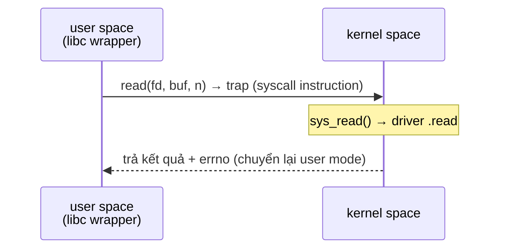

# Kernel ↔ User Space — Ranh giới, Syscall, ioctl, sysfs

> **TL;DR**
> - Kernel space (đặc quyền, truy cập phần cứng) và user space (hạn chế, cô lập) tách biệt bằng phần cứng (chế độ CPU + MMU). Vượt ranh giới chỉ qua **cổng kiểm soát**: syscall, interrupt/exception.
> - **Syscall** là cách user yêu cầu kernel làm việc đặc quyền (mở file, cấp bộ nhớ...). Có chi phí (chuyển ngữ cảnh) nên giảm số syscall là tối ưu hiệu năng.
> - Driver **không bao giờ** truy cập con trỏ user trực tiếp — phải dùng **`copy_to_user`/`copy_from_user`** (kiểm tra hợp lệ, xử lý page fault).
> - Phơi bày điều khiển/thông tin thiết bị: **device node + read/write**, **ioctl** (lệnh tùy biến), **sysfs** (`/sys`, thuộc tính dạng file), **procfs** (`/proc`). Chọn đúng kênh quan trọng.
> - Truyền dữ liệu lớn: **`mmap`** vùng nhớ thiết bị/driver vào user để tránh copy.

---

## 1. Vì sao tách kernel/user space?

Mục tiêu: **bảo vệ và ổn định**. Nếu mọi code chạy đặc quyền, một bug ứng dụng có thể phá phần cứng/OS. Nên CPU có (ít nhất) hai mức:
- **Kernel mode** (ring 0): chạy được mọi lệnh, truy cập phần cứng, toàn bộ bộ nhớ.
- **User mode** (ring 3): bị cấm lệnh đặc quyền và truy cập trực tiếp phần cứng/bộ nhớ kernel; MMU chặn user đụng vùng kernel.

Ứng dụng muốn làm việc đặc quyền (I/O, cấp bộ nhớ, tạo process) phải **nhờ kernel** qua cổng được kiểm soát — không thể tự làm.

---

## 2. Syscall — cổng chính thức


*(Ranh giới user/kernel chỉ vượt qua bằng trap có kiểm soát; mỗi lần vượt = chi phí chuyển ngữ cảnh.)*

- User gọi qua wrapper của libc (`read`, `write`...); wrapper đặt số syscall + tham số rồi thực thi lệnh **trap** (`syscall` trên x86-64) → CPU chuyển sang kernel mode, nhảy tới syscall handler.
- Kernel kiểm tra tham số, thực hiện, trả kết quả, chuyển lại user mode.
- **Chi phí**: chuyển ngữ cảnh user↔kernel + có thể context switch → mỗi syscall không miễn phí. Vì vậy gộp I/O (buffer, `writev`, `sendmmsg`) để giảm số syscall.

---

## 3. copy_to_user / copy_from_user — không tin con trỏ user

Trong driver, con trỏ từ user (`char __user *buf`) **không được dereference trực tiếp**:
- Địa chỉ đó thuộc address space user, có thể không hợp lệ/độc hại, hoặc bị swap ra (page fault).
- Dereference bừa → kernel oops, hoặc lỗ hổng bảo mật.

```c
static ssize_t my_write(struct file *f, const char __user *ubuf, size_t len, loff_t *off) {
    char kbuf[64];
    if (len > sizeof kbuf) len = sizeof kbuf;
    if (copy_from_user(kbuf, ubuf, len))   // an toàn: kiểm tra + xử lý fault
        return -EFAULT;
    // ... xử lý kbuf ...
    return len;
}
```

`copy_to_user`/`copy_from_user` (và `get_user`/`put_user`) kiểm tra vùng địa chỉ hợp lệ và xử lý page fault an toàn. Đây là quy tắc bảo mật cốt lõi của driver.

---

## 4. Các kênh giao tiếp user ↔ driver

| Kênh | Dùng cho | Đặc điểm |
|------|----------|----------|
| **read/write** trên `/dev/x` | Luồng dữ liệu chính | Tự nhiên cho data stream |
| **ioctl** | Lệnh điều khiển tùy biến | Truyền lệnh + struct tham số; "ngăn kéo tạp" — mạnh nhưng khó chuẩn hóa |
| **sysfs** (`/sys`) | Thuộc tính cấu hình/trạng thái | Mỗi thuộc tính = 1 file văn bản, một giá trị/file; dễ dùng từ shell |
| **procfs** (`/proc`) | Thông tin process/kernel (legacy cho driver) | Nay khuyến nghị dùng sysfs/debugfs cho driver mới |
| **debugfs** (`/sys/kernel/debug`) | Debug/diagnostic | Không cam kết ABI ổn định |
| **netlink** | Trao đổi nhiều dữ liệu/sự kiện | Socket-based, dùng cho networking, uevent |

### ioctl
```c
#define MYDEV_SET_FREQ _IOW('k', 1, int)   // mã lệnh có encode hướng/size
static long my_ioctl(struct file *f, unsigned int cmd, unsigned long arg) {
    switch (cmd) {
    case MYDEV_SET_FREQ: {
        int freq;
        if (copy_from_user(&freq, (int __user*)arg, sizeof freq)) return -EFAULT;
        // áp dụng freq
        return 0;
    }
    default: return -ENOTTY;
    }
}
```
- Dùng cho thao tác **không hợp với mô hình read/write** (cấu hình, lệnh điều khiển thiết bị). Linh hoạt nhưng dễ thành "API rác" → ưu tiên sysfs cho thuộc tính đơn giản.

### sysfs
- Mỗi attribute là một file dưới `/sys/.../device/`. Đọc/ghi = gọi hàm `show`/`store` của driver. Một giá trị/file, văn bản → rất tiện script:
```sh
echo 1 > /sys/class/leds/led0/brightness
cat /sys/class/thermal/thermal_zone0/temp
```

---

## 5. mmap — chia sẻ bộ nhớ, tránh copy

Với dữ liệu lớn/tần suất cao (frame buffer, DMA buffer), copy qua syscall mỗi lần là tốn. Driver có thể hỗ trợ **`.mmap`** để map vùng nhớ thiết bị/driver thẳng vào address space user:

```c
// user: mmap(NULL, size, PROT_READ|PROT_WRITE, MAP_SHARED, fd, 0);
// driver .mmap: remap_pfn_range(...) ánh xạ vùng nhớ vào VMA của user
```

Sau khi map, user đọc/ghi trực tiếp như mảng — không syscall mỗi lần. Đây là cách framebuffer (`/dev/fb0`), V4L2 video, DMA-BUF hoạt động.

---

## 6. Tại sao một số thứ ở user space, một số ở kernel?

Nguyên tắc: **giữ kernel tối thiểu** (chỉ những gì *bắt buộc* cần đặc quyền/hiệu năng), đẩy logic lên user space khi có thể (dễ debug, crash cô lập, không sập hệ thống).

- **Phải ở kernel**: truy cập thanh ghi phần cứng, xử lý interrupt, lập lịch, quản lý bộ nhớ vật lý.
- **Nên ở user space**: logic nghiệp vụ phức tạp, giao thức cấp cao. Có cả khung **driver chạy ở user space**: **UIO** (xử lý IRQ tối thiểu trong kernel, phần còn lại ở user), **VFIO**, **libusb**, **SPIdev/i2c-dev** (truy cập bus từ user). → giảm rủi ro và dễ phát triển.

---

## Câu hỏi phỏng vấn liên quan

<details><summary>1) Vì sao cần tách kernel space và user space? Cơ chế nào thực thi?</summary>

Để bảo vệ và ổn định: nếu mọi code chạy đặc quyền thì một bug ứng dụng có thể phá OS/phần cứng. Phần cứng thực thi việc tách bằng các mức đặc quyền CPU (kernel mode/ring 0 truy cập mọi thứ; user mode/ring 3 bị cấm lệnh đặc quyền và truy cập trực tiếp phần cứng) cùng MMU chặn user truy cập bộ nhớ kernel hoặc của process khác. Ứng dụng muốn làm việc đặc quyền phải nhờ kernel qua cổng kiểm soát là syscall (hoặc qua interrupt/exception), không thể tự thực hiện.
</details>

<details><summary>2) Syscall hoạt động thế nào và vì sao có chi phí?</summary>

Ứng dụng gọi wrapper libc (vd `read`), wrapper đặt số hiệu syscall và tham số rồi thực thi một lệnh trap (`syscall`); CPU chuyển từ user mode sang kernel mode và nhảy tới syscall handler tương ứng, kernel kiểm tra tham số, thực hiện công việc đặc quyền, rồi trả kết quả và chuyển lại user mode. Chi phí đến từ việc chuyển ngữ cảnh user↔kernel (lưu/khôi phục trạng thái, đổi mức đặc quyền, làm lạnh cache/pipeline) và đôi khi kéo theo context switch. Vì vậy gộp nhiều thao tác nhỏ thành ít syscall (buffer, `writev`, mmap) là cách tối ưu hiệu năng I/O.
</details>

<details><summary>3) Vì sao driver không được dereference con trỏ user trực tiếp? Dùng gì thay thế?</summary>

Con trỏ từ user nằm trong address space user, có thể không hợp lệ, trỏ vào vùng kernel (tấn công), hoặc thuộc page đã bị swap ra (gây fault). Dereference trực tiếp trong kernel có thể gây oops hoặc lỗ hổng bảo mật (truy cập bộ nhớ tùy ý). Thay vào đó driver dùng `copy_from_user`/`copy_to_user` (hoặc `get_user`/`put_user`) — các hàm này xác thực vùng địa chỉ thuộc về user, xử lý page fault an toàn, và trả lỗi `-EFAULT` nếu không hợp lệ.
</details>

<details><summary>4) ioctl và sysfs khác nhau? Khi nào dùng cái nào?</summary>

ioctl là một syscall cho phép gửi lệnh điều khiển tùy biến kèm struct tham số tới driver qua một mã lệnh — rất linh hoạt cho thao tác không hợp với mô hình read/write, nhưng dễ trở thành API thiếu chuẩn hóa, khó khám phá và khó dùng từ shell. sysfs phơi bày mỗi thuộc tính thành một file văn bản dưới `/sys`, một giá trị mỗi file, đọc/ghi gọi hàm show/store của driver — dễ dùng từ script (`echo`/`cat`), tự tài liệu hóa. Dùng sysfs cho các thuộc tính cấu hình/trạng thái đơn giản; dùng ioctl cho lệnh phức tạp, truyền struct, hoặc thao tác giao dịch mà sysfs không biểu diễn gọn được.
</details>

<details><summary>5) Khi nào dùng mmap để giao tiếp với driver?</summary>

Khi cần truyền **lượng dữ liệu lớn, tần suất cao** mà copy qua syscall mỗi lần trở thành nút cổ chai (vd framebuffer, video capture, DMA buffer). Driver hỗ trợ thao tác `.mmap` để ánh xạ vùng nhớ thiết bị hoặc buffer của driver thẳng vào address space của user (qua `remap_pfn_range`/`dma_mmap_*`); sau đó user đọc/ghi trực tiếp như truy cập mảng, không tốn syscall cho mỗi lần truy cập (zero-copy). Đây là cơ chế của `/dev/fb0`, V4L2, DMA-BUF.
</details>

<details><summary>6) Nguyên tắc quyết định đặt chức năng ở kernel hay user space?</summary>

Nguyên tắc là giữ kernel **tối thiểu**: chỉ đưa vào kernel những gì bắt buộc cần đặc quyền hoặc hiệu năng — truy cập thanh ghi phần cứng, xử lý interrupt, lập lịch, quản lý bộ nhớ vật lý. Phần còn lại (logic nghiệp vụ, giao thức cấp cao) nên ở user space vì dễ debug, crash được cô lập (không sập hệ thống), phát triển nhanh hơn. Linux còn cung cấp khung cho phép viết phần lớn driver ở user space — UIO (xử lý IRQ tối thiểu trong kernel), VFIO, libusb, i2c-dev/spidev — để giảm rủi ro và lượng code chạy đặc quyền.
</details>

---
⬅️ [driver-basics.md](driver-basics.md) · ➡️ Tiếp theo: [device-tree.md](device-tree.md)
