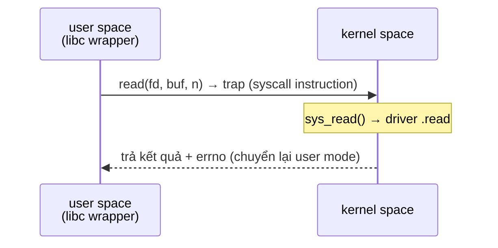

# Kernel ↔ User Space — Ranh giới, Syscall, ioctl, sysfs

> **TL;DR**
> - Kernel space (đặc quyền, truy cập phần cứng) và user space (hạn chế, cô lập) tách biệt bằng phần cứng (chế độ CPU + MMU). Vượt ranh giới chỉ qua **cổng kiểm soát**: syscall, interrupt/exception.
> - **Syscall** là cách user yêu cầu kernel làm việc đặc quyền (mở file, cấp bộ nhớ...). Có chi phí (chuyển ngữ cảnh) nên giảm số syscall là tối ưu hiệu năng.
> - Driver **không bao giờ** truy cập con trỏ user trực tiếp — phải dùng **`copy_to_user`/`copy_from_user`** (kiểm tra hợp lệ, xử lý page fault).
> - Phơi bày điều khiển/thông tin thiết bị: **device node + read/write**, **ioctl** (lệnh tùy biến), **sysfs** (`/sys`, thuộc tính dạng file), **procfs** (`/proc`). Chọn đúng kênh quan trọng.
> - Truyền dữ liệu lớn: **`mmap`** vùng nhớ thiết bị/driver vào user để tránh copy.

---

## 1. Vì sao tách kernel/user space?

Mục tiêu: **bảo vệ và ổn định**. Nếu mọi code chạy đặc quyền, một bug ứng dụng có thể phá phần cứng/OS. Nên CPU có (ít nhất) hai mức:
- **Kernel mode** (ring 0): chạy được mọi lệnh, truy cập phần cứng, toàn bộ bộ nhớ.
- **User mode** (ring 3): bị cấm lệnh đặc quyền và truy cập trực tiếp phần cứng/bộ nhớ kernel; MMU chặn user đụng vùng kernel.

Ứng dụng muốn làm việc đặc quyền (I/O, cấp bộ nhớ, tạo process) phải **nhờ kernel** qua cổng được kiểm soát — không thể tự làm.

---

## 2. Syscall — cổng chính thức


```mermaid
sequenceDiagram
    participant U as user space<br/>(libc wrapper)
    participant K as kernel space
    U->>K: read(fd, buf, n) → trap (syscall instruction)
    Note over K: sys_read() → driver .read
    K-->>U: trả kết quả + errno (chuyển lại user mode)
```
*(Ranh giới user/kernel chỉ vượt qua bằng trap có kiểm soát; mỗi lần vượt = chi phí chuyển ngữ cảnh.)*

- User gọi qua wrapper của libc (`read`, `write`...); wrapper đặt số syscall + tham số rồi thực thi lệnh **trap** (`syscall` trên x86-64) → CPU chuyển sang kernel mode, nhảy tới syscall handler.
- Kernel kiểm tra tham số, thực hiện, trả kết quả, chuyển lại user mode.
- **Chi phí**: chuyển ngữ cảnh user↔kernel + có thể context switch → mỗi syscall không miễn phí. Vì vậy gộp I/O (buffer, `writev`, `sendmmsg`) để giảm số syscall.

---

## 3. copy_to_user / copy_from_user — không tin con trỏ user

Trong driver, con trỏ từ user (`char __user *buf`) **không được dereference trực tiếp**:
- Địa chỉ đó thuộc address space user, có thể không hợp lệ/độc hại, hoặc bị swap ra (page fault).
- Dereference bừa → kernel oops, hoặc lỗ hổng bảo mật.

```c
static ssize_t my_write(struct file *f, const char __user *ubuf, size_t len, loff_t *off) {
    char kbuf[64];
    if (len > sizeof kbuf) len = sizeof kbuf;
    if (copy_from_user(kbuf, ubuf, len))   // an toàn: kiểm tra + xử lý fault
        return -EFAULT;
    // ... xử lý kbuf ...
    return len;
}
```

`copy_to_user`/`copy_from_user` (và `get_user`/`put_user`) kiểm tra vùng địa chỉ hợp lệ và xử lý page fault an toàn. Đây là quy tắc bảo mật cốt lõi của driver.

---

## 4. Các kênh giao tiếp user ↔ driver

| Kênh | Dùng cho | Đặc điểm |
|------|----------|----------|
| **read/write** trên `/dev/x` | Luồng dữ liệu chính | Tự nhiên cho data stream |
| **ioctl** | Lệnh điều khiển tùy biến | Truyền lệnh + struct tham số; "ngăn kéo tạp" — mạnh nhưng khó chuẩn hóa |
| **sysfs** (`/sys`) | Thuộc tính cấu hình/trạng thái | Mỗi thuộc tính = 1 file văn bản, một giá trị/file; dễ dùng từ shell |
| **procfs** (`/proc`) | Thông tin process/kernel (legacy cho driver) | Nay khuyến nghị dùng sysfs/debugfs cho driver mới |
| **debugfs** (`/sys/kernel/debug`) | Debug/diagnostic | Không cam kết ABI ổn định |
| **netlink** | Trao đổi nhiều dữ liệu/sự kiện | Socket-based, dùng cho networking, uevent |

### ioctl
```c
#define MYDEV_SET_FREQ _IOW('k', 1, int)   // mã lệnh có encode hướng/size
static long my_ioctl(struct file *f, unsigned int cmd, unsigned long arg) {
    switch (cmd) {
    case MYDEV_SET_FREQ: {
        int freq;
        if (copy_from_user(&freq, (int __user*)arg, sizeof freq)) return -EFAULT;
        // áp dụng freq
        return 0;
    }
    default: return -ENOTTY;
    }
}
```
- Dùng cho thao tác **không hợp với mô hình read/write** (cấu hình, lệnh điều khiển thiết bị). Linh hoạt nhưng dễ thành "API rác" → ưu tiên sysfs cho thuộc tính đơn giản.

### sysfs
- Mỗi attribute là một file dưới `/sys/.../device/`. Đọc/ghi = gọi hàm `show`/`store` của driver. Một giá trị/file, văn bản → rất tiện script:
```sh
echo 1 > /sys/class/leds/led0/brightness
cat /sys/class/thermal/thermal_zone0/temp
```

---

## 5. mmap — chia sẻ bộ nhớ, tránh copy

Với dữ liệu lớn/tần suất cao (frame buffer, DMA buffer), copy qua syscall mỗi lần là tốn. Driver có thể hỗ trợ **`.mmap`** để map vùng nhớ thiết bị/driver thẳng vào address space user:

```c
// user: mmap(NULL, size, PROT_READ|PROT_WRITE, MAP_SHARED, fd, 0);
// driver .mmap: remap_pfn_range(...) ánh xạ vùng nhớ vào VMA của user
```

Sau khi map, user đọc/ghi trực tiếp như mảng — không syscall mỗi lần. Đây là cách framebuffer (`/dev/fb0`), V4L2 video, DMA-BUF hoạt động.

---

## 6. Tại sao một số thứ ở user space, một số ở kernel?

Nguyên tắc: **giữ kernel tối thiểu** (chỉ những gì *bắt buộc* cần đặc quyền/hiệu năng), đẩy logic lên user space khi có thể (dễ debug, crash cô lập, không sập hệ thống).

- **Phải ở kernel**: truy cập thanh ghi phần cứng, xử lý interrupt, lập lịch, quản lý bộ nhớ vật lý.
- **Nên ở user space**: logic nghiệp vụ phức tạp, giao thức cấp cao. Có cả khung **driver chạy ở user space**: **UIO** (xử lý IRQ tối thiểu trong kernel, phần còn lại ở user), **VFIO**, **libusb**, **SPIdev/i2c-dev** (truy cập bus từ user). → giảm rủi ro và dễ phát triển.

---

## Câu hỏi phỏng vấn liên quan

> Đáp án sống trong [bank/](../14-prep/mock-interview/bank/) — **một đáp án, một chỗ** ([CLAUDE.md §4.7](../CLAUDE.md)). Tự trả lời trước khi mở.

| ID | Câu hỏi |
|----|---------|
| [DRV-033](../14-prep/mock-interview/bank/drivers-embedded.md) | Vì sao cần tách kernel space và user space? Cơ chế nào thực thi? |
| [LNX-002](../14-prep/mock-interview/bank/linux-sysprog.md) | Syscall hoạt động thế nào và vì sao có chi phí? |
| [DRV-006](../14-prep/mock-interview/bank/drivers-embedded.md) | Vì sao driver không được dereference con trỏ user trực tiếp? Dùng gì thay thế? |
| [DRV-009](../14-prep/mock-interview/bank/drivers-embedded.md) | ioctl và sysfs khác nhau? Khi nào dùng cái nào? |
| [DRV-034](../14-prep/mock-interview/bank/drivers-embedded.md) | Khi nào dùng mmap để giao tiếp với driver? |
| [DRV-035](../14-prep/mock-interview/bank/drivers-embedded.md) | Nguyên tắc quyết định đặt chức năng ở kernel hay user space? |

---
⬅️ [driver-basics.md](driver-basics.md) · ➡️ Tiếp theo: [device-tree.md](device-tree.md)
