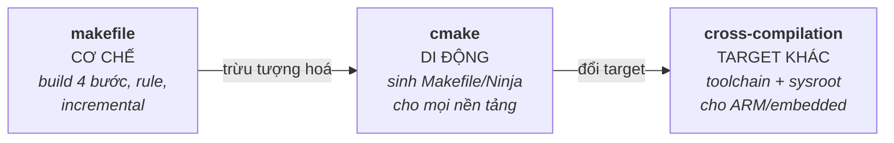

# 06 — Build Systems

Từ source tới binary: quá trình biên dịch/liên kết, Makefile (build thủ công, tường minh), CMake (meta-build, di động), và cross-compilation (build trên máy host cho target embedded khác kiến trúc). Phỏng vấn hay hỏi: "các bước từ .c tới executable", "header guard để làm gì", "cross-compile là gì", "vì sao dùng CMake".

## 🗺️ Bức tranh tổng thể

> **Sợi chỉ đỏ:** Cùng một câu chuyện "biến source thành binary" ở **ba mức trừu tượng tăng dần**: hiểu cơ chế → tự động hoá di động → mở rộng cho target khác.

- **`makefile` dạy bản chất:** quá trình preprocess→compile→assemble→link, vì sao "undefined reference" là lỗi *linker*. Hiểu cái này thì CMake chỉ là lớp sinh ra nó.
- **`cmake` giải bài toán di động:** khi dự án lớn/đa nền tảng, viết Makefile tay không scale → CMake mô tả ý định, sinh build system phù hợp.
- **`cross-compilation` là CMake + đổi target:** dùng toolchain file để build cho kiến trúc khác → dẫn thẳng tới embedded ([08](../08-embedded-systems/)).
- **Nối lên trên:** bước link ở đây chính là chủ đề của [07 Shared Libraries](../07-shared-libraries/linking-loading.md); ODR/header liên quan [01/templates](../01-cpp-fundamentals/templates.md).
- **Câu hỏi tổng hợp:** *"Các bước từ `.cpp` tới executable, và cross-compile thêm gì?"* — nối `makefile` + `cross-compilation`.

## Tài liệu trong topic

| # | File | Nội dung | Trạng thái |
|---|------|----------|-----------|
| 1 | [makefile.md](makefile.md) | quá trình build (preprocess→compile→assemble→link), rule/target/dependency, biến, incremental build | ✅ |
| 2 | [cmake.md](cmake.md) | meta-build, target-based modern CMake, find_package, generator, vì sao dùng | ✅ |
| 3 | [cross-compilation.md](cross-compilation.md) | host/build/target, toolchain, sysroot, CMake toolchain file, Yocto/Buildroot | ✅ |

## Thứ tự đọc gợi ý
`makefile` (hiểu quá trình build) → `cmake` → `cross-compilation`.

## Liên kết
- Sản phẩm build (thư viện): [07-shared-libraries/](../07-shared-libraries/)
- Câu hỏi phỏng vấn: [11-interview-questions/cpp.md](../11-interview-questions/cpp.md)
