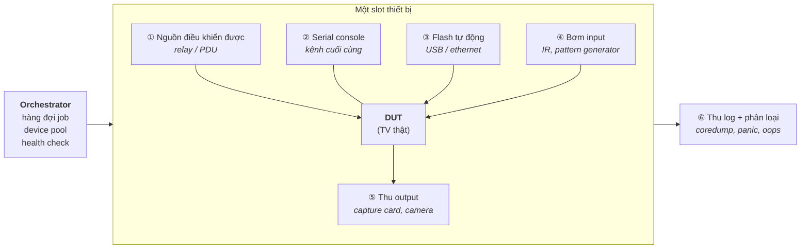

# CI/CD & Automated Test Farm cho Embedded

> **TL;DR**
> - **CI = gộp code thường xuyên + máy tự build/test mỗi lần gộp** (chữ *continuous* nói về **tần suất gộp**, không phải về việc có Jenkins). **CD** ở embedded gần như luôn dừng ở *Continuous **Delivery*** — bước phát hành là **quyết định của người**, vì "deploy" ở đây là **OTA xuống máy của khách** và rollback không hề rẻ.
> - CI cho embedded **khác CI cho web ở ba chỗ**: build **lâu + cross-compile**, sản phẩm **không chạy được trên runner** (phải có board thật), và **phần cứng có trạng thái — hỏng được, treo được, phải cứu được từ xa**.
> - **Gated check-in** (bắt buộc qua pipeline, không submit tay) đắt hơn post-merge, nhưng đúng khi **một trunk hỏng chặn N kỹ sư × nhiều giờ** — càng nhiều platform càng đúng.
> - **Tháp test = cổng rẻ chạy trước**: `smoke` (phút, nhị phân, *"còn sống không"*) → `robustness/functional` (giờ, có số đo, *"đủ tốt chưa"*) → `soak` (qua đêm).
> - Test farm tối thiểu **6 khối**: điều khiển **nguồn** · **serial console** · **flash tự động** · **bơm input** · **thu output** · **orchestrator + device pool**. Thiếu khối nguồn thì mọi lỗi treo đều cần người đi cắm lại.
> - ⭐ **Hai kiến trúc test khác nhau cho hai mục đích khác nhau**: pipeline dev đo **từ ngoài** (camera/capture — kiểm *hành vi người dùng thấy*), nhà máy đo **từ trong** qua **test daemon** (kiểm *từng đơn vị phần cứng*). Nhầm lẫn hai cái này là hiểu sai bài toán.
> - **Ethernet là đường cài image hằng ngày** (tự động hoá được); **USB/serial là đường cứu hộ** (không phụ thuộc firmware đang nằm trên máy). Chỉ đường thứ nhất quyết định farm có chạy qua đêm được không.
> - Kẻ giết cổng chặn không phải test chậm mà là **flaky test** — hỏng ngẫu nhiên trên gate sẽ dạy cả team phản xạ "bấm retry", và cổng mất hết giá trị.
>
> Bổ trợ [yocto.md](yocto.md), [cross-compilation.md](cross-compilation.md), [09-debugging/tools.md](../09-debugging/tools.md), [secure-boot.md](../08-embedded-systems/secure-boot.md).

---

## 1. Khái niệm nền — CI/CD và test farm là gì

Phần này định nghĩa từ vựng trước khi bàn tới đánh đổi. Nếu đã nắm, nhảy sang §2.

### 1.1 CI — Continuous Integration

**Vấn đề nó sinh ra để giải:** khi nhiều người cùng sửa một sản phẩm, mỗi người làm việc trên bản sao của mình. Càng lâu không gộp lại, hai bản càng phân kỳ, và lúc gộp thì **xung đột dồn thành một đống lớn không ai gỡ nổi** — gọi là *integration hell*.

**Cách giải:** gộp **thường xuyên** (ngày một lần trở lên), và mỗi lần gộp đều có **máy tự động build + test** để biết ngay là còn lành hay đã hỏng.

> 📌 **Chữ "continuous" nói về TẦN SUẤT GỘP, không phải về việc có Jenkins.** Chạy Jenkins mà nhánh sống 3 tháng mới merge thì đó **không phải** CI. Đây là hiểu lầm phổ biến nhất về thuật ngữ này.

**Ba thứ CI cho bạn:**
1. **Phản hồi sớm** — biết mình làm hỏng trong vài phút, lúc còn nhớ mình vừa sửa gì.
2. **Một định nghĩa "đúng" dùng chung** — máy build là trọng tài, thay cho *"máy tôi chạy được mà"*.
3. **Sản phẩm build được mọi lúc** — luôn có bản để đem đi test/demo.

### 1.2 CI → CD: ba chữ dễ nhầm

| Thuật ngữ | Tự động tới đâu | Bước cuối do ai |
|---|---|---|
| **CI** — Continuous **Integration** | gộp → build → test | dừng ở đây |
| **CD** — Continuous **Delivery** | + đóng gói thành **bản phát hành sẵn sàng** | **người** bấm nút phát hành |
| **CD** — Continuous **Deployment** | + **tự động đưa ra thật** | không ai bấm — máy tự đẩy |

**⭐ Ở embedded, "deployment" nghĩa là gì?** Không phải đổi container trên server, mà là **OTA update xuống thiết bị đang nằm ngoài hiện trường**. Khác biệt ấy làm Continuous *Deployment* gần như không tồn tại ở embedded:

| | Web | Embedded |
|---|---|---|
| Rollback | đổi lại container, **vài giây** | phải **OTA lần nữa**, thiết bị có thể đã brick |
| Nơi chạy | máy chủ mình kiểm soát | **thiết bị của khách**, có thể mất điện giữa chừng |
| Hậu quả xấu nhất | site lỗi vài phút | **cục gạch** — phải thu hồi/đi tới tận nơi |

⇒ Embedded gần như luôn dừng ở **Continuous Delivery**: máy lo tới bước *"bản này đã ký, đã test, sẵn sàng phát hành"*, còn **quyết định phát hành là của con người**, và thường phát theo đợt (canary/staged rollout) chứ không đẩy hết một lượt.

### 1.3 Từ vựng pipeline — và nó là gì trong thế giới embedded

| Từ | Nghĩa chung | Ở embedded là gì |
|---|---|---|
| **Pipeline** | chuỗi bước tự động chạy sau một sự kiện | submit code → build 10 platform → test trên board |
| **Stage** | một nhóm bước, xong mới sang nhóm sau | `build` → `smoke` → `robustness` |
| **Job** | một việc chạy được độc lập, song song được | "build cho platform A" |
| **Runner / agent** | máy thực thi job | máy build **x86**; **không** phải nơi chạy được binary ARM |
| **Artifact** | sản phẩm giữ lại sau khi job xong | **image**, kernel, SDK, gói `-dbg`, manifest version |
| **Trigger** | cái làm pipeline chạy | submit code, theo giờ (nightly), gọi tay |
| **Gate** | điều kiện phải pass mới đi tiếp | *"pass hết mới được vào source chính"* |
| **DUT** — Device Under Test | thiết bị đang bị đem ra test | chính cái TV trên bàn |
| **HIL** — Hardware In the Loop | test có **phần cứng thật** trong vòng lặp | test farm ở §6 |

> ⚠️ **Artifact ở embedded quan trọng hơn ở web nhiều.** Một thiết bị bán ra sống 5–10 năm; hai năm sau có lỗi hiện trường thì bạn cần **đúng image đó** và **đúng symbol của bản build đó** để đọc backtrace (§9). Không lưu artifact + manifest = không điều tra được.

### 1.4 Test farm là gì, và vì sao embedded bắt buộc phải có

**Định nghĩa:** một **nhóm thiết bị thật** (DUT) được nối vào hạ tầng điều khiển từ xa, để pipeline **tự chạy test trên phần cứng** mà không cần người ngồi bấm.

**Vì sao không né được:** phần mềm embedded chỉ **đúng khi đứng cùng phần cứng của nó**. Rất nhiều lớp lỗi **không thể** lộ ra trên máy build: timing thật, ngắt thật, tín hiệu thật, panel/cảm biến thật, nhiệt, nguồn điện.

| Cách chạy test | Bắt được | Không bắt được |
|---|---|---|
| **Trên host** (unit test, ASan/TSan) | logic thuần, lỗi bộ nhớ | mọi thứ dính phần cứng |
| **QEMU / mô phỏng** | boot, userspace, phần nhiều của kernel | timing thật, thiết bị ngoại vi thật, panel |
| **Board thật (HIL)** | ✅ **hành vi thật, số đo thật** | (đổi lại: chậm, đắt, và **board hỏng được**) |

⇒ Chiến lược thực dụng: **đẩy càng nhiều test xuống host càng tốt** (rẻ, nhanh, không giòn) và **để dành farm cho thứ chỉ phần cứng mới trả lời được**. Test farm là tài nguyên đắt nhất trong cả pipeline — dùng nó cho việc mà host làm được là lãng phí.

### 1.5 Hai trục phân loại test — đừng trộn vào nhau

Chỗ này rất hay bị lẫn, vì hai bộ từ vựng cùng tồn tại và **không phải cùng một thứ**:

| Trục | Các mức | Trả lời câu hỏi |
|---|---|---|
| **Phạm vi** (test cái gì) | unit → integration → system → acceptance | *"tôi đang kiểm một hàm, hay cả cái TV?"* |
| **Mục đích** (test để làm gì) | smoke · functional/robustness · regression · soak/stress · performance | *"tôi đang muốn biết điều gì?"* |

**Hai trục vuông góc nhau** — một bài test luôn có **một toạ độ trên mỗi trục**:

- *Smoke* thường là **system-level** + mục đích *"còn sống không"*.
- *Regression* có thể là **unit** (chạy lại test cũ sau mỗi sửa đổi) hoặc **system**.
- *Soak* gần như luôn **system-level**.

> 📌 **Câu chốt:** *"'unit/integration/system' nói **phạm vi**, còn 'smoke/regression/soak' nói **mục đích**. Một bài test có cả hai, nên hỏi 'smoke là unit hay system' là hỏi sai trục."*

---

## 2. Bản chất — CI cho embedded khác CI cho web chỗ nào

**Câu trả lời nông** (ai cũng nói được): *"build tự động, chạy test tự động, mỗi lần commit."* Đúng, nhưng đó là mô tả CI nói chung và **không phân biệt** ứng viên nào cả.

**⭐ Ba khác biệt thật sự, và mỗi cái sinh ra một yêu cầu hạ tầng:**

| Khác biệt | Ở web | Ở embedded | Hệ quả bắt buộc |
|---|---|---|---|
| **Chi phí build** | giây–phút, cache npm | **phút–giờ**, cross-compile, có khi cả rootfs | phải có **sstate/artifact cache dùng chung**, build node mạnh |
| **Nơi chạy test** | ngay trên runner (cùng kiến trúc) | ❌ **binary ARM không chạy trên runner x86** | phải có **board thật / QEMU / HIL** |
| **Trạng thái sau test** | container xoá đi là sạch | 🔴 **board giữ trạng thái**: flash bẩn, treo, nóng, hỏng thật | phải có **flash lại + cắt nguồn từ xa + health check** |

⇒ **Điểm mấu chốt:** trong CI web, "runner" là tài nguyên **vô hạn và dùng một lần**. Trong CI embedded, board là tài nguyên **hữu hạn, dùng lại, và biết hỏng**. Gần như mọi thứ phức tạp trong test farm đều sinh ra từ dòng này.

> 📌 **Câu chốt dùng ở phỏng vấn:** *"CI web coi runner là thứ dùng xong vứt. CI embedded coi board là **thiết bị phải bảo trì** — nên nửa công sức không nằm ở chạy test, mà ở **đưa board về trạng thái sạch, biết được nó đang hỏng, và cứu nó mà không cần người đi tới bàn.**"*

---

## 3. Gated check-in — vì sao "không có đường submit tay"

Hai mô hình, khác nhau ở **thời điểm code chạm trunk**:

```
POST-MERGE (CI thường)          PRE-MERGE / GATED (bắt buộc qua cổng)

  commit ──> trunk                commit ──> hàng đợi
               │                              │
               └─> build+test                 └─> build 10 platform
                     │                              │
                  ❌ hỏng                        ❌ hỏng ──> TRẢ VỀ, trunk sạch
                     │                              │
              trunk ĐANG HỎNG                    ✅ pass ──> trunk
              mọi người bị chặn
```

| | **Post-merge** | **Pre-merge (gated)** |
|---|---|---|
| Code vào trunk | ngay | **chỉ sau khi pass hết** |
| Trunk có bao giờ hỏng | **có** | ~không |
| Độ trễ cho người submit | thấp (phút) | **cao** (bằng cả pipeline) |
| Thông lượng | cao | **bị giới hạn bởi hàng đợi** |
| Hợp khi | ít platform, revert rẻ, team nhỏ | **nhiều platform, nhiều team, trunk hỏng đắt** |

**⭐ Lý do định lượng chọn gated:** trunk hỏng **không phải** "một người build lỗi" mà là **N kỹ sư × số giờ bị chặn**. Với 10 platform × nhiều model TV × nhiều team, con số N rất lớn, và tệ hơn: người làm hỏng thường **không phải** người phát hiện ra, nên thời gian tìm ra thủ phạm cũng tính vào chi phí.

**Cái giá phải nói kèm (nếu chỉ khen gated là trả lời một chiều):**

1. **Hàng đợi trở thành nút cổ chai.** Pipeline mất *T* thì thông lượng tối đa là `1/T` thay đổi — trừ khi gom lô.
2. **Gom lô (batching) đổi thông lượng lấy độ khó chẩn đoán.** Test 8 thay đổi cùng lúc: pass thì vào cả 8 (nhanh gấp 8); hỏng thì **không biết cái nào gây ra** → phải **bisect** lô đó. Đây chính là `git bisect` áp lên hàng đợi merge.
3. **Bị "chặn oan" bởi lỗi của người khác** khi lô chung hỏng.
4. **Càng chặt càng dụ người ta lách** — nếu cổng quá chậm, sẽ có "đường tắt cho bản gấp", và đó là lúc cổng bắt đầu chết.

---

## 4. Build matrix — vì sao **10 build** chứ không phải 1

Câu hỏi hay bị coi là hiển nhiên, nhưng trả lời được **cái gì thực sự khác nhau** mới là hiểu:

| Khác nhau ở đâu | Ví dụ hỏng chỉ lộ trên **một** platform |
|---|---|
| **Toolchain / compiler version** | warning mới thành lỗi (`-Werror`), khác cách suy luận `-Wmaybe-uninitialized` |
| **Kernel version** | API kernel đổi giữa 5.10 và 6.x → driver không build; symbol bị `EXPORT_SYMBOL_GPL` hoá |
| **Kernel config / `#ifdef`** | code nằm trong `#ifdef CONFIG_X` — platform tắt config đó **không hề build tới dòng đó** |
| **Kiến trúc / ABI** | 32 vs 64-bit: `long`, con trỏ, alignment, `size_t` in `%d` |
| **Device tree / driver set** | node không tồn tại → `-EPROBE_DEFER` vĩnh viễn, chỉ lộ lúc chạy |
| **Vendor BSP fork** | mỗi SoC vendor vá kernel của họ khác nhau |

> ⚠️ **Bẫy suy nghĩ phổ biến:** *"code C++ thuần thì build đâu cũng như nhau."* Sai ngay ở dòng thứ ba của bảng: phần code nằm trong nhánh `#ifdef` **chưa từng được compiler nhìn thấy** trên platform khác — nó không phải "chưa test", mà là **chưa từng được kiểm tra cú pháp**.

**Nối sang Yocto:** đây chính xác là ý nghĩa của biến `MACHINE`. Mỗi dòng trong build matrix ≈ một `MACHINE` + một cấu hình distro ([yocto.md §2](yocto.md)). Và lý do build 10 lần vẫn chịu nổi về thời gian là **sstate-cache dùng chung**: phần không phụ thuộc machine (`allarch`, native tool) tái dùng, chỉ phần machine-specific build lại.

---

## 5. Tháp test — cổng rẻ chạy trước

**Nguyên tắc duy nhất cần nhớ: sắp xếp theo *chi phí phát hiện một lỗi*, rẻ trước.** Mỗi tầng chỉ chạy khi tầng dưới đã pass.

```
              ┌──────────────────────┐
   qua đêm    │   SOAK / STRESS      │  chạy lâu, tìm leak, nhiệt, rò tài nguyên
              ├──────────────────────┤
     giờ      │ ROBUSTNESS/FUNCTIONAL│  ĐO SỐ: delay, response time, chất lượng
              ├──────────────────────┤
     phút     │       SMOKE          │  NHỊ PHÂN: boot được? có hình? có crash?
              ├──────────────────────┤
     giây     │  BUILD + STATIC + UT │  chạy trên host, không cần board
              └──────────────────────┘
```

### 5.1 Smoke test — gồm gì

Tên đến từ phần cứng: *cắm điện xem có bốc khói không*. Nó trả lời đúng **một** câu: ***"bản build này có đáng để đổ hàng giờ test lên không?"***

Trên một thiết bị hiển thị (TV/set-top box), smoke thường gồm:

1. **Boot tới nơi** — nguồn → bootloader → kernel → init → UI hiện. Bắt `kernel panic`, watchdog reset, boot time vượt ngưỡng.
2. **Đúng bản** — image báo đúng version/build number.
   > ⚠️ Nghe thừa nhưng đây là bẫy kinh điển: flash trượt / flash sai slot ⇒ test chạy nguyên **image cũ** và **xanh hết**. Không có bước này thì cả pipeline có thể xanh giả trong nhiều ngày.
3. **Không crash** — không coredump mới, không `Oops`/`Call Trace` trong `dmesg`, các daemon quan trọng không ở trạng thái failed.
4. **Có phản hồi input** — remote (IR/BT) ăn phím, đổi volume, đổi nguồn vào.
5. **Có hình / có tiếng** — nguồn vào HDMI → khung hình **không đen** (capture + checksum/histogram), có tín hiệu audio.
6. **Mạng lên** — có IP.
7. **Reboot 3–5 lần** — bắt lỗi init không tất định.
8. **Quét log** — grep các mẫu chết người (`FATAL`, `segfault`, `Unable to handle kernel`).

Đặc trưng: **vài phút**, mọi bước **nhị phân**, **không đo chất lượng**.

### 5.2 Smoke ≠ Robustness — bảng phân biệt

| | **Smoke** | **Robustness / Functional** |
|---|---|---|
| Trả lời câu hỏi | *"còn sống không?"* | *"đủ tốt để ship không?"* |
| Kết quả | pass/fail | **số đo + ngưỡng** (ms, fps, %) |
| Phủ | **rộng – nông** | **hẹp – sâu** |
| Thời lượng | phút | giờ |
| Fail nghĩa là | build **hỏng nặng** | **chất lượng suy giảm** (regression) |
| Vị trí | **cổng đầu tiên** | sau khi smoke pass |
| Cần phần cứng đo | tối thiểu | **đầy đủ** (pattern gen, capture, camera) |

> ✅ **Đối chiếu pipeline thật (TV, 10 platform):** smoke chạy **trước** robustness — đúng nguyên tắc cổng rẻ trước.
>
> ⚠️ **Bẫy quy trình khi thứ tự bị đảo:** robustness trước smoke = đốt hàng giờ để phát hiện thứ lẽ ra 3 phút đã biết. Khi được hỏi "cải thiện pipeline thế nào", **sắp lại thứ tự cổng theo chi phí** là câu trả lời rẻ nhất và đúng nhất.

### 5.3 Soak / stress

Chạy dài (qua đêm, hàng nghìn lần lặp) để bắt loại lỗi **không lộ trong một lần chạy**: memory leak, fd leak, phân mảnh, quá nhiệt, hao mòn flash, tràn counter. Không đặt trên gate (quá chậm) — thường chạy **nightly** trên bản trunk.

---

## 6. Giải phẫu một test farm — 6 khối bắt buộc



| # | Khối | Vì sao **bắt buộc** |
|---|---|---|
| ① | **Điều khiển nguồn** (relay/PDU) | Test làm treo thiết bị là **chuyện bình thường**, không phải ngoại lệ. Không cắt nguồn được từ xa ⇒ mọi lần treo đều cần người đi tới bàn ⇒ farm dừng vào 6h chiều |
| ② | **Serial console** | Kênh **duy nhất còn sống** khi mạng chưa lên / UI chết / kernel panic. Đây cũng là kênh cài đặt dự phòng khi ethernet chưa có ([lab-setup.md](../14-prep/lab-setup.md)) |
| ③ | **Cài image tự động** (ethernet — xem §6.1) | Đưa DUT về **trạng thái sạch, đã biết** trước mỗi job. Không có ⇒ job sau nhiễm trạng thái job trước |
| ④ | **Bơm input**: phát **IR**, **pattern generator** cấp source | Không có người bấm remote. Pattern generator cho **nguồn tín hiệu tất định** |
| ⑤ | **Thu output**: capture card, **camera rời** | Cách duy nhất biết "màn hình có hiện đúng không" và **đo được thời gian** |
| ⑥ | **Thu log + phân loại** | Xem §9 |

### 6.1 ⭐ Hai đường cài image — và vì sao đó là ranh giới "tự động hoá được hay không"

Trên sản phẩm thật thường có đúng hai đường đưa image lên thiết bị, và chúng **không thay thế được cho nhau**:

| | **USB rời** | **Ethernet** |
|---|---|---|
| Ai thao tác | 🔴 **người cắm tay** | máy — **tự động hoá được** |
| Thiết bị cần ở trạng thái nào | gần như **chết cũng cài được** (recovery/ROM) | phải **boot đủ xa** để có mạng |
| Tốc độ mỗi lần | chậm, có người ở giữa | nhanh, chạy đêm được |
| Dùng để | **cứu máy**, bring-up, ca hiếm | **vòng lặp hằng ngày** của farm |

**⭐ Hệ quả cho thiết kế farm — đây là ý đáng nói ở phỏng vấn:**

1. **Ethernet là con đường duy nhất cho farm chạy không người.** Còn phải cắm USB nghĩa là còn người trong vòng lặp ⇒ **không phải test tự động**, chỉ là test có script hỗ trợ.
2. 🔴 **Nhưng ethernet không tự cứu được chính nó.** Cài qua mạng đòi thiết bị **boot đủ xa để có mạng**. Đúng lúc cần nhất — image mới làm máy không boot — thì đường đó **biến mất**. Vì vậy farm luôn cần một **đường thoát không phụ thuộc bản đang chạy**: USB/recovery mode, hoặc bootloader nạp qua **serial/TFTP**, hoặc **A/B partition** để tự quay về bản cũ ([secure-boot.md](../08-embedded-systems/secure-boot.md)).
3. **Đó là lý do khối ① (nguồn) và ② (serial) không thừa.** Chuỗi cứu chuẩn: cắt nguồn → bật lại → **bắt bootloader qua serial** → nạp lại. Cả ba khối phải có mặt thì một máy chết mới tự về được trạng thái sạch mà không cần ai đi tới bàn.

> 📌 **Câu chốt:** *"Ethernet là đường cài **hằng ngày** vì nó tự động hoá được; USB/serial là đường **cứu hộ** vì nó không phụ thuộc vào bản firmware đang nằm trên máy. Farm cần cả hai — nhưng chỉ đường thứ nhất mới quyết định farm có chạy qua đêm được không."*

### 6.2 Vì sao **pattern generator** chứ không phải "mở một video lên xem"

Ba lý do, đều là lý do kỹ thuật chứ không phải tiện lợi:

1. **Tất định** — biết chính xác khung hình *phải* trông như thế nào ⇒ so sánh được bằng checksum/histogram, kết quả **quyết định được** thay vì "trông có vẻ ổn".
2. **Không phụ thuộc dịch vụ ngoài** — dùng nội dung streaming là nhét mạng + CDN + DRM vào đường dẫn test ⇒ sinh **flaky** (§10) mà không liên quan gì tới thay đổi code.
3. **Ép được ca biên** — pattern generator phát đúng tổ hợp cần test: đổi độ phân giải, đổi tần số quét, HDR/SDR, tín hiệu ngoài chuẩn. Nội dung thật không cho bạn chọn.

---

## 7. ⭐ Hai kiến trúc test — quan sát **từ ngoài** vs **test daemon trên máy**

Đây là chỗ phân biệt rõ nhất giữa người *đã sống trong* pipeline và người *đọc về* CI.

| | **Quan sát ngoài (black-box)** | **Test daemon trên thiết bị** |
|---|---|---|
| Cách hoạt động | thiết bị đo rời: IR, pattern gen, capture, **camera đo thời gian** | daemon nối mạng, app trên máy test **gọi API**, đọc giá trị trả về |
| Thấy được gì | **đúng cái người dùng thấy** | **giá trị bên trong**: sensor, calib, ID panel, mã lỗi |
| Ảnh hưởng lên hệ | ~0 | **có** — chiếm CPU/RAM/mạng, và **là phần mềm không có trong bản ship** |
| Tốc độ mỗi phép đo | chậm (khung hình, quang học) | **rất nhanh** (một lời gọi API) |
| Độ giòn | cao (ánh sáng, đặt camera, cáp) | thấp |
| Dùng ở | ✅ **pipeline development** | ✅ **verification dưới nhà máy** |

**Vì sao lại chia đúng như vậy — ba lý do:**

1. **Đối tượng cần chứng minh khác nhau.**
   - Pipeline dev hỏi: *"thay đổi code này có làm hỏng **hành vi** không?"* → phải quan sát **như người dùng**, vì lỗi hay nằm đúng ở khoảng cách giữa "API trả về OK" và "màn hình vẫn sai".
   - Nhà máy hỏi: *"**cái máy cụ thể này** có được lắp và hiệu chỉnh đúng không?"* — phần mềm đã cố định và đã được duyệt từ trước. Cần đọc **giá trị bên trong**: cảm biến có đúng dải không, panel đúng model không, dữ liệu calibration đã ghi chưa.

2. 🔴 **Daemon làm bạn test một image khác image đem bán.** Thêm phần mềm vào là đổi bộ nhớ, đổi lịch CPU, đổi thời điểm. Với chỉ tiêu **thời gian đáp ứng**, chính công cụ đo trở thành nguồn sai số. Ở nhà máy chấp nhận được vì thứ đang được kiểm là **phần cứng**, không phải build.

3. **Ràng buộc thông lượng ngược nhau.** Nhà máy: **hàng nghìn máy**, mỗi máy vài chục giây → không thể ngồi soi camera. Pipeline dev: **vài build/ngày**, mỗi build hàng giờ → đủ chỗ cho phép đo quang học chậm mà trung thực.

> 📌 **Câu chốt:** *"Pipeline dev đo **build**, nên phải đo **từ ngoài** để khỏi làm sai lệch thứ đang đo. Nhà máy đo **từng đơn vị phần cứng** trên một build đã cố định, nên đo **từ trong** qua daemon là hợp lý và nhanh hơn nhiều."*

---

## 8. Đo delay / thời gian đáp ứng — vì sao phải có **quan sát viên ngoài**

Yêu cầu kiểu *"bấm remote tới lúc hình đổi ≤ 200 ms"* nghe như đo bằng `clock_gettime()` là xong. **Không được**, vì ba lý do:

| Vấn đề | Vì sao đo từ trong bị sai |
|---|---|
| **Không quan sát được điểm cuối thật** | Phần mềm chỉ biết lúc nó **gửi khung hình đi**. Còn scaler, TCON, thời gian đáp ứng của panel nằm **sau** đó — mắt người thấy chậm hơn số bạn in ra |
| **Thiếu điểm bắt đầu thật** | Đồng hồ chạy từ lúc **driver IR nhận được mã**, không tính thời gian từ lúc **ngón tay bấm** |
| 🔴 **Hiệu ứng quan sát viên** | Code đo chịu **chính cái tải** đang đo: khi hệ quá tải, tiến trình đo cũng bị hoãn ⇒ báo số **đẹp hơn** sự thật đúng lúc hệ đang tệ nhất |

**Cách đúng — cả hai đầu đều nằm ngoài thiết bị:**

```
  ┌──────────┐  t0 (kích phát)   ┌─────┐   ánh sáng    ┌──────────────┐
  │ Bộ điều  │ ────────────────> │ DUT │ ────────────> │ Camera tốc   │
  │ khiển đo │                   └─────┘               │ độ cao / cảm │
  └──────────┘ <─────────────────────────────────────── │ biến quang   │
                     t1 (khung hình đổi thật)          └──────────────┘

              delay = t1 − t0,  cùng MỘT đồng hồ, KHÔNG nằm trên DUT
```

Vì `t0` và `t1` được đóng dấu trên **cùng một đồng hồ ngoài**, không cần đồng bộ thời gian với thiết bị — nguồn sai số lớn nhất bị loại ngay từ thiết kế. Camera 240 fps cho độ phân giải ~4 ms; cần chính xác hơn thì dùng cảm biến quang (photodiode) dán lên màn hình.

> 📌 **Câu chốt:** *"Không đo được độ trễ của chính mình từ bên trong — cả điểm đầu lẫn điểm cuối đều nằm ngoài phần mềm, và bản thân phép đo cũng chịu cái tải mà nó đang đo."*

---

## 9. Thu log & tự động định tuyến defect

Trên gate nhiều platform, **người làm hỏng thường không phải người đọc log**. Vì vậy giá trị lớn nhất của khối này không phải "lưu log lại", mà là **tự nhận dạng và chuyển đúng người**.

**Bốn loại bằng chứng cần thu, theo thứ tự khó thu dần:**

| Loại | Thu ở đâu | Ghi chú |
|---|---|---|
| **Message lỗi đặc thù của package** | log ứng dụng / journal | Rẻ nhất, và **định tuyến tốt nhất** — vì chuỗi lỗi đã gắn sẵn với chủ sở hữu |
| **Kernel `Oops` / `Call Trace`** | `dmesg` + **serial** | Hệ có thể còn sống ⇒ vẫn lấy qua mạng được |
| 🔴 **Kernel panic** | **chỉ serial** | Mạng chết theo. Không có console = **không có bằng chứng gì** ([kernel-debugging.md](../09-debugging/kernel-debugging.md)) |
| **Core dump** | phân vùng riêng / gửi về server | **Đắt**: dung lượng lớn, ghi lâu, có thể chứa dữ liệu nhạy cảm |

**Định tuyến tự động hoạt động thế nào:** trích một **chữ ký lỗi** (fingerprint) — tên tiến trình + hàm trên cùng của backtrace + mẫu chuỗi lỗi — rồi tra bảng ánh xạ sang **team sở hữu** để mở defect. Hai lợi ích khác đến kèm miễn phí:

- **Gộp trùng:** cùng chữ ký ⇒ cùng một defect, không tạo 40 vé cho một bug.
- **Đếm được tần suất** ⇒ phân biệt lỗi **luôn xảy ra** với lỗi **flaky** (§10).

> ⚠️ **Bẫy về symbol — hay gặp thật:** image ship đã **strip**, nên backtrace trên thiết bị chỉ là địa chỉ trần. Phải **giữ lại bản có symbol trên build server đúng theo từng build** rồi giải mã sau (`addr2line`, `gdb`, gói `-dbg` của Yocto). Không giữ ⇒ có core dump mà **không đọc được**. Xem [09-debugging/tools.md](../09-debugging/tools.md).

---

## 10. Flaky test — thứ thật sự giết một cổng chặn

**Định nghĩa:** test cho kết quả khác nhau trên **cùng một code**.

Trên pipeline không gate, flaky chỉ gây phiền. **Trên gate, nó là lỗi hệ thống**, vì cơ chế sau:

```
test hỏng ngẫu nhiên 5%  ──> chặn oan người vô tội
                          ──> người ta học được: "cứ bấm retry"
                          ──> retry thành phản xạ với MỌI lỗi
                          ──> 🔴 lỗi THẬT cũng bị retry cho qua
                          ──> cổng còn tốn thời gian nhưng KHÔNG còn chặn gì
```

⇒ **Flaky không làm cổng chặn nhầm; nó làm cổng *ngừng chặn*.**

Càng nhiều bước, xác suất hỏng càng cộng dồn: 200 test mỗi test flaky 0.5% ⇒ khoảng **63%** số lần chạy có ít nhất một lần hỏng oan (`1 − 0.995²⁰⁰`). Trên gate, điều đó nghĩa là **hầu như lần nào cũng phải retry**.

**Nguồn flaky đặc trưng của embedded** (khác hẳn web):

| Nguồn | Ví dụ |
|---|---|
| **Quang học / cơ khí** | camera lệch, ánh sáng phòng đổi, cáp HDMI lỏng, cảm biến IR bị che |
| **Thời gian** | test `sleep(2)` rồi giả định đã boot xong — máy chậm hơn một chút là hỏng |
| **Trạng thái tồn dư** | job trước để lại file/cấu hình, board chưa nguội, flash chưa sạch |
| **Chính board hỏng dần** | một board trong pool bắt đầu lỗi ⇒ chỉ job rơi vào board đó mới hỏng |

**Cách xử lý (nói được là ăn điểm senior):**

1. **Đo trước đã** — ghi tỉ lệ pass/fail mỗi test theo thời gian. Không đo thì tranh cãi bằng cảm giác.
2. **Cách ly (quarantine)** — test flaky **bị gỡ khỏi gate**, chuyển sang chạy nightly, có hạn sửa. Để trên gate là hy sinh cả cổng cho một test.
3. **Bỏ `sleep`, chờ theo điều kiện** — chờ *"log xuất hiện dòng X"* / *"cổng mở"*, có timeout, thay vì chờ theo số giây.
4. **Health check board** trước mỗi job; board hỏng thì **tự rút khỏi pool**, không để nó nhuộm đỏ ngẫu nhiên cả pipeline.
5. **Phân biệt "hỏng do hạ tầng" với "hỏng do code"** — hai loại này phải hiện ra khác nhau trên báo cáo, nếu không mọi thống kê đều vô nghĩa.

---

## 11. Perforce ↔ Git — mirror và patch chồng lên source vendor

Bối cảnh thường gặp: **công cụ nội bộ là Perforce**, còn source của SoC vendor nằm trên **Git**. Sửa source vendor thì làm trên Git, rồi đồng bộ về Perforce — nhưng **bước integrate thì vẫn y hệt**, vẫn phải qua cổng.

### 11.1 Hai mô hình quản lý nguồn khác nhau về bản chất

| | **Perforce** | **Git** |
|---|---|---|
| Mô hình | **tập trung** — một server là chân lý | **phân tán** — mỗi clone là một repo đủ |
| Đơn vị thay đổi | **changelist** (số tăng dần, nguyên tử) | commit (hash nội dung) |
| Commit cục bộ | ❌ không có — submit là đi thẳng lên server | ✅ có |
| Phạm vi | theo **đường dẫn** (depot path), lấy được một thư mục con | theo **cả repo** |
| Sửa lịch sử | gần như không | `rebase`/`amend` — **sửa được** |
| Hợp với | cây source **rất lớn**, nhiều binary asset | phân nhánh nhiều, đóng góp phân tán |

### 11.2 Chỗ đau khi bắc cầu — hỏi là ăn điểm

1. **Ai là chân lý?** Mirror **một chiều** (Git → Perforce) thì đơn giản và tự khỏi conflict. **Hai chiều** mới là chỗ sinh việc: cùng một file bị sửa ở cả hai bên thì bên nào thắng, và ai xử lý conflict xảy ra **trong cầu nối** chứ không phải trong máy của ai cả.
2. **Lịch sử Git không ánh xạ được 1–1.** `rebase`/`squash`/force-push viết lại lịch sử, trong khi changelist Perforce **chỉ tiến, không sửa** ⇒ hoặc ép quy ước (không rebase nhánh đã đồng bộ), hoặc chấp nhận **gộp phẳng** (nhiều commit → một changelist), mất chi tiết truy vết.
3. **Cầu nối là điểm hỏng đơn lẻ** — nó ngừng chạy thì hai bên **âm thầm phân kỳ** và không ai nhận ra ngay.
4. ⭐ **Cập nhật từ vendor va vào bản vá của mình.** Vendor ra bản mới, mà bạn đang có N chỗ sửa trên source của họ. Bài toán là **duy trì patch chồng lên upstream**, không phải merge thông thường.

### 11.3 ⭐ Và đó chính là mô hình của Yocto

Chỗ này nối thẳng việc thật sang đúng thứ JD hỏi: quản lý bản vá trên source vendor là **đúng cái mô hình recipe Yocto**:

```bitbake
# Giữ nguyên source vendor, mọi thay đổi là patch có thứ tự — không fork
SRC_URI = "git://github.com/vendor/driver.git;protocol=https;branch=main \
           file://0001-fix-probe-defer.patch \
           file://0002-add-board-quirk.patch"
SRCREV = "a1b2c3d4..."   # ghim đúng một commit → build tái lập được
```

| Cách làm | Khi vendor ra bản mới |
|---|---|
| 🔴 Fork rồi sửa thẳng | merge cả một cây source; **không ai còn biết** dòng nào là của mình |
| ✅ Patch chồng (Yocto/quilt) | đổi `SRCREV`, patch nào **không áp được nữa** thì báo lỗi ngay — **danh sách khác biệt luôn tường minh** |

⇒ Câu trả lời gọn: ***"đừng fork source vendor — giữ upstream nguyên vẹn và diễn đạt mọi thay đổi của mình dưới dạng patch có thứ tự."*** Chi tiết `.bbappend`/`devtool`: [yocto.md §4](yocto.md).

---

## 12. Sau khi pass — image chính thức

Một chi tiết dễ bỏ qua nhưng có ý nghĩa: **bản đã pass gate không phải bản đem đi dùng**. Sau khi vào trunk, trunk mới được build lại thành **image chính thức**, và chỉ image đó mới đi tiếp (test hệ thống, xuất xưởng).

**Vì sao lại build lại — không phải làm thừa:**

| Lý do | Giải thích |
|---|---|
| **Bản gate là "trunk + thay đổi của tôi"** | Còn image chính thức là **trunk sau khi mọi thay đổi đã vào** — hai cây source khác nhau |
| **Tương tác giữa các thay đổi** | A pass riêng, B pass riêng, **A+B vẫn hỏng**. Chỉ bản gộp mới lộ ra |
| **Ký/đóng dấu chính thức** | Bản gate ký bằng khoá **DEV**; bản phát hành cần khoá **PRODUCTION** trong HSM ([secure-boot.md](../08-embedded-systems/secure-boot.md)) |
| **Truy vết** | Image chính thức cần manifest đầy đủ: version từng layer, license, báo cáo CVE |

⇒ Kèm theo đó: **cài gói RPM rời lúc phát triển vẫn phải ký** — vì kernel kiểm chữ ký IMA lúc chạy, không phải chỉ lúc boot. Đó là mắt xích nối CI với secure boot ([BSP-039](../14-prep/mock-interview/bank/bsp.md)).

---

## 13. Bẫy & hiểu lầm thường gặp

1. 🔴 **"Pipeline xanh nghĩa là code đúng."** Xanh chỉ nghĩa là *"không test nào bắt được lỗi"*. Nếu bước kiểm version thiếu, xanh có thể chỉ nghĩa là **đã test nhầm image cũ**.
2. 🔴 **Đặt test đắt trước test rẻ.** Sai thứ tự cổng làm mọi thay đổi phải trả giá tối đa để biết một lỗi tối thiểu.
3. **Coi flaky test là chuyện nhỏ.** Nó không làm cổng chặn sai — nó **làm cổng ngừng chặn** (§10).
4. **Quên khối điều khiển nguồn.** Farm chạy được ban ngày, chết mỗi khi treo ngoài giờ.
5. **Chỉ thu log qua mạng.** Đúng cái ca đáng giá nhất — **kernel panic** — là ca mạng chết theo. Không serial = không bằng chứng.
6. **Giữ core dump nhưng không giữ symbol theo build.** Có dump mà giải mã không ra thì bằng không.
7. **Thêm test daemon vào image dev "cho tiện đo".** Đang đo một image **không phải image đem bán**, và tự tạo sai số cho chính chỉ tiêu thời gian (§7).
8. **Dùng nội dung thật (streaming) làm nguồn test.** Nhét mạng/CDN/DRM vào đường dẫn test ⇒ flaky không liên quan gì tới thay đổi code.
9. **Chờ bằng `sleep` cố định.** Nguồn flaky số một, và hỏng ngay khi máy chậm hơn một chút hoặc log ra chậm hơn.
10. **Fork source vendor rồi sửa thẳng.** Bản cập nhật kế tiếp của vendor sẽ trở thành một cuộc merge không ai đọc nổi (§10.3).
11. **Gom lô mà không có cơ chế bisect.** Được thông lượng, mất khả năng chỉ ra thay đổi nào gây hỏng.
12. **Nghĩ "build một platform là đủ vì code C++ thuần".** Code trong nhánh `#ifdef` tắt **chưa từng được compiler đọc tới** (§4).

---

## Câu hỏi phỏng vấn liên quan

| ID | Câu hỏi |
|----|---------|
| [BLD-030](../14-prep/mock-interview/bank/build-systems.md) | Continuous Integration là gì, giải vấn đề gì |
| [BLD-031](../14-prep/mock-interview/bank/build-systems.md) | CI vs Continuous Delivery vs Continuous Deployment — embedded dừng ở đâu |
| [BLD-032](../14-prep/mock-interview/bank/build-systems.md) | Từ vựng pipeline: stage/job/runner/artifact/trigger/gate/DUT/HIL |
| [BLD-033](../14-prep/mock-interview/bank/build-systems.md) | unit/integration/system vs smoke/regression/soak — hai trục vuông góc |
| [BLD-034](../14-prep/mock-interview/bank/build-systems.md) | Test farm, DUT, HIL là gì |
| [BLD-035](../14-prep/mock-interview/bank/build-systems.md) | ⭐ Vì sao phải test trên board thật — host/QEMU thiếu gì |
| [BLD-010](../14-prep/mock-interview/bank/build-systems.md) | Thiết kế CI (vd Jenkins) cho một dự án embedded Linux |
| [BLD-020](../14-prep/mock-interview/bank/build-systems.md) | CI cho embedded khác CI cho web ở đâu |
| [BLD-021](../14-prep/mock-interview/bank/build-systems.md) | ⭐ Gated check-in vs post-merge — lợi gì, giá gì |
| [BLD-022](../14-prep/mock-interview/bank/build-systems.md) | Vì sao phải build 10 platform, không build 1 lần |
| [BLD-023](../14-prep/mock-interview/bank/build-systems.md) | ⭐ Smoke test gồm gì, khác robustness thế nào, thứ tự cổng |
| [BLD-024](../14-prep/mock-interview/bank/build-systems.md) | 🏗️ Thiết kế test farm tự động cho thiết bị hiển thị |
| [BLD-036](../14-prep/mock-interview/bank/build-systems.md) | ⭐ Cài image bằng USB hay ethernet — đường hằng ngày vs đường cứu hộ |
| [BLD-025](../14-prep/mock-interview/bank/build-systems.md) | ⭐ Đo thời gian đáp ứng — vì sao không đo từ trong thiết bị |
| [BLD-026](../14-prep/mock-interview/bank/build-systems.md) | Flaky test trên cổng chặn — vì sao nguy hiểm, xử lý sao |
| [BLD-027](../14-prep/mock-interview/bank/build-systems.md) | ⭐ Quan sát ngoài (pipeline dev) vs test daemon (nhà máy) |
| [BLD-028](../14-prep/mock-interview/bank/build-systems.md) | Thu bằng chứng khi test hỏng & tự động định tuyến defect |
| [BLD-029](../14-prep/mock-interview/bank/build-systems.md) | Mirror Git ↔ Perforce và quản lý patch trên source vendor |
| [BSP-017…019](../14-prep/mock-interview/bank/bsp.md) | Yocto trong ngữ cảnh BSP |

⬅️ [Về 06-build-systems](README.md)
