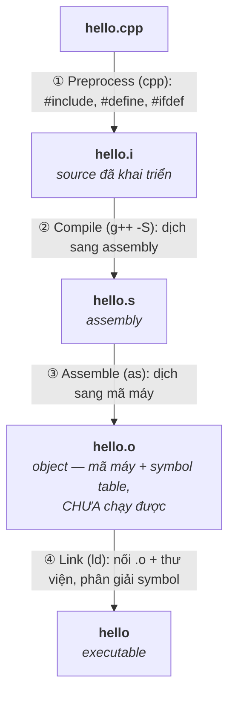

# Makefile & Quá trình build

> **TL;DR**
> - Từ `.c/.cpp` tới executable qua 4 bước: **preprocess** (`#include`, macro) → **compile** (ra assembly) → **assemble** (ra object `.o`) → **link** (gộp `.o` + thư viện thành binary).
> - **Compile** xử lý từng *translation unit* độc lập; **link** mới nối các symbol lại với nhau (do đó lỗi "undefined reference" là lỗi *linker*).
> - **Make** build dựa trên **rule**: `target: prerequisites` + recipe. Nó chỉ build lại khi prerequisite **mới hơn** target → **incremental build** (nhanh).
> - Header dùng **include guard** / `#pragma once` để tránh include trùng. Khai báo (header) tách khỏi định nghĩa (`.cpp`).
> - Make tường minh và mạnh nhưng viết tay dễ sai dependency → dự án lớn dùng CMake sinh Makefile.

---

## 1. Quá trình build C/C++ chi tiết



- **Translation unit (TU)**: một `.cpp` sau khi preprocess. Compiler xử lý **từng TU độc lập** → nó *không* thấy định nghĩa hàm ở TU khác, chỉ cần **khai báo** (từ header) để biết chữ ký.
- **Object file** chứa mã máy + bảng symbol (định nghĩa + tham chiếu chưa giải quyết). 
- **Linker** ghép các `.o`, khớp mỗi tham chiếu (vd gọi `foo()`) với một định nghĩa ở đâu đó. Thiếu định nghĩa → **`undefined reference`** (lỗi *link*, không phải compile); định nghĩa trùng → **multiple definition**.

```sh
g++ -E hello.cpp -o hello.i   # chỉ preprocess
g++ -S hello.cpp              # tới assembly
g++ -c hello.cpp              # tới object (.o) — compile + assemble
g++ hello.o utils.o -o app    # link
```

---

## 2. Khai báo vs định nghĩa, header & include guard

- **Header (.h)**: chứa **khai báo** (chữ ký hàm, class, `extern` biến) để các TU khác biết "có cái này tồn tại". 
- **Source (.cpp)**: chứa **định nghĩa** (thân hàm). Mỗi định nghĩa chỉ được xuất hiện một lần trong toàn chương trình (**ODR** — One Definition Rule).

**Include guard** chống include một header nhiều lần trong cùng TU (gây định nghĩa trùng):
```cpp
#ifndef MYLIB_UTILS_H
#define MYLIB_UTILS_H
// ... nội dung header ...
#endif
// hoặc đơn giản, đầu file:  #pragma once
```

> Template và `inline` function phải để **trong header** (định nghĩa cần thấy ở mọi TU dùng tới) — xem [01/templates.md](../01-cpp-fundamentals/templates.md).

---

## 3. Cấu trúc Makefile

```makefile
CXX      := g++
CXXFLAGS := -Wall -Wextra -std=c++17 -O2
OBJS     := main.o utils.o

app: $(OBJS)                 # target : prerequisites
	$(CXX) $(OBJS) -o $@     # recipe (PHẢI thụt bằng TAB), $@ = tên target

main.o: main.cpp utils.h     # main.o phụ thuộc main.cpp và utils.h
	$(CXX) $(CXXFLAGS) -c main.cpp -o $@

utils.o: utils.cpp utils.h
	$(CXX) $(CXXFLAGS) -c utils.cpp -o $@

.PHONY: clean
clean:
	rm -f $(OBJS) app
```

Cú pháp rule:
```
target: prerequisites
<TAB>recipe (lệnh shell)
```

- **Recipe phải thụt bằng TAB**, không phải space (lỗi kinh điển).
- **`.PHONY`**: đánh dấu target không phải file (như `clean`, `all`) → make luôn chạy, không nhầm với file cùng tên.

---

## 4. Incremental build — giá trị cốt lõi của make

Make so **mtime** (thời gian sửa đổi): chỉ build lại target nếu một prerequisite **mới hơn** target.

```
sửa utils.cpp → utils.o cũ hơn utils.cpp → rebuild utils.o → rebuild app
(main.cpp không đổi → main.o KHÔNG build lại)
```

→ Dự án lớn không phải build lại từ đầu mỗi lần. Nhưng điều này chỉ đúng nếu **dependency khai báo đầy đủ** — nếu quên ghi `utils.h` là prerequisite, sửa header sẽ không trigger rebuild → binary lỗi thời (bug khó chịu). Thực tế dùng `g++ -MMD` để auto-sinh dependency theo header.

---

## 5. Biến, automatic variable, pattern rule

```makefile
$@   # tên target
$<   # prerequisite ĐẦU TIÊN
$^   # TẤT CẢ prerequisites
$?   # prerequisites mới hơn target

# Pattern rule: mọi .o sinh từ .cpp tương ứng
%.o: %.cpp
	$(CXX) $(CXXFLAGS) -c $< -o $@
```

- `:=` gán tức thời (đơn giản, dễ đoán) vs `=` gán trì hoãn (đánh giá khi dùng).
- Pattern rule + automatic variable giúp Makefile gọn, không lặp.

---

## 6. Compile flags hay gặp

| Flag | Ý nghĩa |
|------|---------|
| `-Wall -Wextra` | Bật cảnh báo (nên luôn có) |
| `-std=c++17` | Chuẩn ngôn ngữ |
| `-O0/-O2/-O3/-Os` | Mức tối ưu (`-Os` tối ưu kích thước — embedded) |
| `-g` | Thêm debug symbol (cho gdb) |
| `-I<dir>` | Thêm đường dẫn tìm header |
| `-L<dir>` `-l<name>` | Đường dẫn & tên thư viện khi link (vd `-lpthread`) |
| `-D<MACRO>` | Định nghĩa macro lúc build |
| `-fPIC` | Position-independent code (cho shared library) |

---

## 7. Vì sao chuyển sang CMake?

Makefile viết tay: tường minh, không phụ thuộc công cụ ngoài, tốt cho dự án nhỏ/kernel module. Nhưng dự án lớn gặp khó: quản lý dependency phức tạp, **không di động** (đường dẫn/flag khác nhau giữa OS/compiler), khó tìm thư viện, khó tích hợp IDE. → **CMake** sinh ra Makefile (hoặc Ninja, project Visual Studio...) một cách di động (xem [cmake.md](cmake.md)).

---

## Câu hỏi phỏng vấn liên quan

<details><summary>1) Các bước từ file .cpp tới executable là gì?</summary>

Bốn bước: (1) **Preprocess** — khai triển `#include`, macro `#define`, xử lý `#ifdef`, ra source đã mở rộng. (2) **Compile** — dịch source thành assembly, áp dụng tối ưu, xử lý từng translation unit độc lập. (3) **Assemble** — dịch assembly thành mã máy, tạo object file `.o` (mã máy + bảng symbol, chưa chạy được). (4) **Link** — nối nhiều object file và thư viện, phân giải các tham chiếu symbol tới định nghĩa, tạo executable. Lỗi `undefined reference` xảy ra ở bước link, không phải compile.
</details>

<details><summary>2) Tại sao "undefined reference" là lỗi link chứ không phải compile?</summary>

Vì compiler xử lý từng translation unit **độc lập** và chỉ cần **khai báo** (chữ ký từ header) để biên dịch một lời gọi hàm — nó không cần thấy định nghĩa thật ở TU khác, chỉ ghi lại một tham chiếu symbol chưa giải quyết trong object file. Tới bước **link**, linker mới gom mọi object file/thư viện và cố khớp từng tham chiếu với một định nghĩa; nếu không tìm thấy định nghĩa nào cho symbol đó thì báo `undefined reference`. Ngược lại, định nghĩa trùng ở nhiều nơi gây `multiple definition` cũng ở bước link.
</details>

<details><summary>3) Include guard / #pragma once để làm gì?</summary>

Chúng ngăn một header bị include nhiều lần trong cùng một translation unit. Nếu không có, khi nhiều header cùng include một header chung, nội dung (vd định nghĩa struct/class) sẽ xuất hiện lặp lại trong cùng TU → lỗi định nghĩa trùng. Include guard dùng `#ifndef X / #define X / ... / #endif` để lần include thứ hai trở đi bị bỏ qua; `#pragma once` đạt cùng mục đích gọn hơn (compiler-specific nhưng được hỗ trợ rộng rãi).
</details>

<details><summary>4) Make quyết định build lại cái gì như thế nào? Incremental build là gì?</summary>

Make dựa trên đồ thị phụ thuộc của các rule (`target: prerequisites`) và so sánh thời gian sửa đổi (mtime): nó chỉ chạy recipe để build lại một target nếu target không tồn tại hoặc có ít nhất một prerequisite **mới hơn** target. Nhờ vậy chỉ phần bị ảnh hưởng bởi thay đổi mới được biên dịch lại (incremental build), tiết kiệm thời gian lớn trong dự án lớn. Điều kiện để đúng là dependency phải khai báo đầy đủ — nếu quên liệt kê một header là prerequisite, sửa header đó sẽ không trigger rebuild và sinh binary lỗi thời; thực tế dùng `-MMD` của gcc/g++ để tự sinh dependency.
</details>

<details><summary>5) Khác biệt giữa khai báo (declaration) và định nghĩa (definition)? ODR là gì?</summary>

Khai báo cho compiler biết một thực thể tồn tại và chữ ký của nó (vd prototype hàm, `extern int x;`) — thường đặt trong header để nhiều TU dùng chung. Định nghĩa cung cấp nội dung thực tế (thân hàm, cấp phát biến) — đặt trong `.cpp`. ODR (One Definition Rule) quy định mỗi entity (hàm non-inline, biến) chỉ được có **đúng một định nghĩa** trong toàn chương trình; vi phạm gây lỗi multiple definition khi link. Đó là lý do header chỉ nên chứa khai báo (trừ `inline`/`template`/`constexpr` được phép định nghĩa trong header vì có ngoại lệ ODR).
</details>

<details><summary>6) Khi nào dùng Makefile viết tay, khi nào dùng CMake?</summary>

Makefile viết tay phù hợp dự án nhỏ, mục tiêu đơn giản, hoặc môi trường đặc thù (vd kernel module dùng kbuild) — nó tường minh, không phụ thuộc công cụ ngoài. CMake phù hợp dự án lớn hoặc cần **di động** đa nền tảng/đa compiler: nó tự tìm thư viện (`find_package`), quản lý dependency và include path theo target, tích hợp IDE, và sinh ra Makefile/Ninja/VS project tùy môi trường. Khi dự án phải build trên nhiều OS, dùng nhiều thư viện, hoặc cần cross-compile có hệ thống, CMake giảm rất nhiều công sức bảo trì so với Makefile thủ công.
</details>

---
⬅️ [Về index topic](README.md) · ➡️ Tiếp theo: [cmake.md](cmake.md)
