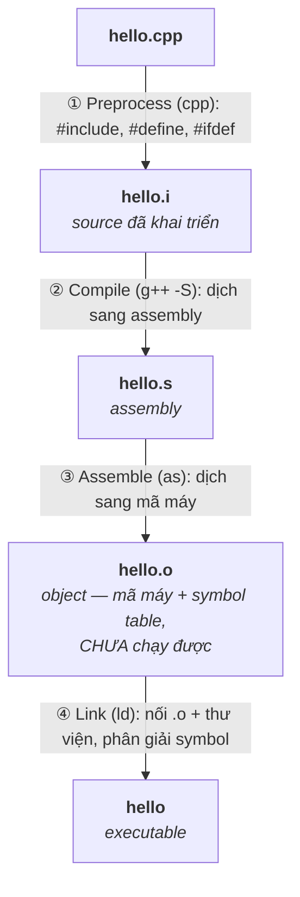

# Makefile & Quá trình build

> **TL;DR**
> - Từ `.c/.cpp` tới executable qua 4 bước: **preprocess** (`#include`, macro) → **compile** (ra assembly) → **assemble** (ra object `.o`) → **link** (gộp `.o` + thư viện thành binary).
> - **Compile** xử lý từng *translation unit* độc lập; **link** mới nối các symbol lại với nhau (do đó lỗi "undefined reference" là lỗi *linker*).
> - **Make** build dựa trên **rule**: `target: prerequisites` + recipe. Nó chỉ build lại khi prerequisite **mới hơn** target → **incremental build** (nhanh).
> - Header dùng **include guard** / `#pragma once` để tránh include trùng. Khai báo (header) tách khỏi định nghĩa (`.cpp`).
> - Make tường minh và mạnh nhưng viết tay dễ sai dependency → dự án lớn dùng CMake sinh Makefile.

---

## 1. Quá trình build C/C++ chi tiết


```mermaid
flowchart TD
    A["<b>hello.cpp</b>"]
    B["<b>hello.i</b><br/><i>source đã khai triển</i>"]
    C["<b>hello.s</b><br/><i>assembly</i>"]
    D["<b>hello.o</b><br/><i>object — mã máy + symbol table,<br/>CHƯA chạy được</i>"]
    E["<b>hello</b><br/><i>executable</i>"]
    A -->|"① Preprocess (cpp): #include, #define, #ifdef"| B
    B -->|"② Compile (g++ -S): dịch sang assembly"| C
    C -->|"③ Assemble (as): dịch sang mã máy"| D
    D -->|"④ Link (ld): nối .o + thư viện, phân giải symbol"| E
```

- **Translation unit (TU)**: một `.cpp` sau khi preprocess. Compiler xử lý **từng TU độc lập** → nó *không* thấy định nghĩa hàm ở TU khác, chỉ cần **khai báo** (từ header) để biết chữ ký.
- **Object file** chứa mã máy + bảng symbol (định nghĩa + tham chiếu chưa giải quyết). 
- **Linker** ghép các `.o`, khớp mỗi tham chiếu (vd gọi `foo()`) với một định nghĩa ở đâu đó. Thiếu định nghĩa → **`undefined reference`** (lỗi *link*, không phải compile); định nghĩa trùng → **multiple definition**.

```sh
g++ -E hello.cpp -o hello.i   # chỉ preprocess
g++ -S hello.cpp              # tới assembly
g++ -c hello.cpp              # tới object (.o) — compile + assemble
g++ hello.o utils.o -o app    # link
```

---

## 2. Khai báo vs định nghĩa, header & include guard

- **Header (.h)**: chứa **khai báo** (chữ ký hàm, class, `extern` biến) để các TU khác biết "có cái này tồn tại". 
- **Source (.cpp)**: chứa **định nghĩa** (thân hàm). Mỗi định nghĩa chỉ được xuất hiện một lần trong toàn chương trình (**ODR** — One Definition Rule).

**Include guard** chống include một header nhiều lần trong cùng TU (gây định nghĩa trùng):
```cpp
#ifndef MYLIB_UTILS_H
#define MYLIB_UTILS_H
// ... nội dung header ...
#endif
// hoặc đơn giản, đầu file:  #pragma once
```

> Template và `inline` function phải để **trong header** (định nghĩa cần thấy ở mọi TU dùng tới) — xem [01/templates.md](../01-cpp-fundamentals/templates.md).

---

## 3. Cấu trúc Makefile

```makefile
CXX      := g++
CXXFLAGS := -Wall -Wextra -std=c++17 -O2
OBJS     := main.o utils.o

app: $(OBJS)                 # target : prerequisites
	$(CXX) $(OBJS) -o $@     # recipe (PHẢI thụt bằng TAB), $@ = tên target

main.o: main.cpp utils.h     # main.o phụ thuộc main.cpp và utils.h
	$(CXX) $(CXXFLAGS) -c main.cpp -o $@

utils.o: utils.cpp utils.h
	$(CXX) $(CXXFLAGS) -c utils.cpp -o $@

.PHONY: clean
clean:
	rm -f $(OBJS) app
```

Cú pháp rule:
```
target: prerequisites
<TAB>recipe (lệnh shell)
```

- **Recipe phải thụt bằng TAB**, không phải space (lỗi kinh điển).
- **`.PHONY`**: đánh dấu target không phải file (như `clean`, `all`) → make luôn chạy, không nhầm với file cùng tên.

---

## 4. Incremental build — giá trị cốt lõi của make

Make so **mtime** (thời gian sửa đổi): chỉ build lại target nếu một prerequisite **mới hơn** target.

```
sửa utils.cpp → utils.o cũ hơn utils.cpp → rebuild utils.o → rebuild app
(main.cpp không đổi → main.o KHÔNG build lại)
```

→ Dự án lớn không phải build lại từ đầu mỗi lần. Nhưng điều này chỉ đúng nếu **dependency khai báo đầy đủ** — nếu quên ghi `utils.h` là prerequisite, sửa header sẽ không trigger rebuild → binary lỗi thời (bug khó chịu). Thực tế dùng `g++ -MMD` để auto-sinh dependency theo header.

---

## 5. Biến, automatic variable, pattern rule

```makefile
$@   # tên target
$<   # prerequisite ĐẦU TIÊN
$^   # TẤT CẢ prerequisites
$?   # prerequisites mới hơn target

# Pattern rule: mọi .o sinh từ .cpp tương ứng
%.o: %.cpp
	$(CXX) $(CXXFLAGS) -c $< -o $@
```

- `:=` gán tức thời (đơn giản, dễ đoán) vs `=` gán trì hoãn (đánh giá khi dùng).
- Pattern rule + automatic variable giúp Makefile gọn, không lặp.

---

## 6. Compile flags hay gặp

| Flag | Ý nghĩa |
|------|---------|
| `-Wall -Wextra` | Bật cảnh báo (nên luôn có) |
| `-std=c++17` | Chuẩn ngôn ngữ |
| `-O0/-O2/-O3/-Os` | Mức tối ưu (`-Os` tối ưu kích thước — embedded) |
| `-g` | Thêm debug symbol (cho gdb) |
| `-I<dir>` | Thêm đường dẫn tìm header |
| `-L<dir>` `-l<name>` | Đường dẫn & tên thư viện khi link (vd `-lpthread`) |
| `-D<MACRO>` | Định nghĩa macro lúc build |
| `-fPIC` | Position-independent code (cho shared library) |

---

## 7. Vì sao chuyển sang CMake?

Makefile viết tay: tường minh, không phụ thuộc công cụ ngoài, tốt cho dự án nhỏ/kernel module. Nhưng dự án lớn gặp khó: quản lý dependency phức tạp, **không di động** (đường dẫn/flag khác nhau giữa OS/compiler), khó tìm thư viện, khó tích hợp IDE. → **CMake** sinh ra Makefile (hoặc Ninja, project Visual Studio...) một cách di động (xem [cmake.md](cmake.md)).

---

## Câu hỏi phỏng vấn liên quan

> Đáp án sống trong [bank/](../14-prep/mock-interview/bank/) — **một đáp án, một chỗ** ([CLAUDE.md §4.7](../CLAUDE.md)). Tự trả lời trước khi mở.

| ID | Câu hỏi |
|----|---------|
| [BLD-016](../14-prep/mock-interview/bank/build-systems.md) | Các bước từ file .cpp tới executable là gì? |
| [SD-026](../14-prep/mock-interview/bank/system-design.md) | Tại sao "undefined reference" là lỗi link chứ không phải compile? |
| [BLD-017](../14-prep/mock-interview/bank/build-systems.md) | Include guard / #pragma once để làm gì? |
| [BLD-018](../14-prep/mock-interview/bank/build-systems.md) | Make quyết định build lại cái gì như thế nào? Incremental build là gì? |
| [SD-026](../14-prep/mock-interview/bank/system-design.md) | Khác biệt giữa khai báo (declaration) và định nghĩa (definition)? ODR là gì? |
| [BLD-019](../14-prep/mock-interview/bank/build-systems.md) | Khi nào dùng Makefile viết tay, khi nào dùng CMake? |

---
⬅️ [Về index topic](README.md) · ➡️ Tiếp theo: [cmake.md](cmake.md)
