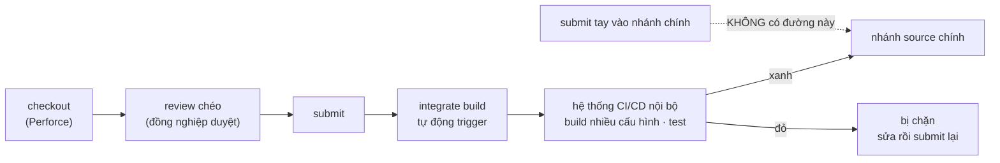

# Unit test, code quality & CI — ở mức hiểu cơ bản, bám việc thật

> **TL;DR**
> - Tài liệu này phục vụ một mục tiêu hẹp: **trả lời được ở mức hiểu cơ bản** các câu về CI/CD, unit test, code quality — **bám đúng việc bạn đang làm**, không học dàn trải.
> - **Việc thật của bạn** (§1): bạn là **người dùng pipeline**, không viết job. Luồng: checkout → review chéo trên Perforce → submit → integrate build → hệ thống CI/CD nội bộ → vào nhánh chính. Đó là **con đường duy nhất** — đúng mô hình *gated check-in* ([ci-and-test-farm §3](ci-and-test-farm.md)).
> - **Unit test** (§3): GoogleTest cho library, **KUnit** cho driver. Bạn đưa *scenario* cho AI, AI sinh unit test theo bộ khung có sẵn. Câu interviewer sẽ xoáy: *"vậy em kiểm chất lượng test đó thế nào?"*
> - **Coverage** (§4) cho biết dòng nào **chưa từng chạy**, không cho biết code **đúng**. Lab đo được 90% line coverage nhưng backend Global thật **chưa từng được test**.
> - **Code quality** (§5): mỗi công cụ bắt một **loại** lỗi khác nhau — `-Werror`, static analysis, sanitizer, unit test. Không công cụ nào thay được công cụ khác.
> - 🧪 **Lab** (§6): chạy được trên máy dev, đối tượng là chính `libdisplay_lab` ở [A1 §11](../11-design-patterns/in-practice/A1-baseline-libdisplay.md). Pipeline 5 cổng; cổng TSan **đỏ thật** vì race vòng vsync — đúng điểm yếu #5 của hệ.
> - ⚠️ **§7 — nói thế nào mà không nói quá:** tách rạch ròi *"đã làm ở công ty"* · *"đã thử ở lab"* · *"hiểu nhưng chưa làm"*.

---

## 1. Pipeline của bạn — nhìn từ phía người dùng



| Bước | Bảo vệ cái gì | Vai của bạn |
|---|---|---|
| Review chéo | Lỗi logic, thiết kế, style — thứ máy không bắt được | Người viết + người review chéo |
| Integrate build | Thay đổi **compile được** trên mọi cấu hình, không chỉ máy mình | Người dùng: đọc log khi đỏ |
| CI/CD nội bộ | Test tự động; một thay đổi chạy trên **rất nhiều model** ⟹ nhiều cấu hình | Người dùng |
| Nhánh chính chỉ nhận qua pipeline | Không ai đẩy được code chưa kiểm vào nhánh mọi người dùng chung | — |

**Vì sao không có đường submit tay** (câu interviewer hay hỏi — [BLD-021](../14-prep/mock-interview/bank/build-systems.md)): nhánh chính là thứ **mọi người** build lên trên. Một thay đổi hỏng lọt vào là chặn cả team. *Gated check-in* biến *"đừng làm hỏng nhánh chính"* từ **kỷ luật** thành **cấu trúc** — cùng tư duy với mặt tiền C là điểm khoá duy nhất ở [A1 §3.3](../11-design-patterns/in-practice/A1-baseline-libdisplay.md).

**Vì sao vẫn phải test trên thiết bị thật** dù đã có unit test: một thay đổi ảnh hưởng **rất nhiều model**, mỗi model một tổ hợp chip + panel. Unit test chạy trên máy build chỉ kiểm logic; nó không thấy được phần cứng thật ([BLD-035](../14-prep/mock-interview/bank/build-systems.md), [ci-and-test-farm §1.4](ci-and-test-farm.md)).

---

## 2. Jenkins — đủ để đọc hiểu một pipeline

| Khái niệm | Là gì | Bạn thấy nó ở đâu |
|---|---|---|
| **Pipeline / job** | Chuỗi bước tự động chạy khi có thay đổi | Trang build, màu xanh/đỏ |
| **Jenkinsfile** | Pipeline viết thành code, nằm cùng repo | Ai cũng review được như code |
| **Stage** | Một nhóm bước có tên (Build, Test…) | Các cột trên giao diện |
| **Step** | Một lệnh cụ thể, thường là `sh '...'` | Console log |
| **Agent** | Máy chạy pipeline (có toolchain, có thể có board gắn kèm) | `agent { label 'linux-build' }` |
| **Trigger** | Cái gì khởi động pipeline — submit, theo giờ, bấm tay | Ở bạn: submit tự trigger integrate build |
| **Artifact** | File pipeline giữ lại: binary, log, báo cáo | Tải về khi cần debug |
| **Test report** | Kết quả test dạng JUnit XML, Jenkins vẽ biểu đồ qua từng build | Tab "Test Result" |

**Nguyên tắc quan trọng nhất — Jenkinsfile là vỏ mỏng:** logic build/test nằm trong **script trong repo** (ở lab là `run_ci.sh`); Jenkinsfile chỉ gọi script đó theo từng stage. Lợi ích: pipeline đỏ thì **chạy lại y hệt trên máy mình** để debug, không phải đoán môi trường Jenkins.

---

## 3. Unit test — GoogleTest cho library, KUnit cho driver

**Unit test là gì:** test **một đơn vị nhỏ** (một hàm, một class) **tách khỏi** phần còn lại, chạy nhanh, không cần phần cứng.

**Muốn tách khỏi phần cứng thì phải có chỗ để cắm thay** — đây là chỗ design pattern trả lợi ích thật: thuật toán dimming giữ con trỏ tới `IDimmingBackend` (Bridge), nên test thay backend thật bằng **fake** ([BLD-040](../14-prep/mock-interview/bank/build-systems.md)):

```cpp
struct FakeBackend : IDimmingBackend {                 // test double: ghi lại mọi lần "ghi phần cứng"
    std::vector<int32_t> writes;
    uint32_t t_Set2DFinalDuty(BackendGd2DFinalDuty_t* p) override { writes.push_back(p->value); return LIB_OK; }
};

TEST(GlobalDimming, VSyncRampsInStepsOf10) {
    GlobalDimmingForShm shm{};
    FakeBackend be;
    GlobalDimming algo(&be, shm);                       // cắm FAKE thay backend thật
    algo.SetBacklight(25);
    for (int i = 0; i < 5; ++i) algo.t_vSyncCallBack();
    EXPECT_EQ(be.writes, (std::vector<int32_t>{10, 20, 25}));   // tiến 10 mỗi khung, không vượt mục tiêu
}
```

| Loại test double | Làm gì | Ví dụ |
|---|---|---|
| **Stub** | Trả giá trị cố định, không ghi nhận gì | Backend luôn trả `LIB_OK` |
| **Fake** | Cài đặt đơn giản nhưng chạy được | `FakeBackend` ghi lại các giá trị vào `vector` |
| **Mock** | Kiểm **lời gọi**: gọi mấy lần, với đối số nào (gMock: `EXPECT_CALL`) | "phải gọi `t_Set2DFinalDuty` đúng 3 lần" |

**GoogleTest — ba thứ cần biết:** `TEST(Suite, Name)` · `EXPECT_*` (sai vẫn chạy tiếp) vs `ASSERT_*` (sai thì dừng test đó) · `TEST_F` cho fixture dùng chung setup.

**KUnit — unit test bên trong kernel** ([BLD-044](../14-prep/mock-interview/bank/build-systems.md)): test chạy **trong kernel** (built-in hoặc module), thường chạy bằng `tools/testing/kunit/kunit.py run` trên một kernel UML (User Mode Linux) — không cần board. Hình dạng *(minh hoạ, chưa chạy trên máy này)*:
```c
static void panel_core_rejects_short_table(struct kunit *test)
{
        struct panel_ops ops = { .size = sizeof(ops) - sizeof(void *) };
        KUNIT_EXPECT_EQ(test, panel_register_ops(&ops), -EINVAL);
}
static struct kunit_case panel_core_cases[] = {
        KUNIT_CASE(panel_core_rejects_short_table),
        {}
};
static struct kunit_suite panel_core_suite = { .name = "panel_core", .test_cases = panel_core_cases };
kunit_test_suite(panel_core_suite);
```
KUnit test được **logic** của driver (kiểm tham số, bảng ops, máy trạng thái), **không** test được phần cứng thật.

**Việc thật của bạn — AI sinh unit test từ scenario** ([BLD-043](../14-prep/mock-interview/bank/build-systems.md), nối [RES-016](../14-prep/mock-interview/bank/resume.md)): mỗi lần submit, bạn đưa scenario, AI viết test GoogleTest/KUnit theo bộ khung có sẵn. Ba điều phải kiểm khi review test do AI viết:
1. **Test kiểm hành vi hay chỉ chạy qua code?** Test không có `EXPECT` có ý nghĩa vẫn xanh — và vẫn tăng coverage.
2. **Cố ý làm hỏng code, test có đỏ không?** Đổi một dấu `>` thành `>=`; test vẫn xanh nghĩa là test không bảo vệ gì. Đây là ý tưởng của *mutation testing*.
3. **Scenario có phủ đường lỗi không?** AI viết theo scenario bạn đưa — scenario thiếu ca lỗi thì test thiếu ca lỗi.

---

## 4. Coverage — đo cái gì, KHÔNG đo cái gì

**Cơ chế:** build với `--coverage`, compiler chèn bộ đếm vào mỗi dòng/nhánh; chạy test xong, `gcov`/`gcovr` đọc bộ đếm ra báo cáo.

| Loại | Đếm |
|---|---|
| Line | Dòng nào đã chạy ít nhất một lần |
| Branch | Mỗi nhánh `if`/`switch` đã đi qua chưa |
| Function | Hàm nào đã được gọi |

**Output thật** — lab ở §6, sau khi chạy unit test + integration test (rút gọn, giữ dòng đáng đọc):
```
File                                       Lines     Exec  Cover   Missing
------------------------------------------------------------------------------
kernel_sim/drv_panel_chipA.c                   4        4   100%
kernel_sim/drv_panel_core.c                   15       13    86%   25-26
src/dimming/DimmingBackendChipA.cpp            5        3    60%   4-5
src/dimming/DimmingFactory.cpp                19       13    68%   11-12,21-24
src/dimming/GlobalDimming.cpp                 18       18   100%
src/lib_api.cpp                               20       20   100%
src/lib_base.cpp                              46       45    97%   52
------------------------------------------------------------------------------
TOTAL                                        150      136    90%
```

**Đọc ra điều quan trọng** ([BLD-041](../14-prep/mock-interview/bank/build-systems.md)): tổng 90% nghe tốt, nhưng `DimmingBackendChipA.cpp` dòng 4–5 — **backend Global thật** — **chưa từng chạy**. Unit test dùng `FakeBackend`, còn integration test chạy model `local`. Đường thật *thuật toán Global → backend ChipA → Panel Control* chưa có test nào đi qua.

⟹ Coverage **chỉ ra chỗ chưa test**; nó **không** nói chỗ đã test là đúng. 100% coverage với test không có `EXPECT` vẫn là 100%.

*(Ở công ty bạn không đo coverage — nói thẳng như vậy, rồi nói được nó đo gì là đủ ở mức cơ bản.)*

---

## 5. Code quality — mỗi công cụ bắt một loại lỗi

| Công cụ | Bắt loại lỗi | Khi nào chạy | Lab |
|---|---|---|---|
| **Review chéo** | Logic, thiết kế, đặt tên — thứ máy không hiểu | Trước submit | — |
| **`-Wall -Wextra -Werror`** | Code đáng ngờ compiler nhìn thấy: biến không dùng, so sánh có dấu/không dấu, truy cập ngoài mảng **khi biết được lúc compile** | Mỗi lần build | ✅ |
| **Static analysis** (clang-tidy, cppcheck, `gcc -fanalyzer`; kernel: `checkpatch.pl`, `sparse`) | Mẫu lỗi qua phân tích luồng: rò rỉ, dereference `NULL`, vi phạm style | Trong pipeline | `-fanalyzer` ✅ · clang-tidy/cppcheck ⚠️ chưa cài |
| **ASan / UBSan** | Lỗi bộ nhớ và UB **lúc chạy**: tràn mảng, use-after-free, tràn số có dấu | Chạy test trong build sanitizer | ✅ |
| **TSan** | **Data race** giữa các thread | Chạy test/app trong build TSan | ✅ |
| **Unit test** | Hành vi sai so với mong đợi | Mỗi lần build | ✅ |

**Coding standard:** ở chỗ bạn không có bộ quy tắc riêng — library theo **Modern C++**, driver theo **Linux kernel coding style**. Ở mức cơ bản, nói được: kernel style có công cụ kiểm tự động là `scripts/checkpatch.pl`; C++ thường dùng `clang-format` để thống nhất định dạng và `clang-tidy` để kiểm mẫu lỗi.

**Một chi tiết đo thật đáng nhớ:** cảnh báo tràn mảng `-Warray-bounds` của gcc **chỉ bật lên khi có tối ưu**. Cùng một file có lỗi đọc `zones[4]` trên mảng 4 phần tử, gcc 11.4:
```
-O0: 0 canh bao
-O2: warning: array subscript 4 is above array bounds of 'int32_t [4]' {aka 'int [4]'} [-Warray-bounds]
```
⟹ Cổng `-Werror` nên chạy trên build **Release** (có tối ưu), không chỉ Debug.

---

## 6. 🧪 Lab — một pipeline 5 cổng trên `libdisplay_lab`

**Đối tượng:** mã nguồn ở [A1 §11](../11-design-patterns/in-practice/A1-baseline-libdisplay.md). Thêm hai file `run_ci.sh` và `Jenkinsfile` (cuối mục này) vào thư mục gốc của lab, `chmod +x run_ci.sh`.

**Yêu cầu:** `cmake` ≥ 3.21 (cho `ctest --output-junit`), `g++`, mạng lần đầu (tải GoogleTest), `gcovr` (`pip3 install --user gcovr`, không cần root; nếu `gcovr` không nằm trong `PATH` thì chạy `GCOVR=~/.local/bin/gcovr ./run_ci.sh`). ⚠️ `clang-tidy`/`cppcheck` cần `sudo apt install` nên lab không dùng; `gcc -fanalyzer` thay vai trò phân tích tĩnh.

**Bước 1 — chạy cả pipeline.** Output thật (máy dev, ~29 giây):
```
$ ./run_ci.sh
...
========== KET QUA ==========
PASS  build (Release, -Werror)
PASS  unit + integration test
PASS  coverage (bao cao)
PASS  ASan + UBSan
FAIL  TSan
$ echo $?
1
```
Cổng TSan **đỏ thật**:
```
SUMMARY: ThreadSanitizer: data race src/dimming/GlobalDimming.cpp:13 in GlobalDimming::t_vSyncCallBack()
```
Đây chính là điểm yếu #5 của hệ ([A1 §5.8](../11-design-patterns/in-practice/A1-baseline-libdisplay.md), [DP-049](../14-prep/mock-interview/bank/design-patterns.md)): thread vsync đọc state không qua khoá. **Một pipeline có cổng TSan sẽ chặn đúng lớp bug này trước khi nó vào nhánh chính** — câu trả lời mạnh cho *"CI giúp được gì cho hệ của em?"*.

**Bước 2 — mutation: cố ý cài lỗi, xem cổng nào bắt.** Trong `src/dimming/DimmingBackendChipA.cpp`, đổi `p->zones[3]` thành `p->zones[4]` (đọc quá cuối mảng). Output thật:

| Cổng | Kết quả |
|---|---|
| Build Debug (`-O0`) | ❌ **im lặng**; chạy model `local` ra `backlight=60`, exit 0 |
| Build Release (`-O2`) + `-Werror` | ✅ `warning: array subscript 4 is above array bounds of 'int32_t [4]'` ⟹ build fail |
| ASan + UBSan | ✅ bắt lúc chạy — output bên dưới |

```
==9482==ERROR: AddressSanitizer: stack-buffer-overflow on address 0x7ffd05e12500 at pc 0x7a2ef539a861 bp 0x7ffd05e12460 sp 0x7ffd05e12450
    #0 0x7a2ef539a860 in DimmingBackendChipA_Local::t_SetLdFinalDuty(BackendLdFinalDuty_t*) src/dimming/DimmingBackendChipA.cpp:8
    #1 0x7a2ef539a2e0 in LocalDimming::SetBacklight(int) src/dimming/LocalDimming.cpp:9
    #2 0x7a2ef5386f4b in lib_dimming::SetBacklight(int) src/dimming/lib_dimming.h:14
SUMMARY: AddressSanitizer: stack-buffer-overflow src/dimming/DimmingBackendChipA.cpp:8 in DimmingBackendChipA_Local::t_SetLdFinalDuty(BackendLdFinalDuty_t*)
```
⟹ **Nhiều cổng chồng lên nhau** vì mỗi cổng có điểm mù riêng.

**Bước 3 — tự làm:**
1. Viết thêm một test để dòng 4–5 của `DimmingBackendChipA.cpp` được chạy; đo lại coverage.
2. Viết một test **không có `EXPECT`** cho `LocalDimming` — xem coverage tăng mà test không bảo vệ gì.
3. Sửa race vsync theo [B1 §6.1](../11-design-patterns/in-practice/B1-redesign-architecture.md) (khoá đi cùng state), chạy lại `./run_ci.sh tsan` cho tới khi xanh.

> ⚠️ **Trung thực về lab:** `Jenkinsfile` **chưa được chạy trên Jenkins** (máy dev không có Jenkins/Java). Mỗi stage của nó chỉ gọi `./run_ci.sh <stage>`, và **script đó đã chạy thật**; output ở trên là của script.

<details><summary><b>📄 <code>run_ci.sh</code> — nơi duy nhất chứa logic CI</b></summary>

```bash
#!/usr/bin/env bash
# run_ci.sh — NOI DUY NHAT chua logic CI. Jenkinsfile chi goi lai script nay.
#   ./run_ci.sh            chay ca 5 stage (fail van chay tiep, cuoi cung tong ket)
#   ./run_ci.sh <stage>    chi chay mot stage: build | test | coverage | asan | tsan
set -u
export LIBDISPLAY_SHM=/libdisplay_ci_$$          # shm rieng cho lan chay nay
GCOVR=${GCOVR:-gcovr}
declare -a RESULT=()
stage() {                                        # stage <ten> <lenh...>
    local name=$1; shift
    echo "========== STAGE: $name =========="
    if "$@"; then RESULT+=("PASS  $name"); else RESULT+=("FAIL  $name"); fi
}
build_release() {   # cong 1: build Release, canh bao = loi (-O2 moi bat -Warray-bounds)
    cmake -S . -B ci/release -DCMAKE_BUILD_TYPE=Release -DLIBDISPLAY_TESTS=ON \
          -DCMAKE_CXX_FLAGS=-Werror -DCMAKE_C_FLAGS=-Werror > /dev/null &&
    cmake --build ci/release -j"$(nproc)" 2>&1 | grep -E "warning|error|Built target display$"
    test "${PIPESTATUS[0]}" -eq 0
}
unit_test() {       # cong 2: unit test + integration test, xuat JUnit XML cho Jenkins doc
    (cd ci/release && ctest --output-junit junit.xml 2>&1 | tail -3)
    grep -q 'failures="0"' ci/release/junit.xml
}
coverage() {        # bao cao, KHONG chan: coverage la thong tin, khong phai nguong cung
    cmake -S . -B ci/cov -DLIBDISPLAY_COVERAGE=ON > /dev/null &&
    cmake --build ci/cov -j"$(nproc)" > /dev/null &&
    (cd ci/cov && ctest > /dev/null) &&
    "$GCOVR" --root . --filter 'src/' --filter 'kernel_sim/' ci/cov 2>/dev/null | grep -E "TOTAL"
}
asan_ubsan() {      # cong 3: loi bo nho / UB luc chay
    local f="-fsanitize=address,undefined -fno-omit-frame-pointer -fno-sanitize-recover=all -g"
    cmake -S . -B ci/asan -DLIBDISPLAY_TESTS=ON -DCMAKE_CXX_FLAGS="$f" -DCMAKE_C_FLAGS="$f" \
          -DCMAKE_EXE_LINKER_FLAGS="-fsanitize=address,undefined" \
          -DCMAKE_SHARED_LINKER_FLAGS="-fsanitize=address,undefined" > /dev/null &&
    cmake --build ci/asan -j"$(nproc)" > /dev/null &&
    (cd ci/asan && ctest 2>&1 | tail -1)
    (cd ci/asan && ctest > /dev/null 2>&1)
}
tsan() {            # cong 4: data race — chay app that de vong vsync va API cung chay
    cmake -S . -B ci/tsan -DLIBDISPLAY_TSAN=ON -DLIBDISPLAY_TESTS=OFF > /dev/null &&
    cmake --build ci/tsan -j"$(nproc)" > /dev/null &&
    TSAN_OPTIONS="halt_on_error=1" setarch -R ci/tsan/bin/display_demo > ci/tsan.log 2>&1
    local rc=$?
    grep -E "SUMMARY: ThreadSanitizer" ci/tsan.log | head -1
    return $rc
}
case "${1:-all}" in
    build)    stage "build (Release, -Werror)" build_release ;;
    test)     stage "unit + integration test"  unit_test ;;
    coverage) stage "coverage (bao cao)"       coverage ;;
    asan)     stage "ASan + UBSan"             asan_ubsan ;;
    tsan)     stage "TSan"                     tsan ;;
    all)      stage "build (Release, -Werror)" build_release
              stage "unit + integration test"  unit_test
              stage "coverage (bao cao)"       coverage
              stage "ASan + UBSan"             asan_ubsan
              stage "TSan"                     tsan ;;
    *)        echo "stage khong hop le: $1"; exit 2 ;;
esac
rm -f "/dev/shm${LIBDISPLAY_SHM}" "/dev/shm/sem.${LIBDISPLAY_SHM#/}_sem"
echo "========== KET QUA =========="
printf '%s\n' "${RESULT[@]}"
printf '%s\n' "${RESULT[@]}" | grep -q '^FAIL' && exit 1 || exit 0
```
</details>

<details><summary><b>📄 <code>Jenkinsfile</code> — vỏ mỏng, mỗi stage gọi lại <code>run_ci.sh</code></b></summary>

```groovy
// Jenkinsfile — VO MONG: moi stage chi goi ./run_ci.sh <stage>.
// Logic nam o MOT cho (run_ci.sh) => chay lai y het tren may dev khi pipeline do.
pipeline {
    agent { label 'linux-build' }                 // may build co cmake, g++, gcovr
    options { timeout(time: 30, unit: 'MINUTES') }
    stages {
        stage('Build (Release, -Werror)') { steps { sh './run_ci.sh build' } }
        stage('Unit + integration test') {
            steps { sh './run_ci.sh test' }
            post  { always { junit 'ci/release/junit.xml' } }   // Jenkins ve bieu do pass/fail theo build
        }
        stage('Coverage') {
            steps { sh './run_ci.sh coverage' }                  // bao cao, khong chan merge
        }
        stage('Sanitizers') {
            parallel {                                          // hai bien the doc lap: chay song song
                stage('ASan + UBSan') { steps { sh './run_ci.sh asan' } }
                stage('TSan')         { steps { sh './run_ci.sh tsan' } }
            }
        }
    }
    post {
        failure { echo 'Pipeline DO: thay doi nay KHONG duoc integrate vao nhanh chinh' }
    }
}
```
</details>

---

## 7. 🗣️ Nói thế nào ở phỏng vấn — mức cơ bản, không nói quá

> ⚠️ **Bài học #8** ([datalogic-plan](../14-prep/study-plans/archive/datalogic-plan.md)): gộp *"dựng được môi trường"* với *"làm được việc"* là thứ interviewer không phân biệt được với nói quá. Ở mảng CI càng dễ phạm, vì thuật ngữ nghe quen tai.

| Nhóm | Câu nói được |
|---|---|
| ✅ **Đã làm ở công ty** | *"Em là người dùng pipeline: submit qua review chéo trên Perforce, pipeline tự build nhiều cấu hình và test, chỉ khi xanh mới vào nhánh chính — không có đường submit tay."* · *"Unit test: GoogleTest ở library, KUnit ở driver. Mỗi submit em đưa scenario, AI sinh test theo bộ khung, em review lại."* |
| 🧪 **Đã thử ở lab** | *"Em tự dựng một pipeline nhỏ: build Release với `-Werror`, unit test, coverage, ASan/UBSan, TSan — cổng TSan bắt được đúng race mà em biết hệ thật đang có."* |
| 📖 **Hiểu, chưa làm** | *"Em chưa viết Jenkinsfile ở công ty và chưa đo coverage, nhưng em hiểu coverage chỉ ra chỗ chưa test chứ không chứng minh code đúng."* |

**Câu chốt khi bị hỏi *"CI giúp được gì?"*:** *"Biến những thứ dễ quên thành cổng không đi vòng được — giống cách mặt tiền C của library biến 'nhớ lấy khoá' thành cấu trúc."*

---

## Câu hỏi phỏng vấn liên quan

> Đáp án sống trong [bank/](../14-prep/mock-interview/bank/) — **một đáp án, một chỗ** ([CLAUDE.md §4.7](../CLAUDE.md)). Tự trả lời trước khi mở.

| ID | Câu hỏi |
|----|---------|
| [BLD-021](../14-prep/mock-interview/bank/build-systems.md) ⭐ | Mọi thay đổi phải qua pipeline mới vào được source chính — vì sao không có đường submit tay? |
| [BLD-031](../14-prep/mock-interview/bank/build-systems.md) | CI, Continuous Delivery, Continuous Deployment khác nhau thế nào? |
| [BLD-032](../14-prep/mock-interview/bank/build-systems.md) | Thuật ngữ pipeline: stage, job, runner, artifact, trigger, gate |
| [BLD-033](../14-prep/mock-interview/bank/build-systems.md) | Unit / integration / system test và smoke / regression / soak — quan hệ hai bộ khái niệm |
| [BLD-035](../14-prep/mock-interview/bank/build-systems.md) ⭐ | Vì sao vẫn phải test trên board thật? |
| [BLD-040](../14-prep/mock-interview/bank/build-systems.md) ⭐ | Unit test thuật toán dimming mà không có phần cứng — làm thế nào? Fake/mock/stub khác gì? |
| [BLD-041](../14-prep/mock-interview/bank/build-systems.md) ⭐ | Coverage 90% nghĩa là gì, không nghĩa là gì? |
| [BLD-042](../14-prep/mock-interview/bank/build-systems.md) ⭐ | `-Werror`, static analysis, sanitizer, unit test — mỗi cái bắt loại lỗi nào? |
| [BLD-043](../14-prep/mock-interview/bank/build-systems.md) ⭐ | AI sinh unit test từ scenario — bạn kiểm chất lượng test thế nào? |
| [BLD-044](../14-prep/mock-interview/bank/build-systems.md) | GoogleTest vs KUnit — mỗi cái test cái gì, chạy ở đâu? |

---
⬅️ [ci-and-test-farm.md](ci-and-test-farm.md) · Lab dùng mã nguồn ở [A1 §11](../11-design-patterns/in-practice/A1-baseline-libdisplay.md)
