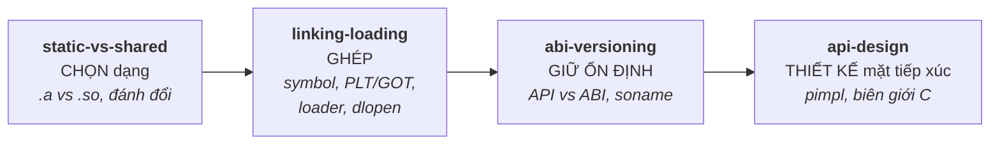

# 07 — Shared Libraries

Thư viện tĩnh vs động, cách linker/loader phân giải symbol, ABI và versioning, và thiết kế C++ API interface tốt. Đây là **mảng sát công việc System Software của bạn nhất** (viết C++ shared library + API cho lớp trên). Phỏng vấn hay đào sâu: ".a vs .so khác gì", "linking lúc build vs lúc chạy", "ABI break là gì", "thiết kế API ổn định thế nào".

## 🗺️ Bức tranh tổng thể

> **Sợi chỉ đỏ:** Đi theo **vòng đời của một thư viện** — từ quyết định đóng gói, tới cách hệ thống ghép nó vào, tới giữ nó ổn định theo thời gian, tới thiết kế mặt tiếp xúc tốt.

*(Vòng đời một thư viện: chọn dạng → ghép lúc build/runtime → giữ ABI ổn định → thiết kế API tốt.)*

- **Mạch logic tuyến tính:** chọn shared (`static-vs-shared`) → linker/loader phải ghép symbol lúc runtime (`linking-loading`) → cập nhật `.so` mà không phá binary cũ cần giữ ABI (`abi-versioning`) → muốn ABI ổn định phải thiết kế API đúng (`api-design`, pimpl, `extern "C"`).
- **Đây là topic SÁT CÔNG VIỆC của bạn nhất** (C++ shared library + API interface) — bốn file là bốn khía cạnh của cùng một nhiệm vụ.
- **Nối xuống nền tảng:** dựa trên bước link của [06](../06-build-systems/makefile.md), name mangling/vtable của [01](../01-cpp-fundamentals/oop.md); pimpl là Bridge pattern ([12](../12-design-patterns/structural.md)).
- **Câu hỏi tổng hợp:** *"Cập nhật thư viện làm app khách (không build lại) crash — vì sao và tránh thế nào?"* — nối `abi-versioning` + `api-design`.

## Tài liệu trong topic

| # | File | Nội dung | Trạng thái |
|---|------|----------|-----------|
| 1 | [static-vs-shared.md](static-vs-shared.md) | .a vs .so, ưu/nhược, khi nào dùng, kích thước/cập nhật/bộ nhớ | ✅ |
| 2 | [linking-loading.md](linking-loading.md) | static vs dynamic linking, symbol resolution, PLT/GOT, dynamic loader, dlopen | ✅ |
| 3 | [abi-versioning.md](abi-versioning.md) | API vs ABI, ABI break, soname, symbol versioning, giữ tương thích | ✅ |
| 4 | [api-design.md](api-design.md) | thiết kế interface, pimpl, C ABI boundary, error handling, ownership | ✅ |

## Thứ tự đọc gợi ý
`static-vs-shared` → `linking-loading` → `abi-versioning` → `api-design`.

## Liên kết
- Nền tảng build: [06-build-systems/](../06-build-systems/)
- Bộ nhớ & vtable: [01-cpp-fundamentals/](../01-cpp-fundamentals/)
- Câu hỏi phỏng vấn: [11-interview-questions/cpp.md](../11-interview-questions/cpp.md)
