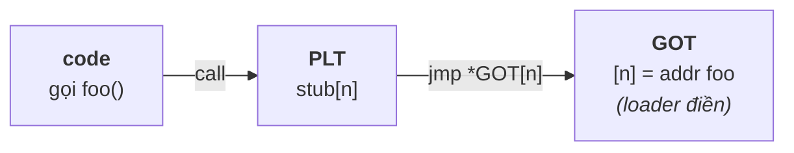

# Linking & Loading — Symbol Resolution, PLT/GOT, Loader

> **TL;DR**
> - **Linking** = phân giải symbol (khớp tham chiếu với định nghĩa) và sắp xếp các section. **Static linking** làm lúc build; **dynamic linking** hoàn tất lúc load/runtime.
> - **Symbol**: tên hàm/biến toàn cục. Linker khớp "undefined" (tham chiếu) với "defined" (định nghĩa). Thiếu → `undefined reference`.
> - **Dynamic loader** (`ld-linux.so`) nạp các `.so` cần thiết khi chương trình khởi động, **relocate** và phân giải symbol qua **GOT/PLT** (thường **lazy** — giải quyết khi gọi lần đầu).
> - **`dlopen`/`dlsym`**: nạp thư viện **theo yêu cầu lúc runtime** (plugin) — không cần biết lúc build.
> - C++ **name mangling**: tên hàm bị mã hóa (gồm kiểu tham số) → đó là lý do `extern "C"` cần cho biên giới C.

---

## 1. Static linking — phân giải lúc build

Linker (`ld`) nhận các object file (`.o`) + static lib (`.a`), thực hiện:
1. **Symbol resolution**: mỗi tham chiếu (vd gọi `foo`) được khớp với đúng một định nghĩa. Undefined → lỗi; trùng → multiple definition.
2. **Relocation**: gán địa chỉ thật cho code/data, sửa các tham chiếu theo địa chỉ cuối.
3. Gộp các section (`.text`, `.data`, `.bss`...) thành executable.

Với `.a`, linker chỉ kéo vào những object **thực sự cần** (object nào không có symbol được dùng thì bỏ qua) → thứ tự `-l` trên dòng lệnh có thể quan trọng.

---

## 2. Dynamic linking — hoàn tất lúc load/runtime

Với `.so`, lúc build linker **không** copy code vào; nó chỉ:
- Ghi lại danh sách thư viện cần (`NEEDED` entries trong ELF).
- Để các tham chiếu tới symbol của `.so` ở dạng "sẽ giải quyết sau".

Lúc chạy, **dynamic loader** (`/lib/ld-linux.so.*`, được kernel gọi đầu tiên) sẽ:
1. Đọc danh sách `.so` cần thiết, tìm và **map** chúng vào bộ nhớ (theo `RPATH/RUNPATH` → `LD_LIBRARY_PATH` → `ld.so.cache` → đường mặc định).
2. **Relocate** & **phân giải symbol** giữa executable và các `.so`.
3. Chạy code khởi tạo của thư viện (constructor), rồi mới vào `main`.

```sh
ldd ./app          # xem các .so phụ thuộc & nơi tìm thấy
readelf -d ./app   # xem NEEDED, RPATH/RUNPATH, soname
LD_DEBUG=libs ./app  # debug quá trình loader tìm/nạp thư viện
```

---

## 3. PLT & GOT — cơ chế gọi hàm động (hay được hỏi)

Vì `.so` nạp ở địa chỉ không cố định (PIC + ASLR), lời gọi hàm/biến trong thư viện đi qua hai bảng:

- **GOT** (Global Offset Table): bảng **dữ liệu** chứa địa chỉ thật của symbol toàn cục, được loader điền lúc relocate. Code truy cập biến/hàm global gián tiếp qua GOT thay vì địa chỉ tuyệt đối.
- **PLT** (Procedure Linkage Table): bảng **stub code** cho lời gọi hàm. Cho phép **lazy binding**.

**Lazy binding** (mặc định): địa chỉ hàm chỉ được phân giải **lần đầu nó được gọi**:
```
gọi foo() lần 1 → PLT stub → loader phân giải địa chỉ foo → ghi vào GOT → gọi
gọi foo() lần 2 → PLT stub → đọc địa chỉ đã có trong GOT → gọi thẳng (nhanh)
```
→ Khởi động nhanh (không phân giải mọi symbol ngay). Đặt `LD_BIND_NOW=1` để phân giải hết lúc load (an toàn/tất định hơn, vd cho realtime — tránh trễ lần gọi đầu).



---

## 4. C++ name mangling & `extern "C"`

C++ hỗ trợ overload → trình biên dịch **mã hóa (mangle)** tên hàm kèm thông tin kiểu tham số/namespace vào symbol:
```
void foo(int)      →  _Z3fooi
void foo(double)   →  _Z3food      (tên symbol khác nhau → overload phân biệt được)
```
- Tên mangled **không chuẩn hóa giữa compiler** (một phần lý do C++ ABI không tương thích chéo compiler).
- `extern "C"` tắt mangling → symbol giữ tên gốc (`foo`), cho phép C gọi được và tạo **ABI ổn định** ở biên giới thư viện. (Xem [api-design.md](api-design.md).)
- Xem symbol: `nm -C lib.so` (`-C` để demangle về tên đọc được).

---

## 5. dlopen — nạp thư viện lúc runtime (plugin)

Thay vì khai báo phụ thuộc lúc build, có thể nạp `.so` **theo yêu cầu**:

```c
#include <dlfcn.h>
void* h = dlopen("libplugin.so", RTLD_LAZY);     // nạp lúc chạy
auto fn = (int(*)(int)) dlsym(h, "process");      // lấy con trỏ hàm theo tên symbol
int r = fn(42);
dlclose(h);
```

- Dùng cho **plugin architecture**: chương trình chính khám phá & nạp module lúc chạy mà không biết trước lúc build.
- Với C++, hàm export nên `extern "C"` (tránh phải biết tên mangled khi `dlsym`); thường export một factory trả về con trỏ tới interface (abstract class).
- `RTLD_LAZY` (phân giải khi cần) vs `RTLD_NOW` (phân giải ngay khi dlopen).

---

## 6. Vấn đề thứ tự & xung đột symbol

- **Thứ tự link** (`-l`): linker xử lý trái→phải, một lib chỉ thỏa các undefined symbol **đã xuất hiện trước nó** → đặt thư viện phụ thuộc *sau* cái dùng nó.
- **Symbol interposition**: symbol global trùng tên giữa các `.so`/executable — cái xuất hiện trước trong thứ tự tìm kiếm "thắng" (cơ chế của `LD_PRELOAD`). Có thể gây bug khó hiểu; kiểm soát bằng `-fvisibility=hidden` + export có chọn lọc (xem api-design).

---

## Câu hỏi phỏng vấn liên quan

<details><summary>1) Phân biệt linking và loading. Static linking khác dynamic linking ở đâu?</summary>

Linking là quá trình phân giải symbol (khớp tham chiếu với định nghĩa) và relocate (gán/điều chỉnh địa chỉ) để tạo ra ảnh chương trình chạy được. Loading là quá trình đưa chương trình (và các thư viện nó cần) vào bộ nhớ để thực thi. Static linking thực hiện toàn bộ phân giải/relocate lúc **build**, copy code thư viện vào executable. Dynamic linking chỉ ghi nhận thư viện cần lúc build; việc nạp `.so`, relocate và phân giải symbol giữa executable với thư viện được **dynamic loader** hoàn tất lúc load/runtime. Vì vậy với dynamic, một số lỗi (thiếu symbol, thiếu `.so`) chỉ lộ ra khi chạy.
</details>

<details><summary>2) Symbol là gì? Khi nào gặp undefined reference vs multiple definition?</summary>

Symbol là tên đại diện cho một hàm hoặc biến toàn cục trong object file/thư viện, có thể ở trạng thái "defined" (có định nghĩa) hoặc "undefined" (chỉ là tham chiếu). Linker khớp mỗi undefined symbol với đúng một defined symbol. `undefined reference` xảy ra khi không tìm thấy định nghĩa nào cho một symbol được dùng (quên link thư viện, sai thứ tự `-l`, thiếu `extern "C"`...). `multiple definition` xảy ra khi cùng một symbol có nhiều định nghĩa (vi phạm ODR, vd định nghĩa hàm non-inline trong header bị include nhiều nơi). Cả hai đều là lỗi ở bước link.
</details>

<details><summary>3) Dynamic loader làm gì khi chương trình khởi động?</summary>

Kernel nạp executable và trao quyền cho dynamic loader (`ld-linux.so`) trước khi vào `main`. Loader: (1) đọc danh sách thư viện cần thiết (`NEEDED` trong ELF); (2) tìm và map từng `.so` vào bộ nhớ theo thứ tự RPATH/RUNPATH → `LD_LIBRARY_PATH` → `ld.so.cache` → đường mặc định; (3) thực hiện relocation và phân giải symbol giữa executable và các thư viện (thường lazy qua PLT/GOT); (4) chạy code khởi tạo của các thư viện (constructor). Sau đó mới chuyển điều khiển vào chương trình. `ldd` cho thấy các phụ thuộc, `LD_DEBUG=libs` cho thấy quá trình tìm/nạp.
</details>

<details><summary>4) PLT và GOT là gì? Lazy binding hoạt động thế nào?</summary>

GOT (Global Offset Table) là bảng dữ liệu chứa địa chỉ thật của các symbol toàn cục, do loader điền lúc relocate; code truy cập hàm/biến ngoài gián tiếp qua GOT nên không phụ thuộc địa chỉ nạp cố định (cần cho PIC/ASLR). PLT (Procedure Linkage Table) là bảng các stub code cho lời gọi hàm, cho phép lazy binding. Lazy binding: lần đầu gọi một hàm thư viện, PLT stub gọi loader để phân giải địa chỉ hàm, ghi vào GOT, rồi nhảy tới hàm; các lần gọi sau đọc thẳng địa chỉ đã lưu trong GOT nên nhanh. Lợi ích là khởi động nhanh vì không phân giải mọi symbol ngay; có thể tắt bằng `LD_BIND_NOW=1` để phân giải hết lúc load (tốt cho tính tất định/realtime).
</details>

<details><summary>5) C++ name mangling là gì? extern "C" để làm gì?</summary>

Name mangling là việc trình biên dịch C++ mã hóa thông tin kiểu tham số, namespace, class vào tên symbol của hàm — cần thiết vì C++ cho phép overload (nhiều hàm cùng tên khác tham số), nên mỗi phiên bản phải có symbol riêng. Nhược điểm: tên mangled không chuẩn hóa giữa các compiler và khó dùng trực tiếp (vd `dlsym`). `extern "C"` yêu cầu trình biên dịch **không mangle** một hàm, giữ tên symbol gốc theo quy ước C — nhờ đó hàm gọi được từ C, tra cứu được bằng `dlsym` đơn giản, và quan trọng là tạo một ABI ổn định, không phụ thuộc compiler ở biên giới thư viện. Đó là lý do API công khai của shared library thường bọc bằng `extern "C"`.
</details>

<details><summary>6) dlopen/dlsym dùng để làm gì? Khác liên kết động thông thường ra sao?</summary>

`dlopen` nạp một shared library vào tiến trình **theo yêu cầu lúc runtime**, `dlsym` lấy địa chỉ một symbol (hàm/biến) theo tên từ thư viện đó, `dlclose` gỡ. Khác với liên kết động thông thường (thư viện được khai báo phụ thuộc lúc build và loader nạp tự động lúc khởi động), dlopen cho phép chương trình chính nạp module mà nó **không biết lúc build** — nền tảng của kiến trúc plugin: phát hiện và nạp module lúc chạy, gọi qua con trỏ hàm. Với C++ thường export hàm `extern "C"` (vd một factory trả về con trỏ tới abstract interface) để tránh phụ thuộc tên mangled khi `dlsym`.
</details>

---
⬅️ [static-vs-shared.md](static-vs-shared.md) · ➡️ Tiếp theo: [abi-versioning.md](abi-versioning.md)
