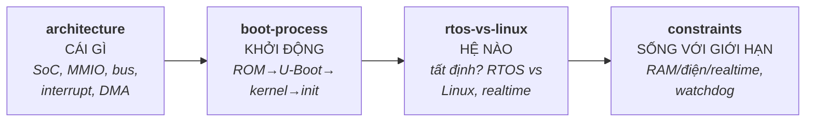

# 08 — Embedded Systems

Đặc thù của hệ thống nhúng: kiến trúc phần cứng (SoC, bus, memory-mapped I/O), quá trình boot từ nguồn tới userspace, lựa chọn RTOS vs Linux, và các ràng buộc đặc trưng (bộ nhớ, năng lượng, realtime). Phỏng vấn embedded hay hỏi: "memory-mapped I/O là gì", "quá trình boot diễn ra thế nào", "khi nào dùng RTOS thay vì Linux", "tối ưu cho hệ hạn chế tài nguyên".

## 🗺️ Bức tranh tổng thể

> **Sợi chỉ đỏ:** Embedded = **lập trình dưới ràng buộc phần cứng**. Bốn file trả lời lần lượt: phần cứng là *gì* → *khởi động* thế nào → chọn *hệ điều hành* nào → *sống* với giới hạn ra sao.

- **`architecture` là nền vật lý:** có/không MMU quyết định chạy được Linux hay không (`rtos-vs-linux`); MMIO/interrupt/DMA là cách driver ([05](../05-drivers-device-tree/)) chạm phần cứng.
- **`constraints` thấm vào mọi quyết định:** RAM ít → tránh heap; cần realtime → RTOS hoặc PREEMPT_RT; không người can thiệp → watchdog + A/B partition (`boot-process`).
- **Nối xuống OS:** `rtos-vs-linux` áp dụng `scheduling`/realtime của [03](../03-operating-system/scheduling.md); ràng buộc bộ nhớ liên hệ [03/memory-management](../03-operating-system/memory-management.md).
- **Câu hỏi tổng hợp:** *"Thiết kế thiết bị đo sensor chạy pin, không người giám sát"* — nối `architecture` (đọc sensor) + `constraints` (điện, watchdog) + `boot-process` (cập nhật an toàn).

## Tài liệu trong topic

| # | File | Nội dung | Trạng thái |
|---|------|----------|-----------|
| 1 | [architecture.md](architecture.md) | SoC, MCU vs MPU, bus (I2C/SPI/UART), memory-mapped I/O, register, DMA, interrupt | ✅ |
| 2 | [boot-process.md](boot-process.md) | power-on → ROM → bootloader (U-Boot) → kernel → init/userspace; flash, rootfs | ✅ |
| 3 | [rtos-vs-linux.md](rtos-vs-linux.md) | RTOS vs Linux, hard/soft realtime, determinism, khi nào chọn cái nào | ✅ |
| 4 | [constraints.md](constraints.md) | ràng buộc bộ nhớ/năng lượng/realtime, tối ưu, watchdog, no-heap, kỹ thuật thực tế | ✅ |

## Thứ tự đọc gợi ý
`architecture` → `boot-process` → `rtos-vs-linux` → `constraints`.

## Liên kết
- Nền tảng OS: [03-operating-system/](../03-operating-system/) · Driver: [05-drivers-device-tree/](../05-drivers-device-tree/)
- Câu hỏi phỏng vấn: [11-interview-questions/drivers.md](../11-interview-questions/drivers.md)
