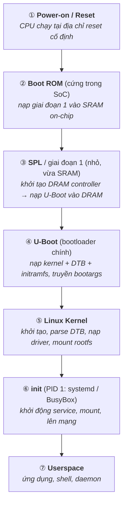

# Boot Process — Từ nguồn điện tới userspace

> **TL;DR**
> - Chuỗi boot điển hình của embedded Linux: **Power-on → Boot ROM (trong SoC) → bootloader giai đoạn 1 (SPL) → bootloader chính (U-Boot) → Linux kernel → init (systemd/BusyBox) → userspace**.
> - Mỗi giai đoạn **khởi tạo đủ phần cứng** để nạp & trao quyền cho giai đoạn sau (khái niệm *bootstrapping*).
> - **Boot ROM** (mã cứng trong SoC) chạy đầu tiên, nạp bootloader từ thiết bị boot (eMMC/SD/NAND/SPI flash).
> - **U-Boot** nạp **kernel + device tree (DTB) + initramfs** vào RAM rồi nhảy vào kernel.
> - **Kernel** khởi tạo, mount **rootfs**, chạy tiến trình **init** (PID 1) — gốc của mọi userspace.

---

## 1. Vì sao boot phải nhiều giai đoạn?

Lúc bật nguồn, gần như chưa có gì được khởi tạo: RAM ngoài chưa cấu hình, clock chưa set, storage chưa truy cập được. Không thể nạp ngay một OS lớn. Nên boot diễn ra theo kiểu **bootstrapping**: một mẩu code nhỏ (đã có sẵn/dễ truy cập) khởi tạo đủ để nạp mẩu lớn hơn, mẩu đó lại khởi tạo thêm để nạp kernel... cho tới khi hệ thống đầy đủ chạy.

---

## 2. Chuỗi boot điển hình (ARM embedded Linux)

*(Mỗi giai đoạn khởi tạo đủ phần cứng để nạp & trao quyền cho giai đoạn sau — bootstrapping.)*

---

## 3. Vai trò từng giai đoạn

- **Boot ROM**: cố định trong silicon (mask ROM), không thể sửa. Quyết định **boot từ đâu** (eMMC/SD/NAND/SPI/UART/USB) dựa trên chân cấu hình (boot strap pins) hoặc eFuse. Là gốc của **secure boot** (chứa khóa/chuỗi tin cậy).
- **SPL (giai đoạn 1)**: rất nhỏ để vừa SRAM on-chip (vì DRAM chưa khởi tạo). Việc quan trọng nhất: **cấu hình DRAM controller** để có RAM ngoài, rồi nạp U-Boot vào đó.
- **U-Boot**: bootloader "mạnh", có shell, biến môi trường, lệnh (`bootm`, `tftp`, `mmc read`...). Nạp kernel/DTB/initramfs, dựng **bootargs** (vd `console=`, `root=`), rồi bàn giao cho kernel. Có thể boot qua mạng (TFTP/NFS) cho phát triển.
- **Kernel**: tự giải nén, khởi tạo lõi (memory, scheduler), parse **DTB** để biết phần cứng, nạp driver, rồi mount **rootfs** (chỉ định bởi `root=`) và exec `/sbin/init`.
- **init (PID 1)**: tiến trình userspace đầu tiên, cha của mọi tiến trình; khởi động service theo cấu hình. Trên embedded nhỏ thường là **BusyBox init**; hệ lớn dùng **systemd**.

---

## 4. initramfs / initrd

**initramfs** là một filesystem nhỏ nạp sẵn vào RAM cùng kernel, dùng làm rootfs *tạm thời* khi:
- rootfs thật nằm trên thiết bị cần **driver/module** mới mount được (vd cần driver mạng cho NFS root, hay giải mã/RAID).
- Cần chạy logic chuẩn bị (tìm thiết bị, mở khóa) trước khi chuyển sang rootfs thật (`switch_root`/`pivot_root`).

Hệ embedded đơn giản có thể bỏ qua initramfs và mount thẳng rootfs từ flash.

---

## 5. Root filesystem & lưu trữ

- **rootfs** chứa toàn bộ userspace: `/bin`, `/lib`, `/etc`, ứng dụng... Có thể nằm trên eMMC/SD (ext4), NAND/NOR flash (UBIFS/JFFS2 — filesystem chịu được đặc tính flash), hoặc qua mạng (NFS, cho dev), hoặc squashfs (nén, read-only) cho firmware.
- **Flash lưu ý**: NAND có bad block & wear → cần filesystem/FTL phù hợp; ghi nhiều làm mòn (wear leveling). Nhiều thiết bị dùng rootfs read-only + phân vùng data riêng để bảo vệ.
- **Phân vùng điển hình**: bootloader | env | kernel/DTB | rootfs | data — thường có **A/B partition** để cập nhật firmware an toàn (rollback nếu bản mới hỏng).

---

## 6. Các khái niệm liên quan (điểm danh)

- **Secure boot / chain of trust**: mỗi giai đoạn xác thực chữ ký giai đoạn sau (Boot ROM → SPL → U-Boot → kernel) → chỉ chạy firmware tin cậy.
- **Watchdog**: nếu hệ treo trong khi boot/chạy, watchdog timer reset lại (xem [constraints.md](constraints.md)).
- **Boot time optimization**: embedded thường yêu cầu boot nhanh → cắt giai đoạn, giảm driver, rootfs nhỏ, lazy init.

---

## Câu hỏi phỏng vấn liên quan

1) Mô tả quá trình boot của một hệ embedded Linux.

Khi cấp nguồn, CPU thực thi tại địa chỉ reset, chạy **Boot ROM** cứng trong SoC; Boot ROM cấu hình tối thiểu và nạp bootloader giai đoạn 1 (**SPL**) từ thiết bị boot vào SRAM on-chip. SPL khởi tạo **DRAM controller** (để có RAM ngoài) rồi nạp **U-Boot** vào DRAM. U-Boot khởi tạo thêm peripheral, nạp **kernel + device tree (DTB) + (tuỳ chọn) initramfs** vào RAM, dựng tham số dòng lệnh và nhảy vào kernel. **Kernel** giải nén, khởi tạo subsystem và driver (dựa trên DTB), mount **root filesystem**, rồi chạy tiến trình **init** (PID 1). init khởi động các service và dẫn tới **userspace** đầy đủ. Mỗi giai đoạn chỉ khởi tạo đủ phần cứng để nạp và trao quyền cho giai đoạn kế tiếp.

2) Vì sao quá trình boot phải chia nhiều giai đoạn?

Vì lúc bật nguồn hầu như chưa có gì được khởi tạo: RAM ngoài (DRAM) chưa cấu hình, clock chưa set, storage và peripheral chưa truy cập được — nên không thể nạp và chạy ngay một OS lớn. Boot diễn ra theo kiểu bootstrapping: một mẩu code rất nhỏ và dễ truy cập (Boot ROM trong silicon) khởi tạo đủ để nạp mẩu lớn hơn vào nơi đã sẵn sàng; SPL khởi tạo DRAM để U-Boot có chỗ chạy; U-Boot khởi tạo đủ để nạp kernel; kernel khởi tạo phần còn lại. Mỗi giai đoạn mở rộng dần khả năng phần cứng cho tới khi hệ thống đầy đủ. Việc tách giai đoạn cũng do ràng buộc kích thước (SPL phải vừa SRAM nhỏ) và để hỗ trợ secure boot theo chuỗi tin cậy.

3) Boot ROM và SPL khác U-Boot ở điểm nào? Vì sao cần SPL riêng?

Boot ROM là mã cố định trong silicon (không sửa được), chạy đầu tiên, quyết định boot từ thiết bị nào và nạp bootloader giai đoạn 1 vào SRAM on-chip; nó cũng là gốc của chuỗi tin cậy cho secure boot. SPL (giai đoạn 1) là một bootloader **rất nhỏ** để vừa kích thước SRAM on-chip giới hạn (vì DRAM chưa khả dụng); nhiệm vụ chính của nó là **khởi tạo DRAM controller** rồi nạp U-Boot vào DRAM. U-Boot là bootloader chính đầy đủ tính năng (shell, biến môi trường, mạng, storage) nhưng quá lớn để chạy trực tiếp từ SRAM — nên cần SPL làm bước trung gian khởi tạo RAM trước. Tóm lại: Boot ROM (cứng) → SPL (nhỏ, khởi tạo DRAM) → U-Boot (đầy đủ, nạp kernel).

4) initramfs để làm gì? Khi nào cần?

initramfs (hoặc initrd) là một filesystem nhỏ được nạp vào RAM cùng kernel và dùng làm root tạm thời trong giai đoạn đầu. Cần khi rootfs thật nằm trên thiết bị mà kernel chưa truy cập được ngay — ví dụ phải nạp module/driver (mạng cho NFS root, controller storage, RAID, giải mã ổ đĩa) hoặc phải chạy logic dò tìm/chuẩn bị thiết bị trước khi mount rootfs thật, sau đó dùng `switch_root`/`pivot_root` để chuyển sang. Hệ embedded đơn giản với rootfs nằm sẵn trên flash mà kernel hỗ trợ trực tiếp có thể bỏ qua initramfs và mount thẳng.

5) Tiến trình init (PID 1) là gì và vai trò của nó?

init là tiến trình userspace **đầu tiên** mà kernel khởi chạy sau khi mount rootfs, mang PID 1 và là tổ tiên (cha trực tiếp hoặc gián tiếp) của mọi tiến trình khác. Vai trò: khởi động và quản lý các service hệ thống theo cấu hình, mount các filesystem còn lại, thiết lập mạng, và **nhận nuôi (reap) các tiến trình orphan/zombie** để thu hồi tài nguyên. Trên embedded nhỏ thường dùng BusyBox init (đơn giản, nhẹ); hệ thống lớn dùng systemd (quản lý dependency, song song, log, restart). Nếu PID 1 chết thì kernel panic, nên nó phải bền vững.

6) Vì sao hệ embedded thường dùng A/B partition và rootfs read-only?

A/B partition (hai bộ kernel+rootfs song song) cho phép **cập nhật firmware an toàn**: ghi bản mới vào slot không đang dùng, đánh dấu boot thử; nếu bản mới hỏng/không boot được, bootloader **rollback** về slot cũ — tránh "bricking" thiết bị ngoài hiện trường. rootfs **read-only** bảo vệ hệ thống khỏi hư hỏng do ghi (đặc biệt khi mất điện đột ngột) và do mòn flash; dữ liệu thay đổi được để ở một phân vùng data riêng (read-write). Kết hợp lại giúp thiết bị embedded cập nhật được mà vẫn tin cậy và chịu lỗi tốt — quan trọng vì nhiều thiết bị khó hoặc không thể can thiệp vật lý sau khi triển khai.

---
⬅️ [architecture.md](architecture.md) · ➡️ Tiếp theo: [rtos-vs-linux.md](rtos-vs-linux.md)
