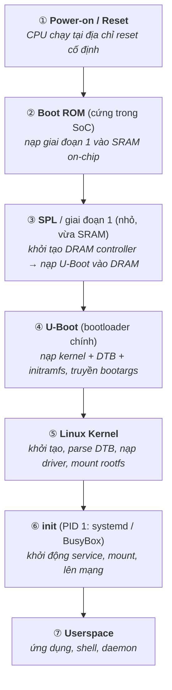

# Boot Process — Từ nguồn điện tới userspace

> **TL;DR**
> - Chuỗi boot điển hình của embedded Linux: **Power-on → Boot ROM (trong SoC) → bootloader giai đoạn 1 (SPL) → bootloader chính (U-Boot) → Linux kernel → init (systemd/BusyBox) → userspace**.
> - Mỗi giai đoạn **khởi tạo đủ phần cứng** để nạp & trao quyền cho giai đoạn sau (khái niệm *bootstrapping*).
> - **Boot ROM** (mã cứng trong SoC) chạy đầu tiên, nạp bootloader từ thiết bị boot (eMMC/SD/NAND/SPI flash).
> - **U-Boot** nạp **kernel + device tree (DTB) + initramfs** vào RAM rồi nhảy vào kernel.
> - **Kernel** khởi tạo, mount **rootfs**, chạy tiến trình **init** (PID 1) — gốc của mọi userspace.

---

## 1. Vì sao boot phải nhiều giai đoạn?

Lúc bật nguồn, gần như chưa có gì được khởi tạo: RAM ngoài chưa cấu hình, clock chưa set, storage chưa truy cập được. Không thể nạp ngay một OS lớn. Nên boot diễn ra theo kiểu **bootstrapping**: một mẩu code nhỏ (đã có sẵn/dễ truy cập) khởi tạo đủ để nạp mẩu lớn hơn, mẩu đó lại khởi tạo thêm để nạp kernel... cho tới khi hệ thống đầy đủ chạy.

---

## 2. Chuỗi boot điển hình (ARM embedded Linux)


```mermaid
flowchart TD
    R["① <b>Power-on / Reset</b><br/><i>CPU chạy tại địa chỉ reset cố định</i>"]
    BR["② <b>Boot ROM</b> (cứng trong SoC)<br/><i>nạp giai đoạn 1 vào SRAM on-chip</i>"]
    SPL["③ <b>SPL</b> / giai đoạn 1 (nhỏ, vừa SRAM)<br/><i>khởi tạo DRAM controller → nạp U-Boot vào DRAM</i>"]
    UB["④ <b>U-Boot</b> (bootloader chính)<br/><i>nạp kernel + DTB + initramfs, truyền bootargs</i>"]
    KN["⑤ <b>Linux Kernel</b><br/><i>khởi tạo, parse DTB, nạp driver, mount rootfs</i>"]
    IN["⑥ <b>init</b> (PID 1: systemd / BusyBox)<br/><i>khởi động service, mount, lên mạng</i>"]
    US["⑦ <b>Userspace</b><br/><i>ứng dụng, shell, daemon</i>"]
    R --> BR --> SPL --> UB --> KN --> IN --> US
```
*(Mỗi giai đoạn khởi tạo đủ phần cứng để nạp & trao quyền cho giai đoạn sau — bootstrapping.)*

---

## 3. Vai trò từng giai đoạn

- **Boot ROM**: cố định trong silicon (mask ROM), không thể sửa. Quyết định **boot từ đâu** (eMMC/SD/NAND/SPI/UART/USB) dựa trên chân cấu hình (boot strap pins) hoặc eFuse. Là gốc của **secure boot** (chứa khóa/chuỗi tin cậy).
- **SPL (giai đoạn 1)**: rất nhỏ để vừa SRAM on-chip (vì DRAM chưa khởi tạo). Việc quan trọng nhất: **cấu hình DRAM controller** để có RAM ngoài, rồi nạp U-Boot vào đó.
- **U-Boot**: bootloader "mạnh", có shell, biến môi trường, lệnh (`bootm`, `tftp`, `mmc read`...). Nạp kernel/DTB/initramfs, dựng **bootargs**, rồi bàn giao cho kernel.

```bash
# --- Một phiên U-Boot thật (gõ ở console serial, nhấn phím bất kỳ để dừng autoboot) ---
=> printenv bootargs                     # xem tham số sẽ truyền cho kernel
=> setenv bootargs 'console=ttyS0,115200 root=/dev/mmcblk0p2 rootwait rw'
=> load mmc 0:1 ${kernel_addr_r} zImage  # nạp kernel từ SD vào DRAM
=> load mmc 0:1 ${fdt_addr_r} board.dtb  # nạp device tree
=> bootz ${kernel_addr_r} - ${fdt_addr_r}   # bàn giao: kernel, (initrd bỏ trống), DTB
=> saveenv                               # ghi biến môi trường xuống flash

# --- Boot qua MẠNG: cách phát triển kernel/rootfs nhanh nhất, không phải rút thẻ SD ---
=> setenv serverip 192.168.1.10
=> tftp ${kernel_addr_r} zImage          # kéo kernel từ máy dev qua TFTP
=> setenv bootargs 'console=ttyS0,115200 root=/dev/nfs rw nfsroot=192.168.1.10:/srv/rootfs ip=dhcp'
=> bootz ${kernel_addr_r} - ${fdt_addr_r}
```

**Giải mã `bootargs`** — đây là chuỗi hay phải sửa nhất khi bring-up, và cũng là chỗ hay sai:

| Tham số | Nghĩa | Sai thì bị gì |
|---|---|---|
| `console=ttyS0,115200` | Kernel in log ra UART nào, baud bao nhiêu | **Màn hình đen** — kernel chạy bình thường nhưng bạn không thấy gì |
| `root=/dev/mmcblk0p2` | Phân vùng chứa rootfs | `Kernel panic - not syncing: VFS: Unable to mount root fs` |
| `rootwait` | Chờ thiết bị lưu trữ xuất hiện rồi mới mount | Thiếu → panic vì eMMC/USB **chưa kịp** enumerate |
| `rw` / `ro` | Mount rootfs đọc-ghi hay chỉ-đọc | `ro` là chuẩn cho sản phẩm (chống hỏng khi mất điện) |
| `ip=dhcp` | Cấu hình mạng sớm (cho NFS root) | NFS root không mount được |

> 💡 **Kỹ thuật phát triển chuẩn:** TFTP kernel + NFS rootfs. Sửa code trên máy dev → `make` → reset board → chạy bản mới **trong vài giây**, không phải flash lại thẻ. Đây là câu trả lời tốt cho *"quy trình phát triển BSP của bạn thế nào?"*.
- **Kernel**: tự giải nén, khởi tạo lõi (memory, scheduler), parse **DTB** để biết phần cứng, nạp driver, rồi mount **rootfs** (chỉ định bởi `root=`) và exec `/sbin/init`.
- **init (PID 1)**: tiến trình userspace đầu tiên, cha của mọi tiến trình; khởi động service theo cấu hình. Trên embedded nhỏ thường là **BusyBox init**; hệ lớn dùng **systemd**.

---

## 4. initramfs / initrd

**initramfs** là một filesystem nhỏ nạp sẵn vào RAM cùng kernel, dùng làm rootfs *tạm thời* khi:
- rootfs thật nằm trên thiết bị cần **driver/module** mới mount được (vd cần driver mạng cho NFS root, hay giải mã/RAID).
- Cần chạy logic chuẩn bị (tìm thiết bị, mở khóa) trước khi chuyển sang rootfs thật (`switch_root`/`pivot_root`).

Hệ embedded đơn giản có thể bỏ qua initramfs và mount thẳng rootfs từ flash.

---

## 5. Root filesystem & lưu trữ

- **rootfs** chứa toàn bộ userspace: `/bin`, `/lib`, `/etc`, ứng dụng... Có thể nằm trên eMMC/SD (ext4), NAND/NOR flash (UBIFS/JFFS2 — filesystem chịu được đặc tính flash), hoặc qua mạng (NFS, cho dev), hoặc squashfs (nén, read-only) cho firmware.
- **Flash lưu ý**: NAND có bad block & wear → cần filesystem/FTL phù hợp; ghi nhiều làm mòn (wear leveling). Nhiều thiết bị dùng rootfs read-only + phân vùng data riêng để bảo vệ.
- **Phân vùng điển hình**: bootloader | env | kernel/DTB | rootfs | data — thường có **A/B partition** để cập nhật firmware an toàn (rollback nếu bản mới hỏng).

---

## 6. Các khái niệm liên quan (điểm danh)

- **Secure boot / chain of trust**: mỗi giai đoạn xác thực chữ ký giai đoạn sau (Boot ROM → SPL → U-Boot → kernel) → chỉ chạy firmware tin cậy.
- **Watchdog**: nếu hệ treo trong khi boot/chạy, watchdog timer reset lại (xem [constraints.md](constraints.md)).
- **Boot time optimization**: embedded thường yêu cầu boot nhanh → cắt giai đoạn, giảm driver, rootfs nhỏ, lazy init.

---

## 7. 🔧 Bring-up & ⚠️ bẫy — chỗ boot thật sự hỏng

**Chẩn đoán theo CHỖ CHẾT** — mỗi giai đoạn chết một kiểu, và triệu chứng nói cho bạn biết đang ở đâu:

| Triệu chứng | Chết ở giai đoạn | Nghi gì trước tiên |
|---|---|---|
| **Im lặng hoàn toàn**, không một ký tự trên UART | BootROM / SPL | Nguồn, clock, chân boot-mode (strapping), thiết bị boot hỏng/trống |
| Ra vài ký tự rác rồi dừng | SPL — UART đã chạy nhưng **sai baud** | Cấu hình clock sai ⇒ **baud lệch** (dấu hiệu: đổi baud thì đọc được) |
| SPL in ra rồi treo | **Khởi tạo DRAM** | Sai tham số DDR — bug khó nhất của bring-up |
| U-Boot chạy, kernel không nhúc nhích | Trao tay kernel | Sai địa chỉ nạp, sai/thiếu **device tree**, sai `bootargs` |
| Kernel panic *"unable to mount root fs"* | Rootfs | Sai `root=`, thiếu driver lưu trữ **trong kernel/initramfs**, sai kiểu filesystem |
| Boot xong rồi reboot vòng lặp | Userspace / watchdog | Init chết, hoặc **watchdog không được nuôi** kịp |

**⚠️ Bẫy:**

**① Không có console = mù hoàn toàn.** Việc **đầu tiên** khi bring-up một bo mới là làm UART chạy — trước cả DRAM nếu có thể. Không có nó thì mọi bước sau chỉ là đoán. Hết cách thì **nhấp một chân GPIO** làm dấu hiệu sống ([hardware-debug.md](hardware-debug.md)).

**② Vì sao phải nhiều giai đoạn — trả lời cho đúng.** Không phải "cho gọn", mà vì **SRAM nội quá nhỏ** (thường vài chục–vài trăm KB). BootROM chỉ nạp nổi **SPL** vào SRAM; SPL có mỗi một việc quan trọng: **khởi tạo DRAM**, để từ đó mới nạp nổi bootloader đầy đủ (vài trăm KB–MB) rồi tới kernel. **Ràng buộc kích thước SRAM chính là lý do tồn tại của SPL.**

**③ Device tree sai thì kernel boot "thành công" nhưng thiết bị không có.** Kernel chạy, có shell, mà `/dev` thiếu — vì DT là thứ **mô tả phần cứng cho kernel**. Sai địa chỉ thanh ghi/số IRQ trong DT thì driver nạp mà không nói chuyện được với chip. Triệu chứng dễ nhầm với "driver lỗi" ([05-drivers-device-tree/device-tree.md](../05-drivers-device-tree/device-tree.md)).

**④ Nâng cấp bootloader là thao tác NGUY HIỂM NHẤT trên thiết bị field.** Mất điện giữa lúc ghi ⇒ **gạch vĩnh viễn**, không cứu được từ xa. ⇒ Thiết kế **A/B (hai bản)** + cờ "đã boot thành công": bản mới boot lỗi thì bootloader tự **quay về bản cũ**. Đây là câu hỏi thiết kế hay được hỏi cho JD embedded.

**⑤ Watchdog phải bật SỚM nhưng đừng quá sớm.** Bật từ bootloader thì được bảo vệ toàn tuyến — nhưng nếu userspace khởi động lâu hơn timeout thì thiết bị **reboot vòng lặp** và trông y hệt "hỏng phần cứng". ⇒ Chọn timeout theo thời gian boot **xấu nhất**, và nuôi watchdog ở nơi thật sự chứng minh hệ thống sống (không phải một thread rỗng chỉ biết nuôi).

**⑥ `initramfs` không phải luôn cần.** Nó tồn tại để **nạp driver cần cho việc mount rootfs** (khi driver đó không biên dịch thẳng vào kernel). Thiết bị nhúng biết trước phần cứng ⇒ **biên dịch thẳng driver lưu trữ vào kernel** rồi bỏ initramfs sẽ **boot nhanh hơn và ít thứ hỏng hơn**.

**⑦ Thời gian boot là yêu cầu sản phẩm, không phải chuyện kỹ thuật vặt.** Mốc điển hình: BootROM+SPL ~**100 ms**, U-Boot ~**0,5–2 s** (phần lớn là **delay chờ nhấn phím** — bỏ đi được), kernel ~**1–3 s**, userspace tuỳ. Muốn cắt thì đo trước (kernel có sẵn cơ chế in mốc thời gian khởi tạo), đừng đoán.

---

## Câu hỏi phỏng vấn liên quan

> Đáp án sống trong [bank/](../14-prep/mock-interview/bank/) — **một đáp án, một chỗ** ([CLAUDE.md §4.7](../CLAUDE.md)). Tự trả lời trước khi mở.

| ID | Câu hỏi |
|----|---------|
| [DRV-013](../14-prep/mock-interview/bank/drivers-embedded.md) | Mô tả quá trình boot của một hệ embedded Linux. |
| [BSP-002](../14-prep/mock-interview/bank/bsp.md) | Vì sao quá trình boot phải chia nhiều giai đoạn? |
| [BSP-002](../14-prep/mock-interview/bank/bsp.md) | Boot ROM và SPL khác U-Boot ở điểm nào? Vì sao cần SPL riêng? |
| [BSP-029](../14-prep/mock-interview/bank/bsp.md) | initramfs để làm gì? Khi nào cần? |
| [BSP-030](../14-prep/mock-interview/bank/bsp.md) | Tiến trình init (PID 1) là gì và vai trò của nó? |
| [DRV-018](../14-prep/mock-interview/bank/drivers-embedded.md) | Vì sao hệ embedded thường dùng A/B partition và rootfs read-only? |

---
⬅️ [architecture.md](architecture.md) · ➡️ Tiếp theo: [rtos-vs-linux.md](rtos-vs-linux.md)
