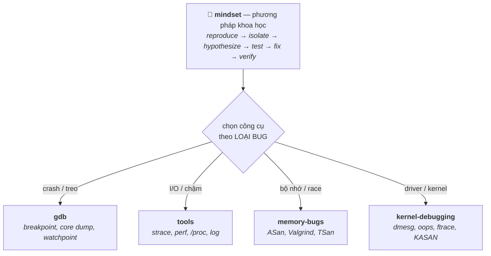

# 09 — Debugging

Kỹ năng debug có hệ thống — phần được đầu tư kỹ vì là điểm cần nâng cấp. Không chỉ "đọc log + đoán" mà là phương pháp luận + công cụ: tư duy debug, gdb, các tool quan sát (strace/ltrace/perf/valgrind), bắt bug bộ nhớ bằng sanitizer, và debug kernel/driver. Phỏng vấn hay hỏi: "bạn debug một crash/segfault thế nào", "memory leak thì làm sao tìm", "chương trình treo thì điều tra ra sao".

## 🗺️ Bức tranh tổng thể

> **Sợi chỉ đỏ:** Debug = **một phương pháp luận** (mindset) cộng **đúng công cụ cho từng loại bug**. Mindset là khung; ba file còn lại là vũ khí chọn theo triệu chứng.

- **`mindset` cắt ngang tất cả:** mọi công cụ chỉ hiệu quả khi đặt trong quy trình "thu hẹp giả thuyết" — không có phương pháp thì công cụ mạnh cũng thành đoán mò.
- **Chọn công cụ là kỹ năng:** segfault → gdb+core dump/ASan; "thiếu file" → strace; chậm → perf; race → TSan; oops → đọc Call Trace. Đây là **bảng quyết định**, không phải học rời.
- **Nối xuống nền tảng:** bug bộ nhớ là hệ quả của [01/memory-model](../01-cpp-fundamentals/memory-model.md); data race của [02/concurrency](../02-modern-cpp/concurrency.md); kernel debug của [05](../05-drivers-device-tree/).
- **Câu hỏi tổng hợp:** *"Crash ngẫu nhiên ở thiết bị field, không gdb được — chiến lược?"* — nối `mindset` + log (`tools`) + core/KASAN (`kernel-debugging`).

## Tài liệu trong topic

| # | File | Nội dung | Trạng thái |
|---|------|----------|-----------|
| 1 | [mindset.md](mindset.md) | tư duy debug có hệ thống: tái hiện, thu hẹp, giả thuyết, bisect, không đoán mò | ✅ |
| 2 | [gdb.md](gdb.md) | breakpoint, backtrace, inspect, core dump, watchpoint, debug đa luồng | ✅ |
| 3 | [tools.md](tools.md) | strace/ltrace, perf, ltrace, /proc, logging, profiling | ✅ |
| 4 | [memory-bugs.md](memory-bugs.md) | leak, corruption, UAF, sanitizers (ASan/UBSan/TSan), valgrind | ✅ |
| 5 | [kernel-debugging.md](kernel-debugging.md) | printk/dmesg, oops/panic, ftrace, kgdb, dynamic debug | ✅ |

## Thứ tự đọc gợi ý
`mindset` (nền tảng tư duy) → `gdb` → `tools` → `memory-bugs` → `kernel-debugging`.

## Liên kết
- Bug bộ nhớ nền tảng: [01-cpp-fundamentals/memory-model.md](../01-cpp-fundamentals/memory-model.md)
- Câu hỏi phỏng vấn: [11-interview-questions/debugging.md](../11-interview-questions/debugging.md)
