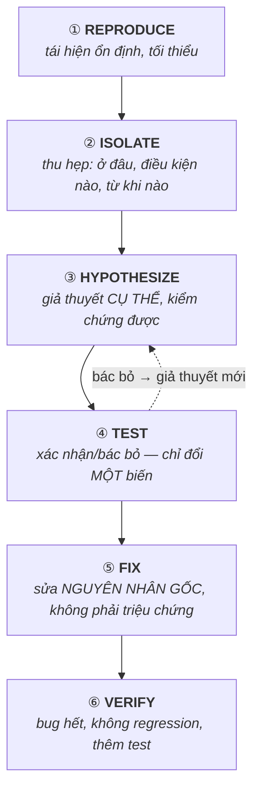

# Debugging Mindset — Tư duy debug có hệ thống

> **TL;DR**
> - Debug là **khoa học**, không phải đoán: quan sát → đặt **giả thuyết kiểm chứng được** → thí nghiệm để xác nhận/bác bỏ → lặp lại. Mỗi bước phải **thu hẹp** không gian nghi ngờ.
> - Quy trình: **tái hiện (reproduce)** ổn định → **cô lập/thu hẹp (isolate)** → **hình thành giả thuyết** → **kiểm chứng** → **sửa** → **xác nhận & ngăn tái diễn**.
> - Nguyên tắc vàng: **đừng đoán mò và sửa bừa**. Một thay đổi tại một thời điểm. Tin dữ liệu, không tin trực giác.
> - Bug khó (intermittent, đa luồng, "Heisenbug") cần công cụ (sanitizer, log có cấu trúc, bisect) chứ không thể nhìn code mà ra.
> - "Nó không thể sai được" = chính chỗ đó sai. Kiểm tra giả định của bạn trước.

---

## 1. Vì sao cần phương pháp?

Cách "đọc log → so code → suy luận → sửa thử" hoạt động với bug đơn giản, nhưng sụp đổ với bug khó: nhiều thành phần, không tất định, đa luồng, hoặc do giả định sai. Không có phương pháp, bạn dễ rơi vào: sửa bừa nhiều chỗ cùng lúc (không biết cái nào hiệu quả), đuổi theo triệu chứng thay vì nguyên nhân, hoặc "tin" rằng một phần đúng mà không kiểm chứng. **Debug có hệ thống = áp dụng phương pháp khoa học vào code.**

---

## 2. Quy trình 6 bước



### ① Reproduce — tái hiện ổn định
Bug tái hiện được là bug **gần như đã giải quyết một nửa**. Tìm các bước tối thiểu, ổn định để gây ra nó. Bug không tái hiện được → việc đầu tiên là *làm cho nó tái hiện* (thêm log, tăng tải, chạy lặp, ép điều kiện biên). Ghi lại môi trường (phiên bản, config, dữ liệu đầu vào).

### ② Isolate — thu hẹp không gian tìm kiếm
Chia để trị: bug ở module nào? trước hay sau điểm X? Các kỹ thuật:
- **Binary search trong code**: thêm log/breakpoint ở giữa → bug ở nửa nào? lặp lại.
- **git bisect**: tìm commit gây regression bằng tìm nhị phân lịch sử (xem mục 4).
- **Loại trừ**: tắt bớt thành phần, đơn giản hóa input tới mức tối thiểu vẫn lỗi (minimal reproducible example).

### ③ Hypothesize — giả thuyết kiểm chứng được
Giả thuyết tốt là **cụ thể và có thể chứng minh sai**: "con trỏ `p` là null khi vào hàm `foo` ở lần lặp thứ 2" — không phải "chắc do bộ nhớ". Một giả thuyết mơ hồ không kiểm chứng được thì vô dụng.

### ④ Test — kiểm chứng, đổi một biến
Thí nghiệm để xác nhận/bác bỏ giả thuyết. **Chỉ thay đổi một thứ mỗi lần** — đổi nhiều thứ thì không biết cái nào tạo khác biệt. Quan sát kết quả thực tế, đừng giả định. Nếu giả thuyết sai → bạn vừa *học được điều gì đó*, dùng nó để tinh chỉnh giả thuyết.

### ⑤ Fix — sửa nguyên nhân gốc
Sửa **root cause**, không phải triệu chứng. Thêm `if (p) ...` để tránh crash mà không hiểu *vì sao* `p` null là vá triệu chứng — bug sẽ quay lại dạng khác. Hỏi "5 whys": vì sao crash? vì p null. vì sao null? vì... cho tới gốc.

### ⑥ Verify — xác nhận & phòng ngừa
Xác nhận bug thực sự hết (bằng chính cách reproduce ở ①), không tạo regression mới. Thêm **test** bắt được bug này để nó không tái diễn. Cân nhắc: còn chỗ nào cùng pattern lỗi này?

---

## 3. Nguyên tắc tư duy quan trọng

- **Tin dữ liệu, không tin trí nhớ/trực giác.** "Tôi chắc đoạn này đúng" là cái bẫy. Kiểm chứng.
- **Kiểm tra giả định trước.** Bug thường nằm ở chỗ bạn *cho rằng* không thể sai (config, build cũ, cache, sai file, sai môi trường). Xác nhận bạn đang chạy đúng cái mình nghĩ.
- **Một thay đổi tại một thời điểm.**
- **Đọc kỹ error message / stack trace** — nó thường nói thẳng vấn đề, đừng lướt qua.
- **Thu hẹp trước khi đào sâu.** Đừng đọc từng dòng cả codebase; khoanh vùng trước.
- **Nghỉ khi bế tắc.** "Rubber duck debugging": giải thích bug cho người/vật khác thường tự lộ ra lỗi trong giả định.
- **Ghi lại** những gì đã thử và kết quả — tránh lặp lại và thấy được pattern.

---

## 4. git bisect — tìm commit gây lỗi

Khi một bug "mới xuất hiện" (regression), tìm commit gây ra bằng tìm nhị phân:
```sh
git bisect start
git bisect bad                 # commit hiện tại có bug
git bisect good v1.2           # commit cũ biết là tốt
# git checkout tự nhảy tới giữa → bạn test → trả lời:
git bisect good   # hoặc  git bisect bad
# ... lặp ~log2(N) lần → git chỉ ra commit đầu tiên gây lỗi
git bisect reset
```
Có thể tự động hóa với `git bisect run <script>` (script trả 0 nếu tốt). Rất mạnh để khoanh vùng "code nào" gây lỗi giữa hàng trăm commit.

---

## 5. Phân loại bug & chiến lược tương ứng

| Loại bug | Đặc điểm | Công cụ/chiến lược |
|----------|----------|--------------------|
| Crash/segfault | Dừng đột ngột | gdb + core dump, backtrace, ASan |
| Memory (leak/UAF/overflow) | Rò rỉ, hỏng dữ liệu ngẫu nhiên | ASan, Valgrind ([memory-bugs.md](memory-bugs.md)) |
| Logic | Kết quả sai, không crash | gdb step, log, unit test, bisect |
| Concurrency | Không tất định, "Heisenbug" | TSan, log có timestamp, ép timing |
| Performance | Chậm | perf, profiler ([tools.md](tools.md)) |
| Treo/deadlock | Đứng yên | gdb attach + backtrace mọi thread, `pstack` |

> **Heisenbug**: bug biến mất khi quan sát (thêm log/debugger đổi timing). Dấu hiệu của lỗi đa luồng/uninitialized/UB → dùng sanitizer thay vì in ấn.

---

## Câu hỏi phỏng vấn liên quan

<details><summary>1) Mô tả quy trình debug có hệ thống của bạn.</summary>

Tôi áp dụng phương pháp khoa học: (1) **Reproduce** — tái hiện bug ổn định, tối thiểu, ghi lại môi trường/input; bug tái hiện được là đã giải quyết một nửa. (2) **Isolate** — thu hẹp không gian nghi ngờ bằng chia để trị (binary search trong code, git bisect cho regression, đơn giản hóa input). (3) **Hypothesize** — đặt giả thuyết cụ thể, kiểm chứng được về nguyên nhân. (4) **Test** — thí nghiệm xác nhận/bác bỏ, chỉ đổi một biến mỗi lần; nếu sai thì dùng thông tin mới tinh chỉnh giả thuyết. (5) **Fix** — sửa đúng nguyên nhân gốc chứ không vá triệu chứng. (6) **Verify** — xác nhận bug hết bằng cách reproduce ban đầu, không gây regression, và thêm test ngăn tái diễn. Nguyên tắc xuyên suốt: tin dữ liệu hơn trực giác, kiểm tra giả định trước, một thay đổi một lần.
</details>

<details><summary>2) Bug không tái hiện được thì làm sao debug?</summary>

Việc đầu tiên là cố **làm cho nó tái hiện**: tăng tần suất/tải, chạy lặp nhiều lần, ép các điều kiện biên (timing, bộ nhớ thấp, input đặc biệt), thêm logging có cấu trúc với timestamp để bắt được khi nó xảy ra. Với bug không tất định (thường là concurrency hoặc UB như dùng biến chưa khởi tạo), dùng công cụ phát hiện chủ động thay vì quan sát thụ động: ThreadSanitizer cho data race, AddressSanitizer/Valgrind cho lỗi bộ nhớ — chúng bắt lỗi ngay cả khi triệu chứng chưa biểu hiện. Thu thập core dump khi crash để phân tích sau (post-mortem). Ghi lại mọi điều kiện khi bug xuất hiện để tìm pattern chung. Cẩn thận "Heisenbug" — thêm log/debugger có thể đổi timing và che bug, nên ưu tiên sanitizer.
</details>

<details><summary>3) Vì sao không nên "sửa bừa cho hết lỗi"? Sửa triệu chứng vs nguyên nhân gốc.</summary>

Sửa bừa nhiều chỗ cùng lúc khiến bạn không biết thay đổi nào thực sự có tác dụng, dễ che giấu bug thay vì sửa, và có thể tạo regression mới. Sửa triệu chứng (vd thêm `if (p)` để tránh crash mà không hiểu vì sao `p` null) chỉ làm bug ẩn đi rồi quay lại ở dạng khác, hoặc gây sai dữ liệu âm thầm. Sửa nguyên nhân gốc đòi hỏi hiểu **vì sao** lỗi xảy ra (kỹ thuật "5 whys": truy ngược chuỗi nguyên nhân tới gốc), nhờ đó sửa dứt điểm và phát hiện các chỗ khác có cùng lỗi. Đây cũng là lý do nên đổi một biến một lần và kiểm chứng từng giả thuyết.
</details>

<details><summary>4) git bisect dùng để làm gì và hoạt động thế nào?</summary>

git bisect dùng để tìm commit đầu tiên gây ra một regression bằng tìm kiếm nhị phân trên lịch sử git. Bạn đánh dấu một commit "bad" (có bug, thường là HEAD) và một commit "good" (cũ, biết là tốt); git tự checkout commit ở giữa, bạn test và trả lời good/bad; git tiếp tục chia đôi khoảng còn lại. Sau khoảng log2(N) bước nó chỉ ra chính xác commit gây lỗi. Có thể tự động hóa hoàn toàn bằng `git bisect run <script>` với script trả về 0 nếu tốt, khác 0 nếu lỗi. Đây là cách rất hiệu quả để khoanh vùng "thay đổi code nào" gây lỗi giữa hàng trăm commit mà không phải đọc thủ công.
</details>

<details><summary>5) Heisenbug là gì? Xử lý thế nào?</summary>

Heisenbug là bug thay đổi hành vi hoặc biến mất khi bạn cố quan sát nó — ví dụ thêm câu lệnh in, chạy dưới debugger, hoặc đổi mức tối ưu làm bug không còn xuất hiện. Nguyên nhân thường là lỗi nhạy với timing (data race trong code đa luồng) hoặc Undefined Behavior (biến chưa khởi tạo, truy cập ngoài mảng) mà việc thêm code làm thay đổi layout bộ nhớ/thời điểm thực thi. Cách xử lý: thay vì quan sát thụ động (in ấn làm đổi timing), dùng công cụ phát hiện chủ động không phụ thuộc may rủi — ThreadSanitizer cho data race, AddressSanitizer/UBSan/Valgrind cho lỗi bộ nhớ và UB; chạy lặp nhiều lần; và xem lại các giả định về khởi tạo và đồng bộ hóa.
</details>

---
⬅️ [Về index topic](README.md) · ➡️ Tiếp theo: [gdb.md](gdb.md)
