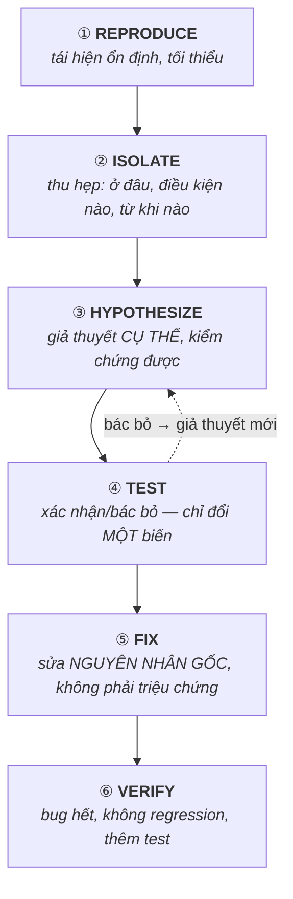

# Debugging Mindset — Tư duy debug có hệ thống

> **TL;DR**
> - Debug là **khoa học**, không phải đoán: quan sát → đặt **giả thuyết kiểm chứng được** → thí nghiệm để xác nhận/bác bỏ → lặp lại. Mỗi bước phải **thu hẹp** không gian nghi ngờ.
> - Quy trình: **tái hiện (reproduce)** ổn định → **cô lập/thu hẹp (isolate)** → **hình thành giả thuyết** → **kiểm chứng** → **sửa** → **xác nhận & ngăn tái diễn**.
> - Nguyên tắc vàng: **đừng đoán mò và sửa bừa**. Một thay đổi tại một thời điểm. Tin dữ liệu, không tin trực giác.
> - Bug khó (intermittent, đa luồng, "Heisenbug") cần công cụ (sanitizer, log có cấu trúc, bisect) chứ không thể nhìn code mà ra.
> - "Nó không thể sai được" = chính chỗ đó sai. Kiểm tra giả định của bạn trước.

---

## 1. Vì sao cần phương pháp?

Cách "đọc log → so code → suy luận → sửa thử" hoạt động với bug đơn giản, nhưng sụp đổ với bug khó: nhiều thành phần, không tất định, đa luồng, hoặc do giả định sai. Không có phương pháp, bạn dễ rơi vào: sửa bừa nhiều chỗ cùng lúc (không biết cái nào hiệu quả), đuổi theo triệu chứng thay vì nguyên nhân, hoặc "tin" rằng một phần đúng mà không kiểm chứng. **Debug có hệ thống = áp dụng phương pháp khoa học vào code.**

---

## 2. Quy trình 6 bước


```mermaid
flowchart TD
    R["① <b>REPRODUCE</b><br/><i>tái hiện ổn định, tối thiểu</i>"]
    I["② <b>ISOLATE</b><br/><i>thu hẹp: ở đâu, điều kiện nào, từ khi nào</i>"]
    H["③ <b>HYPOTHESIZE</b><br/><i>giả thuyết CỤ THỂ, kiểm chứng được</i>"]
    T["④ <b>TEST</b><br/><i>xác nhận/bác bỏ — chỉ đổi MỘT biến</i>"]
    F["⑤ <b>FIX</b><br/><i>sửa NGUYÊN NHÂN GỐC, không phải triệu chứng</i>"]
    V["⑥ <b>VERIFY</b><br/><i>bug hết, không regression, thêm test</i>"]
    R --> I --> H --> T --> F --> V
    T -.->|"bác bỏ → giả thuyết mới"| H
```

### ① Reproduce — tái hiện ổn định
Bug tái hiện được là bug **gần như đã giải quyết một nửa**. Tìm các bước tối thiểu, ổn định để gây ra nó. Bug không tái hiện được → việc đầu tiên là *làm cho nó tái hiện* (thêm log, tăng tải, chạy lặp, ép điều kiện biên). Ghi lại môi trường (phiên bản, config, dữ liệu đầu vào).

### ② Isolate — thu hẹp không gian tìm kiếm
Chia để trị: bug ở module nào? trước hay sau điểm X? Các kỹ thuật:
- **Binary search trong code**: thêm log/breakpoint ở giữa → bug ở nửa nào? lặp lại.
- **git bisect**: tìm commit gây regression bằng tìm nhị phân lịch sử (xem mục 4).
- **Loại trừ**: tắt bớt thành phần, đơn giản hóa input tới mức tối thiểu vẫn lỗi (minimal reproducible example).

### ③ Hypothesize — giả thuyết kiểm chứng được
Giả thuyết tốt là **cụ thể và có thể chứng minh sai**: "con trỏ `p` là null khi vào hàm `foo` ở lần lặp thứ 2" — không phải "chắc do bộ nhớ". Một giả thuyết mơ hồ không kiểm chứng được thì vô dụng.

### ④ Test — kiểm chứng, đổi một biến
Thí nghiệm để xác nhận/bác bỏ giả thuyết. **Chỉ thay đổi một thứ mỗi lần** — đổi nhiều thứ thì không biết cái nào tạo khác biệt. Quan sát kết quả thực tế, đừng giả định. Nếu giả thuyết sai → bạn vừa *học được điều gì đó*, dùng nó để tinh chỉnh giả thuyết.

### ⑤ Fix — sửa nguyên nhân gốc
Sửa **root cause**, không phải triệu chứng. Thêm `if (p) ...` để tránh crash mà không hiểu *vì sao* `p` null là vá triệu chứng — bug sẽ quay lại dạng khác. Hỏi "5 whys": vì sao crash? vì p null. vì sao null? vì... cho tới gốc.

### ⑥ Verify — xác nhận & phòng ngừa
Xác nhận bug thực sự hết (bằng chính cách reproduce ở ①), không tạo regression mới. Thêm **test** bắt được bug này để nó không tái diễn. Cân nhắc: còn chỗ nào cùng pattern lỗi này?

---

## 3. Nguyên tắc tư duy quan trọng

- **Tin dữ liệu, không tin trí nhớ/trực giác.** "Tôi chắc đoạn này đúng" là cái bẫy. Kiểm chứng.
- **Kiểm tra giả định trước.** Bug thường nằm ở chỗ bạn *cho rằng* không thể sai (config, build cũ, cache, sai file, sai môi trường). Xác nhận bạn đang chạy đúng cái mình nghĩ.
- **Một thay đổi tại một thời điểm.**
- **Đọc kỹ error message / stack trace** — nó thường nói thẳng vấn đề, đừng lướt qua.
- **Thu hẹp trước khi đào sâu.** Đừng đọc từng dòng cả codebase; khoanh vùng trước.
- **Nghỉ khi bế tắc.** "Rubber duck debugging": giải thích bug cho người/vật khác thường tự lộ ra lỗi trong giả định.
- **Ghi lại** những gì đã thử và kết quả — tránh lặp lại và thấy được pattern.

---

## 4. git bisect — tìm commit gây lỗi

Khi một bug "mới xuất hiện" (regression), tìm commit gây ra bằng tìm nhị phân:
```sh
git bisect start
git bisect bad                 # commit hiện tại có bug
git bisect good v1.2           # commit cũ biết là tốt
# git checkout tự nhảy tới giữa → bạn test → trả lời:
git bisect good   # hoặc  git bisect bad
# ... lặp ~log2(N) lần → git chỉ ra commit đầu tiên gây lỗi
git bisect reset
```
Có thể tự động hóa với `git bisect run <script>` (script trả 0 nếu tốt). Rất mạnh để khoanh vùng "code nào" gây lỗi giữa hàng trăm commit.

---

## 5. Phân loại bug & chiến lược tương ứng

| Loại bug | Đặc điểm | Công cụ/chiến lược |
|----------|----------|--------------------|
| Crash/segfault | Dừng đột ngột | gdb + core dump, backtrace, ASan |
| Memory (leak/UAF/overflow) | Rò rỉ, hỏng dữ liệu ngẫu nhiên | ASan, Valgrind ([memory-bugs.md](memory-bugs.md)) |
| Logic | Kết quả sai, không crash | gdb step, log, unit test, bisect |
| Concurrency | Không tất định, "Heisenbug" | TSan, log có timestamp, ép timing |
| Performance | Chậm | perf, profiler ([tools.md](tools.md)) |
| Treo/deadlock | Đứng yên | gdb attach + backtrace mọi thread, `pstack` |

> **Heisenbug**: bug biến mất khi quan sát (thêm log/debugger đổi timing). Dấu hiệu của lỗi đa luồng/uninitialized/UB → dùng sanitizer thay vì in ấn.

---

## Câu hỏi phỏng vấn liên quan

> Đáp án sống trong [bank/](../14-prep/mock-interview/bank/) — **một đáp án, một chỗ** ([CLAUDE.md §4.7](../CLAUDE.md)). Tự trả lời trước khi mở.

| ID | Câu hỏi |
|----|---------|
| [DBG-008](../14-prep/mock-interview/bank/debugging.md) | Mô tả quy trình debug có hệ thống của bạn. |
| [DBG-012](../14-prep/mock-interview/bank/debugging.md) | Bug không tái hiện được thì làm sao debug? |
| [DBG-026](../14-prep/mock-interview/bank/debugging.md) | Vì sao không nên "sửa bừa cho hết lỗi"? Sửa triệu chứng vs nguyên nhân gốc. |
| [DBG-027](../14-prep/mock-interview/bank/debugging.md) | git bisect dùng để làm gì và hoạt động thế nào? |
| [DBG-012](../14-prep/mock-interview/bank/debugging.md) | Heisenbug là gì? Xử lý thế nào? |

---
⬅️ [Về index topic](README.md) · ➡️ Tiếp theo: [gdb.md](gdb.md)
