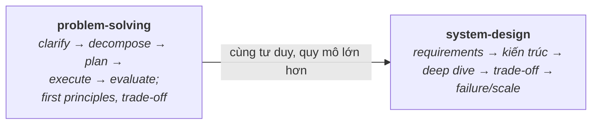

# 10 — Thinking (Tư duy)

Tư duy cốt lõi tách Middle khỏi Senior: cách tiếp cận vấn đề có hệ thống và cách thiết kế hệ thống (hướng Embedded Linux). Đây là phần được hỏi gián tiếp trong **mọi** câu phỏng vấn — không phải kiến thức nhớ được, mà là cách bạn suy nghĩ, đặt câu hỏi, đánh đổi và trình bày. Phỏng vấn Senior thường có vòng "design a system" và các câu mở "bạn sẽ tiếp cận thế nào".

## 🗺️ Bức tranh tổng thể

> **Sợi chỉ đỏ:** Cùng một bộ tư duy ở **hai quy mô**: giải quyết *một vấn đề* (problem-solving) và thiết kế *cả một hệ thống* (system-design). System design chỉ là problem-solving áp ở quy mô lớn hơn.

- **Hai file chung một DNA:** đều bắt đầu bằng *làm rõ trước khi giải*, đều dựa trên *first principles* và *đánh đổi có lý do*, đều coi trọng *think aloud / giao tiếp*.
- **Topic này cắt ngang mọi topic khác:** mỗi quyết định kỹ thuật ở 01–14 (stack hay heap, template hay virtual, RTOS hay Linux, poll hay interrupt) là một bài tập áp dụng tư duy đánh đổi ở đây.
- **Nối với Design Patterns:** SOLID & pattern ([12](../12-design-patterns/)) là tư duy thiết kế *đã đóng gói* thành nguyên lý/khuôn — đọc cùng để bổ trợ.
- **Câu hỏi tổng hợp:** *"Thiết kế phần mềm thu thập sensor trên thiết bị nhúng"* — dùng quy trình `system-design` + đánh đổi `problem-solving`, kéo theo kiến thức 03/04/08.

## Tài liệu trong topic

| # | File | Nội dung | Trạng thái |
|---|------|----------|-----------|
| 1 | [problem-solving.md](problem-solving.md) | tiếp cận vấn đề có hệ thống, làm rõ yêu cầu, chia nhỏ, đánh đổi, first principles | ✅ |
| 2 | [system-design.md](system-design.md) | quy trình thiết kế, requirement, kiến trúc, đánh đổi, design embedded thực tế | ✅ |

## Thứ tự đọc gợi ý
`problem-solving` → `system-design`.

## Liên kết
- Áp dụng kiến thức từ mọi topic trước (OS, Linux, embedded, shared lib).
- Câu hỏi phỏng vấn: [11-interview-questions/system-design.md](../11-interview-questions/system-design.md)
