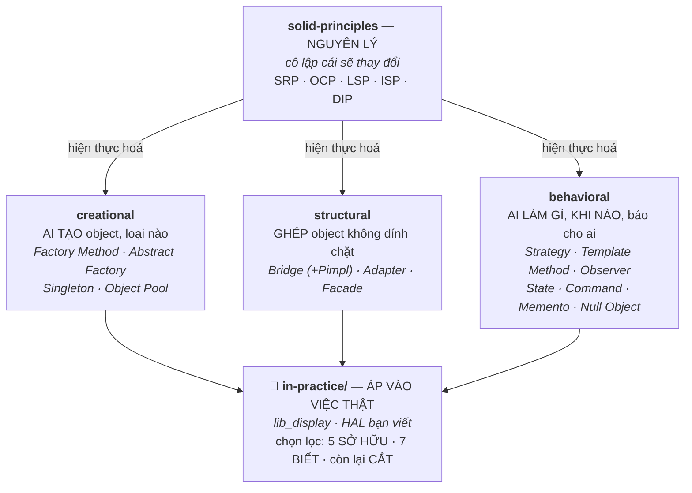

# 12 — Design Patterns

Các mẫu thiết kế hướng C++/embedded. Trọng tâm **không** phải thuộc lòng UML mà là **hiểu vấn đề pattern giải quyết, khi nào dùng / khi nào KHÔNG, và đánh đổi** — vì lạm dụng pattern (over-engineering) cũng tệ như không biết.

> 🎯 **Topic này CÓ CHỦ ĐÍCH không dàn đều 23 pattern GoF.** Nó tập trung vào **12 pattern có mặt trong công việc thật** (HAL C++ qua `.so`, driver, hệ display) và **cắt** phần còn lại xuống mức *nhận diện tên*. Lý do + danh sách cắt: [in-practice/README](in-practice/README.md). Nói tên một pattern mình không dùng là **mời interviewer hỏi vào đúng chỗ mình yếu**.

## 🗺️ Bức tranh tổng thể

> **Sợi chỉ đỏ:** **SOLID là *nguyên lý* (vì sao), pattern là *hiện thực hoá* (làm thế nào).** Cả bốn tầng phục vụ **một** câu hỏi duy nhất: *"cái gì ở đây sẽ thay đổi, và tôi cô lập nó ở đâu?"* — ba nhóm pattern chỉ là ba chỗ khác nhau để đặt ranh giới cô lập đó.

- **SOLID đứng trên cùng:** vd Factory/Strategy hiện thực hoá Open/Closed + Dependency Inversion; pimpl phục vụ information hiding. Hiểu nguyên lý thì pattern là hệ quả tự nhiên.
- **Pattern là *công cụ*, không phải mục tiêu:** C++ hiện đại thay nhiều pattern bằng tính năng ngôn ngữ (lambda/`std::function` cho Strategy; `variant`+`visit` cho Visitor) — luôn cân nhắc over-engineering, nhất là embedded.
- **Bốn cặp hay bị lẫn — biết phân biệt là phần lớn giá trị của topic:** *Factory Method vs Abstract Factory* ([creational §2](creational.md)) · *Strategy vs Bridge* ([structural §1.1](structural.md)) · *Strategy vs Template Method* ([behavioral §2.1](behavioral.md)) · *Adapter vs Facade vs Proxy vs Decorator* ([structural §0](structural.md)).
- **Nối với các topic:** pimpl ↔ [07/api-design](../07-shared-libraries/api-design.md); DIP ↔ HAL/testability [10/system-design](../10-thinking/system-design.md); Observer ↔ sự kiện sensor/GPIO [08](../08-embedded-systems/).
- **Câu hỏi tổng hợp:** *"Thiết kế hệ thống plugin trong C++"* — nối Factory (`creational`) + interface/DIP (`solid`) + `dlopen` ([07](../07-shared-libraries/linking-loading.md)).

## Tài liệu trong topic

| # | File | Nội dung | Trạng thái |
|---|------|----------|-----------|
| 1 | [solid-principles.md](solid-principles.md) | **Năm cách nói của MỘT mục tiêu** — mỗi nguyên lý chống một *lực*, kèm dấu hiệu vi phạm, cái giá, và bảng ánh xạ *nguyên lý → pattern* | ✅ |
| 2 | [creational.md](creational.md) | **Factory Method · Abstract Factory · Singleton** (*vì sao Meyers thread-safe*, *"một instance" qua `.so`*) **· Object Pool**; Builder ở mức nhận diện | ✅ |
| 3 | [structural.md](structural.md) | **Bridge** (+ *Pimpl*) **· Adapter · Facade**; Proxy/Decorator ở mức nhận diện — mở đầu bằng bảng phân biệt *4 cách bọc object* | ✅ |
| 4 | [behavioral.md](behavioral.md) | **Strategy · Template Method · Observer · State · Command · Memento · Null Object** — sợi chỉ đỏ: *pattern mua cấu trúc, không mua tính đúng đắn của miền* | ✅ |
| 5 | 🎯 **[in-practice/](in-practice/)** | **Pattern trong việc của BẠN** — case study `lib_display` + mổ chính code HAL bạn viết | ✅ |

## 🎯 Hai tầng của topic này — đọc đúng tầng

| | Bốn file 1–4 (generic) | **[in-practice/](in-practice/)** (bám việc thật) |
|---|---|---|
| Trả lời câu hỏi | *"Pattern X **là gì**?"* | *"Quyết định nào trong hệ display **đẻ ra** pattern nào?"* |
| Ví dụ | `Shape`, `Logger`, `HttpRequest` | dimming global/local/oled · video-enhancer theo SoC · `IDisplay`/`DisplayImpl` |
| Đo tầng nào | **T1** — biết & nói gọn | **T2** — vận dụng & đánh đổi ([config §6](../14-prep/mock-interview/config.md)) |
| Phạm vi | Đủ 4 nhóm, dàn đều | **Chọn lọc có chủ đích** — 5 pattern sở hữu, 4 pattern biết, phần còn lại **cắt** |

> ⚠️ **Bốn file generic KHÔNG bị thay thế** — chúng vẫn là chỗ tra "pattern X là gì". `in-practice/` **không lặp lại** nội dung đó, chỉ link sang. Một sự thật, một chỗ.

## Thứ tự đọc gợi ý
`solid-principles` (nền tảng) → `creational` → `structural` → `behavioral` → 🎯 **[in-practice/](in-practice/)** (áp vào việc thật — đọc sau cùng, nhưng đây mới là phần được hỏi).

## Nguyên tắc xuyên suốt
- **Pattern là *hệ quả* của SOLID, không phải danh sách để học thuộc.** Bắt đầu bằng câu hỏi *"cái gì ở đây sẽ thay đổi?"* — pattern là câu trả lời, không phải điểm xuất phát.
- **Pattern mua CẤU TRÚC, không mua TÍNH ĐÚNG ĐẮN CỦA MIỀN.** Observer không chống nhấp nháy, Command không làm lệnh tới nơi. Câu hỏi T2 luôn nằm ở nửa sau đó.
- **Ba câu hỏi lọc trước khi trừu tượng hoá:** đã có ≥ 2 biến thể *thật* chưa · khác **hành vi** hay chỉ khác **tham số** · có ai cần **hoán đổi** không?
- C++ hiện đại thay được nhiều pattern bằng tính năng ngôn ngữ (`std::function`/lambda, template, `variant`+`visit`).
- Embedded: chi phí nằm ở **tần suất gọi** — virtual trên đường cấu hình là miễn phí, **cấp phát động trên đường mỗi khung hình là lỗi thật**.
- 🔴 Qua ranh giới `.so`, mọi interface là **hợp đồng nhị phân**: thêm virtual = **ABI break**, không có ngoại lệ.

## Liên kết
- Nền tảng OOP: [01-cpp-fundamentals/oop.md](../01-cpp-fundamentals/oop.md)
- Thiết kế API: [07-shared-libraries/api-design.md](../07-shared-libraries/api-design.md)
- Câu hỏi phỏng vấn: domain `DP` trong [bank/design-patterns.md](../14-prep/mock-interview/bank/design-patterns.md) — mục **E** là case study hệ display (`DP-021`…`DP-032`)
- Code thật được mổ trong `in-practice/`: [project_implementation/HAL_layer](../14-prep/mock-interview/project_implementation/HAL_layer)
