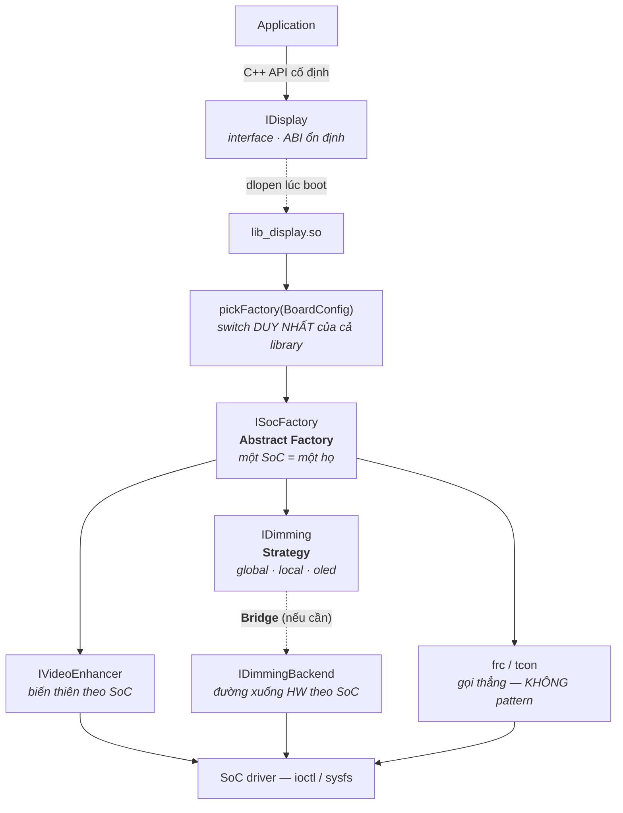

# 01 — `lib_display`: từ yêu cầu thật tới pattern

> **TL;DR**
> - Trước khi chọn pattern, viết ra **trục biến thiên**: *cái gì thay đổi, cái gì đứng yên*. Pattern là **hệ quả** của câu trả lời đó, không phải lựa chọn thẩm mỹ.
> - `lib_display` có **hai trục khác nhau**, nên cần **hai pattern khác nhau**:
>   **(a) dimming** biến thiên theo **thuật toán** (global/local/oled) trên cùng một nền ⟹ **Strategy**;
>   **(b) video-enhancer** biến thiên theo **SoC** — đổi cả một *họ* thành phần cùng lúc ⟹ **Abstract Factory**.
> - Khi **cả hai trục cùng biến thiên** (thuật toán × SoC) thì kế thừa cho **N×M lớp**. **Bridge** kéo về **N+M**.
> - **`frc`/`tcon` cố tình KHÔNG có pattern nào** — chỉ một command cố định xuống SoC. Nói được chỗ mình *không* trừu tượng hoá là tín hiệu senior rõ hơn kể tên năm pattern.
> - Mọi pattern ở đây đều phải trả thêm **giá ABI** vì chúng sống qua ranh giới `.so` → xem [02-interface-impl-plugin.md](02-interface-impl-plugin.md).

---

## 1. Bài toán thật

Tầng C++ interface gọi xuống một shared library (`lib_display`). Library **tạo instance lúc runtime** cho từng feature; ứng dụng ở trên không đổi khi đổi board.

```
   Application
        │  (C++ API cố định)
   ┌────▼──────────────────────────────────┐
   │  IDisplay  — interface, ABI ổn định   │
   └────┬──────────────────────────────────┘
        │  dlopen + factory lúc boot
   ┌────▼──────────────────────────────────┐
   │  lib_display.so                       │
   │   ├── dimming        (logic NẶNG)     │
   │   ├── video-enhancer (logic NẶNG)     │
   │   ├── frc            (1 command)      │
   │   └── tcon           (1 command)      │
   └───────────────────────────────────────┘
                    │ ioctl / sysfs
                 SoC driver
```

**Bảng trục biến thiên — đây là bước quyết định mọi thứ phía sau:**

| Feature | Cái gì **thay đổi** | Cái gì **đứng yên** | Lượng logic | ⇒ Kết luận thiết kế |
|---|---|---|---|---|
| **dimming** | *thuật toán*: global / local / oled | interface (`setLevel`, `onFrame`…), luồng gọi | Nặng | Trục **hành vi** ⟹ **Strategy** |
| **video-enhancer** | *toàn bộ cách điều khiển* theo **SoC** | interface | Nặng | Trục **nền tảng** ⟹ **Abstract Factory** |
| **frc** | (gần như không) | tất cả | ~0 — một command | **Không pattern** |
| **tcon** | (gần như không) | tất cả | ~0 — một command | **Không pattern** |

> 💡 **Câu hỏi lọc, hỏi trước mọi thứ:** *"Nếu ngày mai thêm một biến thể, tôi phải sửa bao nhiêu chỗ?"*
> - Sửa **một chỗ, thêm một file** ⟹ thiết kế đang đúng.
> - Sửa **rải rác nhiều `if/switch`** ⟹ thiếu abstraction, đó là lúc pattern trả công.
> - **Không bao giờ thêm biến thể** ⟹ đừng trừu tượng hoá (xem §4).

---

## 2. Hai trục — hai pattern

### 2.1 Dimming ⟹ **Strategy**

Ba loại dimming (global / local / oled) **cùng một hợp đồng**, khác **cách tính**:

- *Global*: một giá trị backlight cho cả panel.
- *Local*: chia panel thành zone, tính duty riêng từng zone theo histogram khung hình.
- *OLED*: không có backlight — điều tiết bằng luminance/ABL, kèm ràng buộc chống burn-in.

```cpp
// ---- Hợp đồng: cái ĐỨNG YÊN ----
class IDimming {
public:
    virtual ~IDimming() = default;
    virtual void onFrame(const FrameStats& s) = 0;   // mỗi khung hình
    virtual int  setTarget(int nits)          = 0;   // đích do lớp trên đặt
};

// ---- Ba thuật toán: cái THAY ĐỔI ----
class GlobalDimming : public IDimming { /* 1 giá trị cho cả panel */ };
class LocalDimming  : public IDimming { /* N zone, histogram/khung */ };
class OledDimming   : public IDimming { /* ABL + chống burn-in    */ };

// ---- Context: KHÔNG đổi khi thêm thuật toán ----
class DisplayImpl {
    std::unique_ptr<IDimming> dimming_;          // strategy cắm vào
public:
    void onFrame(const FrameStats& s) { dimming_->onFrame(s); }   // ủy nhiệm
    void setDimming(std::unique_ptr<IDimming> d) { dimming_ = std::move(d); }
};
```

**Vì sao là Strategy chứ không chỉ là "kế thừa bình thường":** điểm của Strategy nằm ở **`DisplayImpl` không đổi một dòng nào** khi thêm loại dimming thứ tư. Hành vi được **cắm vào** (composition), không được **nướng vào** (inheritance). Đó chính là OCP + DIP ([solid-principles](../solid-principles.md)).

**Hai thứ hay bị lẫn với Strategy — phân biệt rõ:**

| | Strategy | Template Method |
|---|---|---|
| Quan hệ | **Composition** — context *giữ* một strategy | **Inheritance** — lớp con *là* một biến thể |
| Cái cố định | Interface | **Khung thuật toán** ở lớp cha |
| Cái thay đổi | Toàn bộ cách làm | Chỉ vài **bước hook** |
| Đổi lúc runtime | ✅ Được (gán strategy khác) | ❌ Không — cố định lúc tạo object |
| Hợp khi | Ba thuật toán **khác nhau về bản chất** | Ba biến thể **chung khung, khác chi tiết** |

Áp vào dimming: nếu ba loại chỉ khác nhau ở *"tính duty thế nào"* nhưng chung khung *`đọc stats → tính → ghi xuống HW → log`* thì **Template Method** gọn hơn:

```cpp
class DimmingBase {                     // khung CỐ ĐỊNH ở lớp cha
public:
    void onFrame(const FrameStats& s) {         // <- không virtual: khung không đổi
        auto duty = compute(s);                 //    hook: mỗi loại tự tính
        clamp(duty);                            //    bước chung
        writeToHw(duty);                        //    bước chung
    }
protected:
    virtual Duty compute(const FrameStats&) = 0;   // CHỖ DUY NHẤT lớp con thay
};
```

> ⚠️ **Chọn thế nào — quy tắc một câu:** *"Có bao giờ tôi cần đổi thuật toán trên một object đang sống không?"* Có (đổi chế độ dimming lúc runtime theo picture mode / nội dung) ⟹ **Strategy**. Không (loại dimming do panel quyết định, cố định từ boot) ⟹ **Template Method** đủ và rẻ hơn một lần gián tiếp.

**C++ hiện đại:** nếu strategy chỉ là *một hàm* thì `std::function` gọn hơn cả cây class ([behavioral §1](../behavioral.md)). Nhưng dimming **có state** (bộ lọc, lịch sử zone, timer chống nhấp nháy) ⟹ ở đây **class là đúng**, không phải lambda. Biết chỗ *không* dùng lambda cũng là một điểm.

---

### 2.2 Video-enhancer ⟹ **Abstract Factory**

Khác biệt cốt lõi so với dimming: đây **không phải một thuật toán thay được**, mà là *"cả cách điều khiển khác hẳn nhau giữa các SoC"* — khác register map, khác command set, khác cả ràng buộc thời điểm.

Cám dỗ đầu tiên là viết một factory cho mỗi thứ:

```cpp
// ❌ Cám dỗ: mỗi feature một factory riêng, đều nhận enum SoC
std::unique_ptr<IVideoEnhancer> makeEnhancer(SocType soc);
std::unique_ptr<IDimming>       makeDimming(SocType soc);
std::unique_ptr<IFrc>           makeFrc(SocType soc);
```

Vấn đề **không phải** dài dòng, mà là: **không gì ngăn được việc trộn nhầm họ.** Một chỗ khởi tạo quên truyền đúng `soc` ⟹ enhancer của SoC-A chạy cùng dimming của SoC-B. Nó **compile sạch**, **chạy được**, và hỏng theo kiểu khó truy nhất: sai màu/nhấp nháy trên đúng một board.

**Abstract Factory** đóng đúng lỗ đó — *một* factory tạo *cả họ*, nên họ luôn nhất quán:

```cpp
// Abstract Factory: hợp đồng tạo CẢ HỌ thành phần của một nền tảng
class ISocFactory {
public:
    virtual ~ISocFactory() = default;
    virtual std::unique_ptr<IVideoEnhancer> createEnhancer() = 0;
    virtual std::unique_ptr<IDimming>       createDimming()  = 0;
    virtual std::unique_ptr<IFrc>           createFrc()      = 0;
};

// Mỗi SoC = MỘT concrete factory. Không thể trộn nhầm họ.
class SocAFactory : public ISocFactory {
public:
    std::unique_ptr<IVideoEnhancer> createEnhancer() override { return std::make_unique<SocAEnhancer>(); }
    std::unique_ptr<IDimming>       createDimming()  override { return std::make_unique<LocalDimming>(std::make_unique<SocABackend>()); }
    std::unique_ptr<IFrc>           createFrc()      override { return std::make_unique<SocAFrc>(); }
};

// Chọn MỘT LẦN lúc boot, từ board config — đúng dòng resume của bạn
std::unique_ptr<ISocFactory> pickFactory(const BoardConfig& cfg) {
    switch (cfg.soc) {
        case SocType::A: return std::make_unique<SocAFactory>();
        case SocType::B: return std::make_unique<SocBFactory>();
    }
    return nullptr;                       // board lạ → Null Object ở tầng trên (xem 02 §2)
}
```

**Ba điều đáng nói ở phỏng vấn về đoạn này:**

| Điều | Vì sao quan trọng |
|---|---|
| **`switch` chỉ còn ĐÚNG MỘT chỗ** | Thêm SoC mới = thêm một class + một `case`. Không phải `if (soc == …)` rải khắp library — đó là thứ OCP thật sự mua được |
| **Nhất quán họ được bảo đảm bằng KIỂU, không bằng kỷ luật** | Không dựa vào việc mọi người nhớ truyền đúng `soc`. Đây là khác biệt cốt lõi giữa Abstract Factory và "vài hàm factory rời" |
| **Điểm chọn nằm ở BOOT, không ở mỗi lời gọi API** | Chi phí phân giải trả một lần; sau đó chỉ còn một virtual call. Quan trọng trên đường frame-rate |

---

### 2.3 Ba cái hay bị gộp làm một — bảng phân biệt

Đây là chỗ **rớt điểm phổ biến nhất** khi bị hỏi về nhóm creational.

| | **Factory Method** | **Abstract Factory** | **Strategy** |
|---|---|---|---|
| Trả lời câu hỏi | *"Tạo object nào?"* | *"Tạo cả HỌ object nào?"* | *"Cư xử thế nào?"* |
| Nhóm | Creational | Creational | **Behavioral** |
| Số sản phẩm | **Một** | **Nhiều, phải nhất quán** | Không tạo gì cả |
| Trong `lib_display` | `IDisplayBuilder::buildNewDisplayHandle()` | `ISocFactory` (enhancer + dimming + frc theo SoC) | `IDimming` cắm vào `DisplayImpl` |
| Dấu hiệu nhận ra | Một hàm ảo trả object | Interface có **nhiều** `createX()` | Object **giữ** một interface rồi **ủy nhiệm** |

> **Chốt một câu:** *Factory quyết định **ai được tạo ra**; Strategy quyết định **nó cư xử ra sao**. Hai câu hỏi khác nhau, nên chúng thường xuất hiện **cùng nhau**, không thay thế nhau.* — `SocAFactory::createDimming()` (Factory) tạo ra một `LocalDimming` (Strategy) rồi cắm vào `DisplayImpl`.

---

## 3. Khi HAI trục cùng biến thiên ⟹ **Bridge**

> ⚠️ *Phần này là **mở rộng** từ bối cảnh bạn mô tả, không phải mô tả nguyên trạng codebase.* Nó xuất hiện ngay khi dimming cũng cần đường xuống phần cứng riêng cho từng SoC — tình huống rất dễ tới, và là **ví dụ Bridge sát thực tế nhất** mà bạn có thể kể.

**Vấn đề:** dimming có **N thuật toán** (global/local/oled) và **M SoC** (cách ghi duty xuống HW khác nhau). Kế thừa cả hai trục:

```
GlobalDimmingSocA   LocalDimmingSocA   OledDimmingSocA
GlobalDimmingSocB   LocalDimmingSocB   OledDimmingSocB      ⟹ N × M lớp
```

Thêm một SoC ⟹ viết **thêm N lớp**. Thêm một thuật toán ⟹ **thêm M lớp**. Đây đúng là **bùng nổ lớp con** mà Bridge sinh ra để giải.

**Bridge:** tách **abstraction** (*thuật toán dimming*) khỏi **implementor** (*đường xuống phần cứng*), nối bằng một con trỏ:

```cpp
// ---- IMPLEMENTOR: cách nói chuyện với phần cứng, biến thiên theo SoC ----
class IDimmingBackend {
public:
    virtual ~IDimmingBackend() = default;
    virtual void writeDuty(int zone, int duty) = 0;   // SocA: ioctl · SocB: sysfs/mailbox
    virtual int  zoneCount() const             = 0;
};

// ---- ABSTRACTION: thuật toán, biến thiên theo loại dimming ----
class DimmingBase : public IDimming {
protected:
    std::unique_ptr<IDimmingBackend> hw_;             // "cây cầu" — KHÔNG kế thừa
public:
    explicit DimmingBase(std::unique_ptr<IDimmingBackend> hw) : hw_(std::move(hw)) {}
};

class LocalDimming : public DimmingBase {
public:
    using DimmingBase::DimmingBase;   // kế thừa ctor — nhớ để public
    void onFrame(const FrameStats& s) override {
        for (int z = 0; z < hw_->zoneCount(); ++z)
            hw_->writeDuty(z, computeZone(s, z));     // thuật toán không biết SoC nào
    }
};

// Ghép lúc chạy: N + M lớp, ghép được N × M tổ hợp
auto d = std::make_unique<LocalDimming>(std::make_unique<SocABackend>());
```

| | Kế thừa hai trục | **Bridge** |
|---|---|---|
| Số lớp | **N × M** | **N + M** |
| Thêm 1 SoC | +N lớp | **+1 lớp** |
| Thêm 1 thuật toán | +M lớp | **+1 lớp** |
| Tổ hợp mới | Phải viết lớp mới | **Ghép lúc runtime**, không viết gì |

> **Bridge vs Strategy — chúng trông y hệt nhau trong code, khác nhau ở Ý ĐỊNH.** Cả hai đều là "giữ một con trỏ tới interface rồi ủy nhiệm". Khác biệt:
> - **Strategy**: một trục. Cái được cắm vào là **thuật toán thay thế được**; context có thể đổi nó giữa chừng.
> - **Bridge**: hai trục. Cái được cắm vào là **nửa còn lại của cùng một thứ** (dimming *cần* một backend mới hoạt động được); thường gắn từ lúc dựng và không đổi.
>
> Nói được đúng chỗ này ⟹ điểm 4. Trả lời *"Bridge với Strategy giống nhau"* rồi dừng ⟹ điểm 2.
>
> 🔗 **Pimpl là một ứng dụng khác của cùng ý tưởng Bridge** — nhưng phục vụ mục tiêu *giấu implementation & giữ ABI*, không phải chống bùng nổ lớp con. Xem [structural §2](../structural.md) và [07/api-design §2](../../07-shared-libraries/api-design.md).

---

## 4. Chỗ CỐ TÌNH không dùng pattern — `frc` và `tcon`

`frc`/`tcon` chỉ là **một command cố định xuống SoC**. Không thuật toán, không state, không biến thể.

```cpp
// ✅ Đủ. Và đúng.
int setFrc(int mode)  { return socCmd(CMD_FRC,  mode); }
int setTcon(int mode) { return socCmd(CMD_TCON, mode); }
```

Nếu "cho đồng bộ" mà bọc chúng thành `IFrcStrategy` + `FrcFactory` + `IFrcBackend`, cái giá phải trả rất cụ thể:

| Chi phí | Cụ thể |
|---|---|
| Đọc hiểu | Ba file + một lần gián tiếp để tìm ra nó chỉ gọi **một** `ioctl` |
| Runtime | Một object trên heap + một vtable + một virtual call cho mỗi lệnh |
| **ABI** | Thêm một virtual interface qua ranh giới `.so` = thêm một hợp đồng nhị phân phải giữ **vĩnh viễn** ([02 §3.3](02-interface-impl-plugin.md)) |
| Nhận thức | Người đọc sau sẽ **đi tìm biến thể không tồn tại** — abstraction nói dối về hệ thống |

> **Phép thử trước khi trừu tượng hoá — trả lời "không" bất kỳ câu nào thì đừng làm:**
> 1. Đã có **≥ 2 biến thể thật** chưa (không phải "sau này biết đâu")?
> 2. Biến thể có khác nhau về **hành vi**, hay chỉ khác **tham số**? *(Chỉ khác tham số ⟹ truyền tham số, không cần lớp.)*
> 3. Có ai đó thật sự cần **hoán đổi** chúng không?
>
> `frc`/`tcon` trượt cả ba. `dimming` đạt cả ba.

**Cách nói ở phỏng vấn** *(đây là câu ăn điểm, học thuộc ý)*:

> *"Trong library có bốn feature. Hai cái logic nặng và có biến thể thật — dimming và video-enhancer — thì đi qua interface + factory. Hai cái còn lại, frc và tcon, chỉ là một command cố định xuống SoC nên tôi để nguyên hàm gọi thẳng. Bọc chúng lại sẽ thêm một virtual interface qua ranh giới `.so` mà không mua được gì, và ABI đó thì phải giữ mãi. Trừu tượng hoá nên trả giá cho một biến thể đã tồn tại, không phải cho một biến thể tưởng tượng."*

---

## 5. Cái giá trên embedded — biết con số, đừng nói cảm tính

Câu *"pattern tốn tài nguyên"* nói suông sẽ bị hỏi lại ngay. Con số cụ thể:

| Thứ | Chi phí | Có đáng lo trên đường frame không? |
|---|---|---|
| Một virtual call | 1 lần nạp vtable + 1 indirect call (~vài ns), **không inline được** | Trên đường **mỗi khung hình** (`onFrame` @120 Hz) thì đáng đo. Trên đường **cấu hình** (`setPower`) thì không |
| Một object có vtable | +1 con trỏ (8 byte) mỗi instance | Không — ở đây chỉ vài instance, không phải triệu |
| `make_unique` trong factory | Một lần chạm heap **lúc boot** | Không. Nhưng **cấm chạm heap trong `onFrame`** — nếu cần buffer, cấp trước ([Object Pool](../creational.md)) |
| Tra factory theo config | Một `switch` **một lần lúc boot** | Không |

> **Ranh giới thật, phát biểu một câu:** *chi phí pattern nằm ở **tần suất gọi**, không ở việc có dùng pattern hay không.* Virtual trên đường cấu hình = miễn phí. Cấp phát động trong `onFrame` = lỗi thật, không phải chuyện thẩm mỹ. Chi tiết ràng buộc: [08/constraints.md](../../08-embedded-systems/constraints.md).

---

## 6. Ghép lại



**Bốn quyết định, đọc theo thứ tự đó là dựng lại được cả kiến trúc:**

1. Interface cố định ở trên ⟹ ứng dụng không đổi khi đổi board *(đây là **yêu cầu**, không phải pattern)*.
2. Chọn **họ** implementation một lần lúc boot theo board config ⟹ **Abstract Factory**.
3. Trong họ đó, thuật toán dimming hoán đổi được ⟹ **Strategy**.
4. Feature không có biến thể ⟹ **không pattern**.

---

## Câu hỏi phỏng vấn liên quan

> Đáp án sống trong [bank/](../../14-prep/mock-interview/bank/) — **một đáp án, một chỗ** ([CLAUDE.md §4.7](../../CLAUDE.md)). Tự trả lời trước khi mở.

| ID | Câu hỏi |
|----|---------|
| [DP-021](../../14-prep/mock-interview/bank/design-patterns.md) | Dimming chia global/local/oled, video-enhancer chia theo SoC — cùng là "kế thừa từ class gốc", vì sao hai pattern khác nhau? |
| [DP-022](../../14-prep/mock-interview/bank/design-patterns.md) | Vài hàm `makeX(SocType)` rời có gì sai so với một `ISocFactory`? Lỗi nó cho phép xảy ra là lỗi gì? |
| [DP-023](../../14-prep/mock-interview/bank/design-patterns.md) | N thuật toán dimming × M SoC — thiết kế sao để không thành N×M lớp? Bridge khác Strategy chỗ nào? |
| [DP-024](../../14-prep/mock-interview/bank/design-patterns.md) | `frc`/`tcon` chỉ một command cố định — vì sao KHÔNG bọc pattern? Nêu cái giá cụ thể. |
| [DP-005](../../14-prep/mock-interview/bank/design-patterns.md) | Strategy pattern là gì? C++ hiện đại hiện thực gọn thế nào? |

---
⬅️ [Bản đồ chọn lọc](README.md) · ➡️ Tiếp theo: [02-interface-impl-plugin.md](02-interface-impl-plugin.md)
