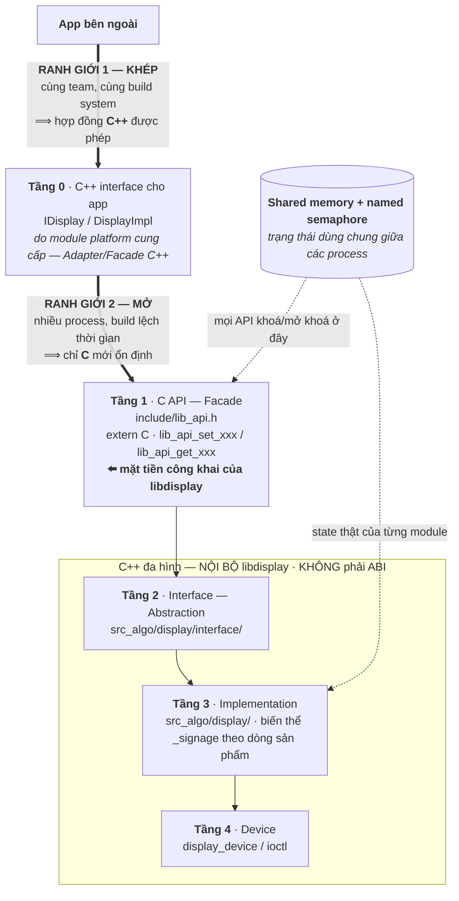
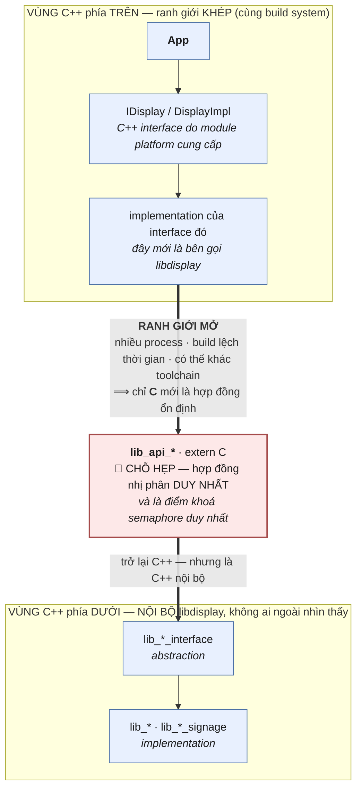
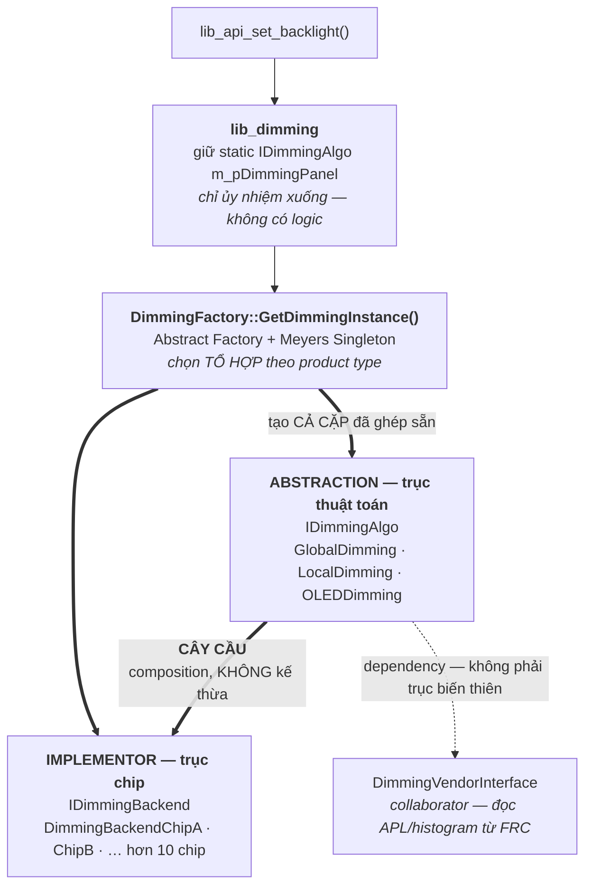

# A1 — Kiến trúc TIÊU CHUẨN: `libdisplay`

> 🅰️ **PHẦN A — TIÊU CHUẨN.** Tài liệu này mô tả **hệ thật đang chạy trong sản phẩm**, đã khử nhạy cảm: *đây là cái có thật, kèm cả điểm mạnh lẫn điểm yếu của nó*.
> Muốn xem **"cùng bối cảnh, làm lại thì thế nào"** → [🅱️ B1-redesign-architecture.md](B1-redesign-architecture.md).
> Ranh giới C++ interface/impl ở **Tầng 0** có bộ khung chạy được + 5 bài lab → [A2-cpp-interface-hal.md](A2-cpp-interface-hal.md).

> **TL;DR**
> - `libdisplay` là `.so` cung cấp API điều khiển chất lượng hình ảnh (dimming · sensor · video enhancement · ambient) cho **nhiều dòng sản phẩm × nhiều thế hệ chip × nhiều process caller**. Câu hỏi kiến trúc trung tâm: *cô lập cái gì, ở đâu?*
> - ⭐ **Phát hiện quan trọng nhất — kiến trúc là "narrow waist" HAI TẦNG**, và mỗi ranh giới chọn ngôn ngữ hợp đồng theo mức **"mở"** của nó: ranh giới **khép** (cùng build system) dùng **C++ interface**; ranh giới **mở** (nhiều process, build lệch thời gian) dùng **`extern "C"`**. Đây là câu trả lời mạnh nhất bạn có cho phần shared library.
> - Hệ quả ít người nói ra: vì mặt tiền công khai là **C**, toàn bộ C++ đa hình bên trong (`lib_*_interface`, `IDimmingAlgo`) **không phải là ABI**. Thêm virtual thoải mái — thứ mà [A2 §3.3](A2-cpp-interface-hal.md) chứng minh là **ABI break im lặng** khi phơi C++ ra ngoài.
> - **Dimming là ví dụ Bridge kinh điển, có thật**: hai trục độc lập — *thuật toán* (Global/Local/OLED) × *chip* (hơn 10 backend) — nối bằng composition ⟹ **N+M** thay vì N×M.
> - Điểm yếu tự nhận (và **nên chủ động nêu ở phỏng vấn**): `IDimmingAlgo` ~150 virtual (vi phạm ISP) · trục **dòng sản phẩm** bị đan vào **cả hai** trục của Bridge thay vì thành trục riêng · `lib_init_modules()` đang làm việc của Abstract Factory nhưng viết dạng hàm thủ tục.

> 🔒 **Đây là bản ĐÃ KHỬ NHẠY CẢM — và là bản duy nhất được commit.** Mọi định danh (`libdisplay`, `lib_api_*`, `IDimmingAlgo`, `ChipA`/`ChipB`…) là **tên tài liệu**, không phải tên thật; **kiến trúc thì giữ nguyên 100%**. Bảng đối chiếu ngược sống ở file nội bộ bị `.gitignore`.
> **Khi kể ở phỏng vấn:** nói được **kiến trúc · pattern · đánh đổi**; **không** nói tên sản phẩm/khách hàng, tên symbol nội bộ, thuật toán dimming độc quyền, hay số liệu chưa công bố. Nêu đúng ranh giới này là **điểm cộng** — giống cách repo xử lý ranh giới secure boot ở [lab BSP](../../14-prep/study-plans/datalogic-plan.md).

---

## 1. `libdisplay` là gì — một câu

Một shared library (`.so`) cung cấp API điều khiển **chất lượng hình ảnh** (dimming, sensor, video enhancement, ambient) cho nhiều loại sản phẩm (TV, Signage, Monitor), trên nhiều thế hệ chip và nhiều đời OS nền.

**Vị trí trong stack — điểm dễ hiểu nhầm:** app bên ngoài **không** gọi thẳng `libdisplay`. App gọi **C++ interface** (`IDisplay` / `DisplayImpl`) do module platform cung cấp; **implementation của các interface đó** mới là bên gọi `lib_api_*` của `libdisplay`.

---

## 2. Bức tranh các tầng

> Điểm cần thấy: **hai ranh giới**, và mỗi ranh giới nói một **ngôn ngữ hợp đồng** khác nhau. Mọi thứ dưới Tầng 1 là C++ **nội bộ** — không phải ABI.



**Cùng thông tin đó ở dạng tra cứu — đường dẫn thật trong repo:**

| Tầng | Là gì | Ở đâu | Hợp đồng |
|---|---|---|---|
| 0 | C++ interface cho app | module platform (`IDisplay` / `DisplayImpl`) | **C++** — ranh giới khép |
| **1** | **C API (Facade)** | `include/lib_api.h` · `src_com/lib_api.cpp` | 🔴 **C** — ranh giới **mở**, mặt tiền công khai |
| 2 | Interface (Abstraction) | `src_algo/display/interface/` — `lib_dimming_interface`, `lib_sensor_interface`, `lib_video_enhancement_interface`, `lib_ambient_interface` | C++ nội bộ |
| 3 | Implementation | `src_algo/display/` — `lib_dimming`, `lib_sensor`, `lib_video_enhancement`… + biến thể `_signage` | C++ nội bộ |
| 4 | Device | `display_device` / `ioctl` | — |
| ⟂ | Trạng thái đa process | `struct display_shm_info` trong POSIX shared memory + named semaphore | cắt ngang mọi tầng |

---

## 3. Trục chính: **narrow waist hai tầng**

Đây là phần đáng đầu tư nhất của cả tài liệu — nó trả lời câu *"vì sao lại chuyển C++ → C → C++ nghe có vẻ vòng vo?"*



**Đọc sơ đồ — hình đồng hồ cát, đọc từ trên xuống:**

| Vùng | Ngôn ngữ hợp đồng | Vì sao |
|---|---|---|
| **Trên** — app → implementation | **C++** | Ranh giới **khép**: cùng team, cùng toolchain, build cùng lúc ⟹ vtable/STL khớp nhau được **quy định build** bảo đảm |
| 🔴 **Chỗ hẹp** — `lib_api_*` | **C** (`extern "C"`) | Ranh giới **mở**: nhiều process, build lệch thời gian ⟹ chỉ C mới ổn định về nhị phân |
| **Dưới** — bên trong `libdisplay` | **C++** | Không ai ngoài nhìn thấy ⟹ **không phải ABI**, refactor thoải mái |

⟹ Việc "C++ → C → C++" **không phải vòng vo thừa**. Cả hai đầu đều **rộng** (được dùng đủ tính năng C++); chỉ **chỗ hẹp ở giữa** là thứ phải giữ vĩnh viễn. Mỗi bên tự do refactor ở phía mình mà không kéo bên kia phải build lại.

### 3.1 Hai ranh giới, hai hợp đồng

**Ranh giới 1 — app ↔ `IDisplay`/`DisplayImpl`: KHÉP.** Interface và implementation build **cùng platform, cùng toolchain, cùng lúc** — vtable/STL khớp nhau được bảo đảm bằng **quy định build**, không phải bằng may mắn. Vì vậy C++ interface ở đây **được phép, và còn đáng dùng**: app nhận đúng idiom C++ (class, RAII, dependency injection) qua *một* interface, thay vì gọi hàng trăm hàm C rời rạc.

**Ranh giới 2 — module platform ↔ `libdisplay`: MỞ.** `libdisplay` được link vào **nhiều process** (TV service, factory, menu, daemon, tool test…), build **lúc khác, team khác, có thể toolchain khác**. Ở đây chỉ **C** mới là hợp đồng nhị phân ổn định:

| | Nếu phơi **C++ interface** qua `.so` | Nếu `extern "C"` |
|---|---|---|
| Tên symbol | **Name mangling** — khác nhau giữa compiler/version | Chuẩn, không mangling |
| Bảng virtual | **vtable layout** do compiler quyết định — thêm/bớt/đổi thứ tự virtual là **ABI break im lặng** | **Không có vtable** ở ranh giới |
| Kiểu dữ liệu | `std::string`, `std::vector` kéo theo phiên bản STL/ABI của bên build | Struct + primitive — **tự mô tả** |
| Ai build được | Chỉ bên **cùng toolchain, cùng phiên bản** | **Bất kỳ** compiler nào, kể cả C thuần |

> 🔴 **Nối thẳng với hai thí nghiệm đã đo bằng máy ở [A2](A2-cpp-interface-hal.md)** — khi phơi C++ interface qua `.so`:
> - **[A2 §3.3]** chèn một virtual vào **giữa** ⟹ app gọi `setPower()` mà **destructor chạy**; không crash, exit 0, không log.
> - **[A2 Lab 3a]** biến thể khác của cùng lỗi ⟹ hỏng **kể cả khi cơ chế version của hai bên báo khớp nhau**, vì version nói về *số lượng API*, không nói về *bố cục slot*.
>
> `libdisplay` **miễn nhiễm** với cả lớp bug đó, đúng một lý do: mặt tiền là C nên **không có vtable nào đi qua ranh giới**.

### 3.2 ⭐ Hệ quả ít người nói ra — và là chỗ ăn điểm

Vì hợp đồng công khai là C:

| | Phơi C++ interface | **`libdisplay` (mặt tiền C)** |
|---|---|---|
| Thêm virtual vào `lib_*_interface` | 🔴 ABI break | ✅ **Tự do** — caller không thấy vtable |
| Đổi kế thừa / thêm class nội bộ | 🔴 Rủi ro layout | ✅ Tự do |
| Đổi struct nội bộ | 🔴 Break nếu lộ trong header | ✅ Tự do (không nằm trong `lib_api.h`) |
| Caller phải build lại khi library đổi | Thường **có** | ❌ **Không** — C API là *compilation firewall* |
| Thứ **vẫn** phải giữ vĩnh viễn | Rất nhiều | Chữ ký `lib_api_*` + layout struct công khai |

⟹ **Chính vì thế mà `libdisplay` mới dám có `IDimmingAlgo` ~150 virtual mà không sợ.** Nếu interface đó nằm ở ranh giới mở thì mỗi lần thêm một method là một đợt rebuild toàn hệ thống.

**Cùng mô hình với cả ngành:** Vulkan, SQLite, libdrm, OpenMAX đều là **C API** được app C++ bọc lại. C là *narrow waist* — chỗ hẹp nhất, ổn định nhất của đồng hồ cát.

> **Quy tắc rút ra, một câu:** *ranh giới **mở** (nhiều process, build lệch thời gian) → **C**; ranh giới **khép** (cùng build system) → **C++ interface** được phép.*

### 3.3 Một lý do nữa, riêng của `libdisplay`: C API là điểm đồng bộ DUY NHẤT

Mỗi hàm C là một **Facade** gói trọn trình tự *kiểm shm → khoá semaphore → gọi đa hình → mở khoá*:

```cpp
// src_com/lib_api.cpp
int32_t lib_api_set_backlight(int backlight) {
    int32_t ret = LIB_OK;
    if (get_check_shm() == -1) return -1;                 // shared memory san sang?
    int sem_ret = lib_sem_lock(__FUNCTION__);        // KHOA

    if (get_dimming_instance() != NULL)
        ret = get_dimming_instance()->SetBacklight(backlight);        // da hinh
    if (get_video_enhancement_instance() != NULL)
        ret = get_video_enhancement_instance()->SetBacklight(backlight);  // da hinh

    if (sem_ret == 0) lib_sem_unlock(__FUNCTION__);  // MO KHOA
    return ret;
}
```

⭐ **Nếu phơi thẳng một C++ interface ra ngoài, caller gọi thẳng method và BYPASS semaphore** — mất luôn cơ chế chống race giữa các process. Nói cách khác: **lựa chọn "mặt tiền C" ở đây không chỉ vì ABI, mà còn vì nó là chỗ duy nhất ép được mọi lời gọi đi qua khoá.** Đó là lập luận hai tầng, và là dạng trả lời phân biệt được ứng viên.

---

## 4. Các pattern còn lại — ở đâu, giải gì

### 4.1 Strategy / đa hình qua interface class

Mỗi module chức năng có một abstract interface, toàn bộ method virtual:

```cpp
// src_algo/display/interface/lib_dimming_interface.h
class lib_dimming_interface {
public:
    virtual ~lib_dimming_interface();
    virtual uint32_t Create();
    virtual uint32_t Destroy();
    virtual uint32_t SetBacklight(int32_t iBacklight);
    virtual uint32_t SetGamma(int32_t gamma);
    virtual uint32_t SetResolution(res_info_t& info);
    // ...
};
```

Cây kế thừa — trục biến thiên theo **loại sản phẩm**: `lib_dimming` / `lib_dimming_signage`, `lib_sensor` / `_signage`, `lib_video_enhancement` / `_signage`.

`lib_api.cpp` **chỉ biết interface**, không bao giờ `new` thẳng implementation — đúng **Dependency Inversion** ([solid-principles §5](../solid-principles.md)).

### 4.2 Factory — chọn implementation lúc load

```cpp
void lib_init_modules() {
    int32_t nProductType = get_product_type(PRODUCT_SIGNAGE);

    if (nProductType == PRODUCT_TYPE_SIGNAGE) {
        sensor     = new lib_sensor_signage();
        dimming       = new lib_dimming_signage();
        video_enhancement = new lib_video_enhancement_signage();
    } else {
        sensor     = new lib_sensor();
        dimming       = new lib_dimming();
        video_enhancement = new lib_video_enhancement();
    }
    ambient = new lib_ambient();

    dimming->Create();
    sensor->Create();
    video_enhancement->Create();
    ambient->Create();
}
```

⚠️ **Gọi tên cho chính xác — đây KHÔNG chỉ là Factory Method.** Nó tạo **bốn** object phải cùng một biến thể sản phẩm; trộn `lib_dimming_signage` với `lib_sensor` thường là bug **compile sạch, chạy được, chỉ sai trên một dòng sản phẩm**. Theo đúng tiêu chí ở [creational §2](../creational.md), đó là bài toán của **Abstract Factory**.

> **Cách nói đúng và ăn điểm:** *"Về hình dạng nó là một hàm khởi tạo có điều kiện. Về ý định nó đang làm việc của Abstract Factory — tạo cả một họ object phải nhất quán. Nó an toàn vì cả họ được tạo trong **đúng một hàm**, tức nhất quán được bảo đảm bằng **kỷ luật một điểm**, không phải bằng **kiểu**. Đánh đổi này chấp nhận được khi chỉ có một tiêu chí chọn; nếu thêm trục thứ hai thì nên nâng lên factory object thật."*

### 4.3 Service Locator (không hẳn Singleton)

```cpp
// src_algo/display/lib_base.cpp
static lib_dimming_interface       *dimming       = NULL;
static lib_sensor_interface     *sensor     = NULL;
static lib_video_enhancement_interface *video_enhancement = NULL;
static lib_ambient_interface       *ambient       = NULL;

lib_dimming_interface* get_dimming_instance() {
    if (dimming == NULL) lib_print(ERR, "dimming is NULL");
    return dimming;
}
```

⚠️ **Gọi tên chính xác:** đây là **Service Locator** trên con trỏ process-global, **không phải Singleton GoF** — không có cơ chế nào *ép* tính duy nhất, chỉ có quy ước "chỉ `lib_init_modules()` mới gán". Nói đúng tên cho thấy bạn phân biệt được *"một instance vì thiết kế ép thế"* với *"một instance vì không ai gán lần hai"*.

⭐ **Hai điểm đáng nói, cả hai đều nối thẳng vào bài đã học:**

1. **Không có data race ở đây** — khác hẳn `getInstance()` trong [HAL (A2 §3.2, Lab 1)](A2-cpp-interface-hal.md) vốn có race thật (đo được **178/200**). Lý do: `libdisplay` khởi tạo trong `__attribute__((constructor))`, tức **trước khi process tạo thread nào**, nên không có check-then-act ở đường nóng. **Đây là một cách chữa race khác với magic statics: dời khởi tạo ra khỏi vùng có cạnh tranh.**
2. **"Một instance" ở đây có hai nghĩa khác nhau** — và đây đúng là góc mà [DP-020](../../14-prep/mock-interview/bank/design-patterns.md) cảnh báo:

| | Con trỏ instance | Trạng thái thật |
|---|---|---|
| Sống ở đâu | **Mỗi process một bản** (dữ liệu của `.so` được map riêng) | **Shared memory** — một bản cho cả hệ thống |
| Bao nhiêu bản | N process ⟹ **N con trỏ, N object C++** | **Một** |
| Ai bảo vệ | (không cần) | **Named semaphore** |

⟹ *"Object là per-process, state là per-system."* Câu này gói gọn cả kiến trúc.

### 4.4 Shared memory + Semaphore — trạng thái đa process

```cpp
// src_algo/display/lib_base.h
struct display_shm_info {
    int    init;
    int    ref_count;                    // dem process toan cuc
    sem_t  sem_ave;                      // named semaphore dung o MOI API
    DimmingForShm       shmDimming;         // trang thai tung module
    SensorForShm     shmSensor;
    VideoEnhancementForShm  shm_video_enhancement;
    char   prev_called_proc[20][255];    // lich su goi — de debug deadlock
    // ...
};
```

Khởi tạo **tự động** khi process nạp library — caller không phải gọi `init`:

```cpp
// src_com/lib_api.cpp
void __attribute__((constructor)) lib_init()       { lib_init_device(); }
void __attribute__((destructor))  lib_base_final() { /* teardown */ }
```

Đây **không phải** GoF pattern mà là **idiom IPC của hệ nhúng nhiều process** — nhưng nó **quyết định hình dạng của mọi pattern khác** trong library, nên phải nói ra trước khi nói pattern.

> 💡 **Chi tiết đáng nhớ:** `prev_called_proc[20][255]` — lưu lịch sử tiến trình đã gọi, để khi deadlock còn biết ai đang giữ khoá. Đây là **thiết kế cho lúc debug**, đúng tinh thần [09-debugging/mindset](../../09-debugging/mindset.md), và là chi tiết rất "thực chiến" nếu được hỏi *"hệ này debug kiểu gì?"*.
>
> 🔗 `__attribute__((constructor))` chính là cơ chế self-registration đã mổ ở [A2 §1](A2-cpp-interface-hal.md) — cùng công cụ, dùng cho mục đích khác (ở đó: đăng ký factory; ở đây: dựng shared memory).

### 4.5 Null Object — bản mặc định ở lớp cơ sở

Lớp `lib_*_interface` **không** phải abstract thuần: mọi method có thân trả `LIB_OK`.

```cpp
// src_algo/display/interface/lib_dimming_interface.cpp
uint32_t lib_dimming_interface::SetBacklight(int32_t backlight) { return LIB_OK; }
```

**Hệ quả:** subclass chỉ override cái mình cần; tính năng không áp dụng cho sản phẩm đó **tự động thành no-op thành công**. Cùng ý đồ với `new IDisplay()` dummy ở [A2 §2.1](A2-cpp-interface-hal.md).

⚠️ **Hai điểm cần nói kèm, nếu không sẽ bị vặn:**
- **Trả `LIB_OK` cho việc không làm gì là một quyết định có rủi ro** — caller không phân biệt được *"đã đặt xong"* với *"tính năng không tồn tại"*. Bản HAL của bạn chọn khác: trả `-ENOTSUP`. Nêu được **cả hai lựa chọn và lý do** là câu trả lời tốt hơn là bảo vệ một bên. *(Lý do nghiêng về `LIB_OK` ở đây: caller là hàng trăm điểm gọi có sẵn, đổi sang mã lỗi sẽ làm rất nhiều đường code cũ bắt đầu báo lỗi.)*
- 🟢 **Ở `libdisplay` thì cách này AN TOÀN về ABI**, khác hẳn HAL: vì `.so` cũ không bao giờ bị gọi qua vtable từ ngoài, không có chuyện *"vtable ngắn hơn ⟹ segfault"* như [A2 Lab 3b](A2-cpp-interface-hal.md). Cùng một pattern, hai bối cảnh ABI khác nhau, hai mức rủi ro khác nhau.

### 4.6 Observer — sự kiện từ hệ thống *(vai trò nhỏ)*

`sysconf` daemon key-change callback: đăng ký nhận thông báo khi key hệ thống đổi.

```cpp
// src_com/lib_api.cpp
void* set_pvt_key_callbacks(void*) {
    sysconf_subscribe(<key_panel_vfreq>, lib_api_cb_mapper, NULL);
    // ... cac key khac
}
```

Đúng mô hình Observer (subject = sysconf daemon, observer = `libdisplay`), nhưng là **vai phụ** trong kiến trúc — nêu một câu là đủ, đừng dựng thành trục chính. *(Tên khoá thật đã lược bỏ — xem ghi chú NDA đầu file.)*

### 4.7 Builder + Dependency Injection — ở biên plugin *(PPI)*

Biên PPI là **ranh giới mở thứ hai** của hệ, và nó dùng **đúng cơ chế đã mổ chi tiết ở [A2-cpp-interface-hal.md](A2-cpp-interface-hal.md)** — không viết lại ở đây:

1. Interface giữ một **con trỏ builder** static, ban đầu `NULL`.
2. `.so` plugin được **`dlopen`**; loader chạy hàm `__attribute__((constructor))` của nó.
3. Hàm đó gọi **ngược lên** một symbol trong bên nạp để **tự đăng ký** `_BuilderImpl` của mình.
4. Bên nạp gọi builder ⟹ nhận object mà **không hề biết class cụ thể**.

⚠️ **Gọi tên cho đúng:** đây là **Factory Method + self-registration / Dependency Injection**, **không phải Builder GoF** — nó tạo xong trong một lời gọi, không dựng nhiều bước. Tên `_BuilderImpl` là **quy ước nội bộ**, đúng như trường hợp `IDisplayBuilder` trong HAL của bạn ([DP-025](../../14-prep/mock-interview/bank/design-patterns.md)).

> 💡 **Điểm đáng nói khi so hai biên:** cùng một cơ chế `dlopen` + constructor, nhưng ở **§4.4** nó dựng shared memory, còn ở đây nó **đăng ký factory**. Nhận ra một công cụ phục vụ hai mục đích khác nhau trong cùng một hệ là dấu hiệu đọc kiến trúc chứ không phải đọc code.
>
> ⚠️ Và biên này **có** vtable đi qua ranh giới `.so` — tức là nó **chịu đúng rủi ro ABI** mà mặt tiền C của `libdisplay` tránh được (§3.2): thêm/đổi thứ tự virtual trong interface plugin là **ABI break im lặng** ([A2 Lab 3](A2-cpp-interface-hal.md)).

---

## 5. 🎯 Case study: **dimming** — Bridge có thật

### 5.0 Tóm tắt một đoạn

Dimming là **minh chứng Bridge kinh điển**: hai trục biến thiên độc lập — **thuật toán** (Global/Local/OLED) và **chip** (hơn 10 backend). Abstraction kế thừa `IDimmingAlgo`, implementor kế thừa `IDimmingBackend`, nối bằng **composition** — thuật toán giữ con trỏ backend nhận qua constructor, **ghép lúc runtime** ⟹ **N + M** thay vì N×M; thêm chip **không đụng** thuật toán. Tổ hợp được chọn lúc khởi tạo bởi `DimmingFactory` — **Abstract Factory** dạng Meyers Singleton, tạo **cả cặp** (object + backend) theo product type. Với platform không có dimming, factory gán chính base class — mọi method mặc định `return LIB_OK` — **Null Object**.

### 5.1 Vấn đề dimming phải giải

Dimming = điều khiển độ sáng backlight của panel. **Hai chiều biến thiên độc lập:**

| Trục | Biến thiên theo | Ví dụ |
|---|---|---|
| **Thuật toán** | Loại panel | Global · Local · OLED |
| **Chip** | SoC ghi phần cứng kiểu gì | hơn 10 backend |

Kế thừa cả hai trục ⟹ `GlobalDimmingChipA`, `LocalDimmingChipB`… ⟹ **N × M** lớp. `libdisplay` tách trục ⟹ **N + M**, bằng Bridge.

### 5.2 Kiến trúc ba lớp + một factory



### 5.3 Bridge — hai trục, ghép bằng composition

**Abstraction — trục thuật toán:**

```cpp
// dimming/Common/IDimmingAlgo.h
class IDimmingAlgo {
public:
    virtual ~IDimmingAlgo();
    virtual uint32_t SetBacklight(int32_t backlight);
    // ... ~150 methods ...
    virtual void t_vSyncCallBack();          // vsync-driven
};
```

**Implementor — trục chip:**

```cpp
// dimming/Backend/IDimmingBackend.h
class IDimmingBackend {
public:
    virtual ~IDimmingBackend();
    // Local Dimming
    virtual uint32_t t_InitLocalDimming();
    virtual uint32_t t_SetLdFinalDuty(BackendLdFinalDuty_t* pInputData);
    // Global Dimming
    virtual uint32_t t_InitGlobalDimming();
    virtual uint32_t t_Set2DFinalDuty(BackendGd2DFinalDuty_t* pInputData);
    virtual uint32_t t_SetPWMCommon(BackendGdCommonSetting_t* pInputData);
};

class DimmingBackendChipA : public IDimmingBackend {
public:
    uint32_t t_InitGlobalDimming() override;   // tu ghi register rieng chip minh
    // ...
};
```

**Cây cầu — composition, KHÔNG kế thừa:**

```cpp
// dimming/Common/GlobalDimming.h
class GlobalDimming : public IDimmingAlgo {
public:
    GlobalDimming(IDimmingBackend* pDimmingBackend, DimmingType_k eDetectedDimming);
protected:
    GlobalDimmingForShm&      Shm;                 // trang thai trong shared memory
    DimmingVendorInterface*   m_pDimmingVendor;    // doc APL/histogram tu FRC
    IDimmingBackend*  m_pDimmingBackend;   // ⬅️ CAY CAU sang truc chip
};

// dimming/Common/GlobalDimming.cpp
GlobalDimming::GlobalDimming(IDimmingBackend* pDimmingBackend,
                             DimmingType_k eDetectedDimming)
    : Shm(get_lib_shm()->shmGlobalDimming) {
    m_pDimmingBackend  = pDimmingBackend;              // GHEP luc runtime
    m_pDimmingVendor   = DimmingVendor::GetInstance();
    m_pDimmingShare    = DimmingShare::GetInstance();
    m_pEcoSensorShare  = get_sensor_instance();
}
```

> ⭐ **Đối chiếu với lý thuyết:** ví dụ `IDimmingBackend` mà [structural §1](../structural.md) và [structural §1](../structural.md) dựng ra **gần như trùng khớp với `IDimmingBackend` thật**. Đây là bằng chứng tốt nhất rằng phần lý thuyết không bịa — và là câu chuyện rất mạnh khi kể: *"tôi nhận ra cấu trúc mình đang bảo trì chính là Bridge, sau khi đọc lại định nghĩa."*

### 5.4 Strategy và Bridge **cùng tồn tại**, ở hai lớp khác nhau

Đây đúng là câu hỏi phân loại kinh điển ([DP-038](../../14-prep/mock-interview/bank/design-patterns.md)): **code trông giống hệt, ý định khác nhau.**

| | `IDimmingAlgo` | `IDimmingBackend` |
|---|---|---|
| Vai | **Strategy** | **Bridge** (implementor) |
| Số trục | Một — thuật toán thay thế được theo panel | Nửa còn lại của **cùng một thứ** |
| Chạy được nếu thiếu? | (có bản base no-op) | **Không** — thuật toán *cần* backend mới ghi được HW |
| Gắn khi nào | Chọn lúc khởi tạo | Gắn lúc dựng, qua constructor |

### 5.5 Factory + Singleton — `DimmingFactory`

Mỗi chip có một `DimmingFactory` riêng (nằm trong thư mục backend của chip đó), chọn **tổ hợp** (thuật toán × backend) theo product type:

```cpp
// dimming/Backend/ChipA/DimmingFactory.cpp
DimmingFactory::DimmingFactory() {
    int32_t productType = get_product_type(PRODUCT_SIGNAGE);
    if (productType == PRODUCT_TYPE_SIGNAGE) {
        m_pDimmingBackend = new DimmingBackendChipA_Signage();
        m_pDimmingObject  = new GlobalDimmingSignage(m_pDimmingBackend, /* eDetectedDimming */);
    } else {
        m_pDimmingBackend = new DimmingBackendChipA();
        m_pDimmingObject  = new GlobalDimming(m_pDimmingBackend, /* eDetectedDimming */);
    }
}

IDimmingAlgo* DimmingFactory::GetDimmingInstance() {
    static DimmingFactory instance;      // Meyers singleton — thread-safe tu C++11
    return instance.GetDimmingObject();
}
```

⭐ **Đây mới thật sự là Abstract Factory**, không phải Factory Method: nó tạo **cả cặp đã ghép sẵn** (abstraction + đúng implementor của nó). Trộn nhầm `GlobalDimming` với backend của chip khác là **bug compile sạch** — chính lớp lỗi mà [DP-022](../../14-prep/mock-interview/bank/design-patterns.md) nói tới, và ở đây nó được chặn bằng cách **cả họ chỉ được tạo trong một chỗ**.

Lớp vào `lib_dimming` gọi factory này trong constructor:

```cpp
// dimming/Base/lib_dimming.cpp
lib_dimming::lib_dimming() : Shm(get_lib_shm()->shmDimming) {
    get_platform_info(&Shm.m_iPlatformType);
    if (Shm.m_iPlatformType == PLATFORM_NO_PANEL)
        m_pDimmingPanel = new IDimmingAlgo();                    // ⬅️ NULL OBJECT
    else
        m_pDimmingPanel = DimmingFactory::GetDimmingInstance();
}

uint32_t lib_dimming::SetAmbientMode(int32_t mode) {
    CHECK_DIMMING_FLAG_CREATE(m_bFlagCreate);
    uint32_t ret = m_pDimmingPanel->SetAmbientMode(mode);             // chi uy nhiem
    return ret;
}
```

### 5.6 Null Object — dùng chính base class

Platform không có panel (`PLATFORM_NO_PANEL`) ⟹ `m_pDimmingPanel = new IDimmingAlgo()`. Vì base class có **thân mặc định `return LIB_OK`** cho mọi method (§4.5), toàn bộ ~150 API trở thành **no-op thành công** — không nhánh `if (m_pDimmingPanel)` nào ở 150 chỗ gọi, không segfault.

> **Điểm tinh tế đáng nêu:** ở đây Null Object **không phải một class riêng** mà là **chính lớp cơ sở**. Cách này rẻ (không thêm class) nhưng đánh đổi: base class vừa là *hợp đồng*, vừa là *implementation mặc định* — hai trách nhiệm trong một chỗ ([SRP](../solid-principles.md)). Với ~150 method thì đây là đánh đổi hợp lý; với interface nhỏ thì một `NullDimming` riêng sẽ rõ ý hơn.

### 5.7 Trạng thái — mỗi thuật toán một struct trong shared memory

Mỗi abstraction giữ **tham chiếu** tới phần shared memory của riêng nó, lấy ngay ở constructor:

```cpp
GlobalDimming::GlobalDimming(...) : Shm(get_lib_shm()->shmGlobalDimming) { ... }
lib_dimming::lib_dimming()        : Shm(get_lib_shm()->shmDimming)       { ... }
```

Ba hệ quả đáng nói:
1. **Object là per-process, state là per-system** — hai process cùng dựng `GlobalDimming` sẽ trỏ vào **cùng một** `shmGlobalDimming`.
2. Vì `Shm` là **reference member**, nó phải được bind trong **danh sách khởi tạo** — không gán lại được. Đây là ràng buộc thiết kế có chủ ý: một object gắn với đúng một vùng state.
3. **Mọi truy cập vào `Shm` phải nằm trong vùng khoá semaphore** — mà khoá lại được lấy ở **tầng C API** (§3.3). Tức là: *lớp dimming an toàn chỉ vì nó luôn được gọi từ đúng một đường*. Gọi tắt từ chỗ khác là mất bảo vệ.

---

## 6. Bảng tổng kết — pattern nào, ở đâu, vì sao

| Pattern | Vị trí thật | Trục biến thiên / vấn đề giải | Nhóm |
|---|---|---|---|
| **Facade** ⭐ | `lib_api.h` (C API) | Che trình tự `lock → đa hình → unlock`; che C++ khỏi caller; **giữ ABI C ổn định tuyệt đối** | structural |
| Adapter/Facade C++ | `IDisplay`/`DisplayImpl` (module platform) | Bọc C API thành interface C++ tiện dụng cho app | structural |
| **Strategy** | `lib_*_interface` + `lib_*` + `lib_*_signage` · `IDimmingAlgo` | Hành vi khác theo loại sản phẩm / panel | behavioral |
| **Bridge** ⭐ | `IDimmingAlgo` × `IDimmingBackend` | **Thuật toán × chip** — N+M thay vì N×M | structural |
| Abstract Factory *(ngầm)* | `lib_init_modules()` | Tạo **cả họ** 4 module cùng một product type — nhất quán bằng **kỷ luật một điểm** | creational |
| **Abstract Factory** | `DimmingFactory` | Tạo **cả cặp** abstraction + implementor đã ghép sẵn | creational |
| Service Locator | `get_*_instance()` | Truy cập instance toàn cục, **per-process** | creational |
| **Null Object** | Thân mặc định `return LIB_OK` ở base class · `new IDimmingAlgo()` | Tính năng không tồn tại → no-op an toàn | behavioral |
| Observer *(vai phụ)* | `sysconf_subscribe` | Nhận thông báo khi key hệ thống đổi | behavioral |
| *(không phải GoF)* | shared memory + named semaphore + `__attribute__((constructor))` | Trạng thái dùng chung đa process — **quyết định hình dạng mọi pattern khác** | idiom IPC |

---

## 7. ⚠️ Điểm yếu — chủ động nêu ở phỏng vấn

Nêu trước khi bị hỏi là **điểm cộng**; bị vặn ra mới thừa nhận là điểm trừ.

| # | Điểm yếu | Vì sao nó là điểm yếu | Nếu làm lại |
|---|---|---|---|
| 1 | `IDimmingAlgo` ~**150 virtual** | Vi phạm **ISP** ([solid §4](../solid-principles.md)): mọi biến thể phụ thuộc vào method nó không dùng; base class vừa là hợp đồng vừa là impl mặc định | Tách theo **nhóm khả năng** (`ILocalDimming`, `IGlobalDimming`, `IAmbient`) và cho panel implement những cái nó có |
| 2 | Trục **product/EP đan vào cả hai trục Bridge** | Product type bị kiểm ở **hai tầng** — `lib_init_modules()` **và** `DimmingFactory` — và `*_EP` nhân đôi **cả** abstraction lẫn implementor ⟹ Bridge chỉ tách được 2 trong 3 trục | Coi product là **trục thứ ba**: hoặc tham số hoá (config/policy object), hoặc một implementor riêng, thay vì nhân đôi lớp |
| 3 | `lib_init_modules()` là Abstract Factory viết dạng hàm | Nhất quán họ dựa vào **kỷ luật** ("chỉ sửa ở một hàm"), không dựa vào **kiểu** ([DP-022](../../14-prep/mock-interview/bank/design-patterns.md)) | Nâng lên factory object khi xuất hiện tiêu chí chọn thứ hai |
| 4 | Base class trả `LIB_OK` cho việc **không làm gì** | Caller không phân biệt *"đã đặt xong"* với *"không hỗ trợ"* | `-ENOTSUP` (như HAL của bạn) — nhưng phải cân với chi phí sửa hàng trăm điểm gọi cũ |
| 5 | An toàn của `Shm` phụ thuộc **caller đi đúng đường** | Khoá lấy ở tầng C API; lớp dimming tự nó không tự bảo vệ | Đưa khoá xuống gần state (RAII guard trong chính lớp), hoặc ghi rõ contract *"không gọi trực tiếp"* |

---

## 8. 🗣️ Bản nói — trả lời câu "kể kiến trúc bạn làm"

> Đây là câu **mở màn** của mọi vòng technical khi resume có dòng shared library. Phục vụ [bài học #3](../../14-prep/study-plans/datalogic-plan.md) của plan: *lỗi **đóng gói** ≠ lỗ hổng kiến thức* — cùng kiến thức, đổi khung câu hỏi thì không truy xuất được. **Đọc to, bấm giờ**, đừng đọc thầm.

**≈60 giây:**

> *"Đây là một shared library điều khiển chất lượng hình ảnh — dimming, sensor, video enhancement, ambient — dùng chung cho nhiều dòng sản phẩm và nhiều thế hệ chip.*
>
> *Kiến trúc là **narrow waist hai tầng**. App không gọi thẳng library: nó gọi một C++ interface do module platform cung cấp — ranh giới đó **khép**, cùng team cùng build system, nên C++ được phép. Implementation của interface đó mới gọi xuống library qua **API C thuần**. Ranh giới thứ hai này **mở** — library được link vào nhiều process, build lệch thời gian, có thể khác toolchain — nên chỉ C mới là hợp đồng nhị phân ổn định. Bên trong library thì lại là C++ đa hình, nhưng là **C++ nội bộ**, không ai ngoài nhìn thấy, nên không phải ABI.*
>
> *Mỗi hàm C là một **Facade** gói trọn: kiểm shared memory → khoá semaphore → gọi đa hình → mở khoá. Chi tiết tôi thấy đắt nhất: chính các hàm C đó là **điểm đồng bộ duy nhất** — nếu phơi thẳng C++ interface ra ngoài thì caller gọi thẳng method và bypass semaphore.*
>
> *Bên trong, mỗi module là một cặp interface + implementation chọn theo dòng sản phẩm lúc load. Riêng dimming là **Bridge** thật: hai trục độc lập — thuật toán (Global/Local/OLED) và chip — nối bằng composition, nên là N cộng M chứ không phải N nhân M."*

**Ba câu đuổi gần như chắc chắn tới — chuẩn bị sẵn:**

| Câu hỏi đuổi | Ý chốt |
|---|---|
| *"Sao không phơi thẳng C++ interface cho gọn?"* | Ranh giới **mở**: name mangling · vtable layout · phiên bản STL. Và mất luôn điểm khoá duy nhất (§3.3) |
| *"Nhiều process cùng chỉnh một panel thì đồng bộ kiểu gì?"* | State trong shared memory + named semaphore; **object là per-process, state là per-system** (§4.3) |
| *"Nếu làm lại thì đổi gì?"* | Năm điểm ở §7 — nêu **thứ tự ưu tiên theo rủi ro**, đừng nói "làm lại hết" ([B1 §9](B1-redesign-architecture.md)) |

⚠️ **Đừng nói tên pattern mà chưa dựng lại được vấn đề nó giải.** Nói *"Facade"* là mời câu hỏi *"Facade khác Adapter thế nào?"*.

---

## Câu hỏi phỏng vấn liên quan

> Đáp án sống trong [bank/](../../14-prep/mock-interview/bank/) — **một đáp án, một chỗ** ([CLAUDE.md §4.7](../../CLAUDE.md)). Tự trả lời trước khi mở.
> ⬜ *Các câu sinh riêng từ `libdisplay` (narrow waist hai tầng · C API là điểm khoá duy nhất · object per-process vs state per-system) **chưa có trong bank** — đó là bước tiếp theo.*
>
> 📌 *Phạm vi file này: **kiến trúc & design pattern**. Việc chọn thư mục theo đời OS lúc build là chuyện **build system**, cố ý không đào sâu ở đây — nó thuộc [06-build-systems](../../06-build-systems/).*

| ID | Câu hỏi |
|----|---------|
| [DP-038](../../14-prep/mock-interview/bank/design-patterns.md) | Bridge giải quyết vấn đề gì? Khác Strategy chỗ nào khi code giống hệt nhau? |
| [DP-023](../../14-prep/mock-interview/bank/design-patterns.md) ⭐ | N thuật toán dimming × M SoC — thiết kế sao để không thành N×M lớp? |
| [DP-022](../../14-prep/mock-interview/bank/design-patterns.md) ⭐ | Vài hàm `makeX(SocType)` rời có gì sai so với một factory object? |
| [DP-037](../../14-prep/mock-interview/bank/design-patterns.md) | Factory Method và Abstract Factory khác nhau ở đâu? Dấu hiệu cần cái thứ hai? |
| [DP-027](../../14-prep/mock-interview/bank/design-patterns.md) ⭐ | Thêm virtual vào giữa interface, giữ `.so` cũ — chuyện gì xảy ra? |
| [DP-033](../../14-prep/mock-interview/bank/design-patterns.md) ⭐ | Version hai bên khớp nhau mà vẫn gọi nhầm hàm — vì sao? |
| [DP-036](../../14-prep/mock-interview/bank/design-patterns.md) ⭐ | Null Object là gì? Đổi lấy điều gì, và khi nào KHÔNG nên dùng? |
| [DP-020](../../14-prep/mock-interview/bank/design-patterns.md) ⭐ | Hai `.so` cùng include header Singleton — có mấy instance? |
| [DP-014](../../14-prep/mock-interview/bank/design-patterns.md) ⭐ | Vì sao Meyers' Singleton thread-safe? *(dùng ở `DimmingFactory`)* |
| [DP-013](../../14-prep/mock-interview/bank/design-patterns.md) | Thiết kế hệ thống plugin trong C++ dùng pattern nào? |
| [SD-021](../../14-prep/mock-interview/bank/system-design.md) | Pimpl là gì, giải vấn đề gì, cái giá là gì? *(cùng động cơ compilation firewall với C API)* |

---
⬅️ [Về bản đồ](README.md) · ➡️ Tiếp: [A2-cpp-interface-hal.md](A2-cpp-interface-hal.md) *(Tầng 0)* · 🅱️ [B1-redesign-architecture.md](B1-redesign-architecture.md) *(làm lại)*
