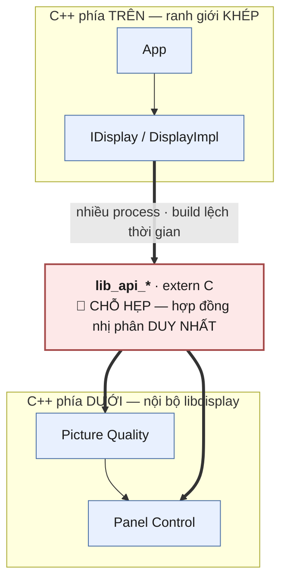
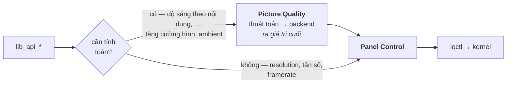
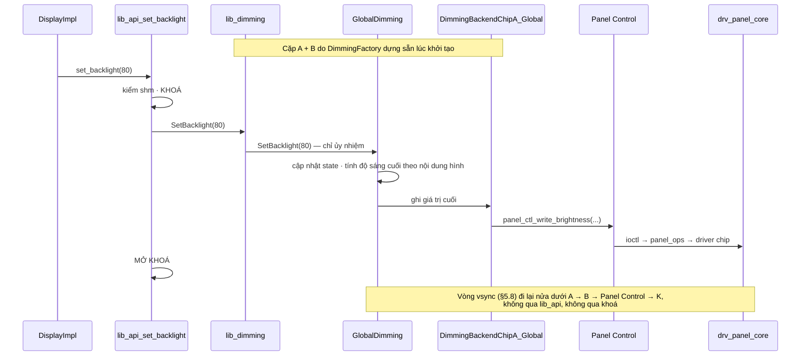
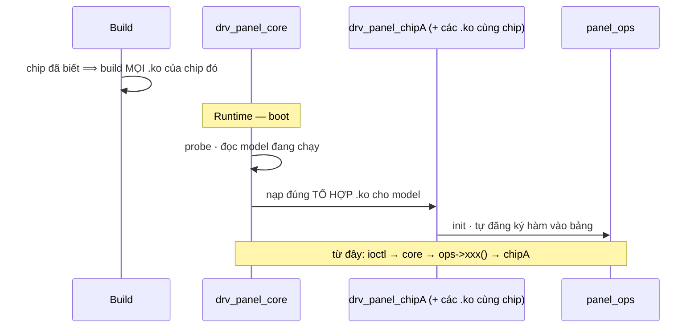

# A1 — Kiến trúc TIÊU CHUẨN: `libdisplay`

> 🅰️ **PHẦN A — TIÊU CHUẨN.** Tài liệu này mô tả **hệ thật đang chạy trong sản phẩm**, đã khử nhạy cảm, kèm cả điểm mạnh lẫn điểm yếu.
> Muốn xem **"cùng bối cảnh, làm lại thì thế nào"** → [🅱️ B1-redesign-architecture.md](B1-redesign-architecture.md).
> Ranh giới C++ interface/impl ở **Tầng 0** có bộ khung chạy được + 5 bài lab → [A2-cpp-interface-hal.md](A2-cpp-interface-hal.md).
> Viết cho **phỏng vấn C++ / Design Pattern**: mỗi thuật ngữ chuyên ngành display chỉ xuất hiện khi nó mang một luận điểm thiết kế.

> **TL;DR**
> - `libdisplay` là `.so` điều khiển màn hình cho **nhiều dòng sản phẩm × hơn 10 dòng chip × nhiều process caller**. Câu hỏi kiến trúc trung tâm: *cô lập cái gì, ở đâu?*
> - **Ba ranh giới, ba hợp đồng:** app ↔ `IDisplay` là ranh giới **khép**, dùng **C++**. `IDisplay` ↔ library là ranh giới **mở**, dùng **C** (`lib_api_*`). Library ↔ kernel dùng **ioctl**. Mọi C++ đa hình bên trong library **không phải ABI** ⟹ refactor tự do.
> - **Sau mặt tiền C có hai component, chia theo lượng logic:**
>   - **Picture Quality (PQ)**: dimming là chính. Nặng thuật toán, có state, chạy theo từng khung hình.
>   - **Panel Control**: lệnh đơn như nguồn panel, resolution, frame rate, ghi độ sáng — `ioctl` xuống **panel driver** trong kernel.
>   - PQ tính xong giá trị cuối thì **cũng ghi qua Panel Control** ⟹ Panel Control là **cổng duy nhất** xuống phần cứng.
> - ⭐ **Cùng một ý tưởng xuất hiện hai lần:** *phần chung không biết tên chip + phần theo chip cắm vào sau*.
>   - Ở dimming: **Bridge** bằng `virtual`.
>   - Ở kernel: **bảng con trỏ hàm `panel_ops`**, tức vtable viết tay bằng C.
>   - Cả hai đều **chốt chip lúc build**, **chốt tổ hợp theo model lúc chạy**.
> - 5 điểm yếu nên **chủ động nêu** (§9) — đầu vào của phần 🅱️.
> - 📦 **§11 — phụ lục mã nguồn build được** (`libdisplay_lab`: 27 file, có unit test + thí nghiệm TSan) — đối tượng cho lab CI.
> - 🗣️ **§10 — bản nói ba cấp độ dài** (30″ → 90″ → mở theo yêu cầu) + **bản đồ móc nền tảng**: mỗi câu kể thả một móc vào C/C++/Linux, đó cũng là danh sách ôn.

> 🔒 **Đây là bản ĐÃ KHỬ NHẠY CẢM — và là bản duy nhất được commit.** Mọi định danh (`libdisplay`, `lib_api_*`, `IDimmingAlgo`, `ChipA`…) là **tên tài liệu**; **kiến trúc giữ nguyên**.
> **Khi kể ở phỏng vấn:** nói được **kiến trúc · pattern · đánh đổi**; **không** nói tên sản phẩm/khách hàng, tên symbol nội bộ, thuật toán dimming độc quyền, hay số liệu chưa công bố. Nêu đúng ranh giới này là **điểm cộng**.

---

## 1. `libdisplay` là gì — một câu

Một shared library (`.so`) điều khiển màn hình, gồm **chất lượng hình ảnh** (dimming, video enhancement, ambient) và **điều khiển panel** (nguồn, resolution, tần số, framerate, độ sáng). Nó dùng chung cho nhiều loại sản phẩm (TV, Signage, Monitor), trên hơn 10 dòng chip và nhiều đời OS nền.

**Vị trí trong stack — điểm dễ hiểu nhầm:** app **không** gọi thẳng `libdisplay`. App gọi **C++ interface `IDisplay`** do module platform cung cấp; **implementation của nó (`DisplayImpl`)** mới là bên gọi `lib_api_*`.

---

## 2. 🗺️ Một sơ đồ — từ app xuống phần cứng

> Đây là sơ đồ duy nhất cần vẽ được trên bảng. Mọi mục sau là **phóng to một ô** của nó.


```mermaid
flowchart TD
    APP["<b>App</b>"]
    T0["<b>IDisplay / DisplayImpl</b><br/><i>C++ interface — module platform</i>"]
    API["<b>lib_api_*</b> · extern C<br/>kiểm shm → <b>khoá</b> → điều phối → mở khoá<br/><b>mặt tiền công khai DUY NHẤT</b>"]

    subgraph LIB["libdisplay — C++ NỘI BỘ, không phải ABI"]
        subgraph PQ["PICTURE QUALITY — nặng logic"]
            DIM["lib_dimming<br/><i>ủy nhiệm</i>"]
            FAC["DimmingFactory<br/><i>chọn cặp theo model</i>"]
            ALG["IDimmingAlgo<br/>Global · Local · OLED<br/><i>thuật toán — chung mọi chip</i>"]
            BE["IDimmingBackend<br/>DimmingBackendChipA_Global …<br/><i>ghi phần cứng — theo chip</i>"]
            VS["vòng vsync<br/><i>mỗi khung hình</i>"]
            DIM --> FAC
            FAC --> ALG
            FAC --> BE
            ALG ==>|"BRIDGE"| BE
            VS -.-> ALG
        end
        DC["<b>PANEL CONTROL</b> · panel_ctl_*<br/><i>một lệnh → ioctl</i>"]
    end

    subgraph KER["KERNEL"]
        CORE["<b>drv_panel_core</b><br/><i>driver nền — không biết tên chip</i>"]
        OPS["<b>panel_ops</b><br/><i>bảng con trỏ hàm = vtable viết tay</i>"]
        CHIP["<b>drv_panel_chipA</b> …<br/><i>nạp đúng tổ hợp lúc probe, tự đăng ký</i>"]
        CORE --> OPS --> CHIP
    end

    HW["Phần cứng panel"]
    SHM[("shared memory + named semaphore<br/><i>state dùng chung mọi process</i>")]

    APP ==>|"<b>RANH GIỚI 1 — KHÉP</b> · C++"| T0
    T0 ==>|"<b>RANH GIỚI 2 — MỞ</b> · chỉ C"| API
    API -->|"cần tính toán"| DIM
    API -->|"một lệnh — đi thẳng"| DC
    BE -->|"giá trị độ sáng cuối"| DC
    DC ==>|"<b>RANH GIỚI 3</b> · ioctl"| CORE
    CHIP --> HW
    SHM -.-> API
    SHM -.-> PQ
```

**Đọc sơ đồ — ba thứ phải thấy:**

1. **Ba ranh giới, mỗi cái một ngôn ngữ hợp đồng**: C++ (khép) → C (mở) → ioctl (user/kernel). Vì sao từng cái: §3.
2. **Hai tuyến sau mặt tiền**: việc cần tính toán đi qua PQ, việc một lệnh đi thẳng Panel Control. Hai tuyến **hội tụ ở Panel Control**: §4.
3. **Cùng một hình dạng lặp hai lần**: `IDimmingAlgo ⟹ IDimmingBackend` ở user-space, `drv_panel_core ⟹ panel_ops ⟹ drv_panel_chipA` ở kernel. Phần chung không biết chip, phần theo chip cắm vào sau: §5, §6.

| Tầng | Là gì | Hợp đồng |
|---|---|---|
| 0 | `IDisplay` / `DisplayImpl` — interface cho app | **C++** — ranh giới khép |
| **1** | `lib_api_*` (`lib_api.h`) — **mặt tiền**, khoá, chọn tuyến | 🔴 **C** — ranh giới mở |
| 2 | **PQ**: `lib_dimming_interface` → `lib_dimming` → `DimmingFactory` → `IDimmingAlgo` ⇄ `IDimmingBackend` | C++ nội bộ |
| 3 | **Panel Control**: các hàm `panel_ctl_*` — gói tham số thành `ioctl` | C++ nội bộ → **ioctl** |
| 4 | **Kernel**: `drv_panel_core` + `panel_ops` + `drv_panel_chipX` | C — bảng con trỏ hàm |
| ⊥ | `display_shm_info` trong shared memory + named semaphore | **cắt ngang** Tầng 1–2 |

---

## 3. Ranh giới: narrow waist hai tầng — vì sao C++ → C → C++

Phần này trả lời câu *"chuyển C++ → C → C++ nghe có vẻ vòng vo?"*. Hình dung một **đồng hồ cát**: hai đầu rộng, ở giữa là chỗ hẹp nhất và ổn định nhất.


```mermaid
flowchart TD
    subgraph TREN["C++ phía TRÊN — ranh giới KHÉP"]
        A["App"] --> B["IDisplay / DisplayImpl"]
    end
    D["<b>lib_api_*</b> · extern C<br/>🔴 CHỖ HẸP — hợp đồng nhị phân DUY NHẤT"]
    subgraph DUOI["C++ phía DƯỚI — nội bộ libdisplay"]
        E["Picture Quality"]
        G["Panel Control"]
        E --> G
    end
    B ==>|"nhiều process · build lệch thời gian"| D
    D ==> E
    D ==> G

    classDef waist fill:#fde8e8,stroke:#a54a4a,stroke-width:2px,color:#1a1a1a
    classDef cpp   fill:#e8f0fe,stroke:#4a6fa5,color:#1a1a1a
    class D waist
    class A,B,E,G cpp
```

| Vùng | Hợp đồng | Vì sao |
|---|---|---|
| **Trên** — app → `IDisplay` | **C++** | **Khép**: cùng team, cùng toolchain, build cùng lúc ⟹ vtable/STL khớp nhau được **quy định build** bảo đảm |
| 🔴 **Chỗ hẹp** — `lib_api_*` | **C** | **Mở**: nhiều process, build lệch thời gian ⟹ chỉ C ổn định về nhị phân |
| **Dưới** — PQ + Panel Control | **C++** | Không ai ngoài nhìn thấy ⟹ **không phải ABI** |

⟹ Hai đầu đều **rộng** (dùng đủ C++); chỉ **chỗ hẹp** phải giữ vĩnh viễn. Mỗi bên refactor phía mình mà không kéo bên kia build lại.

### 3.1 Ranh giới mở — vì sao chỉ C

`libdisplay` được link vào **nhiều process** (TV service, factory, menu, daemon, tool test…), build **lúc khác, team khác, có thể toolchain khác**:

| | Phơi **C++ interface** qua `.so` | **`extern "C"`** |
|---|---|---|
| Tên symbol | **Name mangling** — khác giữa compiler/version | Chuẩn, không mangling |
| Bảng virtual | Thêm/bớt/đổi thứ tự virtual = **ABI break im lặng** | **Không có vtable** ở ranh giới |
| Kiểu dữ liệu | `std::string`/`std::vector` kéo theo ABI của STL bên build | Struct + primitive |
| Ai build được | Chỉ bên **cùng toolchain, cùng phiên bản** | **Bất kỳ** compiler nào, kể cả C thuần |

> 🔴 **Nối thẳng với thí nghiệm đã đo bằng máy ở [A2](A2-cpp-interface-hal.md)** — khi phơi C++ interface qua `.so`:
> - **[A2 §3.3]** chèn một virtual vào **giữa** ⟹ app gọi `setPower()` mà **destructor chạy**; không crash, exit 0, không log.
> - **[A2 Lab 3a]** hỏng **kể cả khi version hai bên báo khớp**, vì version nói về *số lượng API*, không nói về *thứ tự slot*.
>
> `libdisplay` **miễn nhiễm** với cả lớp bug đó vì **không vtable nào đi qua ranh giới**.

### 3.2 ⭐ Hệ quả ít người nói ra — chỗ ăn điểm

| | Phơi C++ interface | **`libdisplay` (mặt tiền C)** |
|---|---|---|
| Thêm virtual vào `IDimmingAlgo` | 🔴 ABI break | ✅ **Tự do** |
| Đổi kế thừa / thêm class / tách component | 🔴 Rủi ro layout | ✅ Tự do |
| Caller phải build lại khi library đổi | Thường **có** | ❌ **Không** — C API là *compilation firewall* |
| Thứ **vẫn** phải giữ vĩnh viễn | Rất nhiều | Chữ ký `lib_api_*` + layout struct công khai |

⟹ **Chính vì thế `libdisplay` mới dám có `IDimmingAlgo` ~150 virtual.** Cũng vì thế mọi đề xuất cải tiến ở phần 🅱️ **không đụng tới caller nào**.

Cùng mô hình với cả ngành: Vulkan, SQLite, libdrm đều là **C API** được app C++ bọc lại.

> **Quy tắc một câu:** *ranh giới **mở** → **C**; ranh giới **khép** → **C++ interface** được phép.*

### 3.3 Lý do thứ hai: C API là điểm khoá DUY NHẤT cho caller

Mỗi hàm `lib_api_*` là một **Facade** gói trọn *kiểm shared memory → khoá semaphore → điều phối → mở khoá* (code ở §4.3).

⭐ **Nếu phơi thẳng C++ interface ra ngoài, caller gọi thẳng method và BYPASS semaphore** — mất cơ chế chống race giữa các process. Tức là chọn mặt tiền C **không chỉ vì ABI** mà còn vì nó là **chỗ duy nhất ép được mọi lời gọi đi qua khoá**. Lập luận hai tầng này là dạng trả lời phân biệt được ứng viên.

> ⚠️ **Ngoại lệ phải tự nói ra:** vòng vsync (§5.8) chạy **bên trong** library, không đi qua `lib_api_*` ⟹ không được khoá ở mặt tiền bảo vệ. "Duy nhất" đúng cho **caller bên ngoài**, không đúng cho **mọi đường chạm state** (điểm yếu #5).

---

## 4. Hai component: Picture Quality và Panel Control

> Câu interviewer hay hỏi nhất về một library nhiều tính năng: *"vì sao chỗ này có cả cây class, chỗ kia chỉ là một hàm gọi thẳng?"*. Mục này là câu trả lời.

### 4.1 Quy tắc chọn tuyến — một câu

> **Cần tính toán, giữ state, bám theo từng khung hình ⟹ đi qua PQ. Một lệnh, không state, gửi xong là xong ⟹ đi thẳng Panel Control.**
> Hai tuyến **gặp nhau ở Panel Control**: PQ tính xong giá trị cuối rồi cũng gọi Panel Control để chạm phần cứng.


```mermaid
flowchart LR
    API["lib_api_*"]
    Q{"cần tính<br/>toán?"}
    PQ["<b>Picture Quality</b><br/>thuật toán → backend<br/><i>ra giá trị cuối</i>"]
    DC["<b>Panel Control</b>"]
    K["ioctl → kernel"]
    API --> Q
    Q -->|"có — độ sáng theo nội dung,<br/>tăng cường hình, ambient"| PQ --> DC
    Q -->|"không — resolution, tần số,<br/>framerate"| DC
    DC --> K
```

| | **Picture Quality** (dimming là chính) | **Panel Control** |
|---|---|---|
| Bản chất | **Tính** ra giá trị từ nội dung hình | **Truyền** một lệnh xuống driver |
| Logic | Nặng — thuật toán, chuyển tiếp mượt | Gần như không — đóng gói tham số → `ioctl` |
| State | Có — trong shared memory, kéo dài qua nhiều khung hình | Không — driver/phần cứng giữ |
| Nhịp chạy | Theo lời gọi API **và** theo vòng vsync riêng | Chỉ khi có lệnh |
| Pattern | Bridge · Abstract Factory · Strategy · Null Object | **Cố ý không dùng** (§4.4) |

Video enhancement và ambient **cùng khung với dimming**: hợp đồng module → module ủy nhiệm → thuật toán + phần ghi phần cứng theo chip → gọi Panel Control. Ở phỏng vấn chỉ cần một câu: *"dimming là ví dụ đầy đủ nhất, hai module kia cùng khung."*

### 4.2 Lệnh của Panel Control — hai nhóm

| Nhóm | Lệnh | Ai gọi |
|---|---|---|
| **Công khai** — đi thẳng từ `lib_api_*` | nguồn panel, resolution, tần số, framerate | Mặt tiền |
| **Nội bộ** — chỉ PQ gọi | ghi giá trị độ sáng cuối xuống phần cứng | Backend của PQ |

⟹ Câu trả lời khi bị hỏi *"độ sáng đi đường nào?"*: **app xin độ sáng thì đi qua PQ**, vì độ sáng phải tính theo nội dung hình. **Panel Control chỉ là chỗ ghi giá trị cuối.**

⚠️ Hai nhóm này hiện là **quy ước**, code không ép. Đó là điểm yếu #2 (§9).

### 4.3 Hai tuyến trong code

**Tuyến PQ** — đi qua module, module tính rồi mới chạm Panel Control:

```cpp
// src_com/lib_api.cpp
int32_t lib_api_set_backlight(int backlight) {
    int32_t ret = LIB_OK;
    if (get_check_shm() == -1) return -1;                 // shared memory sẵn sàng?
    int sem_ret = lib_sem_lock(__FUNCTION__);             // KHOÁ (liên process)

    if (get_dimming_instance() != NULL)
        ret = get_dimming_instance()->SetBacklight(backlight);            // PQ: đa hình
    if (get_video_enhancement_instance() != NULL)
        ret = get_video_enhancement_instance()->SetBacklight(backlight);  // module thứ hai cũng nghe

    if (sem_ret == 0) lib_sem_unlock(__FUNCTION__);       // MO KHOA
    return ret;
}
```

**Tuyến Panel Control** — một lệnh, đi thẳng *(tên hàm Panel Control là minh hoạ)*:

```cpp
// src_com/lib_api.cpp
int32_t lib_api_set_frequency(int hz) {
    if (get_check_shm() == -1) return -1;
    int sem_ret = lib_sem_lock(__FUNCTION__);
    int32_t ret = panel_ctl_set_frequency(hz);                   // Panel Control thẳng — không qua module nào
    if (sem_ret == 0) lib_sem_unlock(__FUNCTION__);
    return ret;
}

// src_com/panel_control.cpp
int32_t panel_ctl_set_frequency(int hz) {
    panel_freq_t arg;
    arg.hz = hz;
    return ioctl(g_panel_fd, PANEL_IOC_SET_FREQ, &arg);  // xuong drv_panel_core
}
```

⟹ Hai hàm `lib_api_*` **cùng một khuôn** (shm → khoá → việc → mở khoá), chỉ khác phần "việc". Đó là lý do khuôn này sống ở **mặt tiền** chứ không rải xuống từng module.

### 4.4 ⭐ Panel Control — cố ý KHÔNG dùng pattern

Các hàm `panel_ctl_*` là **hàm tự do**: không interface, không factory, không đa hình. Đây là quyết định đúng, không phải thiếu sót ([DP-024](../../14-prep/mock-interview/bank/design-patterns.md)):

- Trừu tượng hoá phải **trả giá cho một biến thể đang tồn tại**.
- Panel Control **có** biến thể theo chip, nhưng biến thể đó đã được **kernel driver hấp thụ**: một bộ ioctl chung, mỗi chip một driver (§6).
- ⟹ Ở user-space không còn gì để trừu tượng. Bọc thêm interface là trả giá (indirection, thêm file, test double) để mua **số không**.

⭐ Còn PQ thì **không** đẩy xuống kernel được: thuật toán là **chính sách** (policy), mà policy thuộc user-space. Câu ăn điểm: *"logic nặng đẩy lên user-space, thao tác phần cứng mỏng giữ trong kernel."*

> 🗣️ *"Ở đây tôi cố ý không dùng pattern, vì…"* là tín hiệu senior rõ hơn kể tên năm pattern.

---

## 5. 🎯 Case study: dimming — phóng to nhánh PQ

### 5.0 Tóm tắt một đoạn

Dimming là việc điều khiển độ sáng đèn nền theo nội dung hình. Đường đi: `lib_api_set_backlight` → `lib_dimming` (ủy nhiệm) → cặp object do `DimmingFactory` dựng.
- **Thuật toán** `IDimmingAlgo` (Global/Local/OLED): logic nặng, **viết một lần**, mọi chip dùng chung.
- **Backend** `DimmingBackendChipX_AlgoY`: **chỉ ghi phần cứng**, theo chip × thuật toán. ⚠️ **Không mỏng**: backend Local dày ngang thuật toán (§5.4).
- Thuật toán giữ con trỏ tới backend ⟹ **Bridge** tách *logic* khỏi *phần cứng*.

`DimmingFactory` là **Abstract Factory + Meyers Singleton**: chip chốt lúc build, cặp thuật toán + backend chốt lúc runtime theo model. Platform không có panel thì dùng chính base class làm **Null Object**. Ngoài lời gọi API, thuật toán còn được **vòng vsync** gọi mỗi khung hình.

### 5.1 Một lời gọi đi qua những gì


```mermaid
sequenceDiagram
    participant P as DisplayImpl
    participant API as lib_api_set_backlight
    participant D as lib_dimming
    participant A as GlobalDimming
    participant B as DimmingBackendChipA_Global
    participant DC as Panel Control
    participant K as drv_panel_core

    Note over D,B: Cặp A + B do DimmingFactory dựng sẵn lúc khởi tạo
    P->>API: set_backlight(80)
    API->>API: kiểm shm · KHOÁ
    API->>D: SetBacklight(80)
    D->>A: SetBacklight(80) — chỉ ủy nhiệm
    A->>A: cập nhật state · tính độ sáng cuối theo nội dung hình
    A->>B: ghi giá trị cuối
    B->>DC: panel_ctl_write_brightness(...)
    DC->>K: ioctl → panel_ops → driver chip
    API->>API: MỞ KHOÁ
    Note over A,K: Vòng vsync (§5.8) đi lại nửa dưới A → B → Panel Control → K,<br/>không qua lib_api, không qua khoá
```

### 5.2 Vấn đề: hai trục biến thiên, chốt ở hai thời điểm

| Trục | Biến thiên theo | Chốt khi nào | Ai chọn |
|---|---|---|---|
| **Thuật toán** | Model (loại đèn nền của panel) | **Runtime** — đọc lúc khởi tạo | `DimmingFactory` |
| **Chip** | SoC ghi phần cứng kiểu gì | **Build** — một binary chỉ chứa một chip | **CMake** chọn thư mục `Backend/ChipX/` |

Gộp logic và ghi phần cứng vào cùng class ⟹ `GlobalDimmingChipA`, `LocalDimmingChipB`… Có **N × M lớp đều nặng**, thuật toán bị **chép M lần**, sửa một bug thuật toán phải sửa M chỗ.

⭐ **Ý hay đáng nói:** trục nào không bao giờ đổi trên một sản phẩm (chip) thì **chốt sớm nhất có thể, bằng build system**, nên binary không chứa byte nào cho chip khác. Trục nào đổi theo model thì chốt bằng code lúc chạy.

### 5.3 Bridge — thuật toán × backend, ghép bằng composition

**Abstraction — thuật toán (logic nặng, chung mọi chip):**

```cpp
// dimming/Common/IDimmingAlgo.h
class IDimmingAlgo {
public:
    virtual ~IDimmingAlgo();
    virtual uint32_t SetBacklight(int32_t backlight);
    // ... ~150 methods ...
    virtual void t_vSyncCallBack();          // vòng vsync gọi mỗi khung hình
};

// dimming/Common/GlobalDimming.h
class GlobalDimming : public IDimmingAlgo {
public:
    GlobalDimming(IDimmingBackend* pDimmingBackend, DimmingType_k eDetectedDimming);
protected:
    GlobalDimmingForShm&    Shm;                 // state trong shared memory
    DimmingVendorInterface* m_pDimmingVendor;    // đọc thống kê độ sáng khung hình
    IDimmingBackend*        m_pDimmingBackend;   // ⬅️ CÂY CẦU sang phần cứng
};

GlobalDimming::GlobalDimming(IDimmingBackend* pDimmingBackend,
                             DimmingType_k eDetectedDimming)
    : Shm(get_lib_shm()->shmGlobalDimming) {
    m_pDimmingBackend = pDimmingBackend;         // GHÉP lúc runtime
    m_pDimmingVendor  = DimmingVendor::GetInstance();
}
```

**Implementor — phần ghi phần cứng (theo chip × thuật toán, không mỏng — xem §5.4):**

```cpp
// dimming/Backend/IDimmingBackend.h
class IDimmingBackend {
public:
    virtual ~IDimmingBackend();
    // nhóm Local
    virtual uint32_t t_InitLocalDimming();
    virtual uint32_t t_SetLdFinalDuty(BackendLdFinalDuty_t* pInputData);
    // nhóm Global
    virtual uint32_t t_InitGlobalDimming();
    virtual uint32_t t_Set2DFinalDuty(BackendGd2DFinalDuty_t* pInputData);
};

// dimming/Backend/ChipA/DimmingBackendChipA_Global.h — chỉ build khi CMake chọn ChipA
class DimmingBackendChipA_Global : public IDimmingBackend {
public:
    uint32_t t_InitGlobalDimming() override;
    uint32_t t_Set2DFinalDuty(BackendGd2DFinalDuty_t* pInputData) override;  // -> gọi Panel Control
};
```

Mỗi `ChipX_AlgoY` chỉ override **nhóm method của thuật toán mình**, rồi gọi **Panel Control** để chạm phần cứng. Backend **không tự gọi `ioctl`**.

> ⭐ **Đối chiếu lý thuyết:** ví dụ `IDimmingBackend` ở [structural §1](../structural.md) **gần như trùng khớp** với hệ thật. Câu kể mạnh: *"tôi nhận ra cấu trúc mình đang bảo trì chính là Bridge, sau khi đọc lại định nghĩa."*

### 5.4 ⚠️ Bridge ở đây không phẳng như sách — và nói thẳng ra

Bridge sách vở hứa **N + M** lớp, vì implementor chỉ biến thiên theo chip. Ở đây backend biến thiên theo **chip × thuật toán**, vì cách ghi phần cứng của từng thuật toán khác hẳn nhau: Global ghi **một** giá trị, Local ghi **từng vùng** màn hình.

> 📏 **Cỡ thật của hệ** (đếm source, làm tròn) — backend **không mỏng**:
> - Thuật toán: Global khoảng **7,6 nghìn** dòng, Local khoảng **8,6 nghìn** dòng — **mỗi cái viết một lần**.
> - Backend Global: khoảng **0,8–1,1 nghìn** dòng **mỗi chip**.
> - Backend Local: khoảng **4–8,5 nghìn** dòng **mỗi chip × biến thể panel** ⟹ **dày ngang thuật toán**.

| | Gộp logic + phần cứng | Bridge sách | **Hệ thật** |
|---|---|---|---|
| Số lớp | N × M — mỗi lớp chứa **cả thuật toán** | N + M | N thuật toán + N × M backend |
| Độ dày phần bị nhân | Cả thuật toán bị chép theo từng chip | — | Backend; **Local dày ngang thuật toán** |
| Sửa bug thuật toán | **M chỗ** | 1 chỗ | **1 chỗ** |
| Thêm 1 chip | +N lớp, **chép lại mọi thuật toán** | +1 | +N backend, **không chép thuật toán** |

⭐ **Cách nói ăn điểm:** *"Mục tiêu của Bridge ở đây không phải con số N+M, mà là **thuật toán chỉ viết một lần cho mọi chip**. Backend nhân theo chip × thuật toán vì phần cứng Local khác nhau thật giữa các chip, và nó không mỏng: backend Local dày ngang thuật toán. Không có Bridge thì **cả thuật toán** bị chép theo từng chip."*

> 🚫 **Rút gọn bằng cách bỏ bớt, không rút gọn thành sai:** không nói *"N + M"* hay *"backend chỉ vài chục dòng"*. Muốn kể ngắn thì nói *"em kể bản 30 giây, phần nào anh muốn thì em mở ra"*.

### 5.5 Strategy và Bridge cùng tồn tại — hai vai khác nhau

Câu phân loại kinh điển ([DP-038](../../14-prep/mock-interview/bank/design-patterns.md)): **code trông giống hệt, ý định khác nhau.**

| | `IDimmingAlgo` | `IDimmingBackend` |
|---|---|---|
| Vai | **Strategy** — thuật toán thay thế được theo model | **Bridge implementor** — nửa phần cứng của cùng một thứ |
| Chạy được nếu thiếu? | Có bản base không làm gì | **Không** — thuật toán *cần* backend mới chạm được phần cứng |
| Gắn khi nào | Chọn lúc khởi tạo (runtime) | Lớp có trong binary chốt lúc build; instance gắn qua constructor |

### 5.6 `DimmingFactory` — Abstract Factory + Meyers Singleton

Mỗi thư mục chip `Backend/ChipX/` có **một `DimmingFactory` riêng** chứa mọi tổ hợp thuật toán × backend mà chip đó hỗ trợ:
- **Build:** CMake chỉ build `DimmingFactory` (và các backend) của chip đích.
- **Runtime:** factory chọn **cặp** khớp nhau theo model, rồi sở hữu cặp ấy.

```cpp
// dimming/Backend/ChipA/DimmingFactory.cpp   (rút gọn — tên hàm/hằng minh hoạ)
DimmingFactory::DimmingFactory() {
    DimmingType_k type = detect_dimming_type();       // theo model — runtime
    switch (type) {
    case DIMMING_GLOBAL:
        m_pDimmingBackend = new DimmingBackendChipA_Global();
        m_pDimmingObject  = new GlobalDimming(m_pDimmingBackend, type);
        break;
    case DIMMING_LOCAL:
        m_pDimmingBackend = new DimmingBackendChipA_Local();
        m_pDimmingObject  = new LocalDimming(m_pDimmingBackend, type);
        break;
    case DIMMING_OLED:
        m_pDimmingBackend = new DimmingBackendChipA_OLED();
        m_pDimmingObject  = new OLEDDimming(m_pDimmingBackend, type);
        break;
    }
}

IDimmingAlgo* DimmingFactory::GetDimmingInstance() {
    static DimmingFactory instance;   // Meyers singleton — thread-safe từ C++11
    return instance.GetDimmingObject();
}
```

⭐ **Vì sao là Abstract Factory, không chỉ Factory Method:** nó tạo **cả cặp phải khớp nhau**.
- Ghép `GlobalDimming` với `DimmingBackendChipA_Local` vẫn **compile sạch**, vì kiểu đều là `IDimmingBackend*`.
- Backend Local không override nhóm Global, nên mọi lệnh ghi rơi vào thân mặc định ⟹ **đèn không đổi, không lỗi, không log**.
- Lỗi đó bị chặn vì **cả cặp chỉ được tạo ở một chỗ** ([DP-022](../../14-prep/mock-interview/bank/design-patterns.md)).

> **Cái giá của "mỗi chip một bản":** logic chọn thuật toán theo model nằm trong **mỗi** bản ⟹ lặp M lần (điểm yếu #3).

### 5.7 `lib_dimming` — ủy nhiệm + Null Object bằng chính base class

```cpp
// dimming/Base/lib_dimming.cpp
lib_dimming::lib_dimming() : Shm(get_lib_shm()->shmDimming) {
    get_platform_info(&Shm.m_iPlatformType);
    if (Shm.m_iPlatformType == PLATFORM_NO_PANEL)
        m_pDimmingPanel = new IDimmingAlgo();                    // ⬅️ NULL OBJECT
    else
        m_pDimmingPanel = DimmingFactory::GetDimmingInstance();
}

uint32_t lib_dimming::SetAmbientMode(int32_t mode) {
    CHECK_DIMMING_FLAG_CREATE(m_bFlagCreate);
    return m_pDimmingPanel->SetAmbientMode(mode);                // chỉ uỷ nhiệm
}
```

Base class (`IDimmingAlgo`, và cả `lib_*_interface`) **không** abstract thuần: mọi method có thân `return LIB_OK`. Platform không panel ⟹ `new IDimmingAlgo()` ⟹ cả ~150 API thành **no-op thành công**. Không cần nhánh `if` ở 150 chỗ gọi, không segfault.

⚠️ Ba điểm phải nói kèm:
- **Null Object ở đây là chính lớp cơ sở**, không phải class riêng. Rẻ, nhưng base vừa là *hợp đồng* vừa là *implementation mặc định* — hai trách nhiệm một chỗ ([SRP](../solid-principles.md)).
- **Trả `LIB_OK` cho việc không làm là quyết định có rủi ro**: caller không phân biệt *"đã đặt"* với *"không hỗ trợ"*. HAL ở [A2](A2-cpp-interface-hal.md) chọn `-ENOTSUP`. Nêu **cả hai lựa chọn và lý do**: ở đây nghiêng về `LIB_OK` vì hàng trăm điểm gọi có sẵn sẽ bắt đầu báo lỗi nếu đổi.
- 🟢 **Ở `libdisplay` cách này an toàn về ABI**, khác HAL: không vtable nào đi qua `.so` từ ngoài, nên không có *"vtable ngắn hơn ⟹ segfault"* như [A2 Lab 3b](A2-cpp-interface-hal.md). Cùng pattern, hai bối cảnh ABI, hai mức rủi ro.

`lib_dimming_interface` → `lib_dimming` ở tầng trên chỉ có **một** implementation thật. **Một biến thể thì chưa phải Strategy**: đây là **Dependency Inversion** ([solid §5](../solid-principles.md)) + ủy nhiệm, còn biến thiên thật nằm ở tầng thuật toán.

### 5.8 Vòng vsync — nguồn kích hoạt thứ hai

Độ sáng phải bám nội dung **từng khung hình**, nên ngoài lời gọi API còn một vòng chạy theo vsync (tín hiệu báo mỗi khung hình mới):

| | Lời gọi API | Vòng vsync |
|---|---|---|
| Ai kích hoạt | Caller qua `lib_api_*` | Library tự chạy — `t_vSyncCallBack()` |
| Khởi động | Mỗi lần gọi | **Một lần**, khi `.so` được nạp |
| Đi qua | Mặt tiền → khoá → module → thuật toán → backend → Panel Control | **Thẳng** thuật toán → backend → Panel Control — **không qua khoá** |
| Bao nhiêu bản | Mỗi process tự gọi | **Một vòng cho cả hệ**: process khác nạp `.so` ⟹ vòng **reset, chạy lại trong process mới** |

⭐ **Hệ quả đáng nói:** vòng vsync đổi process mà thuật toán **không mất trí nhớ**, vì mọi state nằm trong shared memory (§7.2). Đây là luận cứ mạnh nhất cho việc đặt state vào shared memory thay vì vào object.

> 🔎 **Đã kiểm ở source thật: vòng vsync đọc/ghi state không có khoá nào bảo vệ.**
> - **Đường API:** mọi hàm mặt tiền `lib_api_*` (vài trăm hàm) đều lấy named semaphore.
> - **Đường vsync:** `lib_dimming` gọi `t_vSyncCallBack()` của lớp thuật toán; hàm này đọc/ghi `Shm` **không** lấy semaphore.
> - Có một `pthread_mutex` bao quanh callback, nhưng đó là mutex **riêng của thread vsync**: mặc định process-private, chỉ để cặp với condition variable cho thread chính đánh thức mỗi khung hình. Đường API **không bao giờ** lấy mutex này ⟹ nó **không bảo vệ** state.
> - ⟹ Race xảy ra **ngay trong một process** (thread API ↔ thread vsync), chứ không chỉ giữa các process.
>
> ⚠️ **Bẫy khi đọc code:** thấy một mutex quanh callback rồi tưởng là đã được bảo vệ. Câu phải hỏi: *"mutex này còn ai khác lấy không?"*. Một khoá chỉ bảo vệ được bất biến khi **mọi** đường chạm vào state đều lấy **cùng** khoá đó. Vì sao đổi mọi field sang `std::atomic` cũng không đủ: [DP-049](../../14-prep/mock-interview/bank/design-patterns.md). Cách vá: [B1 §6](B1-redesign-architecture.md).

---

## 6. Kernel — HAL bằng C: cùng hình dạng, viết tay

> Mục này chỉ giữ phần **liên quan C++/Design Pattern**. Phần riêng của kernel (ranh giới license GPL, thứ tự nạp module, cửa sổ bảng còn rỗng) đã có đầy đủ ở [whiteboard D4](../../14-prep/whiteboard.md).

### 6.1 Ba thành phần

| Thành phần | Vai | Biết tên chip? |
|---|---|---|
| **`drv_panel_core`** | Driver nền: nhận `ioctl` từ Panel Control, gọi `ops->xxx()` | ❌ **Không** |
| **`panel_ops`** | Bảng con trỏ hàm — **vtable viết tay bằng C** | — |
| **`drv_panel_chipX`** | Driver thật của từng chip (hơn 10 loại); lúc init **tự điền hàm của mình** vào `panel_ops` | ✅ chỉ chip của nó |

*(Giữa `core` và bảng còn một module trung gian `drv_panel_shim` giữ bảng — tồn tại vì lý do license, xem whiteboard D4.)*

### 6.2 Vòng đời — chốt chip lúc build, chốt tổ hợp lúc probe


```mermaid
sequenceDiagram
    participant B as Build
    participant C as drv_panel_core
    participant X as drv_panel_chipA (+ các .ko cùng chip)
    participant O as panel_ops

    B->>B: chip đã biết ⟹ build MỌI .ko của chip đó
    Note over C: Runtime — boot
    C->>C: probe · đọc model đang chạy
    C->>X: nạp đúng TỔ HỢP .ko cho model
    X->>O: init · tự đăng ký hàm vào bảng
    Note over C,O: từ đây: ioctl → core → ops->xxx() → chipA
```

### 6.3 ⭐ Cùng một ý tưởng, hai tầng, hai ngôn ngữ

Đây là bảng đáng mang vào phòng phỏng vấn nhất của cả tài liệu:

| | **User-space — dimming** | **Kernel — panel driver** |
|---|---|---|
| Phần chung, không biết chip | `IDimmingAlgo` (thuật toán) | `drv_panel_core` |
| Phần theo chip | `DimmingBackendChipX_AlgoY` | `drv_panel_chipX` |
| Cơ chế đa hình | `virtual` — vtable **compiler** dựng | `panel_ops` — vtable **viết tay** |
| Chip chốt khi | **Build** — CMake chọn thư mục | **Build** — chỉ build các `.ko` của chip |
| Tổ hợp theo model chốt khi | **Runtime** — `DimmingFactory` | **Runtime** — probe nạp đúng `.ko` |
| Ai ghép hai nửa | Factory **tạo** cặp (Abstract Factory) | Chip driver **tự đăng ký** (self-registration) |
| Hàm chip không hỗ trợ | Base class trả `LIB_OK` — **Null Object** | Slot `NULL` ⟹ **kernel oops** nếu bị gọi |

🗣️ **Câu chốt:** *"Cùng một quyết định — tách phần chung khỏi phần theo chip, chốt chip lúc build, chốt tổ hợp lúc chạy — xuất hiện ở hai tầng. Ở user-space bọn em dùng `virtual`, ở kernel dùng bảng con trỏ hàm, vì kernel viết bằng C."*

### 6.4 Hai rủi ro — đúng hai bài học C++ ở dạng C

| Rủi ro | Bài học C++ tương ứng | Chữa |
|---|---|---|
| Slot chip không hỗ trợ để `NULL`, gọi vào là **oops** | **Null Object** (§5.7) — ở user-space đã làm, ở kernel thì chưa | Điền sẵn cả bảng bằng stub trả `-ENOTSUP` + ghi log, chip driver ghi đè cái mình có |
| Chèn một hàm vào **giữa** `panel_ops` ⟹ mọi slot phía sau lệch | **vtable ABI** ([A2 §3.3](A2-cpp-interface-hal.md)) — y hệt chèn virtual vào giữa interface | Chỉ thêm vào **cuối** bảng; thêm trường `size`/`version` ở đầu struct để kiểm lúc đăng ký |

---

## 7. Cắt ngang: nhiều process dùng chung một library

### 7.1 Service Locator — không hẳn Singleton

```cpp
// src_algo/display/lib_base.cpp
static lib_dimming_interface           *dimming           = NULL;
static lib_video_enhancement_interface *video_enhancement = NULL;
static lib_ambient_interface           *ambient           = NULL;

lib_dimming_interface* get_dimming_instance() {
    if (dimming == NULL) lib_print(ERR, "dimming is NULL");
    return dimming;
}

void lib_init_modules() {             // chạy một lần, trong constructor của .so
    dimming           = new lib_dimming();
    video_enhancement = new lib_video_enhancement();
    ambient           = new lib_ambient();
    dimming->Create();  video_enhancement->Create();  ambient->Create();
}
```

⚠️ **Gọi tên đúng:**
- `get_*_instance()` là **Service Locator** trên con trỏ toàn cục, **không phải Singleton GoF**. Không gì *ép* tính duy nhất, chỉ có quy ước "chỉ `lib_init_modules()` gán".
- `lib_init_modules()` **không phải factory**, vì nó không lựa chọn gì. Nó chỉ là **chỗ duy nhất dựng toàn bộ object** (composition root). Lựa chọn thật nằm ở `DimmingFactory`.

⭐ **Không có data race**, khác `getInstance()` ở [A2 §3.2, Lab 1](A2-cpp-interface-hal.md) (race thật, đo được **178/200**). Lý do: khởi tạo chạy trong `__attribute__((constructor))`, **trước khi process tạo thread nào**. Đây là một cách chữa race khác magic statics: **dời khởi tạo ra khỏi vùng có cạnh tranh**.

### 7.2 Shared memory + semaphore — object per-process, state per-system

```cpp
// src_algo/display/lib_base.h
struct display_shm_info {
    int    init;
    int    ref_count;                       // đếm process toàn cục
    sem_t  sem_lib;                         // named semaphore dùng ở MỌI API
    DimmingForShm           shmDimming;          // state từng module
    GlobalDimmingForShm     shmGlobalDimming;    // state từng thuật toán
    VideoEnhancementForShm  shm_video_enhancement;
    char   prev_called_proc[20][255];       // lịch sử gọi — để debug deadlock
    // ...
};

// tự chạy khi process nạp library — caller không gọi init
void __attribute__((constructor)) lib_init()       { lib_init_device(); }  // + vòng vsync
void __attribute__((destructor))  lib_base_final() { /* teardown */ }
```

| | Con trỏ / object C++ | State thật |
|---|---|---|
| Sống ở đâu | **Mỗi process một bản** | **Shared memory** — một bản cho cả hệ |
| N process ⟹ | N object | **Một** state |
| Ai bảo vệ | (không cần) | **Named semaphore** |

⟹ *"Object là per-process, state là per-system."* Câu này gói cả kiến trúc, và trả lời thẳng [DP-020](../../14-prep/mock-interview/bank/design-patterns.md) (*"hai `.so` cùng include Singleton — mấy instance?"*).

Mỗi thuật toán giữ **reference** tới phần shared memory của nó, bind ngay trong danh sách khởi tạo: `GlobalDimming(...) : Shm(get_lib_shm()->shmGlobalDimming)`. Reference member thì không gán lại được ⟹ một object gắn đúng một vùng state, có chủ ý.

Đây **không phải** GoF pattern mà là idiom IPC của hệ nhúng nhiều process. Nhưng nó **quyết định hình dạng mọi pattern khác** (object rẻ và lặp lại, state duy nhất, khoá ở mặt tiền), nên phải nói ra **trước** khi nói pattern.

> 💡 `prev_called_proc` lưu lịch sử process đã gọi, để khi deadlock còn biết ai giữ khoá. Đây là chi tiết **thiết kế cho lúc debug**, rất "thực chiến" khi bị hỏi *"hệ này debug kiểu gì?"*.

⚠️ **Rủi ro của chính idiom này:** named semaphore **không có chủ sở hữu**. Một process chết khi đang giữ nó (crash, bị `kill -9`) thì kernel không biết phải nhả hộ ai ⟹ mọi process khác treo ở `lib_api_*` kế tiếp. Đó là lý do `prev_called_proc` tồn tại, và là câu interviewer sẽ khoan ([LNX-045](../../14-prep/mock-interview/bank/linux-sysprog.md)). Hệ bù thêm bằng timeout: một API giữ khoá quá **~7 giây** thì semaphore bị reset để các API khác chạy tiếp. Luật đó không phân biệt process **chết** với process chỉ **chậm**, và để nguyên state đang ghi dở — phân tích, output chạy thật và cách sửa ở [LNX-046](../../14-prep/mock-interview/bank/linux-sysprog.md). Cơ chế và ba cách xử lý: [ipc-linux §4.3](../../04-linux-system-programming/ipc-linux.md).

### 7.3 Hai khoá ở hai tầng — không thừa

Ngoài named semaphore ở mặt tiền, **driver kernel** của panel còn một mutex riêng. Nhìn qua thì giống khoá hai lần cho một việc:

| | Named semaphore ở `lib_api_*` | Mutex trong driver kernel |
|---|---|---|
| Bảo vệ | **State của library** trong shared memory + **trình tự nhiều bước** (đọc state → tính → ghi) | **Thanh ghi / bus** của thiết bị trong **một** lệnh `ioctl` |
| Phạm vi | Mọi process **dùng library** | **Mọi** bên mở thiết bị, kể cả tool không đi qua library |
| Thiếu nó thì | Hai process tính chồng lên nhau, state trong shm hỏng | Hai `ioctl` xen vào giữa một chuỗi ghi thanh ghi |

⟹ Khoá user-space bảo vệ **tính nhất quán của chính sách**. Khoá kernel bảo vệ **tính nguyên tử của từng lệnh phần cứng**. Không cái nào thay được cái kia ([DP-048](../../14-prep/mock-interview/bank/design-patterns.md)).

---

## 8. Bảng tổng kết — pattern nào, ở đâu, vì sao

| Pattern | Ở đâu | Giải vấn đề gì | Nhóm |
|---|---|---|---|
| **Facade** ⭐ | `lib_api_*` | Che trình tự `shm → khoá → điều phối → mở khoá`; che C++; giữ ABI C ổn định | structural |
| Adapter/Facade C++ | `IDisplay` / `DisplayImpl` | Bọc C API thành interface C++ cho app | structural |
| DIP + ủy nhiệm | `lib_*_interface` → `lib_*` | Mặt tiền không biết implementation | — |
| **Strategy** | `IDimmingAlgo` — Global/Local/OLED | Thuật toán theo model | behavioral |
| **Bridge** ⭐ | `IDimmingAlgo` × `IDimmingBackend` | Thuật toán viết một lần, phần ghi phần cứng theo chip | structural |
| **Abstract Factory + Singleton** | `DimmingFactory` | Tạo **cặp khớp** thuật toán + backend | creational |
| **Null Object** | Thân `return LIB_OK` ở base · `new IDimmingAlgo()` | Tính năng không có → no-op an toàn | behavioral |
| Service Locator | `get_*_instance()` | Truy cập instance per-process | creational |
| **Cố ý không dùng** | Panel Control `panel_ctl_*` | Một lệnh → `ioctl`; biến thể chip đã nằm ở driver | — |
| Bảng con trỏ hàm + self-registration | `panel_ops` (kernel) | Driver nền không biết tên chip — **Bridge viết bằng C** | structural |
| *(idiom IPC)* | shared memory + semaphore + `__attribute__((constructor))` | State dùng chung nhiều process — **quyết định hình dạng mọi pattern khác** | — |

---

## 9. ⚠️ Điểm yếu — chủ động nêu ở phỏng vấn

Nêu trước khi bị hỏi là **điểm cộng**; bị vặn ra mới thừa nhận là điểm trừ. Phần vá nằm ở [🅱️ B1](B1-redesign-architecture.md).

| # | Điểm yếu | Vì sao là điểm yếu | Nếu làm lại |
|---|---|---|---|
| 1 | `IDimmingAlgo` ~**150 virtual** (và `IDimmingBackend` gộp nhóm Local + Global) | Vi phạm **ISP** ([solid §4](../solid-principles.md)): mỗi biến thể phụ thuộc vào method nó không dùng | Tách theo **nhóm khả năng** (`IGlobalDimming`, `ILocalDimming`…); backend cũng tách theo nhóm |
| 2 | **Ranh giới PQ / Panel Control chỉ là quy ước** | Panel Control dùng chung cho cả hai tuyến, **không có chủ sở hữu tài nguyên**. Code không ngăn một `lib_api_*` đi thẳng Panel Control ghi độ sáng trong khi PQ đang điều khiển nó ⟹ PQ đè lại ở khung hình kế, hai bên giằng co | Tách **hai component rõ trong code**: PQ **sở hữu** độ sáng; lệnh ghi độ sáng của Panel Control chỉ mở cho PQ |
| 3 | **`DimmingFactory` nhân bản theo chip** | Logic chọn thuật toán theo model lặp ở **mỗi** bản ⟹ thêm 1 thuật toán = sửa M file; sai một bản = bug chỉ lộ trên một chip | Tách đôi: **chip cung cấp factory backend** (chốt lúc build) · **code chung chọn thuật toán** (chạy lúc runtime, viết một lần) |
| 4 | Base class trả `LIB_OK` cho việc **không làm gì** | Caller không phân biệt *"đã đặt"* với *"không hỗ trợ"* | `-ENOTSUP` — nhưng cân với chi phí sửa hàng trăm điểm gọi cũ |
| 5 | **Vòng vsync nằm ngoài mặt tiền** | (a) Chạm cùng shared memory với đường API nhưng **không** đi qua khoá. (b) Vòng đời gắn với **process nạp `.so` sau cùng**: một tool test nạp library là kéo vòng vsync về phía nó | (a) Đưa khoá xuống **cạnh state** (RAII guard trong chính lớp thuật toán). (b) Vòng vsync có **một chủ sở hữu cố định** (daemon), các process khác chỉ gửi lệnh |

---

## 10. 🗣️ Bản nói — ba cấp độ dài, mỗi câu thả một móc

> Câu **mở màn** của mọi vòng technical khi resume có dòng shared library. **Đọc to, bấm giờ.** Vẽ sơ đồ §2 song song khi nói.
>
> **Ba nguyên tắc của bản nói:** (1) **người không làm TV vẫn hiểu** — không FRC/TCON, chỉ Picture Quality + Panel Control + panel driver; (2) **kể ngắn trước, mở dần theo yêu cầu**; (3) mỗi câu **cố ý thả một móc** vào kiến thức nền (C/C++, OS, Linux) để interviewer tự chọn chỗ đào — và bạn chỉ cần ôn đúng những chỗ đó ở **mức hiểu cơ bản**. Thuật ngữ cho người ngoài ngành: [whiteboard D0](../../14-prep/whiteboard.md).

### 10.1 Bản 30 giây — LUÔN bắt đầu bằng bản này

> *"Em làm một shared library điều khiển màn hình, dùng chung cho nhiều dòng sản phẩm và hơn mười dòng chip. Em kể theo ba ranh giới: **app gọi một C++ interface**; interface đó gọi xuống library qua **một API C**; library ra lệnh xuống **panel driver trong kernel** bằng `ioctl`. Trong library có hai phần: **Picture Quality tính độ sáng** theo nội dung hình, **Panel Control ra lệnh** cho panel. Đó là bản 30 giây — phần nào anh muốn em mở ra thì em mở."*

Câu cuối là chiến thuật, không phải lịch sự: nó **trao quyền chọn chủ đề** nhưng **giữ khung** do bạn dựng.

### 10.2 Bản 90 giây — khi họ nói *"kể thêm đi"*

> *"Thứ nhất, app không gọi thẳng library mà gọi một **C++ interface**. Ranh giới đó **khép** — cùng team, cùng build — nên dùng C++ được. Nhưng library được nạp vào **nhiều process build lệch thời gian**, nên giữa interface và library em giữ một **API C thuần**: C là hợp đồng nhị phân ổn định. Mỗi hàm C đó còn là **chỗ duy nhất lấy khoá**, vì state dùng chung giữa các process nằm trong **shared memory**.*
>
> *Thứ hai, sau API C có hai phần, chia theo **lượng logic**. **Picture Quality**, chủ yếu là dimming — hạ đèn nền theo nội dung hình — nặng thuật toán, chạy theo từng khung hình. Bên trong em tách **thuật toán** khỏi **backend điều khiển phần cứng** cụ thể. **Panel Control** thì chỉ là lệnh: bật tắt panel, đổi resolution, đổi frame rate, ghi độ sáng — đóng gói rồi `ioctl` xuống kernel.*
>
> *Thứ ba, trong kernel, **driver nền không biết tên chip**; nó gọi driver của từng chip qua một **bảng con trỏ hàm**, và driver chip tự đăng ký vào bảng lúc được nạp.*
>
> *Điều em thấy hay nhất: **cùng một ý tưởng xuất hiện hai lần** — tách phần chung khỏi phần theo chip. Ở library em dùng `virtual`, ở kernel dùng bảng con trỏ hàm, vì kernel viết bằng C."*

### 10.3 🪝 Bản đồ móc nền tảng — câu nào mời interviewer đào vào đâu

> Đây là **danh sách ôn**: không cần biết hết kiến thức C/C++/Linux, chỉ cần vững **đúng những chỗ chính bạn đã thả móc**, ở mức hiểu cơ bản (T1, một chút T2).

| Câu bạn nói | Móc thả ra | Nền phải nắm ở mức cơ bản | Ôn ở đâu |
|---|---|---|---|
| *"app gọi một C++ interface"* | `virtual`, vtable | Đa hình chạy thế nào; vì sao destructor base phải `virtual` | [CPP-006](../../14-prep/mock-interview/bank/cpp.md) · [CPP-010](../../14-prep/mock-interview/bank/cpp.md) · [essential §0](../essential-training.md) |
| *"giữa interface và library là một API C"* | `extern "C"`, ABI | Name mangling; API vs ABI; vì sao C ổn định hơn C++ qua `.so` | [SD-028](../../14-prep/mock-interview/bank/system-design.md) · [SD-017](../../14-prep/mock-interview/bank/system-design.md) · [DP-040](../../14-prep/mock-interview/bank/design-patterns.md) |
| *"state dùng chung nằm trong shared memory, mỗi hàm C lấy khoá"* | IPC, đồng bộ liên process | shm; semaphore vs mutex; process chết khi giữ khoá | [OS-007](../../14-prep/mock-interview/bank/os.md) · [LNX-045](../../14-prep/mock-interview/bank/linux-sysprog.md) · [DP-041](../../14-prep/mock-interview/bank/design-patterns.md) |
| *"library tự khởi tạo khi được nạp"* | `__attribute__((constructor))`, dynamic loading | `.so` nạp lúc nào; vì sao khởi tạo ở đó không có race | [DP-029](../../14-prep/mock-interview/bank/design-patterns.md) · [DP-041](../../14-prep/mock-interview/bank/design-patterns.md) |
| *"tách thuật toán khỏi backend điều khiển phần cứng"* | Strategy / Bridge | Interface + uỷ nhiệm; một biến thể thì chưa cần pattern | [DP-038](../../14-prep/mock-interview/bank/design-patterns.md) · [essential §1–2](../essential-training.md) |
| *"`ioctl` xuống kernel"* | Ranh giới user/kernel | Vì sao driver không đọc thẳng con trỏ user (`copy_from_user`); ioctl vs sysfs | [DRV-006](../../14-prep/mock-interview/bank/drivers-embedded.md) · [DRV-009](../../14-prep/mock-interview/bank/drivers-embedded.md) |
| *"bảng con trỏ hàm, driver chip tự đăng ký"* | Function pointer trong C | `struct ops` = vtable viết tay; ô `NULL`, chèn ô giữa bảng | [RES-003](../../14-prep/mock-interview/bank/resume.md) · [DP-043](../../14-prep/mock-interview/bank/design-patterns.md) · [C-019](../../14-prep/mock-interview/bank/c-programming.md) |

### 10.4 Câu dự phòng — chỉ nói khi bị hỏi đúng chỗ, đừng mở trước

| Nếu bị hỏi | Câu dự phòng |
|---|---|
| *"Backend theo chip — vậy có N × M lớp không?"* | *"Thật ra backend còn chia theo loại thuật toán, vì cách ghi phần cứng của từng loại khác nhau. Cái tách ra được là **thuật toán chỉ viết một lần** cho mọi chip. Anh muốn em mở phần đó không?"* (chi tiết: §5.4) |
| *"Picture Quality ghi độ sáng xuống bằng cách nào?"* | *"Tính xong thì cũng đi qua Panel Control — đó là cổng duy nhất xuống phần cứng."* |
| *"Nhiều process cùng chỉnh thì sao?"* | *"Object mỗi process một bản, state chỉ một bản trong shared memory, khoá bằng named semaphore."* (§7.2) |

🚫 **Không bao giờ nói** *"N + M lớp"* hay *"backend chỉ vài chục dòng"* — sai với hệ thật (§5.4). Rút gọn bằng cách **bỏ bớt**, không rút gọn **thành sai**.

### 10.5 Câu đuổi gần như chắc chắn tới

| Câu hỏi đuổi | Ý chốt |
|---|---|
| *"Sao không phơi thẳng C++ interface cho gọn?"* | Ranh giới **mở**: name mangling · vtable layout · phiên bản STL. Và mất luôn điểm khoá duy nhất (§3.3) |
| *"Sao dimming có cả cây class mà Panel Control chỉ là hàm?"* | Biến thể chip của Panel Control đã được panel driver hấp thụ; trừu tượng hoá phải trả giá cho biến thể **đang tồn tại** (§4.4) |
| *"Nhiều process cùng chỉnh một panel thì đồng bộ kiểu gì?"* | State trong shared memory + named semaphore; **object per-process, state per-system** (§7.2) |
| *"Nếu làm lại thì đổi gì?"* | Năm điểm ở §9 — nêu **thứ tự ưu tiên theo rủi ro**, đừng nói "làm lại hết" ([B1](B1-redesign-architecture.md)) |

⚠️ **Đừng nói tên pattern mà chưa dựng lại được vấn đề nó giải.** Nói *"Facade"* là mời câu hỏi *"Facade khác Adapter thế nào?"*. Chưa chắc thì nói bằng lời: *"tách thuật toán khỏi phần ghi phần cứng"*.

---

## 11. 📦 Phụ lục — mã nguồn build được hoàn chỉnh (`libdisplay_lab`)

> **Một `libdisplay` thu nhỏ, chạy được trên máy dev**, dùng **đúng tên trong tài liệu này**. Mục đích: (1) nhìn thấy từng ô của sơ đồ §2 bằng code thật; (2) làm **đối tượng cho lab CI / unit test** ([06/unit-test-and-code-quality](../../06-build-systems/unit-test-and-code-quality.md)); (3) tái hiện điểm yếu #5 bằng TSan.
> Đã build sạch `-Wall -Wextra` (0 warning) và chạy thật trên gcc 11.4 / CMake 3.22.

**Giản lược có chủ đích — nói rõ để không nhầm với hệ thật:**

| Hệ thật | Trong lab | Vì sao |
|---|---|---|
| Panel driver là các `.ko` trong kernel, gọi bằng `ioctl` | `kernel_sim/`: C thuần ở user-space, `drv_panel_core_ioctl()` thay cho `ioctl()` | Chạy được không cần root, không cần board. **Hình dạng giữ nguyên**: driver nền không biết chip, gọi qua `panel_ops`, driver chip tự đăng ký |
| App gọi `IDisplay` → `DisplayImpl` → `lib_api_*` | App gọi thẳng `lib_api_*` | Tầng 0 đã có pack riêng ở [A2 §8](A2-cpp-interface-hal.md) |
| ~150 virtual, Global/Local/OLED, nhiều chip | 2 method, Global + Local (rút gọn), một chip (ChipA) | Đủ để thấy Strategy · Bridge · Abstract Factory · Null Object |
| Vòng vsync theo tín hiệu phần cứng | `std::thread` 16 ms | Giữ đúng điểm yếu: **không lấy khoá** |

**Ánh xạ file ↔ mục trong tài liệu:**

| File | Ứng với | Pattern / idiom |
|---|---|---|
| `include/lib_api.h`, `src/lib_api.cpp` | §3, §4.3 | **Facade** — `shm → khoá → điều phối → mở khoá`; ranh giới **C** |
| `src/lib_base.*` | §7.1, §7.2, §5.8 | `display_shm_info` + named semaphore · **Service Locator** `get_dimming_instance()` · `__attribute__((constructor))` · vòng vsync |
| `src/panel_control.*` | §4.4 | **Panel Control** — hàm tự do, **cố ý không pattern** |
| `src/dimming/IDimmingAlgo.*` | §5.5, §5.7 | **Strategy** + base class là **Null Object** |
| `src/dimming/IDimmingBackend.h`, `DimmingBackendChipA.*` | §5.3 | **Bridge implementor** — backend ghi qua Panel Control, **không** tự gọi `ioctl` |
| `src/dimming/DimmingFactory.*` | §5.6 | **Abstract Factory** — tạo **cặp** thuật toán + backend |
| `kernel_sim/*` | §6 | `panel_ops` = vtable viết tay · trường `size` kiểm lúc đăng ký · ô `NULL` trả `-ENOTSUP` |
| `tests/*` | — | GoogleTest với **fake backend** — test thuật toán không cần phần cứng |

### 11.1 Build và chạy

```bash
# tạo đúng cây thư mục và 27 file ở 11.3, rồi:
cmake -S . -B build -DCMAKE_BUILD_TYPE=Debug     # tải GoogleTest qua FetchContent (cần mạng lần đầu)
cmake --build build -j8                          # phải 0 warning
cd build && ./bin/display_demo
```

**Output thật:**
```
  [chipA] set_freq(120)
set_frequency(120) -> 0
set_backlight(60)  -> 0
  [chipA] set_brightness(10)
  [chipA] set_brightness(20)
  [chipA] set_brightness(30)
  [chipA] set_brightness(40)
  [chipA] set_brightness(50)
  [chipA] set_brightness(60)
backlight=60
```
Đọc kết quả: `set_frequency` đi **thẳng** Panel Control xuống driver chip (một dòng). `set_backlight` chỉ **đặt mục tiêu**; vòng vsync tiến dần 10 mỗi khung hình, mỗi bước backend ghi qua Panel Control — đúng hai tuyến của §4.1.

**State nằm ở shared memory — process thứ hai thấy ngay:**
```
$ ./bin/display_demo --read          # process MỚI, không đặt gì
backlight=60
```

**Unit test + integration test:**
```
$ ctest
100% tests passed, 0 tests failed out of 7
```

### 11.2 Ba thí nghiệm nên tự chạy

| # | Thí nghiệm | Lệnh | Thấy gì |
|---|---|---|---|
| 1 | **Null Object** — platform không panel | `LIBDISPLAY_MODEL=none ./bin/display_demo` | `set_backlight` vẫn trả `0`, không ghi gì xuống chip, không crash (§5.7) |
| 2 | **Race của vòng vsync** (điểm yếu #5) | `cmake -S . -B build_tsan -DLIBDISPLAY_TSAN=ON -DLIBDISPLAY_TESTS=OFF && cmake --build build_tsan && setarch -R ./build_tsan/bin/display_demo` | TSan báo race thật — xem output bên dưới |
| 3 | **Self-registration bị linker bỏ** | Đổi `add_library(panel_sim OBJECT …)` thành `STATIC`, bỏ `$<TARGET_OBJECTS:panel_sim>` khỏi `libdisplay.so`, build lại | Driver chip không tự đăng ký được: object chỉ chứa constructor nên linker bỏ nó khỏi archive — xem output bên dưới |

**Output thật của thí nghiệm 1:**
```
  [chipA] set_freq(120)
set_frequency(120) -> 0
set_backlight(60)  -> 0
backlight=0
```

**Output thật của thí nghiệm 2** — báo cáo đầu tiên, bỏ 6 khung `std::thread` nội bộ (#3–#8):
```
WARNING: ThreadSanitizer: data race (pid=8019)
  Read of size 4 at 0x7ffff7f73010 by thread T1:
    #0 GlobalDimming::t_vSyncCallBack() src/dimming/GlobalDimming.cpp:13 (libdisplay.so+0x5e6a)
    #1 lib_dimming::OnVSync() src/dimming/lib_dimming.h:15 (libdisplay.so+0x54fd)
    #2 vsync_loop src/lib_base.cpp:50 (libdisplay.so+0x4ad6)

  Previous write of size 4 at 0x7ffff7f73010 by main thread:
    #0 GlobalDimming::SetBacklight(int) src/dimming/GlobalDimming.cpp:9 (libdisplay.so+0x5ded)
    #1 lib_dimming::SetBacklight(int) src/dimming/lib_dimming.h:14 (libdisplay.so+0x549a)
    #2 lib_api_set_backlight src/lib_api.cpp:11 (libdisplay.so+0x487d)
    #3 main app/main.cpp:15 (display_demo+0x13a3)

SUMMARY: ThreadSanitizer: data race src/dimming/GlobalDimming.cpp:13 in GlobalDimming::t_vSyncCallBack()
```
Đây chính là §5.8 và [DP-049](../../14-prep/mock-interview/bank/design-patterns.md): thread API (`main thread`) ghi `Shm.target` khi **đang giữ semaphore**, thread vsync (`T1`) đọc cùng địa chỉ **không** giữ khoá ⟹ race **ngay trong một process**. Cách vá: [B1 §6](B1-redesign-architecture.md).

**Output thật của thí nghiệm 3:**
```
set_frequency(120) -> -19
set_backlight(60)  -> 0
backlight=60
```
Hai điều đọc ra:
- `-19` là `-ENODEV`: driver nền **không có bảng nào** vì `drv_panel_chipA.o` bị linker bỏ khỏi archive (không ai tham chiếu tới symbol của nó, chỉ có constructor). Đây là bẫy kinh điển của mọi cơ chế tự đăng ký khi link tĩnh.
- ⚠️ Nhưng `backlight=60`: state trong shared memory **nói 60** trong khi **không lệnh nào xuống tới phần cứng** — vòng vsync bỏ qua giá trị trả về của backend. Lỗi bị **nuốt im lặng**: một ví dụ thật cho việc *"state và phần cứng lệch nhau"* khi đường lỗi không được kiểm.

> 🧹 Shared memory **sống lâu hơn process**: dọn bằng `rm /dev/shm/libdisplay_lab /dev/shm/sem.libdisplay_lab_sem` (hoặc đặt tên khác qua `LIBDISPLAY_SHM=/ten_khac`).

### 11.3 Toàn bộ mã nguồn

<details><summary><b>📦 Bấm để mở — 27 file (CMake · mặt tiền C · PQ · Panel Control · kernel giả lập · app · unit test)</b></summary>

> Cây thư mục:
> ```
> libdisplay_lab/
> ├── CMakeLists.txt
> ├── include/    lib_api.h
> ├── src/        lib_base.h · lib_base.cpp · lib_api.cpp · panel_control.h · panel_control.cpp
> │   └── dimming/  shm_types.h · IDimmingAlgo.h/.cpp · IDimmingBackend.h · GlobalDimming.h/.cpp
> │                 LocalDimming.h/.cpp · DimmingBackendChipA.h/.cpp · DimmingFactory.h/.cpp · lib_dimming.h/.cpp
> ├── kernel_sim/ panel_ops.h · drv_panel_core.c · drv_panel_chipA.c
> ├── app/        main.cpp
> └── tests/      test_dimming.cpp · test_panel.cpp
> ```
> Comment trong code viết **không dấu** để dán vào mọi terminal/editor không lỗi encoding.

**`CMakeLists.txt`**

```cmake
cmake_minimum_required(VERSION 3.16)
project(libdisplay_lab CXX C)

set(CMAKE_CXX_STANDARD 17)
set(CMAKE_CXX_STANDARD_REQUIRED ON)
add_compile_options(-Wall -Wextra)

option(LIBDISPLAY_TESTS    "Build unit test (GoogleTest qua FetchContent)" ON)
option(LIBDISPLAY_COVERAGE "Build voi --coverage (gcov)"                   OFF)
option(LIBDISPLAY_TSAN     "Build voi ThreadSanitizer"                      OFF)
if(LIBDISPLAY_COVERAGE)
  add_compile_options(--coverage -O0 -g)
  add_link_options(--coverage)
endif()
if(LIBDISPLAY_TSAN)
  add_compile_options(-fsanitize=thread -g -O1)
  add_link_options(-fsanitize=thread)
endif()

set(CMAKE_RUNTIME_OUTPUT_DIRECTORY ${CMAKE_BINARY_DIR}/bin)
set(CMAKE_LIBRARY_OUTPUT_DIRECTORY ${CMAKE_BINARY_DIR}/bin)

# ---- "kernel" gia lap o user-space: drv_panel_core + panel_ops + drv_panel_chipA
#      OBJECT library: neu la STATIC, linker se BO panel_chipA.o (khong ai tham chieu
#      toi no, chi co constructor) => driver chip khong bao gio tu dang ky.
add_library(panel_sim OBJECT kernel_sim/drv_panel_core.c kernel_sim/drv_panel_chipA.c)
set_target_properties(panel_sim PROPERTIES POSITION_INDEPENDENT_CODE ON)
target_include_directories(panel_sim PUBLIC kernel_sim)

# ---- loi C++ cua library: PQ + Panel Control (unit test link thang vao day)
add_library(display_core STATIC
    src/panel_control.cpp
    src/dimming/IDimmingAlgo.cpp
    src/dimming/GlobalDimming.cpp
    src/dimming/LocalDimming.cpp
    src/dimming/DimmingBackendChipA.cpp
    src/dimming/DimmingFactory.cpp
    src/dimming/lib_dimming.cpp)
set_target_properties(display_core PROPERTIES POSITION_INDEPENDENT_CODE ON)
target_include_directories(display_core PUBLIC include src src/dimming)
target_link_libraries(display_core PUBLIC panel_sim)

# ---- libdisplay.so: mat tien C + shm/semaphore + constructor + vong vsync
add_library(display SHARED src/lib_api.cpp src/lib_base.cpp $<TARGET_OBJECTS:panel_sim>)
target_link_libraries(display PRIVATE display_core pthread rt)
target_include_directories(display PUBLIC include)

# ---- app: chi thay lib_api.h
add_executable(display_demo app/main.cpp)
target_link_libraries(display_demo PRIVATE display)
set_target_properties(display_demo PROPERTIES BUILD_RPATH "$ORIGIN")

if(LIBDISPLAY_TESTS)
  include(FetchContent)
  FetchContent_Declare(googletest
      URL https://github.com/google/googletest/archive/refs/tags/v1.14.0.tar.gz)
  set(INSTALL_GTEST OFF CACHE BOOL "" FORCE)
  FetchContent_MakeAvailable(googletest)
  enable_testing()
  add_executable(unit_tests tests/test_dimming.cpp tests/test_panel.cpp)
  target_link_libraries(unit_tests PRIVATE display_core GTest::gtest_main)
  include(GoogleTest)
  gtest_discover_tests(unit_tests)
  # integration test: chay app that, qua libdisplay.so
  add_test(NAME integration_demo COMMAND display_demo)
  set_tests_properties(integration_demo PROPERTIES
      ENVIRONMENT "LIBDISPLAY_SHM=/libdisplay_ci_${CMAKE_BUILD_TYPE};LIBDISPLAY_MODEL=local"
      PASS_REGULAR_EXPRESSION "backlight=60")
endif()
```

**`include/lib_api.h`**

```c
/* lib_api.h — MAT TIEN C cong khai DUY NHAT cua libdisplay (ranh gioi MO).
 * Chi kieu C di qua day: khong class, khong std::string, khong exception. */
#pragma once
#include <stdint.h>
#ifdef __cplusplus
extern "C" {
#endif

#define LIB_OK 0

int32_t lib_api_set_backlight(int32_t level);   /* PQ: tinh theo noi dung roi moi ghi */
int32_t lib_api_get_backlight(void);            /* doc state chung (shared memory)    */
int32_t lib_api_set_frequency(int32_t hz);      /* Panel Control: mot lenh, di thang  */

#ifdef __cplusplus
}
#endif
```

**`src/lib_base.h`**

```cpp
// lib_base.h — idiom IPC: object per-process, state per-system.
#pragma once
#include <semaphore.h>
#include "lib_dimming.h"

struct display_shm_info {
    int32_t             init;
    int32_t             ref_count;            // dem process dang nap library
    DimmingForShm       shmDimming;
    GlobalDimmingForShm shmGlobalDimming;
};

display_shm_info*       get_lib_shm();
int                     get_check_shm();                 // 0 = san sang, -1 = chua
int                     lib_sem_lock(const char* who);   // named semaphore — MOI process
void                    lib_sem_unlock(const char* who);
lib_dimming_interface*  get_dimming_instance();          // SERVICE LOCATOR (khong phai Singleton)
```

**`src/lib_base.cpp`**

```cpp
#include "lib_base.h"
#include <atomic>
#include <chrono>
#include <cstdio>
#include <cstdlib>
#include <cstring>
#include <fcntl.h>
#include <string>
#include <sys/mman.h>
#include <thread>
#include <unistd.h>

namespace {
display_shm_info*      g_shm = nullptr;
sem_t*                 g_sem = SEM_FAILED;
lib_dimming_interface* dimming = nullptr;     // gan MOT lan trong lib_init_modules()
std::atomic<bool>      g_vsync_stop{false};
std::thread            g_vsync;

std::string shm_name() { const char* n = std::getenv("LIBDISPLAY_SHM"); return n ? n : "/libdisplay_lab"; }

void lib_init_device() {                      // tao/mo shm + semaphore dung chung moi process
    const std::string name = shm_name();
    int fd = shm_open(name.c_str(), O_CREAT | O_RDWR, 0600);
    if (fd < 0) { perror("shm_open"); return; }
    if (ftruncate(fd, sizeof(display_shm_info)) != 0) { perror("ftruncate"); close(fd); return; }
    void* p = mmap(nullptr, sizeof(display_shm_info), PROT_READ | PROT_WRITE, MAP_SHARED, fd, 0);
    close(fd);
    if (p == MAP_FAILED) { perror("mmap"); return; }
    g_shm = static_cast<display_shm_info*>(p);
    g_sem = sem_open((name + "_sem").c_str(), O_CREAT, 0600, 1);
    if (g_sem == SEM_FAILED) { perror("sem_open"); return; }
    lib_sem_lock(__func__);
    if (!g_shm->init) { std::memset(g_shm, 0, sizeof(*g_shm)); g_shm->init = 1; }   // process dau tien
    ++g_shm->ref_count;
    lib_sem_unlock(__func__);
}

void lib_init_modules() {                     // COMPOSITION ROOT: dung moi object, mot lan
    DimmingType_k type = detect_dimming_type();
    g_shm->shmDimming.m_iPlatformType = type;
    dimming = new lib_dimming(type, g_shm->shmGlobalDimming);
}

void vsync_loop() {                           // ⚠️ KHONG lay semaphore (diem yeu #5 cua A1)
    auto next = std::chrono::steady_clock::now();
    while (!g_vsync_stop) {
        next += std::chrono::milliseconds(16);
        std::this_thread::sleep_until(next);
        if (dimming) dimming->OnVSync();
    }
}
}  // namespace

display_shm_info*      get_lib_shm()          { return g_shm; }
int                    get_check_shm()        { return (g_shm && g_sem != SEM_FAILED) ? 0 : -1; }
lib_dimming_interface* get_dimming_instance() {
    if (!dimming) std::fprintf(stderr, "dimming is NULL\n");
    return dimming;
}
int  lib_sem_lock(const char*)   { return sem_wait(g_sem); }
void lib_sem_unlock(const char*) { sem_post(g_sem); }

// Tu chay khi process nap libdisplay.so — TRUOC khi main() tao thread nao => khong race khoi tao.
__attribute__((constructor)) static void lib_init() {
    lib_init_device();
    if (get_check_shm() != 0) return;
    lib_init_modules();
    g_vsync = std::thread(vsync_loop);
}
__attribute__((destructor)) static void lib_base_final() {
    g_vsync_stop = true;
    if (g_vsync.joinable()) g_vsync.join();
    if (g_shm && g_sem != SEM_FAILED) { lib_sem_lock(__func__); --g_shm->ref_count; lib_sem_unlock(__func__); }
}
```

**`src/lib_api.cpp`**

```cpp
// lib_api.cpp — FACADE: moi ham cung mot khuon  shm -> KHOA -> dieu phoi -> MO KHOA.
#include "lib_api.h"
#include "lib_base.h"
#include "panel_control.h"

extern "C" int32_t lib_api_set_backlight(int32_t backlight) {
    if (get_check_shm() == -1) return -1;
    int sem_ret = lib_sem_lock(__func__);
    int32_t ret = LIB_OK;
    if (get_dimming_instance() != nullptr)
        ret = static_cast<int32_t>(get_dimming_instance()->SetBacklight(backlight));   // tuyen PQ
    if (sem_ret == 0) lib_sem_unlock(__func__);
    return ret;
}
extern "C" int32_t lib_api_get_backlight(void) {
    if (get_check_shm() == -1) return -1;
    int sem_ret = lib_sem_lock(__func__);
    int32_t v = get_lib_shm()->shmGlobalDimming.current;   // doc STATE CHUNG — process nao cung thay
    if (sem_ret == 0) lib_sem_unlock(__func__);
    return v;
}
extern "C" int32_t lib_api_set_frequency(int32_t hz) {
    if (get_check_shm() == -1) return -1;
    int sem_ret = lib_sem_lock(__func__);
    int32_t ret = panel_ctl_set_frequency(hz);                                         // tuyen Panel Control
    if (sem_ret == 0) lib_sem_unlock(__func__);
    return ret;
}
```

**`src/panel_control.h`**

```cpp
// panel_control.h — Panel Control: ham tu do, MOT lenh -> ioctl. Co y KHONG dung pattern:
// bien the theo chip da nam o panel driver (kernel_sim/drv_panel_chip*).
#pragma once
#include <cstdint>
int32_t panel_ctl_set_frequency(int32_t hz);
int32_t panel_ctl_write_brightness(int32_t level);    // noi bo: chi backend cua PQ goi
```

**`src/panel_control.cpp`**

```cpp
#include "panel_control.h"
#include "panel_ops.h"
int32_t panel_ctl_set_frequency(int32_t hz)       { return drv_panel_core_ioctl(PANEL_IOC_SET_FREQ, hz); }
int32_t panel_ctl_write_brightness(int32_t level) { return drv_panel_core_ioctl(PANEL_IOC_SET_BRIGHTNESS, level); }
```

**`src/dimming/shm_types.h`**

```cpp
// shm_types.h — state CHUNG moi process. Layout nay la ABI giua cac process.
#pragma once
#include <cstdint>
struct DimmingForShm       { int32_t m_iPlatformType; int32_t requested; };
struct GlobalDimmingForShm { int32_t target; int32_t current; int32_t steps; };
```

**`src/dimming/IDimmingAlgo.h`**

```cpp
// IDimmingAlgo — STRATEGY (nhin tu lib_dimming) + ABSTRACTION cua Bridge (nhin sang backend).
// Moi method CO THAN tra LIB_OK => chinh base class la NULL OBJECT (platform khong panel).
#pragma once
#include <cstdint>
#include "lib_api.h"
class IDimmingAlgo {
public:
    virtual ~IDimmingAlgo() = default;
    virtual uint32_t SetBacklight(int32_t backlight);
    virtual void     t_vSyncCallBack();                 // vong vsync goi moi khung hinh
};
```

**`src/dimming/IDimmingAlgo.cpp`**

```cpp
#include "IDimmingAlgo.h"
uint32_t IDimmingAlgo::SetBacklight(int32_t) { return LIB_OK; }   // no-op thanh cong
void     IDimmingAlgo::t_vSyncCallBack()      {}
```

**`src/dimming/IDimmingBackend.h`**

```cpp
// IDimmingBackend — Bridge IMPLEMENTOR: nua "ghi phan cung", theo chip.
#pragma once
#include <cstdint>
#include "IDimmingAlgo.h"
struct BackendGd2DFinalDuty_t { int32_t value; };
struct BackendLdFinalDuty_t   { int32_t zones[4]; };
class IDimmingBackend {
public:
    virtual ~IDimmingBackend() = default;
    virtual uint32_t t_InitGlobalDimming()                         { return LIB_OK; }
    virtual uint32_t t_Set2DFinalDuty(BackendGd2DFinalDuty_t*)     { return LIB_OK; }  // than mac dinh
    virtual uint32_t t_InitLocalDimming()                          { return LIB_OK; }
    virtual uint32_t t_SetLdFinalDuty(BackendLdFinalDuty_t*)       { return LIB_OK; }
};
```

**`src/dimming/GlobalDimming.h`**

```cpp
#pragma once
#include "IDimmingAlgo.h"
#include "IDimmingBackend.h"
#include "shm_types.h"
// Thuat toan GLOBAL: mot gia tri cho ca panel; tien dan toi muc tieu moi khung hinh.
class GlobalDimming : public IDimmingAlgo {
public:
    GlobalDimming(IDimmingBackend* pDimmingBackend, GlobalDimmingForShm& shm);
    uint32_t SetBacklight(int32_t backlight) override;
    void     t_vSyncCallBack() override;
protected:
    GlobalDimmingForShm& Shm;                 // reference member: gan dung MOT vung state
    IDimmingBackend*     m_pDimmingBackend;   // CAY CAU sang phan cung
};
```

**`src/dimming/GlobalDimming.cpp`**

```cpp
#include "GlobalDimming.h"
GlobalDimming::GlobalDimming(IDimmingBackend* pDimmingBackend, GlobalDimmingForShm& shm)
    : Shm(shm), m_pDimmingBackend(pDimmingBackend) {
    m_pDimmingBackend->t_InitGlobalDimming();
}
uint32_t GlobalDimming::SetBacklight(int32_t backlight) {
    if (backlight < 0)   backlight = 0;
    if (backlight > 100) backlight = 100;
    Shm.target = backlight;                       // chi dat muc tieu; vsync se tien dan
    return LIB_OK;
}
void GlobalDimming::t_vSyncCallBack() {           // ⚠️ cham Shm KHONG qua khoa (diem yeu #5)
    if (Shm.current == Shm.target) return;
    int32_t step = (Shm.target > Shm.current) ? 10 : -10;
    Shm.current += step;
    if ((step > 0 && Shm.current > Shm.target) || (step < 0 && Shm.current < Shm.target))
        Shm.current = Shm.target;
    ++Shm.steps;
    BackendGd2DFinalDuty_t duty{Shm.current};
    m_pDimmingBackend->t_Set2DFinalDuty(&duty);  // phan cung: moi chip mot kieu
}
```

**`src/dimming/LocalDimming.h`**

```cpp
#pragma once
#include "IDimmingAlgo.h"
#include "IDimmingBackend.h"
#include "shm_types.h"
// Thuat toan LOCAL (rut gon): chia muc sang cho 4 vung, ghi ngay.
class LocalDimming : public IDimmingAlgo {
public:
    LocalDimming(IDimmingBackend* pDimmingBackend, GlobalDimmingForShm& shm);
    uint32_t SetBacklight(int32_t backlight) override;
protected:
    GlobalDimmingForShm& Shm;
    IDimmingBackend*     m_pDimmingBackend;
};
```

**`src/dimming/LocalDimming.cpp`**

```cpp
#include "LocalDimming.h"
LocalDimming::LocalDimming(IDimmingBackend* pDimmingBackend, GlobalDimmingForShm& shm)
    : Shm(shm), m_pDimmingBackend(pDimmingBackend) {
    m_pDimmingBackend->t_InitLocalDimming();
}
uint32_t LocalDimming::SetBacklight(int32_t backlight) {
    Shm.target = Shm.current = backlight;
    BackendLdFinalDuty_t d{{backlight, backlight, backlight / 2, backlight / 2}};  // vung duoi toi hon
    return m_pDimmingBackend->t_SetLdFinalDuty(&d);
}
```

**`src/dimming/DimmingBackendChipA.h`**

```cpp
#pragma once
#include "IDimmingBackend.h"
// Backend cua ChipA, theo tung loai thuat toan: moi lop chi override nhom cua minh.
class DimmingBackendChipA_Global : public IDimmingBackend {
public:
    uint32_t t_Set2DFinalDuty(BackendGd2DFinalDuty_t* p) override;
};
class DimmingBackendChipA_Local : public IDimmingBackend {
public:
    uint32_t t_SetLdFinalDuty(BackendLdFinalDuty_t* p) override;
};
```

**`src/dimming/DimmingBackendChipA.cpp`**

```cpp
#include "DimmingBackendChipA.h"
#include "panel_control.h"
// Backend KHONG tu goi ioctl: ghi gia tri cuoi qua Panel Control (cong duy nhat xuong phan cung).
uint32_t DimmingBackendChipA_Global::t_Set2DFinalDuty(BackendGd2DFinalDuty_t* p) {
    return static_cast<uint32_t>(panel_ctl_write_brightness(p->value));
}
uint32_t DimmingBackendChipA_Local::t_SetLdFinalDuty(BackendLdFinalDuty_t* p) {
    int32_t avg = (p->zones[0] + p->zones[1] + p->zones[2] + p->zones[3]) / 4;
    return static_cast<uint32_t>(panel_ctl_write_brightness(avg));
}
```

**`src/dimming/DimmingFactory.h`**

```cpp
#pragma once
#include <memory>
#include "IDimmingAlgo.h"
#include "IDimmingBackend.h"
#include "shm_types.h"
// ABSTRACT FACTORY: tao CA CAP thuat toan + backend khop nhau. Ban nay la cua ChipA
// (CMake chi build thu muc chip dich). Cap sai van compile sach — nen chi tao o MOT cho.
enum DimmingType_k { DIMMING_NONE, DIMMING_GLOBAL, DIMMING_LOCAL };
DimmingType_k detect_dimming_type();                  // doc model luc chay (env LIBDISPLAY_MODEL)

class DimmingFactory {
public:
    DimmingFactory(DimmingType_k type, GlobalDimmingForShm& shm);
    IDimmingAlgo* GetDimmingObject() { return m_pDimmingObject.get(); }
private:
    std::unique_ptr<IDimmingBackend> m_pDimmingBackend;   // khai bao TRUOC: song lau hon algo
    std::unique_ptr<IDimmingAlgo>    m_pDimmingObject;
};
```

**`src/dimming/DimmingFactory.cpp`**

```cpp
#include "DimmingFactory.h"
#include <cstdlib>
#include <cstring>
#include "DimmingBackendChipA.h"
#include "GlobalDimming.h"
#include "LocalDimming.h"

DimmingType_k detect_dimming_type() {
    const char* m = std::getenv("LIBDISPLAY_MODEL");
    if (m && std::strcmp(m, "local") == 0) return DIMMING_LOCAL;
    if (m && std::strcmp(m, "none")  == 0) return DIMMING_NONE;
    return DIMMING_GLOBAL;                              // default an toan
}

DimmingFactory::DimmingFactory(DimmingType_k type, GlobalDimmingForShm& shm) {
    switch (type) {
    case DIMMING_LOCAL:
        m_pDimmingBackend = std::make_unique<DimmingBackendChipA_Local>();
        m_pDimmingObject  = std::make_unique<LocalDimming>(m_pDimmingBackend.get(), shm);
        break;
    case DIMMING_GLOBAL:
        m_pDimmingBackend = std::make_unique<DimmingBackendChipA_Global>();
        m_pDimmingObject  = std::make_unique<GlobalDimming>(m_pDimmingBackend.get(), shm);
        break;
    case DIMMING_NONE:
        m_pDimmingObject = std::make_unique<IDimmingAlgo>();     // NULL OBJECT
        break;
    }
}
```

**`src/dimming/lib_dimming.h`**

```cpp
#pragma once
#include <memory>
#include "DimmingFactory.h"
// Hop dong module (DIP) + uy nhiem. Mot implementation => chua phai Strategy o tang nay.
class lib_dimming_interface {
public:
    virtual ~lib_dimming_interface() = default;
    virtual uint32_t SetBacklight(int32_t v) = 0;
    virtual void     OnVSync() = 0;
};
class lib_dimming : public lib_dimming_interface {
public:
    lib_dimming(DimmingType_k type, GlobalDimmingForShm& shm) : m_factory(type, shm) {}
    uint32_t SetBacklight(int32_t v) override { return m_factory.GetDimmingObject()->SetBacklight(v); }
    void     OnVSync() override               { m_factory.GetDimmingObject()->t_vSyncCallBack(); }
private:
    DimmingFactory m_factory;
};
```

**`src/dimming/lib_dimming.cpp`**

```cpp
#include "lib_dimming.h"
```

**`kernel_sim/panel_ops.h`**

```c
/* panel_ops.h — "kernel" gia lap: bang con tro ham = vtable viet tay bang C.
 * Luat ABI: CHI them o CUOI struct, va kiem 'size' luc dang ky. */
#pragma once
#include <stddef.h>
#ifdef __cplusplus
extern "C" {
#endif

struct panel_ops {
    size_t size;                          /* = sizeof(struct panel_ops) ben DIEN bang */
    int (*init)(void);
    int (*set_freq)(int hz);
    int (*set_brightness)(int level);
};

enum { PANEL_IOC_SET_FREQ = 1, PANEL_IOC_SET_BRIGHTNESS = 2 };

int panel_register_ops(const struct panel_ops *ops);  /* driver chip goi luc "insmod" */
int drv_panel_core_ioctl(int cmd, int arg);           /* thay cho ioctl() that        */

#ifdef __cplusplus
}
#endif
```

**`kernel_sim/drv_panel_core.c`**

```c
/* drv_panel_core — driver nen: KHONG biet ten chip, chi goi qua bang ops. */
#include <errno.h>
#include <stdio.h>
#include "panel_ops.h"

static const struct panel_ops *g_ops;    /* bang dang dung — do driver chip dien */

int panel_register_ops(const struct panel_ops *ops) {
    if (!ops || ops->size < sizeof(struct panel_ops)) {   /* bang cu/ngan hon => tu choi */
        fprintf(stderr, "[core] tu choi panel_ops: size=%zu < %zu\n",
                ops ? ops->size : 0, sizeof(struct panel_ops));
        return -EINVAL;
    }
    g_ops = ops;
    return g_ops->init ? g_ops->init() : 0;
}

int drv_panel_core_ioctl(int cmd, int arg) {
    if (!g_ops) return -ENODEV;                              /* chua driver chip nao dang ky */
    switch (cmd) {
    case PANEL_IOC_SET_FREQ:
        return g_ops->set_freq ? g_ops->set_freq(arg) : -ENOTSUP;        /* o NULL => khong oops */
    case PANEL_IOC_SET_BRIGHTNESS:
        return g_ops->set_brightness ? g_ops->set_brightness(arg) : -ENOTSUP;
    default:
        return -EINVAL;
    }
}
```

**`kernel_sim/drv_panel_chipA.c`**

```c
/* drv_panel_chipA — driver that cua mot chip: tu dang ky ham vao bang luc "insmod".
 * O day "insmod" = constructor chay khi libdisplay.so duoc nap. */
#include <stdio.h>
#include "panel_ops.h"

static int a_init(void)           { return 0; }
static int a_set_freq(int hz)     { printf("  [chipA] set_freq(%d)\n", hz); return 0; }
static int a_set_brightness(int l){ printf("  [chipA] set_brightness(%d)\n", l); return 0; }

static const struct panel_ops chipA_ops = {
    .size = sizeof(struct panel_ops),
    .init = a_init, .set_freq = a_set_freq, .set_brightness = a_set_brightness,
};

__attribute__((constructor(101)))           /* 101: chay TRUOC lib_init (mac dinh 65535) */
static void drv_panel_chipA_insmod(void) { panel_register_ops(&chipA_ops); }
```

**`app/main.cpp`**

```cpp
// App chi biet lib_api.h — khong biet PQ, Panel Control, chip nao.
//   ./display_demo          dat tan so + do sang, cho vsync tien dan, roi doc lai
//   ./display_demo --read   CHI doc: chung minh state nam o shared memory, process nao cung thay
#include <chrono>
#include <cstdio>
#include <cstring>
#include <thread>
#include "lib_api.h"
int main(int argc, char** argv) {
    if (argc > 1 && std::strcmp(argv[1], "--read") == 0) {
        std::printf("backlight=%d\n", lib_api_get_backlight());
        return 0;
    }
    std::printf("set_frequency(120) -> %d\n", lib_api_set_frequency(120));
    std::printf("set_backlight(60)  -> %d\n", lib_api_set_backlight(60));
    std::this_thread::sleep_for(std::chrono::milliseconds(200));   // cho vong vsync tien dan
    std::printf("backlight=%d\n", lib_api_get_backlight());
    return 0;
}
```

**`tests/test_dimming.cpp`**

```cpp
// Unit test PQ: thay backend that bang FAKE de test thuat toan KHONG can phan cung.
#include <gtest/gtest.h>
#include <vector>
#include "DimmingFactory.h"
#include "GlobalDimming.h"

namespace {
struct FakeBackend : IDimmingBackend {               // test double: ghi lai moi lan ghi phan cung
    std::vector<int32_t> writes;
    uint32_t t_Set2DFinalDuty(BackendGd2DFinalDuty_t* p) override { writes.push_back(p->value); return LIB_OK; }
};
}

TEST(GlobalDimming, SetBacklightOnlySetsTarget) {
    GlobalDimmingForShm shm{};
    FakeBackend be;
    GlobalDimming algo(&be, shm);
    algo.SetBacklight(50);
    EXPECT_EQ(shm.target, 50);
    EXPECT_TRUE(be.writes.empty());                  // chua ghi gi cho toi khung hinh dau
}

TEST(GlobalDimming, VSyncRampsInStepsOf10) {
    GlobalDimmingForShm shm{};
    FakeBackend be;
    GlobalDimming algo(&be, shm);
    algo.SetBacklight(25);
    for (int i = 0; i < 5; ++i) algo.t_vSyncCallBack();
    EXPECT_EQ(be.writes, (std::vector<int32_t>{10, 20, 25}));   // dung o muc tieu, khong vuot
    EXPECT_EQ(shm.steps, 3);
}

TEST(GlobalDimming, ClampsOutOfRange) {
    GlobalDimmingForShm shm{};
    FakeBackend be;
    GlobalDimming algo(&be, shm);
    algo.SetBacklight(250);
    EXPECT_EQ(shm.target, 100);
}

TEST(DimmingFactory, NoPanelGivesNullObject) {
    GlobalDimmingForShm shm{};
    DimmingFactory f(DIMMING_NONE, shm);
    ASSERT_NE(f.GetDimmingObject(), nullptr);        // khong bao gio nullptr
    EXPECT_EQ(f.GetDimmingObject()->SetBacklight(80), static_cast<uint32_t>(LIB_OK));
    EXPECT_EQ(shm.target, 0);                         // no-op that su
}
```

**`tests/test_panel.cpp`**

```cpp
// Unit test "kernel" gia lap: dang ky bang ops va kiem 'size'.
#include <gtest/gtest.h>
#include <cerrno>
#include "panel_ops.h"

TEST(PanelOps, RejectsShorterTable) {
    struct panel_ops old_ops{};                       // gia lap .ko cu: size nho hon
    old_ops.size = sizeof(struct panel_ops) - sizeof(void*);
    EXPECT_EQ(panel_register_ops(&old_ops), -EINVAL);
}

TEST(PanelOps, NullSlotReturnsNotSupported) {
    struct panel_ops ops{};
    ops.size = sizeof(struct panel_ops);              // set_freq de NULL
    ASSERT_EQ(panel_register_ops(&ops), 0);
    EXPECT_EQ(drv_panel_core_ioctl(PANEL_IOC_SET_FREQ, 60), -ENOTSUP);   // khong crash
}
```

</details>

---

## Câu hỏi phỏng vấn liên quan

> Đáp án sống trong [bank/](../../14-prep/mock-interview/bank/) — **một đáp án, một chỗ** ([CLAUDE.md §4.7](../../CLAUDE.md)). Tự trả lời trước khi mở.
>
> 📌 Phạm vi: **kiến trúc & design pattern**. Việc CMake chọn thư mục chip lúc build thuộc [06-build-systems](../../06-build-systems/); thứ tự nạp module kernel và license thuộc [whiteboard D4](../../14-prep/whiteboard.md).

| ID | Câu hỏi |
|----|---------|
| [DP-040](../../14-prep/mock-interview/bank/design-patterns.md) ⭐ | API C ở giữa hai vùng C++ — bảo vệ bằng hai lý do độc lập, và nêu ngoại lệ |
| [DP-041](../../14-prep/mock-interview/bank/design-patterns.md) ⭐ | Library nạp vào 5 process — mấy object, mấy bản state, có phải Singleton? |
| [DP-042](../../14-prep/mock-interview/bank/design-patterns.md) ⭐ | Backend nhân theo chip × thuật toán — còn gọi là Bridge được không? |
| [DP-043](../../14-prep/mock-interview/bank/design-patterns.md) ⭐ | `panel_ops` trong kernel so với `virtual` — giống, khác, thừa hưởng rủi ro gì? |
| [DP-044](../../14-prep/mock-interview/bank/design-patterns.md) | Vòng vsync ngoài mặt tiền — hai vấn đề thiết kế và cách sửa |
| [DP-048](../../14-prep/mock-interview/bank/design-patterns.md) | Khoá ở mặt tiền rồi, driver kernel còn khoá nữa — thừa không? |
| [DP-049](../../14-prep/mock-interview/bank/design-patterns.md) ⭐ | Vòng vsync chạm shm không khoá — đổi mọi field sang `std::atomic` đủ chưa? |
| [LNX-045](../../14-prep/mock-interview/bank/linux-sysprog.md) ⭐ | Process chết khi đang giữ named semaphore của library — chuyện gì xảy ra? |
| [LNX-046](../../14-prep/mock-interview/bank/linux-sysprog.md) ⭐ | Vì sao khoá bằng semaphore chứ không mutex — và luật "giữ quá 7 giây thì reset" hỏng ở đâu |
| [RES-035](../../14-prep/mock-interview/bank/resume.md) ⭐ | *"Kể anh nghe kiến trúc phần library em làm"* — bản 30 giây, rồi 90 giây (§10) |
| [RES-034](../../14-prep/mock-interview/bank/resume.md) 🇬🇧 | *"Walk me through the architecture of the library you worked on."* |
| [DP-024](../../14-prep/mock-interview/bank/design-patterns.md) ⭐ | Lệnh đơn để nguyên hàm gọi thẳng — vì sao không bọc cho đồng bộ? |
| [DP-038](../../14-prep/mock-interview/bank/design-patterns.md) | Bridge giải vấn đề gì? Khác Strategy chỗ nào khi code giống hệt? |
| [DP-023](../../14-prep/mock-interview/bank/design-patterns.md) ⭐ | N thuật toán dimming × M SoC — thiết kế sao để không thành N×M lớp? |
| [DP-021](../../14-prep/mock-interview/bank/design-patterns.md) ⭐ | Dimming chia theo thuật toán, video enhancement chia theo chip — vì sao là hai pattern khác nhau? |
| [DP-022](../../14-prep/mock-interview/bank/design-patterns.md) ⭐ | Vài hàm `makeX(ChipType)` rời có gì sai so với một factory object? |
| [DP-037](../../14-prep/mock-interview/bank/design-patterns.md) | Factory Method và Abstract Factory khác nhau ở đâu? |
| [DP-027](../../14-prep/mock-interview/bank/design-patterns.md) ⭐ | Thêm virtual vào giữa interface, giữ `.so` cũ — chuyện gì xảy ra? |
| [DP-033](../../14-prep/mock-interview/bank/design-patterns.md) ⭐ | Version hai bên khớp mà vẫn gọi nhầm hàm — vì sao? |
| [DP-036](../../14-prep/mock-interview/bank/design-patterns.md) ⭐ | Null Object là gì? Đổi lấy điều gì, khi nào KHÔNG nên dùng? |
| [DP-020](../../14-prep/mock-interview/bank/design-patterns.md) ⭐ | Hai `.so` cùng include header Singleton — có mấy instance? |
| [DP-014](../../14-prep/mock-interview/bank/design-patterns.md) ⭐ | Vì sao Meyers' Singleton thread-safe? *(dùng ở `DimmingFactory`)* |
| [SD-021](../../14-prep/mock-interview/bank/system-design.md) | Pimpl là gì, giải vấn đề gì, cái giá là gì? *(cùng động cơ compilation firewall với C API)* |

---
⬅️ [Về bản đồ](README.md) · ➡️ Tiếp: [A2-cpp-interface-hal.md](A2-cpp-interface-hal.md) *(Tầng 0)* · 🅱️ [B1-redesign-architecture.md](B1-redesign-architecture.md) *(làm lại)*
