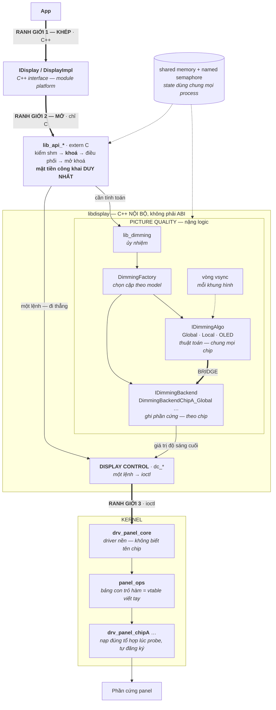
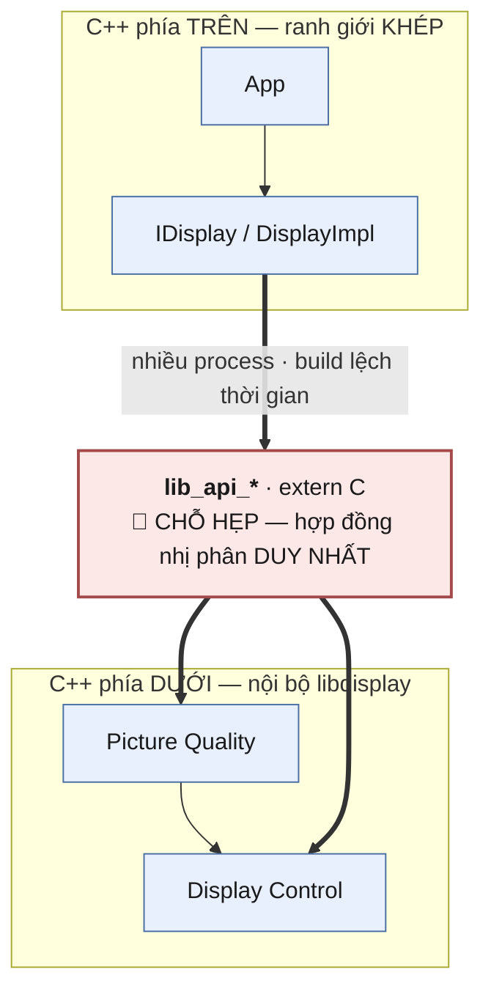
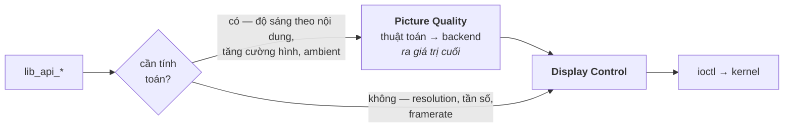
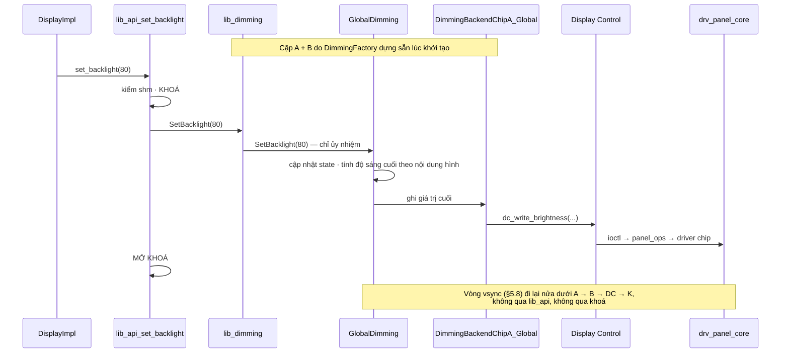
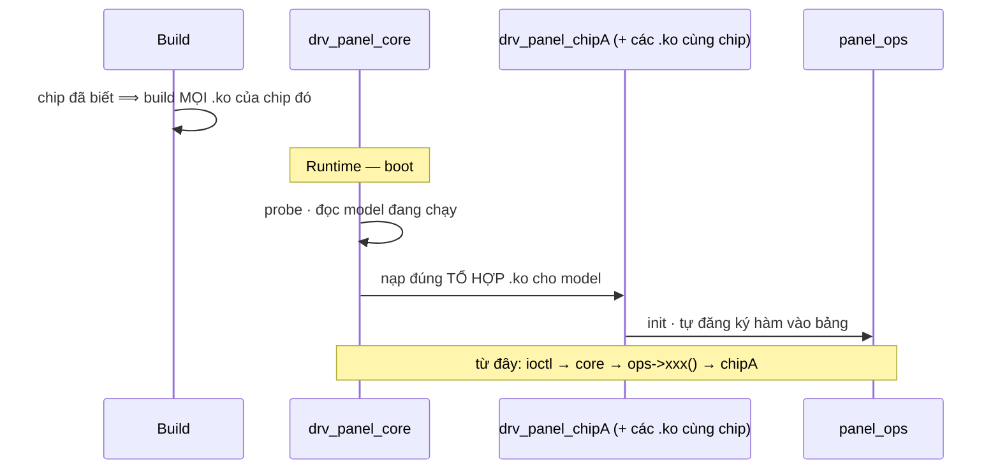

# A1 — Kiến trúc TIÊU CHUẨN: `libdisplay`

> 🅰️ **PHẦN A — TIÊU CHUẨN.** Tài liệu này mô tả **hệ thật đang chạy trong sản phẩm**, đã khử nhạy cảm, kèm cả điểm mạnh lẫn điểm yếu.
> Muốn xem **"cùng bối cảnh, làm lại thì thế nào"** → [🅱️ B1-redesign-architecture.md](B1-redesign-architecture.md).
> Ranh giới C++ interface/impl ở **Tầng 0** có bộ khung chạy được + 5 bài lab → [A2-cpp-interface-hal.md](A2-cpp-interface-hal.md).
> Viết cho **phỏng vấn C++ / Design Pattern**: mỗi thuật ngữ chuyên ngành display chỉ xuất hiện khi nó mang một luận điểm thiết kế.

> **TL;DR**
> - `libdisplay` là `.so` điều khiển màn hình cho **nhiều dòng sản phẩm × hơn 10 dòng chip × nhiều process caller**. Câu hỏi kiến trúc trung tâm: *cô lập cái gì, ở đâu?*
> - **Ba ranh giới, ba hợp đồng:** app ↔ `IDisplay` là ranh giới **khép**, dùng **C++**. `IDisplay` ↔ library là ranh giới **mở**, dùng **C** (`lib_api_*`). Library ↔ kernel dùng **ioctl**. Mọi C++ đa hình bên trong library **không phải ABI** ⟹ refactor tự do.
> - **Sau mặt tiền C có hai component, chia theo lượng logic:**
>   - **Picture Quality (PQ)**: dimming là chính. Nặng thuật toán, có state, chạy theo từng khung hình.
>   - **Display Control (DC)**: lệnh đơn như nguồn panel, resolution, tần số, framerate, ghi độ sáng.
>   - PQ tính xong giá trị cuối thì **cũng ghi qua DC** ⟹ DC là **cổng duy nhất** xuống phần cứng.
> - ⭐ **Cùng một ý tưởng xuất hiện hai lần:** *phần chung không biết tên chip + phần theo chip cắm vào sau*.
>   - Ở dimming: **Bridge** bằng `virtual`.
>   - Ở kernel: **bảng con trỏ hàm `panel_ops`**, tức vtable viết tay bằng C.
>   - Cả hai đều **chốt chip lúc build**, **chốt tổ hợp theo model lúc chạy**.
> - 5 điểm yếu nên **chủ động nêu** (§9) — đầu vào của phần 🅱️.

> 🔒 **Đây là bản ĐÃ KHỬ NHẠY CẢM — và là bản duy nhất được commit.** Mọi định danh (`libdisplay`, `lib_api_*`, `IDimmingAlgo`, `ChipA`…) là **tên tài liệu**; **kiến trúc giữ nguyên**.
> **Khi kể ở phỏng vấn:** nói được **kiến trúc · pattern · đánh đổi**; **không** nói tên sản phẩm/khách hàng, tên symbol nội bộ, thuật toán dimming độc quyền, hay số liệu chưa công bố. Nêu đúng ranh giới này là **điểm cộng**.

---

## 1. `libdisplay` là gì — một câu

Một shared library (`.so`) điều khiển màn hình, gồm **chất lượng hình ảnh** (dimming, video enhancement, ambient) và **điều khiển panel** (nguồn, resolution, tần số, framerate, độ sáng). Nó dùng chung cho nhiều loại sản phẩm (TV, Signage, Monitor), trên hơn 10 dòng chip và nhiều đời OS nền.

**Vị trí trong stack — điểm dễ hiểu nhầm:** app **không** gọi thẳng `libdisplay`. App gọi **C++ interface `IDisplay`** do module platform cung cấp; **implementation của nó (`DisplayImpl`)** mới là bên gọi `lib_api_*`.

---

## 2. 🗺️ Một sơ đồ — từ app xuống phần cứng

> Đây là sơ đồ duy nhất cần vẽ được trên bảng. Mọi mục sau là **phóng to một ô** của nó.


```mermaid
flowchart TD
    APP["<b>App</b>"]
    T0["<b>IDisplay / DisplayImpl</b><br/><i>C++ interface — module platform</i>"]
    API["<b>lib_api_*</b> · extern C<br/>kiểm shm → <b>khoá</b> → điều phối → mở khoá<br/><b>mặt tiền công khai DUY NHẤT</b>"]

    subgraph LIB["libdisplay — C++ NỘI BỘ, không phải ABI"]
        subgraph PQ["PICTURE QUALITY — nặng logic"]
            DIM["lib_dimming<br/><i>ủy nhiệm</i>"]
            FAC["DimmingFactory<br/><i>chọn cặp theo model</i>"]
            ALG["IDimmingAlgo<br/>Global · Local · OLED<br/><i>thuật toán — chung mọi chip</i>"]
            BE["IDimmingBackend<br/>DimmingBackendChipA_Global …<br/><i>ghi phần cứng — theo chip</i>"]
            VS["vòng vsync<br/><i>mỗi khung hình</i>"]
            DIM --> FAC
            FAC --> ALG
            FAC --> BE
            ALG ==>|"BRIDGE"| BE
            VS -.-> ALG
        end
        DC["<b>DISPLAY CONTROL</b> · dc_*<br/><i>một lệnh → ioctl</i>"]
    end

    subgraph KER["KERNEL"]
        CORE["<b>drv_panel_core</b><br/><i>driver nền — không biết tên chip</i>"]
        OPS["<b>panel_ops</b><br/><i>bảng con trỏ hàm = vtable viết tay</i>"]
        CHIP["<b>drv_panel_chipA</b> …<br/><i>nạp đúng tổ hợp lúc probe, tự đăng ký</i>"]
        CORE --> OPS --> CHIP
    end

    HW["Phần cứng panel"]
    SHM[("shared memory + named semaphore<br/><i>state dùng chung mọi process</i>")]

    APP ==>|"<b>RANH GIỚI 1 — KHÉP</b> · C++"| T0
    T0 ==>|"<b>RANH GIỚI 2 — MỞ</b> · chỉ C"| API
    API -->|"cần tính toán"| DIM
    API -->|"một lệnh — đi thẳng"| DC
    BE -->|"giá trị độ sáng cuối"| DC
    DC ==>|"<b>RANH GIỚI 3</b> · ioctl"| CORE
    CHIP --> HW
    SHM -.-> API
    SHM -.-> PQ
```

**Đọc sơ đồ — ba thứ phải thấy:**

1. **Ba ranh giới, mỗi cái một ngôn ngữ hợp đồng**: C++ (khép) → C (mở) → ioctl (user/kernel). Vì sao từng cái: §3.
2. **Hai tuyến sau mặt tiền**: việc cần tính toán đi qua PQ, việc một lệnh đi thẳng DC. Hai tuyến **hội tụ ở DC**: §4.
3. **Cùng một hình dạng lặp hai lần**: `IDimmingAlgo ⟹ IDimmingBackend` ở user-space, `drv_panel_core ⟹ panel_ops ⟹ drv_panel_chipA` ở kernel. Phần chung không biết chip, phần theo chip cắm vào sau: §5, §6.

| Tầng | Là gì | Hợp đồng |
|---|---|---|
| 0 | `IDisplay` / `DisplayImpl` — interface cho app | **C++** — ranh giới khép |
| **1** | `lib_api_*` (`lib_api.h`) — **mặt tiền**, khoá, chọn tuyến | 🔴 **C** — ranh giới mở |
| 2 | **PQ**: `lib_dimming_interface` → `lib_dimming` → `DimmingFactory` → `IDimmingAlgo` ⇄ `IDimmingBackend` | C++ nội bộ |
| 3 | **DC**: các hàm `dc_*` — gói tham số thành `ioctl` | C++ nội bộ → **ioctl** |
| 4 | **Kernel**: `drv_panel_core` + `panel_ops` + `drv_panel_chipX` | C — bảng con trỏ hàm |
| ⊥ | `display_shm_info` trong shared memory + named semaphore | **cắt ngang** Tầng 1–2 |

---

## 3. Ranh giới: narrow waist hai tầng — vì sao C++ → C → C++

Phần này trả lời câu *"chuyển C++ → C → C++ nghe có vẻ vòng vo?"*. Hình dung một **đồng hồ cát**: hai đầu rộng, ở giữa là chỗ hẹp nhất và ổn định nhất.


```mermaid
flowchart TD
    subgraph TREN["C++ phía TRÊN — ranh giới KHÉP"]
        A["App"] --> B["IDisplay / DisplayImpl"]
    end
    D["<b>lib_api_*</b> · extern C<br/>🔴 CHỖ HẸP — hợp đồng nhị phân DUY NHẤT"]
    subgraph DUOI["C++ phía DƯỚI — nội bộ libdisplay"]
        E["Picture Quality"]
        G["Display Control"]
        E --> G
    end
    B ==>|"nhiều process · build lệch thời gian"| D
    D ==> E
    D ==> G

    classDef waist fill:#fde8e8,stroke:#a54a4a,stroke-width:2px,color:#1a1a1a
    classDef cpp   fill:#e8f0fe,stroke:#4a6fa5,color:#1a1a1a
    class D waist
    class A,B,E,G cpp
```

| Vùng | Hợp đồng | Vì sao |
|---|---|---|
| **Trên** — app → `IDisplay` | **C++** | **Khép**: cùng team, cùng toolchain, build cùng lúc ⟹ vtable/STL khớp nhau được **quy định build** bảo đảm |
| 🔴 **Chỗ hẹp** — `lib_api_*` | **C** | **Mở**: nhiều process, build lệch thời gian ⟹ chỉ C ổn định về nhị phân |
| **Dưới** — PQ + DC | **C++** | Không ai ngoài nhìn thấy ⟹ **không phải ABI** |

⟹ Hai đầu đều **rộng** (dùng đủ C++); chỉ **chỗ hẹp** phải giữ vĩnh viễn. Mỗi bên refactor phía mình mà không kéo bên kia build lại.

### 3.1 Ranh giới mở — vì sao chỉ C

`libdisplay` được link vào **nhiều process** (TV service, factory, menu, daemon, tool test…), build **lúc khác, team khác, có thể toolchain khác**:

| | Phơi **C++ interface** qua `.so` | **`extern "C"`** |
|---|---|---|
| Tên symbol | **Name mangling** — khác giữa compiler/version | Chuẩn, không mangling |
| Bảng virtual | Thêm/bớt/đổi thứ tự virtual = **ABI break im lặng** | **Không có vtable** ở ranh giới |
| Kiểu dữ liệu | `std::string`/`std::vector` kéo theo ABI của STL bên build | Struct + primitive |
| Ai build được | Chỉ bên **cùng toolchain, cùng phiên bản** | **Bất kỳ** compiler nào, kể cả C thuần |

> 🔴 **Nối thẳng với thí nghiệm đã đo bằng máy ở [A2](A2-cpp-interface-hal.md)** — khi phơi C++ interface qua `.so`:
> - **[A2 §3.3]** chèn một virtual vào **giữa** ⟹ app gọi `setPower()` mà **destructor chạy**; không crash, exit 0, không log.
> - **[A2 Lab 3a]** hỏng **kể cả khi version hai bên báo khớp**, vì version nói về *số lượng API*, không nói về *thứ tự slot*.
>
> `libdisplay` **miễn nhiễm** với cả lớp bug đó vì **không vtable nào đi qua ranh giới**.

### 3.2 ⭐ Hệ quả ít người nói ra — chỗ ăn điểm

| | Phơi C++ interface | **`libdisplay` (mặt tiền C)** |
|---|---|---|
| Thêm virtual vào `IDimmingAlgo` | 🔴 ABI break | ✅ **Tự do** |
| Đổi kế thừa / thêm class / tách component | 🔴 Rủi ro layout | ✅ Tự do |
| Caller phải build lại khi library đổi | Thường **có** | ❌ **Không** — C API là *compilation firewall* |
| Thứ **vẫn** phải giữ vĩnh viễn | Rất nhiều | Chữ ký `lib_api_*` + layout struct công khai |

⟹ **Chính vì thế `libdisplay` mới dám có `IDimmingAlgo` ~150 virtual.** Cũng vì thế mọi đề xuất cải tiến ở phần 🅱️ **không đụng tới caller nào**.

Cùng mô hình với cả ngành: Vulkan, SQLite, libdrm đều là **C API** được app C++ bọc lại.

> **Quy tắc một câu:** *ranh giới **mở** → **C**; ranh giới **khép** → **C++ interface** được phép.*

### 3.3 Lý do thứ hai: C API là điểm khoá DUY NHẤT cho caller

Mỗi hàm `lib_api_*` là một **Facade** gói trọn *kiểm shared memory → khoá semaphore → điều phối → mở khoá* (code ở §4.3).

⭐ **Nếu phơi thẳng C++ interface ra ngoài, caller gọi thẳng method và BYPASS semaphore** — mất cơ chế chống race giữa các process. Tức là chọn mặt tiền C **không chỉ vì ABI** mà còn vì nó là **chỗ duy nhất ép được mọi lời gọi đi qua khoá**. Lập luận hai tầng này là dạng trả lời phân biệt được ứng viên.

> ⚠️ **Ngoại lệ phải tự nói ra:** vòng vsync (§5.8) chạy **bên trong** library, không đi qua `lib_api_*` ⟹ không được khoá ở mặt tiền bảo vệ. "Duy nhất" đúng cho **caller bên ngoài**, không đúng cho **mọi đường chạm state** (điểm yếu #5).

---

## 4. Hai component: Picture Quality và Display Control

> Câu interviewer hay hỏi nhất về một library nhiều tính năng: *"vì sao chỗ này có cả cây class, chỗ kia chỉ là một hàm gọi thẳng?"*. Mục này là câu trả lời.

### 4.1 Quy tắc chọn tuyến — một câu

> **Cần tính toán, giữ state, bám theo từng khung hình ⟹ đi qua PQ. Một lệnh, không state, gửi xong là xong ⟹ đi thẳng DC.**
> Hai tuyến **gặp nhau ở DC**: PQ tính xong giá trị cuối rồi cũng gọi DC để chạm phần cứng.


```mermaid
flowchart LR
    API["lib_api_*"]
    Q{"cần tính<br/>toán?"}
    PQ["<b>Picture Quality</b><br/>thuật toán → backend<br/><i>ra giá trị cuối</i>"]
    DC["<b>Display Control</b>"]
    K["ioctl → kernel"]
    API --> Q
    Q -->|"có — độ sáng theo nội dung,<br/>tăng cường hình, ambient"| PQ --> DC
    Q -->|"không — resolution, tần số,<br/>framerate"| DC
    DC --> K
```

| | **Picture Quality** (dimming là chính) | **Display Control** |
|---|---|---|
| Bản chất | **Tính** ra giá trị từ nội dung hình | **Truyền** một lệnh xuống driver |
| Logic | Nặng — thuật toán, chuyển tiếp mượt | Gần như không — đóng gói tham số → `ioctl` |
| State | Có — trong shared memory, kéo dài qua nhiều khung hình | Không — driver/phần cứng giữ |
| Nhịp chạy | Theo lời gọi API **và** theo vòng vsync riêng | Chỉ khi có lệnh |
| Pattern | Bridge · Abstract Factory · Strategy · Null Object | **Cố ý không dùng** (§4.4) |

Video enhancement và ambient **cùng khung với dimming**: hợp đồng module → module ủy nhiệm → thuật toán + phần ghi phần cứng theo chip → gọi DC. Ở phỏng vấn chỉ cần một câu: *"dimming là ví dụ đầy đủ nhất, hai module kia cùng khung."*

### 4.2 Lệnh của Display Control — hai nhóm

| Nhóm | Lệnh | Ai gọi |
|---|---|---|
| **Công khai** — đi thẳng từ `lib_api_*` | nguồn panel, resolution, tần số, framerate | Mặt tiền |
| **Nội bộ** — chỉ PQ gọi | ghi giá trị độ sáng cuối xuống phần cứng | Backend của PQ |

⟹ Câu trả lời khi bị hỏi *"độ sáng đi đường nào?"*: **app xin độ sáng thì đi qua PQ**, vì độ sáng phải tính theo nội dung hình. **DC chỉ là chỗ ghi giá trị cuối.**

⚠️ Hai nhóm này hiện là **quy ước**, code không ép. Đó là điểm yếu #2 (§9).

### 4.3 Hai tuyến trong code

**Tuyến PQ** — đi qua module, module tính rồi mới chạm DC:

```cpp
// src_com/lib_api.cpp
int32_t lib_api_set_backlight(int backlight) {
    int32_t ret = LIB_OK;
    if (get_check_shm() == -1) return -1;                 // shared memory sẵn sàng?
    int sem_ret = lib_sem_lock(__FUNCTION__);             // KHOÁ (liên process)

    if (get_dimming_instance() != NULL)
        ret = get_dimming_instance()->SetBacklight(backlight);            // PQ: đa hình
    if (get_video_enhancement_instance() != NULL)
        ret = get_video_enhancement_instance()->SetBacklight(backlight);  // module thứ hai cũng nghe

    if (sem_ret == 0) lib_sem_unlock(__FUNCTION__);       // MO KHOA
    return ret;
}
```

**Tuyến DC** — một lệnh, đi thẳng *(tên hàm DC là minh hoạ)*:

```cpp
// src_com/lib_api.cpp
int32_t lib_api_set_frequency(int hz) {
    if (get_check_shm() == -1) return -1;
    int sem_ret = lib_sem_lock(__FUNCTION__);
    int32_t ret = dc_set_frequency(hz);                   // DC thẳng — không qua module nào
    if (sem_ret == 0) lib_sem_unlock(__FUNCTION__);
    return ret;
}

// src_com/display_control.cpp
int32_t dc_set_frequency(int hz) {
    panel_freq_t arg;
    arg.hz = hz;
    return ioctl(g_panel_fd, PANEL_IOC_SET_FREQ, &arg);  // xuong drv_panel_core
}
```

⟹ Hai hàm `lib_api_*` **cùng một khuôn** (shm → khoá → việc → mở khoá), chỉ khác phần "việc". Đó là lý do khuôn này sống ở **mặt tiền** chứ không rải xuống từng module.

### 4.4 ⭐ Display Control — cố ý KHÔNG dùng pattern

Các hàm `dc_*` là **hàm tự do**: không interface, không factory, không đa hình. Đây là quyết định đúng, không phải thiếu sót ([DP-024](../../14-prep/mock-interview/bank/design-patterns.md)):

- Trừu tượng hoá phải **trả giá cho một biến thể đang tồn tại**.
- DC **có** biến thể theo chip, nhưng biến thể đó đã được **kernel driver hấp thụ**: một bộ ioctl chung, mỗi chip một driver (§6).
- ⟹ Ở user-space không còn gì để trừu tượng. Bọc thêm interface là trả giá (indirection, thêm file, test double) để mua **số không**.

⭐ Còn PQ thì **không** đẩy xuống kernel được: thuật toán là **chính sách** (policy), mà policy thuộc user-space. Câu ăn điểm: *"logic nặng đẩy lên user-space, thao tác phần cứng mỏng giữ trong kernel."*

> 🗣️ *"Ở đây tôi cố ý không dùng pattern, vì…"* là tín hiệu senior rõ hơn kể tên năm pattern.

---

## 5. 🎯 Case study: dimming — phóng to nhánh PQ

### 5.0 Tóm tắt một đoạn

Dimming là việc điều khiển độ sáng đèn nền theo nội dung hình. Đường đi: `lib_api_set_backlight` → `lib_dimming` (ủy nhiệm) → cặp object do `DimmingFactory` dựng.
- **Thuật toán** `IDimmingAlgo` (Global/Local/OLED): logic nặng, **viết một lần**, mọi chip dùng chung.
- **Backend** `DimmingBackendChipX_AlgoY`: mỏng, **chỉ ghi phần cứng**, theo chip × thuật toán.
- Thuật toán giữ con trỏ tới backend ⟹ **Bridge** tách *logic* khỏi *phần cứng*.

`DimmingFactory` là **Abstract Factory + Meyers Singleton**: chip chốt lúc build, cặp thuật toán + backend chốt lúc runtime theo model. Platform không có panel thì dùng chính base class làm **Null Object**. Ngoài lời gọi API, thuật toán còn được **vòng vsync** gọi mỗi khung hình.

### 5.1 Một lời gọi đi qua những gì


```mermaid
sequenceDiagram
    participant P as DisplayImpl
    participant API as lib_api_set_backlight
    participant D as lib_dimming
    participant A as GlobalDimming
    participant B as DimmingBackendChipA_Global
    participant DC as Display Control
    participant K as drv_panel_core

    Note over D,B: Cặp A + B do DimmingFactory dựng sẵn lúc khởi tạo
    P->>API: set_backlight(80)
    API->>API: kiểm shm · KHOÁ
    API->>D: SetBacklight(80)
    D->>A: SetBacklight(80) — chỉ ủy nhiệm
    A->>A: cập nhật state · tính độ sáng cuối theo nội dung hình
    A->>B: ghi giá trị cuối
    B->>DC: dc_write_brightness(...)
    DC->>K: ioctl → panel_ops → driver chip
    API->>API: MỞ KHOÁ
    Note over A,K: Vòng vsync (§5.8) đi lại nửa dưới A → B → DC → K,<br/>không qua lib_api, không qua khoá
```

### 5.2 Vấn đề: hai trục biến thiên, chốt ở hai thời điểm

| Trục | Biến thiên theo | Chốt khi nào | Ai chọn |
|---|---|---|---|
| **Thuật toán** | Model (loại đèn nền của panel) | **Runtime** — đọc lúc khởi tạo | `DimmingFactory` |
| **Chip** | SoC ghi phần cứng kiểu gì | **Build** — một binary chỉ chứa một chip | **CMake** chọn thư mục `Backend/ChipX/` |

Gộp logic và ghi phần cứng vào cùng class ⟹ `GlobalDimmingChipA`, `LocalDimmingChipB`… Có **N × M lớp đều nặng**, thuật toán bị **chép M lần**, sửa một bug thuật toán phải sửa M chỗ.

⭐ **Ý hay đáng nói:** trục nào không bao giờ đổi trên một sản phẩm (chip) thì **chốt sớm nhất có thể, bằng build system**, nên binary không chứa byte nào cho chip khác. Trục nào đổi theo model thì chốt bằng code lúc chạy.

### 5.3 Bridge — thuật toán × backend, ghép bằng composition

**Abstraction — thuật toán (logic nặng, chung mọi chip):**

```cpp
// dimming/Common/IDimmingAlgo.h
class IDimmingAlgo {
public:
    virtual ~IDimmingAlgo();
    virtual uint32_t SetBacklight(int32_t backlight);
    // ... ~150 methods ...
    virtual void t_vSyncCallBack();          // vòng vsync gọi mỗi khung hình
};

// dimming/Common/GlobalDimming.h
class GlobalDimming : public IDimmingAlgo {
public:
    GlobalDimming(IDimmingBackend* pDimmingBackend, DimmingType_k eDetectedDimming);
protected:
    GlobalDimmingForShm&    Shm;                 // state trong shared memory
    DimmingVendorInterface* m_pDimmingVendor;    // đọc thống kê độ sáng khung hình
    IDimmingBackend*        m_pDimmingBackend;   // ⬅️ CÂY CẦU sang phần cứng
};

GlobalDimming::GlobalDimming(IDimmingBackend* pDimmingBackend,
                             DimmingType_k eDetectedDimming)
    : Shm(get_lib_shm()->shmGlobalDimming) {
    m_pDimmingBackend = pDimmingBackend;         // GHÉP lúc runtime
    m_pDimmingVendor  = DimmingVendor::GetInstance();
}
```

**Implementor — phần ghi phần cứng (mỏng, theo chip):**

```cpp
// dimming/Backend/IDimmingBackend.h
class IDimmingBackend {
public:
    virtual ~IDimmingBackend();
    // nhóm Local
    virtual uint32_t t_InitLocalDimming();
    virtual uint32_t t_SetLdFinalDuty(BackendLdFinalDuty_t* pInputData);
    // nhóm Global
    virtual uint32_t t_InitGlobalDimming();
    virtual uint32_t t_Set2DFinalDuty(BackendGd2DFinalDuty_t* pInputData);
};

// dimming/Backend/ChipA/DimmingBackendChipA_Global.h — chỉ build khi CMake chọn ChipA
class DimmingBackendChipA_Global : public IDimmingBackend {
public:
    uint32_t t_InitGlobalDimming() override;
    uint32_t t_Set2DFinalDuty(BackendGd2DFinalDuty_t* pInputData) override;  // -> gọi DC
};
```

Mỗi `ChipX_AlgoY` chỉ override **nhóm method của thuật toán mình**, rồi gọi **Display Control** để chạm phần cứng. Backend **không tự gọi `ioctl`**.

> ⭐ **Đối chiếu lý thuyết:** ví dụ `IDimmingBackend` ở [structural §1](../structural.md) **gần như trùng khớp** với hệ thật. Câu kể mạnh: *"tôi nhận ra cấu trúc mình đang bảo trì chính là Bridge, sau khi đọc lại định nghĩa."*

### 5.4 ⚠️ Bridge ở đây không phẳng như sách — và nói thẳng ra

Bridge sách vở hứa **N + M** lớp, vì implementor chỉ biến thiên theo chip. Ở đây backend biến thiên theo **chip × thuật toán**, vì cách ghi phần cứng của từng thuật toán khác hẳn nhau: Global ghi **một** giá trị, Local ghi **từng vùng** màn hình.

| | Gộp logic + phần cứng | Bridge sách | **Hệ thật** |
|---|---|---|---|
| Số lớp | N × M — **đều nặng** | N + M | N **nặng** + N × M **mỏng** |
| Sửa bug thuật toán | **M chỗ** | 1 chỗ | **1 chỗ** |
| Thêm 1 chip | +N lớp nặng | +1 | +N backend mỏng |

⭐ **Cách nói ăn điểm:** *"Mục tiêu của Bridge không phải con số N+M, mà là **phần đắt không bị nhân bản**. Phần đắt ở đây là thuật toán, và nó được viết đúng một lần. Phần còn nhân theo chip × thuật toán là lớp ghi thanh ghi vài chục dòng; tôi chấp nhận vì cách ghi của local và global khác nhau thật."*

### 5.5 Strategy và Bridge cùng tồn tại — hai vai khác nhau

Câu phân loại kinh điển ([DP-038](../../14-prep/mock-interview/bank/design-patterns.md)): **code trông giống hệt, ý định khác nhau.**

| | `IDimmingAlgo` | `IDimmingBackend` |
|---|---|---|
| Vai | **Strategy** — thuật toán thay thế được theo model | **Bridge implementor** — nửa phần cứng của cùng một thứ |
| Chạy được nếu thiếu? | Có bản base không làm gì | **Không** — thuật toán *cần* backend mới chạm được phần cứng |
| Gắn khi nào | Chọn lúc khởi tạo (runtime) | Lớp có trong binary chốt lúc build; instance gắn qua constructor |

### 5.6 `DimmingFactory` — Abstract Factory + Meyers Singleton

Mỗi thư mục chip `Backend/ChipX/` có **một `DimmingFactory` riêng** chứa mọi tổ hợp thuật toán × backend mà chip đó hỗ trợ:
- **Build:** CMake chỉ build `DimmingFactory` (và các backend) của chip đích.
- **Runtime:** factory chọn **cặp** khớp nhau theo model, rồi sở hữu cặp ấy.

```cpp
// dimming/Backend/ChipA/DimmingFactory.cpp   (rút gọn — tên hàm/hằng minh hoạ)
DimmingFactory::DimmingFactory() {
    DimmingType_k type = detect_dimming_type();       // theo model — runtime
    switch (type) {
    case DIMMING_GLOBAL:
        m_pDimmingBackend = new DimmingBackendChipA_Global();
        m_pDimmingObject  = new GlobalDimming(m_pDimmingBackend, type);
        break;
    case DIMMING_LOCAL:
        m_pDimmingBackend = new DimmingBackendChipA_Local();
        m_pDimmingObject  = new LocalDimming(m_pDimmingBackend, type);
        break;
    case DIMMING_OLED:
        m_pDimmingBackend = new DimmingBackendChipA_OLED();
        m_pDimmingObject  = new OLEDDimming(m_pDimmingBackend, type);
        break;
    }
}

IDimmingAlgo* DimmingFactory::GetDimmingInstance() {
    static DimmingFactory instance;   // Meyers singleton — thread-safe từ C++11
    return instance.GetDimmingObject();
}
```

⭐ **Vì sao là Abstract Factory, không chỉ Factory Method:** nó tạo **cả cặp phải khớp nhau**.
- Ghép `GlobalDimming` với `DimmingBackendChipA_Local` vẫn **compile sạch**, vì kiểu đều là `IDimmingBackend*`.
- Backend Local không override nhóm Global, nên mọi lệnh ghi rơi vào thân mặc định ⟹ **đèn không đổi, không lỗi, không log**.
- Lỗi đó bị chặn vì **cả cặp chỉ được tạo ở một chỗ** ([DP-022](../../14-prep/mock-interview/bank/design-patterns.md)).

> **Cái giá của "mỗi chip một bản":** logic chọn thuật toán theo model nằm trong **mỗi** bản ⟹ lặp M lần (điểm yếu #3).

### 5.7 `lib_dimming` — ủy nhiệm + Null Object bằng chính base class

```cpp
// dimming/Base/lib_dimming.cpp
lib_dimming::lib_dimming() : Shm(get_lib_shm()->shmDimming) {
    get_platform_info(&Shm.m_iPlatformType);
    if (Shm.m_iPlatformType == PLATFORM_NO_PANEL)
        m_pDimmingPanel = new IDimmingAlgo();                    // ⬅️ NULL OBJECT
    else
        m_pDimmingPanel = DimmingFactory::GetDimmingInstance();
}

uint32_t lib_dimming::SetAmbientMode(int32_t mode) {
    CHECK_DIMMING_FLAG_CREATE(m_bFlagCreate);
    return m_pDimmingPanel->SetAmbientMode(mode);                // chỉ uỷ nhiệm
}
```

Base class (`IDimmingAlgo`, và cả `lib_*_interface`) **không** abstract thuần: mọi method có thân `return LIB_OK`. Platform không panel ⟹ `new IDimmingAlgo()` ⟹ cả ~150 API thành **no-op thành công**. Không cần nhánh `if` ở 150 chỗ gọi, không segfault.

⚠️ Ba điểm phải nói kèm:
- **Null Object ở đây là chính lớp cơ sở**, không phải class riêng. Rẻ, nhưng base vừa là *hợp đồng* vừa là *implementation mặc định* — hai trách nhiệm một chỗ ([SRP](../solid-principles.md)).
- **Trả `LIB_OK` cho việc không làm là quyết định có rủi ro**: caller không phân biệt *"đã đặt"* với *"không hỗ trợ"*. HAL ở [A2](A2-cpp-interface-hal.md) chọn `-ENOTSUP`. Nêu **cả hai lựa chọn và lý do**: ở đây nghiêng về `LIB_OK` vì hàng trăm điểm gọi có sẵn sẽ bắt đầu báo lỗi nếu đổi.
- 🟢 **Ở `libdisplay` cách này an toàn về ABI**, khác HAL: không vtable nào đi qua `.so` từ ngoài, nên không có *"vtable ngắn hơn ⟹ segfault"* như [A2 Lab 3b](A2-cpp-interface-hal.md). Cùng pattern, hai bối cảnh ABI, hai mức rủi ro.

`lib_dimming_interface` → `lib_dimming` ở tầng trên chỉ có **một** implementation thật. **Một biến thể thì chưa phải Strategy**: đây là **Dependency Inversion** ([solid §5](../solid-principles.md)) + ủy nhiệm, còn biến thiên thật nằm ở tầng thuật toán.

### 5.8 Vòng vsync — nguồn kích hoạt thứ hai

Độ sáng phải bám nội dung **từng khung hình**, nên ngoài lời gọi API còn một vòng chạy theo vsync (tín hiệu báo mỗi khung hình mới):

| | Lời gọi API | Vòng vsync |
|---|---|---|
| Ai kích hoạt | Caller qua `lib_api_*` | Library tự chạy — `t_vSyncCallBack()` |
| Khởi động | Mỗi lần gọi | **Một lần**, khi `.so` được nạp |
| Đi qua | Mặt tiền → khoá → module → thuật toán → backend → DC | **Thẳng** thuật toán → backend → DC — **không qua khoá** |
| Bao nhiêu bản | Mỗi process tự gọi | **Một vòng cho cả hệ**: process khác nạp `.so` ⟹ vòng **reset, chạy lại trong process mới** |

⭐ **Hệ quả đáng nói:** vòng vsync đổi process mà thuật toán **không mất trí nhớ**, vì mọi state nằm trong shared memory (§7.2). Đây là luận cứ mạnh nhất cho việc đặt state vào shared memory thay vì vào object.

---

## 6. Kernel — HAL bằng C: cùng hình dạng, viết tay

> Mục này chỉ giữ phần **liên quan C++/Design Pattern**. Phần riêng của kernel (ranh giới license GPL, thứ tự nạp module, cửa sổ bảng còn rỗng) đã có đầy đủ ở [whiteboard D4](../../14-prep/whiteboard.md).

### 6.1 Ba thành phần

| Thành phần | Vai | Biết tên chip? |
|---|---|---|
| **`drv_panel_core`** | Driver nền: nhận `ioctl` từ Display Control, gọi `ops->xxx()` | ❌ **Không** |
| **`panel_ops`** | Bảng con trỏ hàm — **vtable viết tay bằng C** | — |
| **`drv_panel_chipX`** | Driver thật của từng chip (hơn 10 loại); lúc init **tự điền hàm của mình** vào `panel_ops` | ✅ chỉ chip của nó |

*(Giữa `core` và bảng còn một module trung gian `drv_panel_shim` giữ bảng — tồn tại vì lý do license, xem whiteboard D4.)*

### 6.2 Vòng đời — chốt chip lúc build, chốt tổ hợp lúc probe


```mermaid
sequenceDiagram
    participant B as Build
    participant C as drv_panel_core
    participant X as drv_panel_chipA (+ các .ko cùng chip)
    participant O as panel_ops

    B->>B: chip đã biết ⟹ build MỌI .ko của chip đó
    Note over C: Runtime — boot
    C->>C: probe · đọc model đang chạy
    C->>X: nạp đúng TỔ HỢP .ko cho model
    X->>O: init · tự đăng ký hàm vào bảng
    Note over C,O: từ đây: ioctl → core → ops->xxx() → chipA
```

### 6.3 ⭐ Cùng một ý tưởng, hai tầng, hai ngôn ngữ

Đây là bảng đáng mang vào phòng phỏng vấn nhất của cả tài liệu:

| | **User-space — dimming** | **Kernel — panel driver** |
|---|---|---|
| Phần chung, không biết chip | `IDimmingAlgo` (thuật toán) | `drv_panel_core` |
| Phần theo chip | `DimmingBackendChipX_AlgoY` | `drv_panel_chipX` |
| Cơ chế đa hình | `virtual` — vtable **compiler** dựng | `panel_ops` — vtable **viết tay** |
| Chip chốt khi | **Build** — CMake chọn thư mục | **Build** — chỉ build các `.ko` của chip |
| Tổ hợp theo model chốt khi | **Runtime** — `DimmingFactory` | **Runtime** — probe nạp đúng `.ko` |
| Ai ghép hai nửa | Factory **tạo** cặp (Abstract Factory) | Chip driver **tự đăng ký** (self-registration) |
| Hàm chip không hỗ trợ | Base class trả `LIB_OK` — **Null Object** | Slot `NULL` ⟹ **kernel oops** nếu bị gọi |

🗣️ **Câu chốt:** *"Cùng một quyết định — tách phần chung khỏi phần theo chip, chốt chip lúc build, chốt tổ hợp lúc chạy — xuất hiện ở hai tầng. Ở user-space bọn em dùng `virtual`, ở kernel dùng bảng con trỏ hàm, vì kernel viết bằng C."*

### 6.4 Hai rủi ro — đúng hai bài học C++ ở dạng C

| Rủi ro | Bài học C++ tương ứng | Chữa |
|---|---|---|
| Slot chip không hỗ trợ để `NULL`, gọi vào là **oops** | **Null Object** (§5.7) — ở user-space đã làm, ở kernel thì chưa | Điền sẵn cả bảng bằng stub trả `-ENOTSUP` + ghi log, chip driver ghi đè cái mình có |
| Chèn một hàm vào **giữa** `panel_ops` ⟹ mọi slot phía sau lệch | **vtable ABI** ([A2 §3.3](A2-cpp-interface-hal.md)) — y hệt chèn virtual vào giữa interface | Chỉ thêm vào **cuối** bảng; thêm trường `size`/`version` ở đầu struct để kiểm lúc đăng ký |

---

## 7. Cắt ngang: nhiều process dùng chung một library

### 7.1 Service Locator — không hẳn Singleton

```cpp
// src_algo/display/lib_base.cpp
static lib_dimming_interface           *dimming           = NULL;
static lib_video_enhancement_interface *video_enhancement = NULL;
static lib_ambient_interface           *ambient           = NULL;

lib_dimming_interface* get_dimming_instance() {
    if (dimming == NULL) lib_print(ERR, "dimming is NULL");
    return dimming;
}

void lib_init_modules() {             // chạy một lần, trong constructor của .so
    dimming           = new lib_dimming();
    video_enhancement = new lib_video_enhancement();
    ambient           = new lib_ambient();
    dimming->Create();  video_enhancement->Create();  ambient->Create();
}
```

⚠️ **Gọi tên đúng:**
- `get_*_instance()` là **Service Locator** trên con trỏ toàn cục, **không phải Singleton GoF**. Không gì *ép* tính duy nhất, chỉ có quy ước "chỉ `lib_init_modules()` gán".
- `lib_init_modules()` **không phải factory**, vì nó không lựa chọn gì. Nó chỉ là **chỗ duy nhất dựng toàn bộ object** (composition root). Lựa chọn thật nằm ở `DimmingFactory`.

⭐ **Không có data race**, khác `getInstance()` ở [A2 §3.2, Lab 1](A2-cpp-interface-hal.md) (race thật, đo được **178/200**). Lý do: khởi tạo chạy trong `__attribute__((constructor))`, **trước khi process tạo thread nào**. Đây là một cách chữa race khác magic statics: **dời khởi tạo ra khỏi vùng có cạnh tranh**.

### 7.2 Shared memory + semaphore — object per-process, state per-system

```cpp
// src_algo/display/lib_base.h
struct display_shm_info {
    int    init;
    int    ref_count;                       // đếm process toàn cục
    sem_t  sem_lib;                         // named semaphore dùng ở MỌI API
    DimmingForShm           shmDimming;          // state từng module
    GlobalDimmingForShm     shmGlobalDimming;    // state từng thuật toán
    VideoEnhancementForShm  shm_video_enhancement;
    char   prev_called_proc[20][255];       // lịch sử gọi — để debug deadlock
    // ...
};

// tự chạy khi process nạp library — caller không gọi init
void __attribute__((constructor)) lib_init()       { lib_init_device(); }  // + vòng vsync
void __attribute__((destructor))  lib_base_final() { /* teardown */ }
```

| | Con trỏ / object C++ | State thật |
|---|---|---|
| Sống ở đâu | **Mỗi process một bản** | **Shared memory** — một bản cho cả hệ |
| N process ⟹ | N object | **Một** state |
| Ai bảo vệ | (không cần) | **Named semaphore** |

⟹ *"Object là per-process, state là per-system."* Câu này gói cả kiến trúc, và trả lời thẳng [DP-020](../../14-prep/mock-interview/bank/design-patterns.md) (*"hai `.so` cùng include Singleton — mấy instance?"*).

Mỗi thuật toán giữ **reference** tới phần shared memory của nó, bind ngay trong danh sách khởi tạo: `GlobalDimming(...) : Shm(get_lib_shm()->shmGlobalDimming)`. Reference member thì không gán lại được ⟹ một object gắn đúng một vùng state, có chủ ý.

Đây **không phải** GoF pattern mà là idiom IPC của hệ nhúng nhiều process. Nhưng nó **quyết định hình dạng mọi pattern khác** (object rẻ và lặp lại, state duy nhất, khoá ở mặt tiền), nên phải nói ra **trước** khi nói pattern.

> 💡 `prev_called_proc` lưu lịch sử process đã gọi, để khi deadlock còn biết ai giữ khoá. Đây là chi tiết **thiết kế cho lúc debug**, rất "thực chiến" khi bị hỏi *"hệ này debug kiểu gì?"*.

---

## 8. Bảng tổng kết — pattern nào, ở đâu, vì sao

| Pattern | Ở đâu | Giải vấn đề gì | Nhóm |
|---|---|---|---|
| **Facade** ⭐ | `lib_api_*` | Che trình tự `shm → khoá → điều phối → mở khoá`; che C++; giữ ABI C ổn định | structural |
| Adapter/Facade C++ | `IDisplay` / `DisplayImpl` | Bọc C API thành interface C++ cho app | structural |
| DIP + ủy nhiệm | `lib_*_interface` → `lib_*` | Mặt tiền không biết implementation | — |
| **Strategy** | `IDimmingAlgo` — Global/Local/OLED | Thuật toán theo model | behavioral |
| **Bridge** ⭐ | `IDimmingAlgo` × `IDimmingBackend` | Thuật toán viết một lần, phần ghi phần cứng theo chip | structural |
| **Abstract Factory + Singleton** | `DimmingFactory` | Tạo **cặp khớp** thuật toán + backend | creational |
| **Null Object** | Thân `return LIB_OK` ở base · `new IDimmingAlgo()` | Tính năng không có → no-op an toàn | behavioral |
| Service Locator | `get_*_instance()` | Truy cập instance per-process | creational |
| **Cố ý không dùng** | Display Control `dc_*` | Một lệnh → `ioctl`; biến thể chip đã nằm ở driver | — |
| Bảng con trỏ hàm + self-registration | `panel_ops` (kernel) | Driver nền không biết tên chip — **Bridge viết bằng C** | structural |
| *(idiom IPC)* | shared memory + semaphore + `__attribute__((constructor))` | State dùng chung nhiều process — **quyết định hình dạng mọi pattern khác** | — |

---

## 9. ⚠️ Điểm yếu — chủ động nêu ở phỏng vấn

Nêu trước khi bị hỏi là **điểm cộng**; bị vặn ra mới thừa nhận là điểm trừ. Phần vá nằm ở [🅱️ B1](B1-redesign-architecture.md).

| # | Điểm yếu | Vì sao là điểm yếu | Nếu làm lại |
|---|---|---|---|
| 1 | `IDimmingAlgo` ~**150 virtual** (và `IDimmingBackend` gộp nhóm Local + Global) | Vi phạm **ISP** ([solid §4](../solid-principles.md)): mỗi biến thể phụ thuộc vào method nó không dùng | Tách theo **nhóm khả năng** (`IGlobalDimming`, `ILocalDimming`…); backend cũng tách theo nhóm |
| 2 | **Ranh giới PQ / DC chỉ là quy ước** | DC dùng chung cho cả hai tuyến, **không có chủ sở hữu tài nguyên**. Code không ngăn một `lib_api_*` đi thẳng DC ghi độ sáng trong khi PQ đang điều khiển nó ⟹ PQ đè lại ở khung hình kế, hai bên giằng co | Tách **hai component rõ trong code**: PQ **sở hữu** độ sáng; lệnh ghi độ sáng của DC chỉ mở cho PQ |
| 3 | **`DimmingFactory` nhân bản theo chip** | Logic chọn thuật toán theo model lặp ở **mỗi** bản ⟹ thêm 1 thuật toán = sửa M file; sai một bản = bug chỉ lộ trên một chip | Tách đôi: **chip cung cấp factory backend** (chốt lúc build) · **code chung chọn thuật toán** (chạy lúc runtime, viết một lần) |
| 4 | Base class trả `LIB_OK` cho việc **không làm gì** | Caller không phân biệt *"đã đặt"* với *"không hỗ trợ"* | `-ENOTSUP` — nhưng cân với chi phí sửa hàng trăm điểm gọi cũ |
| 5 | **Vòng vsync nằm ngoài mặt tiền** | (a) Chạm cùng shared memory với đường API nhưng **không** đi qua khoá. (b) Vòng đời gắn với **process nạp `.so` sau cùng**: một tool test nạp library là kéo vòng vsync về phía nó | (a) Đưa khoá xuống **cạnh state** (RAII guard trong chính lớp thuật toán). (b) Vòng vsync có **một chủ sở hữu cố định** (daemon), các process khác chỉ gửi lệnh |

---

## 10. 🗣️ Bản nói — trả lời câu "kể kiến trúc bạn làm"

> Câu **mở màn** của mọi vòng technical khi resume có dòng shared library. **Đọc to, bấm giờ.** Vẽ sơ đồ §2 song song khi nói.

**≈ 75 giây:**

> *"Đây là một shared library điều khiển màn hình, dùng chung cho nhiều dòng sản phẩm và hơn mười dòng chip. Tôi kể theo ba ranh giới.*
>
> *Thứ nhất, app không gọi thẳng library mà gọi một C++ interface. Ranh giới đó **khép**, cùng team cùng build system, nên C++ được phép. Implementation của interface đó gọi xuống library qua **API C thuần**, vì library được link vào nhiều process build lệch thời gian, và chỉ C mới là hợp đồng nhị phân ổn định. Mỗi hàm C đồng thời là **điểm khoá** chống race giữa các process.*
>
> *Thứ hai, sau mặt tiền C tôi chia hai component theo **lượng logic**. **Picture Quality**, dimming là chính, nặng thuật toán, có state, chạy theo từng khung hình. **Display Control** là các lệnh đơn như resolution, tần số, nguồn panel, chỉ đóng gói rồi ioctl xuống kernel. Picture Quality tính xong độ sáng cuối thì cũng ghi qua Display Control, nên đó là cổng duy nhất xuống phần cứng.*
>
> *Thứ ba, trong kernel có một driver nền không biết tên chip, gọi qua một bảng con trỏ hàm; driver của từng chip tự đăng ký vào bảng lúc probe.*
>
> *Điểm tôi thấy đắt nhất: **cùng một ý tưởng xuất hiện hai lần**. Dimming tách thuật toán khỏi phần ghi phần cứng bằng **Bridge** với virtual. Kernel tách driver nền khỏi driver chip bằng bảng ops, tức vtable viết tay. Ở cả hai chỗ, chip chốt lúc build, tổ hợp theo model chốt lúc chạy."*

**Câu đuổi gần như chắc chắn tới — chuẩn bị sẵn:**

| Câu hỏi đuổi | Ý chốt |
|---|---|
| *"Sao không phơi thẳng C++ interface cho gọn?"* | Ranh giới **mở**: name mangling · vtable layout · phiên bản STL. Và mất luôn điểm khoá duy nhất (§3.3) |
| *"Sao dimming có cả cây class mà Display Control chỉ là hàm?"* | Biến thể chip của DC đã được driver hấp thụ; trừu tượng hoá phải trả giá cho biến thể **đang tồn tại** (§4.4) |
| *"N thuật toán × M chip — có thành N×M lớp không?"* | Bridge; và hệ thật **không phẳng như sách**: phần đắt viết một lần, phần mỏng nhân lên (§5.4) |
| *"Nhiều process cùng chỉnh một panel thì đồng bộ kiểu gì?"* | State trong shared memory + named semaphore; **object per-process, state per-system** (§7.2) |
| *"Nếu làm lại thì đổi gì?"* | Năm điểm ở §9 — nêu **thứ tự ưu tiên theo rủi ro**, đừng nói "làm lại hết" ([B1](B1-redesign-architecture.md)) |

⚠️ **Đừng nói tên pattern mà chưa dựng lại được vấn đề nó giải.** Nói *"Facade"* là mời câu hỏi *"Facade khác Adapter thế nào?"*.

---

## Câu hỏi phỏng vấn liên quan

> Đáp án sống trong [bank/](../../14-prep/mock-interview/bank/) — **một đáp án, một chỗ** ([CLAUDE.md §4.7](../../CLAUDE.md)). Tự trả lời trước khi mở.
>
> 📌 Phạm vi: **kiến trúc & design pattern**. Việc CMake chọn thư mục chip lúc build thuộc [06-build-systems](../../06-build-systems/); thứ tự nạp module kernel và license thuộc [whiteboard D4](../../14-prep/whiteboard.md).

| ID | Câu hỏi |
|----|---------|
| [DP-040](../../14-prep/mock-interview/bank/design-patterns.md) ⭐ | API C ở giữa hai vùng C++ — bảo vệ bằng hai lý do độc lập, và nêu ngoại lệ |
| [DP-041](../../14-prep/mock-interview/bank/design-patterns.md) ⭐ | Library nạp vào 5 process — mấy object, mấy bản state, có phải Singleton? |
| [DP-042](../../14-prep/mock-interview/bank/design-patterns.md) ⭐ | Backend nhân theo chip × thuật toán — còn gọi là Bridge được không? |
| [DP-043](../../14-prep/mock-interview/bank/design-patterns.md) ⭐ | `panel_ops` trong kernel so với `virtual` — giống, khác, thừa hưởng rủi ro gì? |
| [DP-044](../../14-prep/mock-interview/bank/design-patterns.md) | Vòng vsync ngoài mặt tiền — hai vấn đề thiết kế và cách sửa |
| [DP-024](../../14-prep/mock-interview/bank/design-patterns.md) ⭐ | Lệnh đơn để nguyên hàm gọi thẳng — vì sao không bọc cho đồng bộ? |
| [DP-038](../../14-prep/mock-interview/bank/design-patterns.md) | Bridge giải vấn đề gì? Khác Strategy chỗ nào khi code giống hệt? |
| [DP-023](../../14-prep/mock-interview/bank/design-patterns.md) ⭐ | N thuật toán dimming × M SoC — thiết kế sao để không thành N×M lớp? |
| [DP-021](../../14-prep/mock-interview/bank/design-patterns.md) ⭐ | Dimming chia theo thuật toán, video enhancement chia theo chip — vì sao là hai pattern khác nhau? |
| [DP-022](../../14-prep/mock-interview/bank/design-patterns.md) ⭐ | Vài hàm `makeX(ChipType)` rời có gì sai so với một factory object? |
| [DP-037](../../14-prep/mock-interview/bank/design-patterns.md) | Factory Method và Abstract Factory khác nhau ở đâu? |
| [DP-027](../../14-prep/mock-interview/bank/design-patterns.md) ⭐ | Thêm virtual vào giữa interface, giữ `.so` cũ — chuyện gì xảy ra? |
| [DP-033](../../14-prep/mock-interview/bank/design-patterns.md) ⭐ | Version hai bên khớp mà vẫn gọi nhầm hàm — vì sao? |
| [DP-036](../../14-prep/mock-interview/bank/design-patterns.md) ⭐ | Null Object là gì? Đổi lấy điều gì, khi nào KHÔNG nên dùng? |
| [DP-020](../../14-prep/mock-interview/bank/design-patterns.md) ⭐ | Hai `.so` cùng include header Singleton — có mấy instance? |
| [DP-014](../../14-prep/mock-interview/bank/design-patterns.md) ⭐ | Vì sao Meyers' Singleton thread-safe? *(dùng ở `DimmingFactory`)* |
| [SD-021](../../14-prep/mock-interview/bank/system-design.md) | Pimpl là gì, giải vấn đề gì, cái giá là gì? *(cùng động cơ compilation firewall với C API)* |

---
⬅️ [Về bản đồ](README.md) · ➡️ Tiếp: [A2-cpp-interface-hal.md](A2-cpp-interface-hal.md) *(Tầng 0)* · 🅱️ [B1-redesign-architecture.md](B1-redesign-architecture.md) *(làm lại)*
