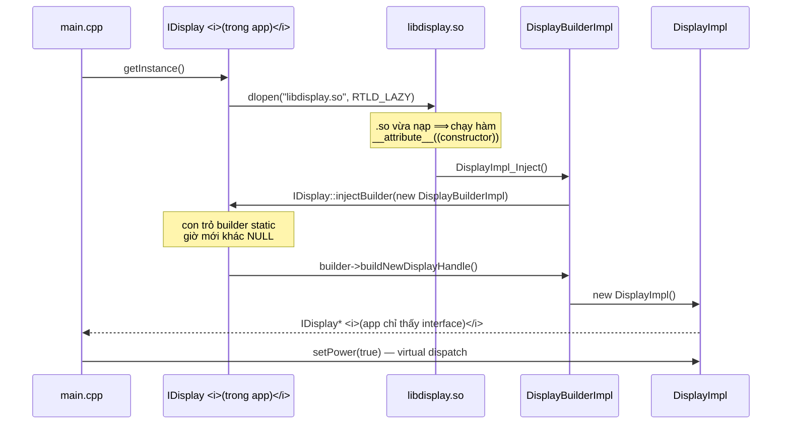

# A2 — Ranh giới C++ interface/impl: bộ khung TIÊU CHUẨN

> 🅰️ **PHẦN A — TIÊU CHUẨN.** Tài liệu này mổ **Tầng 0** của trục kiến trúc ở [A1](A1-baseline-libdisplay.md): lớp **C++ interface mà app nhìn thấy**, nằm **trên** mặt tiền C `lib_api_*`.
>
> ```
> App
>  └─ IDisplay / DisplayImpl      ← 🅰️ A2 (tài liệu này) · ranh giới KHÉP · C++
>       └─ lib_api_*              ← chỗ hẹp · ranh giới MỞ · extern "C"
>            └─ libdisplay nội bộ ← 🅰️ A1 · C++ không phải ABI
> ```
>
> Đường nối giữa hai tài liệu nằm ngay trong code: `DisplayImpl::setPower()` gọi xuống `lib_api_set_power()`.
> Muốn xem bản **làm lại** → [🅱️ B1](B1-redesign-architecture.md).

> **TL;DR**
> - Bộ khung HAL ([`project_implementation/HAL_layer`](../../14-prep/mock-interview/project_implementation/HAL_layer) — **bị `.gitignore`, pack code đầy đủ ở §6**) chứa **năm** pattern chồng lên nhau: Bridge (qua ranh giới `.so`) · **Factory Method** · **Self-registration / DI** · Singleton · **Null Object**. Bốn trong năm cái đó bạn viết ra mà chưa gọi tên — gọi đúng tên là phần lớn giá trị của tài liệu này.
> - ⚠️ **`IDisplayBuilder` KHÔNG phải Builder pattern.** Nó là **Factory Method**. Nói sai tên ở phỏng vấn tệ hơn không nói.
> - 🔴 **Ba vấn đề thật, đã đo bằng máy, không phỏng đoán:** (1) `getInstance()` có **data race** — TSan bắt được; (2) chèn một `virtual` vào giữa `IDisplay` ⟹ app gọi `setPower()` mà **destructor chạy**, exit 0, **không crash, không log**; (3) cái tên sai ở trên.
> - Bài học lớn nhất: **qua ranh giới `.so`, vtable là ABI.** Thêm virtual **luôn** là ABI break — virtual-không-pure chỉ cho tương thích **mã nguồn**, không cho tương thích **nhị phân** (§2.1). Và version check bảo vệ được API **thiếu**, không bảo vệ được slot **bị đảo** (§3.3).
> - 📦 **§6 — pack code hoàn chỉnh** (9 file, 301 dòng, build sạch `-Wall -Wextra`) đặt trong mục ẩn để copy sang máy khác: `HAL_layer` đang bị `.gitignore` nên không đi theo repo.
> - 🧪 **§7 — 5 bài lab NGỒI MÁY** tái hiện đúng từng vấn đề trên, kèm **output thật đã chạy** để đối chiếu.

---

## 1. Luồng thật — chuyện gì xảy ra khi gọi `getInstance()`



**Output thật khi chạy** (`build/bin/hal_demo`, đã chạy lại 09/09):

```
loadlib successfully: libdisplay.so
DisplayImpl Constructor
[setPower] power change to: ON
```

⭐ **Điểm tinh tế đáng nói ở phỏng vấn:** mũi tên `BI → IF` (`injectBuilder`) đi **ngược chiều** dependency thông thường — `.so` gọi vào một symbol nằm trong **app**. Nó chỉ chạy được vì `CMakeLists.txt` đặt `ENABLE_EXPORTS ON` (tức `-rdynamic`), khiến executable **xuất** symbol của nó ra cho `.so` phân giải. Bỏ dòng đó ⟹ `dlopen` thành công nhưng `.so` không resolve được `IDisplay::injectBuilder` ⟹ hỏng lúc runtime, không phải lúc link. Cơ chế: [07/linking-loading.md](../../07-shared-libraries/linking-loading.md).

---

## 2. Mỗi mảnh là pattern gì

| Mảnh code | Pattern | Nó mua được gì |
|---|---|---|
| `IDisplay` (virtual, **không** pure) ↔ `DisplayImpl` trong `.so` | **Bridge** *(dạng handle–body qua ranh giới `.so`)* | App biên dịch **chỉ với header interface**. Đổi implementation = thay `.so`, không rebuild app |
| `IDisplayBuilder::buildNewDisplayHandle()` | **Factory Method** *(không phải Builder — §3.1)* | App nhận `IDisplay*` mà **không hề biết tên class cụ thể**. Đây là DIP được thi hành ở mức nhị phân |
| `injectBuilder()` + `__attribute__((constructor))` | **Self-registration** *(một dạng Dependency Injection / IoC)* | Interface **không cần biết** có bao nhiêu impl. Thêm impl mới = thêm một `.so`, **không sửa một dòng nào** của interface |
| `getInstance()` với `static` cục bộ | **Singleton** | Một handle duy nhất cho tài nguyên phần cứng duy nhất |
| `new (std::nothrow) IDisplay()` khi không có builder, mọi API trả `-ENOTSUP` | **Null Object** | `.so` thiếu/hỏng ⟹ **degrade, không crash**. Lớp trên không phải kiểm `nullptr` ở mọi lời gọi |

### 2.1 Null Object — mảnh dễ bị bỏ qua nhất, mà lại đáng nói nhất

Trong `IDisplay.cpp`:

```cpp
if (builder) {
    p_instance = builder->buildNewDisplayHandle();
} else {
    p_instance = new (std::nothrow) IDisplay();   // dummy, at least no crash
}
...
int IDisplay::setPower(bool onoff) { return -ENOTSUP; }   // base = no-op có ý nghĩa
```

Đây là **Null Object pattern**: thay vì trả `nullptr` và bắt **mọi** caller kiểm tra, trả về một object **hợp lệ nhưng không làm gì**, báo lỗi bằng mã trả về.

**Nó còn mua một thứ thứ hai — nhưng phải nói CHÍNH XÁC nó mua được cái gì**, vì đây đúng là chỗ dễ trả lời sai:

> Vì các API là **virtual thường** chứ không pure virtual, thêm `setBrightness()` vào `IDisplay` **không bắt implementation phải sửa code**: `DisplayImpl` không override thì tự rơi về bản base trả `-ENOTSUP`. Nếu dùng `= 0` thì mỗi API mới **bắt buộc mọi impl cập nhật cùng lúc** — bất khả thi khi các board release lệch nhau.

⚠️ **Đó là tương thích ở mức MÃ NGUỒN, KHÔNG phải mức NHỊ PHÂN.** Phân biệt này là ranh giới giữa câu trả lời đúng và câu trả lời nghe có vẻ đúng:

| | Tương thích **nguồn** | Tương thích **nhị phân** |
|---|---|---|
| Nghĩa | `.so` **biên dịch lại** với header mới mà **không sửa dòng code nào** | `.so` **đã biên dịch từ trước** vẫn dùng được, không build lại |
| virtual-không-pure có cho không? | ✅ **Có** | ❌ **Không** |
| Vì sao | Base có sẵn bản cài đặt mặc định | Vtable của `.so` cũ **ngắn hơn** — nó không có slot cho API mới |

**Đã đo thật** (Lab 3b, §7): app build với header v2 gọi `setBrightness()` trên object đến từ `.so` **v1** ⟹ đọc quá cuối vtable ⟹ **segfault**, không phải `-ENOTSUP`.

⟹ **Kết luận thi hành:** thêm bất kỳ virtual nào vào interface **là một ABI break**. Muốn gọi API mới an toàn thì phải có **cơ chế hỏi khả năng** tồn tại **từ v1** — trong pack tham chiếu ở §6 là `IDisplayBuilder::abiVersion()` trên một interface bootstrap **đông cứng vĩnh viễn**.

| | Trả `nullptr` | **Null Object** |
|---|---|---|
| Caller | Phải kiểm ở **mọi** lời gọi | Gọi thẳng |
| Quên kiểm | **Segfault** | Trả `-ENOTSUP`, log được |
| Phân biệt "không hỗ trợ" vs "lỗi thật" | Không | Có (mã lỗi riêng) |
| Chi phí | 0 | Một object rỗng |

---

## 3. Ba vấn đề thật — đã đo bằng máy

> Cả ba đều **kiểm chứng bằng compiler/sanitizer thật**, output dán nguyên văn. Đây không phải nhận xét thẩm mỹ.

### 3.1 Cái tên: `IDisplayBuilder` là **Factory Method**, không phải Builder

```cpp
class IDisplayBuilder {
public:
    virtual IDisplay* buildNewDisplayHandle() = 0;   // MỘT lời gọi → object xong luôn
};
```

| | **GoF Builder** | **Factory Method** | Code của bạn |
|---|---|---|---|
| Vấn đề giải | Object có **nhiều tham số / dựng nhiều bước** | *"Tạo loại nào?"* — client không biết class cụ thể | *"Tạo loại nào?"* |
| Hình dạng | Nhiều setter nối chuỗi rồi `build()` | **Một** hàm ảo trả object | Một hàm ảo trả object |
| Ai quyết định loại | Client | **Lớp con của factory** | `DisplayBuilderImpl` trong `.so` |

⟹ **Đúng tên GoF là Factory Method.**

🔴 **Vì sao đây là rủi ro phỏng vấn thật, không phải chuyện chữ nghĩa:** repo đã ghi nhận đúng cơ chế này ở [bài học #4](../../14-prep/study-plans/datalogic-plan.md) — *"nói ra một thuật ngữ là mời interviewer hỏi vào đúng nó"*. Nói *"em dùng Builder pattern"* ⟹ câu tiếp theo gần như chắc chắn là *"Builder khác Factory thế nào?"* ⟹ mô tả không khớp code vừa kể.

✅ **Cách nói an toàn và ghi điểm** *(biến điểm yếu thành điểm mạnh)*:

> *"Trong codebase nó tên là `IDisplayBuilder`, nhưng đúng tên GoF thì đó là **Factory Method** — nó tạo object trong một lời gọi chứ không dựng từng bước. Tên `Builder` là quy ước nội bộ có từ trước."*

### 3.2 🔴 `getInstance()` có **data race** — TSan bắt được

```cpp
IDisplay* IDisplay::getInstance() {
    static IDisplay* p_instance = nullptr;      // khởi tạo hằng — KHÔNG có guard
    if (p_instance == nullptr) {                // ❌ đọc không đồng bộ
        loadlib(LIB_PATH);                      // ❌ ghi biến global `handle`
        if (builder) p_instance = builder->buildNewDisplayHandle();   // ❌ ghi không đồng bộ
        else         p_instance = new (std::nothrow) IDisplay();
    }
    return p_instance;
}
```

**Vì sao KHÔNG được bảo vệ dù có chữ `static`:** "magic statics" (bảo đảm thread-safe của C++11) chỉ áp cho **khởi tạo** của biến static — mà ở đây khởi tạo là `= nullptr`, một **constant initialization** không cần guard nào cả. Phần `if` + gán bên dưới là **code thường**, hoàn toàn không được bảo vệ. Đây đúng là mẫu **check-then-act** kinh điển.

**Bằng chứng — TSan trên chính đoạn logic đó** (`g++ -std=c++17 -fsanitize=thread -g -O1`, chạy `setarch -R`, 4 thread):

```
WARNING: ThreadSanitizer: data race (pid=10619)
  Read of size 8 at 0x555555558020 by thread T2:
    #0 IDisplay::getInstance() race.cpp:9
  Previous write of size 8 at 0x555555558020 by thread T1:
    #0 IDisplay::getInstance() race.cpp:10
  Location is global 'IDisplay::getInstance()::p_instance' of size 8
```

**Hậu quả cụ thể nếu hai thread cùng gọi lần đầu:** `dlopen` chạy **hai lần** (may là idempotent, chỉ tăng refcount), `buildNewDisplayHandle()` chạy **hai lần** ⟹ **hai `DisplayImpl`**, mỗi cái `open("/dev/display_dev")` riêng ⟹ **rò một fd** + hai object cùng điều khiển một thiết bị. Comment `// MT-safe` trong code hiện tại nói về `dlopen`, **không** che được phần này.

✅ **Cách sửa — để magic statics làm việc đó, đừng tự viết khoá:**

```cpp
IDisplay* IDisplay::getInstance() {
    // static local có KHỞI TẠO ĐỘNG ⟹ compiler sinh guard variable,
    // luồng đầu tiên chạy lambda, các luồng khác BLOCK tới khi xong.
    static IDisplay* p_instance = [] () -> IDisplay* {
        loadlib(LIB_PATH);
        if (builder) return builder->buildNewDisplayHandle();
        return new (std::nothrow) IDisplay();
    }();
    return p_instance;
}
```

**Kiểm chứng bản sửa** — cùng bộ test 4 thread:

```
$ setarch -R ./race_fix
done, no race                       # TSan im lặng

$ g++ -std=c++17 -O1 -S race_fix.cpp -o - | grep cxa_guard
	call	__cxa_guard_acquire@PLT       # guard variable CÓ thật
	call	__cxa_guard_release@PLT
	call	__cxa_guard_abort@PLT
```

> 💡 Cơ chế `__cxa_guard_*` và vì sao double-checked locking tự viết trước C++11 là sai: [creational §Vì sao Meyers thread-safe](../creational.md). Sau lần đầu, mỗi lời gọi chỉ còn **một atomic load** — gọi triệu lần vẫn rẻ.

⚠️ **Vẫn còn một tầng nữa, đừng nhầm:** magic statics chỉ bảo vệ **việc khởi tạo**. Các API của `DisplayImpl` (`setPower`…) nếu sửa state chung thì **vẫn phải tự đồng bộ** bên trong.

### 3.3 🔴 vtable **là ABI** — chèn một virtual vào giữa làm chạy nhầm hàm, im lặng

Đây là thí nghiệm đáng giá nhất trong cả tài liệu. **Kịch bản:** thêm API mới `setBrightness()` vào `IDisplay`, đặt **trước** `setPower` cho gọn nhóm; rebuild **app**; giữ nguyên `libdisplay.so` **cũ** (đúng như ngoài đời: `.so` do team khác / board khác cấp).

```cpp
class IDisplay {
public:
    virtual int setBrightness(int level);   // ⬅️ API MỚI chèn vào GIỮA
    virtual int setPower(bool onoff);
    virtual ~IDisplay();
};
```

**Chạy thật — app mới + `.so` cũ:**

```
loadlib successfully: libdisplay.so
DisplayImpl Constructor
DisplayImpl Destructor            ⬅️ ??? gọi setPower mà DESTRUCTOR chạy
(exit=0)
```

`[setPower] power change to: ON` **biến mất**. Không crash. Không log lỗi. **Exit code 0.**

**Vì sao — đọc thẳng vtable do compiler sinh** (`g++ -fdump-lang-class`):

```
Vtable for DisplayImpl: 5 entries
0     (offset-to-top)
8     (& RTTI)
16    DisplayImpl::setPower          ⬅️ slot hàm 0
24    DisplayImpl::~DisplayImpl      ⬅️ slot hàm 1  (complete dtor)
32    DisplayImpl::~DisplayImpl      ⬅️ slot hàm 2  (deleting dtor)
```

| | `.so` **cũ** (đã biên dịch xong, không đổi) | App **mới** (header có `setBrightness`) |
|---|---|---|
| slot hàm 0 | `setPower` | `setBrightness` |
| slot hàm 1 | `~DisplayImpl` *(complete)* | **`setPower`** |
| slot hàm 2 | `~DisplayImpl` *(deleting)* | `~IDisplay` |

App biên dịch lời gọi `setPower` thành *"nhảy tới **slot 1**"*. Object thật đến từ `.so` cũ, mà slot 1 của nó là **destructor** ⟹ destructor chạy. Trình biên dịch không sai; **hai bên đang dùng hai bản đồ vtable khác nhau**.

> 🔴 **Vì sao lớp bug này nguy hiểm bậc nhất:** nó **không** biểu hiện lúc build, lúc link, hay lúc `dlopen`. Không có symbol nào thiếu. Nó chỉ là **một số nguyên chỉ mục** đã bị đóng băng vào binary. Triệu chứng ngoài hiện trường sẽ là *"board này bật panel không lên"* — và không ai nghĩ tới vtable.

✅ **Luật sống với virtual interface qua `.so`** *(nói được đủ ba dòng này là điểm 4)*:

| Việc | Được? | Vì sao |
|---|---|---|
| **Append** virtual mới **sau khai báo destructor** | 🟡 **Chỉ khi có version check** | Slot **cũ** giữ nguyên chỉ mục nên API cũ vẫn đúng — nhưng `.so` cũ **không có** slot mới, gọi vào là đọc quá bảng (Lab 3b) |
| Append virtual **trước** destructor | ❌ | Destructor chiếm **2 slot tại đúng vị trí nó được khai báo** ⟹ chèn trước nó là **dịch slot destructor**, `delete` qua con trỏ base sẽ gọi nhầm |
| Chèn virtual vào **giữa** | ❌ | Dịch chỉ mục mọi slot phía sau (Lab 3a) |
| **Xoá** / **đổi thứ tự** virtual | ❌ | Như trên |
| Thêm **data member** vào `IDisplay` | ❌ | Đổi `sizeof` / layout — `.so` cũ dựng object sai kích thước |
| Đổi chữ ký (kể cả thêm tham số mặc định) | ❌ | Đổi mangled name / cách truyền tham số |

> ⭐ **Bằng chứng cho dòng 2** (`-fdump-lang-class`, gcc 11) — slot đi theo **thứ tự khai báo**, destructor không tự nhảy xuống cuối:
> ```
> Đặt setBrightness TRƯỚC ~IDisplay:      Đặt SAU ~IDisplay:
>   16  setPower                            16  setPower
>   24  setBrightness   ⬅️ chen vao          24  ~DisplayImpl
>   32  ~DisplayImpl    ⬅️ bi DICH           32  ~DisplayImpl
>   40  ~DisplayImpl    ⬅️ bi DICH           40  setBrightness  ⬅️ noi them
> ```
>
> 🔴 **Và đây là chỗ đáng nhớ nhất của cả tài liệu:** ở Lab 3a, `abiVersion()` của hai bên **đều là 2** — version check **PASS** — mà `setBrightness()` vẫn chạy vào destructor. **Version check bảo vệ được API THIẾU, không bảo vệ được slot BỊ ĐẢO.** Chỗ đó chỉ có kỷ luật review bảo vệ.

> 🔗 Đây chính là lý do tồn tại của **Pimpl** — giấu toàn bộ data member sau một con trỏ để layout không bao giờ đổi: [07/api-design §2](../../07-shared-libraries/api-design.md). Và là lý do biên giới `extern "C"` bền hơn C++ interface: [07/abi-versioning.md](../../07-shared-libraries/abi-versioning.md).
>
> 💡 **Đối chiếu với việc thật của bạn:** resume ghi *"the kernel driver dispatches through a function-pointer table"*. Bảng con trỏ hàm đó là **cùng một ý tưởng vtable, viết tay bằng C** — và nó dính **đúng luật trên**: chèn một entry vào giữa struct ops thì mọi driver biên dịch trước đó gọi nhầm hàm. Nói được sự tương ứng này là một câu trả lời rất mạnh.

### 3.4 Bốn điểm nhỏ hơn, nên nhận ra trước khi interviewer chỉ ra

| Điểm | Vấn đề | Ghi chú |
|---|---|---|
| `errno` sau `dlopen` | `dlopen` **không** hứa set `errno`; `printf` in `errno_now`/`%m` có thể là giá trị rác từ lời gọi trước | Nguồn lỗi đúng là `dlerror()` — code **đã** in nó, chỉ cần bỏ phần `errno` |
| `handle` là biến global không `static` | Xuất ra ngoài, dễ đụng tên khi nhiều `.so` cùng làm vậy | Cho `static` (internal linkage) là xong |
| Không bao giờ `dlclose` | Cố ý cũng được (library sống hết đời process) | **Nói rõ là cố ý**, đừng để interviewer nghĩ là quên |
| `new DisplayBuilderImpl()` trong `injectThisBuilder()` | Không ai xoá | Chấp nhận được với singleton sống hết đời process — nhưng nên **biết** là mình chấp nhận |

---

## 4. Vì sao thiết kế này, thay vì link thẳng `.so`?

Đây là câu *"vì sao"* mà interviewer sẽ hỏi ngay sau khi bạn mô tả xong kiến trúc.

| | **Link thẳng** (`target_link_libraries`) | **`dlopen` + self-registration** *(cách của bạn)* |
|---|---|---|
| Chọn implementation | Lúc **link**, cố định trong binary | Lúc **boot**, theo board config |
| Một binary cho nhiều board | ❌ Mỗi board một bản | ✅ **Một bản, nhiều board** |
| Thiếu `.so` | Không chạy nổi (loader báo lỗi, chết ngay) | ✅ Chạy tiếp ở chế độ Null Object |
| Sai kiểu/thiếu symbol | Bắt được lúc **link** | 🔴 Chỉ lộ lúc **runtime** |
| ABI | Vẫn phải giữ, nhưng thường build cùng lúc | 🔴 **Bắt buộc giữ thủ công** — §3.3 |
| Debug | Thẳng | Khó hơn: breakpoint trong `.so` chưa nạp là *pending* ([DBG-041](../../14-prep/mock-interview/bank/debugging.md)) |

⟹ **Đánh đổi cốt lõi, phát biểu một câu:** *đổi **an toàn lúc link** lấy **linh hoạt lúc boot**.* Đáng đổi khi một binary phải phục vụ nhiều board — đúng bối cảnh của bạn. Không đáng khi chỉ có một cấu hình phần cứng.

---

## 5. 🗣️ Bản nói 60 giây

> Phần này phục vụ [bài học #3](../../14-prep/study-plans/datalogic-plan.md) của plan: *lỗi **đóng gói** ≠ lỗ hổng kiến thức* — cùng kiến thức, đổi khung câu hỏi thì không truy xuất được. Chữa bằng **nói to, bấm giờ**, không phải đọc thêm.

**Câu hỏi:** *"Kể về kiến trúc phần C++ interface bạn làm."*

> *"Ứng dụng chỉ thấy một interface C++ cố định — `IDisplay`. Implementation thật nằm trong một shared library, nạp bằng `dlopen` lúc chạy. Khi `.so` được nạp, một hàm constructor của nó tự đăng ký một factory ngược lên interface; interface gọi factory đó để lấy object thật. Nhờ vậy một binary chạy được trên nhiều board — đổi board thì đổi `.so`, ứng dụng không build lại.*
>
> *Hai điểm tôi phải cẩn thận. Thứ nhất, các API của interface là virtual thường chứ không pure virtual, và bản base trả `-ENOTSUP` — kiểu Null Object — nên `.so` cũ chưa có API mới thì vẫn chạy được, chỉ báo không hỗ trợ. Thứ hai, và quan trọng hơn: khi interface là virtual qua ranh giới `.so` thì **vtable trở thành ABI**. API mới chỉ được thêm vào **cuối** class. Tôi đã thử chèn vào giữa: app gọi `setPower` nhưng destructor chạy, không crash, exit code 0 — sai im lặng, rất khó truy."*

**Ba câu hỏi đuổi gần như chắc chắn tới sau — chuẩn bị sẵn:**

| Câu hỏi đuổi | Ý chốt |
|---|---|
| *"`getInstance()` của bạn có thread-safe không?"* | **Không** — `if (p == nullptr)` là check-then-act, magic statics không che vì khởi tạo là `= nullptr`. Sửa bằng static local có khởi tạo động (§3.2) |
| *"Sao `.so` gọi được hàm nằm trong app?"* | Executable phải xuất symbol: `-rdynamic` / `ENABLE_EXPORTS ON` (§1) |
| *"Nếu `.so` không tồn tại thì sao?"* | Null Object: object dummy, mọi API `-ENOTSUP`, không crash (§2.1) |

---

---

## 6. 📦 Pack code hoàn chỉnh — copy ra là chạy

> **Vì sao có mục này:** `project_implementation/HAL_layer` nằm trong `.gitignore`, nên nó **không đi theo repo** sang máy khác. Toàn bộ code dưới đây là **bản tham chiếu đã kiểm chứng**: build sạch `-Wall -Wextra` (**0 warning**), chạy đúng, và là nền cho 5 bài lab ở §7.

### 6.1 Khác gì so với bản gốc bạn viết

Giữ nguyên tên file, tên class, cấu trúc thư mục để §1–§3 vẫn đọc khớp. Thay đổi đều là **vá đúng ba vấn đề đã đo ở §3** cộng vài chỗ vệ sinh:

| # | Thay đổi | Vá cái gì |
|---|---|---|
| 1 | `getInstance()` dùng **static local có khởi tạo động** (lambda) | 🔴 Data race §3.2 — nay có guard variable thật |
| 2 | **`IDisplayBuilder::abiVersion()`** + macro `HAL_DISPLAY_ABI_VERSION`; `IDisplayBuilder` được tuyên bố **đông cứng vĩnh viễn** | 🔴 §2.1 — không có nó thì **không cách nào** gọi API mới an toàn qua `.so` cũ |
| 3 | `setBrightness()` (API v2) khai báo **sau destructor**, và app **kiểm version trước khi gọi** | 🔴 ABI §3.3 |
| 4 | `handle` → `g_handle` trong anonymous namespace; bỏ `errno`/`%m`, chỉ dùng `dlerror()` | §3.4 |
| 5 | Builder là **static local** thay vì `new` không ai xoá | §3.4 |
| 6 | `LIB_PATH` = `"$ORIGIN/libdisplay.so"`, ghi đè được bằng biến môi trường `HAL_DISPLAY_LIB` | Chạy được từ thư mục bất kỳ; và **bắt buộc** cho Lab 1 (TSan chặn `dlopen` nên `$ORIGIN` không bung ra được) |
| 7 | `main` có `--threads N` và `--force-v2` | Chỗ móc cho Lab 1 và Lab 3b |
| 8 | Comment giải thích **cơ chế friend hai chặng** cho `injectBuilder` | Chi tiết tinh tế, xem 6.3 |

### 6.2 Dựng và chạy

```bash
mkdir -p hal_lab && cd hal_lab      # tạo 9 file theo đúng cây thư mục ở 6.4
cmake -S . -B build
cmake --build build -j4             # phải KHÔNG có warning nào
cd build/bin && ./hal_demo
```

**Output chuẩn — đối chiếu với màn hình của bạn:**

```
loadlib OK: $ORIGIN/libdisplay.so
impl ABI version = 2 (interface = 2)
DisplayImpl ctor  (fd=-1, khong co thiet bi - binh thuong tren may dev)

-- API v1 (luon goi duoc) --
  [impl] setPower -> ON
setPower(true)      -> 0

-- API v2 (PHAI kiem version truoc) --
  [impl] setBrightness -> 200 nits
setBrightness(200)  -> 0
```

> `fd=-1` là **đúng** trên máy dev — không có `/dev/display_dev`. Đường lỗi vẫn phải chạy được, và chính cái fd này là thứ bị rò khi có race (Lab 1).

### 6.3 ⭐ Một chi tiết access-control đáng biết trước khi đọc code

`IDisplay::injectBuilder()` là **protected**, mà `DisplayBuilderImpl` (nằm trong `.so`) gọi được nó. Vì sao?

- `DisplayBuilderImpl` là **`friend` của `DisplayImpl`** ⟹ nó có quyền truy cập ngang một **member của `DisplayImpl`**.
- `DisplayImpl` **dẫn xuất** từ `IDisplay` ⟹ member của nó truy cập được thành viên **protected** của lớp cơ sở.
- `injectBuilder` là **static**, nên không vướng ràng buộc *"chỉ truy cập qua object kiểu dẫn xuất"* áp cho protected non-static.

Bỏ dòng `friend class DisplayBuilderImpl;` trong `DisplayImpl.hpp` là **compile error ngay**:
```
error: 'static void IDisplay::injectBuilder(IDisplayBuilder*)' is protected within this context
```
Đây là **friendship hai chặng** — chạy đúng nhưng khá ngầm; ở phỏng vấn nói ra được là điểm cộng, còn trong code thật thì đáng một dòng comment (pack đã thêm).

### 6.4 Toàn bộ mã nguồn

<details><summary><b>📦 Bấm để mở — 9 file, 301 dòng (CMake + interface + impl + main)</b></summary>

> Cây thư mục:
> ```
> hal_lab/
> ├── CMakeLists.txt
> ├── main.cpp
> ├── interface/   IDisplayBuilder.hpp · IDisplay.hpp · IDisplay.cpp
> └── impl/        DisplayImpl.hpp · DisplayImpl.cpp · DisplayBuilderImpl.hpp · DisplayBuilderImpl.cpp
> ```

**`CMakeLists.txt`**

```cmake
cmake_minimum_required(VERSION 3.16)
project(hal_lab CXX)

set(CMAKE_CXX_STANDARD 17)
set(CMAKE_CXX_STANDARD_REQUIRED ON)
add_compile_options(-Wall -Wextra)

# ---- Tuy chon cho cac bai lab -----------------------------------------------
option(HAL_TSAN "Build voi ThreadSanitizer (Lab 1)" OFF)
if(HAL_TSAN)
  add_compile_options(-fsanitize=thread -g -O1)
  add_link_options(-fsanitize=thread)
endif()

# .so va app nam canh nhau de $ORIGIN tim thay
set(CMAKE_RUNTIME_OUTPUT_DIRECTORY ${CMAKE_BINARY_DIR}/bin)
set(CMAKE_LIBRARY_OUTPUT_DIRECTORY ${CMAKE_BINARY_DIR}/bin)

# ---- plugin: implementation, nap bang dlopen (app KHONG link toi no) --------
add_library(display SHARED
    impl/DisplayImpl.cpp
    impl/DisplayBuilderImpl.cpp)
target_include_directories(display PRIVATE impl interface)

# ---- app: interface + main --------------------------------------------------
add_executable(hal_demo
    main.cpp
    interface/IDisplay.cpp)
target_include_directories(hal_demo PRIVATE interface)
target_link_libraries(hal_demo PRIVATE ${CMAKE_DL_LIBS} pthread)

set_target_properties(hal_demo PROPERTIES
    ENABLE_EXPORTS ON          # = -rdynamic: .so phai resolve duoc IDisplay::injectBuilder
    BUILD_RPATH "$ORIGIN")

add_dependencies(hal_demo display)   # app khong link .so nen phai ep thu tu build
```

**`interface/IDisplayBuilder.hpp`**

```cpp
#pragma once
#include <cstdint>

class IDisplay;

// ============================================================================
//  IDisplayBuilder — BOOTSTRAP INTERFACE, ĐÔNG CỨNG VĨNH VIỄN.
//
//  ⚠️ KHÔNG BAO GIỜ thêm / xoá / đổi thứ tự virtual trong class này.
//     Đây là mảnh DUY NHẤT mà app và .so phải thống nhất về layout ngay từ v1.
//     Mọi tiến hoá về sau đi qua abiVersion() + IDisplay, không đi qua đây.
//
//  Đúng tên GoF: FACTORY METHOD (tạo xong trong một lời gọi), không phải Builder.
//  Tên "Builder" giữ lại theo quy ước codebase gốc.
// ============================================================================
class IDisplayBuilder {
public:
    // .so này được biên dịch với HAL_DISPLAY_ABI_VERSION bằng bao nhiêu.
    // App PHẢI hỏi trước khi gọi bất kỳ API nào thêm sau v1.
    virtual uint32_t abiVersion() const = 0;

    virtual IDisplay* buildNewDisplayHandle() = 0;

    IDisplayBuilder() = default;
    virtual ~IDisplayBuilder() = default;
};
```

**`interface/IDisplay.hpp`**

```cpp
#pragma once
#include <cstdint>
#include "IDisplayBuilder.hpp"

// Phiên bản ABI của IDisplay. TĂNG mỗi khi thêm API mới vào class dưới đây.
//   v1: setPower
//   v2: + setBrightness
#define HAL_DISPLAY_ABI_VERSION 2u

class IDisplay {
public:
    static IDisplay* getInstance();

    // .so đang nạp được build với header phiên bản nào (0 = không có .so → Null Object)
    static uint32_t implAbiVersion();

    // ------------------------------------------------------------------
    //  API — virtual THƯỜNG (không pure): bản base là Null Object,
    //  trả -ENOTSUP thay vì bắt caller kiểm nullptr.
    //
    //  ⚠️ LUẬT ABI (xem Lab 3): slot vtable đi theo THỨ TỰ KHAI BÁO, và
    //     destructor chiếm đúng vị trí nó được khai báo.
    //     ⟹ API mới CHỈ được thêm SAU destructor, ở cuối cùng.
    //     ⟹ Và ngay cả vậy, .so cũ VẪN KHÔNG có slot đó ⟹ phải kiểm
    //        implAbiVersion() trước khi gọi. Không có ngoại lệ.
    // ------------------------------------------------------------------
    virtual int setPower(bool onoff);          // v1 — slot 0
    virtual ~IDisplay();                       // v1 — slot 1,2
    virtual int setBrightness(int nits);       // v2 — slot 3  (THÊM Ở CUỐI)

protected:
    IDisplay();

    friend class IDisplayBuilder;
    static IDisplayBuilder* builder;
    static void injectBuilder(IDisplayBuilder* b);
    // 💡 Vì sao DisplayBuilderImpl gọi được injectBuilder() dù nó protected:
    //    DisplayBuilderImpl là friend của DisplayImpl (lớp DẪN XUẤT của IDisplay),
    //    nên nó có quyền của một member DisplayImpl — và member lớp dẫn xuất
    //    truy cập được static protected của lớp cơ sở. Hai chặng, khá tinh tế.
};
```

**`interface/IDisplay.cpp`**

```cpp
#include <dlfcn.h>
#include <errno.h>
#include <stdio.h>
#include <stdlib.h>
#include <new>

#include "IDisplay.hpp"
#include "IDisplayBuilder.hpp"

#define LIB_PATH "$ORIGIN/libdisplay.so"   // $ORIGIN = thu muc chua executable; dlopen tu bung ra

namespace {
void* g_handle = nullptr;      // static: internal linkage, không xuất ra ngoài

// Cho phép ép đường dẫn .so qua biến môi trường — vừa tiện test, vừa cần cho
// Lab 1: ThreadSanitizer chặn dlopen nên "$ORIGIN" không bung ra được.
const char* libPath() {
    const char* p = getenv("HAL_DISPLAY_LIB");
    return (p && *p) ? p : LIB_PATH;
}

// dlopen KHÔNG hứa set errno ⟹ nguồn lỗi đúng là dlerror(), không phải %m.
bool loadlib(const char* path) {
    g_handle = dlopen(path, RTLD_LAZY);
    if (!g_handle) {
        printf("loadlib FAILED: %s -> %s\n", path, dlerror());
        return false;
    }
    printf("loadlib OK: %s\n", path);
    return true;
}
}  // namespace

IDisplayBuilder* IDisplay::builder = nullptr;
IDisplay::IDisplay()  = default;
IDisplay::~IDisplay() = default;

void IDisplay::injectBuilder(IDisplayBuilder* b) { IDisplay::builder = b; }

// ----------------------------------------------------------------------------
//  ✅ THREAD-SAFE: static local có KHỞI TẠO ĐỘNG ⟹ compiler sinh guard variable
//     (__cxa_guard_acquire/release). Luồng đầu tiên chạy lambda, các luồng khác
//     BLOCK tới khi xong. Sau lần đầu chỉ còn một atomic load.
//
//  ⚠️ Bản gốc viết `static IDisplay* p = nullptr; if (p == nullptr) {...}` —
//     đó là constant initialization, KHÔNG sinh guard, và phần if là
//     check-then-act có data race thật. Xem Lab 1.
// ----------------------------------------------------------------------------
IDisplay* IDisplay::getInstance() {
    static IDisplay* p_instance = [] () -> IDisplay* {
        if (loadlib(libPath()) && builder) {
            printf("impl ABI version = %u (interface = %u)\n",
                   builder->abiVersion(), HAL_DISPLAY_ABI_VERSION);
            return builder->buildNewDisplayHandle();
        }
        printf("=> khong co impl, dung NULL OBJECT (moi API tra -ENOTSUP)\n");
        return new (std::nothrow) IDisplay();
    }();
    return p_instance;
}

uint32_t IDisplay::implAbiVersion() {
    getInstance();                                  // bảo đảm đã nạp
    return builder ? builder->abiVersion() : 0u;
}

// ---------------- Null Object: bản base của mọi API ----------------
int IDisplay::setPower(bool)      { return -ENOTSUP; }
int IDisplay::setBrightness(int)  { return -ENOTSUP; }
```

**`impl/DisplayImpl.hpp`**

```cpp
#pragma once
#include "IDisplay.hpp"

class DisplayImpl : public IDisplay {
public:
    int setPower(bool onoff) override;
    int setBrightness(int nits) override;
    ~DisplayImpl() override;

protected:
    friend class DisplayBuilderImpl;   // chỉ builder được tạo DisplayImpl
    DisplayImpl();

private:
    int display_fd_;
};
```

**`impl/DisplayImpl.cpp`**

```cpp
#include <fcntl.h>
#include <unistd.h>
#include <errno.h>
#include <stdio.h>

#include "DisplayImpl.hpp"

#define DEV_PATH "/dev/display_dev"

DisplayImpl::DisplayImpl() : display_fd_(-1) {
    // Trên máy dev không có /dev/display_dev — CHỦ Ý: đường lỗi phải chạy được,
    // và đây cũng là fd bị rò khi getInstance() có race (Lab 1).
    display_fd_ = open(DEV_PATH, O_RDWR);
    printf("DisplayImpl ctor  (fd=%d%s)\n", display_fd_,
           display_fd_ < 0 ? ", khong co thiet bi - binh thuong tren may dev" : "");
}

DisplayImpl::~DisplayImpl() {
    if (display_fd_ >= 0) { close(display_fd_); display_fd_ = -1; }
    printf("DisplayImpl dtor\n");
}

int DisplayImpl::setPower(bool onoff) {
    // Thực tế: ret = lib_api_set_power(onoff);  /* xuống libdisplay -> ioctl */
    printf("  [impl] setPower -> %s\n", onoff ? "ON" : "OFF");
    return 0;
}

int DisplayImpl::setBrightness(int nits) {
    printf("  [impl] setBrightness -> %d nits\n", nits);
    return 0;
}
```

**`impl/DisplayBuilderImpl.hpp`**

```cpp
#pragma once
#include "IDisplayBuilder.hpp"

class IDisplay;

class DisplayBuilderImpl : public IDisplayBuilder {
public:
    uint32_t  abiVersion() const override;
    IDisplay* buildNewDisplayHandle() override;

    static void injectThisBuilder();

    DisplayBuilderImpl()           = default;
    ~DisplayBuilderImpl() override = default;
};
```

**`impl/DisplayBuilderImpl.cpp`**

```cpp
#include <new>
#include "IDisplay.hpp"
#include "DisplayImpl.hpp"
#include "DisplayBuilderImpl.hpp"

// SELF-REGISTRATION: loader chạy hàm này ngay khi .so được dlopen.
// Nó gọi NGƯỢC lên một symbol nằm trong APP — chỉ chạy được vì executable
// bật ENABLE_EXPORTS (= -rdynamic). Bỏ dòng đó trong CMake -> hỏng lúc runtime.
extern "C" void __attribute__((constructor)) DisplayImpl_Inject() {
    DisplayBuilderImpl::injectThisBuilder();
}

void DisplayBuilderImpl::injectThisBuilder() {
    static DisplayBuilderImpl s_builder;   // sống hết đời process, không cần new
    IDisplay::injectBuilder(&s_builder);
}

// .so báo nó được biên dịch với header phiên bản nào.
uint32_t DisplayBuilderImpl::abiVersion() const { return HAL_DISPLAY_ABI_VERSION; }

IDisplay* DisplayBuilderImpl::buildNewDisplayHandle() {
    return new (std::nothrow) DisplayImpl();
}
```

**`main.cpp`**

```cpp
#include <cstdio>
#include <cstdlib>
#include <cstring>
#include <thread>
#include <vector>

#include "IDisplay.hpp"

static void demo(bool forceV2) {
    IDisplay* d = IDisplay::getInstance();

    printf("\n-- API v1 (luon goi duoc) --\n");
    printf("setPower(true)      -> %d\n", d->setPower(true));

    printf("\n-- API v2 (PHAI kiem version truoc) --\n");
    if (forceV2 || IDisplay::implAbiVersion() >= 2u) {
        if (forceV2) printf("(--force-v2: BO QUA kiem tra version - xem Lab 3b)\n");
        printf("setBrightness(200)  -> %d\n", d->setBrightness(200));
    } else {
        printf("BO QUA: impl ABI v%u < v2, .so cu KHONG co slot nay.\n",
               IDisplay::implAbiVersion());
        printf("       Goi thang se doc qua cuoi vtable -> segfault (Lab 3).\n");
    }
}

// Dung cho Lab 1: ep nhieu luong cung goi getInstance() lan dau.
static void race(int n) {
    std::vector<std::thread> ts;
    ts.reserve(static_cast<size_t>(n));
    for (int i = 0; i < n; ++i)
        ts.emplace_back([]{ IDisplay::getInstance()->setPower(true); });
    for (auto& t : ts) t.join();
    printf("\n%d luong da xong.\n", n);
}

int main(int argc, char** argv) {
    if (argc >= 2 && std::strcmp(argv[1], "--threads") == 0) {
        race(argc >= 3 ? std::atoi(argv[2]) : 4);
    } else {
        demo(argc >= 2 && std::strcmp(argv[1], "--force-v2") == 0);
    }
    return 0;
}
```

</details>

---

## 7. 🧪 Năm bài lab — NGỒI MÁY LÀM

> **Cấu trúc bốn bước, giống bộ lab BSP** ([plan §🧪](../../14-prep/study-plans/datalogic-plan.md)): ① **ĐỌC** cơ chế → ② **QUAN SÁT** nó chạy đúng → ③ **PHÁ có chủ đích** (⚠️ **viết dự đoán ra giấy TRƯỚC khi chạy**) → ④ **ĐỐI CHIẾU** với output thật bên dưới.
>
> Chỗ **dự đoán sai** chính là chỗ mô hình còn hổng — đó là toàn bộ giá trị của bài lab, không phải việc chạy được lệnh.
>
> **Yêu cầu:** `g++` (≥ 9), `cmake` ≥ 3.16, TSan (đi kèm gcc). Userspace thuần, **không cần root**. Mọi output dưới đây là **output thật đã chạy**, dán nguyên văn — không viết tay.

| # | Bài | Phá cái gì | Vá lỗ hổng |
|---|---|---|---|
| 0 | Null Object | Giấu `.so` đi | §2.1 · `DP-028` |
| 1 | Data race trong Singleton | Đưa `getInstance()` về dạng gốc | §3.2 · `DP-026` · `DP-002` (sổ yếu, regression 4→1) |
| 2 | Self-registration & `-rdynamic` | Tắt `ENABLE_EXPORTS` | §1 · §4 · `DP-029` |
| 3a | vtable ABI — chèn slot vào giữa | Đặt API mới **trước** destructor | §3.3 · `DP-027` |
| 3b | vtable ABI — `.so` cũ thiếu slot | Build `.so` ở v1, app ở v2 | §2.1 · §3.3 |

### Lab 0 — Null Object: khi `.so` biến mất

**Phá:**
```bash
cd build/bin && mv libdisplay.so ../libdisplay.so.bak && ./hal_demo
```

**Dự đoán trước:** chương trình crash, hay chạy tiếp? Exit code mấy?

<details><summary>Output thật + giải thích</summary>

```
loadlib FAILED: libdisplay.so -> libdisplay.so: cannot open shared object file: No such file or directory
=> khong co impl, dung NULL OBJECT (moi API tra -ENOTSUP)

-- API v1 (luon goi duoc) --
setPower(true)      -> -95

-- API v2 (PHAI kiem version truoc) --
BO QUA: impl ABI v0 < v2, .so cu KHONG co slot nay.
       Goi thang se doc qua cuoi vtable -> segfault (Lab 3).
(exit=0)
```

**Đọc gì từ đây:** `-95` chính là `-ENOTSUP`. Không crash, **exit 0**, và caller **không phải viết một câu `if (p == nullptr)` nào**. Nếu `getInstance()` trả `nullptr` thì dòng `d->setPower(true)` đã segfault.

`implAbiVersion()` trả `0` (không có builder) ⟹ nhánh v2 tự bỏ qua. Đây là **cùng một cơ chế** che cho cả hai ca: *không có `.so`* và *`.so` quá cũ*.

**Khôi phục:** `mv ../libdisplay.so.bak libdisplay.so`
</details>

### Lab 1 — 🔴 Data race trong `getInstance()`

**Phá:** trong `interface/IDisplay.cpp`, thay thân `getInstance()` bằng dạng gốc:
```cpp
IDisplay* IDisplay::getInstance() {
    static IDisplay* p_instance = nullptr;          // <-- khoi tao HANG: khong sinh guard
    if (p_instance == nullptr) {                    // <-- check-then-act
        if (loadlib(libPath()) && builder) {
            p_instance = builder->buildNewDisplayHandle();
        } else {
            p_instance = new (std::nothrow) IDisplay();
        }
    }
    return p_instance;
}
```

**Nhiệm vụ:**
1. Build thường, chạy `./hal_demo --threads 8` khoảng 200 lần, đếm số lần `DisplayImpl ctor` xuất hiện **nhiều hơn một**.
2. Build lại với TSan rồi chạy: `cmake -S . -B build_tsan -DHAL_TSAN=ON && cmake --build build_tsan -j4`
3. `cd build_tsan/bin && HAL_DISPLAY_LIB=./libdisplay.so setarch -R ./hal_demo --threads 8`
4. Khôi phục bản đã sửa, chạy lại **cả hai** phép đo.

**Dự đoán trước:** race hiếm hay thường? Bao nhiêu phần trăm lần chạy sẽ hỏng?

<details><summary>Output thật + giải thích</summary>

**① Triệu chứng nhìn thấy được, KHÔNG cần sanitizer:**
```
so lan dung ctor NHIEU HON 1: 178 / 200
```
Một lần chạy hỏng điển hình:
```
loadlib OK: libdisplay.so
DisplayImpl ctor  (fd=-1, ...)
  [impl] setPower -> ON
loadlib OK: libdisplay.so        ⬅️ dlopen LAN HAI
DisplayImpl ctor  (fd=-1, ...)   ⬅️ DUNG OBJECT THU HAI -> RO 1 fd
  [impl] setPower -> ON
```

⚠️ **178/200 — đây không phải bug "hiếm gặp".** Nhiều người mặc định race chỉ hiện 1/1000 lần; ở đúng đường khởi tạo, nó là **đa số**.

**② TSan trên bản racy:**
```
WARNING: ThreadSanitizer: data race (pid=16742)
    #0 IDisplay::getInstance() interface/IDisplay.cpp:53
    #0 IDisplay::getInstance() interface/IDisplay.cpp:51
  Location is global 'IDisplay::getInstance()::p_instance' of size 8
SUMMARY: ThreadSanitizer: data race interface/IDisplay.cpp:53 in IDisplay::getInstance()
```

**③ Bản đã sửa, cùng phép đo:**
```
TSan, 8 luong           -> khong co dong ThreadSanitizer nao
200 lan x 8 luong       -> so lan ctor KHAC 1 lan: 0 / 200
```

**④ Guard variable có thật không:**
```bash
g++ -std=c++17 -O1 -S -Iinterface interface/IDisplay.cpp -o - | grep cxa_guard
```
```
	call	__cxa_guard_acquire@PLT
	call	__cxa_guard_release@PLT
	call	__cxa_guard_abort@PLT
```

**Đọc gì từ đây:** `static IDisplay* p = nullptr` là **constant initialization** ⟹ compiler **không sinh guard**. Chuyển sang khởi tạo động (lambda) ⟹ guard xuất hiện ⟹ hết race. Cùng chữ `static`, hai hành vi hoàn toàn khác nhau.

**Bẫy môi trường:** TSan xung đột ASLR trên kernel ≥ 6.x ⟹ **bắt buộc** `setarch -R`. Và TSan chặn `dlopen` khiến `$ORIGIN` không bung ra ⟹ **bắt buộc** `HAL_DISPLAY_LIB=./libdisplay.so`.
</details>

### Lab 2 — Self-registration hỏng khi thiếu `-rdynamic`

**Phá:** trong `CMakeLists.txt`, đổi `ENABLE_EXPORTS ON` → `OFF`, build thư mục mới rồi chạy.

**Dự đoán trước:** hỏng lúc **build**, lúc **link**, lúc **`dlopen`**, hay lúc **gọi API**? Thông báo lỗi nhắc tới symbol nào?

<details><summary>Output thật + giải thích</summary>

Build vẫn **thành công, không một warning**. Chỉ khi chạy:
```
loadlib FAILED: libdisplay.so -> .../libdisplay.so: undefined symbol: _ZTI8IDisplay
=> khong co impl, dung NULL OBJECT (moi API tra -ENOTSUP)

-- API v1 (luon goi duoc) --
setPower(true)      -> -95
(exit=0)
```

**Đọc gì từ đây:**
- `_ZTI8IDisplay` = **typeinfo for IDisplay** (thử `c++filt _ZTI8IDisplay`). Nó nằm trong **app**; `.so` cần nó để dựng vtable của `DisplayImpl`. Không có `-rdynamic` thì executable **không xuất** symbol đó ⟹ `dlopen` thất bại.
- Lỗi **không phải** lúc build hay link — mũi tên phụ thuộc đi **ngược** (từ `.so` lên app) nên không công cụ tĩnh nào thấy trước.
- ⭐ Và đây là chỗ hai pattern **cứu nhau**: self-registration hỏng, nhưng **Null Object** biến sự cố thành *"thiếu feature"* thay vì *"chết ngay lúc khởi động"*.

**Khôi phục:** đổi lại `ENABLE_EXPORTS ON`.
</details>

### Lab 3a — 🔴 Chèn virtual vào giữa: chạy nhầm hàm, im lặng

**Phá:** trong `interface/IDisplay.hpp`, chuyển `setBrightness` lên **trước** destructor:
```cpp
    virtual int setPower(bool onoff);
    virtual int setBrightness(int nits);       // <-- PHA: chen TRUOC destructor
    virtual ~IDisplay();
```

**⚠️ Thao tác bắt buộc đúng thứ tự** — `add_dependencies(hal_demo display)` khiến `.so` cũng bị build lại, phải giữ bản cũ:
```bash
cmake --build build -j4                        # 1. build sach o trang thai DUNG
cp build/bin/libdisplay.so /tmp/so_cu.so       # 2. GIU .so cu lai
#    3. sua header nhu tren
cmake --build build -j4                        # 4. build lai (ca app lan .so)
cp /tmp/so_cu.so build/bin/libdisplay.so       # 5. TRA .so CU ve -> lech phien ban
cd build/bin && ./hal_demo
```

**Dự đoán trước:** ba câu, viết ra giấy trước khi chạy —
① `setPower` còn đúng không? ② `setBrightness` sẽ làm gì? ③ **version check có chặn được không?**

<details><summary>Output thật + giải thích</summary>

```
loadlib OK: $ORIGIN/libdisplay.so
impl ABI version = 2 (interface = 2)      ⬅️ VERSION KHOP! check PASS
DisplayImpl ctor  (fd=-1, ...)

-- API v1 (luon goi duoc) --
  [impl] setPower -> ON                   ⬅️ (1) VAN DUNG (slot 0 khong doi)
setPower(true)      -> 0

-- API v2 (PHAI kiem version truoc) --
DisplayImpl dtor                          ⬅️ (2) goi setBrightness ma DESTRUCTOR chay
setBrightness(200)  -> -1172642352        ⬅️ gia tri RAC
(exit=0)
```

**Đọc gì từ đây — ba điều, theo thứ tự quan trọng:**

1. 🔴 **Version check PASS** (`2` và `2`) mà vẫn hỏng. Đây là bài học đắt nhất của cả tài liệu: **cơ chế version bảo vệ được API THIẾU, không bảo vệ được slot BỊ ĐẢO.** Hai bên cùng "v2" nhưng "v2" của mỗi bên có bố cục khác nhau.
2. **Hỏng có CHỌN LỌC:** `setPower` vẫn chạy đúng vì nó vẫn ở slot 0. Chỉ hàm sau chỗ chèn mới lệch. Ngoài hiện trường điều này cực kỳ khó truy — "hầu hết mọi thứ vẫn chạy".
3. **Không crash, exit 0.** Destructor chạy sớm ⟹ object thành zombie; mọi lời gọi sau đó là use-after-free. Triệu chứng có thể xuất hiện **rất xa** chỗ gây lỗi.

Bản đồ slot (xác nhận bằng `g++ -fdump-lang-class`):

| slot hàm | `.so` cũ | app mới | app gọi `setBrightness` → |
|---|---|---|---|
| 0 | `setPower` | `setPower` | — |
| 1 | `~DisplayImpl` | **`setBrightness`** | 💥 **destructor** |
| 2 | `~DisplayImpl` | `~IDisplay` | |
| 3 | `setBrightness` | — | |

**Khôi phục:** trả header về trạng thái cũ rồi `cmake --build build -j4`.
</details>

### Lab 3b — 🔴 `.so` cũ không có slot của API mới

**Phá:** build `.so` ở **v1** (chưa có `setBrightness`), app ở **v2**.
```bash
cmake --build build -j4                                # trang thai dung
#  ha cap TAM THOI ve v1:
#   - IDisplay.hpp : HAL_DISPLAY_ABI_VERSION -> 1u, xoa dong khai bao setBrightness
#   - IDisplay.cpp : xoa dinh nghia IDisplay::setBrightness
#   - DisplayImpl.hpp/.cpp : xoa override + dinh nghia setBrightness
cmake --build build --target display -j4
cp build/bin/libdisplay.so /tmp/so_v1.so               # giu .so v1
#  khoi phuc TOAN BO ve v2, build lai app:
cmake --build build -j4
cp /tmp/so_v1.so build/bin/libdisplay.so               # app v2 + .so v1
cd build/bin && ./hal_demo                             # co kiem tra version
cd build/bin && ./hal_demo --force-v2                  # BO QUA kiem tra version
```

**Dự đoán trước:** ① bản có version check in ra gì? ② bản `--force-v2` — trả `-ENOTSUP`, hay chuyện khác?

<details><summary>Output thật + giải thích</summary>

**① Có version check — an toàn:**
```
impl ABI version = 1 (interface = 2)      ⬅️ phat hien lech
  [impl] setPower -> ON
setPower(true)      -> 0

-- API v2 (PHAI kiem version truoc) --
BO QUA: impl ABI v1 < v2, .so cu KHONG co slot nay.
(exit=0)
```

**② Bỏ qua version check:**
```
Segmentation fault (core dumped)
(exit=139)
```

**Đọc gì từ đây — điểm đảo ngược trực giác phổ biến nhất:**

Rất nhiều người (kể cả bản đầu của tài liệu này) tin rằng *"virtual không-pure ⟹ `.so` cũ tự rơi về bản base trả `-ENOTSUP`"*. **Sai.** Vtable của `DisplayImpl` được **phát ra bởi `.so`**, biên dịch từ header **v1** — nó chỉ có 3 slot hàm. App v2 gọi `setBrightness` = *"nhảy tới slot 3"* ⟹ **đọc quá cuối bảng** ⟹ segfault.

| | Tương thích **nguồn** | Tương thích **nhị phân** |
|---|---|---|
| `.so` build lại với header mới, không sửa code | ✅ virtual-không-pure cho được | — |
| `.so` **đã biên dịch từ trước** dùng luôn | ❌ **Không** | Phải có **version/capability check** từ v1 |

⟹ Đây chính là lý do pack ở §6 đặt `abiVersion()` vào một interface bootstrap **đông cứng vĩnh viễn**: phải có **một** thứ không bao giờ đổi để hỏi "bên kia biết làm gì".
</details>

### 🧾 Bảng tự chấm

Điền sau khi làm xong. Cột **"dự đoán đúng?"** mới là thứ đáng nhìn lại — không phải cột "chạy được".

| Lab | Chạy được? | Dự đoán đúng? | Chỗ mô hình còn hổng |
|---|---|---|---|
| 0 — Null Object | ⬜ | ⬜ | |
| 1 — Data race | ⬜ | ⬜ | |
| 2 — `-rdynamic` | ⬜ | ⬜ | |
| 3a — chèn slot giữa | ⬜ | ⬜ | |
| 3b — `.so` thiếu slot | ⬜ | ⬜ | |

## Câu hỏi phỏng vấn liên quan

> Đáp án sống trong [bank/](../../14-prep/mock-interview/bank/) — **một đáp án, một chỗ** ([CLAUDE.md §4.7](../../CLAUDE.md)). Tự trả lời trước khi mở.

| ID | Câu hỏi |
|----|---------|
| [DP-025](../../14-prep/mock-interview/bank/design-patterns.md) | `IDisplayBuilder` chỉ có `buildNewDisplayHandle()` — Builder hay Factory Method? Khác nhau ở đâu? |
| [DP-026](../../14-prep/mock-interview/bank/design-patterns.md) | Đọc `getInstance()` này — có bug gì? Vì sao chữ `static` không cứu được? |
| [DP-027](../../14-prep/mock-interview/bank/design-patterns.md) | Thêm `setBrightness()` vào giữa `IDisplay`, giữ `.so` cũ — chuyện gì xảy ra và vì sao không crash? |
| [DP-028](../../14-prep/mock-interview/bank/design-patterns.md) | Vì sao API của `IDisplay` là virtual thường chứ không pure virtual? Pattern gì? |
| [DP-029](../../14-prep/mock-interview/bank/design-patterns.md) | `__attribute__((constructor))` tự đăng ký factory — giải quyết vấn đề gì, đánh đổi gì so với link thẳng? |
| [DP-033](../../14-prep/mock-interview/bank/design-patterns.md) | Version của hai bên **khớp nhau** mà vẫn gọi nhầm hàm — vì sao version check không cứu được? |
| [DP-020](../../14-prep/mock-interview/bank/design-patterns.md) | Hai `.so` cùng include header Singleton — có mấy instance? Điều gì lật ngược kết quả? |

---
⬅️ [A1-baseline-libdisplay.md](A1-baseline-libdisplay.md) · ➡️ 🅱️ [B1-redesign-architecture.md](B1-redesign-architecture.md) *(cùng bối cảnh, làm lại)*
