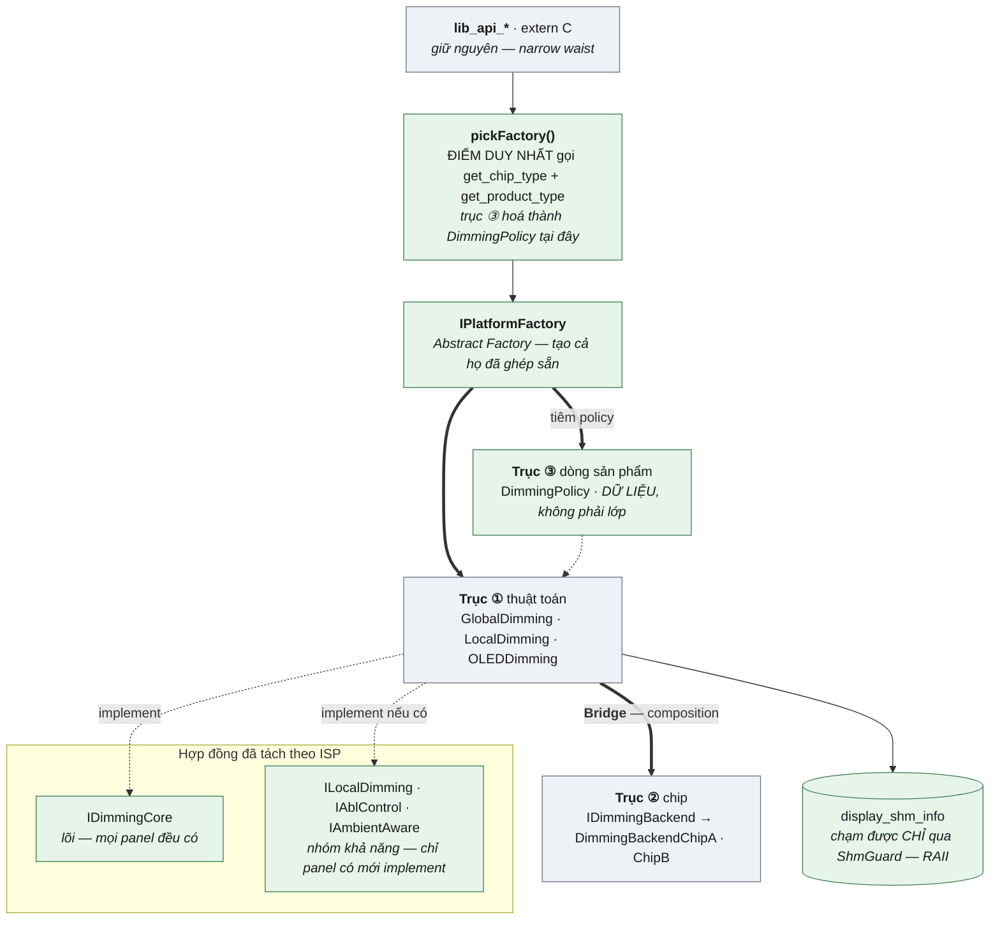

# B1 — Cùng bối cảnh, thiết kế lại

> 🅱️ **PHẦN B — CẢI TIẾN.** Tài liệu này **không mô tả hệ đang chạy** — hệ thật nằm ở [🅰️ A1](A1-baseline-libdisplay.md). Đây là câu trả lời cho câu hỏi phỏng vấn *"nếu làm lại thì bạn đổi gì?"*, và nó bám đúng **5 điểm yếu đã tự nhận ở [A1 §7](A1-baseline-libdisplay.md)** — không phải một bản vẽ lại từ đầu.

> **TL;DR**
> - **Ràng buộc không đổi** (không được phép "làm lại" chúng): nhiều process cùng dùng · nhiều thế hệ chip · nhiều dòng sản phẩm · ranh giới mở bắt buộc là **C**.
> - **Giữ nguyên 5 thứ** vì chúng đã đúng: mặt tiền C (narrow waist) · Bridge *thuật toán × chip* · Null Object · shared memory + semaphore · **không** trừu tượng hoá `frc`/`tcon`.
> - **Vá 5 thứ:** ① interface ~150 method → tách theo **ISP + capability** · ② dòng sản phẩm thành **trục thứ ba** (policy), không nhân đôi lớp ở hai tầng · ③ **Abstract Factory thật** thay hàm thủ tục · ④ hợp đồng lỗi `-ENOTSUP` thay `LIB_OK` im lặng · ⑤ **khoá đi cùng state** (RAII), không phụ thuộc caller đi đúng đường.
> - ⭐ **Luật xuyên suốt rút ra được:** *một trục biến thiên chỉ được hiện diện ở **đúng một** tầng.* Bốn trong năm điểm yếu là hệ quả của việc vi phạm luật này.
> - Phần trả lời *"làm lại có đáng không"* nằm ở [§9](#9-làm-lại-có-đáng-không--và-theo-thứ-tự-nào) — **quan trọng ngang phần thiết kế**.

---

## 0. Luật chơi: cái gì được đổi, cái gì không

Một câu trả lời "làm lại" mà bỏ qua ràng buộc thật thì vô giá trị. Bốn thứ dưới đây **không phải lựa chọn thiết kế**, chúng là môi trường:

| Ràng buộc | Vì sao không đổi được |
|---|---|
| Nhiều process cùng điều khiển một panel | Kiến trúc hệ, không phải quyết định của library |
| Nhiều thế hệ chip, mỗi chip một cách ghi phần cứng | Phần cứng có sẵn |
| Nhiều dòng sản phẩm dùng chung một codebase | Quyết định tổ chức |
| **Ranh giới mở phải là C** | Nhiều process, build lệch thời gian ⟹ vtable không đi qua được ([A1 §3](A1-baseline-libdisplay.md)) |

⟹ **Phạm vi "làm lại" chỉ nằm bên trong chỗ hẹp.** Mặt tiền C và mô hình shared memory giữ nguyên; thứ được thiết kế lại là **cách tổ chức C++ phía dưới nó**.

---

## 1. Đọc lại trục biến thiên — có **BA**, không phải hai

Đây là chẩn đoán gốc, và bốn trong năm điểm yếu đều chảy ra từ đây.

| # | Trục | Biến thiên theo | Hệ thật xử lý thế nào |
|---|---|---|---|
| ① | **Thuật toán** | Loại panel: Global · Local · OLED | Cây kế thừa `IDimmingAlgo` ✅ |
| ② | **Chip** | Cách ghi phần cứng | `IDimmingBackend` — Bridge ✅ |
| ③ | **Dòng sản phẩm** | Giới hạn, tinh chỉnh, tính năng bật/tắt | 🔴 **Nhân đôi lớp ở HAI tầng** — `lib_dimming_signage` *và* `GlobalDimmingSignage` |

> ⭐ **Luật một câu — đáng thuộc:** *một trục biến thiên chỉ được hiện diện ở **đúng một** tầng.*
> **Phép thử cơ học:** `get_product_type()` được gọi ở **mấy chỗ**? Hệ thật gọi ở **hai** tầng ([A1 §4.2 và §5.5](A1-baseline-libdisplay.md)) — đó chính là bằng chứng trục ③ bị rò.

Bridge đã tách được ①×②. Trục ③ thì **không được tách**, nên nó nhân đôi lên cả hai bên ⟹ số lớp thực tế là `(N thuật toán × 2) + (M chip × 2)` chứ không phải `N + M`.

---

## 2. Vá ① — interface ~150 method: tách theo **ISP + capability**

**Bệnh:** `IDimmingAlgo` có ~150 virtual. Mọi biến thể phụ thuộc vào method nó không dùng; lớp cơ sở vừa là *hợp đồng* vừa là *implementation mặc định*.

⚠️ **150 method là triệu chứng, không phải bệnh.** Nguyên nhân gốc: **một interface đang phục vụ ba công nghệ panel khác nhau** (đèn nền toàn phần · đèn nền theo zone · tự phát sáng). Chúng không có cùng một hợp đồng — ép vào một chỗ thì phần thừa phải trở thành no-op.

```cpp
// ---- Khả năng: impl tự khai mình làm được gì ----
enum class Cap { LocalDimming, Abl, Ambient };
class DimmingCaps {
    unsigned bits_ = 0;
public:
    void add(Cap c)       { bits_ |= 1u << static_cast<unsigned>(c); }
    bool has(Cap c) const { return bits_ & (1u << static_cast<unsigned>(c)); }
};

// ---- Lõi: MỌI panel đều phải có ----
struct IDimmingCore {
    virtual ~IDimmingCore() = default;
    virtual int  setBacklight(int nits)   = 0;
    virtual void onFrame(const FrameStats&) = 0;
    virtual DimmingCaps caps() const      = 0;   // ⬅️ tự khai mình làm được gì
};

// ---- Nhóm khả năng: chỉ panel có mới implement ----
struct ILocalDimming { virtual int setZoneDuty(int zone, int duty) = 0; virtual int zoneCount() const = 0; };
struct IAblControl   { virtual int setAblLevel(int level) = 0; };          // riêng OLED
struct IAmbientAware { virtual int setAmbientMode(AmbientMode m) = 0; };
```

**Caller hỏi khả năng trước, không gọi mù:**

```cpp
// ✅ Hỏi rồi mới gọi — thay cho "gọi đại, no-op thì thôi"
if (d->caps().has(Cap::LocalDimming))
    dynamic_cast<ILocalDimming&>(*d).setZoneDuty(z, duty);
```

⚠️ **Cái giá kỹ thuật của việc tách, phải nói ra:** `IDimmingCore` và `ILocalDimming` là **hai nhánh anh em**, không kế thừa nhau ⟹ đi từ nhánh này sang nhánh kia là **cross-cast**, `static_cast` **không compile được**, bắt buộc `dynamic_cast` (cần RTTI, và có chi phí tra bảng). Ba đường thoát, chọn theo bối cảnh:

| Cách | Được | Mất |
|---|---|---|
| `dynamic_cast` + `caps()` | Đơn giản, an toàn | Cần RTTI · chi phí mỗi lần cast |
| Factory trả **struct nhiều con trỏ** (`{core, local, abl}`, `nullptr` nếu không có) | Không RTTI, không cast | Factory phải biết đủ mặt |
| Hàm `queryInterface(Cap) -> void*` do impl tự cài | Không RTTI | Tự viết lại một phần cơ chế ngôn ngữ |

Trên đường **cấu hình** thì `dynamic_cast` là miễn phí về mặt thực tế; trên đường **mỗi khung hình** thì cast **một lần lúc dựng** rồi giữ con trỏ, đừng cast trong vòng lặp.

| | Hệ thật (1 interface béo) | Sau khi tách |
|---|---|---|
| Thêm API riêng cho local dimming | Đụng **mọi** impl (kể cả OLED) | Chỉ đụng `ILocalDimming` |
| Đọc để review | 150 method một file | Mỗi hợp đồng vừa một màn hình |
| "Không hỗ trợ" | No-op im lặng | **Hỏi được trước khi gọi** |
| **Cái giá** | — | Nhiều mảnh hơn để ghép; caller phải rẽ nhánh theo `caps()` |

> 🔗 Đây đúng là ISP ([solid-principles §4](../solid-principles.md)), và **rẻ hơn nhiều so với khi interface nằm ở ranh giới mở**: ở đây nó là C++ nội bộ nên tách/gộp không phải ABI break ([A1 §3.2](A1-baseline-libdisplay.md)).

---

## 3. Vá ② — dòng sản phẩm thành **trục thứ ba**, không nhân đôi lớp

**Bệnh:** `lib_dimming_signage` (tầng module) **và** `GlobalDimmingSignage` (tầng thuật toán) — cùng một trục biến thiên hiện diện ở hai tầng.

**Chẩn đoán trước khi chữa — hỏi đúng một câu:** *biến thể dòng sản phẩm khác nhau ở **thuật toán**, hay chỉ khác **giới hạn/tinh chỉnh**?*

| Nếu khác… | Thì nó là | Cách làm đúng |
|---|---|---|
| Giới hạn nits, tốc độ ramp, bật/tắt tính năng | **Dữ liệu** | **Policy object** — tham số hoá, không tạo lớp |
| Thật sự khác cách tính | **Thuật toán** | Một `IDimmingAlgo` anh em — nhưng **chỉ ở một tầng** |

Phần lớn biến thể sản phẩm rơi vào ô đầu ⟹ **tham số hoá**:

```cpp
struct DimmingPolicy {          // DỮ LIỆU, không phải lớp con
    int  minNits, maxNits;
    int  rampMsPerStep;         // chống nhấp nháy
    bool allowAbl;
    bool ambientEnabled;
};

class GlobalDimming : public IDimmingCore {
public:
    GlobalDimming(std::unique_ptr<IDimmingBackend> hw, DimmingPolicy policy);
    //             └─ trục ② chip                    └─ trục ③ dòng sản phẩm
};
```

⟹ **Ba trục, ba cơ chế khác nhau, không cái nào chồng lên cái nào:**

| Trục | Cơ chế | Số lớp |
|---|---|---|
| ① Thuật toán | Cây kế thừa `IDimmingCore` | N |
| ② Chip | **Bridge** — `IDimmingBackend` tiêm qua constructor | M |
| ③ Dòng sản phẩm | **Policy object** — dữ liệu, tiêm qua constructor | **0** |

Từ `(N×2) + (M×2)` lớp xuống **`N + M`** lớp + một bảng policy. Thêm một dòng sản phẩm mới = **thêm một dòng cấu hình**, không thêm file nào.

> ⚠️ **Không phải lúc nào cũng đủ.** Nếu một dòng sản phẩm thật sự cần thuật toán khác, policy không cứu được — lúc đó nó là một `IDimmingCore` anh em. Điểm mấu chốt vẫn giữ nguyên: **chỉ ở một tầng**, và `get_product_type()` vẫn chỉ được gọi ở **đúng một chỗ** (§4).

---

## 4. Vá ③ — **Abstract Factory thật** thay hàm thủ tục

**Bệnh:** `lib_init_modules()` tạo bốn module bằng `if/else` theo product type. Nó **đang làm việc của Abstract Factory** nhưng nhất quán họ dựa vào *kỷ luật* ("chỉ sửa ở một hàm"), không dựa vào *kiểu* — và trục ③ thì rò xuống tận `DimmingFactory` bên dưới.

```cpp
// Một object đại diện cho MỘT nền tảng — tạo cả HỌ đã ghép sẵn
class IPlatformFactory {
public:
    virtual ~IPlatformFactory() = default;
    virtual std::unique_ptr<IDimmingCore>       createDimming()     = 0;
    virtual std::unique_ptr<IVideoEnhancement>  createEnhancement() = 0;
    virtual std::unique_ptr<ISensor>            createSensor()      = 0;
    virtual std::unique_ptr<IAmbient>           createAmbient()     = 0;
};

// Mỗi (chip × dòng sản phẩm) = một factory. Nó ghép sẵn ba trục.
class ChipAFactory : public IPlatformFactory {
    DimmingPolicy policy_;                       // trục ③ nằm ở ĐÂY, một chỗ
public:
    explicit ChipAFactory(DimmingPolicy p) : policy_(std::move(p)) {}
    std::unique_ptr<IDimmingCore> createDimming() override {
        return std::make_unique<LocalDimming>(std::make_unique<DimmingBackendChipA>(), policy_);
    }
    // ...
};

// ⬇️ ĐIỂM DUY NHẤT trong toàn library gọi get_product_type()
std::unique_ptr<IPlatformFactory> pickFactory() {
    const auto chip    = get_chip_type();
    const auto product = get_product_type();
    auto policy = loadPolicy(product);           // trục ③ hoá thành dữ liệu tại đây
    switch (chip) {
        case Chip::A: return std::make_unique<ChipAFactory>(std::move(policy));
        case Chip::B: return std::make_unique<ChipBFactory>(std::move(policy));
    }
    return nullptr;                               // → Null Object ở tầng trên
}
```

**Ba thứ nó mua được, nói ra được ở phỏng vấn:**

| | Hàm thủ tục (hệ thật) | `IPlatformFactory` |
|---|---|---|
| Nhất quán họ | Bằng **kỷ luật** (nhớ sửa cùng chỗ) | **Bằng kiểu** — chỉ có một object, không còn tham số để truyền sai |
| `get_product_type()` gọi ở | **Hai** tầng | **Một** chỗ duy nhất |
| Thay bằng test double | Phải hook từng hàm | Thay **một** factory ⟹ test được không cần phần cứng |

> 🔗 Đây chính là lớp lỗi mà [DP-022](../../14-prep/mock-interview/bank/design-patterns.md) mô tả: trộn nhầm họ thì **compile sạch, chạy được**, chỉ sai trên một dòng sản phẩm. Lý thuyết: [creational §2](../creational.md).
>
> ⚖️ **Nhượng bộ công bằng — nên chủ động nêu:** nếu chỉ có **một** thứ cần tạo thì Abstract Factory là thừa, Factory Method đủ. Nó chỉ trả công khi có **≥ 2 sản phẩm phải khớp nhau** — ở đây là 4.

---

## 5. Vá ④ — hợp đồng lỗi: `-ENOTSUP`, không `LIB_OK` im lặng

**Bệnh:** lớp cơ sở trả `LIB_OK` cho việc **không làm gì**. Caller không phân biệt được *"đã đặt xong"* với *"tính năng không tồn tại"* — và một tính năng chết âm thầm sẽ không ai phát hiện.

**Ba mức trả lời, nói cả ba là câu trả lời tốt:**

| Mức | Cách làm | Đánh đổi |
|---|---|---|
| Tối thiểu | Giữ `LIB_OK` nhưng **log** mỗi lần rơi vào no-op | Rẻ, nhưng lỗi vẫn trôi |
| ✅ **Nên** | Base trả **`-ENOTSUP`** + `caps()` để hỏi trước (§2) | Caller phân biệt được; **phải sửa nơi kiểm mã lỗi** |
| Triệt để | Bỏ Null Object, trả `optional`/`expected` | Sạch nhất, nhưng đập vỡ mọi call site |

⚠️ **Phản biện có thật, phải trả lời được:** *"hàng trăm điểm gọi cũ đang coi `LIB_OK` là bình thường — đổi sang `-ENOTSUP` làm chúng bắt đầu báo lỗi hàng loạt."* Đúng. Nên đường di trú là:

1. **API mới**: trả `-ENOTSUP` ngay từ ngày đầu.
2. **API cũ**: giữ `LIB_OK` nhưng **log cảnh báo**, đo xem thực tế có bao nhiêu lời gọi rơi vào no-op.
3. Có `caps()` rồi thì **code mới hỏi trước khi gọi**, không phụ thuộc mã trả về nữa.
4. Đổi mã trả về của API cũ **theo từng module**, sau khi số liệu ở bước 2 cho thấy an toàn.

> ⭐ **Đây là chỗ phân biệt câu trả lời mid với senior.** Mid nói *"nên trả `-ENOTSUP`"*. Senior nói *"nên, nhưng đường di trú là bốn bước và bước đầu là **đo**, vì đổi hợp đồng lỗi của một API đang chạy là thay đổi hành vi, không phải refactor."*

---

## 6. Vá ⑤ — khoá **đi cùng** state, không phụ thuộc caller

**Bệnh:** semaphore được lấy ở **tầng C API**; lớp dimming tự nó không tự bảo vệ. Nó an toàn chỉ vì mọi lời gọi **tình cờ** đi qua đúng một đường. Gọi tắt từ chỗ khác là mất bảo vệ, và **không có gì báo cho bạn biết**.

🔴 **Cám dỗ sai:** "cho mỗi module một mutex riêng cho mịn". Làm vậy là **mất tính nhất quán toàn cục** mà một semaphore duy nhất đang mua được, và mở ra bài toán **thứ tự khoá** ⟹ deadlock giữa các process. Đừng.

✅ **Đúng: giữ NGUYÊN một khoá, nhưng làm cho việc chạm state mà không giữ khoá trở thành *không viết ra được*.**

```cpp
// State chỉ tới được qua một handle RAII đã giữ khoá.
// Không có đường nào lấy được tham chiếu trần tới shared memory.
template <typename T>
class ShmGuard {
    T& ref_;
public:
    explicit ShmGuard(T& ref) : ref_(ref) { lib_sem_lock(__func__); }
    ~ShmGuard()                           { lib_sem_unlock(__func__); }
    ShmGuard(const ShmGuard&)            = delete;
    T* operator->() { return &ref_; }
    T& operator*()  { return ref_; }
};

// Cách DUY NHẤT lấy state
ShmGuard<DimmingForShm> dimmingState();

// Dùng: không có đường nào chạm state mà không qua guard
void setBacklight(int nits) {
    auto st = dimmingState();     // khoá
    st->backlight = nits;
}                                 // mở khoá — kể cả khi ném exception
```

| | Hệ thật | Sau khi vá |
|---|---|---|
| Ai giữ khoá | Tầng C API (xa chỗ dùng) | **Chính handle trả về state** |
| Quên khoá | Compile sạch, chạy sai | **Không lấy được state** |
| Thoát sớm / exception | Phải nhớ mở khoá | RAII lo |
| Số khoá | 1 | **vẫn 1** ⟵ cố ý |

> 🔗 Đây là RAII thuần tuý ([02-modern-cpp/raii-smart-pointers](../../02-modern-cpp/raii-smart-pointers.md)) áp vào một tài nguyên liên-process. Điểm đáng nói: **không đổi mô hình đồng bộ, chỉ đổi chỗ đặt khoá** — rủi ro thấp, lợi ích cao. Đó là kiểu cải tiến dễ được duyệt nhất trong đời thật.

---

## 7. Giữ nguyên có chủ đích — phần quan trọng ngang phần sửa

Một câu trả lời "làm lại" mà đổi hết là tín hiệu **xấu**. Năm thứ dưới đây đã đúng:

| Giữ | Vì sao |
|---|---|
| **Mặt tiền C (narrow waist)** | Quyết định đúng nhất của cả hệ: một binary phục vụ nhiều process build lệch thời gian, và nó **miễn nhiễm** với cả lớp bug vtable ([A2 §3.3](A2-cpp-interface-hal.md)) |
| **Bridge: thuật toán × chip** | Đã tách đúng hai trục; chỉ thiếu trục ③ (§3) |
| **Null Object** | Ý tưởng đúng — chỉ đổi *mã trả về* (§5), không bỏ pattern |
| **Shared memory + named semaphore** | Mô hình đúng cho state đa process; chỉ đổi *chỗ đặt khoá* (§6) |
| **`frc`/`tcon` KHÔNG trừu tượng hoá** | Một command cố định, không thuật toán, không biến thể — bọc lại chỉ mua thêm chi phí |

### 7.1 Nhắc lại phép thử trước khi trừu tượng hoá

Ba câu, "không" ở bất kỳ câu nào thì đừng làm:

1. Đã có **≥ 2 biến thể thật** chưa (không phải *"sau này biết đâu"*)?
2. Chúng khác nhau về **hành vi**, hay chỉ khác **tham số**? *(Chỉ khác tham số ⟹ policy object — đúng §3.)*
3. Có ai thật sự cần **hoán đổi** chúng không?

`dimming` đạt cả ba. `frc`/`tcon` **trượt cả ba** ⟹ để nguyên hàm gọi thẳng.

> **Cách nói ở phỏng vấn (học thuộc ý):** *"Trong bốn feature, hai cái logic nặng và có biến thể thật thì đi qua interface + factory. Hai cái còn lại chỉ là một command cố định xuống chip nên tôi để nguyên hàm gọi thẳng — bọc lại sẽ thêm một tầng gián tiếp mà không mua được gì. Trừu tượng hoá nên trả giá cho một biến thể **đã tồn tại**, không phải cho một biến thể tưởng tượng."*

---

## 8. Kiến trúc sau khi làm lại



🟩 **xanh = chỗ đã vá** · ⬜ **xám = giữ nguyên có chủ đích**

---

## 9. "Làm lại có đáng không" — và theo thứ tự nào

Câu hỏi đuổi gần như chắc chắn tới sau khi bạn trình bày xong. Trả lời bằng **thứ tự ưu tiên theo tỉ lệ lợi ích / rủi ro**, không phải bằng "nên làm hết":

| Thứ tự | Vá | Rủi ro | Lợi ích | Vì sao xếp ở đây |
|---|---|---|---|---|
| **1** | ⑤ Khoá đi cùng state (RAII) | **Thấp** — không đổi mô hình, chỉ đổi chỗ đặt khoá | Cao — chặn hẳn một lớp bug khó truy | Sửa cục bộ, không đụng hợp đồng nào |
| **2** | ③ Abstract Factory + gom `get_product_type()` về một chỗ | Thấp–vừa | Cao — mở đường cho ② và cho việc test | Là **điều kiện tiên quyết** của ② |
| **3** | ② Trục ③ thành policy | Vừa — phải rà từng biến thể xem là *dữ liệu* hay *thuật toán* | Cao — xoá hẳn việc nhân đôi lớp | Cần ③ xong trước |
| **4** | ① Tách interface theo ISP | Vừa — đụng nhiều file, nhưng **không phải ABI** | Vừa–cao | Làm dần theo từng nhóm khả năng |
| **5** | ④ Đổi hợp đồng lỗi | **Cao** — đổi *hành vi*, không phải refactor | Vừa | Phải **đo trước** (§5), làm sau cùng |

> ⭐ **Câu chốt nên nói ra:** *"Tôi sẽ không làm lại kiến trúc — mặt tiền C và mô hình shared memory là những quyết định đúng, và chúng đắt để đổi. Thứ tôi đổi là cách tổ chức C++ bên dưới chỗ hẹp, theo thứ tự rủi ro tăng dần, bắt đầu bằng thứ sửa được cục bộ mà chặn được nguyên một lớp bug."*

---

## Câu hỏi phỏng vấn liên quan

> Đáp án sống trong [bank/](../../14-prep/mock-interview/bank/) — **một đáp án, một chỗ** ([CLAUDE.md §4.7](../../CLAUDE.md)). Tự trả lời trước khi mở.

| ID | Câu hỏi |
|----|---------|
| [DP-022](../../14-prep/mock-interview/bank/design-patterns.md) ⭐ | Vài hàm `makeX(type)` rời có gì sai so với một factory object? Lỗi nó cho phép xảy ra là gì? |
| [DP-037](../../14-prep/mock-interview/bank/design-patterns.md) | Factory Method và Abstract Factory khác nhau ở đâu? Dấu hiệu cần cái thứ hai? |
| [DP-023](../../14-prep/mock-interview/bank/design-patterns.md) ⭐ | N thuật toán × M chip — thiết kế sao để không thành N×M lớp? Bridge khác Strategy chỗ nào? |
| [DP-038](../../14-prep/mock-interview/bank/design-patterns.md) | Bridge giải quyết vấn đề gì? |
| [DP-024](../../14-prep/mock-interview/bank/design-patterns.md) ⭐ | Feature chỉ một command cố định — vì sao KHÔNG bọc pattern? Nêu cái giá cụ thể. |
| [DP-036](../../14-prep/mock-interview/bank/design-patterns.md) ⭐ | Null Object đổi lấy điều gì, và khi nào KHÔNG nên dùng? |
| [DP-011](../../14-prep/mock-interview/bank/design-patterns.md) ⭐ | DIP "đảo ngược" cái gì? Vì sao nó làm code test được không cần phần cứng? |
| [DP-012](../../14-prep/mock-interview/bank/design-patterns.md) | Khi nào KHÔNG nên dùng design pattern / áp SOLID? |
| [DP-005](../../14-prep/mock-interview/bank/design-patterns.md) | Strategy là gì? C++ hiện đại hiện thực gọn thế nào? |
| [DP-035](../../14-prep/mock-interview/bank/design-patterns.md) | Template Method và Strategy — chọn cái nào, dựa trên tiêu chí gì? |

---
⬅️ 🅰️ [A2-cpp-interface-hal.md](A2-cpp-interface-hal.md) · ➡️ [B2-redesign-events.md](B2-redesign-events.md) · [Về bản đồ](README.md)
