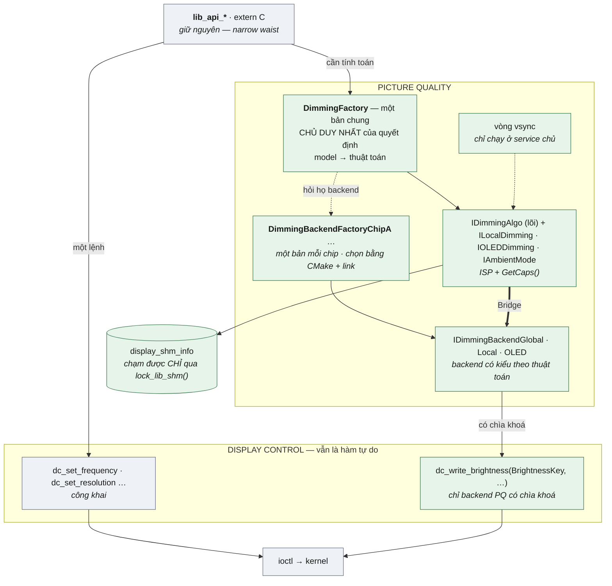

# B1 — Cùng bối cảnh, thiết kế lại

> 🅱️ **PHẦN B — CẢI TIẾN.** Tài liệu này **không mô tả hệ đang chạy**; hệ thật nằm ở [🅰️ A1](A1-baseline-libdisplay.md). Đây là câu trả lời cho câu hỏi phỏng vấn *"nếu làm lại thì bạn đổi gì?"*, và nó bám đúng **5 điểm yếu đã tự nhận ở [A1 §9](A1-baseline-libdisplay.md)**, không phải một bản vẽ lại từ đầu.

> **TL;DR**
> - **Ràng buộc không đổi:** nhiều process cùng dùng · hơn 10 dòng chip · nhiều model · ranh giới mở bắt buộc là **C** · hợp đồng ioctl với kernel.
> - **Giữ nguyên 6 thứ** vì chúng đã đúng: mặt tiền C · tách hai component PQ / DC · Bridge *thuật toán × backend* · chốt chip lúc build · shared memory + semaphore · Display Control **không** trừu tượng hoá.
> - **Vá 5 thứ**, gom thành hai bệnh:
>   - **Một thứ có nhiều hơn một chủ:**
>     - ② độ sáng có hai đường ghi ⟹ **passkey**, chỉ PQ ghi được.
>     - ③ việc chọn thuật toán lặp ở M chip ⟹ **factory backend theo chip + chọn thuật toán ở một chỗ chung**.
>     - ⑤ state có đường không khoá ⟹ **khoá đi cùng state (RAII)** + vòng vsync có **một process chủ**.
>   - **Hợp đồng không nói thật:**
>     - ① interface ~150 method mà phần lớn là no-op ⟹ tách theo **ISP + capability**.
>     - ④ trả `LIB_OK` cho việc không làm ⟹ **`-ENOTSUP`**, di trú có đo.
> - ⭐ **Luật xuyên suốt:** *mỗi quyết định, mỗi tài nguyên, mỗi state chỉ có **đúng một chủ**.*
> - Phần *"làm lại có đáng không"* ở [§9](#9-làm-lại-có-đáng-không--và-theo-thứ-tự-nào) quan trọng ngang phần thiết kế.

---

## 0. Luật chơi: cái gì được đổi, cái gì không

Một câu trả lời "làm lại" mà bỏ qua ràng buộc thật thì vô giá trị. Các thứ dưới đây **không phải lựa chọn thiết kế**, chúng là môi trường:

| Ràng buộc | Vì sao không đổi được |
|---|---|
| Nhiều process cùng điều khiển một panel | Kiến trúc hệ, không phải quyết định của library |
| Hơn 10 dòng chip, mỗi chip một cách ghi phần cứng | Phần cứng có sẵn |
| Nhiều model, mỗi model một kiểu đèn nền | Quyết định sản phẩm |
| **Ranh giới mở phải là C** | Nhiều process, build lệch thời gian ⟹ vtable không đi qua được ([A1 §3](A1-baseline-libdisplay.md)) |
| Hợp đồng ioctl với kernel driver | Driver là tầng khác, team khác |

⟹ **Phạm vi "làm lại" nằm giữa hai ranh giới:** dưới mặt tiền C, trên ioctl. Thứ được thiết kế lại là **cách tổ chức C++ trong library**.

---

## 1. Chẩn đoán: hai bệnh, không phải năm lỗi rời

Năm điểm yếu ở A1 trông rời rạc, nhưng hỏi đúng câu thì chúng gom về hai bệnh.

**Bệnh 1 — hỏi "ai là chủ?":**

| Thứ | Hệ thật có mấy chủ | Điểm yếu |
|---|---|---|
| Quyết định *"model này dùng thuật toán nào"* | **M** — mỗi `DimmingFactory` của mỗi chip giữ một bản | #3 |
| Quyền ghi độ sáng xuống phần cứng | **2** — backend của PQ, và bất kỳ `lib_api_*` nào gọi thẳng DC | #2 |
| Quyền chạm state trong shared memory | **2 đường** — đường API (có khoá) và vòng vsync (không khoá) | #5a |
| Vòng vsync | **Process nạp `.so` sau cùng** — tức là không cố định | #5b |

**Bệnh 2 — hỏi "hợp đồng có nói thật không?":**

| Hợp đồng | Nói gì | Thật ra | Điểm yếu |
|---|---|---|---|
| `IDimmingAlgo` ~150 method | *"Tôi làm được 150 việc"* | Mỗi panel chỉ làm một phần, phần còn lại là no-op | #1 |
| Mã trả về `LIB_OK` | *"Đã làm xong"* | Có khi là *"không hỗ trợ, không làm gì"* | #4 |

> ⭐ **Luật một câu — đáng thuộc:** *mỗi quyết định, mỗi tài nguyên, mỗi state chỉ có **đúng một chủ**.*
> **Phép thử cơ học:** với mỗi thứ quan trọng, đếm xem **có mấy chỗ trong code được phép thay đổi nó**. Lớn hơn 1 là có bug đang chờ, kể cả khi hôm nay chưa xảy ra.

---

## 2. Vá ① — interface ~150 method: tách theo **ISP + capability**

**Bệnh:** `IDimmingAlgo` có ~150 virtual. Mọi biến thể phụ thuộc vào method nó không dùng; lớp cơ sở vừa là *hợp đồng* vừa là *implementation mặc định*. `IDimmingBackend` cũng gộp nhóm Global với nhóm Local.

⚠️ **150 method là triệu chứng, không phải bệnh.** Nguyên nhân gốc: **một interface đang phục vụ ba công nghệ panel khác nhau** (đèn nền toàn phần · đèn nền theo vùng · tự phát sáng). Chúng không có cùng một hợp đồng; ép vào một chỗ thì phần thừa phải trở thành no-op.

```cpp
// ---- Kha nang: impl tu khai minh lam duoc gi ----
enum class DimmingCap { Local, OLED, Ambient };
class DimmingCaps {
    unsigned bits_ = 0;
public:
    void Add(DimmingCap c)       { bits_ |= 1u << static_cast<unsigned>(c); }
    bool Has(DimmingCap c) const { return bits_ & (1u << static_cast<unsigned>(c)); }
};

// ---- IDimmingAlgo (giu ten A1) — cat con LOI ma MOI panel deu co ----
class IDimmingAlgo {
public:
    virtual ~IDimmingAlgo() = default;
    virtual int32_t     SetBacklight(int32_t backlight) { return -ENOTSUP; }  // than mac dinh = Null Object (va ④)
    virtual void        t_vSyncCallBack()               {}                    // vong vsync goi
    virtual DimmingCaps GetCaps() const                 { return {}; }        // ⬅️ tu khai minh lam duoc gi
};

// ---- Nhom kha nang: chi panel co moi implement (ten ham giu nhu A1 khi da co) ----
class ILocalDimming {
public:
    virtual ~ILocalDimming() = default;
    virtual int32_t SetZoneBacklight(int32_t zone, int32_t level) = 0;
    virtual int32_t GetZoneCount() const = 0;
};
class IOLEDDimming { public: virtual ~IOLEDDimming() = default; virtual int32_t SetAblLevel(int32_t level) = 0; };
class IAmbientMode { public: virtual ~IAmbientMode() = default; virtual int32_t SetAmbientMode(int32_t mode) = 0; };

// LocalDimming : public IDimmingAlgo, public ILocalDimming, public IAmbientMode
// OLEDDimming  : public IDimmingAlgo, public IOLEDDimming

// ---- IDimmingBackend (A1) tach theo nhom — ten ham giu nguyen nhu A1 ----
class IDimmingBackendGlobal {
public:
    virtual ~IDimmingBackendGlobal() = default;
    virtual uint32_t t_InitGlobalDimming() = 0;
    virtual uint32_t t_Set2DFinalDuty(BackendGd2DFinalDuty_t* pInputData) = 0;
};
class IDimmingBackendLocal {
public:
    virtual ~IDimmingBackendLocal() = default;
    virtual uint32_t t_InitLocalDimming() = 0;
    virtual uint32_t t_SetLdFinalDuty(BackendLdFinalDuty_t* pInputData) = 0;
};
// IDimmingBackendOLED tuong tu
```

**Caller hỏi khả năng trước, không gọi mù:**

```cpp
// ✅ Hoi roi moi goi — thay cho "goi dai, no-op thi thoi"
if (m_pDimmingPanel->GetCaps().Has(DimmingCap::Local))
    dynamic_cast<ILocalDimming&>(*m_pDimmingPanel).SetZoneBacklight(zone, level);
```

⚠️ **Cái giá kỹ thuật của việc tách, phải nói ra:**
- `IDimmingAlgo` và `ILocalDimming` là **hai nhánh anh em**, không kế thừa nhau. Đi từ nhánh này sang nhánh kia là **cross-cast**, nên `static_cast` **không compile được** và bắt buộc phải dùng `dynamic_cast` (cần RTTI, tốn một lần tra bảng).
- Có ba đường thoát, chọn theo bối cảnh:

| Cách | Được | Mất |
|---|---|---|
| `dynamic_cast` + `GetCaps()` | Đơn giản, an toàn | Cần RTTI · chi phí mỗi lần cast |
| Factory trả **struct nhiều con trỏ** (`{core, local, abl}`, `nullptr` nếu không có) | Không RTTI, không cast | Factory phải biết đủ mặt |
| Hàm `queryInterface(Cap) -> void*` do impl tự cài | Không RTTI | Tự viết lại một phần cơ chế ngôn ngữ |

Trên đường **cấu hình**, `dynamic_cast` thực tế là miễn phí. Trên đường **mỗi khung hình**, cast **một lần lúc dựng** rồi giữ con trỏ, đừng cast trong vòng lặp.

| | Hệ thật (1 interface béo) | Sau khi tách |
|---|---|---|
| Thêm API riêng cho local dimming | Đụng **mọi** impl (kể cả OLED) | Chỉ đụng `ILocalDimming` |
| Đọc để review | 150 method một file | Mỗi hợp đồng vừa một màn hình |
| "Không hỗ trợ" | No-op im lặng | **Hỏi được trước khi gọi** |
| Ghép nhầm thuật toán với backend | Compile sạch, đèn đứng im ([A1 §5.6](A1-baseline-libdisplay.md)) | **Lỗi compile** — xem §4 |
| **Cái giá** | — | Nhiều mảnh hơn để ghép; caller phải rẽ nhánh theo `GetCaps()` |

> 🔗 Đây đúng là ISP ([solid-principles §4](../solid-principles.md)), và **rẻ hơn nhiều so với khi interface nằm ở ranh giới mở**: ở đây nó là C++ nội bộ nên tách/gộp không phải ABI break ([A1 §3.2](A1-baseline-libdisplay.md)).

---

## 3. Vá ② — độ sáng chỉ có **một chủ ghi**: passkey

**Bệnh:** lệnh *"ghi độ sáng xuống phần cứng"* của Display Control là hàm tự do, ai cũng gọi được. Ranh giới *"chỉ PQ ghi độ sáng"* ([A1 §4.2](A1-baseline-libdisplay.md)) là **quy ước**. Nếu một `lib_api_*` mới đi thẳng DC để ghi độ sáng, PQ sẽ đè lại ở khung hình kế tiếp, hai bên giằng co, màn hình nhấp nháy. Lỗi kiểu này **không báo gì**, chỉ lộ khi nhìn bằng mắt.

**Cám dỗ sai:** biến DC thành interface + class cho "đúng OOP". Làm vậy là thêm đúng thứ trừu tượng hoá mà [A1 §4.4](A1-baseline-libdisplay.md) đã lập luận là không cần: DC không có biến thể nào ở user-space. Vấn đề ở đây là **quyền gọi**, không phải **đa hình**.

✅ **Đúng: giữ DC là hàm tự do, nhưng cho lệnh ghi độ sáng đòi một "chìa khoá" mà chỉ PQ tạo được.** Đây là **passkey idiom**: compiler kiểm quyền gọi, không tốn gì lúc chạy.

```cpp
// display_control.h
class BrightnessKey {
    BrightnessKey() {}                    // ⚠️ KHONG dung "= default" — xem ben duoi
    friend class DimmingBackendBase;      // CHI lop co so cua backend PQ tao duoc
};

int32_t dc_set_frequency(int32_t hz);                                // cong khai — khong can khoa
int32_t dc_set_resolution(res_info_t& info);
int32_t dc_write_brightness(BrightnessKey, int32_t brightness);     // noi bo — phai co khoa

// dimming/Backend/DimmingBackendBase.h
class DimmingBackendBase {
protected:
    static BrightnessKey key() { return BrightnessKey(); }   // friend khong di truyen ⟹ cap qua ham protected
};

// dimming/Backend/ChipA/DimmingBackendChipA_Global.h
class DimmingBackendChipA_Global : public DimmingBackendBase, public IDimmingBackendGlobal {
public:
    uint32_t t_Set2DFinalDuty(BackendGd2DFinalDuty_t* pInputData) override {
        return dc_write_brightness(key(), pInputData->value);           // ✅
    }
};

// src_com/lib_api.cpp
int32_t lib_api_set_something(int32_t v) {
    return dc_write_brightness(BrightnessKey{}, v);   // ❌ loi compile: constructor la private
}
```

**Đã kiểm bằng compiler** (`g++ -std=c++17 -Wall -Wextra`):

| Định nghĩa constructor | `lib_api` gọi thẳng `dc_write_brightness(BrightnessKey{}, …)` |
|---|---|
| `BrightnessKey() {}` | ❌ `error: 'BrightnessKey::BrightnessKey()' is private within this context` |
| `BrightnessKey() = default;` — C++17 | ⚠️ **compile sạch** — chìa khoá bị vượt qua |
| `BrightnessKey() = default;` — C++20 | ❌ lỗi, như dòng đầu |

> 🔺 *T3 — bẫy chỉ có ở C++17:* class có constructor `= default` (kể cả `private`) **vẫn được tính là aggregate**, nên `BrightnessKey{}` đi đường *aggregate initialization* và **không gọi constructor nào cả**. C++20 đã sửa luật này. Viết `{}` thì đúng ở mọi chuẩn.

| | Hệ thật | Sau khi vá |
|---|---|---|
| Ai ghi được độ sáng | Bất kỳ ai | **Chỉ backend PQ** |
| Ai đó lỡ thêm đường ghi thứ hai | Compile sạch, nhấp nháy ngoài hiện trường | **Lỗi compile** |
| DC có thêm interface/class? | — | **Không** — vẫn là hàm tự do |
| Chi phí lúc chạy | — | **0** — `BrightnessKey` rỗng, bị tối ưu mất |

> 🗣️ **Câu nói ở phỏng vấn:** *"Tôi không thêm pattern vào Display Control, vì nó không có biến thể. Tôi chỉ thêm một **quyền**: lệnh ghi độ sáng đòi một chìa khoá mà chỉ Picture Quality tạo được. Ranh giới vốn là quy ước giờ thành thứ compiler kiểm."*

---

## 4. Vá ③ — **Abstract Factory thật**: chip cung cấp họ backend, thuật toán chọn ở một chỗ

**Bệnh:** mỗi chip có một `DimmingFactory` riêng, và mỗi bản đều chứa **cùng một logic** *"model này → thuật toán nào"*. Có M chip thì logic đó có M chủ: thêm một thuật toán phải sửa M file, sửa sai một bản thì bug chỉ lộ trên đúng một chip.

**Chẩn đoán — tách hai câu hỏi đang bị trộn trong một class:**

| Câu hỏi | Phụ thuộc chip? | Chốt khi | Nên nằm ở |
|---|---|---|---|
| *"Chip này ghi phần cứng thế nào?"* | ✅ Có | **Build** | Thư mục chip — **một factory backend mỗi chip** |
| *"Model này dùng thuật toán nào?"* | ❌ **Không** | **Runtime** | **Code chung — đúng một chỗ** |

```cpp
// ---- Moi chip cung cap MOT factory — ca HO backend cua chip do ----
class IDimmingBackendFactory {
public:
    virtual ~IDimmingBackendFactory() = default;
    virtual std::unique_ptr<IDimmingBackendGlobal> CreateGlobal() = 0;
    virtual std::unique_ptr<IDimmingBackendLocal>  CreateLocal()  = 0;
    virtual std::unique_ptr<IDimmingBackendOLED>   CreateOLED()   = 0;   // chip khong co OLED ⟹ tra nullptr
};

// dimming/Backend/ChipA/DimmingBackendFactoryChipA.cpp — CMake CHI build file cua chip dich.
// Moi thu muc chip dinh nghia cung mot ham ⟹ chon chip bang LINK, khong bang switch.
std::unique_ptr<IDimmingBackendFactory> CreateDimmingBackendFactory() {
    return std::make_unique<DimmingBackendFactoryChipA>();
}

// ---- dimming/Common/DimmingFactory.cpp — giu ten A1, nhung gio la code CHUNG, viet mot lan ----
std::unique_ptr<IDimmingAlgo> DimmingFactory::CreateDimmingObject(DimmingType_k type,
                                                                 IDimmingBackendFactory& backends) {
    switch (type) {                                    // ⬅️ CHU DUY NHAT cua quyet dinh nay
    case DIMMING_GLOBAL: return std::make_unique<GlobalDimming>(backends.CreateGlobal());
    case DIMMING_LOCAL:  return std::make_unique<LocalDimming>(backends.CreateLocal());
    case DIMMING_OLED:   return std::make_unique<OLEDDimming>(backends.CreateOLED());
    }
    return std::make_unique<IDimmingAlgo>();           // Null Object — base tra -ENOTSUP
}
```

⭐ **Thứ đáng nói nhất — vá ① và vá ③ cộng lại:** vì `GlobalDimming` giờ nhận `std::unique_ptr<IDimmingBackendGlobal>` thay vì `IDimmingBackend*` chung, việc **ghép nhầm** thuật toán với backend (lỗi im lặng ở [A1 §5.6](A1-baseline-libdisplay.md)) trở thành **lỗi compile**:

```cpp
case DIMMING_GLOBAL: return std::make_unique<GlobalDimming>(backends.CreateLocal());   // ghep nham
// error: no matching function for call to 'GlobalDimming::GlobalDimming(std::unique_ptr<IDimmingBackendLocal>)'
```

*(Đã kiểm bằng `g++ -std=c++17 -Wall -Wextra`.)*

**Ba thứ nó mua được, nói ra được ở phỏng vấn:**

| | A1: `DimmingFactory` mỗi chip một bản | B1: `DimmingFactory` **một bản chung** + `DimmingBackendFactoryChipX` mỗi chip |
|---|---|---|
| Logic chọn thuật toán | Lặp **M** lần | **Một** chỗ |
| Nhất quán cặp thuật toán + backend | Bằng **kỷ luật** — compile sạch nếu ghép nhầm | **Bằng kiểu** — ghép nhầm không compile |
| Thay bằng test double | Phải dựng đủ backend thật của một chip | Thay **một** factory ⟹ test thuật toán không cần phần cứng |
| Thêm 1 thuật toán | Sửa M `DimmingFactory` | 1 case trong `DimmingFactory::CreateDimmingObject` + 1 method `CreateXxx()` trong mỗi factory chip *(compiler nhắc chỗ thiếu)* |

> 🔗 **Cùng hình dạng với kernel ([A1 §6.3](A1-baseline-libdisplay.md)):** driver chip **cung cấp** họ hàm, driver nền **quyết định** gọi gì. Ở đây cũng thế: chip cung cấp họ backend, code chung quyết định ghép gì. Đây là lớp lỗi [DP-022](../../14-prep/mock-interview/bank/design-patterns.md) mô tả; lý thuyết ở [creational §2](../creational.md).
>
> ⚖️ **Nhượng bộ công bằng — nên chủ động nêu:** nếu mỗi chip chỉ có **một** loại backend thì Abstract Factory là thừa, Factory Method là đủ. Nó chỉ trả công khi có **≥ 2 sản phẩm thuộc cùng một họ** — ở đây là ba backend Global/Local/OLED của cùng một chip.

---

## 5. Vá ④ — hợp đồng lỗi: `-ENOTSUP`, không `LIB_OK` im lặng

**Bệnh:** lớp cơ sở trả `LIB_OK` cho việc **không làm gì**. Caller không phân biệt được *"đã đặt xong"* với *"tính năng không tồn tại"*, và một tính năng chết âm thầm thì không ai phát hiện.

**Ba mức trả lời — nói cả ba là câu trả lời tốt:**

| Mức | Cách làm | Đánh đổi |
|---|---|---|
| Tối thiểu | Giữ `LIB_OK` nhưng **log** mỗi lần rơi vào no-op | Rẻ, nhưng lỗi vẫn trôi |
| ✅ **Nên** | Base trả **`-ENOTSUP`** + `GetCaps()` để hỏi trước (§2) | Caller phân biệt được; **phải sửa nơi kiểm mã lỗi** |
| Triệt để | Bỏ Null Object, trả `optional`/`expected` | Sạch nhất, nhưng đập vỡ mọi call site |

⚠️ **Phản biện có thật, phải trả lời được:** *"hàng trăm điểm gọi cũ đang coi `LIB_OK` là bình thường; đổi sang `-ENOTSUP` làm chúng bắt đầu báo lỗi hàng loạt."* Đúng. Nên đường di trú là:

1. **API mới**: trả `-ENOTSUP` ngay từ ngày đầu.
2. **API cũ**: giữ `LIB_OK` nhưng **log cảnh báo**, đo xem thực tế có bao nhiêu lời gọi rơi vào no-op.
3. Có `GetCaps()` rồi thì **code mới hỏi trước khi gọi**, không phụ thuộc mã trả về nữa.
4. Đổi mã trả về của API cũ **theo từng module**, sau khi số liệu ở bước 2 cho thấy an toàn.

> ⭐ **Đây là chỗ phân biệt câu trả lời mid với senior.** Mid nói *"nên trả `-ENOTSUP`"*. Senior nói *"nên, nhưng đường di trú có bốn bước và bước đầu là **đo**, vì đổi hợp đồng lỗi của một API đang chạy là thay đổi hành vi, không phải refactor."*

---

## 6. Vá ⑤ — state có **một khoá đi cùng**, vòng vsync có **một process chủ**

### 6.1 (a) Khoá đi cùng state — RAII

**Bệnh:** semaphore được lấy ở **tầng C API**; lớp thuật toán tự nó không tự bảo vệ. Đường API đi qua khoá, nhưng **vòng vsync thì không** ([A1 §5.8](A1-baseline-libdisplay.md)), mà cả hai chạm **cùng một state** trong shared memory. Hôm nay có thể chưa vỡ, nhưng **không gì trong code ngăn nó vỡ**.

🔴 **Cám dỗ sai:** "cho mỗi module một mutex riêng cho mịn". Làm vậy là **mất tính nhất quán toàn cục** mà một semaphore duy nhất đang mua được, và mở ra bài toán **thứ tự khoá**, dẫn tới deadlock giữa các process. Đừng.

✅ **Đúng: giữ NGUYÊN một khoá, nhưng làm cho việc chạm state mà không giữ khoá trở thành *không viết ra được*.**

```cpp
// State chi toi duoc qua mot handle RAII da giu khoa.
// Khong co duong nao lay duoc tham chieu tran toi shared memory.
template <typename T>
class ShmGuard {
    T&          ref_;
    const char* caller_;                  // giu ten ham goi — lib_sem_lock() ghi vao prev_called_proc nhu A1
public:
    ShmGuard(T& ref, const char* caller) : ref_(ref), caller_(caller) { lib_sem_lock(caller_); }
    ~ShmGuard()                                                       { lib_sem_unlock(caller_); }
    ShmGuard(const ShmGuard&)            = delete;
    ShmGuard& operator=(const ShmGuard&) = delete;
    T* operator->() { return &ref_; }
    T& operator*()  { return ref_; }
};

// Thay cho get_lib_shm() + member "Shm" cua A1 — cach DUY NHAT lay state,
// dung chung cho duong API VA vong vsync
ShmGuard<display_shm_info> lock_lib_shm(const char* caller);

void GlobalDimming::t_vSyncCallBack() {                       // vong vsync
    auto shm = lock_lib_shm(__FUNCTION__);                     // khoa
    shm->shmGlobalDimming.m_iBacklight = ComputeBacklight();
}                                                             // mo khoa — ke ca khi nem exception
```

| | Hệ thật | Sau khi vá |
|---|---|---|
| Ai giữ khoá | Tầng C API (xa chỗ dùng) | **Chính handle trả về state** |
| Vòng vsync chạm state | **Không khoá** | **Bắt buộc qua guard** |
| Quên khoá | Compile sạch, chạy sai | **Không lấy được state** |
| Thoát sớm / exception | Phải nhớ mở khoá | RAII lo |
| Số khoá | 1 | **vẫn 1** ⟵ cố ý |

⚠️ **Điều kiện đi kèm:** đường API (`lib_api_*` → `SetBacklight`) giờ lấy khoá **hai lần** (một ở mặt tiền, một ở guard). Hoặc bỏ khoá ở mặt tiền và để guard lo, hoặc dùng khoá **cho phép lấy lại** (recursive). POSIX semaphore **không** recursive, lấy lần hai trong cùng luồng là **tự deadlock**. Phải chọn một trong hai, đừng để cả hai.

> 🔗 Đây là RAII thuần tuý ([02-modern-cpp/raii-smart-pointers](../../02-modern-cpp/raii-smart-pointers.md)) áp vào một tài nguyên liên-process. **Không đổi mô hình đồng bộ, chỉ đổi chỗ đặt khoá** — rủi ro thấp, lợi ích cao; đó là kiểu cải tiến dễ được duyệt nhất trong đời thật.

### 6.2 (b) Vòng vsync có một process chủ cố định

**Bệnh:** vòng vsync chạy trong **process nạp `.so` sau cùng**. Một tool test, một process factory mở library ra là **kéo vòng vsync về phía nó**. Vòng đời của một tính năng chạy mỗi khung hình đang gắn vào vòng đời của một process bất kỳ.

| Cách | Được | Mất |
|---|---|---|
| ✅ **Đặt vòng vsync vào một service sống suốt vòng đời thiết bị**; các process khác **không** khởi động vsync, chỉ gọi API | Một chủ cố định; process khác vào/ra không ảnh hưởng | Library phải biết *"mình có phải chủ không"* (cờ cấu hình, hoặc chỉ service đó gọi `lib_start_vsync()`) |
| Bầu chủ qua shared memory: ghi PID chủ + kiểm còn sống | Không phụ thuộc service nào | Tự viết cơ chế bầu chủ, xử lý chủ chết giữa chừng — phức tạp, dễ sai |
| Giữ nguyên | Không tốn công | Hành vi phụ thuộc thứ tự process khởi động |

⟹ Chọn cách đầu: **biến "ai chạy vsync" từ hệ quả của thứ tự nạp thành một quyết định tường minh**. Đổi constructor của `.so` từ *"luôn khởi động vsync"* thành *"không khởi động gì"*, và để service chủ gọi `lib_start_vsync()` một lần.

---

## 7. Giữ nguyên có chủ đích — phần quan trọng ngang phần sửa

Một câu trả lời "làm lại" mà đổi hết là tín hiệu **xấu**. Sáu thứ dưới đây đã đúng:

| Giữ | Vì sao |
|---|---|
| **Mặt tiền C (narrow waist)** | Quyết định đúng nhất của cả hệ: một binary phục vụ nhiều process build lệch thời gian, **miễn nhiễm** với lớp bug vtable ([A2 §3.3](A2-cpp-interface-hal.md)) |
| **Tách PQ / DC theo lượng logic** | Đúng chỗ; chỉ thiếu **quyền ghi** (§3), không thiếu cấu trúc |
| **Bridge: thuật toán × backend** | Phần đắt (thuật toán) viết đúng một lần; chỉ đổi kiểu backend cho chặt (§2, §4) |
| **Chốt chip lúc build** | Binary không mang byte nào của chip khác; vá §4 vẫn giữ nguyên cơ chế này |
| **Shared memory + named semaphore** | Mô hình đúng cho state đa process; chỉ đổi *chỗ đặt khoá* (§6) |
| **Display Control KHÔNG trừu tượng hoá** | Biến thể chip đã nằm ở kernel driver; ngay cả vá §3 cũng giữ DC là hàm tự do |

### 7.1 Nhắc lại phép thử trước khi trừu tượng hoá

Ba câu, "không" ở bất kỳ câu nào thì đừng làm:

1. Đã có **≥ 2 biến thể thật** chưa (không phải *"sau này biết đâu"*)?
2. Chúng khác nhau về **hành vi**, hay chỉ khác **tham số**? *(Chỉ khác tham số ⟹ truyền dữ liệu cấu hình, không tạo lớp con.)*
3. Có ai thật sự cần **hoán đổi** chúng không?

Dimming đạt cả ba. Display Control **trượt ngay câu 1** ở user-space: biến thể theo chip đã bị kernel driver hấp thụ ⟹ để nguyên hàm gọi thẳng.

> **Cách nói ở phỏng vấn (học thuộc ý):** *"Phần chất lượng hình có logic nặng và biến thể thật nên đi qua interface + factory. Phần điều khiển panel chỉ là lệnh đơn, và khác biệt giữa các chip đã nằm trong driver, nên tôi để hàm gọi thẳng; bọc lại sẽ thêm một tầng gián tiếp mà không mua được gì. Trừu tượng hoá nên trả giá cho một biến thể **đã tồn tại**, không phải cho một biến thể tưởng tượng."*

---

## 8. Kiến trúc sau khi làm lại


```mermaid
flowchart TD
    API["<b>lib_api_*</b> · extern C<br/><i>giữ nguyên — narrow waist</i>"]

    subgraph PQ["PICTURE QUALITY"]
        MK["<b>DimmingFactory</b> — một bản chung<br/>CHỦ DUY NHẤT của quyết định<br/>model → thuật toán"]
        CF["<b>DimmingBackendFactoryChipA</b> …<br/><i>một bản mỗi chip · chọn bằng CMake + link</i>"]
        CORE["IDimmingAlgo (lõi) + ILocalDimming · IOLEDDimming · IAmbientMode<br/><i>ISP + GetCaps()</i>"]
        BE["IDimmingBackendGlobal · Local · OLED<br/><i>backend có kiểu theo thuật toán</i>"]
        VS["vòng vsync<br/><i>chỉ chạy ở service chủ</i>"]
        MK --> CORE
        CF --> BE
        MK -.->|"hỏi họ backend"| CF
        CORE ==>|"Bridge"| BE
        VS -.-> CORE
    end

    SHM[("display_shm_info<br/><i>chạm được CHỈ qua lock_lib_shm()</i>")]

    subgraph DC["DISPLAY CONTROL — vẫn là hàm tự do"]
        PUB["dc_set_frequency · dc_set_resolution …<br/><i>công khai</i>"]
        PRIV["dc_write_brightness(BrightnessKey, …)<br/><i>chỉ backend PQ có chìa khoá</i>"]
    end

    API -->|"cần tính toán"| MK
    API -->|"một lệnh"| PUB
    BE -->|"có chìa khoá"| PRIV
    CORE --> SHM
    PUB --> K["ioctl → kernel"]
    PRIV --> K

    classDef fix fill:#e6f4ea,stroke:#3d7a52,color:#1a1a1a
    classDef keep fill:#eef1f5,stroke:#6b7280,color:#1a1a1a
    class MK,CF,CORE,BE,VS,SHM,PRIV fix
    class API,PUB,K keep
```

🟩 **xanh = chỗ đã vá** · ⬜ **xám = giữ nguyên có chủ đích**

---

## 9. "Làm lại có đáng không" — và theo thứ tự nào

Câu hỏi đuổi gần như chắc chắn tới sau khi bạn trình bày xong. Trả lời bằng **thứ tự ưu tiên theo tỉ lệ lợi ích / rủi ro**, không phải bằng "nên làm hết":

| Thứ tự | Vá | Rủi ro | Lợi ích | Vì sao xếp ở đây |
|---|---|---|---|---|
| **1** | ⑤a Khoá đi cùng state (RAII) | **Thấp** — không đổi mô hình, chỉ đổi chỗ đặt khoá | Cao — đóng đường vsync không khoá | Sửa cục bộ, không đụng hợp đồng nào |
| **2** | ② Passkey cho lệnh ghi độ sáng | **Thấp** — chỉ thêm một tham số; lỗi compile chỉ ra đúng chỗ đang vi phạm | Cao — chặn hẳn một lớp nhấp nháy | Compiler tự làm phần rà soát |
| **3** | ③ `DimmingBackendFactoryChipX` theo chip + `DimmingFactory` chung | Thấp–vừa — dời code, không đổi hành vi | Cao — logic chọn còn một chỗ; test thuật toán không cần phần cứng | Làm trước ① để có chỗ đặt backend có kiểu |
| **4** | ① Tách interface theo ISP | Vừa — đụng nhiều file, nhưng **không phải ABI** | Vừa–cao — cộng với ③ thì ghép nhầm thành lỗi compile | Làm dần theo từng nhóm khả năng |
| **5** | ⑤b Một process chủ cho vòng vsync | Vừa — đổi hành vi khởi động hệ thống | Vừa | Cần thống nhất với team service |
| **6** | ④ Đổi hợp đồng lỗi | **Cao** — đổi *hành vi*, không phải refactor | Vừa | Phải **đo trước** (§5), làm sau cùng |

> ⭐ **Câu chốt nên nói ra:** *"Tôi sẽ không làm lại kiến trúc. Mặt tiền C, việc tách hai component và mô hình shared memory là những quyết định đúng, và chúng đắt để đổi. Thứ tôi đổi là **ai được làm gì** bên dưới chỗ hẹp: mỗi quyết định, mỗi tài nguyên, mỗi state chỉ còn một chủ. Tôi làm theo thứ tự rủi ro tăng dần, và hai bước đầu là để compiler làm phần kiểm tra thay cho kỷ luật."*

---

## Câu hỏi phỏng vấn liên quan

> Đáp án sống trong [bank/](../../14-prep/mock-interview/bank/) — **một đáp án, một chỗ** ([CLAUDE.md §4.7](../../CLAUDE.md)). Tự trả lời trước khi mở.

| ID | Câu hỏi |
|----|---------|
| [DP-046](../../14-prep/mock-interview/bank/design-patterns.md) | Năm điểm yếu có chung gốc không? Chỉ sửa được hai thì chọn cái nào? |
| [DP-045](../../14-prep/mock-interview/bank/design-patterns.md) | Viết cơ chế để chỉ backend PQ gọi được lệnh ghi độ sáng — bẫy C++17? |
| [DP-047](../../14-prep/mock-interview/bank/design-patterns.md) | Thêm RAII guard cho state rồi treo ngay lời gọi đầu tiên — vì sao? |
| [DP-044](../../14-prep/mock-interview/bank/design-patterns.md) | Vòng vsync ngoài mặt tiền — hai vấn đề thiết kế và cách sửa |
| [DP-022](../../14-prep/mock-interview/bank/design-patterns.md) ⭐ | Vài hàm `makeX(type)` rời có gì sai so với một factory object? Lỗi nó cho phép xảy ra là gì? |
| [DP-037](../../14-prep/mock-interview/bank/design-patterns.md) | Factory Method và Abstract Factory khác nhau ở đâu? Dấu hiệu cần cái thứ hai? |
| [DP-023](../../14-prep/mock-interview/bank/design-patterns.md) ⭐ | N thuật toán × M chip — thiết kế sao để không thành N×M lớp? Bridge khác Strategy chỗ nào? |
| [DP-038](../../14-prep/mock-interview/bank/design-patterns.md) | Bridge giải quyết vấn đề gì? |
| [DP-024](../../14-prep/mock-interview/bank/design-patterns.md) ⭐ | Feature chỉ một lệnh cố định — vì sao KHÔNG bọc pattern? Nêu cái giá cụ thể. |
| [DP-036](../../14-prep/mock-interview/bank/design-patterns.md) ⭐ | Null Object đổi lấy điều gì, và khi nào KHÔNG nên dùng? |
| [DP-011](../../14-prep/mock-interview/bank/design-patterns.md) ⭐ | DIP "đảo ngược" cái gì? Vì sao nó làm code test được không cần phần cứng? |
| [DP-012](../../14-prep/mock-interview/bank/design-patterns.md) | Khi nào KHÔNG nên dùng design pattern / áp SOLID? |
| [DP-005](../../14-prep/mock-interview/bank/design-patterns.md) | Strategy là gì? C++ hiện đại hiện thực gọn thế nào? |
| [DP-035](../../14-prep/mock-interview/bank/design-patterns.md) | Template Method và Strategy — chọn cái nào, dựa trên tiêu chí gì? |

---
⬅️ 🅰️ [A2-cpp-interface-hal.md](A2-cpp-interface-hal.md) · ➡️ [B2-redesign-events.md](B2-redesign-events.md) · [Về bản đồ](README.md)
