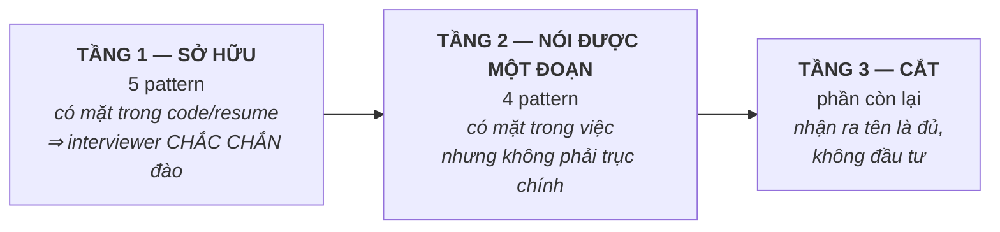

# 🎯 Design Patterns *trong việc của bạn* — bản đồ chọn lọc

> **Bốn file gốc của topic 11 trả lời "pattern X là gì".** Thư mục này trả lời câu khác, khó hơn và đúng thứ phỏng vấn đo:
> **"Trong hệ display bạn đang làm, quyết định thiết kế nào đẻ ra pattern nào — và chỗ nào bạn cố tình KHÔNG dùng pattern?"**
>
> Không thêm pattern mới cho nhiều. Mục tiêu ngược lại: **cắt bớt**, giữ lại số ít nhưng dựng lại được vấn đề gốc.

---

## Vì sao có thư mục này

Bạn tự đặt vấn đề đúng: *"không tham lam học hết, một vài cái nhưng hiểu rõ bản chất quan trọng hơn số lượng"*. Đây là cách thi hành điều đó.

Hai lý do cụ thể, không phải khẩu hiệu:

1. **Pattern học rời khỏi bối cảnh thì không truy xuất được lúc bị hỏi.** Repo đã đo đúng hiện tượng này hai lần: *T1 3.67 / T2 2.1* — biết định nghĩa nhưng không chuyển thành quyết định ([datalogic-plan §📍](../../14-prep/study-plans/datalogic-plan.md)). Pattern là mảng kiến thức **dễ mắc bệnh này nhất**, vì sách dạy toàn ví dụ `Shape`/`Animal` không dính gì tới công việc.
2. **Nói ra một tên pattern là mời interviewer hỏi vào đúng nó** (bài học #4 của plan, phiên 19/08). Nói *"em dùng Builder"* trong khi cái đó là Factory ⟹ mất điểm nhiều hơn là không nói gì. Thư mục này gọi đúng tên từng thứ trong code bạn đã viết.

---

## 🗺️ Bức tranh — ba tầng đầu tư

### Tầng 1 — SỞ HỮU (5 pattern)

Tiêu chí vào tầng này: **đã nằm trong code bạn viết hoặc trong một dòng resume**. Interviewer đọc resume xong sẽ đi thẳng vào đây.

| Pattern | Ở đâu trong việc của bạn | Neo trên resume / code | Tài liệu |
|---|---|---|---|
| **Abstract Factory** *(+ Factory Method)* | Chọn cả **họ** implementation theo SoC / board config lúc boot | *"the library selects its implementation at boot from board configuration"* | [01-display-stack §2.2](01-display-stack.md) |
| **Strategy** | Dimming **global / local / oled** — cùng interface, khác thuật toán | *"display enhancement (dimming...)"* | [01-display-stack §2.1](01-display-stack.md) |
| **Bridge** | Hai trục biến thiên độc lập: *thuật toán dimming* × *SoC* — chống bùng nổ lớp con | *"Developed and extended a single C++ interface across chipsets"* | [01-display-stack §3](01-display-stack.md) |
| **Singleton** | `IDisplay::getInstance()` trong HAL bạn viết | `interface/IDisplay.cpp` | [02-interface-impl-plugin §3.2](02-interface-impl-plugin.md) |
| **Observer** | Ambient light sensor → đổi độ sáng | *"adaptive brightness control driven by an ambient light sensor"* | [03-events-and-preset §1](03-events-and-preset.md) |

> 🔴 **Singleton đang là câu YẾU, không phải câu mạnh.** `DP-002` trong [weak-register](../../14-prep/mock-interview/weak-register.md) là **regression 4 → 1** (ngày 21/08, góc *"Singleton trong `.so` — còn một instance không?"*). Nó nằm ở tầng 1 vì bạn **dùng nó hằng ngày**, chứ không vì bạn đã vững.

### Tầng 2 — NÓI ĐƯỢC MỘT ĐOẠN (7 pattern)

Có mặt trong việc, nhưng không phải trục chính. Mục tiêu: **một đoạn 3–4 câu nêu đúng vấn đề nó giải**, không cần code thuộc lòng.

| Pattern | Ở đâu | Tài liệu |
|---|---|---|
| **Null Object** | `new IDisplay()` dummy trả `-ENOTSUP` khi `.so` không nạp được — **chính code bạn viết** | [02 §2](02-interface-impl-plugin.md) · [behavioral §7](../behavioral.md) |
| **Template Method** | Khung dimming chung, mỗi loại chỉ thay vài bước — *lựa chọn thay thế cho Strategy* | [01 §2.1](01-display-stack.md) · [behavioral §2](../behavioral.md) |
| **Command** | Message qua POSIX mq đồng bộ brightness giữa các S-Box | [03 §2](03-events-and-preset.md) · [behavioral §5](../behavioral.md) |
| **State** | Hysteresis chống nhấp nháy · luồng bring-up · giao thức — bản **enum + bảng**, không phải OOP | [03 §1.2](03-events-and-preset.md) · [behavioral §4](../behavioral.md) |
| **Adapter** | Dịch API vendor/SoC sang interface thống nhất của library — ngăn chữ ký lạ lan ra | [structural §2](../structural.md) |
| **Facade** | HAL gói *"mở clock → cấu hình pin → ghi thanh ghi → chờ ready"* thành một `enable()` | [structural §3](../structural.md) |
| **Memento** | Feature **Preset** của Samsung Display Manager (lưu / khôi phục / export cấu hình) | [03 §3](03-events-and-preset.md) · [behavioral §6](../behavioral.md) |

> 💡 **Adapter + Facade đáng nói cùng nhau:** HAL thường **là cả hai** — Adapter ở chỗ *dịch interface không khớp*, Facade ở chỗ *che một trình tự nhiều bước*. Nêu được cả hai vai là một câu trả lời mạnh cho JD embedded.

### Tầng 3 — CẮT (nhận ra tên là đủ)

**Builder (GoF thật) · Decorator · Proxy · Visitor · Prototype · Flyweight · Chain of Responsibility · Mediator · Interpreter.**

Lý do cắt — nói thẳng để lần sau không ai lặng lẽ kéo ngược lại:

- **Không có trong việc của bạn.** JD Embedded Linux / BSP hỏi *bring-up, driver, Yocto, debug*; phần C++ hỏi *RAII, ABI, concurrency*. Không có JD embedded nào hỏi Visitor.
- **Đầu tư vào chúng làm hại nhiều hơn lợi**: học nửa vời rồi lỡ miệng nhắc tên ⟹ mở đúng cánh cửa mình không đi qua được.
- Bốn file gốc đã giữ đúng mức *nhận diện* cho nhóm này: [creational §5](../creational.md) (Builder) và [structural §4–5](../structural.md) (Proxy, Decorator) — mỗi cái vài dòng + **một bảng phân biệt hình dạng vs mục đích**. **Đọc một lần, không luyện.**

> ⚠️ **Ngoại lệ có chủ đích — `Object Pool`** ([creational §4](../creational.md)): không nằm trong việc hằng ngày của bạn, nhưng là **câu hỏi embedded kinh điển** (cấp phát tất định, chống fragmentation). Giữ ở tầng 2 về mặt ôn tập dù không có trong code.

---

## Ba quy tắc rút ra từ chính hệ display

Đây là phần đáng mang vào phỏng vấn hơn cả danh sách pattern.

1. **Không phải chỗ nào cũng cần pattern.** `frc` và `tcon` chỉ là *một command cố định xuống SoC* — trừu tượng hoá chúng là chi phí thuần tuý. Nói được **chỗ mình cố tình không dùng** là tín hiệu senior rõ hơn kể tên năm pattern. Chi tiết: [01-display-stack §4](01-display-stack.md).
2. **Pattern trả lời "biến thiên ở đâu".** Trước khi chọn pattern, viết ra **trục biến thiên**: *cái gì thay đổi, cái gì đứng yên*. Dimming biến thiên theo **thuật toán**; video-enhancer biến thiên theo **SoC**. Hai trục khác nhau ⟹ hai pattern khác nhau, dù nhìn qua đều là "kế thừa từ một class gốc".
3. **Qua ranh giới `.so`, pattern nào cũng phải trả thêm giá ABI.** Virtual interface là **hợp đồng nhị phân**, không chỉ hợp đồng biên dịch. Đã kiểm chứng thật: chèn một virtual vào giữa `IDisplay` ⟹ app gọi hàm này nhưng **destructor chạy**, không crash, exit 0 — **kể cả khi version check của hai bên khớp nhau**. Xem [02 §3.3](02-interface-impl-plugin.md).

> 🧪 **Bộ lab của thư mục này:** [02 §7](02-interface-impl-plugin.md) có **5 bài ngồi máy** (Null Object · data race trong Singleton · `-rdynamic` · hai bài vtable ABI) chạy trên **pack code hoàn chỉnh ở [02 §6](02-interface-impl-plugin.md)** — userspace thuần, không cần root, không cần phần cứng. Mọi output trong đó là **output thật đã chạy**, dán nguyên văn để đối chiếu.

---

## Thứ tự đọc

| # | File | Đọc để làm gì |
|---|------|---------------|
| 1 | [01-display-stack.md](01-display-stack.md) | **Bắt đầu ở đây.** Từ yêu cầu thật của `lib_display` suy ra pattern — Strategy, Abstract Factory, Bridge, và chỗ không dùng gì cả |
| 2 | [02-interface-impl-plugin.md](02-interface-impl-plugin.md) | Mổ **code bạn đã viết** (`project_implementation/HAL_layer`): mỗi mảnh là pattern gì, ba rủi ro thật đã đo bằng máy, bản nói 60 giây — **+ §6 pack code hoàn chỉnh** (copy ra là chạy) **+ §7 năm bài lab 🧪** |
| 3 | [03-events-and-preset.md](03-events-and-preset.md) | Observer / Command / Memento từ S-Box + Preset — nhẹ hơn, đọc sau |

**Nền tảng cần có trước:** [solid-principles.md](../solid-principles.md) (đặc biệt OCP + DIP). Pattern ở đây đều là hệ quả của hai nguyên lý đó.

---

## Liên kết ngoài topic

- ABI của virtual interface qua `.so`: [07/abi-versioning.md](../../07-shared-libraries/abi-versioning.md) · [07/linking-loading.md](../../07-shared-libraries/linking-loading.md)
- Thiết kế API thư viện, Pimpl: [07/api-design.md](../../07-shared-libraries/api-design.md)
- Chi phí virtual/heap trên hệ hạn chế: [08/constraints.md](../../08-embedded-systems/constraints.md)
- Câu hỏi: mục **E** trong [bank/design-patterns.md](../../14-prep/mock-interview/bank/design-patterns.md) (`DP-021` … `DP-030`)

---
⬅️ [Về index topic 11](../README.md) · ➡️ Bắt đầu: [01-display-stack.md](01-display-stack.md)
