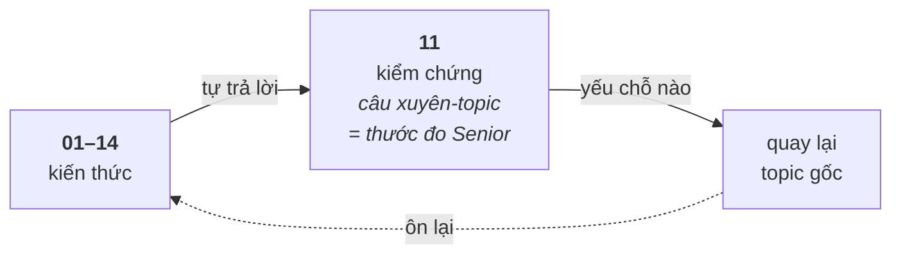

# 11 — Interview Questions

Tổng hợp câu hỏi phỏng vấn theo chủ đề và độ khó, **kèm đáp án đầy đủ nhưng ẩn đi** để bạn tự tư duy trước khi tham khảo.

## 🗺️ Bức tranh tổng thể

> **Sợi chỉ đỏ:** Topic này là nơi **kiểm chứng** mọi topic khác. Các file chia theo chủ đề cho tiện ôn, nhưng câu hỏi **giá trị nhất là câu nối nhiều topic** — đó là lúc lộ ra bạn *hiểu hệ thống* hay chỉ *thuộc phần*.

- **Mức độ khó tăng dần đo độ sâu:** 🟢 nhớ khái niệm → 🟡 hiểu cơ chế & so sánh → 🟠 đào bản chất → 🔴 đánh đổi/thiết kế/tình huống. Câu 🔴 hầu như luôn nối nhiều topic.
- **Ví dụ câu xuyên-topic** (xem thêm [OVERVIEW.md](../OVERVIEW.md)): *"context switch process vì sao tốn?"* (OS+memory), *"C++ ABI vì sao không ổn định?"* (C+++shared lib), *"crash ở field debug sao?"* (debug+embedded).
- **Dùng đúng cách:** đừng đọc đáp án để "biết thêm" — hãy **tự trả lời thành lời trước**, vì phỏng vấn đo khả năng *diễn đạt* chứ không chỉ *nhận ra*.

## Cách dùng (quan trọng)

1. Đọc câu hỏi, **tự trả lời** (nói thành lời hoặc viết ra) — đừng mở đáp án ngay.
2. Mở `
` để đối chiếu. So sánh: mình thiếu gì? sai chỗ nào? bản chất đã nắm chưa?
3. Câu nào còn yếu → quay lại tài liệu nền tảng tương ứng (có link).
4. Lý tưởng: nhờ Claude **review câu trả lời của bạn** trước khi xem đáp án mẫu (xem vai trò trong [CLAUDE.md](../CLAUDE.md)).

> Đáp án ở đây cô đọng theo kiểu "trả lời phỏng vấn". Giải thích sâu hơn nằm trong tài liệu nền tảng — mỗi file câu hỏi đều link về topic gốc.

## Phân loại độ khó

| Mức | Ý nghĩa | Kỳ vọng |
|-----|---------|---------|
| 🟢 **Cơ bản** | Khái niệm nền tảng | Middle phải trả lời trôi chảy |
| 🟡 **Trung bình** | Hiểu cơ chế + so sánh/lựa chọn | Middle+ cần nắm vững |
| 🟠 **Khó** | Đào sâu bản chất, tình huống | Hướng Senior |
| 🔴 **Senior** | Đánh đổi, thiết kế, kinh nghiệm | Phân biệt Senior |

## Bộ câu hỏi theo chủ đề

| File | Chủ đề | Topic gốc |
|------|--------|-----------|
| [cpp.md](cpp.md) | C/C++ & Modern C++ | [01](../01-cpp-fundamentals/), [02](../02-modern-cpp/) |
| [operating-system.md](operating-system.md) | Hệ điều hành | [03](../03-operating-system/) |
| [linux.md](linux.md) | Linux system programming | [04](../04-linux-system-programming/) |
| [drivers.md](drivers.md) | Driver, device tree, embedded | [05](../05-drivers-device-tree/), [08](../08-embedded-systems/) |
| [debugging.md](debugging.md) | Debugging & tools | [09](../09-debugging/) |
| [design-patterns.md](design-patterns.md) | Design patterns & SOLID | [12](../12-design-patterns/) |
| [dsa.md](dsa.md) | Cấu trúc dữ liệu & giải thuật | [13](../13-dsa/) |
| [networking.md](networking.md) | Mạng (TCP/IP, socket) | [14](../14-networking/) |
| [system-design.md](system-design.md) | Tư duy & thiết kế hệ thống | [10](../10-thinking/) |

> **Lưu ý:** mỗi tài liệu nền tảng (topic 01–10) cũng đã có phần "Câu hỏi phỏng vấn liên quan" ở cuối. File ở đây bổ sung thêm câu hỏi **xuyên chủ đề, theo độ khó, và dạng tình huống** mà phỏng vấn hay dùng.
