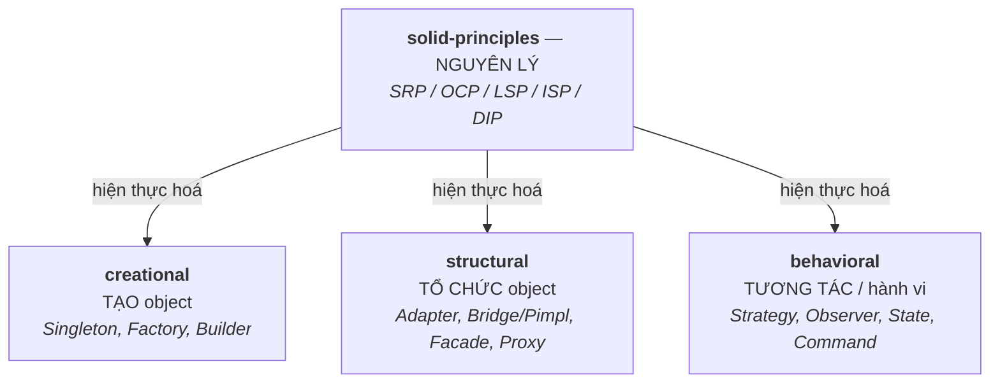

# 12 — Design Patterns

Các mẫu thiết kế (design pattern) hướng C++/embedded: giải pháp tái sử dụng cho các vấn đề thiết kế lặp lại. Đây là điểm cần nâng cấp (hiện mới nắm vài pattern đơn giản). Trọng tâm không phải thuộc lòng UML mà là **hiểu vấn đề pattern giải quyết, khi nào dùng/không, và đánh đổi** — vì lạm dụng pattern (over-engineering) cũng tệ như không biết.

## 🗺️ Bức tranh tổng thể

> **Sợi chỉ đỏ:** **SOLID là *nguyên lý* (vì sao), pattern là *hiện thực hoá* (làm thế nào).** Ba nhóm pattern chỉ là lời giải đóng gói cho ba loại vấn đề: tạo object, tổ chức object, để object tương tác.

- **SOLID đứng trên cùng:** vd Factory/Strategy hiện thực hoá Open/Closed + Dependency Inversion; pimpl phục vụ information hiding. Hiểu nguyên lý thì pattern là hệ quả tự nhiên.
- **Pattern là *công cụ*, không phải mục tiêu:** C++ hiện đại thay nhiều pattern bằng tính năng ngôn ngữ (lambda/`std::function` cho Strategy; `variant`+`visit` cho Visitor) — luôn cân nhắc over-engineering, nhất là embedded.
- **Nối với các topic:** pimpl ↔ [07/api-design](../07-shared-libraries/api-design.md); DIP ↔ HAL/testability [10/system-design](../10-thinking/system-design.md); Observer ↔ sự kiện sensor/GPIO [08](../08-embedded-systems/).
- **Câu hỏi tổng hợp:** *"Thiết kế hệ thống plugin trong C++"* — nối Factory (`creational`) + interface/DIP (`solid`) + `dlopen` ([07](../07-shared-libraries/linking-loading.md)).

## Tài liệu trong topic

| # | File | Nội dung | Trạng thái |
|---|------|----------|-----------|
| 1 | [solid-principles.md](solid-principles.md) | 5 nguyên lý SOLID — nền tảng để hiểu vì sao cần pattern | ✅ |
| 2 | [creational.md](creational.md) | Singleton, Factory, Builder — tạo object | ✅ |
| 3 | [structural.md](structural.md) | Adapter, Bridge/Pimpl, Facade, Proxy — cấu trúc object | ✅ |
| 4 | [behavioral.md](behavioral.md) | Strategy, Observer, State, Command — hành vi & tương tác | ✅ |

## Thứ tự đọc gợi ý
`solid-principles` (nền tảng) → `creational` → `structural` → `behavioral`.

## Nguyên tắc xuyên suốt
- **Pattern là công cụ, không phải mục tiêu.** Dùng khi vấn đề thật sự khớp, không "nhồi" pattern cho có.
- Nhiều pattern trong C++ hiện đại được thay bằng tính năng ngôn ngữ (lambda thay Strategy đơn giản, `std::function`, template).
- Embedded: cân nhắc chi phí (virtual, heap) của pattern trên hệ hạn chế tài nguyên.

## Liên kết
- Nền tảng OOP: [01-cpp-fundamentals/oop.md](../01-cpp-fundamentals/oop.md)
- Thiết kế API: [07-shared-libraries/api-design.md](../07-shared-libraries/api-design.md)
- Câu hỏi phỏng vấn: [11-interview-questions/design-patterns.md](../11-interview-questions/design-patterns.md)
