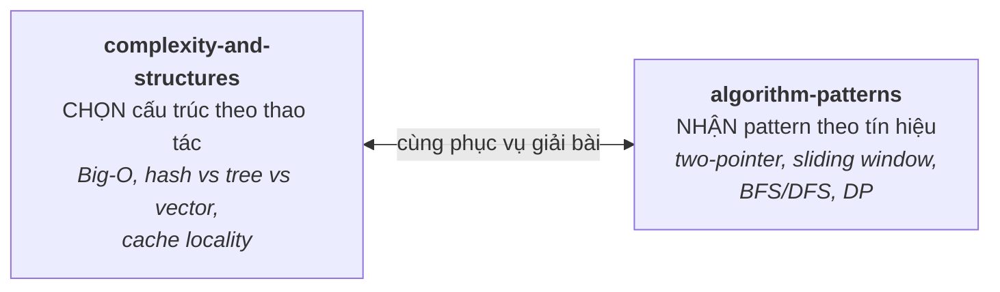

# 13 — Data Structures & Algorithms (cho phỏng vấn)

Ôn tập DSA cho vòng coding interview — cô đọng vì bạn đã ở mức ổn (Leetcode easy tốt, medium tàm tạm). Trọng tâm: **complexity analysis**, chọn đúng cấu trúc dữ liệu, và nhận diện **pattern giải bài** để xử lý medium tự tin hơn — không phải học thuộc lời giải.

## 🗺️ Bức tranh tổng thể

> **Sợi chỉ đỏ:** Giải bài coding = **chọn đúng cấu trúc dữ liệu** (theo thao tác chủ đạo) + **nhận đúng pattern giải thuật** (theo tín hiệu trong đề). Hai file là hai nửa của một kỹ năng.

- **Hai nửa bổ trợ:** nhận ra pattern (vd "đếm/đã thấy chưa" → cần tra cứu O(1)) thì biết chọn cấu trúc (hash map); và ngược lại, hiểu cấu trúc giúp ước lượng complexity của lời giải.
- **Luôn đi kèm phân tích Big-O** (time + space) — đây là "ngôn ngữ" đánh giá lời giải, và liên hệ cache locality với [03/memory-management](../03-operating-system/memory-management.md).
- **Nối với tư duy:** quy trình giải bài (làm rõ → brute force → tối ưu → test edge) là [10/problem-solving](../10-thinking/problem-solving.md) áp cho coding; đánh đổi time/space đặc biệt quan trọng trên embedded ([08/constraints](../08-embedded-systems/constraints.md)).
- **Câu hỏi tổng hợp:** *"Two-sum O(n) thế nào và đánh đổi gì?"* — nối pattern (hash map) + complexity (time-space).

## Tài liệu trong topic

| # | File | Nội dung | Trạng thái |
|---|------|----------|-----------|
| 1 | [complexity-and-structures.md](complexity-and-structures.md) | Big-O, chọn cấu trúc dữ liệu, STL container, trade-off | ✅ |
| 2 | [algorithm-patterns.md](algorithm-patterns.md) | two-pointer, sliding window, BFS/DFS, binary search, DP — nhận diện & áp dụng | ✅ |

## Thứ tự đọc gợi ý
`complexity-and-structures` → `algorithm-patterns`. Sau đó luyện trên Leetcode theo từng pattern.

## Nguyên tắc luyện tập
- **Nhận diện pattern** trước khi code: bài này thuộc dạng nào? → áp khung quen thuộc.
- Luôn **phân tích complexity** (time + space) và nêu trước khi tối ưu.
- **Think aloud** ([problem-solving](../10-thinking/problem-solving.md)): làm rõ ràng buộc, ví dụ nhỏ, brute force trước rồi tối ưu.

## Liên kết
- Tư duy giải quyết vấn đề: [10-thinking/problem-solving.md](../10-thinking/problem-solving.md)
- Câu hỏi phỏng vấn: [11-interview-questions/dsa.md](../11-interview-questions/dsa.md)
