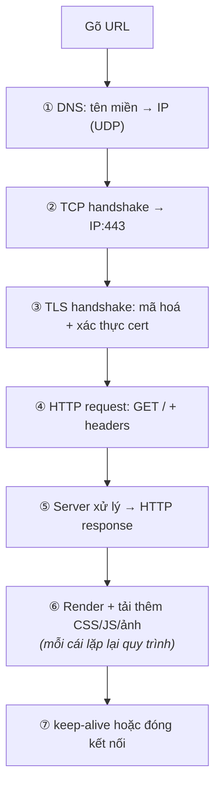

# Socket Programming & Application Protocols

> **TL;DR**
> - **Socket** là endpoint giao tiếp — API thống nhất cho TCP/UDP, local (Unix domain) hay qua mạng.
> - **TCP server flow**: `socket → bind → listen → accept → read/write → close`. **Client**: `socket → connect → read/write → close`.
> - Phục vụ nhiều client: thread-per-connection (đơn giản, tốn) hoặc **event loop + epoll** (scale, xem [io-multiplexing](../04-linux-system-programming/io-multiplexing.md)).
> - **HTTP**: giao thức ứng dụng request/response trên TCP; stateless. **TLS**: lớp mã hóa/xác thực dưới HTTP (→ HTTPS). **MQTT/CoAP**: nhẹ, phổ biến cho IoT/embedded.
> - "Điều gì xảy ra khi gõ URL" là câu kinh điển tổng hợp DNS → TCP → TLS → HTTP.

---

## 1. Socket API — luồng cơ bản

Socket là sự tổng quát hóa file descriptor cho giao tiếp mạng (cùng `read`/`write`/`close`).

```c
// ===== TCP SERVER =====
int s = socket(AF_INET, SOCK_STREAM, 0);   // tạo socket (TCP=SOCK_STREAM)
bind(s, addr, len);                         // gắn vào IP:port
listen(s, backlog);                         // chuyển sang chế độ nghe
int c = accept(s, ...);                     // chờ & nhận một kết nối → fd mới cho client
read(c, buf, n); write(c, resp, m);         // trao đổi dữ liệu
close(c); close(s);

// ===== TCP CLIENT =====
int s = socket(AF_INET, SOCK_STREAM, 0);
connect(s, serverAddr, len);                // chủ động kết nối tới server
write(s, req, n); read(s, buf, m);
close(s);
```

- `AF_INET`/`AF_INET6` = mạng IPv4/IPv6; `AF_UNIX` = cùng máy. `SOCK_STREAM`=TCP, `SOCK_DGRAM`=UDP.
- **UDP** không `listen`/`accept`/`connect` (tùy chọn): dùng `sendto`/`recvfrom` với địa chỉ mỗi gói.
- `accept` trả về **fd mới** cho mỗi client; socket nghe (`s`) tiếp tục nhận kết nối khác.

---

## 2. Phục vụ nhiều client — các mô hình

| Mô hình | Cách làm | Đánh đổi |
|---------|----------|----------|
| **Thread/process per connection** | Mỗi client một thread (hoặc fork) blocking | Đơn giản; tốn RAM/context switch khi nhiều kết nối |
| **Thread pool** | Tập thread cố định nhận việc từ hàng đợi | Giới hạn tài nguyên; phức tạp hơn |
| **Event loop + epoll** | Một (vài) thread + non-blocking I/O + epoll | Scale tới hàng chục nghìn kết nối; "không bao giờ block" |

Mô hình **event loop** là chuẩn cho server hiệu năng cao (Nginx/Redis) — chi tiết ở [io-multiplexing](../04-linux-system-programming/io-multiplexing.md). Nguyên tắc: I/O non-blocking, không chặn loop; tác vụ CPU nặng đẩy sang thread riêng.

---

## 3. Vài vấn đề thực tế khi lập trình socket

- **TCP là luồng byte, không có ranh giới message**: một `read` có thể nhận một phần hoặc nhiều message gộp lại → phải tự **framing** (độ dài prefix, hoặc delimiter). Lỗi phổ biến của người mới.
- **Short read/write**: phải lặp tới khi đủ (như [file-io](../04-linux-system-programming/file-io.md)).
- **`SIGPIPE`**: ghi vào socket đã đóng đầu kia → nên ignore và xử lý `EPIPE`.
- **Byte order**: dùng `htons`/`htonl` chuyển port/IP sang network byte order (big-endian).
- **`SO_REUSEADDR`**: cho phép bind lại nhanh sau khi server restart (tránh "Address already in use" do `TIME_WAIT`).

---

## 4. HTTP — giao thức ứng dụng phổ biến nhất

HTTP là giao thức **request/response** chạy trên TCP, dạng text (HTTP/1.1):
```
GET /api/data HTTP/1.1          ← request line (method, path, version)
Host: example.com               ← headers
Accept: application/json

                                ← dòng trống ngăn header/body
```
```
HTTP/1.1 200 OK                 ← status line (version, code, lý do)
Content-Type: application/json
Content-Length: 27

{"temperature": 25.3}           ← body
```

- **Method**: GET (đọc), POST (tạo), PUT (cập nhật), DELETE (xóa)...
- **Status code**: 2xx thành công, 3xx redirect, 4xx lỗi client, 5xx lỗi server.
- **Stateless**: mỗi request độc lập; trạng thái duy trì qua cookie/token.
- HTTP/2 (nhị phân, multiplexing), HTTP/3 (trên QUIC/UDP) cải thiện hiệu năng.

---

## 5. TLS & các giao thức embedded/IoT

- **TLS** (Transport Layer Security): lớp mã hóa + xác thực giữa TCP và application → HTTP+TLS = **HTTPS**. Cung cấp bảo mật (mã hóa), toàn vẹn (chống sửa), xác thực (certificate). Handshake TLS thiết lập khóa phiên.
- **MQTT**: giao thức **publish/subscribe** nhẹ trên TCP — chuẩn de-facto cho IoT (thiết bị publish dữ liệu lên broker, bên quan tâm subscribe). Tiết kiệm băng thông, hợp thiết bị tài nguyên ít.
- **CoAP**: giống HTTP nhưng trên UDP, rất nhẹ — cho thiết bị cực hạn chế.
- Embedded thường dùng **lwIP** (lightweight TCP/IP stack) + mbedTLS thay vì stack đầy đủ.

---

## 6. "Điều gì xảy ra khi gõ một URL?" (câu tổng hợp kinh điển)

1. **DNS**: phân giải tên miền → địa chỉ IP (truy vấn DNS, chủ yếu UDP).
2. **TCP handshake**: thiết lập kết nối tới IP:443 (three-way handshake).
3. **TLS handshake**: thỏa thuận mã hóa, xác thực certificate, tạo khóa phiên (với HTTPS).
4. **HTTP request**: gửi `GET /` + headers.
5. **Server xử lý** và trả **HTTP response** (HTML/JSON...).
6. **Render**: trình duyệt phân tích, tải thêm tài nguyên (CSS/JS/ảnh — mỗi cái lặp lại quy trình), hiển thị.
7. Đóng/giữ kết nối (keep-alive để tái dùng).



Câu này hay vì nó xâu chuỗi toàn bộ stack: DNS → TCP → TLS → HTTP → ứng dụng — thể hiện hiểu biết hệ thống đầu-cuối.

---

## Câu hỏi phỏng vấn liên quan

> Đáp án sống trong [bank/](../14-prep/mock-interview/bank/) — **một đáp án, một chỗ** ([CLAUDE.md §4.7](../CLAUDE.md)). Tự trả lời trước khi mở.

| ID | Câu hỏi |
|----|---------|
| [NET-003](../14-prep/mock-interview/bank/networking.md) | Mô tả luồng tạo một TCP server bằng socket API. |
| [NET-007](../14-prep/mock-interview/bank/networking.md) | TCP là luồng byte — điều này gây vấn đề gì khi lập trình? Giải quyết thế nào? |
| [NET-009](../14-prep/mock-interview/bank/networking.md) | Làm sao một server xử lý hàng nghìn kết nối đồng thời? |
| [NET-006](../14-prep/mock-interview/bank/networking.md) | HTTP là gì? "Stateless" nghĩa là gì? |
| [NET-011](../14-prep/mock-interview/bank/networking.md) | TLS cung cấp gì? HTTPS hoạt động thế nào ở mức cao? |
| [NET-012](../14-prep/mock-interview/bank/networking.md) | Giao thức nào phù hợp cho thiết bị IoT/embedded và vì sao? |

---
⬅️ [tcp-ip.md](tcp-ip.md) · ➡️ Về [README chính](../README.md)
